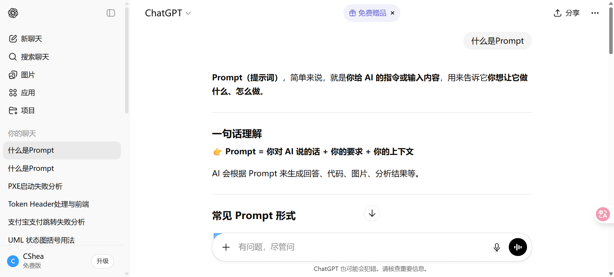
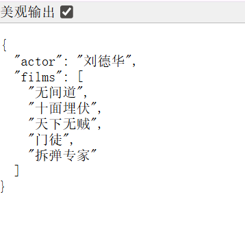
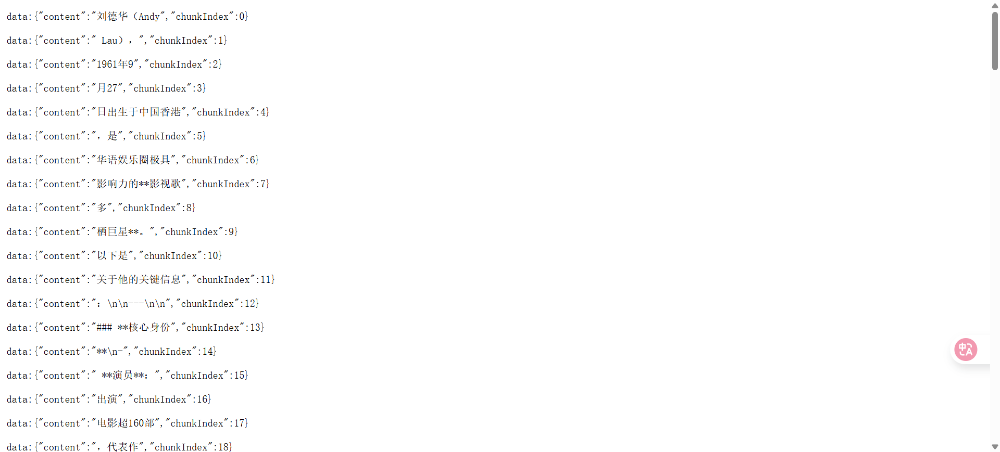
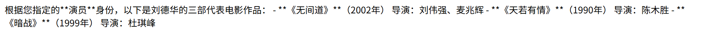
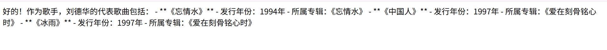
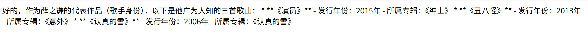

# AI大模型
AI大模型是指通过海量数据和超大规模参数构建的深度神经网络系统
## 基本概念
### Prompt
Prompt最初是NLP（自然语言处理）研究者为下游任务设计出来的一种任务专属的输入模版，类似于一种任务对应一种Prompt。我没每一次访问大模型的输入为一个Prompt，大模型返回给我们的结果则被称为Completion

例如在上述图中，”什么是Prompt“就是我们的提问，也是这一次的Prompt，而ChatGPT返回给我们的回答结果也就是这一次的Completion
### Temperature
LLM生成是具有随机性的，在模型的顶层通过选取不同预测概率的预测结果来生成最后的结果。一般可以通过控制temperature参数来控制LLM生成结果的随机性与创造性
Temperature的取值一般在0~1之间，当取值接近0时，预测的随机性会较低，产生更保守、可预测的文本，不太可能产生意想不到或不寻常的词。而当取值接近1时，预测的随机性会较高，会产生更有创意，更多样化的文本，更有可能产生意想不到的词。
### System Prompt
System Prompt是随着ChatGPT API开放并逐步得到大量使用的一个概念，它是大模型服务方为了提升用户体验所设置的一种策略
即在使用ChatGPT API时，可以设置两种Prompt，一种是System Prompt，这种Prompt内容会在整个会话过程中持久地影响模型的回复，且相比于普通的Prompt具有更高的重要性。另一种是User Prompt，即普通的Prompt，即需要模型做出回复的输入
例如，我们可以设置
```
{ 
	"system prompt": "你是一个幽默风趣的个人知识库助手，可以根据给定的知识库内容回答用户的提问，注意，你的回答风格应是幽默风趣的", 
	"user prompt": "我今天有什么事务？" 
}
```
根据上述Prompt的构造，我们可以让模型以幽默风趣的风格回答用户提出的问题
## 本地部署AI大模型
### 部署Ollama
Ollama是一个开源框架，专为在本地机器上便捷部署和运行大语言模型（LLM）而设计

虚拟机内存>4G，CPU数量>=4个
```
mkdir -p /usr/local/ollama
docker run -d -p 11434:11434  --cpus=4  --memory=4g --memory=4g -v /usr/local/ollama:/root/.ollama --name ollama ollama/ollama
```
下载并运行模型
```
docker exec -it ollama ollama run deepseek-r1:1.5b
```
按照上述方法即可在本地部署deepseek-r1模型
## Spring AI
父项目中导入以下项目
```xml
<properties>    
	<project.build.sourceEncoding>UTF-8</project.build.sourceEncoding>  
    <!-- Spring AI -->   
    <spring-ai.version>1.0.0 </spring-ai.version>  
    <!-- Spring AI Alibaba -->   
    <spring-ai-alibaba.version>1.0.0.2</spring-ai-alibaba.version>  
    <!-- Spring Boot -->    
    <spring-boot.version>3.4.5</spring-boot.version>  
 </properties>
 <!--_ _依赖Jar__包版本管理 -->  
 <dependencyManagement>    
	 <dependencies>  
		 <dependency>  
	        <groupId>org.springframework.boot</groupId>  
	        <artifactId>spring-boot-dependencies</artifactId>  
	        <version>${spring-boot.version}</version>  
	        <type>pom</type>  
	        <scope>import</scope>  
	     </dependency>  
		<dependency>  
	        <groupId>org.springframework.ai</groupId>  
	        <artifactId>spring-ai-bom</artifactId>  
	        <version>${spring-ai.version}</version>  
	        <type>pom</type>  
	        <scope>import</scope>  
	    </dependency>  
        <dependency>  
	        <groupId>com.alibaba.cloud.ai</groupId>  
	        <artifactId>spring-ai-alibaba-bom</artifactId>  
	        <version>${spring-ai-alibaba.version}</version>
			<type>pom</type>  
	        <scope>import</scope>  
        </dependency>  
    </dependencies>  
</dependencyManagement>
```
1. 在子项目导入依赖（本地模型接入）
```xml
<dependency>  
	<groupId>org.springframework.ai</groupId>  
    <artifactId>spring-ai-ollama-spring-boot-starter</artifactId>
	<version>1.0.0-M6</version>  
</dependency>
```
核心配置 application.yml
```yml
server:
  port: 9091
spring:
  application:
    name: ollama-ai
    ai:
      ollama:
      base-url: http://192.168.100.104:11434
      chat:
        model: deepseek-r1:1.5b
```
2. 百炼平台AI模型接入
```xml
 <dependency>  
    <groupId>com.alibaba.cloud.ai</groupId>  
    <artifactId>spring-ai-alibaba-starter-dashscope</artifactId>  
  </dependency>
```
核心配置application.yml
```yml
server:
  port: 9092
spring:
  application:
    name: alibaba-ai
    ai:
      dashscope:
        api-key: ${ALIBABA_API_KEY}
        #api-base-url: https://api.dashscope.com/api/v1 #可以省略
        chat:
          options:
            model: deepseek-r1 #模型可自行选择
```
### 对话客户端
Spring AI Alibaba的ChatClient是用于与AI模型交互的核心抽象接口，支持同步和响应式编程模型
**创建模型**
ChatClient是使用ChatClient.Builder对象。通过ChatClient.Builder对象可以获得其实例
1. 使用自动配置的ChatClient.Builder
```java
@RestController
@RequestMapping("/ai/chat")
public class ChatController{
	private final ChatClient chatClient;
	// 构造方法注入
	public ChatController(ChatClient.Builder builder){
		this.chatClient = builder.build();
	}
}
```
2. 编程式创建ChatClient
```java
@Configuration
public class ChatClientConfig{
	// 通过此方式可以创建多个ChatClient实例
	@Bean
	public ChatClient chatClient(ChatModel model){
		return ChatClient.builder(model).build();
	}
}
```
**Prompt**
构建AI模型交互的核心方法（链式调用）：
prompt()：作为链式调用的七点，用于初始化提示词的构建流程，返回一个PromptBuilder实例
user()：用于设置用户输入的提示词内容，通常直接接收用户的问题或指令，该方法支持动态参数替换，可通过占位符实现模版化输入
call()：触发实际的AI模型调用，将组装好的prompt发送给模型并返回ChatResponse对象。
**响应处理方式**
1. 同步阻塞式响应
客户端发送Prompt后需要等待服务端生成完整的响应，一次性返回所有数据。适用于结果较小或需要等待完整数据再处理的场景，如批量文本生成、数据分析
```java
	@GetMapping("/chat")  
	public String chat(@RequestParam("question") String question) {  
	    return chatClient.prompt()// 创建一个新的ai对话提示  
            .user(question)// 传入用户输入的问题  
            .call() // 向ai发送请求并获取相应  
            .content(); // 提取ai回复的文本并返回  
	}
```
2. 流式响应
流式响应是一种逐步返回数据的通信模式，通过分批次传输数据，实现低延迟的实时交互体验，减少服务端内存占用。（现在市面上AI模型的回复）适合大模型生成场景，如实时对话式的逐字显示AI回复，长文本式的报告生成等耗时任务，大文件传输的分块下载或上传技术实现
```java
	@GetMapping(value = "/stream",
	produces = MediaType.TEXT_EVENT_STREAM_VALUE)  
	public Flux<String> stream(@RequestParam("question") String question){  
	    return chatClient.prompt()  
            .user(question)  
            .stream() // 获取流式响应回复  
            .content();  
	}
```
基于Spring WebFlux的Flux类型实现异步非阻塞处理；通过stream()方法触发流式处理，返回Flux对象；底层依赖SSE(Server-Sent Events)或WebSocket协议传输
**tips**：produces = MediaType.TEXT_EVENT_STREAM_VALUE是Spring框架中用于声明接口响应类型的配置，核心作用是指定接口返回Server-Sent Events(SSE)格式的响应，而非普通的JSON/HTML等格式
SSE的核心思想是：客户端发起一个请求，服务器保持这个连接打开并在有新数据时，通过这个连接将数据发送给客户端。这与传统的请求-响应模式（客户端请求一次，服务器响应一次，连接关闭）有本质区别
响应格式为text/event-stream
连接保持长活，服务端可分批次向客户端推送数据
数据以特定格式（data：内容\n\n）逐行发送，客户端可监听message事件接收数据
3. 结构化输出
结构化输出是指通过预定义的数据模型（如JSON Schema、XML模板或编程对象）约束大语言模型LLM的生成结果，使其符合特定格式要求的技术。其核心目标是实现自然语言道程序化数据的转换，例如将AI返回的JSON数据自动映射为Java对象
```java
@Data  
public class ActorFilms {  
    private String actor;  
    private List<String> films;  
}
```
```java
@GetMapping("/movies")  
public ActorFilms movies(@RequestParam("question") String question){  
    return chatClient.prompt()  
            .user(question)  
            .call()  
            .entity(ActorFilms.class);  
}
```

可以看到，上述方法直接返回了一个指定的json对象，避免了手动转换的麻烦
```java
@Data  
@NoArgsConstructor  
@AllArgsConstructor  
@JsonInclude(JsonInclude.Include.NON_NULL)  
public class StreamChunkDTO {  
  
    /**  
     * 分块内容  
     */  
    private String content;  
  
    /**  
     * 分块索引  
     */  
    private Integer chunkIndex;  
}
```
```java
@GetMapping(value = "/chunk",produces = MediaType.TEXT_EVENT_STREAM_VALUE)  
public Flux<StreamChunkDTO> streamChat(@RequestParam("question") String question){  
    return chatClient.prompt()  
            .user(question)  
            .stream()  
            .content()  
            .index()  
            .map(tuple -> {  
                String content = tuple.getT2();  
                Long index = tuple.getT1();  
                return new StreamChunkDTO(content,index.intValue());  
            });  
}
```

返回的数据全都已经分块
index()：
添加索引信息：为流中的每个元素分配一个递增的索引值，从0开始
返回类型变化：将原本的内容流转换为包含索引和内容的元组（Tuple）流，调用.index()后，每一段内容都会被包装成一个Tuple<Long,String>，其中getT1()返回索引值，getT2()返回实际的内容片段
**系统消息**
系统消息（System Message）是用于指导大语言模型（LLM）行为的关键输入类型，通常用于初始化模型角色的设定对话规则。系统消息可以控制大模型的角色定义，行为约束，权重优先级等。
system()可以通过lambda表达式构建系统提示;使用text()方法直接传入提示模板;通过param()方法逐个添加参数


**PromptTemplate**
PormptTemplate是一个用于简化Prompt构建和管理的核心组件，通过模版化发方式实现动态内容注入和结构化提示创建
PromptTemplate通过变量映射Map的值，替换掉模版字符串中相应的参数占位符，从而拼接成最终的Prompt发送给ai模型
```java
@GetMapping("/workstemp")  
public String getWorksByRoleTemp(@RequestParam("role") String role,  
                                 @RequestParam("name") String name,  
                                 @RequestParam(defaultValue = "列出代表作品",value="question") String question){  
    String systemPrompt= """  
            你当前的身份是{role}，正在回答关于{name}的咨询。  
                        请根据以下规则响应：  
                        1. 当role包含singer或歌手时：  
                           - 用Markdown列表展示{name}的3首代表歌曲  
                           - 每首标注发行年份和所属专辑  
                        2. 当role包含actor或演员时：  
                           - 用Markdown列表展示{name}的3部代表电影  
                           - 每部标注上映年份和导演  
                        """;  
    PromptTemplate pt = new PromptTemplate(systemPrompt);  
    Prompt p = pt.create(  
            Map.of("role", role, "name", name)  
    );  
    return chatClient.prompt(p)  
            .user(question)  
            .call()  
            .content();  
}
```

**对话记忆**
对话记忆是指大模型在连续多轮对话中，记住并运用之前对话内容的能力。它使得对话不再是孤立的问答，而成为有上下文的连贯交流
大模型本身是无状态的，每次被调用时，它只处理当前的输入，不会自动记住之前的对话，因此“记忆”功能需要通过外部实现
Spring AI提供了聊天记忆仓库接口 ChatMemoryRepository 用于存储聊天的抽象
1. 默认情况下，如果没有其他仓库已配置，Spring AI会自动配置聊天记忆仓库类型为内存，实现类为InMemoryChatMemoryRepository
2. 采用Redis的List数据结构存储对话消息序列，每个会话(conversationId)作为独立的Key，通过RPUSH/LRANGE操作实现消息的追加和范围查询，该方案相比于内存存储方案具有数据持久化、分布式支持等优势，且Redis具有更高的吞吐量和更低的延迟特性
```xml
<dependency>
  <groupId>com.alibaba.cloud.ai</groupId>
  <artifactId>spring-ai-alibaba-starter-memory-redis</artifactId>
</dependency>
<dependency>
  <groupId>redis.clients</groupId>
  <artifactId>jedis</artifactId>
</dependency>
```
通过RedisConfig来配置RedisChatMemoryRepository所需要的配置
```java
@Configuration  
public class RedisConfig {  
  
    @Value("${spring.data.redis.host}")  
    private String host;  
  
    @Value("${spring.data.redis.port}")  
    private int port;  
  
    @Value("${spring.data.redis.password}")  
    private String password;  
  
    @Bean  
    public RedisChatMemoryRepository redisChatMemoryRepository() {  
        return RedisChatMemoryRepository.builder()  
                .host(host)  
                .port(port)  
                .password(password)  
                .build();  
    }  
}
```
配置ChatClient
```java
@Configuration  
public class ChatClientConfig {  
  
    @Bean  
    public ChatClient chatMemoryClient(ChatModel chatModel,  
                                       RedisChatMemoryRepository redisChatMemoryRepository) {  
        MessageWindowChatMemory memory = MessageWindowChatMemory.builder()  
                .maxMessages(10)  
                .chatMemoryRepository(redisChatMemoryRepository)  
                .build();  
        return ChatClient.builder(chatModel)  
                .defaultAdvisors(  
                        MessageChatMemoryAdvisor.builder(memory).build()  
                ).build();  
    }  
}
```
接口方法
```java
@GetMapping("/memory")  
public String memory(  
        @RequestParam("question") String question,  
        @RequestParam("userId") String userId  
){  
    return chatMemoryClient.prompt()  
            .user(question)  
            .advisors(a -> a.param(ChatMemory.CONVERSATION_ID,userId))  
            .call()  
            .content();  
}
```
**MessageWindowChatMemory**
消息WindowChatMemory维护一个最大
