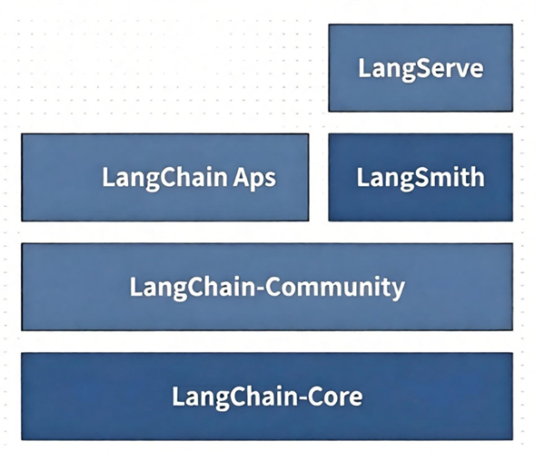
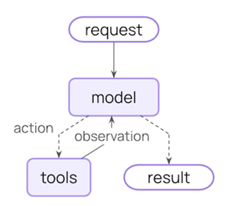
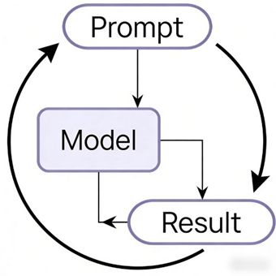
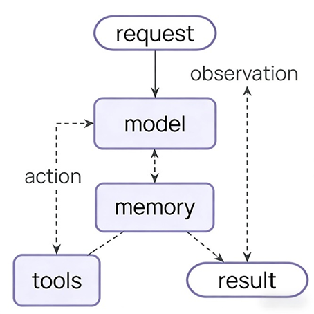
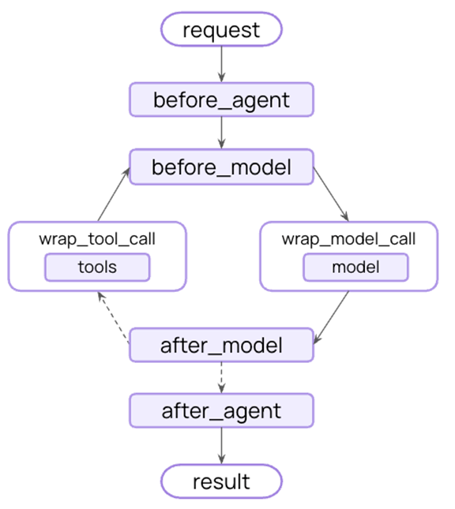

# LangChain
LangChain分为六个部分，分别是
- Models：负责处理自然语言输入并生成响应，是整个系统的大脑。例如OpenAI的GPT模型
- Prompts：为模型提供输入指令，引导模型生成特定类型的响应
- Indexes：用于存储和检索外部数据，支持模型访问知识库或数据库
- Memory：存储对话历史或上下文信息，使模型能够记住之前的交互
- Chains：将多个组件串联起来，兴盛一个完整的处理流程
- Agents：负责协调和管理其他组件，根据任务需求动态选择和调用合适组件
LangChain的分层生态系统是其“模块化、可解耦、按需扩展”设计理念的核心
LangChain的分层生态系统如图

- LangChain Core（核心抽象层）
	LangChain生态的低级，定义了所有上层组件的核心抽象接口和基础逻辑，含任何具体的第三方集成，仅提供标准化的骨架
	有统一的全生态的核心接口，比如Runnable（所有可执行组件的基类，invoke()/stream()/batch()方法均来自于这个抽象），BaseLanguageModel（所有大模型的基类），BasePromptTemplate（提示词的基类）
	提供了基础的数据结构，比如Message，Document
	解耦上层逻辑，无论集成哪个大模型，都遵循Core层的接口，切换集成模型时无需修改核心代码
- LangChain Community（社区集成层）
	对接第三方生态的集成层，由社区维护，包含非官方核心合作的第三方工具/模型/数据源的集成实现
	低成本对接生态，比如阿里百炼，国内大模型，开源想粮库，文档加载器等
	兼容Core层接口，所有集成都遵循Core层的抽象
- LangChain Apps（应用构建层）
	基于底层抽象/集成层封装的高阶应用组件，面向应用开发者，无需关注底层接口，直接复用预制的场景化能力
	降低应用开发门槛，封装了常见场景的完整逻辑，比如RAG，智能代理，多轮对话机器人
	提供预制模板，比如RetrievalQA（知识库问答链）就属于这一层的预制组件
- LangServe+LangSmith（部署运维层）
	面向生产环境的部署、调试、监控层，解决"开发完应用如何上线、如何排查问题"的核心需求
## Agent
LangChain作为AI应用的开发框架，提供了完整的智能体生态，核心是让LLM自主决定使用哪些工具，执行哪些步骤来完成任务
LangChain Agent的核心组件如下
- Agent：决策者，负责规划和选择工具
- Tools：执行器，智能体可调用的外部功能
- Memory：记忆系统，存储对话历史和中间结果
- LLM：推理引擎，提供语言理解和决策能力
- OutputParser：结果解析器，提取结构化输出
核心智能体循环包括调用模型，是否选择要执行的工具，然后当它不在调用工具时结束

- 输入请求(request)：用户的问题或指令作为初始输入，传递给核心的model
- 模型决策(model)：这是整个流程的核心。模型会分析输入的请求，判断是否需要调用外部工具
	- 如果不需要，直接生成结果(result)返回给用户
	- 如果需要，就生成一个具体的工具调用指令（action）。外部工具接收到模型的action指令后，执行响应的操作，然后将执行结果作为观察数据（observation）返回给模型
- 结果生成(result)：模型会结合原始请求、工具返回的observation，最终生成准确的回答
```python
import os  
from dotenv import load_dotenv  
from langchain_openai import ChatOpenAI  
from langchain.agents import create_agent  
load_dotenv()  
  
api_key = os.getenv("OPENAI_API_KEY")  
  
llm = ChatOpenAI(  
    base_url="https://api.siliconflow.cn",  
    model="Qwen/Qwen3-8B",  
    api_key=api_key,  
)  
system_prompt = "你是一个翻译专家，请将中文翻译成英文"  
agent = create_agent(model=llm,system_prompt=system_prompt)  
  
messages=["我是一个热爱学习的机器人"]  
result=agent.invoke({"messages":messages})  
print(result["messages"][-1].content)
```
### 示例
构建一个实用的天气智能体
```python
import os  
import requests  
from dotenv import load_dotenv  
from langchain.agents import create_agent  
from langchain.tools import tool  
from langgraph.checkpoint.memory import InMemorySaver  
from pydantic import BaseModel,Field  
from langchain_openai import ChatOpenAI  
  
load_dotenv()  
  
system_prompt = ("你是一个精通天气预报的专家，你可以使用下面的工具："  
                 "-get_weather_for_location：查询特定城市的天气")  
  
@tool # 创建工具，工具允许模型通过调用定义的函数与外部系统交互  
def get_weather_for_location(city:str)->str:  
    """  
    获取一个给定城市的天气  
    :param city: 城市中文  
    :return: 天气对象，包含查询状态、天气信息或错误描述  
    """    url=f"https://wttr.in/{city}?format=3"  
    headers={"User-Agent":"Mozilla/5.0"}  
    response=requests.get(url,headers=headers,timeout=100)  
    weather_info = response.text.strip()  
    if not weather_info:  
        return f"未查询到{city}的天气信息"  
    return weather_info  
  
llm = ChatOpenAI(  
    base_url="https://api.siliconflow.cn",  
    api_key=os.getenv("OPENAI_API_KEY"),  
    model="Qwen/Qwen3-8B",  
)  
  
# 定义响应格式  
class WeatherOutput(BaseModel):  
    """获取城市天气的输出结果模型"""  
    city:str = Field(description="查询到城市名称")  
    temperature:str = Field(description="温度（如25℃）")  
    weather:str = Field(description="天气状况（如：晴）")  
  
# 添加记忆，为智能体添加记忆，以在交互过程中保持状态。这允许智能体记住之前的对话和上下文  
checkpointer = InMemorySaver()  
  
# 创建代理并运行  
agent = create_agent(  
    model=llm,  
    system_prompt=system_prompt,  
    tools=[get_weather_for_location],  
    response_format=WeatherOutput,  
    checkpointer=checkpointer,  
)  
  
if __name__ == "__main__":  
    config = {"configurable":{"thread_id":"1"}}  
    resp = agent.invoke(  
        {"messages":[{"role":"user","content":"今天南昌的天气如何"}]},  
        config=config,  
    )  
    print(resp['structured_response'])
```
### 构建基础智能体
一个基础的智能体包含三个组件

- Prompt是输入与指令，它是用户向模型传达意图、提供上下文和设定任务的具体文本。Prompt的质量和清晰度直接决定了模型的理解方向和输出边界
- Model是处理与生成的核心，模型接收Prompt后，基于其预训练获得的海量知识所形成的能力，对输入进行理解、推理和计算，最终生成一个概率分布，指向最可能的文本序列
- Result是输出与反馈，它是模型处理Prompt后产生的最终文本输出。Result既是流程的重点，夜场作为评估和优化Prompt与模型效果的起点，形成反馈循环
用户意图通过Prompt表达，Model将Prompt转化为内部表示并进行计算，最终输出Result，Result的质量反过来可以指导用户优化Prompt或开发者该井Model
```python
import os  
from dotenv import load_dotenv  
from langchain_openai import ChatOpenAI  
  
load_dotenv()  
  
api_key = os.getenv("OPENAI_API_KEY")  
messages = [  
    ("system","你是一个农业专家，请为我答疑"),  
    ("human","冬天下雪，会给来年作物生长带来哪些方面的好处")  
]  
  
llm = ChatOpenAI(  
    base_url="https://api.siliconflow.cn",  
    api_key=api_key,  
    model="Qwen/Qwen3-8B",  
)  
  
res = llm.invoke(messages)  
print(res)
```
```text
content='冬天下雪对来年作物生长有许多潜在的好处，主要体现在以下几个方面：\n\n---\n\n### 一、**保温作用**\n- ...' additional_kwargs={'refusal': None} response_metadata={'token_usage': {'completion_tokens': 915, 'prompt_tokens': 38, 'total_tokens': 953, 'completion_tokens_details': {'accepted_prediction_tokens': None, 'audio_tokens': None, 'reasoning_tokens': 0, 'rejected_prediction_tokens': None}, 'prompt_tokens_details': None}, 'model_provider': 'openai', 'model_name': 'Qwen/Qwen3-8B', 'system_fingerprint': '', 'id': '019cd2dc0e6b2d0aae7e25aca434cf2b', 'finish_reason': 'stop', 'logprobs': None} id='lc_run--019cd2dc-0c4d-7c22-9ed2-eee7c5738198-0' tool_calls=[] invalid_tool_calls=[] usage_metadata={'input_tokens': 38, 'output_tokens': 915, 'total_tokens': 953, 'input_token_details': {}, 'output_token_details': {'reasoning': 0}}
```
#### 消息
消息是LangChain中模型上下文的基本单位。它们代表模型的输入和输出，承载与LLM交互时表示对话状态所需的内容和元数据
消息是包含以下内容的对象
- 角色，识别消息类型（例如 system，user，human）
- 内容，表示消息的实际内容（如 文本，图像，音频，文档等）
- 元数据，可选字段（如响应信息，消息ID和令牌使用情况）
在LangCHain和LLM的交互体系中，提示词和消息是紧密关联但层次不同的概念，消息是承载提示词的结构化载体，提示词是消息中传递给模型的核心指令内容
- 提示词：传递给模型的指令、问题、上下文信息的综合。明确模型的任务目标，应到模型生成预期输出
- 消息：LangChain/LLM交互中标准化的通信格式，包含角色、内容等。元数据区分对话角色，携带上下文历史，让模型理解对话逻辑
在LangChain的对话式交互中，用户输入的提示词会被封装成HumanMessage，而模型的输出会被封装成AIMessage
消息对象有 SystemMessage、HumanMessage、AIMessage，这些对象都由langchain.messages包提供
- SystemMessage：表示一组初始指令，用于预设模型的行为。可以使用系统消息来设置语气、定义模型的角色并建立响应指南
- HumanMessage：表示用户输入和交互。可以包含文本、图像、音频、文件以及任何其他多模态内容
- AIMessage：当调用模型时，模型会返回AIMessage对象，其中包含响应中的所有相关元数据
- ToolMessage：当模型调用工具时，工具执行结束后会返回ToolMessage，其中包含响应中的所有相关元数据
创建消息有三种方式
- 调用消息对象
```python
from langchain.messages import SystemMessage,HumanMessage  
messages = [  
    SystemMessage("你是一个农业专家，请为我答疑"),  
    HumanMessage("请告诉我如何预防橘子的黑点病")  
]
```
- 使用字典
```python
messages = [  
    {"role":"system","content":"你是一个农业专家，请为我答疑"},  
    {"role":"human","content":"请告诉我如何预防橘子的黑点病"}  
]
```
- 使用元组
```python
messages = [  
    ("system","你是一个农业专家，请为我答疑"),  
    ("human","请告诉我如何预防橘子的黑点病")  
]
```
因为ai模型会区分消息的来源，所以我们可以利用AIMessage手动造一条AI的回复插入对话记录中，让模型后续处理是把这条回复当成真实的上下文，从而达到一些目的
```python
messages_again = [
	("ai","如果你要购买桔子，我会告诉你挑选没有黑点病桔子的方法"),
	("human","我想买1公斤桔子")
]
```
#### 消息模版
LangChain的消息末班是标准化Prompt结构、动态填充变量、支持多角色对话的核心工具，适用于单轮生成、多轮对话、工具调用等场景
LangChain中消息模板主要是ChatPromptTemplate，用于创建灵活的模版化提示
ChatPromptTemplate是LangChain框架中专门用于构建多轮对话提示的模板类，它的核心是按消息角色定义模版结构，而占位符就是模板中用`{变量名}`表示的，运行时会被真实内容替换的位置
**创建模版方法**
- from_messages()
```python
def from_messages(  
    cls,  
    messages: Sequence[MessageLikeRepresentation],  
    template_format: PromptTemplateFormat = "f-string",  
) -> ChatPromptTemplate:
```
```python
from langchain_core.prompts import ChatPromptTemplate  
from test3 import llm  
system_prompt = "你是一名农业电商文案专家，根据提示关键字为农产品生成{times}条吸引人的描述"  
  
human_template = """  
    产品名称:{product_name}  
    核心卖点:{key_features}  
    目标人群:{target_audience}  
"""  
  
messages = ChatPromptTemplate.from_messages([("system", system_prompt), ("human", human_template), ])  
chat_prompt = messages  
msg = chat_prompt.invoke(  
    {"times": 3, "product_name": "橘子", "key_features": "个头大，多汁，甜", "target_audience": "全年龄段人"})  
res = llm.invoke(msg)  
  
print(res.content)
```
```text
当然可以，以下是为“橘子”产品的三条吸引人的电商文案，适用于全年龄段人群：
---
**1. 清甜多汁，果香满口 | 味蕾的治愈之旅！**  
一口爆汁，甜到心坎里！大颗饱满的橘子，皮薄肉厚，汁水丰富，带你感受自然的甘甜。无论大人小孩，都爱这颗可爱的“小太阳”，冬季必备的营养小果，快来为家人囤货吧！
---
**2. 酸甜刚刚好，自然好味道 | 一口鲜甜，解渴又解馋！**  
果肉细腻多汁，每一口都是阳光的味道！选用新鲜优质橘子，个头大、甜度高，果香浓郁，是秋冬季节最得人心的水果。健康又美味，全家都爱的自然甜心！
---
**3. 一颗橘子，满口元气 | 季节限定的幸福感！**  
 juicy、sweet、big —— 这就是我们家的明星橘子！个头大，汁水多，甜而不腻，承包你每天的甜味时光。无论是当作零食，还是搭配早餐，都是全年龄段都能享受的美味选择！
--- 
如需根据不同平台（如抖音、小红书、淘宝等）或不同风格（如温馨、幽默、文艺等）调整文案，可以告诉我！
```
- from_template
```python
def from_template(cls, template: str, **kwargs: Any) -> ChatPromptTemplate:
```
```python
system_prompt = ChatPromptTemplate.from_template(system_template)  
human_prompt = ChatPromptTemplate.from_template(human_template)  
  
chat_prompt = ChatPromptTemplate.from_messages([  
    system_prompt, human_prompt  
])  
prompt_value = chat_prompt.invoke(  
    {"times": 3, "product_name": "橘子", "key_features": "个头大，多汁，甜", "target_audience": "全年龄段人"})  
  
res = llm.invoke(prompt_value)  
print(res.content)
```
```text
当然可以，以下是根据“橘子”这一产品名称，结合“个头大、多汁、甜”为核心卖点，面向全年龄段人群撰写的三则吸引人的农产品电商文案：
---
**1. 爆汁又甜到心坎里的美味，来自大自然的馈赠！**  
每一颗橘子都饱满圆润，果肉多汁饱满，甜度刚刚好，一口爆汁，满口生香。无论你是孩子、老人还是上班族，都能找到属于你的那一份甜蜜滋味！新鲜采摘，自然成熟，健康又美味，快来尝尝这颗充满阳光的味道吧！
---
**2. 一口咬下，汁水迸发，甜而不腻的橘子来啦！**  
大个头，甜又多汁，是秋天最治愈的水果！无论是当零食、做甜品，还是直接剥开来吃，都是绝佳选择。不加任何添加剂，纯天然口感，全年龄段都能安心享受。囤货正当时，新鲜橘子，好滋味不等人！
---
**3. 清甜多汁，大颗饱满，全家都爱吃的橘子！**  
这个季节，怎能不爱上大颗又甜的橘子？果肉细腻，汁水丰富，每一口都充满自然的甘甜。从孩子到长辈，老少皆宜，营养又美味。现在下单，新鲜直达餐桌，让全家都能轻松享受秋日最甜的滋味！
---
如果你需要更具风格化、情感化或促销导向的版本，也可以告诉我，我可以进一步优化！
```
**填充变量**
- format_messages()
```python
def format_messages(self, **kwargs: Any) -> list[BaseMessage]:
```
```python
from langchain_core.prompts import ChatPromptTemplate  
from ai_demo3.test3 import llm  
system_template = "你是一名农业电商文案专家，根据提示关键字为农产品生成{times}条吸引人的描述。"  
human_template = '''  
产品名称：{product_name}  
核心卖点：{key_features}  
目标人群：{target_audience}  
'''  
  
chat_prompt = ChatPromptTemplate.from_messages([("system", system_template), ("human", human_template), ])  
  
filled_prompt = chat_prompt.format_messages(  
    times=5,  
    product_name="赣南脐橙",  
    key_features="果型椭圆、果肉脆嫩、汁多化渣",  
    target_audience="老年人、学生"  
)  
res = llm.invoke(filled_prompt)  
print(res.content)
```
```text
当然可以！以下是为“赣南脐橙”针对老年人和学生群体设计的5条吸引人的电商文案：
---
**1. 赣南脐橙，营养满满，甜蜜每一口！**  
果型椭圆，肉质脆嫩，汁多化渣，是健康又实惠的水果选择。老年人补充维C，学生补充能量，赣南脐橙，自然好味道！
---
**2. 健康好果，美味加倍 —— 赣南脐橙**  
果肉脆嫩，汁水丰盈，化渣口感好！无论是老人补养还是学生课间加餐，都是上佳之选，好吃又有营养！
---
**3. 学生党必备，老人也爱的赣南脐橙！**  
自然甜润，果肉细腻，化渣不黏牙，赣南脐橙让每一口都清爽又满足。送给爸妈，也适合自己！
---
**4. 赣南脐橙，清甜多汁，营养好吸收！**  
果型椭圆，汁多化渣，果肉脆嫩如冰糖，是老人补充维C、学生提神解馋的健康优选！
---
**5. 每一颗赣南脐橙，都是自然的馈赠！**  
皮薄肉厚，汁水爆棚，果肉脆嫩不渣，适合老人慢嚼细咽，也适合学生轻松享用。赣南脐橙，甜而不腻，好果分享！
```
- partial()
```python
def partial(self, **kwargs: Any) -> ChatPromptTemplate:
```
```python
prompt_partial = chat_prompt.partial(times=5, product_name="南丰蜜桔", key_features="果形扁圆、清甜爽口、有助肠道健康")  
filled_prompt2 = prompt_partial.format_messages(  
    target_audience="宝妈，上班族"  
)  
  
res2 = llm.invoke(filled_prompt2)  
print(res2.content)
```
```text
当然可以！以下是为南丰蜜桔量身打造的5条吸引宝妈和上班族群体的农产品电商文案，每条都突出不同卖点，适合不同推广场景：
---
**1. 宝妈专属营养果，清甜无负担，宝宝爱上吃！**  
南丰蜜桔，果形扁圆饱满，清甜爽口不腻人。富含膳食纤维，呵护宝宝肠道健康，妈妈也能放心吃，轻松为全家补充天然营养！
---
**2. 健康生活从“桔”开始，清甜解渴，排毒养颜！**  
忙碌的你是否也常缺水、压力大？南丰蜜桔果形饱满，清甜多汁，每天一颗，轻松助你排便顺畅，保持肠道健康，活力满满！
---
**3. 高颜值+高营养，南丰蜜桔是宝妈和上班族的“果中贵族”**  
果形扁圆，口感清甜，南丰蜜桔是天然的水果精华。特别适合宝妈日常补充营养，上班族调节肠胃，健康饮食从一颗好桔开始。
---
**4. 早餐也能有的清甜，唤醒一天的好气色！**  
精选南丰蜜桔，果肉饱满细嫩，清甜多汁口感在线。为自己和家人送上一份天然的健康早餐，呵护肠道，提升免疫力，活力一整天！
---
**5. 无需挑选的天然好果，肠胃不闹脾气，吃出好状态！**  
果形统一、清甜不涩，南丰蜜桔是宝妈和上班族首选的天然水果。富含果胶和纤维，吃一颗，肠道更通畅，心情更轻松！
---
如需根据不同平台（如小红书、抖音、淘宝、京东等）做版本优化，也可以告诉我，我可以为你定制不同风格的文案！
```
**partial() vs format_messages()**
partial是提前绑定一部分变量，生成一个新的末班
format_messages是一次性把所有变量填完并生成最终消息
partial可以避免重复传相同参数，且方便与chain组合使用，partial还支持动态函数变量，可以绑定函数
```python
# 如果不使用partial，每次使用role参数，就需要重复绑定
prompt.format_messages(role=role, question=q1)  
prompt.format_messages(role=role, question=q2)  
prompt.format_messages(role=role, question=q3)
# 使用了partial，就可以只绑定一次role变量，后续就不再需要绑定role
prompt2 = prompt.partial(role=role)  
prompt2.format_messages(question=q1)  
prompt2.format_messages(question=q2)  
prompt2.format_messages(question=q3)
```
```python
# 配置时，有些参数是固定配置，有些是运行时输入
# partial就可以把固定配置提前绑定，就不需要每次运行时输入了
prompt | llm | parser
```
```python
# 每次format的时候，可以自动执行函数，而使用format_messages就比较麻烦
prompt.partial(time=lambda: datetime.now())
```
#### 模型
模型可以通过两种方式使用
- 与智能体一起使用，创建智能体时可以动态指定模型
```python
llm = ChatOpenAI(  
    base_url="https://api.siliconflow.cn",  
    model="Qwen/Qwen3-8B",  
    api_key=api_key,  
)  
system_prompt = "你是一个翻译专家，请将中文翻译成英文"  
agent = create_agent(model=llm,system_prompt=system_prompt)
```
- 独立使用，模型可以直接调用，用于文本生成、分类或提取等任务，无需智能体框架
```python
llm = ChatOpenAI(  
    base_url="https://api.siliconflow.cn",  
    api_key=api_key,  
    model="Qwen/Qwen3-8B",  
)
res = llm.invoke(messages)
```
区别是 
- LLM封装成一个智能体来使用，Agent会在LLM之上增加一些能力。比如system prompt管理、工具调用、推理流程、多步骤任务处理等，更适合做复杂任务
- 直接调用模型本身，只是把messages发个LLM得到回答，没有Agent的推理或工具能力
**初始化模型**
LangChain中使用独立模型最简单的方法是使用`init_chat_model`和`ChatOpenAI`从选择的聊天模型提供商初始化一个模型
- ChatOpenAI
	ChatOpenAI是LangChain中用于对接OpenAI系列的聊天模型的核心类，是所有OpenAI聊天模型交互的基础载体
	介绍一些ChatOpenAI的核心参数
	- model(str)：指定使用的OpenAI模型
	- temperature(float)：随机性控制（范围\[0,1]）。取值越高生成越随机、发散；取值越低生成越确定、精准
	- api_key(str)：OpenAI API密钥
	- base_url(str)：自定义API断点
	- max_tokens(int)：生成回复的最大令牌数（未传时使用模型默认上限）
	- streaming(bool)：是否开启流式输出（需要配合stream()方法使用）
	- max_retries(int)：API调用失败时重试次数
	- time_out(float/Tuple)：请求超时时间（单值=总超时，元组=(连接超时，读取超时)）
	- response_format(Dict)：指定输出格式，如{"type":"json_object"}强制JSON输出
- init_chat_model
	init_chat_model是LangChain v1.0新增的通用初始化函数，设计目标是统一各类聊天模型的初始化入口，即使用统一的接口从任何支持的提供商初始化聊天模型。支持通过字符串/配置快速创建不同厂商的聊天模型
	以下是一些`init_chat_model`的核心参数
	- model(str)：字符串："gpt-3.5-turbo"。已实例化对象，直接返回该对象
	- model_provider(str)：模型提供商，如果未在模型参数中指定，则将尝试从模型名称推断model_provider
	- configurable_fields(Literal/list/tuple/none)：哪些模型参数可在运行中配置。none即无可配置字段，any所有字段均可配置，list\[str]|Tuple\[str,...]指定的字段可以配置。设置configurable_fields='any'意味着像api_key、base_url等字段可以在运行时修改，这可能会将模型请求重定向到不同的服务
	- \*\*kwargs(Any)：传给底层聊天模型`__init__`方法的额外特定于模型的关键字参数。常见参数：temperature用于控制随机性的模型温度，max_tokens输出令牌的最大数量，timeout等待响应的最长时间，max_retries失败请求的最大重试次数，base_url自定义API端点URL
	
- ChatOpenAI是LangChain中对接OpenAI聊天模型的专属核心类，参数精准对应OpenAI API，适合明确使用OpenAI模型的场景
- init_chat_model是LangChain提供的通用初始化函数，支持通过字符串快速创建任意厂商的聊天模型示例，适合多模型适配、快速开发的场景
### 构建典型智能体
典型智能体将语言模型和工具结合，创建能够对任务进行推理、决定使用哪些工具并迭代地解决问题的系统

- request：整个流程的起点，是用户或外部系统向模型发出的指令、问题或任务目标
- model：系统的大脑，负责接收请求并进行推理、决策。它会根据内部的知识和策略，决定下一步要做什么。接收来自request的输入和来自memory的历史信息，输出下一步的行动指令
- memory：记忆库，用于存储历史交互信息、中间结果和上下文数据。既接收model的信息进行存储，也向model提供历史信息以辅助决策
- tools：模型执行具体操作的执行器。当模型判断需要外部信息或执行特定动作时，就会调用工具。接收来自model或memory的action，执行具体操作并返回结果
- result：最终输出。当模型通过自身推理或工具反馈获得足够信息后，就会生成最终结果并返回给用户。同时，它也会生成observation，将结果的有效性、状态等信息回传给model，形成闭环
**create_agent的核心参数**
- model：LLM/ChatModel实例。用于智能体的语言模型，可以是一个字符串标识符或一个直接的聊天模型示例
- tools：工具列表。智能体可调用的工具
- system_prompt：字符串/ChatPromptTemplate。一个可选的用于LLM的系统提示，提示会被转换为一个SystemMessage并添加到消息列表的开头
- context_schema：Pydantic BaseModel。结构化输入schema，约束用户输入格式
- response_format：Pydantic BaseModel。结构化输出schema，强制智能体按固定格式返回结果
- checkpointer：Checkpointer。一个可选的检查点保存期对象。用于为单个线程持久化图的状态
- store：存储示例。一个可选的存储对象，用在多个线程之间持久化数据
```python
from langchain.agents import create_agent  
  
from ai_demo3.test3 import llm  
  
system_prompt = "你是一个专业的翻译，请将中文翻译成英文"  
  
agent = create_agent(model=llm,system_prompt=system_prompt)  
messages = ["我是一个农业大学的学生"]  
res = agent.invoke({"messages":messages})  
print(res["messages"][-1].content)
```
```text
I am a student at an agricultural university.
```
LangChain智能体的执行逻辑中，messages会按时间顺序记录整个对话流程的所有消息，包括用户输入的问题，智能体的思考/工具调用日志，智能体最终回答
智能体执行过程中会产生多轮消息
```text
{'messages': [HumanMessage(content='我是一个农业大学的学生', additional_kwargs={}, response_metadata={}, id='0146921b-b285-41c4-8b60-a021e1d7cc6d'), AIMessage(content='I am a student at an agricultural university.', additional_kwargs={'refusal': None}, response_metadata={'token_usage': {'completion_tokens': 9, 'prompt_tokens': 31, 'total_tokens': 40, 'completion_tokens_details': {'accepted_prediction_tokens': None, 'audio_tokens': None, 'reasoning_tokens': 0, 'rejected_prediction_tokens': None}, 'prompt_tokens_details': None}, 'model_provider': 'openai', 'model_name': 'Qwen/Qwen3-8B', 'system_fingerprint': '', 'id': '019cd673e47feb9fb129ac622d51a14c', 'finish_reason': 'stop', 'logprobs': None}, id='lc_run--019cd673-dd65-75e2-aa7c-598fdb224a9e-0', tool_calls=[], invalid_tool_calls=[], usage_metadata={'input_tokens': 31, 'output_tokens': 9, 'total_tokens': 40, 'input_token_details': {}, 'output_token_details': {'reasoning': 0}})]}
```
整个结果是messages列表，按顺序存储HumanMessage 和 AIMessages
AIMessages对象主要有以下属性
- content：消息的核心内容，即智能体对用户问题的最终回答文本
- additional_kwargs：附加参数字典，用于存储扩展信息。refusal字段表示大模型是否拒绝回答，None代表正常响应
- response_metadata：大模型响应的元数据，包含调用的核心信息。
	- token_usage：token消耗统计
		completion_tokens_details 细分输出token类型，reasoning_tokens 0表示未启用推理token
	- model_provider/model_name：模型提供商和具体模型名称
	- system_fingerprint：系统指纹，用于追踪模型版本或部署信息
	- id：响应唯一标识ID
	- finish_reason：响应结束原因，stop表示正常完成生成
	- logprobs：生成文本的概率对数（None表示未返回）
- id：LangChain框架层面的消息唯一ID，用于追踪该条消息在智能体执行流程中的生命周期
- tool_calls：智能体调用工具的记录列表。空列表表示该条消息是直接生成的回答，未调用任何工具
- invalid_tool_calls：无效的工具调用记录列表。空列表表示执行过程中没有出现错误的工具调用
- usage_metadata：LangChain封装的token使用统计元数据，与response_metadata.token_usage对应，更适配框架内的成本统计和日志分析
**pretty_print()** 是所有消息类的内置方法，核心作用是结构化、格式化打印消息的完整信息，让消息的类型、内容、元数据等信息清晰展示，替代原生的print()，更适配LangChain消息流的调试和查看需求
```python
for m in res["messages"]:  
    m.pretty_print()
```
```text
================================ Human Message =================================

我是一个农业大学的学生
================================== Ai Message ==================================

I am a student at an agricultural university.
```
`result["messages"[0]]`取用户输入
`result["messages"][-1]`取最终回答
#### 工具
AI大模型学习到的知识是有限的，如何扩展模型的能力边界？Tools工具机制就是解决这个问题的重要机制。工具机制就是让AI大模型去调用外部的API接口，去获取外部的数据，然后让AI大模型去使用这些数据，从而扩展模型的能力边界
LangChain工具的核心作用包括
- 连接外部资源，如访问数据库、查询实时API、读取本地文件/网页等内容
- 执行具体操作，如运行Python代码、发送HTTP请求、调用计算机、操作Excel
- 增强决策能力，模型可根据工具返回的真实数据生成更准确的回答，而非依赖训练数据的幻觉
```python
from ai_demo3.test3 import llm  
  
res = llm.invoke("今天是几号")  
print(res.content)
```
```text
今天是2024年4月5日，星期五。
```
从上述例子中，我们可以知道LangChain在正常情况下，是无法获取实时时间的，因为没有现成的资料可以告诉大模型当前的时间。就会出现幻觉
而对于上述例子，如果我们想要获取当前的实时时间，就可以通过工具机制来完成
```python
import datetime  
  
from langchain.agents import create_agent  
from ai_demo3.test3 import llm  
from langchain.tools import tool  
  
@tool  
def get_current_date()->str:  
    """  
    获取今天的日期  
    :return: 今天的日期  
    """    return datetime.datetime.today().strftime('%Y-%m-%d')  
agent = create_agent(  
    model=llm,  
    tools=[get_current_date],  
)  
messages = ["今天是几号"]  
res = agent.invoke({"messages": messages})  
print(res["messages"][-1].content)
```
```python
今天是2026年3月10日。
```
**创建工具**
默认情况下，工具名称来源于函数名称，当需要更具描述性的名称时，可以使用@tool("名称")来重新定义工具名称
在定义工具时，需要自定义工具描述。这个描述是给大模型用的，大模型会根据这个描述来判断是否需要调用这个工具。描述信息可以在方法中直接添加注释，也可以在@tool注解的description属性中定制。所以在定义工具方法时，需要把注释写清楚
在定义工具时，除了需要定义工具的描述，还可以定义参数的描述，这样大模型也能根据参数的描述来判断如何调用这个工具
```python
from langchain.agents import create_agent  
from langchain.tools import tool  
import requests  
from ai_demo3.test3 import llm  
  
app_id="55472461"  
appsecret="WVSss9FJ"  
@tool  
def get_city_weather(city:str)->str:  
    """  
    获取指定城市的实时天气（支持国内城市）  
    :param city: 城市名称（中文），如南昌，上海  
    :return: 字符串格式的天气信息，包含温度、天气状况  
    """    try:  
        url=f"http://v1.yiketianqi.com/free/day?appid={app_id}&appsecret={appsecret}&unescape=1&city={city}"  
        headers={"User-Agent":"Mozilla/5.0"}  
        response = requests.get(url,headers=headers,timeout=10)  
        response.raise_for_status() # 抛出HTTP错误，404 500等  
        weather_info = response.text.strip()  
        if not weather_info:  
            return f"未查询到{city}的天气信息"  
        return weather_info  
    except requests.exceptions.Timeout:  
        return f"请求超时，无法获取{city}的天气信息"  
    except requests.exceptions.RequestException as e:  
        return f"获取{city}天气失败：{str(e)}"  
    except Exception as e:  
        return f"未知错误：{str(e)}"  
system_prompt = """  
你是一名专业的天气预报员，仅负责回答城市天气相关问题，严格按照以下规则执行：  
1.当用户询问城市天气时，必须调用get_city_weather工具获取实时数据，禁止编造信息  
2.调用工具时，必须传入正确的中文城市名参数  
3.获取工具返回结果后，用简洁、友好的语言整理并回复用户  
4.如果用户未指定城市，回复：请告诉我你想查询哪个城市的天气  
5.如果工具返回错误的信息，直接将错误信息告知用户  
"""  
agent = create_agent(  
    model=llm,  
    tools=[get_city_weather],  
    system_prompt=system_prompt,  
)  
  
messages = [  
    {"role": "user", "content": "南昌今天的天气如何"}  
]  
res = agent.invoke({"messages": messages})  
print(res["messages"][-1].content)
```
```text
南昌今天是星期二，天气晴朗。白天温度为18℃，夜晚温度为7℃。风力为东风，风速2km/h。空气湿度53%，气压1016hPa。
```
#### 记忆
记忆是一个系统，用于存储关于先前交互的信息。对于AI智能体来说，记忆至关重要，因为它使它们能够记住先前的交互，从中反馈学习，并适应用户偏好。
LangChain中，记忆系统模拟人类的记忆模式
- 短期记忆：指会话过程中当前轮次的上下文信息，仅在单次会话中有效，会话结束后丢失
- 长期记忆：指需要长期保存、可跨会话检索的用户信息或历史交互内容，通常存储在向量数据库中，可随时召回
**短期记忆**
短期记忆让应用程序能够记住单个线程或对话中的先前交互。短期记忆是将对话历史保存在InMemorySaver中
如果要为代理添加短期记忆，必须在创建代理时指定一个checkpointer
```python
agent = create_agent(
	checkpointer=InMemorySaver()
)
```
由于LangChain短期记忆是线程级的，在Agent调用时必须传入可配置的参数thread_id
```python
agent.invoke(
	{"configurable":{"thread_id":线程ID}}
)
```
让Agent记住同一thread_id下的历史对话内容，实现多轮会话的上下文记忆，避免每一次调用都丢失之前的交互信息
```python
from langchain.agents import create_agent  
from langgraph.checkpoint.memory import InMemorySaver  
  
from ai_demo3.test3 import llm  
  
system_prompt = "你是资深农业技术专家，仅解答农业相关问题，回答简洁准确"  
agent = create_agent(  
    model=llm,  
    system_prompt=system_prompt,  
    checkpointer=InMemorySaver()  
)  
messages1=[{"role":"user","content":"列举三种水稻的易发病虫害"}]  
res1 = agent.invoke(  
    {"messages":messages1},  
    {"configurable":{"thread_id":"1"}}  
)  
print(res1["messages"][-1].content)  
print("="*50)  
  
messages2=[{"role":"user","content":"在这三种病虫害中，告诉我第二种的防止方法"}]  
res2 = agent.invoke(  
    {"messages":messages2},  
    {"configurable":{"thread_id":"1"}}  
)  
print(res2["messages"][-1].content)
```
```text
1. 稻瘟病  
2. 红 叶 虫（稻飞虱）  
3. 二化螟
==================================================
稻飞虱（红叶虫）的防治方法有：  
4. 轮作换茬，减少虫源；  
5. 播种前用噻虫嗪等种衣剂进行种子包衣；  
6. 水稻生长期定期检查，发现虫害及时用吡虫啉、烯啶虫胺等药剂喷施。
```
**长期记忆**
短期记忆仅存储在内存中，程序重启或会话结束后，记忆会丢失。长期记忆需要将信息持久化存储，并能通过检索召回，核心是“存储-检索”
- 将用户的关键信息/历史对话嵌入为向量，存储到向量数据（可以基于Redis、MongoDB、PostgreSQL等数据库来存储聊天记录）
- 新对话时，检索向量库中与当前问题有关的长期记忆
- 将短期上下文+检索到的长期记忆一起传入模型
**Redis向量数据库**
Redis 8.0通过Vector Set数据结构提供向量存储能力，特点：
- 亚毫秒级延迟
- 支持HNSW算法和混合查询
- 实时数据更新能力
- 典型应用场景包括推荐系统、对话AI等需要实时响应的领域
具体的Redis-Stack介绍看[[LLM/Java#向量数据库|Redis向量数据库]]
LangChain官方提供了RedisSaver类，用于会话上下文的Redis持久化
RedisSaver类的核心参数如下
- redis_url(str)：Redis连接URL（与redis_client二选一）
- redis_client(Redis/RedisCluster)：已初始化的Redis客户端（推荐复用）
- ttl(Dict\[str,Any])：缓存过期时间（控制上下文存储时长）
- checkpoint_prefix(str)：检查点键前缀（避免键冲突）
- checkpoint_blob_prefix(str)：大字段（完整对话）键前缀
- checkpoint_write_prefix(str)：写入临时键前缀（避免并发问题）
```python
def init_redis_client()->redis.Redis:  
    """初始化Redis客户端"""  
    try:  
        client = redis.Redis(  
            host="192.168.100.104",  
            port=6379,  
            db=0,  
            password="",  
            decode_responses=True, # 自动解码字符串，避免二进制乱码
            socket_timeout=10  
        )  
        client.ping()  
        print("Redis客户端初始化成功")  
        return client  
    except redis.ConnectionError as e:  
        print(f"Redis连接失败：{e}")  
        raise
```
RedisSaver创建检查点
```python
checkpointer = RedisSaver(  
    redis_client=init_redis_client(),  
)  
checkpointer.setup()
```
**tips**：RedisSaver运行需要搜索索引checkpoint_write等，必须在创建RedisSaver实例后调用setup()方法，自动在Redis Stack中创建RedisSaver运行所需的所有搜索索引
```python
import redis  
from langchain.agents import create_agent  
from langgraph.checkpoint.redis import RedisSaver  
from ai_demo3.test3 import llm  
  
def init_redis_client()->redis.Redis:  
    """初始化Redis客户端"""  
    try:  
        client = redis.Redis(  
            host="192.168.100.104",  
            port=6379,  
            db=0,  
            password="",  
            decode_responses=True,  
            socket_timeout=10  
        )  
        client.ping()  
        print("Redis客户端初始化成功")  
        return client  
    except redis.ConnectionError as e:  
        print(f"Redis连接失败：{e}")  
        raise  
  
checkpointer = RedisSaver(  
    redis_client=init_redis_client(),  
    checkpoint_prefix="argi_agent_checkpoint_",  
    ttl={"checkpoint":3600*24}  
)  
checkpointer.setup()  
system_prompt = "你是资深农业技术专家，仅解答农业相关问题，回答简洁准确"  
agent = create_agent(  
    model=llm,  
    system_prompt=system_prompt,  
    checkpointer=checkpointer  
)  
  
messages1=[{"role":"user","content":"列举三种水稻的易发病虫害"}]  
res1 = agent.invoke(  
    {"messages":messages1},  
    {"configurable":{"thread_id":"1"}}  
)  
print(res1["messages"][-1].content)  
print("="*50)  
  
messages2=[{"role":"user","content":"在这三种病虫害中，告诉我第二种的防止方法"}]  
res2 = agent.invoke(  
    {"messages":messages2},  
    {"configurable":{"thread_id":"1"}}  
)  
print(res2["messages"][-1].content)
```
```text
Redis客户端初始化成功
1. 稻瘟病  
2. 稻飞虱  
3. 纹枯病
==================================================
稻飞虱的防治方法如下：

4. **农业措施**：选用抗虫品种，合理轮作，清除田间及周边杂草，减少虫源。
5. **生物防治**：释放天敌昆虫（如瓢虫、寄生蜂等），或使用生物农药（如苏云金杆菌、昆虫病毒等）。
6. **化学防治**：适时喷施高效低毒农药（如吡虫啉、噻嗪酮、烯啶虫胺等），注意轮换用药以防止抗药性。
```
## Agent高级特性
### 流式输出
LangChain中，invoke()和stream()是Chain、Agent、LLM等核心组件的执行方法，用于获取模型输出，二者区别如下
- invoke()输出是同步阻塞的，一次性返回完整的结果。stream()是异步流式输出，逐块返回生成内容，模拟打字机效果
- invoke()直接返回最终结果对象（str/dict），stream()返回可迭代的AsyncGenerator（异步）或Generator（同步）
- invoke()适用于短文本生成、快速查询，需要完整结果后再处理的场景。stream()适合长文本生成、实时展示的场景
- invoke()简单直接，适合小任务，大任务的等待时间长。stream()内存占用更优，用户体验感好
- invoke()同步调用，无需异步上下文。stream()异步调用为主，更适合高并发场景
流式传输LLM Tokens的核心逻辑是：大语言模型在生成文本时，不是等所有token生成完毕再一次性返回，而是每生成一个或一组token，就立即通过网络传输给客户端，实现“边生成、边传输、边展示”的实时交互效果。LangChain中用于流式输出场景的大语言模型逐段生成的内容片段是AIMessageChunk，，它是AIMessage的分块版本，用于表示大语言模型逐段生成的内容片段。token是一个二元组（AIMessage，元数据字典），所以用token\[0]提取出AIMessageChunk对象
如果需要流式输出LLM生成的tokens，必须设置stream或astream方法的参数`stream_mode=messages`
```python
from langchain.agents import create_agent  
  
from ai_demo3.test3 import llm  
  
system_prompt = "你是一个专业的翻译员，可以将中文翻译成英文"  
agent = create_agent(model=llm,system_prompt=system_prompt)  
messages = [  
    {"role": "user", "content": "我是一个农业大学的学生"}  
]  
for message,metadata in agent.stream({"messages":messages},stream_mode="messages"):  
    print(message.content,end='',flush=True)
```
```text
I am a student at an agricultural university.
```
输出时需要逐字打印，就需要设置print()方法的参数`end=''`和`flush=True`，表示输出后不追加任何字符，并且忽略缓冲区，强制将当前内容立即输出到终端
**tips**：为什么需要设置flush=True？
不加flush=True时，Python会先把输出攒在缓冲区里，等到缓冲区满了或程序结束时才一次性打印出来，就没有流式输出的效果了
如果需要用异步流式处理，需要用async/await语法
```python
import asyncio  
from langchain.agents import create_agent  
from ai_demo3.test3 import llm  
  
async def stream_agent_response(agent,messages):  
    """异步流式获取并打印agent响应"""  
    async for message,metadata in agent.astream({"messages":messages},stream_mode="messages"):  
        print(message.content,end='',flush=True)  
  
if __name__ == '__main__':  
    system_prompt = "你是一个专业的翻译员，可以将中文翻译成英文"  
    agent = create_agent(model=llm, system_prompt=system_prompt)  
    messages = [  
        {"role": "user", "content": "我是一个农业大学的学生"}  
    ]  
    asyncio.run(stream_agent_response(agent, messages))
```
**自定义更新**
自定义更新是LangChain中实现工具执行日志或进度实时推送的流式处理方式，需要通过工具来实现流式更新及实时推送
如果需要自定义更新，必须设置stream或astream方法的参数`stream_mode="custom"`
```python
import asyncio  
  
from langchain.agents import create_agent  
from langchain.tools import tool  
from langgraph.config import get_stream_writer  
from ai_demo3.test3 import llm  
import requests  
  
  
app_id="55472461"  
appsecret="WVSss9FJ"  
  
@tool  
def get_city_weather(city:str)->str:  
    """  
    获取指定城市天气  
    :param city: 城市名称（中文），如南昌，北京  
    :return: 字符串格式的天气信息，包含温度，天气状况  
    """    writer = get_stream_writer()  
    try:  
        # 发送更新，流式传输任意自定义数据  
        writer({"type":"log","content":f"正在获取城市{city}的天气..."})  
        url=f"http://v1.yiketianqi.com/free/day?appid={app_id}&appsecret={appsecret}&unescape=1&city={city}"  
        headers = {"User-Agent":"Mozilla/5.0"}  
        response = requests.get(url,headers=headers,timeout=10)  
        writer({"type":"log","content":f"获取城市{city}的天气已完成"})  
        response.raise_for_status() # 抛出HTTP错误  
        weather_info = response.text.strip()  
        if not weather_info:  
            writer({"type":"result","content":f"未查询到{city}的天气信息"})  
            return f"未查询到{city}的天气信息"  
        writer({"type":"result","content":weather_info})  
        return weather_info  
    except requests.exceptions.Timeout:  
        writer({"type":"log","content":f"请求超时，无法获取{city}的天气信息"})  
        return f"请求超时，无法获取{city}的天气信息"  
    except requests.exceptions.RequestException as e:  
        writer({"type":"log","content":f"获取{city}天气失败：{str(e)}"})  
        return f"获取{city}天气失败：{str(e)}"  
    except Exception as e:  
        writer({"type":"log","content":f"获取{city}天气失败：{str(e)}"})  
        return f"获取{city}天气失败：{str(e)}"  
  
agent = create_agent(  
    model=llm,  
    tools=[get_city_weather]  
)  
  
async def stream_weather_query(messages):  
    """  
    异步执行Agent，流式输出日志，最后汇总输出最终结果  
    :param messages: 用户提问  
    :return: Agent返回结果  
    """    async for chunk in agent.astream({"messages":messages},stream_mode="custom"):  
        # 过滤空数据  
        if not chunk:  
            continue  
        if isinstance(chunk,dict):  
            chunk_type = chunk.get("type")  
            content = chunk.get("content","")  
            if chunk_type == "log":  
                print(f"[日志]{content}")  
            elif chunk_type == "result":  
                print(f"[结果]{content}")  
  
if __name__ == '__main__':  
    messages = ["今天南昌的天气如何"]  
    asyncio.run(stream_weather_query(messages))
```
```text
[日志]正在获取城市南昌的天气...
[日志]获取城市南昌的天气已完成
[结果]{"nums":0,"cityid":"101240101","city":"南昌","date":"2026-03-11","week":"星期三","update_time":"12:54","wea":"晴","wea_img":"qing","tem":"18.7","tem_day":"22","tem_night":"11","win":"东风","win_speed":"1级","win_meter":"4km\/h","air":"70","pressure":"1015","humidity":"46%"}
```
上述代码实现了流式更新处理
**Agent进度**
Agent进度是在每个Agent步骤之后获取状态更新，即查看Agent的调用流程。如果有一个agent调用工具一次，就能看到以下信息
- LLM节点：带有工具调用请求的AIMessage
- 工具节点：带有执行结果的ToolMessage
- LLM节点：最终AI响应
要流式传输agent进度，需要设置stream或astream方法参数`stream_mode="updates"`
```python
async for chunk in agent.astream({"messages":messages},stream_mode="updates"):  
    # 过滤空数据  
    if not chunk:  
        continue  
    for step,data in chunk.items():  
        print(f"step:{step}")  
        print(f"content:{data["messages"][-1].content_blocks}")
```
```text
step:model
content:[{'type': 'tool_call', 'name': 'get_city_weather', 'args': {'city': '南昌'}, 'id': '019cdb5ef3348be66d2e2d3e46d372ab'}]
step:tools
content:[{'type': 'text', 'text': '{"nums":2,"cityid":"101240101","city":"南昌","date":"2026-03-11","week":"星期三","update_time":"13:22","wea":"晴","wea_img":"qing","tem":"19.3","tem_day":"22","tem_night":"11","win":"西南风","win_speed":"2级","win_meter":"4km\\/h","air":"70","pressure":"1015","humidity":"46%"}'}]
step:model
content:[{'type': 'text', 'text': '今天是2026年3月11日，星期三，南昌的天气晴朗。白天的温度为22摄氏度，晚上的温度为11摄氏度。风向为西南风，风速为2级，相当于4公里每小时。空气质量良好，指数为70。气压为1015百帕，湿度为46%。'}]
```
### 中间件
LangChain中间件本质是一种”可插拔的执行钩子“，能在LLM调用、链执行、工具调用等关键节点插入自定义逻辑。中间件通过装饰器或配置方式绑定到链或智能体，可拦截执行前、执行中、执行后、异常时等全流程
下图是LangChain智能体的完整执行流程，结合了中间件的钩子的拦截逻辑，体现了请求从进入到返回结果的全生命周期

- request：用户输入的请求或问题，是整个流程的起点
- before_agent：智能体执行前的全局钩子，可以在这里做初始化、参数校验、日志激励、请求限流等操作
- before_model：大模型调用前的钩子，可以用来修改提示词、记录模型输入、设置超时等
- 核心分支：
	- wrap_tool_call：工具调用的包装钩子。负责拦截工具的输入输出，权限校验、参数脱敏、调用日志等。tool：实际执行工具调用
	- wrap_model_call：大模型调用的包装钩子。可以用来缓存模型请求、重试失败调用、记录Token消耗。model：调用大模型生成回答
- after_model：模型或工具调用后的钩子。可以用来处理模型输出、格式化结果、统计耗时、捕获异常
- after_agent：智能体执行完成后的全局钩子。负责最终结果的统一处理、日志汇总、资源清理
- result：返回最终处理后的结果给用户
**智能体运行时**
LangChain的create_agent方法在底层基于LangGraph框架的Runtime运行时实现，其核心能力依赖于LangGraph暴露的Runtime对象。该对象是智能体执行流程的核心上下文载体，封装了智能体运行所需的关键资源与通信组件，具体包含了以下模块
- **上下文**：指智能体单词或多次调用过程中持久化的静态信息与依赖资源，这些信息不会随单词任务执行而销毁，可在智能体生命周期内重复使用。如用户唯一标识、数据库连接池、第三方服务的API客户端、配置文件中的全局参数。Context为智能体的工具调用、中间件处理提供稳定的环境依赖，避免重复初始化资源导致的性能损耗
- **存储**：基于LangChain抽象的BaseStore接口实现的长期记忆存储实例，用于持久化智能体在多轮对话或任务执行中产生的关键数据。与LangChain内置的临时记忆不同，BaseStore支持更灵活的持久化方案，可实现跨会话的记忆存储与读取。Store是支持智能体的长期记忆能力，例如存储用户历史偏好、任务执行进度、工具调用的历史结果等
- **流写入器**：专门用于自定义流模式的信息传输工具，是智能体与外部系统或前端界面进行实时数据交互的核心组件。该对象支持将智能体的中间执行状态以流式方式输出，而非等待整个任务完成后返回最终结果。Stream Writer是实现实时的信息推送，适用于需要展示执行过程的场景
---
要构建可靠的智能体，需要控制智能体循环的每个步骤以及步骤之间发生的情况。智能体有以下几种上下文
- 模型上下文：模型调用中包含的内容（瞬态）
- 工具上下文：工具可以访问和生成的内容（持久）
- 生命周期上下文：模型和工具调用之间发生的事情（持久）
**瞬态上下文**是指大语言模型在单次调用过程中能够访问到的临时数据与配置信息。其核心特征是作用域仅限于当前单次请求周期，可以在不影响全局状态的前提下，动态修改本轮调用所需的消息内容、工具列表或提示词模板。例如，在单词对话中临时追加用户的补充指令、调整工具的调用参数，这些修改仅对当前请求生效，不会同步到持久化的状态存储中，调用结束后瞬态上下文的数据即被释放
**持久上下文**是指跨多轮对话或任务周期，保存在智能体全局状态中的核心数据与上下文信息。其生命周期与智能体的会话周期绑定，支持数据的长期留存与迭代更新。智能体的生命周期函数和工具执行逻辑，均可对持久化上下文进行写入操作，这些修改会被永久保存到状态存储中。例如，用户的历史对话记录、任务执行进度、工具调用的长期结果等关键信息，均会被存储在持久上下文中，供后续多轮交互复用

---
State是LangGraph中定义的智能体执行状态模型，用于存储智能体单词执行流程中的动态数据，是智能体思考和心动的核心数据容器
Runtime的执行逻辑与State深度绑定。State是智能体执行过程的动态数据载体，Runtime则是管理State流转、资源调度的核心引擎，二者共同构成LangGraph智能体的运行基础
State作为智能体执行流程中数据传递的桥梁，Runtime每次调度节点时，都会读取当前State数据，并将节点执行结果写回State，驱动流程向下执行
State仅作用于当前会话或任务周期，如需长期保存需要结合Runtime的存储模块持久化

---
Runtime对象中封装的上下文、存储、流写入器等资源，可在智能体绑定的工具和自定义中间件中直接访问。使用create_agent创建智能体时，可以指定一个context_schema来定义存储在智能体Runtime中的context结构。调用智能体时，传入context参数以及运行的相关配置
```python
agent.invoke(
	contex={"user_name"="John Smith"}
)
```
```python
from langchain.agents import create_agent  
from langchain.tools import ToolRuntime  
from ai_demo3.test3 import llm  
# 定义一个运行期的Context  
from dataclasses import dataclass  
from langchain.tools import tool  
@dataclass  
class Context:  
    today:str  
  
@tool  
def get_current_date(runtime:ToolRuntime[Context])->dict:  
    """  
    获取明天的日期  
    """    # 获取上下文Context  
    today = runtime.context.today  
    state = runtime.state  
    state["AIMessages"] = f"今天是{today}"  
    return state  
  
agent = create_agent(model=llm,tools=[get_current_date])  
messages = ["明天是几号"]  
res = agent.invoke(  
    {"messages": messages},  
    context = Context(today="2026-03-11")  
)  
print(res["messages"][-1].content)
```
```text
明天是2026年3月12日。
```
上述代码中，先通过一个运行期的Context获取到今天的日期，再交给agent推理出明天的日期
**生命周期钩子函数**
LangChain智能体的生命周期钩子函数，也叫中间件的回调函数，这类函数能在智能体执行的关键阶段插入自定义逻辑，是扩展智能体行为的核心方式
LangChain智能体常见的钩子函数如下
- @before_agent：智能体开始执行任务，即在初始化后，首次操作前触发。常用于初始化参数、校验用户输入、记录任务开始日志、设置全局变量
- @before_model：每次大模型调用前触发。常用于模型调用日志、修改模型输入、限流/鉴权、统计调用次数
- @after_model：每次大模型调用后触发。常用于模型响应、过滤敏感内容、统计Token消耗、记录模型响应耗时
- @before_tool：每次工具调用前触发。常用于校验工具参数、修改工具入参、记录工具调用日志
- @after_tool：每次工具调用后触发。常用于格式化工具结果、校验返回值有效性、记录工具执行耗时
- @wrap_model_call：每次模型调用前后触发。常用于完整拦截模型调用流程、添加调用超时控制、统一异常捕获、缓存模型响应
- @wrap_tool_call：每次工具调用前后触发。常用于完整拦截工具调用流程、添加工具调用重试机制、控制工具并发执行
- @dynamic_prompt：生成动态系统提示，模型调用前触发。常用于按用于场景动态生成/修改系统提示、复用提示模版
---
钩子函数原型中有两个参数`AgentState`和`Runtime`
AgentState是运行期状态，只负责存数据
Runtime是生命周期的运行时，负责读取State的数据做决策、执行操作、更新State，循环直到任务完成
```python
import datetime  
  
from langchain.agents import AgentState, create_agent  
from langchain.agents.middleware import before_model  
from langgraph.runtime import Runtime  
from langchain.tools import tool  
from ai_demo3.test3 import llm  
  
@before_model  
def before_model_call(state:AgentState,runtime:Runtime)->None:  
    """模型调用前中间件"""  
    messages = state.get("messages")  
    print(f"=====模型调用前状态=====\n{state}")  
    print(f"=====模型调用前消息=====\n{messages[-1].content}")  
  
@tool  
def get_current_date()->str:  
    """获取今天的日期"""  
    return datetime.datetime.today().strftime("%Y-%m-%d")  
  
agent = create_agent(  
    model=llm,  
    tools=[get_current_date],  
    middleware=[before_model_call]  
)  
  
messages = ["今天是几号"]  
res = agent.invoke({"messages": messages})  
print(res["messages"][-1].content)
```
```text
=====模型调用前状态=====
{'messages': [HumanMessage(content='今天是几号', additional_kwargs={}, response_metadata={}, id='9e7bfeb3-3277-4345-8492-9073cf8b7ea0')]}
=====模型调用前消息=====
今天是几号
=====模型调用前状态=====
{'messages': [HumanMessage(content='今天是几号', additional_kwargs={}, response_metadata={}, id='9e7bfeb3-3277-4345-8492-9073cf8b7ea0'), AIMessage(content='', additional_kwargs={'refusal': None}, response_metadata={'token_usage': {'completion_tokens': 16, 'prompt_tokens': 141, 'total_tokens': 157, 'completion_tokens_details': {'accepted_prediction_tokens': None, 'audio_tokens': None, 'reasoning_tokens': 0, 'rejected_prediction_tokens': None}, 'prompt_tokens_details': None}, 'model_provider': 'openai', 'model_name': 'Qwen/Qwen3-8B', 'system_fingerprint': '', 'id': '019cdc31eb379461b83112718db31748', 'finish_reason': 'tool_calls', 'logprobs': None}, id='lc_run--019cdc31-e77a-7c10-a4c6-897c00c303fb-0', tool_calls=[{'name': 'get_current_date', 'args': {}, 'id': '019cdc31ee7d71239329f4b426a4b7b5', 'type': 'tool_call'}], invalid_tool_calls=[], usage_metadata={'input_tokens': 141, 'output_tokens': 16, 'total_tokens': 157, 'input_token_details': {}, 'output_token_details': {'reasoning': 0}}), ToolMessage(content='2026-03-11', name='get_current_date', id='0cc6a99e-f351-4d01-bc3c-a8e3ec17e756', tool_call_id='019cdc31ee7d71239329f4b426a4b7b5')]}
=====模型调用前消息=====
2026-03-11
今天是2026年3月11日。
```
从上述结果可以看到，钩子函数被调用了两次
第一次是决策该调用哪个工具，这次模型调用前消息是HumanMessage
第二次是基于工具结果生成最终回答，这次模型调用前消息是ToolMessage
Runtime读取和更新AgentState的状态
在工具调用前，Runtime读取AgentState，AgentState的初始状态只有HumanMessage
在工具调用后，Runtime更新AgentState，将工具生成的结果更新response_metadata、ToolMessage
**大模型/工具调用的包装钩子**
大模型调用的包装钩子在每次模型调用前后执行。可以用来缓存模型请求、重试失败调用、记录token消耗
```python
@wrap_model_call
def wrap_model_call(
	request: ModelRequest ,
	handler: Callable[[ModelRequest], ModelResponse]
) -> ToolMessage | ModelResponse:
```
工具调用的包装钩子在每次工具调用前后执行。负责拦截工具的输入输出，权限校验、参数脱敏、调用日志
```python
@wrap_tool_call
def wrap_tool_call(
	request: ModelRequest ,
    handler: Callable[[ModelRequest], ModelResponse]
) -> ToolMessage | ModelResponse:
```
函数接受(request,handler)参数，它调用handler(request)来执行工具并最终返回ToolMessage或ModelMessage
**ModelRequest**：是发给大模型的标准化请求对象，你可以把它理解为智能体给大模型的“填好的申请表”，这个“申请表”里不仅包含要问的大模型的问题，还封装了AgentState和Runtime
改参数是用给定的覆盖项替换请求，生成一个新的请求。不是直接修改原请求，而是基于原请求复制一份，替换指定属性后生成新请求，保证原请求不被污染
**Callable\[\[ModelRequest],ModelResponse]**：是LangChain内置的模型调用器。它接受ModelRequest入参，返回ModelResponse。它接收封装好的申请表(ModelRequest)，发给大模型后，把大模型的回复转换成标准化的ModelResponse
**ModelResponse**：是LangChain中大模型返回结果的标准化封装对象，可以把它理解为“大模型给智能体的标准化回复单”，所有大模型的返回结果，都会被统一转换成这个格式，让智能体无需适配不同模型的返回结构
```python
import datetime  
import random  
import time  
  
from langchain.agents import create_agent  
from langchain.agents.middleware import wrap_tool_call  
from langchain_core.tools import ToolException  
from ai_demo3.test3 import llm  
from langchain.tools import tool  
  
@tool  
def get_current_date()->str:  
    """获取今天的日期"""  
    # 模拟工具调用失败场景  
    if random.random() < 0.5:  
        raise ToolException("日期获取失败")  
    return datetime.datetime.today().strftime("%Y-%m-%d")  
  
@wrap_tool_call  
def retry_on_error(request,handler):  
    """包装模型调用的重试中间件：工具调用失败时自动重试（最多三次）"""  
    max_retries = 3  
    retry_delay = 5  
    for attempt in range(max_retries+1):  
        try:  
            response = handler(request)  
            return response  
        except ToolException as e:  
            if attempt < max_retries:  
                print(f"【中间件-重试】工具调用失败（第{attempt+1}次），错误：{str(e)}，{retry_delay}秒后重试")  
                time.sleep(retry_delay)  
                continue  
            raise e  
  
if __name__ == '__main__':  
    agent=create_agent(model=llm,  
                       tools=[get_current_date],  
                       middleware=[retry_on_error]  
    )  
    messages = ["今天是几号"]  
    res = agent.invoke({"messages": messages},)  
    print(res["messages"][-1].content)
```
```text
【中间件-重试】工具调用失败（第1次），错误：日期获取失败，5秒后重试
今天是2026年3月11日。
```
**钩子函数异步调用**
LangGraph/LangChain等智能体框架中，生命周期钩子函数的异步调用是指以非阻塞的方式执行状态管理、上下文操作类的钩子函数，避免阻塞智能体主线程，提升多轮对话或高并发场景下的执行效率
```python
import asyncio  
import datetime  
import re  
import time  
from typing import Any, Callable  
  
from langchain.agents import AgentState, create_agent  
from langchain.agents.middleware import before_model, wrap_tool_call, ModelRequest, ModelResponse  
from langchain.tools import tool  
from langgraph.runtime import Runtime  
from ai_demo3.test3 import llm  
  
@before_model  
async def log_agent_call(state:AgentState,runtime:Runtime):  
    """模型调用前的日志记录中间件：记录调用时间、用户问题、会话ID"""  
    # 获取用户最新消息  
    messages = state.get("messages",[])  
    user_query = messages[-1].content if messages else "无用户输入"  
    # 打印结构化日志  
    log_info = {  
        "timestamp":datetime.datetime.now().strftime("%Y-%m-%d %H:%M:%S"),  
        "user_query":user_query,  
        "status":"agent_start"  
    }  
    print(f"【中间件-日志】{log_info}")  
    return None  
  
@before_model  
async def validate_city_param(state:AgentState,runtime:Runtime)->dict[str,Any]|None:  
    """校验用户输入的城市名是否合法：非空、非特殊字符、符合中文城市命名规则"""  
    messages = state.get("messages",[])  
    if not messages:  
        return {"messages":[{"role":"assistant","content":"请告诉我你想查询哪个城市的天气"}]}  
    user_query = messages[-1].content  
    # 提取用户输入中的城市名  
    city_pattern = re.compile(r'([\u4e00-\u9fa5]{2,5})(?=今天|明天|现在|省|市|县|区|镇)')  
    city_match = city_pattern.findall(user_query)  
    if not city_match:  
        return {  
            "messages":[{"role":"assistant","content":"请告诉我你想查询哪个城市的天气"}],  
            "stop":True #终止后续模型调用  
        }  
    city = city_match[0]  
    print(f"【中间件-校验】识别到合法城市名：{city}")  
    return None  
  
@wrap_tool_call  
async def retry_tool_call(  
        request:ModelRequest,  
        handler:Callable[[ModelRequest],ModelResponse],  
)->ModelResponse:  
    """包装模型调用的重试中间件，工具调用失败时自动重试"""  
    max_retries = 3  
    retry_delay = 0.5  
    for _ in range(max_retries+1):  
        try:  
            response = await handler(request)  
            return response  
        except Exception as e:  
            if _ < max_retries:  
                print(f"【中间件-重试】工具调用失败（第{_+1}次），错误：{str(e)}，{retry_delay}秒后重试")  
                await time.sleep(retry_delay)  
                continue  
            raise e  
  
agent = create_agent(model=llm,middleware=[log_agent_call,validate_city_param,retry_tool_call,])  
  
async def stream_weather_query(messages):  
    """  
    异步执行Agent，流式输出日志，最后汇总输出最终结果  
    :param messages: 用户提问  
    :return: Agent返回结果  
    """    async for chunk in agent.astream({"messages":messages},stream_mode="custom"):  
        # 过滤空数据  
        if not chunk:  
            continue  
        if isinstance(chunk,dict):  
            chunk_type = chunk.get("type")  
            content = chunk.get("content","")  
            if chunk_type == "log":  
                print(f"[日志]{content}")  
            elif chunk_type == "result":  
                print(f"[结果]{content}")  
  
if __name__ == "__main__":  
    # 测试用例1：正常查询（南昌天气）  
    print("===== 测试1：正常查询南昌天气 =====")  
    messages1 = ["南昌今天的天气如何"]  
    asyncio.run(stream_weather_query(messages1))  
  
    # 测试用例2：无城市名查询（触发参数校验中间件）  
    print("\n===== 测试2：无城市名查询 =====")  
    messages2 = ["今天天气如何"]  
    asyncio.run(stream_weather_query(messages2))  
  
    # 测试用例3：含非法字符的城市名（触发参数校验中间件）  
    print("\n===== 测试3：非法城市名查询 =====")  
    messages3 = ["南昌@#$今天的天气如何"]  
    asyncio.run(stream_weather_query(messages3))
```
**tips**：因为 **`@before_model` 中间件在执行时是按注册顺序串行执行的**，前一个中间件可能会 **修改 state 或直接终止流程**，从而影响后面的中间件能看到什么数据、甚至是否还能执行
### 高级智能体
LangChain智能体开发中，系统提示可以在智能体运行过程中，根据上下文状态、用户输入、工具执行结果等动态信息，实时生成或修改的系统提示词。能够让智能体的运行更灵活、更贴合当前任务场景
#### 动态系统提示
智能体可以通过提示来塑造智能体处理任务的方式。system_prompt参数用来提供系统提示
当未提供system_prompt时，智能体会直接从消息中推断其任务。这种提示称为静态系统提示，是在智能体启动时静态定义，全程不变
**动态系统提示**
对于更高级的用例，当需要根据运行时上下文或智能体状态修改系统提示时，可以通过`@wrap_model_call`装饰器创建中间件，根据模型请求动态生成系统提示
```python
from langchain.agents import create_agent  
from langchain.agents.middleware import dynamic_prompt, ModelRequest  
  
from ai_demo3.test3 import llm  
  
@dynamic_prompt  
def user_role_prompt(request:ModelRequest)->str:  
    """根据用户角色生成系统提示词，适配农业场景问答风格"""  
    user_role = request.runtime.context.get("user_role","user")  
    if user_role == "expert":  
        return "你是资深农业技术专家，针对农业问题提供详尽、专业的技术性回复，需包含原理、方法、数据支撑等细节。"  
    elif user_role == "user":  
        return "你是农业科普助手，用简单易懂的语言解释农业问题，避免专业术语，适合普通农户理解。"  
    else:  
        return "你是一个生态旅游助手，对农业专业技术不作任何回答。"  
  
agent = create_agent(  
    model=llm,  
    middleware=[user_role_prompt],  
)  
messages = ["土壤墒情监测和灌溉决策中的应用原理是什么"]  
user_context = {"user_role":"user"}  
user_res = agent.invoke({"messages":messages},context=user_context)  
print("=== 普通用户回复 ===")  
print(user_res["messages"][-1].content)  
  
expert_context = {"user_role":"expert"}  
expert_res = agent.invoke({"messages":messages},context=expert_context)  
print("\n=== 专家回复 ===")  
print(expert_res["messages"][-1].content)  
  
other_context = {"user_role":"other"}  
other_res = agent.invoke({"messages":messages},context=other_context)  
print("\n=== 非指定角色回复 ===")  
print(other_res["messages"][-1].content)
```
```text
回复较多，直接略过...
```
基于LangChain框架的动态系统提示，能够在无需手动编写固定提示词的前提下，以轻量化配置满足多任务场景需求，同时显著提升智能体的任务适配能力，有效规避静态提示词在复杂场景下的响应僵化问题
#### 多模态消息
LangChain智能体开发中，多模态消息是指包含文本、图像、音频、视频、文件等多种数据类型的消息载体，区别于传统的纯文本消息。它能够让智能体处理更丰富的输入输出场景，是实现多模态智能体的核心基础
**图像输入**
图像输入内容快表示为类型化字典列表，列表中的每个项都必须符合以下块类型之一
- 从URL获取图像数据
```python
message = {
    "role": "user",
    "content": [
        {"type": "text", "text": "请描述图像的内容"},
        {"type": "image", "url": "https://example.com/path/to/image.jpg"},
    ]
}
```
- Base64编码的图像数据
```python
message = {
    "role": "user",
    "content": [
        {"type": "text", "text": "请描述图像的内容"},
        {
	        "type": "image",
            "base64": "AAAAIGZ0eXBtcDQyAAAAAGlzb21tcDQyAAACAGlzb2...",
            "mime_type": "image/jpeg" # image/jpeg，image/png
        },
    ]
}
```
以下是多模态模型根据图片识别水稻病虫害的示例
```python
import os  
  
from dotenv import load_dotenv  
from langchain.agents import create_agent  
from langchain_openai import ChatOpenAI  
  
load_dotenv()  
  
api_key = os.getenv("OPENAI_API_KEY")  
  
llm = ChatOpenAI(  
    base_url="https://api.siliconflow.cn",  
    api_key=api_key,  
    model="Qwen/Qwen3-Omni-30B-A3B-Thinking",  
    temperature=0  
)  
  
system_prompt = "你是农业病虫害诊断助手，请提供作物病虫害相关的帮助"  
  
agent = create_agent(  
    model=llm,  
    system_prompt=system_prompt,  
)  
  
if __name__ == "__main__":  
    message = {  
        "role":"user",  
        "content":[  
            {"type":"text","text":"请根据图片特征，给出病虫害诊断结果"},  
            {"type":"image","url":"https://pics3.baidu.com/feed/d058ccbf6c81800af7874fe429e201ea808b47e6.jpeg"}  
        ]  
    }  
    res = agent.invoke({"messages":message})  
    print(res["messages"][-1].content)
```
```text
从图片中水稻叶片及稻穗的特征来看，**稻飞虱**（褐飞虱、白背飞虱等）是较可能的病虫害类型。以下是具体分析：  

### 症状表现  
- 叶片上分布大量**黑色小斑点**（多为稻飞虱吸食汁液后排出的蜜露，或虫体聚集痕迹）；  
- 部分叶片出现**黄化、枯萎**（虫害导致植株营养输送受阻，影响光合作用）；  
- 稻穗发育可能受抑制（若虫害严重，灌浆期易出现空粒、瘪粒）。  


### 诊断依据  
稻飞虱是水稻关键害虫，成虫/若虫群集在稻株中下部**吸食汁液**，吸食后叶片易出现黑褐色斑点（蜜露附着+虫体残留），严重时叶片“烟熏状”枯黄，且易诱发煤污病（蜜露滋生霉菌）。图片中叶片的黑斑、黄化及稻穗异常，符合稻飞虱典型危害特征。  


### 防治建议  
1. **农业防治**：  
   - 合理调控氮肥用量（避免过量施肥导致植株徒长，吸引害虫）；  
   - 适时排水晒田，破坏稻飞虱栖息环境。  

2. **生物防治**：  
   - 保护天敌（如蜘蛛、寄生蜂），减少化学农药对生态的破坏。  

3. **化学防治**（需谨慎选择）：  
   - 早期虫害：选用**吡虫啉、噻虫嗪**等高效低毒药剂，重点喷施稻株中下部（虫害集中区）；  
   - 严重虫害：可配合**氯虫苯甲酰胺**等广谱药剂，但需注意轮换用药，避免抗药性。  

> 提示：若需更精准诊断，建议结合田间虫情监测（如检查叶背是否有虫体）、结合当地气候与种植模式综合判断。若症状持续加重，建议联系当地农技站现场核查！
```
**其他输入模式**
语音、视频、文件输入模式与图像输入模式一样，内容块表示为类型化字典列表
下面是一些关键参数
- 图像：type:image，可以传入url或Base64编码类型
- 语音：type:audio，可以传入url或Base64编码类型
- 视频：type:video，可以传入url或Base64编码类型
- 通用文件（PDF等）：type:file，可以传入url或Base64编码类型
- 文档文本（.txt/.md）：type:text-plain，传入文本内容
#### 动态模型
智能体的推理引擎是模型。它可以通过多种方式指定，支持静态和动态模型选择
- 静态模型：在智能体创建时配置一次，并在整个执行过程中保持不变
```python
agent = create_agent(model= llm,system_prompt=SYSTEM_PROMPT)
```
- 动态模型：动态模型在运行时根据当前状态和上下文选择。支持复杂的路由逻辑和成本优化。要使用动态模型，需要用`@wrap_model_call`装饰器创建中间件，该中间件会修改请求中的模型
```python
import os  
  
from dotenv import load_dotenv  
from langchain.agents import create_agent  
from langchain.agents.middleware import wrap_model_call, ModelResponse, ModelRequest  
from langchain_openai import ChatOpenAI  
  
load_dotenv()  
  
api_key = os.getenv("OPENAI_API_KEY")  
  
basic_llm = ChatOpenAI(  
    base_url="https://api.siliconflow.cn",  
    api_key=api_key,  
    model="Qwen/Qwen3-8B"  
)  
  
advanced_llm = ChatOpenAI(  
    base_url="https://api.siliconflow.cn",  
    api_key=api_key,  
    model="Qwen/Qwen3.5-9B"  
)  
  
system_prompt = "你是一个专业的翻译，请将中文翻译成英文"  
  
@wrap_model_call  
def dynamic_model_selection(request:ModelRequest,handler)->ModelResponse:  
    """  
    根据对话复杂度选择模型  
    1.单条消息文本->基础模型  
    2.消息数量>3轮->高级模型  
    """    # 获取对话消息列表  
    messages = request.state.get("messages",[])  
    # 统计消息数量  
    message_count = len(messages)  
    if message_count > 3:  
        model = advanced_llm  
    else:  
        model = basic_llm  
    # 接收override返回的新请求对象  
    new_request = request.override(model=model)  
    # 用新请求对象调用handler  
    return handler(new_request)  
  
agent = create_agent(  
    model=basic_llm,  
    middleware=[dynamic_model_selection],  
    system_prompt=system_prompt,  
)  
  
if __name__ == "__main__":  
    short_message = [{  
        "role":"user","content":"我是一个农业大学的学生"  
    }]  
    res = agent.invoke({"messages":short_message})  
    print("=====短文本测试=====")  
    print("译文："+res["messages"][-1].content)  
    print("使用模型："+res["messages"][-1].response_metadata["model_name"])  
    print("-"*50)  
    multi_turn_messages = [  
        {"role": "user", "content": "农业大学的主要课程有哪些？"},  
        {"role": "assistant", "content": "农学专业的核心课程包括土壤学、植物生理学、农业生态学等。"},  
        {"role": "user", "content": "这些课程在实际农业生产中有什么应用？"},  
        {"role": "assistant", "content": "土壤学可以指导合理施肥，植物生理学能帮助优化灌溉方案。"},  
        {"role": "user", "content": "除了理论学习，实践环节占比多少？"},  
        {"role": "assistant", "content": "实践环节约占总学分的30%，包括田间实习、实验室操作等。"},  
        {"role": "user", "content": "请把以上内容翻译成英文"}  
    ]  
    multi_res = agent.invoke({"messages":multi_turn_messages})  
    print("=====多轮对话测试=====")  
    print("\n译文："+multi_res["messages"][-1].content)  
    print("使用模型："+multi_res["messages"][-1].response_metadata["model_name"])
```
```text
// TODO 输出暂时有问题
```
**多模态模型**
多模态模型支持文本、图像、音频、视频等多种输入输出类型的交互，LangChain通过统一的接口和组件生态，实现多模态数据的加载、处理、推理和应用构建
多模态模型主要分为以下几类
- **全模态模型**：支持文本、图像、音频、视频等多种模态的混合输入与跨模态输出，具备端到端的多模态理解与生成能力。主要应用于跨模态的内容回答（如“分析这张图片里的动物，并根据音频描述判断场景”），多模态内容生成（如 输入文本+图像，生成视频脚本）
- **文生图模型/图像识别**：
	- 文生图模型：输入文本描述，输出对应视觉内容的图像。主要应用于创意图像生成，设计素材创作
	- 图像识别模型：输入图像，输出图像内容的文本描述。主要应用于图像内容检索、商品识别、图文匹配
- **文生语音/语音识别**
	- 文生语音模型：输入文本，输出自然流畅的语音音频，支持音色、语速、语调定制。主要应用于有声读物生成、智能客服语音播报、语音助手应答。并支持多语言、方言识别
	- 语音识别模型：输入音频文件/实时语音流，输出对应的文本内容，支持多语言、方言识别。主要应用于语音转文字记录、会议纪要生成、语音指令解析
- **文生视频模型/视频分析**
	- 文生视频模型：输入文本描述，输出短视频片段，支持镜头风格、时长、帧率定制。主要应用于短视频创作、广告片生成、虚拟数字人视频制作
	- 视频分析模型：输入视频文件，输出视频内容的文本描述。主要应用于视频内容审核、智能剪辑、视频检索、行为分析
LangChain本身不直接提供文生图等多模态模型的调用能力，但可以通过Python SDK的OpenAI类来实现
```python
from openai import OpenAI
client = OpenAI(base_url=url, api_key=api_key)
```
OpenAI提供下面这一些核心生成类
- compeletions：文本补全，用于基础文本生成（续写、回答等）
- chat：聊天完成，用于对话式文本生成（核心）
- images：图像生成/编辑，用于生成图像、编辑图像、创建图像变体
- audio：音频处理，用于语音转文字、文字转语音
- videos：视频生成/处理，用于生成或编辑视频内容
- embeddings：嵌入向量，生成将文本转化为数值化向量，用于语义检索、相似度计算、文本聚类等
```python
import os  
import time  
  
from dotenv import load_dotenv  
from langchain.agents import create_agent  
from langchain_openai import ChatOpenAI  
from openai import OpenAI  
from langchain.tools import tool  
  
load_dotenv()  
api_key = os.getenv("OPENAI_API_KEY")  
  
@tool  
def generate_image(prompt:str,size="1024x1024",n=1)-> list[str | None]:  
    """  
    生成图片  
    :param prompt: 图片生成的文本描述  
    :param size: 图片分辨率  
    :param n: 生成图片数量  
    :return: 图片保存路径  
    """    client = OpenAI(  
        base_url="https://api.siliconflow.cn/v1",  
        api_key=api_key,  
    )  
    response = client.images.generate(  
        model="Kwai-Kolors/Kolors",  
        prompt=prompt,  
        size=size,  
        n=n  
    )  
    return [item.url for item in response.data]  
  
@tool  
def save_image(images:list)->list:  
    """  
    将图片保存到本地  
    :param images:图片路径列表  
    :return: 图片保存路径  
    """    timestamp = time.time()  
    paths = []  
    try:  
        for i,url in enumerate(images):  
            filename = f"{timestamp}_{i}.png"  
            with open('./%s'%filename,'wb+') as f:  
                import requests  
                f.write(requests.get(url).content)  
                paths.append(filename)  
        return paths  
    except Exception as e:  
        return f"图片保存失败，{str(e)}"  
  
system_prompt = """  
你是农业领域的图像生成专家，根据用户提示，你调用工具生成对应的高清图片:  
图片生成工具：generate_image  
参数：  
    图片生成的文本描述:{prompt}  
    图片分辨率:{size}  
    图片数量{n}  
返回值：生成图片url  
    以列表的形式返回:[url1,url2,...]  
图片保存工具：save_image  
参数：  
    生成的图片url列表:images  
返回值：本地路径path  
    以列表的形式返回:[path1,path2,...]，不需要增加额外内容  
第一步：调用工具generate_image生成图片  
第二步：调用工具save_image将图处保存到本地  
"""  
  
def build_agent():  
    llm = ChatOpenAI(  
        model="deepseek-ai/DeepSeek-V3",  
        api_key=api_key,  
        base_url="https://api.siliconflow.cn/v1",  
        temperature=0  
    )  
  
    tools = [generate_image, save_image]  
  
    agent = create_agent(  
        tools=tools,  
        model=llm,  
        system_prompt=system_prompt,  
    )  
    return agent  
  
agent = build_agent()  
messages = ["生成一张现代农业温室草莓种植的高清图片"]  
res = agent.invoke({"messages":messages})  
  
print(res["messages"][-1].content)
```
#### 结构化输出
LLM的原生输出多为非结构化的自然语言，这些非结构化文本用于程序逻辑处理时需要额外解析，易出错且效率低。LangChain提供了一套完整的结构化输出解决方案，允许智能体以特定的，可预测的格式返回数据。不再需要解析自然语言响应，而是获得JSON对象，Pydantic模型或数据类形式的结构化数据
**Pydantic模型**
Pydantic模型本质上是Python中一种强类型的数据验证与结构化工具，也是LangChain实现精准结构化输出的核心基础。它能帮你定义数据“长什么样”，并自动校验输入数据是否符合这个规则，完美适配LLM输出结构化数据的需求
pydantic包提供了几类，字段，字段验证对象
```python
 from pydantic import BaseModel,Field,filed_validator
```
```python
from pydantic import BaseModel, Field, field_validator  
  
class User(BaseModel):  
    # 字段名:类型 = Field(描述/默认值/约束)  
    name:str = Field(description="用户姓名，不能为空")  
    age:int = Field(description="用户年龄，必须是整数",gt=0,lt=150)  
    city:str = Field(description="用户所在城市，默认未知",default="未知")  
    hobbies:list[str] = Field(description="爱好列表，字符串类型")  
  
    @field_validator("name")  
    def name_not_empty(cls,value):  
        if not value.strip():  
            raise ValueError("姓名不能为空")  
        return value  
  
user1 = User(  
    name="张三",  
    age=20,  
    city="南昌",  
    hobbies=["Java","Python"]  
)  
print(user1.name)  
print(user1.age)  
# 转成字典  
print(user1.model_dump())  
  
try:  
    user2 = User(name="",age=0,hobbies=["c++"])  
except Exception as e:  
    print(e)
```
```text
张三
20
{'name': '张三', 'age': 20, 'city': '南昌', 'hobbies': ['Java', 'Python']}
2 validation errors for User
name
  Value error, 姓名不能为空 [type=value_error, input_value='', input_type=str]
    For further information visit https://errors.pydantic.dev/2.12/v/value_error
age
  Input should be greater than 0 [type=greater_than, input_value=0, input_type=int]
    For further information visit https://errors.pydantic.dev/2.12/v/greater_than
```
LangChain的create_agent自动处理结构化输出。用户设置所需的结构化输出模式，当模型生成结构化数据时，它会被捕获、验证并以代理状态的`structured_response`键返回
```python
create_agent(
    response_format: Union[
        ToolStrategy[StructuredResponseT],
        ProviderStrategy[StructuredResponseT],
        type[StructuredResponseT],
    ]
)
```
- ToolStrategy\[StructuredResponseT]：使用工具调用进行结构化输出
- ProviderStrategy\[StructuredResponseT]：使用提供商原生结构化输出
LangChain会根据模型能力和配置方式自动选择最优策略
- 显示指定策略：若手动设置strategy=ProviderStrategy，仅在模型支持原生结构化时生效，否则报错。若手动设置strategy=ToolStrategy，无论模型是否支持原生能力，均通过工具调用实现结构化输出
- 自动选择策略：当直接传入架构类型时，LangChain内部判断逻辑
	- 模型支持原生结构化输出时，使用ProviderStrategy
	- 模型不支持原生结构化输出时，自动降级为ToolStrategy
	智能体执行完成后，结构化结果会存入智能体最终状态的`structured_response`键中，StructuredResponseT是目标数据类型的泛型，支持两种定义方式
	- Pydantic模型：强类型校验，适合复杂数据结构
	- JSON Schema：轻量级格式定义，适合简单场景

# LLM API
从硅基流动官网注册账号并获取API key，创建.env文件后保存API key到.env文件中
```
OPENAI_API_KEY="sk-..."
```
## 调用API
```python
import os  
from dotenv import load_dotenv  
from openai import OpenAI  
  
load_dotenv()  
  
client = OpenAI(  
    api_key=os.environ.get("OPENAI_API_KEY"),  
    base_url="https://api.siliconflow.cn"  
)  
completion = client.chat.completions.create(  
    model="deepseek-ai/DeepSeek-V3.1",  
    messages=[  
        {"role": "system", "content": "You are a helpful assistant."},  
        {"role": "user", "content": "Hello!"}  
    ]  
)  
  
print(completion)
```
调用API会返回一个ChatCompletion对象，其中包括了回答文本、创建时间、id等属性
```
ChatCompletion(id='019bf33d0b1a7eafefdc165adcb41345', choices=[Choice(finish_reason='stop', index=0, logprobs=None, message=ChatCompletionMessage(content='Hello! How can I assist you today? 😊', refusal=None, role='assistant', annotations=None, audio=None, function_call=None, tool_calls=None))], created=1769312422, model='deepseek-ai/DeepSeek-V3.1', object='chat.completion', service_tier=None, system_fingerprint='', usage=CompletionUsage(completion_tokens=11, prompt_tokens=15, total_tokens=26, completion_tokens_details=CompletionTokensDetails(accepted_prediction_tokens=None, audio_tokens=None, reasoning_tokens=0, rejected_prediction_tokens=None), prompt_tokens_details=None))
```
completion.choices\[0].message.content 就是我们需要的AI回复
```python
import os  
  
from dotenv import load_dotenv  
from openai import OpenAI  
  
load_dotenv()  
  
openai = OpenAI(  
    base_url="https://api.siliconflow.cn",  
    api_key=os.getenv("OPENAI_API_KEY"),  
)  
resp = openai.chat.completions.create(model="deepseek-ai/DeepSeek-V3.2", messages=[  
    {"role": "system", "content": "你是一个Python编程专家，并且回答简洁易懂"},  
    {"role": "assistant", "content": "好的，我是一个Python编程专家，并且回答简洁"},  
    {"role": "user", "content": "请介绍一下yield"}],stream=True)  
  
for chunk in resp:  
    print(chunk.choices[0].delta.content,end='',flush=True)
```
上述代码是流式输出的结果，输出回答时不能直接使用print函数，而是要使用for循环输出
**参数**
model：调用的模型
messages：即prompt，ChatCompletion的messages需要传入一个列表，列表中包括了多个不同角色的prompt(system,user)
temperature：即控制模型回复随机性的系数
max_tokens：模型输出的最大token数

---
OenAI提供了充分的自定义空间，支持我们自定义prompt来提升模型回答效果
```python
import os  
  
from dotenv import load_dotenv  
from openai import OpenAI  
  
load_dotenv()  
  
client = OpenAI(  
    api_key=os.environ.get("OPENAI_API_KEY"),  
    base_url="https://api.siliconflow.cn"  
)  
  
def gen_messages(prompt):  
    """  
    :param prompt:    :return:  
    """    messages = [  
        {"role":"user","content":prompt}  
    ]  
    return messages  
def get_completion(prompt,temperature,model="deepseek-ai/DeepSeek-V3.1"):  
    response = client.chat.completions.create(  
        model=model,  
        messages=gen_messages(prompt),  
        temperature=temperature,  
    )  
    if len(response.choices)>0:  
        return response.choices[0].message.content  
    return "generate answer error"
```
# 向量数据库
## 向量
在NLP中，词向量是一种以单词为单位将每个单词转化为实数向量的技术。这些实数向量可以更好被理解和处理。相似相关的对象在向量空间中的距离应该更近
词向量实际上是将单词转化为固定的静态向量，虽然可以在一定程度上捕捉并表达文本中的语义信息，但忽略了单词在不同语境中的意思会受到影响这一现实，因此在RAG应用中使用的向量技术一般为通用文本向量，该技术可以对一定范围内任意长度的文本进行向量化，与词向量不同的是，向量化的单位不是单词而是输入的文本，输出的向量也会捕捉更多的语义信息
## Embedding API
### 调用API
```python
from dotenv import load_dotenv  
import os  
from openai import OpenAI  
load_dotenv()  
  
def openai_embedding(text:str,model:str=None):  
  
    api_key = os.getenv("OPENAI_API_KEY")  
    if not api_key:  
        print("Please set an OpenAI API key")  
        return  
    client = OpenAI(api_key=api_key,base_url="https://api.siliconflow.cn/v1")  
  
    if model is None:  
        model = "Qwen/Qwen3-Embedding-4B"  
  
    resp = client.embeddings.create(  
        input=text,  
        model=model,  
    )  
    return resp  
  
response = openai_embedding(text="今天天气晴朗")  
  
print(response)
```
输出结果
```
CreateEmbeddingResponse(data=[Embedding(embedding=[-9.541741019347683e-05, -0.0012793000787496567, 0.04636579379439354,... 0.006643879227340221, -0.0159453097730875], index=0, object='embedding')], model='Qwen/Qwen3-Embedding-4B', object='list', usage=Usage(prompt_tokens=5, total_tokens=5, completion_tokens=0))
```
## 数据处理
### 数据读取
对于PDF文档，我们可以使用LangChain的PyMuPDFLoader来读取知识库的PDF文件。PyMuPDFLoader是PDF解析器中速度最快的一种，结果会包含PDF及其页面的详细元数据，并且每页返回一个文档
```python
from langchain_community.document_loaders import PyMuPDFLoader  
  
# 创建一个 PyMuPDFLoader Class 实例，输入为待加载的 pdf 文档路径  
loader = PyMuPDFLoader("pumpkin_book.pdf")  
# 调用 PyMuPDFLoader Class 的函数 load 对 pdf 文件进行加载  
pdf_pages = loader.load()  
  
print(f"再入后的变量类型为:{type(pdf_pages)}，",f"该PDF一共包含{len(pdf_pages)}页")
```
page中每一个元素为一个文档，文档变量类型包含两个属性
- page_content，包含该文档的内容
- meta_data，文档相关的描述性信息
```python
pdf_page = pdf_pages[1]  
print(f"每一个元素的类型：{type(pdf_page)}.",  
    f"该文档的描述性数据：{pdf_page.metadata}",  
    f"查看该文档的内容:\n{pdf_page.page_content}",  
    sep="\n------\n")
```
```
每一个元素的类型：<class 'langchain_core.documents.base.Document'>.
------
该文档的描述性数据：{'producer': 'xdvipdfmx (20200315)', 'creator': 'LaTeX with hyperref', 'creationdate': '2023-11-17T15:20:45+00:00', 'source': 'pumpkin_book.pdf', 'file_path': 'pumpkin_book.pdf', 'total_pages': 196, 'format': 'PDF 1.5', 'title': '', 'author': '', 'subject': '', 'keywords': '', 'moddate': '', 'trapped': '', 'modDate': '', 'creationDate': "D:20231117152045-00'00'", 'page': 1}
------
查看该文档的内容:
前言
“周志华老师的《机器学习》（西瓜书）是机器学习领域的经典入门教材之一，周老师为了使尽可能多的读
者通过西瓜书对机器学习有所了解, 所以在书中对部分公式的推导细节没有详述，但是这对那些想深究公式推
导细节的读者来说可能“不太友好”，本书旨在对西瓜书里比较难理解的公式加以解析，以及对部分公式补充
具体的推导细节。”
读到这里，大家可能会疑问为啥前面这段话加了引号，因为这只是我们最初的遐想，后来我们了解到，周
老师之所以省去这些推导细节的真实原因是，他本尊认为“理工科数学基础扎实点的大二下学生应该对西瓜书
中的推导细节无困难吧，要点在书里都有了，略去的细节应能脑补或做练习”。所以...... 本南瓜书只能算是我
等数学渣渣在自学的时候记下来的笔记，希望能够帮助大家都成为一名合格的“理工科数学基础扎实点的大二
下学生”。
使用说明
• 南瓜书的所有内容都是以西瓜书的内容为前置知识进行表述的，所以南瓜书的最佳使用方法是以西瓜书
为主线，遇到自己推导不出来或者看不懂的公式时再来查阅南瓜书；
• 对于初学机器学习的小白，西瓜书第1 章和第2 章的公式强烈不建议深究，简单过一下即可，等你学得
有点飘的时候再回来啃都来得及；
• 每个公式的解析和推导我们都力(zhi) 争(neng) 以本科数学基础的视角进行讲解，所以超纲的数学知识
我们通常都会以附录和参考文献的形式给出，感兴趣的同学可以继续沿着我们给的资料进行深入学习；
• 若南瓜书里没有你想要查阅的公式，或者你发现南瓜书哪个地方有错误，请毫不犹豫地去我们GitHub 的
Issues（地址：https://github.com/datawhalechina/pumpkin-book/issues）进行反馈，在对应版块
提交你希望补充的公式编号或者勘误信息，我们通常会在24 小时以内给您回复，超过24 小时未回复的
话可以微信联系我们（微信号：at-Sm1les）；
配套视频教程：https://www.bilibili.com/video/BV1Mh411e7VU
在线阅读地址：https://datawhalechina.github.io/pumpkin-book（仅供第1 版）
最新版PDF 获取地址：https://github.com/datawhalechina/pumpkin-book/releases
编委会
主编：Sm1les、archwalker、jbb0523
编委：juxiao、Majingmin、MrBigFan、shanry、Ye980226
封面设计：构思-Sm1les、创作-林王茂盛
致谢
特别感谢awyd234、feijuan、Ggmatch、Heitao5200、huaqing89、LongJH、LilRachel、LeoLRH、Nono17、
spareribs、sunchaothu、StevenLzq 在最早期的时候对南瓜书所做的贡献。
扫描下方二维码，然后回复关键词“南瓜书”，即可加入“南瓜书读者交流群”
版权声明
本作品采用知识共享署名-非商业性使用-相同方式共享4.0 国际许可协议进行许可。
```
对于md文档，可以使用几乎完全一致的方式读取
```python
from langchain_community.document_loaders.markdown import UnstructuredMarkdownLoader

loader = UnstructuredMarkdownLoader("../data_base/knowledge_db/prompt_engineering/1. 简介 Introduction.md")
md_pages = loader.load()
```
读取的对象和PDF文档读取出来的是完全一致的
### 数据清洗
我们希望知识库的数据精良是有序的、优质的、精简的，因此我们要删除低质量的、影响理解的文本数据
上文中读取的pdf文件不仅将一句话按照原文的分行添加了换行符`\n`，也在原本两个符号中间插入了`\n`，我们可以使用正则表达式匹配并删除掉`\n`
同时，数据中还有不少的`·`和空格，同样可以使用正则表达式去掉
```python
import re  
pattern = re.compile(r'[^\u4e00-\u9fff](\n)[^\u4e00-\u9fff]', re.DOTALL)  
pdf_page.page_content = re.sub(pattern,  
                               lambda match:match.group(0).replace('\n',''),  
                               pdf_page.page_content)  
pdf_page.page_content = pdf_page.page_content.replace('•', '')  
pdf_page.page_content = pdf_page.page_content.replace(' ', '')  
print(pdf_page.page_content)
```
```
“周志华老师的《机器学习》（西瓜书）是机器学习领域的经典入门教材之一，周老师为了使尽可能多的读
者通过西瓜书对机器学习有所了解,所以在书中对部分公式的推导细节没有详述，但是这对那些想深究公式推
导细节的读者来说可能“不太友好”，本书旨在对西瓜书里比较难理解的公式加以解析，以及对部分公式补充
具体的推导细节。”
读到这里，大家可能会疑问为啥前面这段话加了引号，因为这只是我们最初的遐想，后来我们了解到，周
老师之所以省去这些推导细节的真实原因是，他本尊认为“理工科数学基础扎实点的大二下学生应该对西瓜书
中的推导细节无困难吧，要点在书里都有了，略去的细节应能脑补或做练习”。所以......本南瓜书只能算是我
等数学渣渣在自学的时候记下来的笔记，希望能够帮助大家都成为一名合格的“理工科数学基础扎实点的大二
下学生”。
使用说明
南瓜书的所有内容都是以西瓜书的内容为前置知识进行表述的，所以南瓜书的最佳使用方法是以西瓜书
为主线，遇到自己推导不出来或者看不懂的公式时再来查阅南瓜书；对于初学机器学习的小白，西瓜书第1章和第2章的公式强烈不建议深究，简单过一下即可，等你学得
有点飘的时候再回来啃都来得及；每个公式的解析和推导我们都力(zhi)争(neng)以本科数学基础的视角进行讲解，所以超纲的数学知识
我们通常都会以附录和参考文献的形式给出，感兴趣的同学可以继续沿着我们给的资料进行深入学习；若南瓜书里没有你想要查阅的公式，或者你发现南瓜书哪个地方有错误，请毫不犹豫地去我们GitHub的
Issues（地址：https://github.com/datawhalechina/pumpkin-book/issues）进行反馈，在对应版块
提交你希望补充的公式编号或者勘误信息，我们通常会在24小时以内给您回复，超过24小时未回复的
话可以微信联系我们（微信号：at-Sm1les）；
配套视频教程：https://www.bilibili.com/video/BV1Mh411e7VU
在线阅读地址：https://datawhalechina.github.io/pumpkin-book（仅供第1版）
最新版PDF获取地址：https://github.com/datawhalechina/pumpkin-book/releases
编委会
主编：Sm1les、archwalker、jbb0523
编委：juxiao、Majingmin、MrBigFan、shanry、Ye980226
封面设计：构思-Sm1les、创作-林王茂盛
致谢
特别感谢awyd234、feijuan、Ggmatch、Heitao5200、huaqing89、LongJH、LilRachel、LeoLRH、Nono17、spareribs、sunchaothu、StevenLzq在最早期的时候对南瓜书所做的贡献。
扫描下方二维码，然后回复关键词“南瓜书”，即可加入“南瓜书读者交流群”
版权声明
本作品采用知识共享署名-非商业性使用-相同方式共享4.0国际许可协议进行许可。
```
### 文档分割
由于单个文档的长度往往会超出模型支持的上下文，导致检索得到的知识太长超出模型的处理能力，因此，在构建向量知识库的过程中，我们往往需要对文档进行分割，将单个文档按长度或固定的规则分割成若干个chunk，然后将每个chunk转化为词向量，存储到向量数据库中
在检索时，会以chunk作为检索的元单位，也就是每次检索得到k个chunk作为模型可以参考来回答用户问题的知识，这个k是我们可以自定义的
Langchain中文本分割器都根据chunk_size（块大小）和chunk_overlap（块与块之间的重叠大小）进行分割
- chunk_size指每个块包含的字符或token数量
- chunk_overlap指两个块之间共享的字符数量，用于保持上下文的连贯性，避免分割丢失上下文信息
Langchain提供了多种文档分割方式，区别在于怎么确定块与块之间的边界、块有哪些字符/token组成、以及如何测量块大小
- RecursiveCharacterTextSplitter(): 按字符串分割文本，递归地尝试按不同的分隔符进行分割文本。
- CharacterTextSplitter(): 按字符来分割文本。
- MarkdownHeaderTextSplitter(): 基于指定的标题来分割markdown 文件。
- TokenTextSplitter(): 按token来分割文本。
- SentenceTransformersTokenTextSplitter(): 按token来分割文本
- Language(): 用于 CPP、Python、Ruby、Markdown 等。
- NLTKTextSplitter(): 使用 NLTK（自然语言工具包）按句子分割文本。
- SpacyTextSplitter(): 使用 Spacy按句子的切割文本。
```python
"""  
* RecursiveCharacterTextSplitter 递归字符文本分割  
RecursiveCharacterTextSplitter 将按不同的字符递归地分割(按照这个优先级["\n\n", "\n", " ", ""])，  
    这样就能尽量把所有和语义相关的内容尽可能长时间地保留在同一位置  
RecursiveCharacterTextSplitter需要关注的是4个参数：  
  
* separators - 分隔符字符串数组  
* chunk_size - 每个文档的字符数量限制  
* chunk_overlap - 两份文档重叠区域的长度  
* length_function - 长度计算函数  
"""  
from langchain_text_splitters import RecursiveCharacterTextSplitter  
# 知识库中单段文本长度  
CHUNK_SIZE = 500  
# 知识库中相邻文本重合长度  
OVERLAP_SIZE = 50  
text_splitter = RecursiveCharacterTextSplitter(  
    chunk_size=CHUNK_SIZE,  
    chunk_overlap=OVERLAP_SIZE,  
)  
split = text_splitter.split_text(pdf_page.page_content[0:1000])  
print(split)
```
```
['前言\n“周志华老师的《机器学习》（西瓜书）是机器学习领域的经典入门教材之一，周老师为了使尽可能多的读\n者通过西瓜书对机器学习有所了解,所以在书中对部分公式的推导细节没有详述，但是这对那些想深究公式推\n导细节的读者来说可能“不太友好”，本书旨在对西瓜书里比较难理解的公式加以解析，以及对部分公式补充\n具体的推导细节。”\n读到这里，大家可能会疑问为啥前面这段话加了引号，因为这只是我们最初的遐想，后来我们了解到，周\n老师之所以省去这些推导细节的真实原因是，他本尊认为“理工科数学基础扎实点的大二下学生应该对西瓜书\n中的推导细节无困难吧，要点在书里都有了，略去的细节应能脑补或做练习”。所以......本南瓜书只能算是我\n等数学渣渣在自学的时候记下来的笔记，希望能够帮助大家都成为一名合格的“理工科数学基础扎实点的大二\n下学生”。\n使用说明\n南瓜书的所有内容都是以西瓜书的内容为前置知识进行表述的，所以南瓜书的最佳使用方法是以西瓜书\n为主线，遇到自己推导不出来或者看不懂的公式时再来查阅南瓜书；对于初学机器学习的小白，西瓜书第1章和第2章的公式强烈不建议深究，简单过一下即可，等你学得', '有点飘的时候再回来啃都来得及；每个公式的解析和推导我们都力(zhi)争(neng)以本科数学基础的视角进行讲解，所以超纲的数学知识\n我们通常都会以附录和参考文献的形式给出，感兴趣的同学可以继续沿着我们给的资料进行深入学习；若南瓜书里没有你想要查阅的公式，或者你发现南瓜书哪个地方有错误，请毫不犹豫地去我们GitHub的\nIssues（地址：https://github.com/datawhalechina/pumpkin-book/issues）进行反馈，在对应版块\n提交你希望补充的公式编号或者勘误信息，我们通常会在24小时以内给您回复，超过24小时未回复的\n话可以微信联系我们（微信号：at-Sm1les）；\n配套视频教程：https://www.bilibili.com/video/BV1Mh411e7VU\n在线阅读地址：https://datawhalechina.github.io/pumpkin-book（仅供第1版）\n最新版PDF获取地址：https://github.com/datawhalechina/pumpkin-book/releases\n编委会', '编委会\n主编：Sm1les、archwalker']
```
```python
split_docs = text_splitter.split_documents(pdf_pages)  
print(f"切分后的文件数量{len(split_docs)}")  
print(f"切分后的字符数：{sum([len(doc.page_content) for doc in split_docs])}")
```
```
切分后的文件数量712
切分后的字符数：305676
```
### 搭建向量数据库
首先我们需要获取到所有的文档，并对文档做一些处理
```python
import os  
  
from dotenv import load_dotenv, find_dotenv  
from langchain_community.document_loaders import PyMuPDFLoader, UnstructuredMarkdownLoader  
  
_ = load_dotenv(find_dotenv())  
  
file_paths = []  
folder_path = "../resources"  
for root,dirs,files in os.walk(folder_path):  
    for file in files:  
        file_path = os.path.join(root,file)  
        file_paths.append(file_path)  
print(file_paths)  
# 遍历文件路径并把实例化的loader存到到loaders里  
loaders = []  
for file_path in file_paths:  
    file_type = file_path.split(".")[-1]  
    if file_type == "pdf":  
        loaders.append(PyMuPDFLoader(file_path))  
    elif file_type == "md":  
        loaders.append(UnstructuredMarkdownLoader(file_path))  
# 下载文件并存储到texts列表  
texts = []  
for loader in loaders:  
    texts.extend(loader.load())  
  
text = texts[0]  
print(f"每一个元素的类型：{type(text)}.",  
    f"该文档的描述性数据：{text.metadata}",  
    f"查看该文档的内容:\n{text.page_content[0:]}",  
    sep="\n------\n")
```
```
['../resources\\pumpkin_book.pdf', '../resources\\Redis.md', '../resources\\Java并发编程.md', '../resources\\MySQL.md']
每一个元素的类型：<class 'langchain_core.documents.base.Document'>.
------
该文档的描述性数据：{'producer': 'xdvipdfmx (20200315)', 'creator': 'LaTeX with hyperref', 'creationdate': '2023-11-17T15:20:45+00:00', 'source': '../resources\\pumpkin_book.pdf', 'file_path': '../resources\\pumpkin_book.pdf', 'total_pages': 196, 'format': 'PDF 1.5', 'title': '', 'author': '', 'subject': '', 'keywords': '', 'moddate': '', 'trapped': '', 'modDate': '', 'creationDate': "D:20231117152045-00'00'", 'page': 0}
------
查看该文档的内容:
本:2.0.0
发布日期:2023.11
南  ⽠  书
PUMPKIN
B  O  O  K
谢	睿 州 贾彬彬
```
获取到文档之后，需要对文档进行分割
```python
text_splitter = RecursiveCharacterTextSplitter(  
    chunk_size=500,  
    chunk_overlap=50  
)  
split_docs = text_splitter.split_documents(texts)
```
**构建Chroma向量数据库**
```python
from langchain_openai import OpenAIEmbeddings  
# 定义embeddings  
embedding = OpenAIEmbeddings(  
    api_key=os.environ.get("OPENAI_API_KEY"),  
    base_url="https://api.siliconflow.cn/v1",  
    model="Qwen/Qwen3-Embedding-0.6B"  
)  
# 定义持久化路径  
persist = "../db/vector_db/chroma"  
  
from langchain_community.vectorstores import Chroma  
vectordb = Chroma.from_documents(  
    documents = split_docs,  
    embedding = embedding,  
    persist_directory = persist,  
)  
  
print(f"向量数据库中存储的数量：{vectordb._collection.count()}")
```
```
向量数据库中存储的数量：1073
```
Chroma的相似度搜索使用的是余弦距离
$$
similarity=cos(A,B)=\frac{A*B}{||A||*||B||}=\frac{\sum_{i=1}^na_ib_i}{{\sqrt{\sum_{i=1}^na_i^2}}{\sqrt{\sum_{i=1}^n=b_i^2}}}
$$
其中$a_i$、$b_i$分别是向量A、B的分量
当需要数据库严谨的返回按余弦相似度排序的结果时
```python
question="介绍一下Redis缓存穿透问题"  
sim_docs=vectordb.similarity_search(question,k=3)  
print(f"检索到的内容数：{len(sim_docs)}")  
for i,sim_doc in enumerate(sim_docs):  
    print(f"检索到的第{i}个内容是：\n{sim_doc.page_content[:200]}",end="\n--------------\n")
```
```
检索到的内容数：3
检索到的第0个内容是：
四大特性(ACID)

A(Atomicity)：原子性，事务是原子的，其中的操作要么同时成功，要么同时失败 C(Consistency)：一致性，事务完成时，所有的数据保持一致的状态 I(Isolation)：隔离性，事务与事务之间是隔离的，互不影响 D(Durability)：持久性，事务一旦提交或回滚，数据就会持久化到磁盘中，数据是持久的

并发事务问题
--------------
检索到的第1个内容是：
业务刚上线的时候，最好提前把数据缓存起来，而不是等待用户来访问才开始构建缓存，这就叫缓存预热 针对Redis故障宕机而引发的缓存雪崩问题 有以下几种应对方式 - 服务熔断或请求限流机制：因为Redis故障宕机而导致缓存雪崩问题时，可以启动服务熔断机制，暂停业务应用对缓存服务的访问，直接返回错误，不用再访问数据库，从而降低对数据库的访问压力，等到Redis恢复正常，再允许业务访问缓存服务 但是服务熔
--------------
检索到的第2个内容是：
缓存击穿

缓存中某个热点数据过期了，而此时大量的请求访问了该热点数据，就无法从缓存中读取，直接访问数据库，数据库就容易被高并发请求冲垮，这就是缓存击穿 解决缓存击穿，有以下两种方案 - 互斥锁：保证同一时间只有一个业务线程去更新缓存，其他请求要么等到锁释放后重新读取缓存，要么就返回空值或默认值 - 不给热点数据设置过期时间，由后台异步更新缓存，或者在热点数据快要过期时，提前通知后台线程更新缓存并
--------------
```
由于分块策略以及使用的embedding模型参数较小，并且，只是用了相似度检索。因此可能检索出来的结果不是特别的正确
如果只考虑检索出内容的相关性，可能会导致内容过于单一，可能会丢失重要信息
最大边际相关性(MMR)可以帮助我们在保持相关性的同时，增加内容的丰富度
核心思想是在已经选择了一个相关性高的文档之后，再选择一个与已选文档相关性较低但是信息丰富的文档。这样可以在保持相关性的同时，增加内容多样性，避免过于单一的结果
```python
mmr_docs = vectordb.max_marginal_relevance_search(question,k=3)
for i, sim_doc in enumerate(mmr_docs): 
	print(f"MMR 检索到的第{i}个内容: \n{sim_doc.page_content[:200]}", end="\n--------------\n")
```
```
MMR 检索到的第0个内容: 
四大特性(ACID)

A(Atomicity)：原子性，事务是原子的，其中的操作要么同时成功，要么同时失败 C(Consistency)：一致性，事务完成时，所有的数据保持一致的状态 I(Isolation)：隔离性，事务与事务之间是隔离的，互不影响 D(Durability)：持久性，事务一旦提交或回滚，数据就会持久化到磁盘中，数据是持久的

并发事务问题
--------------
MMR 检索到的第1个内容: 
缓存击穿

缓存中某个热点数据过期了，而此时大量的请求访问了该热点数据，就无法从缓存中读取，直接访问数据库，数据库就容易被高并发请求冲垮，这就是缓存击穿 解决缓存击穿，有以下两种方案 - 互斥锁：保证同一时间只有一个业务线程去更新缓存，其他请求要么等到锁释放后重新读取缓存，要么就返回空值或默认值 - 不给热点数据设置过期时间，由后台异步更新缓存，或者在热点数据快要过期时，提前通知后台线程更新缓存并
--------------
MMR 检索到的第2个内容: 
synchronized

@Slf4j
public class Test {

    static boolean flag = true;

    public static final Object object = new Object();

    public static void main(String[] args) {

        new Thread(() ->
--------------
```
# 构建RAG应用
## 基于LangChain调用DeepSeek
LangChain目前支持三种类型的模型：LLMs（大语言模型）、Chat Models（聊天模型）、Embeddings Models（嵌入模型）
- LLMs：是技术范畴的统称，指基于大参数量、海量文本训练的Transformer架构模型、核心能力是理解和生成自然语言，主要服务于文本生成场景
- 聊天模型：是应用范畴的细分，是专为对话场景优化的LLMs，核心能力是模拟人类对话的轮次交互，主要服务于聊天场景
- 文本嵌入模型：文本嵌入模型接受文本作为输入，得到文本向量
LangChain提供了对于多种大模型的封装，基于LangChain的接口可以便捷地调用ChatGPT并将其集合在以LangChain为基础框架搭建的个人应用中
```python
import os  
from dotenv import load_dotenv  

load_dotenv()  
openai_api_key = os.environ.get("OPENAI_API_KEY")  
  
from langchain_openai import ChatOpenAI  
llm = ChatOpenAI(  
    temperature=0.0,  
    base_url="https://api.siliconflow.cn",  
    api_key=openai_api_key,  
    model="deepseek-ai/DeepSeek-V3.2"  
)  
print(llm)
```
```text
profile={} client=<openai.resources.chat.completions.completions.Completions object at 0x000002774A684980> async_client=<openai.resources.chat.completions.completions.AsyncCompletions object at 0x000002774A685550> root_client=<openai.OpenAI object at 0x0000027749093A10> root_async_client=<openai.AsyncOpenAI object at 0x000002774A6852B0> model_name='deepseek-ai/DeepSeek-V3.2' temperature=0.0 model_kwargs={} openai_api_key=SecretStr('**********') openai_api_base='https://api.siliconflow.cn'
```
我们只看几个重要的结果变量
- model_name：所使用的模型，上述代码中使用的是deepseek-ai/DeepSeek-V3.2
- temperature：温度系数，值越小，大模型给出的结果越保守，值越大，大模型给出的结果越新奇，更富有想象力
- openai_api_key：OpenAI API Key，如果不使用环境变量设置，也可以在实例化时设置
接下来就可以使用我们选择的LLM
```python
output = llm.invoke("请介绍一下MySQL的MVCC")  
print(f"\n{output}")
```
```text
content='好的，我来详细介绍一下 MySQL 的 MVCC。\n\n## 什么是 MVCC？\n\n**MVCC** 全称是 **Multi-Version Concurrency Control**，即**多版本并发控制**。它是一种用于提高数据库并发性能的机制，通过保存数据在某个时间点的快照，让读写操作可以并发执行而无需相互阻塞。\n\n## 核心思想\n\nMVCC 的核心思想是：**为每一行数据维护多个版本**。当一个事务读取数据时，它看到的是在其开始时间点已经提交的数据版本，而不是当前最新的数据。这样，读操作不会阻塞写操作，写操作也不会阻塞读操作。\n\n## MySQL 中 MVCC 的实现\n\n在 InnoDB 存储引擎中，MVCC 主要通过以下三个关键组件实现：\n\n### 1. 隐藏字段\nInnoDB 为每行数据添加了三个隐藏字段：...' additional_kwargs={'refusal': None} response_metadata={'token_usage': {'completion_tokens': 1100, 'prompt_tokens': 10, 'total_tokens': 1110, 'completion_tokens_details': {'accepted_prediction_tokens': None, 'audio_tokens': None, 'reasoning_tokens': 0, 'rejected_prediction_tokens': None}, 'prompt_tokens_details': None}, 'model_provider': 'openai', 'model_name': 'deepseek-ai/DeepSeek-V3.2', 'system_fingerprint': '', 'id': '019cc7479a83d72e1a0f1d9b7dbefbe9', 'finish_reason': 'stop', 'logprobs': None} id='lc_run--019cc747-9370-7081-a575-8346a89126c0-0' tool_calls=[] invalid_tool_calls=[] usage_metadata={'input_tokens': 10, 'output_tokens': 1100, 'total_tokens': 1110, 'input_token_details': {}, 'output_token_details': {'reasoning': 0}}
```
在开发大模型应用的时候，通常不会直接将用户的输入传递给LLM。通常，会将用户的输入添加到一个较大的文本中，称为提示模版，该文本提供有关当前特定任务的附加上下文
PromptTemplates是一种预定义的，可结构化的提示框架。可以将静态的提示文本和动态输入的变量结合，例如
```python
template = "你是一个翻译助手，可以帮助我将 {input_language} 翻译成 {output_language}."
human_template = "{text}"  
chat_prompt = ChatPromptTemplate([  
    ("system",template),  
    ("human",human_template),  
])  
text = "我带着比身体重的行李，\  
游入尼罗河底，\  
经过几道闪电 看到一堆光圈，\  
不确定是不是这里。\  
"  
invoke = chat_prompt.invoke({"input_language": "中文", "output_language": "英文", "text": text})  
print(invoke)
```
```text
messages=[SystemMessage(content='你是一个翻译助手，可以帮助我将 中文 翻译成 英文.', additional_kwargs={}, response_metadata={}), HumanMessage(content='我带着比身体重的行李，游入尼罗河底，经过几道闪电 看到一堆光圈，不确定是不是这里。', additional_kwargs={}, response_metadata={})]
```
接下来调用llm和message来输出回答
```python
content="With luggage heavier than my body, I dive into the Nile's depths, past several flashes of lightning, and see a cluster of halos—unsure if this is the place." additional_kwargs={'refusal': None} response_metadata={'token_usage': {'completion_tokens': 37, 'prompt_tokens': 46, 'total_tokens': 83, 'completion_tokens_details': {'accepted_prediction_tokens': None, 'audio_tokens': None, 'reasoning_tokens': 0, 'rejected_prediction_tokens': None}, 'prompt_tokens_details': None}, 'model_provider': 'openai', 'model_name': 'deepseek-ai/DeepSeek-V3.2', 'system_fingerprint': '', 'id': '019cc7520d25d85bb259ffef3305b5ca', 'finish_reason': 'stop', 'logprobs': None} id='lc_run--019cc752-0620-72f1-9566-656ddb882efc-0' tool_calls=[] invalid_tool_calls=[] usage_metadata={'input_tokens': 46, 'output_tokens': 37, 'total_tokens': 83, 'input_token_details': {}, 'output_token_details': {'reasoning': 0}}
```
OutputParsers将语言模型的原始输出转换为可以在下游使用的格式。OutputParsers有几种主要类型
- 将LLM文本转换为结构化信息
- 将ChatMessage转换为字符串
- 将除消息之外的调用返回额外的信息转换为字符串
最后，将模型输出传递给output_parser，它是一个BaseOutputParser，这意味着它接受字符串或BaseMessage作为输入。StrOutputParser可以将任意输入转换为字符串
```python
from langchain_core.output_parsers import StrOutputParser  
  
output_parser = StrOutputParser()  
s = output_parser.invoke(output)  
print(s)
```
```
With luggage heavier than my body, I dive into the Nile's depths, past several flashes of lightning, and see a cluster of halos—I'm not sure if this is the place.
```
从上述结果可知，OutputParser成功将ChatMessage类型的输出解析成字符串
现在可以将这些组合成一条链。该链可以获取输入变量，将这些变量传递给提示模版以创建提示，将提示传递给语言模型，然后通过输出解析器传递输出。
```python
chain = chat_prompt | llm | output_parser  
invoke = chain.invoke({"input_language": "中文", "output_language": "英文", "text": text})  
print(invoke)
```
```text
I carry luggage heavier than my body, diving into the depths of the Nile. After several flashes of lightning, I see a cluster of light circles, unsure if this is the place.
```
上述这种链的使用，叫做LCEL语法
**LCEL(LangChain Expression Language)，LCEL是一种新的语法，是LangChain工具包的重要补充，使我们处理LangChain和代理更加简单便捷**
- LCEL提供了异步、批处理和流处理支持，使代码可以快速在不同服务器中移植
- LCEL拥有后备措施，解决LLM格式输出问题
- LCEL增加了LLM的并行性，提高了效率
- LCEL内置了日志记录，即使代理变得复杂，有助于理解复杂链条和代理的运行情况
```python
chain = prompt | model | output_parser
```
上述代码中，我们使用LCEL将不同的组件拼凑成一个链，在此链中，用户输入传递到提示模版，然后提示模版输出传递到模型，然后模型输出传递到输出解析器。|符号类似于Unix管道运算符，它将不同的组件链接在一起，将一个组件的输出作为下一个组件的输入
## 构建检索问答链
首先需要加载向量数据库
```python
import os  
  
from dotenv import load_dotenv  
from langchain_chroma import Chroma  
from langchain_openai import ChatOpenAI, OpenAIEmbeddings  
  
load_dotenv()  
openai_api_key = os.getenv("OPENAI_API_KEY")  
open_ai = ChatOpenAI(api_key=openai_api_key, base_url="https://api.siliconflow.cn", model="deepseek-ai/DeepSeek-V3.2")  
output = open_ai.invoke("你好，请你自我介绍一下")  
print(output)  
# 这里使用的嵌入模型要和构建向量库时使用的嵌入模型一样
embedding = OpenAIEmbeddings(api_key=openai_api_key, model="Qwen/Qwen3-Embedding-0.6B",  
                                 base_url="https://api.siliconflow.cn/v1", )  
persist_path = "../db/vector_db/chroma"  
chroma = Chroma(persist_directory=persist_path, embedding_function=embedding, )  
print(f"向量库中存储的数量：{chroma._collection.count()}")
```
测试一下加载的向量数据库，可以通过`as_retriever`方法把向量数据库构造成检索器。
接下来，可以使用LangChain的LCEL来构建workflow
```python
question = "什么是缓存穿透"  
retriever = chroma.as_retriever(  
    search_kwargs={"k":3}  
)  
docs = retriever.invoke(question)  
for i,doc in enumerate(docs):  
    print(f"第{i+1}个内容是：\n{doc.page_content}")
```
```text
第1个内容是：
缓存击穿

缓存中某个热点数据过期了，而此时大量的请求访问了该热点数据，就无法从缓存中读取，直接访问数据库，数据库就容易被高并发请求冲垮，这就是缓存击穿 解决缓存击穿，有以下两种方案 - 互斥锁：保证同一时间只有一个业务线程去更新缓存，其他请求要么等到锁释放后重新读取缓存，要么就返回空值或默认值 - 不给热点数据设置过期时间，由后台异步更新缓存，或者在热点数据快要过期时，提前通知后台线程更新缓存并重新设置过期时间

缓存穿透
第2个内容是：
缓存击穿

缓存中某个热点数据过期了，而此时大量的请求访问了该热点数据，就无法从缓存中读取，直接访问数据库，数据库就容易被高并发请求冲垮，这就是缓存击穿 解决缓存击穿，有以下两种方案 - 互斥锁：保证同一时间只有一个业务线程去更新缓存，其他请求要么等到锁释放后重新读取缓存，要么就返回空值或默认值 - 不给热点数据设置过期时间，由后台异步更新缓存，或者在热点数据快要过期时，提前通知后台线程更新缓存并重新设置过期时间

缓存穿透
第3个内容是：
Character 缓存的范围是 0~127

Integer 缓存的范围是 -128~127，最小值不能变，但是最大值可以通过调整虚拟机参数来改变

Boolean 缓存了 TRUE 和 FALSE

String 缓存池

String 缓存池中当String 对象为字面量时，会自动存入缓存池中，String 是新建对象时，则不会加入缓存池中，会放在堆内存里

String 还可以通过intern()方法，手动将字符串添加进缓存池中

public class Test {
```
### 创建检索链
可以使用LangChain的LCEL来构建workflow
```python
def combine_docs(docs):  
    return "\n\n".join(doc.page_content for doc in docs)  
  
combiner = RunnableLambda(combine_docs)  
retrieval_chain = retriever | combiner  
msg = retrieval_chain.invoke("mysql是什么")  
print(msg)
```
```text
1 1 1 2 2 2 3 5 5 4 3 3 5 4 4

可以看到，客户端B的insert语句生成的id不连续 当主库发生了这种情况，binlog面对t表的更新只会记录这两个客户端的insert语句，如果binlog_format=statment(binlog日志格式介绍看[[#binlog]])，记录的语句就是原始语句，记录的顺序要么先记客户端A的insert语句，要么先记客户端B的insert语句，这取决于哪个事务优先提交 但不论是哪种，这个binlog到从库去执行，这时候从库是按顺序执行语句的，只有当执行完一条SQL语句，才会继续执行下一条，因此，在从库上，不会发生两个客户端一起往t表中插入数据的场景，所以在从库上，执行了客户端B的insert语句，生成的结果里面，id都是连续的，这是就发生了主从库数据不一致的问题 要解决这个问题，binlog日志格式要设置为row，当设置binlog的格式为row时，就不再记录SQL语句，而是记录每一行数据变更前后的值，这样在binlog里面记录的是主库分配的自增值，到从库中执行的时候，主库的自增值是什么，从库的自增值就是什么

1 1 1 2 2 2 3 5 5 4 3 3 5 4 4

可以看到，客户端B的insert语句生成的id不连续 当主库发生了这种情况，binlog面对t表的更新只会记录这两个客户端的insert语句，如果binlog_format=statment(binlog日志格式介绍看[[#binlog]])，记录的语句就是原始语句，记录的顺序要么先记客户端A的insert语句，要么先记客户端B的insert语句，这取决于哪个事务优先提交 但不论是哪种，这个binlog到从库去执行，这时候从库是按顺序执行语句的，只有当执行完一条SQL语句，才会继续执行下一条，因此，在从库上，不会发生两个客户端一起往t表中插入数据的场景，所以在从库上，执行了客户端B的insert语句，生成的结果里面，id都是连续的，这是就发生了主从库数据不一致的问题 要解决这个问题，binlog日志格式要设置为row，当设置binlog的格式为row时，就不再记录SQL语句，而是记录每一行数据变更前后的值，这样在binlog里面记录的是主库分配的自增值，到从库中执行的时候，主库的自增值是什么，从库的自增值就是什么

select * from t where id >= (
    select id from t order by id limit 10000000,1
) order by id limit 10;

对于这条查询语句，会优先执行子查询，也就是在B+树上查询10000000+1条数据，并获取最后一条数据的主键id，然后在外面的查询中，直接通过where条件，获取大于等于子查询中最后一条数据主键id的数据，然后从这条数据开始往后查询10条数据 这个sql与第一个sql最大的区别就是，不再需要进行千万次的回表操作，分页查询里面的每一次查询都只在聚簇索引上进行，提高了性能 3. 覆盖索引：如果只需要查询少量的字段，我们可以直接在这些字段上建立一个联合索引，这样，在查询的时候，就可以直接从索引树上返回结果，就不需要进行回表操作了

可重复读隔离级别，为什么只是部分解决幻读
```
RunnableLambda是LangChain中的一个工具类，作用是把普通的Python函数包装成LangChain中的Runnable对象，从而可以加入LCEL的链式调用中
LCEL中要求所有的组成元素都是Runnable类型，前面的ChatModel、PromptTemplate等都是继承自Runnable类。上方的retrieval_chain是由检索器retriever及组合起combiner组成，由|符号串联，数据从左向右传递，即问题先被retriever检索得到检索结果，再被combiner进一步处理得到输出
### 构建检索问答链
```python
template = """  
使用以下上下文来回答最后的问题。如果你不知道答案，就说你不知道，不要试图编造答  
案。最多使用三句话。尽量使答案简明扼要。请你在回答的最后说“谢谢你的提问！”。  
{context}  
问题: {input}  
"""  
prompt = PromptTemplate(template=template)  
qa_chain = (  
    RunnableParallel({"context":retrieval_chain,"input":RunnablePassthrough()})  
    | prompt  
    | open_ai  
    | StrOutputParser()  
)  
question1 = "什么是南瓜书"  
question2 = "什么是Redis缓存雪崩"  
res1 = qa_chain.invoke(question1)  
print(f"question1的结果: \n{res1}\n")  
res2 = qa_chain.invoke(question2)  
print(f"question2的结果: \n{res2}")
```
```text
question1的结果: 
南瓜书是《机器学习公式详解》一书的别称，旨在解析周志华《机器学习》（西瓜书）中省略或难以理解的公式推导细节。它适合在学习西瓜书时，遇到公式推导困难时查阅，尤其适用于希望深入理解公式的读者。谢谢你的提问！

question2的结果: 
Redis缓存雪崩是指在某一时段，大量缓存数据同时过期失效或Redis服务宕机，导致所有请求直接涌向数据库，造成数据库瞬时压力过大甚至崩溃的现象。它可以由缓存层大规模失效或服务不可用引起。谢谢你的提问！
```
上面代码中把检索链当做子链作为prompt的context，再使用`RunnablePassthrough`存储用户的问题作为prompt的input。又因为这两个操作是并行的，所以使用`RunnableParallel`将它们并行运行
利用大模型自己回答
```python
s1 = open_ai.invoke(question1).content  
s2 = open_ai.invoke(question2).content  
print(s1)  
print(s2)
```
LLM 对于一些近几年的知识以及非常识性的专业问题，回答的并不是很好。而加上我们的本地知识，就可以帮助 LLM 做出更好的回答
### 向检索链添加聊天记录
我们实现了通过上传本地的知识文档，然后将他们保存到向量知识库，通过将查询问题与向量知识库的召回结果进行结合输入到LLM中，我们就到的了一个相比于直接让LLM回答要好得多的结果。而在与大模型交互时，上下文记忆存储也是一个很重要的问题，要让大模型记得前面问过什么和回答过什么，使得对话更具有连续性
我们可以通过ChatPromptTemplate将先前的对话嵌入到语言模型中，使其具有连续对话的功能。ChatPromptTemplate可以接收聊天消息历史记录，这些历史记录将在回答问题时和问题一起传给大模型，从而将它们添加到上下文中
```python
system_prompt = (  
    "你是一个问答任务的助手。"  
    "请使用检索到的上下文片段回答这个问题。"  
    "如果你不知道答案就说不知道。"  
    "请使用简洁的话语回答用户。不超过三句话。"  
    "\n\n"  
    "{context}")  
qa_prompt = ChatPromptTemplate(  
    [  
        ("system",system_prompt),  
        ("placeholder","{chat_history}"),  
        ("human","{input}")  
    ]  
)  
messages = qa_prompt.invoke({  
    "input":"南瓜书是什么？",  
    "chat_history":[],  
    "context":""  
})  
for msg in messages.messages:  
    print(msg.content)  
res = open_ai.invoke(messages)  
print(res.content)  
messages2 = qa_prompt.invoke({  
    "input": "你可以介绍一下他吗",  
    "chat_history": [  
        ("human", "西瓜书是什么？"),  
        ("ai","西瓜书是指周志华老师的《机器学习》一书，是机器学习领域的经典入门教材之一。")  
    ],  
    "context": ""}  
)  
messages = messages2  
for msg in messages.messages:  
    print(msg.content)  
res = open_ai.invoke(messages)  
print(res.content)
```
```text
你是一个问答任务的助手。请使用检索到的上下文片段回答这个问题。如果你不知道答案就说不知道。请使用简洁的话语回答用户。不超过三句话。


南瓜书是什么？
南瓜书是周志华教授《机器学习》教材的学习辅助读物，主要聚焦于教材中的重难点公式推导，帮助初学者更顺畅地学习。它由开源学习社区Datawhale开发，可在GitHub上免费获取。
你是一个问答任务的助手。请使用检索到的上下文片段回答这个问题。如果你不知道答案就说不知道。请使用简洁的话语回答用户。不超过三句话。


西瓜书是什么？
西瓜书是指周志华老师的《机器学习》一书，是机器学习领域的经典入门教材之一。
你可以介绍一下他吗
好的，周志华教授是中国计算机领域人工智能方向的著名学者，现任南京大学计算机系主任、人工智能学院院长。他编著的《机器学习》（即“西瓜书”）因其精炼的内容和生动的比喻，已成为中文机器学习领域最具影响力的入门教材之一。
```
### 带有信息压缩的检索链
因为在搭建问答链带有支持多轮对话的功能，所以与单论对话的问答链相比，会多面临向上方输出结果的问题，即用户最新的对话语义不全，在使用用户问题查询向量数据库时很难检索到相关信息。像上方的“你可以介绍一下他吗？”，实际上是“你可以介绍下周志华老师吗？”的意思。为了解决这个问题，将采取信息压缩的方式，让llm根据历史记录完善用户问题
```python
condense_question_system_template = (  
    "请根据聊天记录完善用户最新的问题，"  
    "如果用户最新的问题不需要完善则返回用户的问题"  
)  
condense_question_prompt = ChatPromptTemplate([  
    ("system",condense_question_system_template),  
    ("placeholder","{chat_history}"),  
    ("human","{input}")  
])  
  
retrieve_docs = RunnableBranch(  
    # 分支1：若聊天记录中没有chat_history，则直接使用用户问题查询向量数据库  
    (lambda x: not x.get("chat_history", False), (lambda x: x["input"]) | retriever,),  
    # 分支2：若聊天记录中有chat_history，则先让llm根据聊天记录完善问题再查询向量数据库  
    condense_question_prompt | open_ai | StrOutputParser() | retriever  
)  
  
def combine_docs(docs):  
    return "\n\n".join(doc.page_content for doc in docs["context"])  
qa_chain2 = (  
    RunnablePassthrough.assign(context=combine_docs)  
    | qa_prompt  
    | open_ai  
    | StrOutputParser()  
)  
qa_history_chain = RunnablePassthrough.assign(  
    context = (lambda x:x) | retrieve_docs  
).assign(answer=qa_chain2)  
# 不带聊天记录
res1 = qa_history_chain.invoke({ 
	"input": "西瓜书是什么？", 
	"chat_history": [] 
})
# 带聊天记录  
res2 = qa_history_chain.invoke({
	"input": "南瓜书跟它有什么关系？", 
	"chat_history": [
		("human", "西瓜书是什么？"), 
		(  "ai", "西瓜书是指周志华老师的《机器学习》一书，是机器学习领域的经典入门教材之一。"), 
]})  
print(res2)
```
**tips**
上面这段代码暂时有点问题，检索出来的context与问题几乎无关，但是得到的答案却和问题有关联
## 部署知识库助手
### Streamlit
Streamlit是一个用于快速创建数据应用程序的开源python库。它的设计目标是让数据科学家能够轻松地将数据分析和机器学习模型转化为具有交互性的web应用程序，无需深入了解web开发。和Flask/Django不同之处在于，它不需要去编写任何前端代码，只需要编写普通的Python模块，就可以在短时间内创建美观并具备高度交互性的界面，从而快速生成数据分析或机器学习的结果
Streamlit提供了一组简单而强大的基础模块，用于构建数据应用程序
- st.write()：最基本的模块之一，用于在应用程序中呈现文本、图像、表格等内容
- st.title()、st.header()、st.subheader()：这些模块用于添加标题、子标题和分组标题，以组织应用程序的布局
- st.text()、st.markdown()：用于添加文本内容，支持markdown语法
- st.image()：用于添加图像到应用程序中
- st.dataframe()：用于呈现Pandas数据框
- st.table()：用于呈现简单的数据表格
- st.pyplot()、st.altair_chart()、st.plotly_chart()：用于呈现Matplotlib、Altair或Plotly绘制的图表
- st.button()、st.checkbox()、st.radio()：用于添加按钮，复选框和单选按钮，以触发特定的操作
- st.selectbox()、st.multiselect()、st.slider()、st.text_input()：用于添加交互式小部件，允许用户在应用程序中进行选择、输入或滑动操作
### 构建应用程序
```python
import streamlit as st  
from dotenv import load_dotenv  
from langchain_openai import ChatOpenAI, OpenAIEmbeddings  
import os  
from langchain_core.output_parsers import StrOutputParser  
from langchain_core.prompts import ChatPromptTemplate  
from langchain_core.runnables import RunnableBranch, RunnablePassthrough, RunnableLambda  
from langchain_community.vectorstores import Chroma
load_dotenv()
```
构建一个检索器
```python
def get_retriever():  
    embedding = OpenAIEmbeddings(  
        api_key=os.getenv("OPENAI_API_KEY"),  
        base_url="https://api.siliconflow.cn/v1",  
        model="Qwen/Qwen3-Embedding-8B",  
    )  
    persist_directory = "../db/vector_db/chroma"  
    vectordb = Chroma(  
        persist_directory=persist_directory,  
        embedding_function=embedding,  
    )  
    return vectordb.as_retriever()
```
定义combine_docs函数，处理检索器返回的文本
```python
def combine_docs(docs):  
    return "\n\n".join(doc.page_content for doc in docs["context"])
```
定义get_qa_history_chain函数，返回一个检索问答链
```python
def get_qa_history_chain():  
    retriever = get_retriever()  
    llm = ChatOpenAI(  
        model="deepseek-ai/DeepSeek-V3.2",  
        base_url="https://api.siliconflow.cn",  
        api_key=os.getenv("OPENAI_API_KEY"),  
        temperature=0  
    )  
    condense_question_system_template = (  
        "请根据聊天记录总结用户最近的问题，"  
        "如果没有多余的聊天记录则返回用户的问题"  
    )  
    condense_question_prompt = ChatPromptTemplate([  
        ("system",condense_question_system_template),  
        ("placeholder","{chat_history}"),  
        ("human","{input}")  
    ])  
    retrieve_docs = RunnableBranch(  
        (lambda x: not x.get("chat_history",False),(lambda x: x["input"]) | retriever,),  
        condense_question_prompt | llm | StrOutputParser() | retriever,  
    )  
    system_prompt = (  
        "你是一个问答任务的助手。"  
        "请使用检索到的上下文片段回答这个问题。"  
        "如果你不知道答案就说不知道。"  
        "请使用简洁的话语回答用户。"  
        "\n\n"  
        "{context}"    )  
    qa_prompt = ChatPromptTemplate.from_messages([  
        ("system",system_prompt),  
        ("placeholder","{chat_history}"),  
        ("human","{input}")  
    ])  
    qa_chain = (  
        RunnablePassthrough.assign(context=RunnableLambda(combine_docs))  
        | qa_prompt  
        | llm  
        | StrOutputParser()  
    )  
    qa_history_chain = RunnablePassthrough.assign(  
        context=retrieve_docs,  
    ).assign(answer=qa_chain)  
    return qa_history_chain
```
定义get_resp函数，接收简算问答链，用户输入以及聊天历史，并以流式返回该链输出
```python
def gen_resp(chain,input,chat_history):  
    resp = chain.stream({  
        "input": input,  
        "chat_history": chat_history,  
    })  
    for res in resp:  
        if "answer" in res:  
            yield res["answer"]
```
定义main函数，制定显示效果与逻辑
```python
def main():  
    st.markdown('### 🦜🔗 动手学大模型应用开发')  
    if "messages" not in st.session_state:  
        st.session_state.messages = []  
    if "qa_history_chain" not in st.session_state:  
        st.session_state.qa_history_chain = get_qa_history_chain()  
    messages = st.container(height=550)  
    for msg in st.session_state.messages:  
        with messages.chat_message(msg[0]):  
            st.write(msg[1])  
    if prompt := st.chat_input("Say something!"):  
        st.session_state.messages.append(("human",prompt))  
        with messages.chat_message("human"):  
            st.write(prompt)  
        answer = gen_resp(  
            chain=st.session_state.qa_history_chain,  
            input=prompt,  
            chat_history=st.session_state.messages,  
        )  
        with messages.chat_message("ai"):  
            output = st.write_stream(answer)  
        st.session_state.messages.append(("ai",output))
```
接着使用
```
streamlit run "文件路径" 
```
就可以看到streamlit创建的应用程序了

