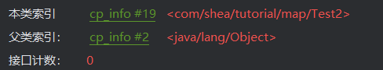
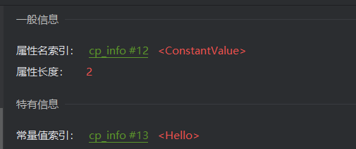
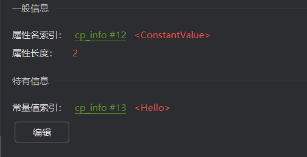

# JVM
JVM本质上是一个运行在计算机上的程序，职责是运行Java字节码文件
JVM功能
- JVM对字节码中的指令实时解释成机器码，让计算机执行
- 自动为对象、方法等分配内存，有自动的垃圾回收机制，可以回收不再使用的对象
- 能对热点代码进行优化，提升执行效率
由于JVM需要实时解释虚拟机指令，不做优化时性能不如C/C++
**JIT 及时编译**
JVM中判断出热点代码的的字节码指令（短时间内被多次调用），对其进行解释，解释成机器码，并保存到内存当中。再次执行内存代码时，就可以直接从内存当中调用，省略了解释的步骤，提高了性能
**虚拟机的组成**
**类加载器**：字节码文件通过**类加载器**加载到内存中
**运行时数据区域**：负责管理JVM使用到的内存，比如创建对象和销毁对象
**执行引擎**：将字节码文件中的指令解释成机器码，同时使用及时编译对性能进行优化
**本地接口**：调用本地已经编译的方法，比如虚拟机中提供的C/C++方法
上述四块内容组合整了JVM虚拟机
## 字节码文件
通过jclasslib工具可以查看字节码文件
字节码文件主要包含以下几种信息
- 基础信息：魔数、字节码文件对应的Java版本号，访问标识，父类和接口
- 常量池：保存了字符串常量、类或接口名、字段名，主要在字节码指令中使用
- 字段：当前类或接口声明的字段信息
- 方法：当前类或接口生命的方法信息，字节码指令
- 属性：类的属性，比如源码的文件名，内部类的列表
### 基础信息
基本信息主要包含了两部分，一般信息和接口
**魔数**
文件是无法通过文件的扩展名来确定文件类型的，文件扩展名可以随机修改，不影响文件内容
软件是使用文件的头几个字节（文件头）来去校验文件的类型，如果软件不支持该种类型就会出错
例如JPEG文件，文件头是`FFD8FF`，软件是根据这3个字节来确定这个文件是JPEG格式的，而不是通过扩展名，扩展名即使改了，也不影响文件内容
字节码文件的前四个字节`CAFEBABE`就是来确定这是一个字节码文件的，而Java字节码文件中，将文件头成为magic魔数
**主副版本号**
主副版本号指的是编译字节码文件的版本号，主版本号用于表示大版本号，JDK1.0-1.1使用了45.0-45.3，JDK1.2是46，之后每升级一个大版本就加1；副版本号是当主版本号相同时作为区分不同版本的标识，一般只需关注主版本号
1.2之后大版本号的计算方法就是：主版本号-44

**访问标识**
标识是类还是接口、注解、枚举、模块，标识public final abstract

**类、父类、接口索引**
通过这些索引可以找到类、父类、接口的信息

### 常量池
常量池的作用：避免相同的内容重复定义，节省空间
```java
public class Test3 {  
  
    public final static String s1 = "Hello";  
    public final static String s2 = "Hello";  
  
    public static void main(String[] args) {  
        Test3 test3 = new Test3();  
    }  
}
```
对于上述这么一段代码


从jclasslib中可以看到，两个字符串的描述符都指向常量池的第13号位置，所以就说明常量池中只存储了一个字符串

通过13号，我们才能找到14号存放的Hello字符串
**为什么要这么设计**
因为对于#14号，这只是一个utf8的数据，而Java中有一个字符串常量池，#13是字符串类型的引用，所以必须要保存一个字符串类型的引用，不能只保存一个数据，而把String类型的引用删除
**为什么不能直接设计成#13的CONSTANT_String_info直接保存字符串**
因为对于一个字面量来说，这个字面量不光可以是字符串，还可以是字段名，而对于字段名来说，它不是String类型的对象，所以就不能用`CONSTANT_String_info`中的字符串，而是要使utf8中的值
```java
public static final String s1 = "Hello";  
public static final String s2 = "Hello";  
public static final String Hello = "Hello";  
  
public static void main(String[] args) {  
    Test3 test3 = new Test3();  
}
```
对于第一和第二个字符串来说，都是String类型的对象，所以两个Hello都指向#13，`CONSTANT_String_info`，而对于第三个字符串，值也是指向#13，但是字段名Hello不是字符串，所以它不能指向#13的`CONSTANT_String_info`，而是直接指向#14的`Utf8_info`，这样子存放，Hello字段名也可以复用#14位置的字面量，而不需要再去创建一个新的字面量

### 方法
字节码中的方法区是存放字节码指令的核心位置，字节码指令的内容存放在方法的Code属性中
```java
public static void main(String[] args) {  
    int i = 0;  
    i = i++;  
    System.out.println(i);  
}
```
对于上面这个方法，最终输出的结果是0
```
 0 iconst_0 # 将常量0放入操作数栈
 1 istore_1 # 将操作数栈取出，放入局部变量表1号位置
 2 iload_1 # 将局部变量表1中的数据放入操作数栈中
 3 iinc 1 by 1 # 将局部变量表1中的数据加1（第一个1是index，第二个1是constant）
 6 istore_1 # 将操作数栈中的数据取出，放入局部变量表1号位置
 7 getstatic #7 <java/lang/System.out : Ljava/io/PrintStream;>
10 iload_1
11 invokevirtual #13 <java/io/PrintStream.println : (I)V>
14 return
```
这就是为什么，i++的优先级比赋值的优先级更高，但是输出的结果不是1却是0，因为第5不修改了局部变量表的值，但是第6步却把操作数栈中的临时数据覆盖掉局部变量表的1
## 类加载器
### 类的生命周期
类的生命周期分为加载、连接、初始化、使用、卸载
连接分为了验证、准备、解析三个阶段
**加载**
- 加载阶段第一步是类加载器根据类的全限定类名通过不同的渠道（本地文件、动态代理生成、通过网络传输的类）以二进制流的方式获取字节码信息
- 类加载器加载完类后，Java虚拟机会将字节码中的信息保存到方法区中（**生成一个InstanceKlass对象，保存类的所有信息，里边还包含特定功能，比如多态的信息**）
- Java虚拟机还会在堆中生成一份与方法去中数据类似的`java.lang.Class`对象，作用是在Java代码中去获取类的信息以及存储静态字段的数据
**连接**
- 验证阶段：验证内容是否满足《Java虚拟机规范》
- 准备阶段：给静态变量赋初值，final修饰的基本数据类型的静态变量，会在准备阶段直接赋值
- 解析阶段：将常量池中的符号引用替换成指向内存的直接引用。符号引用就是在字节码文件中使用编号来访问常量池中的内容；直接引用不再使用编号，而是使用内存中的地址进行访问具体的数据
**初始化**
初始化阶段会执行静态代码块中的代码，并为静态变量赋值；会执行字节码文件中的clinit部分的字节码指令
以下几种方式会导致类的初始化
- 访问一个类的静态变量或静态方法，注意变量是final修饰的并且等号右边是常量的不会被初始化
- 调用Class.forName(String className)
- new一个该类的对象
- 执行Main方法的当前类
以下几种情况不会进行初始化指令执行
- 无静态代码块切无静态变量赋值语句
- 有静态变量的声明，但是没有赋值语句
- 静态变量的定义使用final关键字，这类变量会在准备阶段直接进行初始化
直接访问父类的静态变量，不会触发子类的初始化
子类的初始化clinit调用之前，会先调用父类的clinit初始化
**tips**
```java
public class Test2 {  
    public static void main(String[] args) {  
        new B();  
        System.out.println(B.a);  
    }  
}  
class A {  
    static int a = 0;  
    static {  
        a = 1;  
    }  
}  
class B extends A {  
    static {  
        a = 2;  
    }  
}
```
对于上述代码，由于创建了B实例对象，B类又是继承自A类的，所以B类初始化之前会先对A类进行初始化，所以最终输出的结果是2
```java
public class Test2 {  
    public static void main(String[] args) {  
        System.out.println(B.a);  
    }  
}  
class A {  
    static int a = 0;  
    static {  
        a = 1;  
    }  
}  
class B extends A {  
    static {  
        a = 2;  
    }  
}
```
如果把new对象去掉，由于静态变量a本身就是在父类中的，不属于子类的字段，因此B类不会初始化，所以输出的是1 
### 类加载器
类加载器是Java虚拟机提供给应用程序去实现获取类和接口字节码数据的计数
类加载器只参与加载过程中的字节码获取并加载到内存这一部分
**分类**
类加载器分为两类，一类是Java代码中实现的，一类是Java虚拟机底层源码实现的
- 虚拟机底层实现：启动类加载器(Bootstrap)，加载Java中最核心的类
- Java：扩展类加载器(Extension)，允许扩展Java中比较通用的类。应用程序类加载器(Application)，加载应用使用的类
#### 启动类加载器
启动类加载器是有Hotspot虚拟机提供的、使用C++编写的类加载器
默认加载Java安装目录/jre/lib下的类文件，比如rt.jar，tools.jar，resources.jar
通过启动类加载器去加载用户jar包
- 放入/jre/lib下进行扩展：不推荐的做法，尽可能不要去更改JDK安装目录中的内容，会出现即使放进去，但由于文件名不匹配的问题，导致不会被正常加载
- 使用参数进行扩展：使用`-Xbootclasspath/a:jar包目录/jar包名`进行扩展
#### 扩展类加载器和应用程序类加载器
扩展类加载器和应用程序类加载器都是JDK中提供的、使用Java编写的类加载器
它们的源码都位于`sum.misc.Launcher`中，是一个静态内部类。继承自URLClassLoader。具备通过目录或指定jar包将字节码文件加载到内存中
扩展类加载器默认加载安装目录`/jre/lib/ext`下的类文件
通过扩展类加载器去加载用户jar包
- 放入`/jre/lib/ext`目录下进行扩展：不推荐，尽可能不要去更改JDK安装目录中的内容
- 使用参数进行扩展：使用`-Djava.ext.dirs=jar包目录`进行扩展，这种方式会覆盖掉原始目录，可以用`;(windows):(macos/linux)`追加上原始目录
应用程序类加载器可以加载maven项目中所有依赖的jar包，以及项目中所有创建的类文件
#### 双亲委派机制
双亲委派机制的核心是解决一个类到底由哪个类加载器加载
作用
- 保证类加载的安全性：通过双亲委派机制避免恶意代码替换JDK中的核心类库，比如`java.lang.String`，确保核心类库的完整性和安全性
- 避免重复加载：双亲委派机制可以避免同一个类被加载多次
双亲委派机制是指当一个类接收到加载类的任务时，会自底向上查找是否被加载过，再由定向下进行加载
每个类加载器都会有一个父类加载器，在类加载的过程中，每个类加载器都会检查是否已经加载了该类，如果已经加载则直接返回，否则会将加载请求委派给父类加载器
如果所有的父类加载器都无法加载该类，则由当前类加载器自己尝试加载
父类加载器与子类加载器并不是继承的关系，而是通过在类中使用一个成员变量parent来实现（组合大于继承）
**如何打破双亲委派机制**
ClassLoader包含了四个核心方法
```java
public Class<?> loadClass(String name)
protected Class<?> findClass(String name)
protected final Class<?> defineClass(String name,byte[] b,int off,int len)
protected final void resolveClass(Class<?> c)
```
loadClass是类加载的入口，提供了双亲委派机制。内部会调用findClass
findClass由类加载器子类实现，获取二进制数据调用defineClass。比如`URLClassLoader`会根据文件路径去获取类文件中的二进制数据
defineClass做一些类名的校验，然后调用虚拟机底层的方法将字节码信息加载到虚拟机内存中
resolveClass执行类生命周期的连接阶段
- 自定义类加载器并且重写loadClass方法
一个Tomcat程序中是可以运行多个Web应用的，如果这两个应用中出现了相同限定名的类，比如Servlet类，Tomcat要保证这两个类都能加载且它们应该是不同的类
如果不打破双亲委派机制，当应用类加载器加载到Web应用1的MyServlet之后，Web应用2中相同限定名的MyServlet类就无法被加载了
Tomcat使用了自定义加载器来实现应用之间类的隔离。每一个应用都会有一个独立的类加载器来加载对应的类
```java
// parent等于null说明父类加载器是启动类加载器，直接调用findBootstrapClassOrNull方法调用启动类加载器
// 否则调用父类加载器的loadClass方法
try {  
    if (parent != null) {  
        c = parent.loadClass(name, false);  
    } else {  
        c = findBootstrapClassOrNull(name);  
    }  
} catch (ClassNotFoundException e) {  
    // ClassNotFoundException thrown if class not found  
    // from the non-null parent class loader}
if (c == null) {  
    /**
    父类加载器也没能加载这个类，就由该类加载器来加载
    */  
}
```
想要打破双亲委派机制，就需要删除这段代码，改用自定义的代码
**Java虚拟机中，只有类加载器和全限定类名都一致，才会导致类冲突，被认为是同一个类**
**线程上下文类加载器**
JDBC中使用了DriverManager来管理项目中引入的不同数据库的驱动，比如mysql驱动，oracle驱动
DriverManager属于rt.jar是启动类加载器加载的，而用户的jar包中的驱动需要应用类加载器加载，这就违反了双亲委派机制
通常情况下，子类加载器会委派父类加载器去加载类。父类加载器无法访问子类加载器加载的类
如果DriverManager直接写
```java
Class.forName("com.mysql.cj.jdbc.Driver")
```
就会让Bootstrap去加载，而Bootstrap无法找到classpath目录下的类文件，因此就会抛出`ClassNotFoundException`异常
**spi机制**
spi机制是JDK内置的一种服务提供发现机制
在ClassPath路径下的`META-INF/services`文件夹中，以接口的全限定类名来命名文件名，对应的文件里写该接口的实现
使用ServiceLoader加载实现类
ServiceLoader中的load方法保存了线程上下文中保存的类加载器，而这个类加载器一般是应用程序类加载器
```java
public static <S> ServiceLoader<S> load(Class<S> service) {  
    ClassLoader cl = Thread.currentThread().getContextClassLoader(); // 应用程序类加载器 
    return new ServiceLoader<>(Reflection.getCallerClass(), service, cl);  
}
```
**总结一下**
`DriverManager` 由 Bootstrap ClassLoader 加载，而 JDBC 驱动位于应用的 classpath 中，只能被 AppClassLoader 加载。由于双亲委派模型下父类加载器无法访问子类加载器加载的类，DriverManager 如果采用默认方式将无法加载驱动。因此，JDBC 引入线程上下文类加载器（TCCL），使 DriverManager 能够“借用” AppClassLoader 来完成驱动加载。同时，DriverManager 并不会主动扫描 classpath，而是通过 ServiceLoader（SPI 机制），由 AppClassLoader 在 classpath 中查找 `META-INF/services/java.sql.Driver` 配置文件，定位并加载具体的驱动类，最终完成注册。这一机制本质上是通过组合类加载器与 SPI，实现了对双亲委派模型的有控制突破，从而支持 JDBC 驱动的动态扩展。
**osgi模块化** 
osgj模块化框架，存在同级之间的类加载器的委托加载。osgi还使用类加载器实现了热部署的功能
### JDK9之后的类加载器
在 JDK 8 及之前，类加载器主要包括 Bootstrap、Extension 和 AppClassLoader，其中扩展类加载器和应用类加载器的实现可以在 `sun.misc.Launcher` 中找到，且它们都继承自 `URLClassLoader`，通过扫描 classpath 或 ext 目录来加载类。
从 JDK 9 开始，引入了模块化系统（JPMS），类加载机制也随之调整。首先，Bootstrap ClassLoader 仍然由 JVM（C++）实现，并不是一个普通的 Java 类，但 JDK 提供了 `jdk.internal.loader.ClassLoaders` 等内部类来辅助管理加载逻辑。
同时，原来的扩展类加载器（Extension ClassLoader）被平台类加载器（PlatformClassLoader）取代，原先基于 `jre/lib/ext` 的扩展机制也被移除。类加载器的实现不再基于 `URLClassLoader`，而是统一改为继承 `BuiltinClassLoader`，以支持从模块路径（module path）和类路径（classpath）中加载类。
在新的体系中：
- Bootstrap ClassLoader 负责加载最核心的 Java 基础模块（如 `java.base`）
- PlatformClassLoader 负责加载平台相关模块（如部分标准库模块）
- AppClassLoader 负责加载应用类路径（classpath）下的类
因此，PlatformClassLoader 并不仅仅是为了兼容旧版本而存在，而是在模块化之后承担了连接 Bootstrap 和应用类加载器之间的职责，是新的类加载分层体系中的重要一环。
## 运行时数据区域
主要负责管理JVM使用的内存，比如创建和销毁对象
运行时数据区域主要分为两大类
**线程之间不共享**
程序计数器、Java虚拟机栈、本地方法栈
**线程共享**
方法区、堆区
### 程序计数器
程序计数器也叫做PC寄存器，每个线程会通过程序计数器记录当前要执行的字节码指令的地址
在多线程执行的情况下，Java虚拟机需要通过程序计数器记录CPU切换前解释执行到的那一句指令并继续解释执行
### Java虚拟机栈
Java虚拟机栈采用栈的数据结构来管理方法调用中的基本数据，先进后出，每一个方法的调用使用一个栈帧(Stack Frame)来保存
