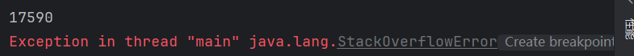
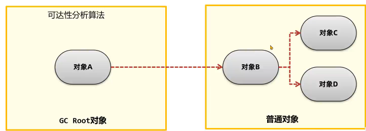

# JVM
JVM本质上是一个运行在计算机上的程序，职责是运行Java字节码文件
JVM功能
- JVM对字节码中的指令实时解释成机器码，让计算机执行
- 自动为对象、方法等分配内存，有自动的垃圾回收机制，可以回收不再使用的对象
- 能对热点代码进行优化，提升执行效率
由于JVM需要实时解释虚拟机指令，不做优化时性能不如C/C++
**JIT 及时编译**
JVM中判断出热点代码的的字节码指令（短时间内被多次调用），对其进行解释，解释成机器码，并保存到内存当中。再次执行内存代码时，就可以直接从内存当中调用，省略了解释的步骤，提高了性能
**虚拟机的组成**
**类加载器**：字节码文件通过**类加载器**加载到内存中
**运行时数据区域**：负责管理JVM使用到的内存，比如创建对象和销毁对象
**执行引擎**：将字节码文件中的指令解释成机器码，同时使用及时编译对性能进行优化
**本地接口**：调用本地已经编译的方法，比如虚拟机中提供的C/C++方法
上述四块内容组合整了JVM虚拟机
## 字节码文件
通过jclasslib工具可以查看字节码文件
字节码文件主要包含以下几种信息
- 基础信息：魔数、字节码文件对应的Java版本号，访问标识，父类和接口
- 常量池：保存了字符串常量、类或接口名、字段名，主要在字节码指令中使用
- 字段：当前类或接口声明的字段信息
- 方法：当前类或接口生命的方法信息，字节码指令
- 属性：类的属性，比如源码的文件名，内部类的列表
### 基础信息
基本信息主要包含了两部分，一般信息和接口
**魔数**
文件是无法通过文件的扩展名来确定文件类型的，文件扩展名可以随机修改，不影响文件内容
软件是使用文件的头几个字节（文件头）来去校验文件的类型，如果软件不支持该种类型就会出错
例如JPEG文件，文件头是`FFD8FF`，软件是根据这3个字节来确定这个文件是JPEG格式的，而不是通过扩展名，扩展名即使改了，也不影响文件内容
字节码文件的前四个字节`CAFEBABE`就是来确定这是一个字节码文件的，而Java字节码文件中，将文件头成为magic魔数
**主副版本号**
主副版本号指的是编译字节码文件的版本号，主版本号用于表示大版本号，JDK1.0-1.1使用了45.0-45.3，JDK1.2是46，之后每升级一个大版本就加1；副版本号是当主版本号相同时作为区分不同版本的标识，一般只需关注主版本号
1.2之后大版本号的计算方法就是：主版本号-44

**访问标识**
标识是类还是接口、注解、枚举、模块，标识public final abstract

**类、父类、接口索引**
通过这些索引可以找到类、父类、接口的信息

### 常量池
常量池的作用：避免相同的内容重复定义，节省空间
```java
public class Test3 {  
  
    public final static String s1 = "Hello";  
    public final static String s2 = "Hello";  
  
    public static void main(String[] args) {  
        Test3 test3 = new Test3();  
    }  
}
```
对于上述这么一段代码


从jclasslib中可以看到，两个字符串的描述符都指向常量池的第13号位置，所以就说明常量池中只存储了一个字符串

通过13号，我们才能找到14号存放的Hello字符串
**为什么要这么设计**
因为对于#14号，这只是一个utf8的数据，而Java中有一个字符串常量池，#13是字符串类型的引用，所以必须要保存一个字符串类型的引用，不能只保存一个数据，而把String类型的引用删除
**为什么不能直接设计成#13的CONSTANT_String_info直接保存字符串**
因为对于一个字面量来说，这个字面量不光可以是字符串，还可以是字段名，而对于字段名来说，它不是String类型的对象，所以就不能用`CONSTANT_String_info`中的字符串，而是要使utf8中的值
```java
public static final String s1 = "Hello";  
public static final String s2 = "Hello";  
public static final String Hello = "Hello";  
  
public static void main(String[] args) {  
    Test3 test3 = new Test3();  
}
```
对于第一和第二个字符串来说，都是String类型的对象，所以两个Hello都指向#13，`CONSTANT_String_info`，而对于第三个字符串，值也是指向#13，但是字段名Hello不是字符串，所以它不能指向#13的`CONSTANT_String_info`，而是直接指向#14的`Utf8_info`，这样子存放，Hello字段名也可以复用#14位置的字面量，而不需要再去创建一个新的字面量

### 方法
字节码中的方法区是存放字节码指令的核心位置，字节码指令的内容存放在方法的Code属性中
```java
public static void main(String[] args) {  
    int i = 0;  
    i = i++;  
    System.out.println(i);  
}
```
对于上面这个方法，最终输出的结果是0
```
 0 iconst_0 # 将常量0放入操作数栈
 1 istore_1 # 将操作数栈取出，放入局部变量表1号位置
 2 iload_1 # 将局部变量表1中的数据放入操作数栈中
 3 iinc 1 by 1 # 将局部变量表1中的数据加1（第一个1是index，第二个1是constant）
 6 istore_1 # 将操作数栈中的数据取出，放入局部变量表1号位置
 7 getstatic #7 <java/lang/System.out : Ljava/io/PrintStream;>
10 iload_1
11 invokevirtual #13 <java/io/PrintStream.println : (I)V>
14 return
```
这就是为什么，i++的优先级比赋值的优先级更高，但是输出的结果不是1却是0，因为第5不修改了局部变量表的值，但是第6步却把操作数栈中的临时数据覆盖掉局部变量表的1
## 类加载器
### 类的生命周期
类的生命周期分为加载、连接、初始化、使用、卸载
连接分为了验证、准备、解析三个阶段
**加载**
- 加载阶段第一步是类加载器根据类的全限定类名通过不同的渠道（本地文件、动态代理生成、通过网络传输的类）以二进制流的方式获取字节码信息
- 类加载器加载完类后，Java虚拟机会将字节码中的信息保存到方法区中（**生成一个InstanceKlass对象，保存类的所有信息，里边还包含特定功能，比如多态的信息**）
- Java虚拟机还会在堆中生成一份与方法去中数据类似的`java.lang.Class`对象，作用是在Java代码中去获取类的信息以及存储静态字段的数据
**连接**
- 验证阶段：验证内容是否满足《Java虚拟机规范》
- 准备阶段：给静态变量赋初值，final修饰的基本数据类型的静态变量，会在准备阶段直接赋值
- 解析阶段：将常量池中的符号引用替换成指向内存的直接引用。符号引用就是在字节码文件中使用编号来访问常量池中的内容；直接引用不再使用编号，而是使用内存中的地址进行访问具体的数据
**初始化**
初始化阶段会执行静态代码块中的代码，并为静态变量赋值；会执行字节码文件中的clinit部分的字节码指令
以下几种方式会导致类的初始化
- 访问一个类的静态变量或静态方法，注意变量是final修饰的并且等号右边是常量的不会被初始化
- 调用Class.forName(String className)
- new一个该类的对象
- 执行Main方法的当前类
以下几种情况不会进行初始化指令执行
- 无静态代码块切无静态变量赋值语句
- 有静态变量的声明，但是没有赋值语句
- 静态变量的定义使用final关键字，这类变量会在准备阶段直接进行初始化
直接访问父类的静态变量，不会触发子类的初始化
子类的初始化clinit调用之前，会先调用父类的clinit初始化
**tips**
```java
public class Test2 {  
    public static void main(String[] args) {  
        new B();  
        System.out.println(B.a);  
    }  
}  
class A {  
    static int a = 0;  
    static {  
        a = 1;  
    }  
}  
class B extends A {  
    static {  
        a = 2;  
    }  
}
```
对于上述代码，由于创建了B实例对象，B类又是继承自A类的，所以B类初始化之前会先对A类进行初始化，所以最终输出的结果是2
```java
public class Test2 {  
    public static void main(String[] args) {  
        System.out.println(B.a);  
    }  
}  
class A {  
    static int a = 0;  
    static {  
        a = 1;  
    }  
}  
class B extends A {  
    static {  
        a = 2;  
    }  
}
```
如果把new对象去掉，由于静态变量a本身就是在父类中的，不属于子类的字段，因此B类不会初始化，所以输出的是1 
### 类加载器
类加载器是Java虚拟机提供给应用程序去实现获取类和接口字节码数据的计数
类加载器只参与加载过程中的字节码获取并加载到内存这一部分
**分类**
类加载器分为两类，一类是Java代码中实现的，一类是Java虚拟机底层源码实现的
- 虚拟机底层实现：启动类加载器(Bootstrap)，加载Java中最核心的类
- Java：扩展类加载器(Extension)，允许扩展Java中比较通用的类。应用程序类加载器(Application)，加载应用使用的类
#### 启动类加载器
启动类加载器是有Hotspot虚拟机提供的、使用C++编写的类加载器
默认加载Java安装目录/jre/lib下的类文件，比如rt.jar，tools.jar，resources.jar
通过启动类加载器去加载用户jar包
- 放入/jre/lib下进行扩展：不推荐的做法，尽可能不要去更改JDK安装目录中的内容，会出现即使放进去，但由于文件名不匹配的问题，导致不会被正常加载
- 使用参数进行扩展：使用`-Xbootclasspath/a:jar包目录/jar包名`进行扩展
#### 扩展类加载器和应用程序类加载器
扩展类加载器和应用程序类加载器都是JDK中提供的、使用Java编写的类加载器
它们的源码都位于`sum.misc.Launcher`中，是一个静态内部类。继承自URLClassLoader。具备通过目录或指定jar包将字节码文件加载到内存中
扩展类加载器默认加载安装目录`/jre/lib/ext`下的类文件
通过扩展类加载器去加载用户jar包
- 放入`/jre/lib/ext`目录下进行扩展：不推荐，尽可能不要去更改JDK安装目录中的内容
- 使用参数进行扩展：使用`-Djava.ext.dirs=jar包目录`进行扩展，这种方式会覆盖掉原始目录，可以用`;(windows):(macos/linux)`追加上原始目录
应用程序类加载器可以加载maven项目中所有依赖的jar包，以及项目中所有创建的类文件
#### 双亲委派机制
双亲委派机制的核心是解决一个类到底由哪个类加载器加载
作用
- 保证类加载的安全性：通过双亲委派机制避免恶意代码替换JDK中的核心类库，比如`java.lang.String`，确保核心类库的完整性和安全性
- 避免重复加载：双亲委派机制可以避免同一个类被加载多次
双亲委派机制是指当一个类接收到加载类的任务时，会自底向上查找是否被加载过，再由定向下进行加载
每个类加载器都会有一个父类加载器，在类加载的过程中，每个类加载器都会检查是否已经加载了该类，如果已经加载则直接返回，否则会将加载请求委派给父类加载器
如果所有的父类加载器都无法加载该类，则由当前类加载器自己尝试加载
父类加载器与子类加载器并不是继承的关系，而是通过在类中使用一个成员变量parent来实现（组合大于继承）
**如何打破双亲委派机制**
ClassLoader包含了四个核心方法
```java
public Class<?> loadClass(String name)
protected Class<?> findClass(String name)
protected final Class<?> defineClass(String name,byte[] b,int off,int len)
protected final void resolveClass(Class<?> c)
```
loadClass是类加载的入口，提供了双亲委派机制。内部会调用findClass
findClass由类加载器子类实现，获取二进制数据调用defineClass。比如`URLClassLoader`会根据文件路径去获取类文件中的二进制数据
defineClass做一些类名的校验，然后调用虚拟机底层的方法将字节码信息加载到虚拟机内存中
resolveClass执行类生命周期的连接阶段
- 自定义类加载器并且重写loadClass方法
一个Tomcat程序中是可以运行多个Web应用的，如果这两个应用中出现了相同限定名的类，比如Servlet类，Tomcat要保证这两个类都能加载且它们应该是不同的类
如果不打破双亲委派机制，当应用类加载器加载到Web应用1的MyServlet之后，Web应用2中相同限定名的MyServlet类就无法被加载了
Tomcat使用了自定义加载器来实现应用之间类的隔离。每一个应用都会有一个独立的类加载器来加载对应的类
```java
// parent等于null说明父类加载器是启动类加载器，直接调用findBootstrapClassOrNull方法调用启动类加载器
// 否则调用父类加载器的loadClass方法
try {  
    if (parent != null) {  
        c = parent.loadClass(name, false);  
    } else {  
        c = findBootstrapClassOrNull(name);  
    }  
} catch (ClassNotFoundException e) {  
    // ClassNotFoundException thrown if class not found  
    // from the non-null parent class loader}
if (c == null) {  
    /**
    父类加载器也没能加载这个类，就由该类加载器来加载
    */  
}
```
想要打破双亲委派机制，就需要删除这段代码，改用自定义的代码
**Java虚拟机中，只有类加载器和全限定类名都一致，才会导致类冲突，被认为是同一个类**
**线程上下文类加载器**
JDBC中使用了DriverManager来管理项目中引入的不同数据库的驱动，比如mysql驱动，oracle驱动
DriverManager属于rt.jar是启动类加载器加载的，而用户的jar包中的驱动需要应用类加载器加载，这就违反了双亲委派机制
通常情况下，子类加载器会委派父类加载器去加载类。父类加载器无法访问子类加载器加载的类
如果DriverManager直接写
```java
Class.forName("com.mysql.cj.jdbc.Driver")
```
就会让Bootstrap去加载，而Bootstrap无法找到classpath目录下的类文件，因此就会抛出`ClassNotFoundException`异常
**spi机制**
spi机制是JDK内置的一种服务提供发现机制
在ClassPath路径下的`META-INF/services`文件夹中，以接口的全限定类名来命名文件名，对应的文件里写该接口的实现
使用ServiceLoader加载实现类
ServiceLoader中的load方法保存了线程上下文中保存的类加载器，而这个类加载器一般是应用程序类加载器
```java
public static <S> ServiceLoader<S> load(Class<S> service) {  
    ClassLoader cl = Thread.currentThread().getContextClassLoader(); // 应用程序类加载器 
    return new ServiceLoader<>(Reflection.getCallerClass(), service, cl);  
}
```
**总结一下**
`DriverManager` 由 Bootstrap ClassLoader 加载，而 JDBC 驱动位于应用的 classpath 中，只能被 AppClassLoader 加载。由于双亲委派模型下父类加载器无法访问子类加载器加载的类，DriverManager 如果采用默认方式将无法加载驱动。因此，JDBC 引入线程上下文类加载器（TCCL），使 DriverManager 能够“借用” AppClassLoader 来完成驱动加载。同时，DriverManager 并不会主动扫描 classpath，而是通过 ServiceLoader（SPI 机制），由 AppClassLoader 在 classpath 中查找 `META-INF/services/java.sql.Driver` 配置文件，定位并加载具体的驱动类，最终完成注册。这一机制本质上是通过组合类加载器与 SPI，实现了对双亲委派模型的有控制突破，从而支持 JDBC 驱动的动态扩展。
**osgi模块化** 
osgj模块化框架，存在同级之间的类加载器的委托加载。osgi还使用类加载器实现了热部署的功能
### JDK9之后的类加载器
在 JDK 8 及之前，类加载器主要包括 Bootstrap、Extension 和 AppClassLoader，其中扩展类加载器和应用类加载器的实现可以在 `sun.misc.Launcher` 中找到，且它们都继承自 `URLClassLoader`，通过扫描 classpath 或 ext 目录来加载类。
从 JDK 9 开始，引入了模块化系统（JPMS），类加载机制也随之调整。首先，Bootstrap ClassLoader 仍然由 JVM（C++）实现，并不是一个普通的 Java 类，但 JDK 提供了 `jdk.internal.loader.ClassLoaders` 等内部类来辅助管理加载逻辑。
同时，原来的扩展类加载器（Extension ClassLoader）被平台类加载器（PlatformClassLoader）取代，原先基于 `jre/lib/ext` 的扩展机制也被移除。类加载器的实现不再基于 `URLClassLoader`，而是统一改为继承 `BuiltinClassLoader`，以支持从模块路径（module path）和类路径（classpath）中加载类。
在新的体系中：
- Bootstrap ClassLoader 负责加载最核心的 Java 基础模块（如 `java.base`）
- PlatformClassLoader 负责加载平台相关模块（如部分标准库模块）
- AppClassLoader 负责加载应用类路径（classpath）下的类
因此，PlatformClassLoader 并不仅仅是为了兼容旧版本而存在，而是在模块化之后承担了连接 Bootstrap 和应用类加载器之间的职责，是新的类加载分层体系中的重要一环。
## 运行时数据区域
主要负责管理JVM使用的内存，比如创建和销毁对象
运行时数据区域主要分为两大类
**线程之间不共享**
程序计数器、Java虚拟机栈、本地方法栈
**线程共享**
方法区、堆区
### 程序计数器
程序计数器也叫做PC寄存器，每个线程会通过程序计数器记录当前要执行的字节码指令的地址
在多线程执行的情况下，Java虚拟机需要通过程序计数器记录CPU切换前解释执行到的那一句指令并继续解释执行
### Java虚拟机栈
Java虚拟机栈采用栈的数据结构来管理方法调用中的基本数据，先进后出，每一个方法的调用使用一个栈帧(Stack Frame)来保存
Java虚拟机栈随着线程的创建而创建，回收会在线程销毁时进行。由于方法可能会在不同线程中执行，所以每个线程都会有一个自己的虚拟机栈
栈帧由局部变量表、操作数栈、帧数据组成
- 局部变量表的作用是在方法执行过程中存放所有的局部变量，编译成字节码文件时就可以确定局部变量表的内容。
	栈帧中的局部变量表是一个数组，数组中每一个位置称为槽，long和double类型占用两个槽，其他类型占用一个槽
	实例方法中，序列号为0的位置存放的是this，指的是当前调用方法的对象，运行时会在内存中存放实例对象的地址
	方法参数也会保存在局部变量表中，其顺序与方法中参数定义的顺序一致
- 操作数栈是栈帧中虚拟机在执行指令过程中用来存放中间数据的一块区域。如果一条指令将一个值压入操作数栈，则后面的指令可以弹出并使用该值
- 帧数据主要包含动态链接、方法出口、异常表的引用
	当前类的字节码指令引用了其他类的属性或方法时，需要将符号引用转换成对应的运行时常量池中的内存地址。**动态链接**就保存了编号到运行时常量吃的内存地址的映射关系
	**方法出口**指的是方法在正确或者异常结束时，当前栈帧会被弹出，同时程序计数器应该指向上一个栈帧中的下一条指令的地址。所以当前栈帧中，需要存储此方法出口的地址
	**异常表**存放的是代码中异常的处理信息，包含了异常捕获的生效范围以及异常发生后跳转的字节码指令位置
#### 栈内存溢出
Java虚拟机栈如果栈帧过多，占用内存超过栈内存可以分配的最大大小，就会出现内存溢出。会抛出`StackOverflow`错误
```java
public static void main(String[] args) throws NoSuchMethodException, InvocationTargetException, InstantiationException, IllegalAccessException {  
    stackOverflow();  
}  
  
public static int count = 0;  
  
public static void stackOverflow() {  
    System.out.println(++count);  
    stackOverflow();  
}
```

从上述代码运行结果可以看到，调用了17590次才抛出`StackOverflow`错误
**如果想要修改Java虚拟机栈的大小，可以使用虚拟机参数 -Xss**，单位默认字节，必须是1024的倍数、k或者K(KB)、m或者M(MB)、g或者G(GB)，例如可以设置-Xss1024k，就说明设置虚拟机栈的大小为1MB
如果一个方法的局部变量多，操作数栈深度过大也会影响Java虚拟机栈内存的大小
### 本地方法栈
Java虚拟机栈存储的是Java方法调用时的栈帧，而本地方法栈存储的是native本地方法的栈帧。在Hotspot虚拟机中，Java虚拟机栈和本地方法栈实现上使用了同一个栈空间。本地方法栈会在栈内存上生成一个栈帧，临时保存方法的参数同时方便出现异常时也把本地方法的占信息打印出来
### 堆
一般Java程序中，堆内存是空间最大的一块内存区域。创建出来的对象都存在于堆上
栈上的局部变量表中，可以存放堆上对象的引用。静态变量也可以存放堆对象的引用，通过静态变量就可以实现对象在线程之间共享
堆内存的大小是有上限的，当对象一直向堆中放入对象达到上限之后，就会抛出OutOfMemory错误，即OOM
堆空间有三个需要关注的值，used total max
used指的是当前已经使用的内存，total是Java虚拟机已经分配的可用堆内存，max是Java虚拟机可分配的最大堆内存
随着堆中的对象增多，当total可以使用的内存即将不足时，java虚拟机会继续分配内存给堆
如果堆内存不足，java虚拟机就会不断的分配内存，total值会变大，total最多只能和max相等
如果不设置任何的虚拟机参数，max默认是系统内存的1/4，total默认是系统内存的1/64
在虚拟机中，可以通过参数`-Xmx值`来设置最大堆内存，参数`-Xms值`设置最小对内存
-Xmx必须大于2MB，-Xms必须大于1MB
**Java服务端程序开发时，建议将-Xmx和-Xms设置为相同的值，这样在程序启动之后可使用的总内存就是最大内存，而无需向Java虚拟机再次申请，减少了申请并分配内存时间上的开销，同时也不会出现内存过剩之后堆收缩的情况**
### 方法区
方法区存放的是基础信息的位置，线程共享，主要包含三部分内存：类的元信息、运行时常量池、字符串常量池
JDK7及之前的版本将方法区存放在堆区域的**永久代空间**，堆的大小由虚拟机参数来控制
JDK8及之后的版本将方法区存放在**元空间**中，元空间位与操作系统维护的直接内存中，默认情况下只要不超过操作系统承受的上限，可以一直分配。可以使用`-XX:MaxMetaspaceSize=值`将元空间最大大小进行限制
**类的元信息**
方法区是用来存储每个类的基本信息（元信息），一般称之为InstancKlass对象，在类的加载阶段完成
**运行时常量池**
常量池存放的是字节码中的常量池内容。字节码文件中通过编号查表的方式找到常量，这种常量池称为静态常量池；当常量池加载到内存之后，可以通过内存地址快速定位到常量池中的内容，这种常量池称为运行时常量池
**字符串常量池**
字符串常量池是JVM为了优化字符串使用而维护的一块专门存储字符串字面量和intern字符串的内存区域
字符串常量池存放在堆中
```java
public static void main(String[] args) {  
    String s1 = "aa";  
    String s2 = "aa";  
    String s3 = new String("aa");  
    String s4 = s3.intern();  
    System.out.println(s1 == s2);  
    System.out.println(s1 == s3);  
    System.out.println(s1 == s4);  
}
```
```text
true
false
true
```
对于上述四个字符串，s1和s2属于同一个字符串对象，因为s1创建字符串的方法，会将字符串放入到字符串常量池中，而s2也是aa，发现字符串常量池有这个字符串，就会直接复用
对于s3字符串，因为s3字符串是通过new获得到的，new String()会在堆中创建新的对象，因此s3字符串不会存放到字符串常量池。
对于s4字符串，s4创建调用了`s3.intern()`方法，会选择使用字符串常量池中的字符串，如果池中有了`"aa"`的引用，就会返回池中引用，如果池中没有，就会将s4字符串加入字符串常量池
存放字符串时，不移动对中的字符串，而是将字符串的引用加入到字符串常量池中
```java
public static void main(String[] args) {  
    String s1 = new StringBuilder().append("ja").append("va").toString();  
    System.out.println(s1.intern() == s1);  
}
```
```text
true
```
### 直接内存
直接内存并不在Java虚拟机规范中存在，所以不属于Java运行时的内存区域
JDK1.4中引入了NIO机制，使用了直接内存，主要为了解决两个问题
- Java堆中的对象如果不再使用要回收，回收时会影响对象的创建和使用
- IO操作，需要先把文件读入直接内存，再把数据复制到Java堆中。而现在可以直接放入直接内存，Java堆上维护直接内存的引用，可以减小数据复制的开销
## 垃圾回收
在C/C++这类没有自动垃圾回收机制的语言中，一个对象如果不再使用，就需要手动释放，否则就会出现内存泄漏（内存泄漏指的是不再使用的对象在系统中未被回收，内存泄露的积累可能导致内存溢出）
Java中为了简化对象的释放，引入了自动的垃圾回收（GC）机制，通过垃圾回收器来对不再使用的对象完成自动的回收，垃圾回收器主要负责对堆上的内存进行回收
由于线程不共享的部分，都是**伴随着线程创建而创建，线程销毁而销毁**。而方法的栈帧在执行完方法之后就会自动弹出栈并释放掉内存，所以不需要GC
Java中可以通过`System.gc()`手动触发垃圾回收机制，但是调用这个方法时，不一定会立即进行垃圾回收，这仅仅是向Java发送一个垃圾回收的请求，具体什么时候回收，是由Java虚拟机判断的
### 方法区的回收
方法区中能回收的类主要满足三个条件
- 此类所有实例对象都已经被回收，在堆中不存在任何该类的实例对象以及子类对象
- 加载该类的类加载器已经被回收
- 该类对应的`java.lang.Class`对象没有任何地方被引用
### 堆回收
Java中的对象是否能被回收，是根据对象是否被引用来决定的，如果对象被引用了，说明对象还在使用，不允许回收
如何判断堆上的对象有没有被引用，有两种方法
#### 引用计数法
引用计数法会为每个对象维护一个引用计数器，当对象被引用时加1，取消引用时减1
当对象的引用计数器为0时，说明对象没有被引用，可以回收
引用计数法实现简单，但是也有以下缺点
- 每次引用和取消引用都要维护计数器，对系统性能有一定的影响
- 存在循环引用的问题，当A引用B，B引用A时会出现对象无法回收的问题
```java
public class Test2 {  
    public static void main(String[] args) {  
        A a = new A();  
        B b = new B();  
        a.b = b;  
        b.a = a;  
        a = null;  
        b = null;  
    }  
}  
  
class A {  
    B b;  
}  
class B {  
    A a;  
}
```
上述代码中，线程栈帧中的a和b对象的引用置为null之后，堆中的a和b互相引用，但是已经没有能从堆中获取这两个对象的方法了，因此就会导致对象没有使用，但却无法回收的现象
#### 可达性分析
Java是通过可达性分析算法来判断一个对象是否需要会后。可达性分析将对象分为两类：垃圾回收(GC Root)的跟对象和普通对象，对象与对象之间存在引用关系

每个创建的对象都会和GC Root一起形成一条链，如果某个对象到GC Root是可达的，对象就不可被回收
只要对象属于下面几类，就可以被称为GC Root对象
- 线程Thread对象，**引用线程栈帧中的方法参数，局部变量**
- 系统类加载器加载的`java.lang.Class`对象
- 监视器对象，用来保存同步锁synchronized关键字持有的对象
- 本地方法调用时使用的全局对象
对于上述代码，a和b对象在线程栈帧中的引用已经被置为null，因此可达性分析中，主线程无法到达堆区域中的a和b对象，因此就会被释放
#### 对象引用
**软引用**
如果一个对象只有软引用关联到它，当程序内存不足时，就会将软引用中的数据进行回收
JDK1.2之后，提供了SoftReference来实现软引用，软引用通常存在缓存中
软引用对象在内存不足时回收，SoftReference对象本身也需要被回收，那么如何知道对哪些SoftReference对象进行回收
- 软引用创建时，通过构造起传入引用队列
- 软引用中包含的对象被回收时，该软引用对象会被放入引用队列
- 通过代码便利引用队列，将SoftReference的强引用删除
```java
 public class StudentCache {  
  
    private static StudentCache cache = new StudentCache();  
  
    public static void main(String[] args) {  
            }  
  
    private Map<Integer,StudentRef> stuRef;  
    private ReferenceQueue<Student> q;  
  
    private class StudentRef extends SoftReference<Student> {  
        private Integer key;  
        public StudentRef(Student stu,ReferenceQueue<Student> q) {  
            super(stu,q);  
            key = stu.getId();  
        }  
    }  
  
    private StudentCache() {  
        stuRef = new HashMap<Integer,StudentRef>();  
        q = new ReferenceQueue<Student>();  
    }  
  
    public static StudentCache getInstance() {  
        return cache;  
    }  
  
    private void cacheStudent(Student stu) {  
        cleanCache();  
        StudentRef ref = new StudentRef(stu,q);  
        stuRef.put(stu.getId(), ref);  
        System.out.println(stuRef.size());  
    }  
  
    private void cleanCache() {  
        StudentRef ref = null;  
        while((ref = (StudentRef)q.poll()) != null) {  
            stuRef.remove(ref.key);  
        }  
    }  
    public Student getStudent(int id) {  
        Student stu = null;  
        if(stuRef.containsKey(id)) {  
            stu = stuRef.get(id).get();  
        }  
        if(stu == null) {  
            stu = new Student(id,String.valueOf(id));  
            System.out.println("Retrieve From StudentInfoCenter. ID="+id);  
            this.cacheStudent(stu);  
        }  
        return stu;  
    }  
}  
  
class Student{  
    private Integer id;  
    private String name;  
      
    public Student(Integer id, String name) {  
        this.id = id;  
        this.name = name;  
    }  
  
    public String getName() {  
        return name;  
    }  
  
    public Integer getId() {  
        return id;  
    }  
  
    public void setId(Integer id) {  
        this.id = id;  
    }  
  
    public void setName(String name) {  
        this.name = name;  
    }  
}
```
**弱引用**
弱引用包含的对象在垃圾回收时，不管内存够不够都会被直接回收
JDK1.2版本之后提供了WeakReference类来实现弱引用，弱引用主要在ThreadLocal中使用
### 垃圾回收
垃圾回收主要做两件事：找到内存中存活的对象；释放不在存活对象的内存，使得程序能再次利用这部分空间
Java垃圾回收过程会通过单独的GC线程来完成，但不管使用哪种GC算法，都会有部分阶段需要停止所有线程。这个过程被称为`Stop The World`简称STW
**垃圾回收算法的评价标准**
- 吞吐量：吞吐量指的是CPU用于执行用户代码的时间与CPU总执行时间的比值，即吞吐量=执行用户代码时间/(执行用户代码时间+GC时间)，吞吐量数值越高，垃圾回收效率越高
- 最大暂停时间：最大暂停时间值的是STW时间的最大值。最大暂停时间越短，越好
- 堆使用效率：不同的垃圾回收算法，堆内存的使用效率不同，堆使用效率越高，算法越好
垃圾回收算法分为以下几种
**标记-清除算法**
核心思想分为两阶段
- 标记阶段：将所有存活的对象进行标记。Java使用可达性分析算法，从GC Root开始通过引用链遍历出所有存活对象
- 清除阶段：所有没被标记的对象都被清除
优点：**实现简单**，只需要在第一阶段给每个对象维护一个标志位即可，第二阶段删除对象即可
缺点：**碎片化**，对象被删除后，内存中可能会出现很多细小的可用内存单元；**分配速度慢**，由于内存碎片的存在，需要维护一个空闲链表，极有可能发生每次需要遍历到的链表的最后才能获得合适的内存空间
**复制算法**
核心思想
- 准备两块空间From和To空间，每次在对象分配阶段，只能使用其中一块空间（From空间）
- GC阶段开始，将GC Root搬运到To空间
- 将GC Root关联的对象搬运到To空间
- 清理From空间，并把名称互换
优点：**吞吐量高**，只需要遍历一次存活对象复制到To空间即可，比标记-整理算法少了一次遍历过程，性能更好，但是比标记-清除算法性能更差，因为标记-清除算法不需要进行对象的移动；**不会发生碎片化**，复制算法在复制之后就会将对象按顺序存放到To空间中，所有对象以外的区域就是可用空间，不存在碎片空间
缺点：**内存使用效率低**，每次只能让一般的内存空间来为创建对象使用
**标记-整理算法**
核心思想
- 标记阶段：所有存活的对象通过可达性分析标记
- 整理阶段：将存活对象移动到堆的一端，清理剩余部分的堆空间
优点：**内存使用效率高**，整个堆都可以使用，不会像复制算法一样只能使用半个堆空间；**不会发生碎片化**，整理阶段可以将对象全都往堆的一侧去移动，剩下的空间都是可以分配对象的有效空间
缺点：**整理阶段效率低**，整理算法都需要遍历几次，整体性能不佳
**分代GC**
分代垃圾回收将整个内存区域分为年轻代和老年代，年轻代中存放存活时间比较短的对象，老年区存放存活时间比较长的对象
年轻代还分为Eden区，和两块幸存区s0、s1
分代回收时，创建出来的对象会先放入Eden区，随着对象在Eden区越来越多，如果Eden区满，新创建的对象无法放入，就会触发年轻代的GC，称为Minor GC或Young GC，Minor GC会把需要Eden区和From区需要回收的对象回收，把没有回收的对象放入To区，接下来S0变为To区，S1变为From区，当Eden区满了，依然会发生Minor GC。每次Minor GC都会为对象记录年龄
当Minor GC后的对象的年龄达到阈值，对象就会被晋升至老年代，当老年代空间不足，无法放入新对象时，先尝试Minor GC（被放入老年代的对象不一定是达到阈值的，因为当年轻代区域不足时，进行Minor GC，如果年轻代区域还是不足，就会尝试将一些没有达到阈值的对象放入老年代），如果还是不足，就会触发Full GC，Full GC会对整个堆进行垃圾回收，如果Full GC依旧无法会收到老年代的对象，那么当对象继续放入老年代的时候，就会抛出OOM异常
**将堆分成新生代和老年代的原因**
- 可以通过调整新生代和老年代的比例来适应不同类型的引用程序，提高内存的利用率和性能
- 新生代和老年代使用不同的垃圾回收算法，新生代一般选择复制算法，老年代可以选择标记-清除或标记-整理算法，灵活度高
- 分代设计中只允许回收新生代，如果能满足对象分配的要求，就不需要对整个堆进行回收，STW时间就会减少
#### 垃圾回收器
**Serial**
Serial是一种单线程串行回收年轻代的垃圾回收器，使用复制算法进行回收。
优点：单CPU处理器下吞吐量出色
缺点：多CPU下吞吐量不如其他垃圾回收器，堆如果偏大会让用户线程处于长时间等待
**SerialOld**
SerialOld是Serial垃圾回收器的老年代版本，采用单线程串行回收，使用标记整理算法回收
优点和缺点都与Serial一样
可以通过
```
-XX:+UseSerialGC
```
开启Serial垃圾回收器，新生代和老年代都使用串行回收器
**ParNew**
ParNew回收器本质上是对Serial在多CPU下的优化，使用多线程进行垃圾回收。使用复制算法进行回收
优点：多CPU处理器下停顿时间较短
缺点：吞吐量和停顿时间不如G1，JDK9之后不建议使用
通过命令
```
-XX:+UseParNewGC
```
新生代使用ParNew回收器，老年代使用SerialOld回收器
**CMS**
CMS回收器关注的是系统的暂停时间，允许用户线程和垃圾回收线程在某些步骤中同时执行，减少了用户现成的等待时间。使用标记清除算法回收老年代对象
CMS执行步骤
- 初始标记，用极短的时间标记出GC Roots能直接关联到的对象
- 并发标记，标记所有的对象，用户线程不需要暂停
- 重新标记，由于并发标记阶段有些对象会发生变化，存在错标、漏标等情况，需要重新标记
- 并发清理，清理死亡的对象，用户线程不需要暂停
优点：系统由于垃圾回收出现的停顿时间较短，用户体验好
缺点：
- CMS使用了标记-清除算法，在垃圾回收结束后会出现大量的内存碎片，CMS会在Full GC时进行碎片整理，会导致用户线程暂停，可以使用
	`-XX:CMSFullGCsBeforeCompaction=N`参数（默认0）来调整N次Full GC之后再整理
- 因为并发清理过程中，不会暂停用户线程，因此可能在并发清理过程产生一些垃圾，无法处理在并发清理过程中产生的浮动垃圾，不能做到完全的垃圾回收
- 如果老年代内存不足无法分配对象，CMS就会退化成Serial Old单线程回收老年代

通过命令
```
-XX:+UseConcMarkSweepGC
```
开启CMS垃圾回收器
**Parallel Scavenge**
Parallel Scavenge是JDK8默认的年轻代垃圾回收器，多线程并行回收，关注的是系统的吞吐量。具备自动调整堆内存大小的特点。使用的是复制算法回收
优点：吞吐量高，而且手动可控。为了提高吞吐量，虚拟机会动态调整堆的参数
缺点：不能保证单次的停顿时间
**Parallel Old**
Parallel Old是为Parallel Scavenge收集器设计的老年代版本，利用多线程并发回收，使用标记-整理算法回收
优点和缺点与Paralle Scavenge一样
可以通过参数
```
-XX:UseParallelGC 或 -XX:UseParallelOldGC
```
使用Parallel Scavenge和Parallel Old这种组合
**G1 垃圾回收器**
JDK9之后默认的垃圾回收器是G1垃圾回收器
Parallel Scavenge关注吞吐量，允许用户设置最大暂停时间，但是会减少年轻代可用空间的大小
CMS关注暂停时间，但是吞吐量方面会有所下降
而G1设计目标就是将上述两种垃圾回收器的优点结合，支持巨大的堆空间回收，并有较高的吞吐量；支持多CPU并行垃圾回收；允许用户设置最大暂停时间
G1的整个堆会划分为多个大小相等的区域，称之为区Region，区域不要求是连续的。分为Eden、Survivor、Old区。Region的大小通过堆空间/2048计算得到，也可以通过参数
`-XX:G1HeapRegionSize=32m`指定（其中32m指定region的大小为32MB），Region size必须是2的指数幂，取值范围从1M到32M
G1垃圾回收有两种
- 年轻代：回收Eden区和Suvivor区中不同的对象，会导致STW，G1中可以通过参数
	`-XX:MaxGCPauseMillis=n`（默认200），设置每次垃圾回收时的最大暂停时间毫秒
	数，G1垃圾回收器会尽可能地保证暂停时间
	1.新创建的对象会存放在Eden区，当G1判断年轻代不足（max默认60%），无法分配对象时需要回收时会执行Young GC
	2.标记出Eden和Survivor区域中的存活对象
	3.根据 配置的最大暂停时间选择某些区域将存活对象复制到一个新的Survivor区中（年龄+1），清空这些区域
	G1在进行Young GC的过程中会去记录每次垃圾回收时每个Eden区和Survivor区的平均耗时，以作为下次回收时的参考依据。这样就可以根据配置的最大暂停时间计算出本次回收最多能回收多少个Region区域了
	4.后续Young GC时与之前相同，只不过从一个Survivor区搬运到另一个Survivor区
	5.当某个存活对象的年龄达到阈值（默认15），将被放入老年代
	6.部分对象如果大小超过Region的一半，会直接放入老年代，这类老年代被称为Humongous区
	7.多次回收之后，会出现很多Old老年代区，此时总堆占有率达到阈值时，会触发MixedGC。回收所有年轻代和部分老年代的对象以及大对象区，采用复制算法来完成
- 混合回收：混合回收分为初始标记、并发标记、最终标记、并发清理。G1对老年代的清理会选择存活度最低的区域来进行回收，这样可以保证回收效率最高，这也是G1（Garbage first）名称的由来。最后清理阶段使用的是复制算法，不会产生内存碎片
	tips：如果清理过程中没有足够的空Region存放转移的对象，会出现Full GC。单线程执行标记-整理算法，此时会导致用户线程的暂停
通过参数
```
-XX:+UseG1GC
```
打开G1的开关，JDK9之后是默认的，不需要打开
通过参数
```
-XX:MaxGCPauseMillis=毫秒值
```
设置最大暂停时间
优点：对比较大的对如超过6G的堆回收时，延迟可控；不会产生内存碎片；并发标记的SATB算法效率高
缺点：JDK8之前不够成熟
## 内存调优
### 内存溢出和内存泄露
内存泄露，即在Java中如果不在使用一个对象，但是该对象依然在GC Root的引用链上，这个对象就不会被垃圾回收器回收。内存泄露绝大多数情况是由堆内存泄露引起的
少量的内存泄露可以容忍，但是如果发生持续的内存泄露，就像滚雪球一样越滚越大，不管多大的内存都迟早会被消耗完，最终造成的结果就是**内存溢出(OOM)**。但是产生内存溢出并不只有内存泄露这一种原因
#### 内存泄露的常见场景
- 内存泄露导致溢出的常见场景是大型的Java后端应用中，在处理用户的请求之后，没有及时将用户的数据删除，随着用户请求的数量越来越多，内存泄漏的对象占满了堆内存最终导致内存溢出。这种内存溢出会直接导致用户请求无法处理，影响用户的正常使用，虽然重启可以恢复应用使用，但是在运行一段时间之后，仍然会出现内存溢出
- 分布式任务调度系统如Elastic-job、Quartz等进行任务调度时，被调度的Java应用在调度任务结束中出现了内存泄露，最终导致多次调度之后内存溢出。这种情况产生的内存溢出，统一可以通过重启恢复引用使用，但是在调度执行一段时间后，仍然会出现内存溢出
#### 解决内存溢出
**内存监控**
**top命令**是linux下用于查看系统信息的一个命令，它提供给我们去实时地查看系统的资源，比如执行时的进程、线程和系统参数等信息。进程的使用内存为RES（常驻内存）-SHR（共享内存）
但是这个命令只能看到最基础的进程信息，无法看到每个部分占用的内存
# 杂项
## JVM内存模型
JVM运行时内存分为虚拟机栈、堆、元空间、程序计数器、本地方法栈五个部分。还有一部分叫做直接内存，属于操作系统的本地内存，也是可以直接操作的
**程序计数器**：可以看作是当前线程所执行的字节码的行号指示器，用于存储当前线程正在执行的Java方法的JVM指令地址。如果当前线程执行的是Native方法，计数器的值为undefined，因为native方法由本地代码实现，不在对应字节码指令。它是唯一一个在Java虚拟机规范中没有规定任何OOM情况的区域，生命周期与线程相同
**Java虚拟机栈**：每个线程都有自己独立的虚拟机栈，生命周期与线程相同。每个方法在执行时都会创建一个栈帧，用于存储局部变量表、操作数栈、动态链接、方法出口等信息。可能会抛出`StackOverflowError`和`OutOfMemoryError`异常
**本地方法栈**：与Java虚拟机栈类似，主要为虚拟机使用到的Native方法服务，在HotSpot虚拟机中和Java虚拟机栈合二为一。本地方法执行时也会创建栈帧，同样可能出现`StackOverflowError`和`OutOfMemoryError`异常
**堆**：是JVM中最大的一块内存区域，被所有线程共享，在虚拟机启动时创建，用于存放对象实例。从内存回收角度，堆被划分为新生代和老年代，新生代又分为Eden区和两个Survivor区。如果在堆中没有内存完成实例分配，并且堆也无法扩展时会抛出`OutOfMemoryError`异常
**方法区（元空间）**：在JDK1.8及以后的版本中，方法区被元空间取代，使用本地内存。用于存储已被虚拟机加载的类信息、常量、静态变量等数据。虽然方法区被描述为堆的逻辑部分，但有”非堆“的别名。方法区可以选择不实现垃圾收集，内存不足时会抛出`OutOfMemoryError`异常
**运行时常量池**：方法区的一部分，用于存放编译期生成的各种字面量和符号引用，具有动态性，运行时也可将新的常量放入池中。当无法申请到足够内存时，会抛出`OutOfMemoryError`异常
**直接内存**：不属于JVM运行时数据区的一部分，通过NIO类引入，是一种堆外内存，可以显著提高IO性能。直接内存的使用收到本机总内存的限制，若分配不当，可能导致`OutOfMemoryError`异常
## 堆和栈的区别
- **用途**：栈主要用于存储局部变量、方法调用的参数、方法返回地址以及一些临时数据。每当一个方法被调用，一个栈帧就会咋栈中创建，用于存储该方法的信息，当方法执行完毕，栈帧也会被移除。堆用于存储对象的实例。当你使用new关键字创建一个对象时，对象的实例就会在堆上分配空间
- **生命周期**：栈中的数据具有确定的生命周期，当一个方法调用结束时，其对应的栈帧就会被销毁，栈中存储的局部变量也会随之消失。堆中的对象生命周期不确定，对象会在垃圾回收机制检测到对象不再被引用时才会被回收
- **存取速度**：栈的存取速度通常比堆快，因为栈遵循先进后出的原则，操作简单快速。堆的存取速度相对较慢，因为对象在堆上的分配和回收需要更多的时间，而且垃圾回收机制的运行也会影响性能
- **存储空间**：栈的空间相对较小（每个线程一个，单线程栈大小可由`-Xss`参数配置），由JVM管理。当栈溢出时，通常是因为递归过深或局部变量过大。堆的空间较大，动态扩展，也由JVM管理。堆溢出通常是由于创建了太多的大对象或未能及时回收不再使用的对象
- **可见性**：栈中的数据对线程是私有的，每个线程都有自己的栈空间。堆中的数据对线程是共享的，所有线程都可以访问堆上的对象
## 堆
堆是JVM中内存管理的一个重要区域，主要用于存放对象实例和数组。具体可分为以下几部分
- **新生代**：新生代分为Eden区和Survivor区。Eden区是新生代中最大的区域，大多数新创建的对象首先存放在这里。当Eden区满时，会触发一次Minor GC。在Survivor区中，通常分为两个相等大小的区域，称为S0和S1。每次Minor GC后，存活下来的对象会被移动到其中一个Survivor区，以继续它们的生命周期。这两个区域轮流充当对象的中转站，帮助区分短暂存活的对象和长期存活的对象
- **老年代**：存放经过了一次或多次Minor GC仍存活的独享会被移动到老年代。老年代中的对象生命周期较长，因此Major GC(Full GC)发生的频率相对较低，但其执行时间通常比Minor GC长。老年代的空间通常比新生代大，以存储更多的长期存活对象
- **元空间**：从Java8开始，永久代被元空间取代，用于存储类的元数据信息，如类的结构信息、字段、方法信息等。元空间并不在Java堆中，而是使用本地内存，这解决了永久代容易出现内存溢出的问题
- **大对象**：在G1垃圾回收器中，任何超过Region一半大小的对象都会被认为是大对象，直接分配在一组连续的Humongous Region中；这些Region在G1的逻辑上属于老年代的一部分，避免大对象在年轻态频繁被复制移动而带来的开销。大对象如果分配到新生代，可能会很快导致新生代空间不足，从而频繁触发Minor GC。而每次Minor GC都需要进行对象的复制和移动操作，会带来一定的性能开销。将大对象直接分配到老年到，可以减少新生代的内存压力，降低Minor GC的频率
## 为什么程序计数器是私有的
Java程序是支持多线程一起运行的，多个线程一起运行的时候cpu会有一个调动器组件给它们分配时间片。当前线程如果在时间片内代码没有执行完，就会把当前线程的状态执行一个暂存，然后切换到另一个线程，去执行另一个线程的代码，知道另一个线程执行完或时间片消耗完，才会切换。而程序计数器就是记录每个线程执行的代码的指令地址，因此每个线程都有自己的程序计数器
## 方法区
当程序中通过对象或类直接调用某个方法时，主要包括以下几个步骤
- **解析方法调用**：JVM会根据方法的符号引用找到实际的方法地址
- **栈帧创建**：在调用一个方法前，JVM会在当前线程的Java虚拟机栈中为该方法分配一个新的栈帧，用于存储局部变量表、操作数栈、动态链接、方法出口等信息
- **执行方法**：执行方法内的字节码指令，涉及的操作可能包括局部变量的读写、操作数栈的操作、跳转控制、对象创建、方法调用等
- **返回处理**：方法执行完毕后，可能会返回一个结果给调用者，并清理当前栈帧，恢复调用者的执行环境
方法区主要存储被虚拟机加载的类型信息、常量、静态变量、即时编译器编译后的代码缓存
## String的存储
字符串字面量保存在字符串常量池中，不同于其他对象，它的值是不可变的，且可以被多个引用共享
当执行`String s = new String("abc")`时，分别对应哪些内存区域
首先，因为new关键字是创建一个类的实例对象并完成加载初始化的，因此创建的字符串对象是在堆内存上的
其次，在String的构造方法中传递了一个字面量“abc”，JVM会拿着这个字面量去字符串常量池中查找，如果常量池中没有，就会现在字符串常量池中放入一个"abc"字符串对象的引用；然后`new String("abc")`会在堆上额外再创建一个新的String实例，s指向这个新的实例
## 引用类型
引用类型主要分为四类
- **强引用**，强引用指的就是代码中普遍存在的赋值方式，例如`A a = new A()`。只要强引用还存在（变量未离开作用域，也没有被显示置为null），GC就不会回收该对象
- **软引用**，软引用可以用`SoftReference`来描述，指的是那些有用但是不是必须要的对象。系统在发生内存溢出前会对这类引用的对象进行回收
- **弱引用**，弱引用可以用`WeakReference`来描述，它的强度比软引用更低一些，弱引用的对象在下一次GC的时候一定会被回收，无论内存是否足够
- **虚引用**，虚引用也被称为幻影引用，是最弱的引用关系，可以用`PhantomReference`来描述，它必须和`ReferenceQueue`一起使用，同样，虚引用在下一次GC时会被回收。可以用虚引用来管理堆外内存
### 弱引用
弱引用的主要用途是创建非强制性的对象引用，这些引用可以在内存压力大时被垃圾回收器清理，从而避免内存泄漏
弱引用的使用场景
- **缓存系统**：弱音你要常用于实现缓存，特别是希望缓存项能够在内存压力时自动释放。如果缓存的大小不受控制，可能会导致内存溢出。使用弱引用来维护缓存，可以让JVM在需要更多内存时自动清理这些缓存对象
- **对象池**：在对象池中，弱引用可以用来管理那些暂时不使用的对象。当对象不再被强引用时，它们可以被垃圾回收，释放内存
- **避免内存泄漏**：当一个对象不应该被长期引用时，使用弱引用可以防止该对象被意外地保留，从而避免潜在的内存泄露
## 内存泄露和内存溢出
**内存泄露**
内存泄露指的是程序在运行过程中不再使用的对象仍被引用，而无法被垃圾收集器回收，从而导致可用内存逐渐减少。虽然在Java中，垃圾回收机制会自动回收不再使用的对象，但如果有对象仍被不再使用的引用持有，垃圾收集器无法回收这些内存，最终可能导致程序的内存使用不断增加
内存泄露有以下几种常见原因
- **静态集合**：使用静态数据结构存储对象，且未清理。因为静态集合的GC Root是类对象，类对象有JVM的类加载器加载，只要类没有被卸载，静态集合的引用就永远存在，对集合中的对象也就永远存在于元空间中（直到JVM关闭才会销毁）；而非静态集合的GC Root是实例对象，实例对象，当实例对象不再被任何线程或变量引用时，实例集合和其内部的对象就会被标记为垃圾，会被回收
- **事件监听**：未取消对事件源的监听，导致对象持续被引用
- **线程**：未停止的线程可能持有对象引用，无法被回收
**内存溢出**
内存溢出指的是Java虚拟机在申请内存时，无法找到足够的内存，最终引发`OutOfMemoryError`，通常发生在堆内存不足以存放新创建的对象时
内存溢出的常见原因
- **大量对象创建**：程序中不断创建大量对象，超出JVM堆的限制
- **持久引用**：大型数据结构长时间持有对象引用，导致内存累积
- **线程过多**：每个线程都需要独立的栈空间，线程数过多时申请占内存失败可能抛出OOM
**JVM内存结构中的几种内存溢出的情况**
- **堆内存溢出**：堆内存溢出的原因可能是代码中分配了一个大对象，或者创建了过多的对象，导致堆内存空间不足以用于创建新对象，或者发生了内存泄露，导致在多次GC之后，无法找到一块足够大的堆内存容纳当前对象
- **栈溢出**：当一段程序不断地进行递归调用，而且没有退出条件时，就会导致不断压栈。类似这种情况，JVM实际会抛出`StackOverflowError`；当然，如果JVM试图去扩展栈空间失败（如线程过多），则会抛出`OutOfMemoryError`
- **元空间溢出**：元空间溢出的原因是系统的代码非常多或引用的第三方包非常多或者通过动态代码生成类加载等方法，导致元空间的内存占用很大
- **直接内存内存溢出**：在使用ByteBuffer中的allocateDirect()方法时会用到
### 堆溢出该如何解决
 首先需要定位原因
 1. 捕获内存快照：通过JVM参数`-XX:+HeapDumpOnOutOfMemoryError -XX:HeapDumpPath=./heapdump.hprof`，让程序在发生OOM时自动生成堆快照文件
 2. 分析快照文件：使用MAT或JProfiler等工具分析快照，重点看哪些对象占用了大量内存，是否存在内存泄露
 针对不同原因，有不同的解决办法
 - 如果是内存泄露，比如静态集合无意识地缓存了大量对象，长生命周期对象持有短生命周期对象的引用等。这时候需要梳理对象引用链，找到未释放的根源，比如清理静态集合中不再使用的元素、解除不必要的对象关联
 - 如果是内存不足，即程序确实需要大量内存，但当前堆配置太小。这种情况可以通过调整JVM参数扩大堆内存，比如`-Xms2g -Xmx4g`，但注意不能超过物理内存限制，避免频繁swap
 另外，也可以从代码层面优化：比如避免一次性加载全部数据、使用缓存时设置合理的过期策略、及时释放资源等，从源头减少内存占用
### 如何解决栈溢出
栈溢出主要的原因就是无限递归调用。因为Java方法在调用时会创建一个栈帧（用户存储局部变量表，操作数栈，方法返回信息等），每递归一次，就会新增一个栈帧。如果无限递归下去，栈帧就会不断累计，最终超出虚拟机栈的限制，导致栈溢出
还有一种情况是单个方法的栈帧过大。如果一个方法定义了大量的局部变量，或者局部变量占用内存过大，单个栈帧就会占用较多的栈空间，可能在调用层级不深时就耗尽栈内存
解决方法主要有
- 排查递归逻辑，检查是否存在无限递归或递归层级过深的问题，添加正确的终止条件，或减少递归深度。必要时可以将递归改写为迭代，因为迭代就不会持续创建新的栈帧
- 调整栈内存大小，通过参数`-Xss`增大栈内存容量。但是栈内存过大会导致线程可创建的数量减少（总内存固定，单个线程栈越大，能创建的线程数就越少）
- 优化方法栈帧，减少方法内局部变量的数量，避免在方法中创建过大的对象或数组，将大对象的创建移到堆中，降低单个栈帧的内存占用
## 创建对象的过程
Java对象的生命周期包括三个阶段
- 创建：对象通过new关键字在堆内存中实例化，构造函数被调用，在堆中给对象分配内存空间
- 使用：对象被引用并执行相应的操作，通过引用访问对象的属性和方法，在程序运行过程中不断被使用
- 销毁：当对象不再被使用时，就会通过垃圾回收机制自动回收对象所占用的堆空间。垃圾回收器会在适当时候检测并回收不再使用的对象，释放对象占用的内存空间
Java中创建对象的过程包括了以下几个步骤
- 