# Java基础
## 概念
### Java的特点
- **平台无关性**：Java有“一次编写，到处运行”的特点。Java编译器将Java代码编译成字节码，字节码可以在任何安装了JVM的系统上运行
- **面向对象**：Java是一个严格面向对象的编程语言，Java中几乎所有东西都是对象。面向对象编程(OOP)特性使得代码更易于维护和复用，包括类、对象、继承、封装、多态、抽象
- **内存管理**：Java有自己的垃圾回收机制，自动管理内存和回收不再使用的对象。开发者无需手动管理内存，从而减少内存泄漏和其他相关内存问题
### Java为什么是跨平台的
Java能够跨平台开发，主要依赖于JVM。我们编写的Java源码，编译后会生成.class文件，即字节码文件，而JVM就是负责将字节码文件翻译成对应系统的机器码，然后在这个系统上运行。而Java程序只需要编写一次，就能在不同操作系统的JVM上运行。这就是Java的**一次编写，到处运行**。
JVM是一个”桥梁“，是Java实现跨平台的关键。Java代码先被编译成字节码，再由JVM将字节码翻译成机器语言，从而达到运行Java程序的目的
与其他一些语言不同，Java编译后的结果不是机器码，而是字节码，字节码不能直接运行，必须通过JVM翻译成机器码之后才能在操作系统上运行。而像C/C++，编译后生成的是机器码，而不同操作系统的机器码不一样，所以C/C++就不能跨平台运行，JVM是用C/C++开发的，因此也不能跨平台运行，所以每种操作系统都有不一样的JVM
### JVM、JRE、JDK
- JVM是Java虚拟机，是Java程序运行的环境。负责将Java字节码编译成机器码，并执行程序。JVM提供了内存管理、垃圾回收、安全性等功能，使得Java具有跨平台性
- JRE是Java运行时环境，是Java程序运行所需的最小环境。它包含了JVM和一组Java类库，用于支持Java程序的运行。JRE不包含开发工具，只提供Java程序运行时所需的运行环境
- JDK是Java开发工具包，是开发Java程序所需的工具集合。它包含了JVM、编译器(javac)、调试器(jdb)等开发工具，以及一系列类库。JDK提供了开发、编译、调试和运行Java程序所需的全部工具和环境
### 为什么Java解释和编译都有
Java在经过编译后生成字节码文件，接下来进入JVM中，有两个步骤，解释和编译
- Java源代码首先被编译成字节码，JIT会把编译过的机器码保存起来，以备下次使用
- JVM中的一个方法调用计数器，当累计计数大于一定值时，就是用JIT进行编译生成机器码文件。否则就是用解析器进行解释执行，然后字节码也是经过解释器解释运行的
所以Java及时编译型语言也是解释型语言，默认采用的是解释器和编译器混合的模式
区别
- 编译型语言：在程序执行之前，整个源代码都会被编译成机器码或字节码，生成可执行文件。执行时直接运行编译后的代码，速度快，但跨平台性较差（典型的如C、C++）
- 解释型语言：在程序执行中，逐行解释执行源代码，不生成独立的可执行文件。通常由解释动态解释并执行代码，跨平台性好，但执行速度相对较慢（典型的如Python、JavaScript）
### 值传递和引用传递
Java中，参数传递只有值传递一种方式，不存在真正的引用传递。区别就是传递的是**值的副本**还是**引用的副本**
值传递实际传递的是值的副本，适用于基本数据类型，修改方法内的参数副本，不会影响原变量的值
```java
public static void main(String[] args) {
	int a = 10;
	change(a);
	System.out.println(a);
}
public static void change(int a) {
	a = 20;
}
```
例如上述代码，尽管change方法内将a的值修改成20，但是main方法中输出的值还是10
引用传递，对于对象传递的是对象引用的副本。两个引用指向同一个对象，因此通过副本修改时，会影响到原对象。但如果**修改副本的指向，不会印象原引用的指向**
```java
public class Test1 {  
  
    static class Student {  
        public String name;  
  
        public Student(String name) {  
            this.name = name;  
        }  
    }  
  
    public static void main(String[] args) {  
        Student stu = new Student("zhangsan");  
        changeName(stu);  
        System.out.println(stu.name);  
        changeName(stu);  
        System.out.println(stu.name);  
    }  
  
    private static void changeName(Student stu) {  
        stu.name = "lisi";  
    }  
    private static void changeRef(Student stu) {  
        stu = new Student("wangwu");  
    }  
}
```
```text
lisi
lisi
```
changeName方法修改的是引用的副本，由于引用的副本和原引用指向同一个对象，所以修改后，原引用的值也是lisi，但对于changeRef方法，由于引用的副本指向了一个新对象wangwu，因此对原引用不会有影响，因此原引用的值还是lisi
## 数据类型

# Java集合
## List
List中主要有以下几个重要的实现类
- Vector是Java早期提供的线程安全的动态数组，Vector内部是使用对象数组来保存数据的，可以根据需要自动的增加容量，当数组已满时，会创建新的数组，并拷贝原有数组数据
- ArrayList是应用更加广泛的动态数组实现，它本身不是线程安全的，性能更好。与Vector类似，ArrayList也可以根据需要调整容量，不过两者的调整逻辑有区别，Vector在扩容时会提高1倍，而ArrayList是增加50%
- LinkedList，是Java提供的双向链表，所以不需要自动调整容量，也不是线程安全的
使用普通的for循环遍历，可以在遍历过程中修改元素，只要修改的索引不超过List范围即可
而对于forEach循环，一般不建议在forEach循环中直接修改正在遍历的元素，这可能会导致意外的结果或`ConcurrentModificationException`异常，在forEach循环中修改元素可能会破坏迭代器内部状态，在遍历过程中修改集合结构，会导致迭代器的预期结构和实际结构不一致
```java
public void forEach(Consumer<? super E> action) {  
    Objects.requireNonNull(action);  
    final int expectedModCount = modCount;  
    final Object[] es = elementData;  
    final int size = this.size;  
    for (int i = 0; modCount == expectedModCount && i < size; i++)  
        action.accept(elementAt(es, i));  
    if (modCount != expectedModCount)  
        throw new ConcurrentModificationException();  
}
```
在forEach时会设置一个exceptedModCount，当forEach循环中修改了元素，就会导致modCount被修改，从而导致exceptedModCount和modCount不一致，抛出异常
对于线程安全的List，如CopyOnWriteArrayList，由于采用了写时复制的机制，在遍历的同事可以进行修改操作，不会抛出`ConcurrentModificationException`异常，但可能会读取到旧数据，因为修改操作是在新副本上进行的
### ArrayList和LinkedList
ArrayList和LinkedList有以下区别
- 底层的数据结构不同：ArrayList使用数组实现，通过索引进行快速访问元素。LinkedList使用链表实现，通过节点之间的指针进行元素的访问和操作
- 插入和删除操作的效率不同：ArrayList在尾部的插入和删除操作效率高，但在中间或开头的插入和删除效率较低，需要移动元素。LinkedList在任意位置的插入和删除效率都较高，因为只需要调整节点之间的指针，但是LinkedList不支持随机访问，除了头结点外插入和珊瑚虫的时间复杂度都是O(n)，效率也不是很高
- 随机访问的效率不同：ArrayList支持通过索引进行快速随机访问，时间复杂度为O(1)。LinkedList需要从头到尾开始遍历链表，时间复杂度为O(n)
- 空间占用：ArrayList在创建时需要分配一段连续的内存空间，因此会占用较大的空间，LinkedList每个节点只需要存储元素和指针，因此相对较小
- 使用场景：ArrayList适用于频繁随机访问和尾部插入删除操作，而LinkedList适用于频繁的中间插入删除操作和不需要随机访问的场景
- 线程安全：这两个线程都不是线程安全的，Vector是线程安全的
### 为什么ArrayList线程不安全
在高并发添加数据下，ArrayList会暴露三个问题
- 部分值为null，即使我们没有add null
- 索引越界异常
- size与我们add的数量不符
Java中的add方法大致分为以下步骤
- 判断如果将当前的新元素添加到列表后面，列表的elementData数组的大小是否满足，如果size+1的这个需求长度大于了elementData这个数组的长度，那么就要对这个数组进行扩容
- 判断数组需不需要扩容，如果需要，调用grow方法进行扩容
- 将数组的size位置设置值
- 将当前集合的大小加一
对于上述三种线程不安全的问题，由以下产生
- 部分值为null：当线程1走到扩容那里时发现当前size是9，而数组容量是10，所以不用扩容，这时候cpu让出执行权，线程2也进来了，发现size是9，而数组容量是10，所以不用扩容，这时候线程1继续执行，将数组下标索引为9的位置占用了，还没有来得及执行size++，这时候线程2也来执行了，又把索引为9的位置set了一遍，这时候两个线程先后进行size++，导致下标索引10的地方为null
- 索引越界异常：线程1走到扩容那里发现当前size是9，数组容量是10，不用扩容，cpu让出执行权，线程2也发现不用扩容，这时候数组容量就是10，而线程1set完之后size++，这时候线程2再进来size就是10，而数组大小只有10，而要设置下标索引为10的时候，就会导致越界
- size与add的数量不符：size++本身就不是原子操作，可以分为三步，获取size的值，将size的值加1，将新的size值覆盖掉原来的，线程1和线程2拿到一样的size值加完了同时覆盖，就会导致有一次没有加上，所以会导致size和add的数量不符
### ArrayList的扩容机制
ArrayList在添加元素时，如果当前元素个数已经达到了内部数组的容量上限，就会触发扩容操作。扩容操作主要包含以下几个内容：
- 计算新的容量：一般情况下，新的容量会扩大为原容量的1.5倍，然后检查是否超过了最大容量限制
- 创建新的数组：根据计算得到的新容量，创建一个新的更大的数组
- 将元素复制：将原来数组中的元素逐个复制到新数组中
- 更新引用：将ArrayList内部指向原数组的引用指向新数组
- 完成扩容：扩容完成后，可以继续添加新元素
ArrayList的扩容操作涉及到数组的复制和内存的重新分配，所以在频繁添加大量元素时，可能会影响性能。为了减少扩容带来的性能损耗，可以在初始化ArrayList时预分配足够大的容量，避免频繁触发扩容操作
之所以扩容1.5倍，是因为1.5可以通过移位操作，减少浮点数或者运算时间和运算次数
```java
int newCapacity = oldCapacity + (oldCapacity >> 1);
```
### CopyonWriteArrayList
CopyonWriteArrayList底层是通过一个数组保存数据，使用volatile关键字修饰数组，保证当前线程对数组对象重新赋值后，其他线程可以及时感知到
```java
private transient volatile Object[] array;
```
对于add操作，CopyonWriteArrayList加了一把互斥锁以保证线程安全
```java
public boolean add(E e) {
	final ReentrantLock lock = this.lock;
	lock.lock();
	try {
		Object elements = getArray();
		int len = elements.length;
		Object newElements = Arrays.copyOf(elements,len+1);
		newElements[len] = e;
		setArray(newElements);
		return true;
	} finally {
		lock.unlock();
	}
}
```
从源码中可以知道，写入新元素时，会先讲原数组拷贝一份并且让原数组的长度+1后就得到了新数组，新数组里的元素和旧数组的元素一样并且长度比旧数组多1，然后将新加入的元素放置在新数组的最后一个位置后，再用新数组的地址替换旧数组的地址
在执行替换地址操作时，读取到的是老数组的数据，数据是有效数据；执行替换地址操作之后，读取的数据是新数组的数据，同样也是有效数据，而且使用该方式能比读写都加锁要有更好的性能
在之后的版本，由于jdk对synchronized锁进行了许多优化，因此就改用了synchronized锁而不是ReentrantLock
```java
public boolean add(E e) {  
    synchronized (lock) {  
        Object[] es = getArray();  
        int len = es.length;  
        es = Arrays.copyOf(es, len + 1);  
        es[len] = e;  
        setArray(es);  
        return true;  
    }  
}
```
### List泛型里面填基本数据类型为什么会报错
Java的泛型机制在设计的时候就只支持引用类型，不支持基本数据类型
原因如下
- 泛型的类型擦除机制：Java泛型在编译后会被擦除为Object类型，而Object只能几首引用类型，不能接受基本数据类型
- Java最初设计时，基本数据类型和引用类型是严格区分的，泛型时后续才引入的特性，为了兼容已有的类型系统，选择只支持引用类型

## Map
**常见的Map集合**
- **HashMap**是基于哈希表实现的Map，它根据键的哈希值来存储和获取键值对，JDK1.8中使用数组+链表+红黑树实现。HashMap是非线程安全的，多线程环境下，多个线程同时对HashMap进行操作时，可能会导致数据不一致或出现死循环的问题
- **LinkedHashMap**继承自HashMap，在HashMap的基础上，使用双向链表维护了键值对的插入顺序或访问顺序，使得迭代顺序与插入顺序或访问顺序一致
- **TreeMap**是基于红黑树实现的Map，它可以对键进行排序，默认按照自然顺序排序，也可以通过指定比较起进行排序。TreeMap是非线程安全的，在多线程环境下，如果多个线程对TreeMap进行操作，可能会破坏红黑树的结构，导致数据不一致
- **Hashtable**是早期Java提供的线程安全的Map实现，它的实现方式和Map类似，但在方法上使用了synchronized关键字来保证线程安全。通过在每个可能修改Hashtable状态的方法上加上了synchronized关键字，使得同一时刻只能有一个线程访问Hashtable的这些方法，从而保证了线程安全
- **ConcurrentHashMap**在JDK1.8以前，采用分段锁的技术来提高并发性能。在ConcurrentHashMap中，将数据分为多个段，每个段都有自己的锁。在进行修改操作时，只需要获取相应段的锁，而不是整个Map的锁，就可以允许多个线程同时访问不同的段，提高了并发效率。JDK1.8之后，采用volatile+CAS或synchronized来保证线程安全
**对Map进行快速遍历**
- 可以采用forEach循环和entrySet()方法，可以同时获取Map中的键和值
```java
public class MapTest {  
    public static void main(String[] args) {  
        Map<String,Integer> map = new HashMap<>();  
        map.put("A", 1);  
        map.put("B", 2);  
        map.put("C", 3);  
        map.put("D", 4);  
        map.put("E", 5);  
        for (Map.Entry<String, Integer> entry : map.entrySet()) {  
            System.out.println(entry.getKey() + " " + entry.getValue());  
        }  
    }  
}
```
- 采用forEach循环和keySet()方法，可以只遍历Map中的键，性能较好
```java
public class MapTest {  
    public static void main(String[] args) {  
        Map<String,Integer> map = new Hashtable<>();  
        map.put("A", 1);  
        map.put("B", 2);  
        map.put("C", 3);  
        map.put("D", 4);  
        map.put("E", 5);  
        for (String key : map.keySet()) {  
            System.out.println(key + " : " + map.get(key));  
        }  
    }  
}
```
- 使用迭代器，获取entrySet()或keySet()的迭代器，也可以实现遍历Map，这种方法在需要删除元素等操作时比较有效
- lambda表达式和forEach()方法，这种方式简洁和函数式
- Stream API，Java 8 后使用Stream API也可以遍历Map，将Map转换为Stream流，可以进行各种操作
### HashMap
HashMap底层是一个长为16的动态数组，当有键值对添加时，就会通过哈希函数映射到对应下标位置，数组的每个元素都是一个链表
当链表长度大于8时，链表就会变成红黑树，当链表长度小于6时，就会从红黑树变回链表
当数组中的元素数量大于默认负载因子(0.75，即达到数组容量的0.75)时，数组就会扩容为原来的两倍大小
多线程环境下，同时对数据进行修改，会发生数据丢失的问题。HashMap是线程不安全的
#### HashMap实现原理
jdk1.7之前，HashMap底层是由数组+链表实现的，HashMap通过哈希算法将元素的键映射到数组对应的槽位中。如果多个键映射到同一个槽位，它们就会以链表的形式存储在同一个槽位上。但是由于链表的查询时间是O(n)，所以一旦链表长度变长了，查询效率就会很低
jdk1.8之后，**当一个链表的长度超过8之后，就会将链表转换成红黑树**，查找时使用红黑树，时间复杂度就变成了O(logn)，**当链表长度小于6的时候，会将红黑树转换回链表**
**为什么不使用平衡二叉树**
AVL树是严格平衡的二叉树，要求任意节点的左右子树高度差不超过1，这就意味着：
- 插入、删除操作会触发大量的旋转操作，来保证AVL树的平衡
- HashMap的场景是链表转树，仅发生在链表长度>=8时，本身是低频场景，为了这种低频场景付出高频的平衡开销，很不划算
- 红黑树金宝铮黑色高度平衡，旋转次数远少于AVL树，插入、删除操作的平均时间复杂度仍为O(logn)，但实际执行效率更高
HashMap的核心是`哈希+数组+链表/树`，树的作用只是解决哈希冲突严重导致链表过长的问题，而非纯做树形存储
- 红黑树的查找、删除、插入的时间复杂度都是O(logn)，虽然比AVL树的查找略慢，但增删的开销远低于AVL树
- 对于HashMap来说，增删和查找的频率几乎持平，红黑树的综合性能更优
#### 解决哈希冲突的方法
- 链接法：使用链表或其他数据结构来存储冲突位置键值对，将它们链接在同一个哈希桶中
- 开放寻址法：在哈希表中找到另一个可用的位置来存储冲突的键值对，而不是存储在链表中。可以使用线性探测、二次探测或双重散列等方法
- 再哈希法：当发生冲突时，使用另一个哈希函数再次计算键的哈希值，直到找到一个空槽来存储键值对
- 哈希桶扩容：当哈希冲突过多时，可以动态的扩大哈希桶的数量，重新分配键值对，减少冲突的概率
#### get元素的过程
```java
public V get(Object key) {  
    Node<K,V> e;  
    return (e = getNode(key)) == null ? null : e.value;  
}
```
上面是HashMap中的get方法
```java
final Node<K,V> getNode(Object key) {  
    Node<K,V>[] tab; Node<K,V> first, e; int n, hash; K k;  
    if ((tab = table) != null && (n = tab.length) > 0 &&  
        (first = tab[(n - 1) & (hash = hash(key))]) != null) {  
        if (first.hash == hash && // always check first node  
            ((k = first.key) == key || (key != null && key.equals(k))))  
            return first;  
        if ((e = first.next) != null) {  
            if (first instanceof TreeNode)  
                return ((TreeNode<K,V>)first).getTreeNode(hash, key);  
            do {  
                if (e.hash == hash &&  
                    ((k = e.key) == key || (key != null && key.equals(k))))  
                    return e;  
            } while ((e = e.next) != null);  
        }  
    }  
    return null;  
}
```
从getNode方法中，可以知道
- 先判断HashMap中存储数据的数组table不为null且长度大于0，且通过hash值计算出的节点存放的位置有节点存在
- 位置上有节点存在时，就到指定的位置来查询
- 先判断第一个节点key是否与参数的key值相等，若相等，则说明这个节点就是我们要找的节点，直接返回；若不相等，则判断第一个节点是否有下一个节点，若有继续判断，若没有则表示要找的节点不存在
- 若第一个节点是树节点，则通过红黑树的查找算法进行查找，若第一个节点不是树节点，通过do...while循环遍历链表来查找
- 没有找到对应的节点，则返回null
#### put过程
- 先根据要添加的键的哈希码计算在数组中的位置
- 检查该位置是否为空，如果为空，则直接在该位置创建一个新的Entry对象来存储键值对。将要添加的键值对作为该Entry的键和值，并保存在数组的对应位置。将HashMap的修改次数(modCount)加1
- 如果该位置已经存在其他键值对，检查该位置的第一个键值对的哈希码和键是否与要添加的键值对相同。如果相同，则表示找到了相同的键，直接将新值替换旧值，完成更新操作
- 如果第一个键值对的哈希码和键不相同，则需要遍历链表或红黑树来查找是否有相同的键
	如果键值对集合是链表结构，从链表的头部开始逐个比较键的哈希码和equals()方法，直到找到相同的键或到达链表尾部。如果找到了相同的键，则用新值替代旧值。如果没找到相同的键，则将新的键值对添加到链表头部
	如果键值对集合是红黑树结构，在红黑树中使用哈希码和equals()方法进行查找。根据键的哈希码，定位到红黑树的某个节点，然后逐个比较，直到找到相同的键或到达红黑树末尾。如果找到了相同的键，则用新值替代旧值。如果没找到相同的键，则将新的键值对添加到红黑树中
- 检查负载因子是否超过阈值(0.75)，如果键值对的数量与数组长度的比值大于阈值，则需要进行扩容操作
- 扩容操作。先创建一个两倍大小的数组，将旧数组中的键值对重新计算哈希码并分配到新数组中的对应位置。更新HashMap的数组引用和阈值参数
#### 为什么String适合做key
用String做key，因为String对象是不可变的，一旦创建就不能被修改，这保证了key的稳定性。如果key是可变的，可能会导致hashCode和equals方法的不一致，进而影响HashMap的正确性
#### HashMap key可以为null吗
可以
HashMap中使用hash()方法来计算key的哈希值，当key为空时，会直接令key的哈希值为0，不使用hashCode()方法
HashMap虽然支持key和value为null，但是null作为key只能有一个，null作为value可以有多个。因为HashMap中，如果key值一样，那么会覆盖相同key值的value为最新，所以key为null只能有一个
```java
static final int hash(Object key) {  
    int h;  
    return (key == null) ? 0 : (h = key.hashCode()) ^ (h >>> 16);  
}
```
#### 重写HashMap的equals和hashCode方法
HashMap使用key对象的hashCode()和equals()方法去决定key-value对的索引。当我们试着从HashMap中获取值的时候，这些方法也会被用到。如果这些方法没有被正确实现，就有可能出现两个不同的key产生相同的hashCode()和equals()输出，然后HashMap就认为它们是相同的，然后覆盖它们，而非把它们存储到不同的地方
同样的，所有不允许存储重复数据的集合类都使用hashCode()和equals()去查找重复，所以实现这两个方法必须要遵循以下规则
- 如果`o1.equals(o2)`那么`o1.hashCode() == o2.hashCode()`总是为true
- 如果`o1.hashCode == o2.hashCode()`，不意味着`o1.equals(o2)`总是为true
#### 重新HashMap的equals方法不当会出现的问题
HashMap在比较元素时，会先通过hashCode进行比较,如果相同，再使用equals方法进行比较
所以equals相等的两个对象，hashCode一定相等 hashCode相等的两个对象，equals不一定相等（散列冲突）
重写了equals方法，不重写hashCode方法时，可能会出现equals方法返回true，而hashCode方法却返回false，就可能导致HashMap等类存储多个一模一样的对象，导致出现覆盖存储的数据的问题，这与HashMap只能由唯一的key的规范不符合
#### 多线程下出现的问题
- jdk1.7的HashMap使用头插法插入元素，多线程环境下，扩容的时候可能导致环形链表的出现，形成死循环。因此，1.8之后使用尾插法插入元素，在扩容时会保持链表元素原本的顺序，不会出现环形链表的问题
- 多线程同时执行put操作，如果计算出来的索引位置时相同的，会造成前一个key被后一个key覆盖，从而导致元素的丢失。
#### HashMap的扩容机制
HashMap默认的负载因子是0.75，即存储的元素数量超过了总容量的75%时，就会触发扩容机制，有以下两个步骤
- 对哈希表长度的扩展
- 将旧哈希表中的数据放到新的哈希表中
因为使用的是2次幂的扩展，所以元素的位置要么是在原位，要么是在原位置再移动2次幂的位置
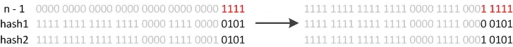
因此在重新计算hash之后，因为n变为2倍，那么n-1的mask范围在高位多1bit，因此新的index就会发生一些变化
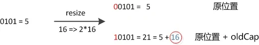
因此，我们在扩充HashMap的时候，不需要重新计算hash，只需要看看原来的hash值新增的那个bit是0还是1就好了，是0的话索引不变，是1的话索引变成"原索引+oldCap"
```java
if ((e.hash & oldCap) == 0) {  
    // ...
}  
else {  
    // ...
}
```
上述代码是resize()时发生的，因为HashMap的长度都是2次幂，因此oldCap的高位是1，而对于hash，如果hash的高位是1，在进行`hash & oldCap`时，就会加上oldCap的值，如果hash的高位是0，在进行`hash & oldCap`时，就不变
#### HashMap的大小为什么是2的n次方大小
jdk1.7中，HashMap整个扩容过程就是分别取出数组元素，一般该元素是最后一个放入链表中的元素，然后遍历以该元素为头的单向链表元素，依据每个被遍历元素的hash值计算其在新数组中的下标，然后进行交换。这样的扩容方式会将原来哈希冲突的单向链表尾部变成扩容后的单向链表头部
jdk1.8中，HashMap对扩容操作做了优化。由于扩容数字的长度是2倍关系，所以对于假设初始tableSize=4要扩容到8来说，就是从0100变成了1000（左移一位），在扩容中就只用判断原来的hash值和左移动的一位按位与操作是0或1就行，0的话索引不变，1的话变成原索引加上扩容前数组长度
之所以能通过这种与运算来重新分配索引，是因为hash值本来就是随机的，而hash按位与上newTable得到的0和1就是随机的，所以扩容的过程就能把之前哈希冲突的元素再随机分不到不同的索引中
#### HashMap和Hashtable的区别
- HashMap线程不安全，效率更高，可以存储null的key和value，null的key只能有一个，null的value可以有多个。默认初始容量为16，每次扩充变为原来的两倍。创建时如果给定了初始容量，则扩充为2的幂次方大小。底层使用数组+链表，插入元素后如果链表长度大于阈值，先判断数组长度是小于64，如果小于则扩充数字，反之将链表转化为红黑树，减少搜索时间
- Hashtable线程安全，效率更低，其内部方法基本都经过synchronized修饰，不可以有null的key和value。默认初始容量为11，每次扩容都变为原来的2n+1。创建时给定了初始容量，就会直接使用给定的大小。底层数据结构为数组+链表。现在已经基本被淘汰了
### ConcurrentHashMap
ConcurrentHashMap就是在HashMap的基础上，保证线程安全
jdk1.7中，使用数组+链表的形式实现，而数组又分为大数组Segment和小数组HashEntry
Segment是一种可重入锁，HashEntry则用于存储键值对数据
一个ConcurrentHashMap中包含一个Segment数组，一个Segment里包含一个HashEntry数组，每个HashEntry是一个链表结构的元素
jdk1.7 ConcurrentHashMap分段锁技术将数据分成一段一段存储，然后给每段数据配一把锁，当一个线程占用锁访问其中一个段数据的时候，其他段的数据也能被其他线程访问，就能够实现并发访问
jdk1.8后，ConcurrentHashMap使用了数组+链表/红黑树的方式优化了ConcurrentHashMap的实现
jdk1.8 ConcurrentHashMap主要通过volatile+CAS或者synchronized来实现线程安全。添加元素时首先会判断容器是否为空
- 如果为空，则使用volatile+CAS来初始化
- 如果不为空，则根据存储的元素计算该位置是否为空
	- 如果根据存储的元素计算结果为空，则利用CAS设置该节点
	- 如果根据存储的元素计算结果不为空，则使用synchronized，然后遍历桶中的数据，并替换或新增节点到桶中，最后在判断是否需要转换为红黑树，这样就能保证并发访问时的线程安全了
ConcurrentHashMap通过对头结点枷锁来保证线程安全，锁的粒度相比Segment来说更小了，发生冲突和加锁的频率降低了，并发操作的性能提高了
#### 分段锁是怎么加锁的
ConcurentHashMap中，将整个数据结构分为多个Segment，每个Segment都类似于一个小的HashMap，每个Segment都有自己的锁，不同Segment之间的操作互不影响，从而提高并发性能
在ConcurrentHashMap中，对于插入、更新、删除等操作，需要先定位到具体的Segment，然后再在该Segment上加锁，而不是像传统HashMap一样对整个数据结构加锁。这样可以使得不同Segment之间的操作可以并行进行，提高了并发性能
且jdk1.7中ConcurrentHashMap中的分段锁使用的是ReentrantLock，是可重入的
#### 为什么有了synchronized还要使用CAS
ConcurrentHashMap会权衡考虑使用哪个来加锁
在putVal中，如果计算出来的hash槽没有存放元素，那么就可以直接使用CAS来进行设置值，这是因为在设置元素的时候，因为hash值经过了各种扰动后，造成hash碰撞的几率较低，那么就可以预测使用较少的自旋来完成具体的hash落槽操作
当发生了hash碰撞的时候，就说明容量不够用了，或者已经有大量线程访问了，因此这时候使用synchronized来处理hash碰撞比CAS效率更高，因为发生了hash碰撞大概率是线程竞争比较激烈的情况
#### Hashtable和ConcurrentHashMap的区别
- jdk1.8之前，ConcurrentHashMap采用分段锁，对整个数组进行分段，每一把锁只锁容器里的一部分数据，多线程访问不同数据段里的数据，就不会存在锁竞争，提高了并发访问。jdk1.8之后，直接采用数组+链表/红黑树，并发控制使用CAS和synchronized操作，更提高了速度
- Hashtable所有的方法都通过synchronized加锁来保证线程安全，效率很低。当两个线程同步访问时，就会陷入阻塞或者轮询状态
## Set
Set集合中的元素是唯一的，不会出现重复的元素
Set集合通过内部的数据结构来实现key的无重复。当向Set集合中插入元素时，会先根据元素的hashCode值来确定元素的存储位置，然后再通过equals来判断是否已经存在相同的元素，如果存在则不会再次插入，保证了元素的唯一性
其中
TreeSet和LinkedHashSet是有序的。TreeSet是基于红黑树实现的，保证元素的自然顺序。LinkedHashSet是基于双重链表和哈希表的结合来实现元素的有序存储，保证元素添加的自然顺序。LinkedHashSet不仅保证元素的唯一性，还可以保证元素的插入顺序。

## Java是如何做到一次编译，到处运行的

Java可以通过jvm虚拟机实现“一次编译，到处运行”是因为java代码编译后会生成的.class字节码文件，jvm虚拟机会将其翻译成对应操作系统的机器码。例如Springboot打包后生成的jar包，部署到linux虚拟机之后，无需再次编译，可以直接运行。而部分语言（如c++）编译后生成的是对应操作系统的机器码，在windows系统上生成的是.exe文件，而在linux系统上生成的则是.elf文件，因此c++代码在另一个操作系统上就需要重新编译之后才可以运行

## String StringBuilder StringBuffer的区别

String是一种不可变对象，被final修饰，对String对象的修改操作都会生成一个新的String对象。

StringBuilder和StringBuffer都是可变对象，在修改时会在原对象的基础上进行修改

StringBuilder是线程不安全的，StringBuffer是线程安全的，因此在多线程的场景下，必须使用StringBuffer，在追求高效的场景，且无需保证线程安全的场景，才可以使用StringBuilder

---

# IO

## JAVA BIO

BIO就是传统的java io编程

BIO（Blocking IO）：同步阻塞，一个连接一个线程，即客户端有连接请求时，服务器端就需要启动一个线程进行处理，如果这个连接不做任何事情会造成不必要的线程开销，可以通过线程池工具来改善

### BIO 工作机制


客户端和服务端通过Socket连接，连接成功之后，可以通过Socket连接建立的虚拟管道来进行数据的传输

```java
public class Client {

    public static void main(String[] args) {
        try {
            Socket socket = new Socket("127.0.0.1", 9999);
            OutputStream os = socket.getOutputStream();
            // 打印流
            PrintStream ps = new PrintStream(os);
            Scanner sc = new Scanner(System.in);
            while(true){
                System.out.println("请输入：");
                String msg = sc.next();
                ps.println(msg);
                ps.flush();
            }
        } catch (IOException e) {
            throw new RuntimeException(e);
        }
    }
}
```

```java
public class Server {

    public static void main(String[] args) {

        try {
            System.out.println("========服务器启动...==========");
            ServerSocket ss = new ServerSocket(9999);
            Socket socket = ss.accept();
            InputStream inputStream = socket.getInputStream();
            // 缓冲字节输入流
            BufferedInputStream bis = new BufferedInputStream(inputStream);
            // 缓冲字符输入流 按行读取
            BufferedReader br = new BufferedReader(new InputStreamReader(bis));
            String msg;
            if((msg = br.readLine()) != null){
                System.out.println(msg);
            }
        } catch (IOException e) {
            throw new RuntimeException(e);
        }
    }
}
```

在以上的通信中，服务端会一致等待客户端的消息，如果客户端没有消息发送，服务端就会一直进入阻塞状态

同时服务端是按照行获取消息的，所以客户端也必须按照行发送消息，否则服务端将一直阻塞

无论客户端还是服务端的socket，只要有一端宕机，另一端就会直接抛出异常

## BIO接收多个客户端

每次有一个客户端发送连接请求，就创建一个新线程来处理这个客户端的请求，就可以实现BIO模式下接收多个客户端

```java
public class Server {

    public static void main(String[] args) {

        try {
            System.out.println("========服务器启动...==========");
            ServerSocket ss = new ServerSocket(9999);
            while(true){
                Socket socket = ss.accept();
                new ServerThreadReader(socket).start();
            }
        } catch (IOException e) {
            throw new RuntimeException(e);
        }
    }
}
```

```java
public class ServerThreadReader extends Thread {

    private Socket socket;

    private ServerThreadReader() {

    }

    public ServerThreadReader(Socket socket) {
        this.socket = socket;
    }

    @Override
    public void run() {
        try {
            // 从socket中获取输入流
            InputStream is = socket.getInputStream();
            // 把输入流转换成缓冲流
            BufferedReader br = new BufferedReader(new InputStreamReader(is));
            String msg ;
            if((msg = br.readLine()) != null){
                System.out.println("服务端收到消息:" + msg);
            }
        } catch (IOException e) {
            throw new RuntimeException(e);
        }
    }
}
```

### 缺点

1. 每接收到一个Socket，都会创建一个线程，线程的竞争，上下文切换等影响性能

2. 每个线程都会占用栈空间和CPU资源

3. 并不是每个Socket都会进行IO操作，无意义的线程处理

4. 客户端并发访问增加时，服务端将呈现1:1的线程开销，访问量越大，系统将发生线程栈溢出，线程创建失败，最终导致进程宕机或僵死

## 伪异步IO编程

采用线程池和任务队列实现，当客户端接入时，将客户端的Socket封装成一个Task，交给后端线程池进行处理

```java
public class Server {

    public static void main(String[] args) {

        try {
            System.out.println("========服务器启动...==========");
            ServerSocket ss = new ServerSocket(9999);
            HandleSocketServerPool pool = new HandleSocketServerPool(6, 10);
            while(true){
                Socket socket = ss.accept();
                Runnable task = new ServerRunnable(socket);
                pool.execute(task);
            }
        } catch (Exception e) {
            e.printStackTrace();
        }
    }
}
```

```java
public class ServerRunnable implements Runnable {

    private Socket socket;

    public ServerRunnable(Socket socket) {
        this.socket = socket;
    }

    @Override
    public void run() {
        // 处理客户端的通信需求
        try {
            // 从socket中获取输入流
            InputStream is = socket.getInputStream();
            // 把输入流转换成缓冲流
            BufferedReader br = new BufferedReader(new InputStreamReader(is));
            String msg ;
            if((msg = br.readLine()) != null){
                System.out.println("服务端收到消息:" + msg);
            }
        } catch (IOException e) {
            throw new RuntimeException(e);
        }
    }
}
```

```java
public class HandleSocketServerPool {
    private ExecutorService executorService;

    public HandleSocketServerPool(int maxThreadNum,int queueSize){
        this.executorService = new ThreadPoolExecutor(
                3,
                maxThreadNum,
                120,
                TimeUnit.SECONDS,
                new ArrayBlockingQueue<Runnable>(queueSize)
        );
    }

    public void execute(Runnable task){
        this.executorService.execute(task);
    }
}
```

### 缺点

1. 伪异步IO采用了线程池实现，因此避免了为每个请求创建一个独立线程造成线程资源耗尽的问题，但由于底层依然采用同步阻塞模型，因此无法从根本上解决问题

2. 如果单个消息处理的很慢，或者服务器线程池中的全部线程都被阻塞，那么后续Socket的IO消息都将在队列中排队，新的Socket请求将被拒绝，客户端会发生大量的连接超时

## BIO实现文件上传功能

```java
public class Client {

    public static void main(String[] args) {
        try(
                InputStream in = new FileInputStream("C:\\Users\\xgw\\Desktop\\shea\\java\\java基础.docx");
                ) {
            Socket socket = new Socket("127.0.0.1", 9999);
            DataOutputStream dos = new DataOutputStream(socket.getOutputStream());
            dos.writeUTF(".docx");
            byte[] data = new byte[1024];
            int len;
            while((len = in.read(data)) > 0){
                dos.write(data, 0, len);
            }
            dos.flush();
            socket.shutdownOutput(); // 通知服务端客户端的数据发送完毕
        } catch (IOException e) {
            throw new RuntimeException(e);
        }
    }
}
```

```java
public class ServerReaderThread extends Thread{

    private Socket socket;

    public ServerReaderThread(Socket socket) {
        this.socket = socket;
    }

    @Override
    public void run() {
        try {
            DataInputStream dis = new DataInputStream(socket.getInputStream());
            String suffix = dis.readUTF();
            System.out.println("服务端接收到文件类型:" + suffix);
            OutputStream os = new FileOutputStream("C:\\Users\\xgw\\Desktop\\shea\\java\\Server\\" +
                    UUID.randomUUID().toString() + suffix);
            byte[] buffer = new byte[1024];
            int len;
            while ((len = dis.read(buffer)) > 0){
                os.write(buffer, 0, len);
            }
            os.close();
            System.out.println("服务端保存文件成功");
        } catch (Exception e) {
            throw new RuntimeException(e);
        }
    }
}
```

## BIO模式下的端口转发思想

**端口转发**（Port Forwarding）是一种网络技术，将来自一个网络端口的数据流量转发到另一个网络端口或主机。

```java
public class ServerReaderThread extends Thread{

    private Socket socket;

    public ServerReaderThread(Socket socket) {
        this.socket = socket;
    }

    @Override
    public void run() {
        try {
            // 从socket中获取当前客户端的输入流
            BufferedReader br = new BufferedReader(new InputStreamReader(socket.getInputStream()));
            String msg;
            while((msg = br.readLine()) != null) {
                // 服务端接收到客户端消息后，需要推送给当前所有的在线socket
                sendMsg2AllClient(msg);
            }
        } catch (Exception e) {
            System.out.println("当前有客户端下线");
            Server.allSocketsOnline.remove(socket);
        }
    }

    private void sendMsg2AllClient(String msg) {
        for (Socket sk : Server.allSocketsOnline) {
            try {
                PrintStream ps = new PrintStream(sk.getOutputStream());
                ps.println(msg);
                ps.flush();
            } catch (IOException e) {
                e.printStackTrace();
            }
        }
    }
}
```

## Java NIO

NIO（Non-blocking IO）支持面向缓冲区的，基于通道的IO操作

非阻塞式读取，使一个线程从某通道发送请求或读取数据时，如果目前没有数据可用，则什么都不会获取，而不是保持线程阻塞 

非阻塞式写，一个线程请求写入一些数据到某通道，但不需要等待它完全写入，这个线程同时可以去做别的事情

### NIO和BIO

BIO是以流的方式处理数据，而NIO是以块的方式处理数据，块IO的效率比流IO的效率高很多

BIO是基于字节流和字符流进行操作，而NIO基于Channel（通道）和Buffer（缓冲区）进行操作，数据总是从通道读取到缓冲区中，或者从缓冲区写入到通道中，Selector（选择器）用于监听多个通道的事件，因此单个线程就可以监听多个客户端通道


### NIO三大核心

#### Buffer

缓冲区本质上是一块可以写入数据，然后可以从中读取数据的内存。这块内存被包装成NIO Buffer对象，并提供了一组方法，以便访问该块内存

#### Channel

Java NIO通道类似流，但也有些不同。既可以从通道中获取数据，又可以写数据到通道中，但流的读写通常是单向的，通道可以非阻塞读取和写入通道，通道可以支持读取或写入缓冲区，支持异步读写

#### Selector

Selector是一个Java NIO组件，能够检查一个或多个NIO通道，并确定哪些通道已经准备好进行读取或写入，这样，一个线程可以管理多个Channel，从而管理多个网络连接，提高效率

### Buffer

一个用于特定基本数据类型的容器，所有缓冲区都是Buffer抽象类的子类，NIO中的Buffer主要用于与NIO通道进行交互，从中读取或写入数据

#### 基本属性

**容量(capacity)** ：作为一个内存块，Buffer具有一个固定的大小，容量不能为负，并且创建后不能更改

**限制(limit)** ：表示缓冲区可操作数据的大小（limit后的数据不能进行读写），缓冲区的限制不能为负，且不能大于其容量。**写入模式：限制等于buffer的容量，读取模式：limit等于写入的数据量**

**位置(position)** ：下一个要读取或写入数据的索引，缓冲区位置不能为负，且不能大于其限制

**标记(mark)与重置(reset)** ：标记是一个索引，通过Buffer中的mark()方法指定Buffer中一个特定的位置，之后可以通过reset()方法恢复到这个位置

**0<=mark<=position<=limit<=capacity**

### 直接与非直接缓冲区

ByteBuffer可以是两种类型，一种是基于直接内存（非堆内存），另一种是非直接内存（堆内存）。对于直接内存来说，JVM将会在IO操作上有更高的性能，因为它直接作用于本地系统的IO操作，而非直接内存，也就是堆内存中的数据，如果要做IO操作，会先从本进程内存复制到直接内存，再利用本地IO处理

从数据流的角度，非直接内存是下面的作用链

`本地IO --> 直接内存 --> 非直接内存 --> 直接内存 --> 本地IO`

而直接内存是

`本地IO --> 直接内存 --> 本地IO`

因此在做IO处理时，直接内存有更高的效率，直接内存使用allocateDirect创建，但是它比申请普通堆内存需要耗费更高的性能，不过这部分数据是JVM之外的，不会占用应用程序的内存，所以如果有很大的数据要缓存，并且它的生命周期很长，就适合使用**直接内存**

### Channel

Channel表示IO源与目标打开的连接，Channel类似于流，但是Channel不能直接访问数据，只能通过和Buffer交互

#### 通道和流的区别

1. 通道可以同时进行读写，而传统的流只能读或者写

2. 通道可以实现异步读写数据

3. 通道可以从缓冲中读数据，也可以写数据到缓冲中

向文件中写数据

```java
public class ChannelTest {

    @Test
    public void write(){
        try{
            FileOutputStream out = new FileOutputStream("data.txt");
            FileChannel fc = out.getChannel();
            ByteBuffer buffer = ByteBuffer.allocate(1024);
            buffer.put("hello world".getBytes());
            buffer.flip();
            fc.write(buffer);
        }catch (FileNotFoundException e){
            e.printStackTrace();
        } catch (IOException e) {
            throw new RuntimeException(e);
        }
    }
}
```

向文件中读数据

```java
@Test
    public void read(){
        try {
            FileInputStream in = new FileInputStream("data.txt");
            ByteBuffer buffer = ByteBuffer.allocate(1024);
            FileChannel fc = in.getChannel();
            fc.read(buffer);
            buffer.flip(); // 切换缓冲区模式，防止读取到空字节
            String s = new String(buffer.array(),0,buffer.remaining());
            System.out.println(s);
        } catch (FileNotFoundException e) {
            e.printStackTrace();
        } catch (IOException e) {
            throw new RuntimeException(e);
        }
    }
```

复制文件

```java
@Test
    public void copy(){
        File src = new File("C:\\Users\\xgw\\Pictures\\Screenshots\\屏幕截图 2025-06-18 002903.png");
        File dest = new File("1.png");
        try {
            FileInputStream fis = new FileInputStream(src);
            FileOutputStream fos = new FileOutputStream(dest);
            ByteBuffer buffer = ByteBuffer.allocate(1024);
            FileChannel is = fis.getChannel();
            FileChannel os = fos.getChannel();
            while(true){
                // 必须要先清空缓冲区，然后再写入数据到缓冲区
                buffer.clear();
                // 开始获取一次数据
                int flag = is.read(buffer);
                if(flag == -1){
                    break;
                }
                buffer.flip();
                os.write(buffer);
            }
        } catch (FileNotFoundException e) {
            throw new RuntimeException(e);
        } catch (IOException e) {
            throw new RuntimeException(e);
        }
    }
```

聚集和分散

```java
    @Test
    public void test(){
        try{
            FileInputStream fis = new FileInputStream("data.txt");
            FileChannel is = fis.getChannel();
            FileOutputStream fos = new FileOutputStream("data1.txt");
            FileChannel os = fos.getChannel();
            ByteBuffer buffer1 = ByteBuffer.allocate(4);
            ByteBuffer buffer2 = ByteBuffer.allocate(1024);
            ByteBuffer[] buffers = {buffer1,buffer2};
            is.read(buffers);
            for(ByteBuffer buffer : buffers){
                buffer.flip();
                System.out.print(new String(buffer.array(),0,buffer.remaining()));
            }
            os.write(buffers);
            is.close();
            os.close();
        }catch (Exception e){
            e.printStackTrace();
        }
    }
```

聚集和分散，通过读写多个ByteBuffer，一次性处理多个缓冲区，减少上下文的切换，从而提高性能。在处理结构化数据时，也会更加清晰，代码简洁

### Selector

Selector是SelectableChannel对象的多路复用器，Selector可以同时监控多个SelectableChannel的IO状况，也就是说，可以利用Selector单独的一个线程管理多个Channel，Selector是非阻塞式IO的核心

**NIO非阻塞机制实现**

```java
public class Client {
    public static void main(String[] args) {
        try {
            SocketChannel channel = SocketChannel.open(new InetSocketAddress("127.0.0.1", 9999));
            channel.configureBlocking(false);
            ByteBuffer buffer = ByteBuffer.allocate(1024);
            // 发送数据给服务端
            Scanner sc = new Scanner(System.in);
            while(true){
                System.out.println("请输入：");
                String msg = sc.nextLine();
                buffer.put(("Shea：" + msg).getBytes());
                buffer.flip();
                channel.write(buffer);
                buffer.clear();
            }
        } catch (IOException e) {
            throw new RuntimeException(e);
        }
    }
}
```

```java
public class Server {
    public static void main(String[] args) {
        try {
            System.out.println("=========服务器启动==========");
            ServerSocketChannel ssc = ServerSocketChannel.open();
            ssc.configureBlocking(false);
            ssc.bind(new InetSocketAddress(9999));
            Selector selector = Selector.open();
            ssc.register(selector, SelectionKey.OP_ACCEPT);
            // 使用Selector轮询已经就绪好的事件
            while(selector.select() > 0) {
                System.out.println("==========开始处理事件============");
                // 获取选择器中的所有注册的通道中已经就绪好的事件
                Iterator<SelectionKey> selectionKeys = selector.selectedKeys().iterator();
                while(selectionKeys.hasNext()) {
                    SelectionKey next = selectionKeys.next();
                    // 判断事件类型
                    if(next.isAcceptable()) {
                        // 直接获取当前接入的客户端通道
                        ServerSocketChannel channel =(ServerSocketChannel) next.channel();
                        SocketChannel socketChannel = channel.accept();
                        // 切换成非阻塞式通道
                        socketChannel.configureBlocking(false);
                        socketChannel.register(selector, SelectionKey.OP_READ);
                    }else if(next.isReadable()) {
                        // 获取当前选择器上的读就绪事件
                        SocketChannel sk = (SocketChannel) next.channel();
                        ByteBuffer buffer = ByteBuffer.allocate(1024);
                        int len = 0;
                        while((len = sk.read(buffer)) > 0){
                            buffer.flip();
                            System.out.println(new String(buffer.array(),0,len));
                            buffer.clear();
                        }
                    }
                    selectionKeys.remove();
                }
            }
        } catch (IOException e) {
            throw new RuntimeException(e);
        }
    }
}
```
---
# 设计模式
## 创建者模式
创建者模式主要关注“怎么创建对象”，主要特点是将对象的创建与使用分离，可以降低耦合度，使用者不需要关注如何创建对象，只需要使用即可
### 单例模式
单例模式指的是一个单一的类，该类负责创建自己的实例对象，并且只有这个类可以创建实例对象，且创建的实例对象有且只有一个，该类实例对象可以通过访问方法直接访问，不需要实例化类
**饿汉式**：类加载时就会创建实例对象
```java
public class Singleton {  
	// 私有化构造方法，防止外界创建对象
    private Singleton() {}  
    private static final Singleton instance = new Singleton();  
      
    public static Singleton getInstance() {  
        return instance;  
    }  
}
```
**静态内部类**
JVM在加载外部类过程中，不会加载静态内部类，只有在调用内部类的属性或方法时才会被加载，而静态内部类可以保证类制备实例化一次，并且严格保证实例化顺序
```java
public class Singleton {  
  
    private Singleton() {}  
  
    private static class Holder {  
        private static final Singleton INSTANCE = new Singleton();  
    }  
    public static Singleton getInstance() {  
        return Holder.INSTANCE;  
    }  
}
```
**枚举类**
枚举类实现单例模式是十分推荐的方法，因为枚举类型是线程安全的，并且只会被装载一次
```java
public enum Singleton {
	INSTANCE;
}
```
**懒汉式**：类加载时不会创建实例对象，只有首次使用的时候才会创建实例对象
```java
public class Singleton {  
  
    private Singleton() {}  
  
    private static Singleton instance;  
  
    public static Singleton getInstance() {  
        if (instance == null) {  
            instance = new Singleton();  
        }  
        return instance;  
    }  
}
```
但是上述代码是线程不安全的，如果同时有两个线程进入该方法，都会判断instance为null，因此两个线程都会实例化一个对象
线程安全版(double check)
```java
public class Singleton {  
  
    private Singleton() {}  
  
    private static volatile Singleton instance;  
  
    public static Singleton getInstance() {  
        if (instance == null) {  
            synchronized (Singleton.class) {  
                if (instance == null) {  
                    instance = new Singleton();  
                }  
            }  
        }  
        return instance;  
    }  
}
```
**tips**：为什么需要两次判断instance是否为null？为什么要使用volatile关键字？
1. 多线程场景下，如果instance已经被实例化了，则可以不用创建对象，直接返回实例对象。第二次判断instance是否为null，是为了确保只创建了一个实例对象
2. volatile关键字可以确保创建对象过程不被JVM指令重排优化，实例化对象不是一个原子操作，实际上包含了三步，**分配内存空间，初始化对象，将引用指向内存地址**，由于JVM的指令重排，可能会导致其他线程看到未完全初始化的对象，从而出现空指针问题
#### 破坏单例模式
除了枚举类的创建单例对象以外，其他方法的单例模式都可以通过序列化和反射来破坏单例模式
**序列化和反序列化**
```java
public class Main {  
  
    public static void main(String[] args) throws Exception {  
        writeObject();  
        Singleton singleton1 = readObject();  
        Singleton singleton2 = readObject();  
        System.out.println(singleton1 == singleton2);  
    }  
  
    public static Singleton readObject() throws Exception {  
        ObjectInputStream ois = new ObjectInputStream(new FileInputStream("C:\\Users\\xgw\\Desktop\\shea\\a.txt"));  
        Singleton singleton = (Singleton) ois.readObject();  
        ois.close();  
        return singleton;  
    }  
  
  
    public static void writeObject() throws IOException {  
        Singleton singleton = Singleton.getInstance();  
        ObjectOutputStream oos = new ObjectOutputStream(new FileOutputStream("C:\\Users\\xgw\\Desktop\\shea\\a.txt"));  
        oos.writeObject(singleton);  
        oos.close();  
    }  
}
```

显而易见，最后得到的两个对象的地址不同，单例模式被破坏
**解决方法**
在Singleton类中重写readResolve方法，直接返回单例对象，在调用readObject方法的时候，会判断是否有重写readResolve方法，如果没有，则会直接new一个新的对象，如果有，则会调用重写的readResolve方法
```java
public Object readResolve() {  
    return Holder.INSTANCE;  
}
```

**反射**
```java
public class Main {  
  
    public static void main(String[] args) throws Exception {  
        Class<Singleton> clazz = Singleton.class;  
        Constructor<Singleton> constructor = clazz.getDeclaredConstructor();  
        constructor.setAccessible(true);  
        Singleton singleton1 = constructor.newInstance();  
        Singleton singleton2 = constructor.newInstance();  
        System.out.println(singleton1 == singleton2);  
    }  
}
```

可以看到，反射也可以破坏单例模式
### 工厂模式
定义一个用于创建对象的接口，让子类决定实例化哪个对象，工厂方法使对象的实例化延迟到其工厂的字类
首先需要定义一个工厂接口
```java
public interface CoffeeFactory {  
    Coffee createCoffee();  
}
```
分别实现工厂接口
```java
public class AmericanCoffeeFactory implements CoffeeFactory {  
    @Override  
    public Coffee createCoffee() {  
        return new AmericanCoffee();  
    }  
}
```
```java
public class LatteCoffeeFactory implements CoffeeFactory {  
    @Override  
    public Coffee createCoffee() {  
        return new LatteCoffee();  
    }  
}
```
```java
public interface Coffee {  
}
```
```java
public class AmericanCoffee implements Coffee {  
}
```
```java
public class LatteCoffee implements Coffee {  
}
```
```java
public class Main {  
  
    public static void main(String[] args) {  
        CoffeeStore coffeeStore = new CoffeeStore();  
        coffeeStore.setCoffeeFactory(new LatteCoffeeFactory());  
        Coffee latte = coffeeStore.order();  
        coffeeStore.setCoffeeFactory(new AmericanCoffeeFactory());  
        Coffee american = coffeeStore.order();  
        System.out.println(latte);  
        System.out.println(american);  
    }  
}
```

我们通过工厂模式将创建对象这一步骤交给工厂来实现，对于不同的实现类，可以提供使用同样的方法来创建对象
**优点**：
1. 将对象的创建与使用分离
2. 添加新产品的时候只需要新增工厂类，无需修改已有代码
3. 每个工厂类只负责创建一种产品
4. 创建逻辑集中在工厂类中
---
**缺点**：
1. 类的数量增加，每次新增产品都需要新增多个类
2. 增加了抽象层和理解难度
### 抽象工厂模式
抽象工厂模式是一种创建型设计模式，它能创建一系列相关的对象，而无需指定其具体类。它提供了一个接口，用于创建**相关或依赖对象的家族**，而不需要明确指定具体类。
在原有咖啡代码不变的情况下，新增以下代码
```java
public abstract class Dessert {    
    public abstract void show();  
}
public class Tiramisu extends Dessert{  
    @Override  
    public void show() {  
        System.out.println("提拉米苏");  
    }  
}
public class MatchaMousse extends Dessert {  
  
    @Override  
    public void show() {  
        System.out.println("抹茶慕斯");  
    }  
}
```
```java
public interface DessertFactory {  
  
    Coffee createCoffee();  
  
    Dessert createDessert();  
}
public class AmericanDessertFactory implements DessertFactory {  
    @Override  
    public Coffee createCoffee() {  
        return new AmericanCoffee();  
    }  
  
    @Override  
    public Dessert createDessert() {  
        return new MatchaMousse();  
    }  
}
public class ItalyDessertFactory implements DessertFactory {  
    @Override  
    public Coffee createCoffee() {  
        return new LatteCoffee();  
    }  
  
    @Override  
    public Dessert createDessert() {  
        return new Tiramisu();  
    }  
}
```
```java
public class Main {  
  
    public static void main(String[] args) {  
        ItalyDessertFactory italyDessertFactory = new ItalyDessertFactory();  
        Coffee latte = italyDessertFactory.createCoffee();  
        Dessert tiramisu = italyDessertFactory.createDessert();  
        System.out.println(latte);  
        System.out.println(tiramisu);  
    }  
}
```

可以看到，我们创建对象时，完全不需要关注其具体如何创建，只需要确定需要创建的是哪一类对象，然后new出对象工厂，就可以根据工厂提供的方法，创建出一类对象
### 原型模式
用一个已经创建的实例作为原型，通过复制该原型对象来创建一个和原型对象相同的新对象
原型类必须要实现clone()方法
克隆分为浅克隆和深克隆
**浅克隆**：创建一个新的对象，这个对象的属性和原来的对象完全相同，对于非基本类型，属性的引用仍指向原对象的内存地址
**深克隆**：创建一个新的对象，对于非基本类型，也会创建新的对象，其引用会指向新的内存地址
```java
public class User implements Cloneable {  
    @Override  
    public User clone() {  
        try {  
            System.out.println("复制User对象");  
            return (User) super.clone();  
        } catch (CloneNotSupportedException e) {  
            throw new AssertionError();  
        }  
    }  
}
```
```java
public class Main {  
  
    public static void main(String[] args) {  
        User user = new User();  
        User user1 = user.clone();  
        System.out.println(user == user1);  
    }  
}
```

可以看到，通过clone()方法克隆出了一个新对象
#### 深克隆
深克隆有两种方法可以实现，一是字类实现克隆接口，父类的拷贝构造函数中对其进行克隆，二是通过序列化的方式，对类进行深克隆
```java
public class Student implements Cloneable {  
  
    private String name;  
  
    public String getName() {  
        return name;  
    }  
  
    public void setName(String name) {  
        this.name = name;  
    }  
  
    @Override  
    public Student clone() {  
        try {  
            return (Student) super.clone();  
        } catch (CloneNotSupportedException e) {  
            throw new AssertionError();  
        }  
    }  
}
public class Classroom implements Cloneable{  
  
    private Student student;  
  
    public Student getStudent() {  
        return student;  
    }  
  
    public void setStudent(Student student) {  
        this.student = student;  
    }  
  
    @Override  
    public Classroom clone() {  
        try {  
            Classroom cloned = (Classroom) super.clone();  
            if(this.student != null){  
                this.student = this.student.clone();  
            }  
            return cloned;  
        } catch (CloneNotSupportedException e) {  
            throw new AssertionError();  
        }  
    }  
}
```
```java
public class Main {  
  
    public static void main(String[] args) {  
        Classroom classroom = new Classroom();  
        Student stu = new Student();  
        stu.setName("Shea");  
        classroom.setStudent(stu);  
        Classroom clone = classroom.clone();  
        clone.getStudent().setName("Shea11");  
        System.out.println("原对象:" + classroom.getStudent().getName());  
        System.out.println("克隆对象:" + clone.getStudent().getName());  
    }  
}
```
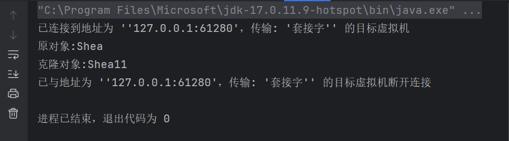
**序列化实现深克隆**
```java
public class Student implements Serializable {  
  
    private String name;  
  
    public String getName() {  
        return name;  
    }  
  
    public void setName(String name) {  
        this.name = name;  
    }  
}
public class Classroom implements Cloneable, Serializable {  
  
    private Student student;  
  
    public Student getStudent() {  
        return student;  
    }  
  
    public void setStudent(Student student) {  
        this.student = student;  
    }  
  
    @Override  
    public Classroom clone() {  
        try {  
            return (Classroom) super.clone();  
        } catch (CloneNotSupportedException e) {  
            throw new AssertionError();  
        }  
    }  
}

```
```java
public class Main {  
  
    public static void main(String[] args) throws Exception {  
        Classroom classroom = new Classroom();  
        Student stu = new Student();  
        stu.setName("Shea");  
        classroom.setStudent(stu);  
        ObjectOutputStream oos = new ObjectOutputStream(new FileOutputStream("C:\\Users\\xgw\\Desktop\\shea\\a.txt"));  
        oos.writeObject(classroom);  
        ObjectInputStream ois = new ObjectInputStream(new FileInputStream("C:\\Users\\xgw\\Desktop\\shea\\a.txt"));  
        Classroom clone = (Classroom) ois.readObject();  
        ois.close();  
        oos.close();  
        clone.getStudent().setName("Shea11");  
        System.out.println("原对象:" + classroom.getStudent().getName());  
        System.out.println("克隆对象:" + clone.getStudent().getName());  
    }  
}
```
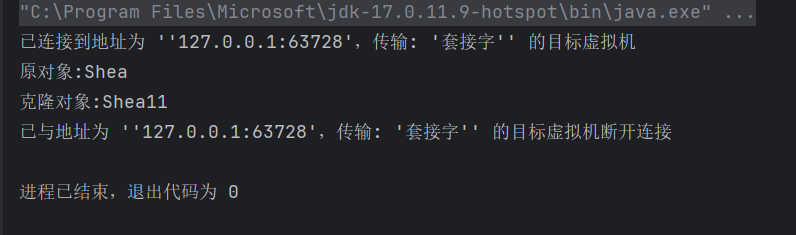
### 建造者模式
建造者模式将复杂的对象的构造分离出来，由builder对象专门负责构建其内部的属性，用户不需要知道其内部具体的构造细节
```java
public class Computer {  
  
    private String cpu;  
    private String ram;  
    private String disk;  
    private String keyboard;  
    private String mouse;  
  
    public static class Builder {  
        private String cpu;  
        private String ram;  
        private String disk;  
        private String keyboard;  
        private String mouse;  
  
        public Builder cpu(String cpu) {  
            this.cpu = cpu;  
            return this;  
        }  
        public Builder ram(String ram) {  
            this.ram = ram;  
            return this;  
        }  
        public Builder disk(String disk) {  
            this.disk = disk;  
            return this;  
        }  
        public Builder keyboard(String keyboard) {  
            this.keyboard = keyboard;  
            return this;  
        }  
        public Builder mouse(String mouse) {  
            this.mouse = mouse;  
            return this;  
        }  
        public Computer build() {  
            Computer computer = new Computer();  
            computer.cpu = this.cpu;  
            computer.ram = this.ram;  
            computer.disk = this.disk;  
            computer.keyboard = this.keyboard;  
            computer.mouse = this.mouse;  
            return computer;  
        }  
    }  
  
    @Override  
    public String toString() {  
        return "Computer{" +  
                "cpu='" + cpu + '\'' +  
                ", ram='" + ram + '\'' +  
                ", disk='" + disk + '\'' +  
                ", keyboard='" + keyboard + '\'' +  
                ", mouse='" + mouse + '\'' +  
                '}';  
    }  
}
```
```java
public class Main {  
  
    public static void main(String[] args) {  
        Computer computer = new Computer.Builder()  
                .cpu("Intel i9")  
                .ram("16GB")  
                .disk("512GB")  
                .keyboard("Logitech")  
                .mouse("Logitech")  
                .build();  
        System.out.println(computer);  
    }  
}
```
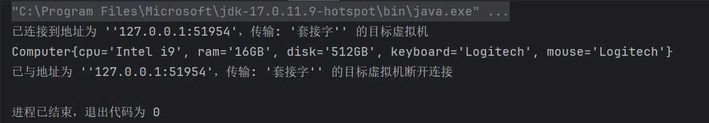
## 结构型模式
结构型模式描述如何将类或对象按某种布局组成更大的结构，它分为类结构型模式和对象结构型模式。前者采用继承机制来组织接口和类，后者采用组合或聚合来组合对象。结构型模式的核心目标是简化系统的设计，通过识别对象之间简单的关系来满足功能需求。
### 代理模式
代理模式，即给某一个对象提供一个代理对象，由代理对象来控制对原对象的操作，代理对象指向原对象的引用
同时，代理模式都可以在不修改原代码的基础上，对代码进行增强
#### 静态代理
静态代理是代理模式的一种，通过创建一个代理类来代表原对象，在编译时就已经确定了代理关系
```java
public interface UserService {    
    void sayHello();  
}
public class UserServiceImpl implements UserService {  
    @Override  
    public void sayHello() {  
        System.out.println("Hello World");  
    }  
}
```
```java
public class UserProxy implements UserService {  
  
    private UserService userService;  
  
    public UserProxy(UserService userService) {  
        this.userService = userService;  
    }  
    @Override  
    public void sayHello() {  
        System.out.println("开始代理，记录日志 " + System.currentTimeMillis());  
        userService.sayHello();  
        System.out.println("代理结束，记录日志 " + System.currentTimeMillis());  
    }  
}
```
```java
public class Main {  
  
    public static void main(String[] args) {  
        UserProxy proxy = new UserProxy(new UserServiceImpl());  
        proxy.sayHello();  
    }  
}
```
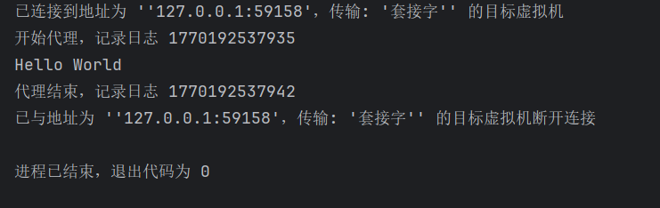
#### JDK动态代理
Java中提供了一个动态代理类Proxy，Proxy提供了一个创建代理对象的静态方法newProxyInstance()来获取代理对象
```java
public class ProxyFactory {  
  
    private final UserServiceImpl userServiceImpl = new UserServiceImpl();  
      
    public UserService getUserService() {  
        UserService userService = (UserService) Proxy.newProxyInstance(  
                userServiceImpl.getClass().getClassLoader(),  
                userServiceImpl.getClass().getInterfaces(),  
                (proxy, method, args) -> {  
                    System.out.println("开始代理，记录日志 " + System.currentTimeMillis());  
                    return method.invoke(userServiceImpl, args);   
                }  
        );  
        return userService;  
    }  
}
```
```java
public class Main {  
  
    public static void main(String[] args) {  
        ProxyFactory proxyFactory = new ProxyFactory();  
        UserService userService = proxyFactory.getUserService();  
        userService.sayHello();  
    }  
}
```
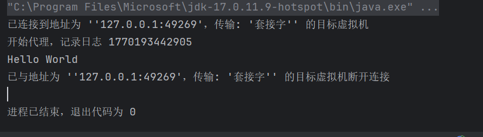
代理对象调用sayHello()方法，本质上就是在调用InvocationHandler接口中实现的invoke方法
#### CGLIB动态代理
从newProxyInstance方法的参数中我们可以知道，jdk动态代理的代理类必须是实现了某个接口的类，那么对于没有实现接口的类，我们可以使用cglib动态代理来实现
```java
public class UserServiceImpl  {  
    public void sayHello() {  
        System.out.println("Hello World");  
    }  
}
public class ProxyFactory implements MethodInterceptor {  
  
    private final UserServiceImpl target = new UserServiceImpl();  
  
    public UserServiceImpl getProxyObject(){  
        Enhancer enhancer = new Enhancer();  
        // 设置父类的字节码对象  
        enhancer.setSuperclass(UserServiceImpl.class);  
        // 设置回调函数  
        enhancer.setCallback(this);  
        // 创建代理对象  
        UserServiceImpl userService = (UserServiceImpl) enhancer.create();  
        return userService;  
    }  
  
    @Override  
    public Object intercept(Object obj, Method method, Object[] args, MethodProxy proxy) throws Throwable {  
        System.out.println("打印日志，当前时间："+ System.currentTimeMillis());  
        return method.invoke(target, args);  
    }  
}
```
```java
public class Main {  
  
    public static void main(String[] args) {  
        ProxyFactory proxyFactory = new ProxyFactory();  
        UserServiceImpl proxyObject = proxyFactory.getProxyObject();  
        proxyObject.sayHello();  
    }  
}
```
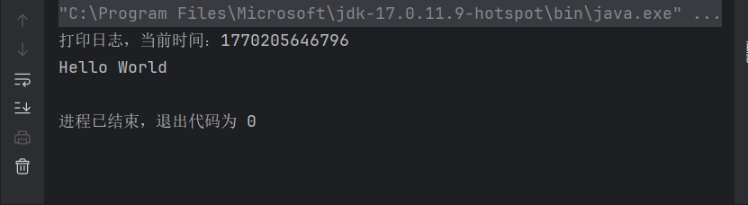
**cglib动态代理 VS jdk动态代理**
1. jdk动态代理的代理类必须要实现接口，cglib动态代理的代理类则不需要，cglib是通过继承目标类创建字类作为代理类，因为cglib是通过继承创建代理类，因此对于final修饰的方法，cglib无法进行代理
2. jdk代理比cglib代理性能更差，因为jdk代理使用的是反射机制，而cglib使用的是字节码
**优点**：
- 代理模式在客户端与目标对象之间起到了一个中介作用和保护目标对象的作用
- 代理对象可以扩展目标对象的功能
- 代理模式能将客户端与目标对象分离，在一定程度上降低了系统的耦合度
**缺点**：
- 增加了系统的复杂度
### 适配器模式
**将一个类的接口转换成客户端期望的另一个接口**，使得原本由于接口不兼容而不能一起工作的那些类能一起工作，类似于电源适配器的作用
适配器模式分为类适配器模式和对象适配器模式
#### 类适配器模式
```java
public interface TypeC {    
    void connectTypeC();  
}
public class TypeCImpl implements TypeC{  
    @Override  
    public void connectTypeC() {  
        System.out.println("TypeC connected");  
    }  
}
```
```java
public interface USB {  
    void connectUSB();  
}
public class USBImpl implements USB{  
    @Override  
    public void connectUSB() {  
        System.out.println("USB connected");  
    }  
}
```
```java
public class Computer {  
    public void connectAdapter(USB usb){  
        usb.connectUSB();  
    }  
}
```
```java
public class Main {  
  
    public static void main(String[] args) {  
        Computer computer = new Computer();  
        USB usb = new USBImpl();  
        computer.connectAdapter(usb);  
        TypeC2USBAdapter adapter = new TypeC2USBAdapter();  
        computer.connectAdapter(adapter);  
    }  
}
```
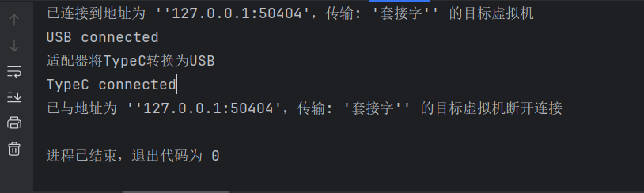
上述代码中，Computer类原先只能连接USB接口，在适配器的作用下，将TypeC接口转换成USB接口，成功让Computer类连接上TypeC接口
#### 对象适配器模式
对象适配器模式可采用将现有组件库中已经实现的组件引入适配器类中，该类同时实现当前系统的业务接口
```java
public class TypeC2USBAdapter implements USB {  
    private TypeC typeC;  
      
    public TypeC2USBAdapter(TypeC typeC) {  
        this.typeC = typeC;  
    }  
    @Override  
    public void connectUSB() {  
        System.out.println("适配器将TypeC转换为USB");  
        typeC.connectTypeC();  
    }  
}
```
只需要将原先的继承的类改为成员变量形式即可
### 装饰者模式
装饰器模式，即在不改变现有对象结构的情况下，动态地给该对象增加一些职责
```java
public interface Coffee {  
  
    Double getPrice();  
  
    String getDesc();  
}
public class AmericanCoffee implements Coffee {  
    @Override  
    public Double getPrice() {  
        return 9.9;  
    }  
  
    @Override  
    public String getDesc() {  
        return "American Coffee";  
    }  
}
```
```java
abstract class CoffeeDecorator implements Coffee {  
  
    protected Coffee coffee;  
  
    public CoffeeDecorator(Coffee coffee) {  
        this.coffee = coffee;  
    }  
  
    @Override  
    public Double getPrice() {  
        return coffee.getPrice();  
    }  
  
    @Override  
    public String getDesc() {  
        return coffee.getDesc();  
    }  
}
public class MilkDecorator extends CoffeeDecorator {  
  
    public MilkDecorator(Coffee coffee) {  
        super(coffee);  
    }  
  
    @Override  
    public Double getPrice() {  
        return super.getPrice() + 2.0;  
    }  
  
    @Override  
    public String getDesc() {  
        return super.getDesc() + ", Milk";  
    }  
}
public class SugarDecorator extends CoffeeDecorator {  
  
    public SugarDecorator(Coffee coffee) {  
        super(coffee);  
    }  
  
    @Override  
    public Double getPrice() {  
        return super.getPrice() + 1.0;  
    }  
  
    @Override  
    public String getDesc() {  
        return super.getDesc() + ", Sugar";  
    }  
}
```
```java
public class Main {  
  
    public static void main(String[] args) {  
        Coffee coffee = new AmericanCoffee();  
        System.out.println(coffee.getDesc() + " $" + coffee.getPrice());  
  
        coffee = new MilkDecorator(coffee);  
        System.out.println(coffee.getDesc() + " $" + coffee.getPrice());  
  
        coffee = new SugarDecorator(coffee);  
        System.out.println(coffee.getDesc() + " $" + coffee.getPrice());  
    }  
}
```
上述代码中，我们可以在不修改原有的咖啡类的同时，对咖啡进行加糖和加牛奶的操作
**静态代理和装饰者模式的区别**
相同点：
-  都要实现与目标类相同的业务接口
*  在两个类中都要声明目标对象
-  都可以在不修改目标类的前提下增强目标方法
不同点：
- 目的不同 装饰者是为了增强目标对象 静态代理是为了保护和隐藏目标对象
- 获取目标对象构建的地方不同 装饰者是由外界传递进来，可以通过构造方法传递 
- 静态代理是在代理类内部创建，以此来隐藏目标对象
### 桥接模式
将抽象与实现分离，使它们可以独立变化。它是用组合关系代替继承关系来实现，从而降低了抽象和实现这两个可变维度的耦合度
```java
public interface Color {  
    void show();  
}
public class Green implements Color{  
    @Override  
    public void show() {  
        System.out.print("Green ");  
    }  
}
public class Blue implements Color{  
    @Override  
    public void show() {  
        System.out.print("Blue ");  
    }  
}
```
```java
public abstract class Shape {  
  
    protected Color color;  
  
    public Shape(Color color) {  
        this.color = color;  
    }  
  
    abstract void draw();  
}
public class Circle extends Shape {  
  
    public Circle(Color color) {  
        super(color);  
    }  
  
    @Override  
    void draw() {  
        color.show();  
        System.out.println("Circle");  
    }  
}
public class Tangle extends Shape {  
  
    public Tangle(Color color) {  
        super(color);  
    }  
  
    @Override  
    void draw() {  
        color.show();  
        System.out.println("Tangle");  
    }  
}
```
```java
public class Main {  
  
    public static void main(String[] args) {  
        Shape circle = new Circle(new Blue());  
        Shape circle2 = new Circle(new Green());  
        Shape tangle = new Tangle(new Blue());  
        Shape tangle2 = new Tangle(new Green());  
        circle.draw();  
        circle2.draw();  
        tangle.draw();  
        tangle2.draw();  
    }  
}
```
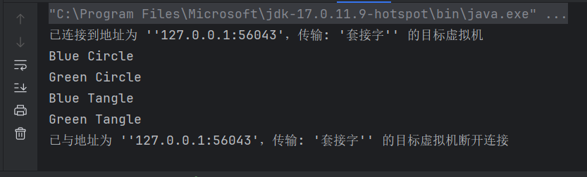
可以看到，如果我们不使用桥接模式来实现，可能会导致类爆炸，每一种颜色的图形就需要一个单独的类，而使用桥接模式，可以通过聚合来减少类的增加。如果有新的颜色或者图形增加，只需要新增一个类实现接口即可
### 外观模式
又叫门面模式，是一种通过多个复杂的子系统提供一个一致的接口，而使这些子系统更加容易被访问的模式，该模式对外有一个统一接口，外部应用程序不关心内部子系统的具体实现细节
```java
public class TV {  
    public void on(){  
        System.out.println("TV is on");  
    }  
  
    public void off(){  
        System.out.println("TV is off");  
    }  
}
public class AirCondition {  
    public void on(){  
        System.out.println("AirCondition is on");  
    }  
  
    public void off(){  
        System.out.println("AirCondition is off");  
    }  
}
public class Light {  
    public void on(){  
        System.out.println("Light is on");  
    }  
  
    public void off(){  
        System.out.println("Light is off");  
    }  
}
```
```java
public class SmartAssistFacade {  
  
    private final Light light;  
    private final TV tv;  
    private final AirCondition airCondition;  
  
    public SmartAssistFacade() {  
        this.light = new Light();  
        this.tv = new TV();  
        this.airCondition = new AirCondition();  
    }  
  
    public void on(){  
        light.on();  
        tv.on();  
        airCondition.on();  
    }  
  
    public void off(){  
        light.off();  
        tv.off();  
        airCondition.off();  
    }  
}
```
```java
public class Main {  
  
    public static void main(String[] args) {  
        SmartAssistFacade smartAssistFacade = new SmartAssistFacade();  
        smartAssistFacade.on();  
        smartAssistFacade.off();  
    }  
}
```
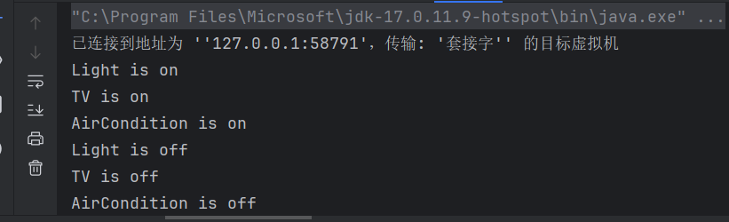
原先要控制多个家具的开关，我们需要对每一个家具都调用on和off方法，但是通过外观模式，创建一个类统一来开关家具
**优点**：
- 降低了子系统和客户端的耦合度，使得子系统的变化不会影响调用它的客户类
- 对客户屏蔽了子系统组件，减少了客户处理的对象数目，并使得子系统使用起来更容易
**缺点**：
- 不符合开闭原则，修改麻烦
### 组合模式
允许你将对象组合成树形结构来表示“部分-整体”的层次关系。组合模式让客户端可以统一地处理单个对象和组合对象，无需关心它们的具体差异
```java
public interface PopulationNode {  
    int computePopulation();  
}
public class Province implements PopulationNode {  
  
    private final String name;  
    private List<PopulationNode> cities =  new ArrayList<>();  
  
    public Province(String name) {  
        this.name = name;  
    }  
  
    @Override  
    public int computePopulation() {  
        return cities.stream().mapToInt(PopulationNode::computePopulation).sum();  
    }  
}
public class City implements PopulationNode {  
  
    private final String name;  
    List<PopulationNode> districts = new ArrayList<>();  
  
    public City(String name) {  
        this.name = name;  
    }  
  
    public void addDistrict(District district) {  
        districts.add(district);  
    }  
  
    @Override  
    public int computePopulation() {  
        return districts.stream().mapToInt(PopulationNode::computePopulation).sum();  
    }  
}
public class District implements PopulationNode{  
  
    private final String name;  
    private final int population;  
  
    public District(String name, int population) {  
        this.name = name;  
        this.population = population;  
    }  
  
    @Override  
    public int computePopulation() {  
        return population;  
    }  
}
```
```java
public class Main {  
  
    public static void main(String[] args) {  
        Province province = new Province("江西");  
        City city1 = new City("南昌");  
        City city2 = new City("景德镇");  
        District district1 = new District("东湖区", 100000);  
        District district2 = new District("昌江区", 200000);  
        District district3 = new District("珠山区", 300000);  
        District district4 = new District("abc", 400000);  
        city1.addDistrict(district1);  
        city1.addDistrict(district2);  
        city2.addDistrict(district3);  
        city2.addDistrict(district4);  
        province.addCity(city1);  
        province.addCity(city2);  
        System.out.println(province.computePopulation());  
    }  
}
```
### 享元模式
通过共享技术来有效地支持大量细粒度对象的复用。它通过共享已经存在的对象来大幅度减少需要创建对象的数量，避免创建大量相似对象，从而提高系统资源利用率
享元模式将对象的内部状态和外部状态分离
- **内部状态**：对象中不变的，可以共享的部分
- **外部状态**：对象中变化的，不能共享的部分，有客户端代码在需要时传入
```java
public abstract class AbstractBox {  
  
    // 获取图形  
    public abstract String getShape();  
    // 显示图形及颜色  
    public void display(String color){  
        System.out.println("Shape: " + getShape() + ", Color: " + color);  
    }  
}
public class IBox extends AbstractBox {  
    @Override  
    public String getShape() {  
        return "I";  
    }  
}
public class LBox extends AbstractBox {  
    @Override  
    public String getShape() {  
        return "L";  
    }  
}
public class OBox extends AbstractBox {  
    @Override  
    public String getShape() {  
        return "O";  
    }  
}
```
```java
public class BoxFactory {  
  
    private final HashMap<String,AbstractBox> map;  
    private static final BoxFactory instance = new BoxFactory();  
    private BoxFactory() {  
        this.map = new HashMap<>();  
        map.put("I", new IBox());  
        map.put("O", new OBox());  
        map.put("L", new LBox());  
    }  
  
    public static BoxFactory getInstance() {  
        return instance;  
    }  
  
    public AbstractBox getShape(String name){  
        return map.get(name);  
    }  
}
```
```java
public class Main {  
  
    public static void main(String[] args) {  
        BoxFactory instance = BoxFactory.getInstance();  
        AbstractBox i = instance.getShape("I");  
        AbstractBox o = instance.getShape("O");  
        AbstractBox l = instance.getShape("L");  
        i.display("Red");  
        o.display("Blue");  
        l.display("Green");  
        AbstractBox i1 = instance.getShape("I");  
        i1.display("Gray");  
        System.out.println(i == i1);  
    }  
}
```
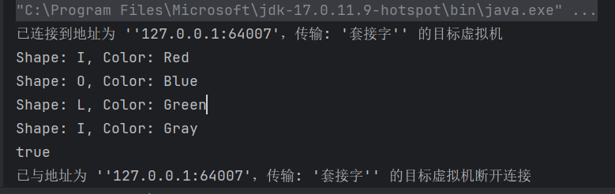
两次从工厂中取出来的对象是同一个，没有新建一个对象，而是利用缓存中的原有的对象
**优点**：
- 极大减少内存中相似或相同对象数量，节约系统资源，提高系统性能
- 享元模式中的外部状态相对独立，且不影响内部状态
**缺点**：
- 为了使对象可以共享，需要将享元对象的部分状态外部化，分离内部状态和外部状态，是程序逻辑复杂
## 行为型模式
行为型模式用于描述程序在运行时复杂的流程控制，即描述多个类或对象之间怎么相互协作共同完成单个对象都无法完成的任务
行为型模式分为类行为模式和对象行为模式，前者采用继承机制在类间分派行为，后者采用组合或聚合在对象间分配行为
### 模版方法模式
定义一个操作中的算法骨架，而将算法的一些步骤延迟到子类中，使得子类可以不改变改算法结构的情况下重定义该算法的某些特定步骤
```java
public abstract class Vegetables {  
  
    public final void cook(){  
        pourOil();  
        headOil();  
        pourVegetable();  
        pourSauce();  
        fry();  
    }  
  
    public void pourOil(){  
        System.out.println("倒油");  
    }  
    public void headOil(){  
        System.out.println("加热");  
    }  
    public abstract void pourVegetable();  
    public abstract void pourSauce();  
  
    public void fry(){  
        System.out.println("翻炒");  
    }  
}
public class Cabbage extends Vegetables{  
    @Override  
    public void pourVegetable() {  
        System.out.println("倒入包菜");  
    }  
  
    @Override  
    public void pourSauce() {  
        System.out.println("加入辣椒");  
    }  
}
public class ChineseCabbage extends Vegetables {  
    @Override  
    public void pourVegetable() {  
        System.out.println("倒入白菜");  
    }  
  
    @Override  
    public void pourSauce() {  
        System.out.println("加入蒜蓉");  
    }  
}
```
```java
public class Main {  
  
    public static void main(String[] args) {  
        Cabbage cabbage = new Cabbage();  
        cabbage.cook();  
        System.out.println("================================");  
        ChineseCabbage chineseCabbage = new ChineseCabbage();  
        chineseCabbage.cook();  
    }  
}
```
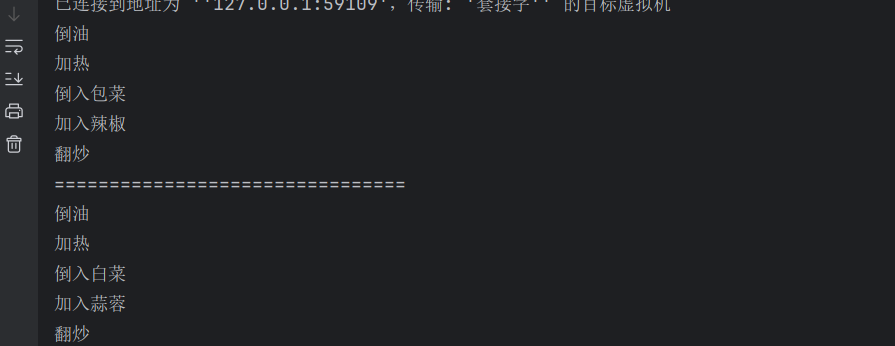
模版方法模式中要有一个final修饰的模版方法，不可被子类继承，防止被重写后改变了算法的框架
**优点**：
- 提高了代码的复用性
- 实现了反向控制，通过父类调用子类的操作，通过子类对具体实现扩展不同的行为，实现了反向控制
**缺点**：
- 对每个不同的实现都要定义一个类，导致类数量增肌，系统庞大
- 父类中的抽象方法都由子类实现，子类执行的结果会影响父类的结果，提高了代码阅读的难度
### 策略模式
定义了一系列算法，并将每个算法封装起来，使它们可以相互替换，且算法的变化不会影响使用算法的用户，把使用算法的职责和算法的实现分隔开，并委派给不同的对象对这些算法进行管理
```java
public interface CustomService {  
    String show();  
}
@Component  
@SupportCustom(UserType.NORMAL)  
public class NormalCustomService implements CustomService{  
    @Override  
    public String show() {  
        return "Normal Custom Service";  
    }  
}
@Component  
@SupportCustom(UserType.SMALL_R)  
public class SmallRCustomService implements CustomService {  
    @Override  
    public String show() {  
        return "Small R Custom Service";  
    }  
}
@Component  
@SupportCustom(UserType.BIG_R)  
public class BigRCustomService implements CustomService {  
    @Override  
    public String show() {  
        return "Big R Custom Service";  
    }  
}
@Component  
@SupportCustom(UserType.PERSONAL)  
public class PersonalCustomService implements CustomService {  
    @Override  
    public String show() {  
        return "Personal Custom Service";  
    }  
}
@Component  
public class DefaultCustomService implements CustomService {  
    @Override  
    public String show() {  
        return "Default Custom Service";  
    }  
}
```
### 命令模式
它将一个请求封装为一个对象，从而使你可以用不同的请求对客户进行参数化，支持请求的排队、记录、撤销等操作。
```java
public interface Command {  
    void execute();  
  
    // 可选操作，支持撤销  
    void undo();  
}
public class LightOnCommand implements Command {  
  
    private Light light;  
  
    public LightOnCommand(Light light) {  
        this.light = light;  
    }  
  
    @Override  
    public void execute() {  
        light.turnOn();  
    }  
  
    @Override  
    public void undo() {  
        light.turnOff();  
    }  
}
```
```java
public class Light {  
  
    public void turnOn() {  
        System.out.println("Light is on");  
    }  
  
    public void turnOff() {  
        System.out.println("Light is off");  
    }  
}
```
```java
public class Invoker {  
  
    private Command command;  
  
    public void setCommand(Command command) {  
        this.command = command;  
    }  
  
    public void pressButton(){  
        command.execute();  
    }  
  
    public void pressUndoButton(){  
        command.undo();  
    }  
}
```
```java
public class Main {  
  
    public static void main(String[] args) {  
        Light light = new Light();  
        Command lightOn = new LightOnCommand(light);  
  
        Invoker invoker = new Invoker();  
        invoker.setCommand(lightOn);  
  
        invoker.pressButton(); // 执行命令  
        invoker.pressUndoButton(); // 撤销命令  
    }  
}
```
将Command请求封装成对象，从而可以将调用者(Invoker)和接受者(Receiver)解耦
### 责任链模式
为了避免请求发送者与多个请求处理者耦合在一起，让多个对象都有机会处理请求，将这些对象连接成一条链，并沿着这条链传递请求，直到有对象处理它为止
```java
public abstract class Handler {  
    protected Handler successor;  
  
    public void setSuccessor(Handler successor) {  
        this.successor = successor;  
    }  
  
    public abstract void handleRequest(int request);  
}
public class HandlerA extends Handler {  
    @Override  
    public void handleRequest(int request) {  
        if(request <= 10){  
            System.out.println("HandlerA 处理请求" + request);  
        }else if(successor != null){  
            successor.handleRequest(request);  
        }  
    }  
}
public class HandlerB extends Handler {  
    @Override  
    public void handleRequest(int request) {  
        if(request <= 20){  
            System.out.println("HandlerB 处理请求" + request);  
        }else if(successor != null){  
            successor.handleRequest(request);  
        }  
    }  
}
public class HandlerC extends Handler {  
    @Override  
    public void handleRequest(int request) {  
        if(request <= 30){  
            System.out.println("HandlerC 处理请求" + request);  
        } else {  
            System.out.println("无处理请求的方法 " + request);  
        }  
    }  
}
```
```java
public class Main {  
    public static void main(String[] args) {  
        Handler handlerA = new HandlerA();  
        Handler handlerB = new HandlerB();  
        Handler handlerC = new HandlerC();  
        handlerA.setSuccessor(handlerB);  
        handlerB.setSuccessor(handlerC);  
        int[] request = {5,15,25,35};  
        for (int i : request) {  
            handlerA.handleRequest(i);  
        }  
    }  
}
```
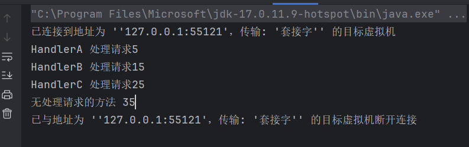
通过责任链模式，我们可以不需要知道具体是哪个对象处理请求，只需要将请求传给第一个对象即可，如果第一个对象无法处理，则会自动传给下一个对象，每个对象都只处理自己职责范围内的请求
### 状态模式
将对象的状态封装成独立的类，并将委托行为委托给当前状态对象，而不是在对象内部使用大量的条件语句（if-else 或 switch-case）来判断状态
```java
public interface VoteState {  
    void vote(String user,String voteItem,VoteManager manager);  
}
public class NormalVoteState implements VoteState {  
    @Override  
    public void vote(String user, String voteItem, VoteManager manager) {  
        manager.getVoteMap().put(user, voteItem);  
        System.out.println("恭喜投票成功");  
    }  
}
public class RepeatVoteState implements VoteState {  
    @Override  
    public void vote(String user, String voteItem, VoteManager manager) {  
        System.out.println("请勿重复投票");  
    }  
}
public class SpiteVoteState implements VoteState {  
    @Override  
    public void vote(String user, String voteItem, VoteManager manager) {  
        String s = manager.getVoteMap().get(user);  
        if(s!=null) {  
            manager.getVoteMap().remove(user);  
        }  
        System.out.println("疑似刷票行为，取消投票资格");  
    }  
}
public class BlackVoteState implements VoteState {  
    @Override  
    public void vote(String user, String voteItem, VoteManager manager) {  
        System.out.println("黑名单用户，没有投票资格");  
    }  
}
```
```java
public class VoteManager {  
    private VoteState state = null;  
    private Map<String,String> voteMap = new HashMap<>();  
    private Map<String,Integer> voteCount = new HashMap<>();  
  
    public Map<String,String> getVoteMap() {  
        return voteMap;  
    }  
  
    public void vote(String user,String voteItem){  
        Integer votes = this.voteCount.get(user);  
        if(votes == null){  
            votes = 0;  
        }  
        votes++;  
        this.voteCount.put(user,votes);  
        if(votes == 1){  
            state = new NormalVoteState();  
        } else if (votes > 1 && votes <= 5) {  
            state = new SpiteVoteState();  
        } else if (votes > 5 && votes <= 8) {  
            state = new SpiteVoteState();  
        } else if (votes > 8){  
            state = new BlackVoteState();  
        }  
        state.vote(user,voteItem,this);  
    }  
}
```
```java
public class Main {  
  
    public static void main(String[] args) {  
        VoteManager voteManager = new VoteManager();  
        for (int i = 0; i < 10; i++) {  
            voteManager.vote("shea","A");  
        }  
    }  
}
```
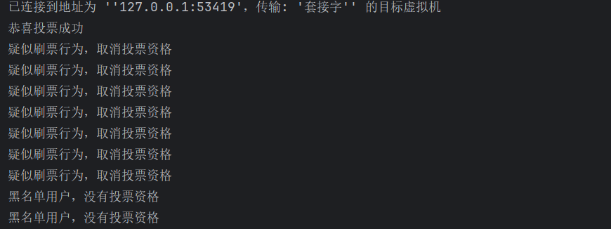
### 观察者模式
定义了对象之间的一种一对多依赖关系，当一个对象（被观察者/主题）的状态发生改变时，所有依赖它的对象（观察者）都会得到通知并自动更新
```java
public interface Subject {  
    // 添加订阅者  
    void attach(Observer observer);  
  
    // 删除订阅者  
    void detach(Observer observer);  
  
    // 通知所有订阅者  
    void notifyObservers(String message);  
}
public class Subscription implements Subject{  
  
    private Set<Observer> observers = new HashSet<>();  
    private ExecutorService executor = Executors.newFixedThreadPool(10);  
  
    @Override  
    public void attach(Observer observer) {  
        observers.add(observer);  
    }  
  
    @Override  
    public void detach(Observer observer) {  
        observers.remove(observer);  
    }  
  
    @Override  
    public void notifyObservers(String message) {  
        observers.forEach(observer -> observer.update(message));  
        // 用户多时，可以使用多线程通知  
//        CompletableFuture[] array = observers.stream().map(  
//                observer -> CompletableFuture.runAsync(  
//                        () -> observer.update(message), executor  
//                )  
//        ).toArray(CompletableFuture[]::new);  
//        CompletableFuture.allOf(array).join();  
    }  
  
    public void shutdown() {  
        executor.shutdown();  
        try {  
            if (!executor.awaitTermination(60, TimeUnit.SECONDS)) {  
                executor.shutdownNow();  
            }  
        } catch (InterruptedException e) {  
            executor.shutdownNow();  
            Thread.currentThread().interrupt();  
        }  
    }  
}
```
```java
public interface Observer {  
    void update(String message);  
}
public class User implements Observer {  
  
    private String name;  
  
    public User(String name) {  
        this.name = name;  
    }  
  
    @Override  
    public void update(String message) {  
        System.out.println(name + " received message: " + message);  
    }  
  
    @Override  
    public boolean equals(Object o) {  
        if (o == null || getClass() != o.getClass()) return false;  
        User user = (User) o;  
        return Objects.equals(name, user.name);  
    }  
  
    @Override  
    public int hashCode() {  
        return Objects.hashCode(name);  
    }  
}
```
```java
public class Main {  
    public static void main(String[] args) {  
        Subscription subscription = new Subscription();  
        subscription.attach(new User("Alice"));  
        subscription.attach(new User("Bob"));  
        subscription.attach(new User("Charlie"));  
        subscription.attach(new User("Alice"));  
        subscription.notifyObservers("Hello, observers!");  
    }  
}
```
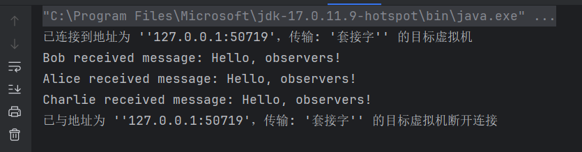
### 中介者模式
通过引入一个中介对象来封装一系列对象之间的交互，从而降低对象之间的直接耦合，使对象可以独立地改变它们之间的交互
```java
public abstract class Mediator {    
    public abstract void concat(String message,Person person);  
}
public class MediatorStructure extends Mediator {  
  
    private Tenant tenant; // 租户  
    private HouseOwner houseOwner; // 房东  
  
    @Override  
    public void concat(String message, Person person) {  
        if(person == houseOwner){  
            tenant.getMessage(message);  
        }else {  
            houseOwner.getMessage(message);  
        }  
    }  
  
    public HouseOwner getHouseOwner() {  
        return houseOwner;  
    }  
  
    public Tenant getTenant() {  
        return tenant;  
    }  
  
    public void setTenant(Tenant tenant) {  
        this.tenant = tenant;  
    }  
  
    public void setHouseOwner(HouseOwner houseOwner) {  
        this.houseOwner = houseOwner;  
    }  
}
```
```java
public abstract class Person {  
  
    protected String name;  
    protected Mediator mediator;  
  
    public Person(String name, Mediator mediator) {  
        this.name = name;  
        this.mediator = mediator;  
    }  
  
}
public class Tenant extends Person {  
  
    public Tenant(String name, Mediator mediator) {  
        super(name, mediator);  
    }  
  
    // 和中介沟通  
    public void concat(String message) {  
        mediator.concat(message,this);  
    }  
  
    // 获取信息  
    public void getMessage(String message) {  
        System.out.println("租房者 " + name + " 获取到信息: " + message);  
    }  
}
public class HouseOwner extends Person {  
  
    public HouseOwner(String name, Mediator mediator) {  
        super(name, mediator);  
    }  
  
    // 和中介沟通  
    public void concat(String message) {  
        mediator.concat(message,this);  
    }  
  
    // 获取信息  
    public void getMessage(String message) {  
        System.out.println("房东 " + name + " 获取到信息: " + message);  
    }  
}
```
```java
public class Main {  
  
    public static void main(String[] args) {  
        MediatorStructure mediator = new MediatorStructure();  
  
        Tenant tenant = new Tenant("Shea", mediator);  
        HouseOwner houseOwner = new HouseOwner("John", mediator);  
  
        mediator.setTenant(tenant);  
        mediator.setHouseOwner(houseOwner);  
  
        tenant.concat("我要租房");  
        houseOwner.concat("你需要什么样的房子");  
    }  
}
```
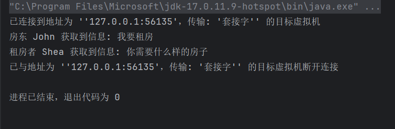
### 迭代器模式
它提供一种方法顺序访问一个聚合对象中的各个元素，而又不暴露该对象的内部表示
```java
public class User implements Iterable<String>{  
  
    private String name;  
    private int age;  
    private String address;  
    private String phone;  
  
    public User(String name, int age, String address, String phone) {  
        this.name = name;  
        this.age = age;  
        this.address = address;  
        this.phone = phone;  
    }  
  
    @Override  
    public String toString() {  
        return "User{" +  
                "name='" + name + '\'' +  
                ", age=" + age +  
                ", address='" + address + '\'' +  
                ", phone='" + phone + '\'' +  
                '}';  
    }  
  
    @Override  
    public Iterator<String> iterator() {  
        return new UserIterator();  
    }  
  
    class UserIterator implements Iterator<String> {  
  
        int count = 0;  
        static Field[] fields;  
  
        static{  
            fields = User.class.getDeclaredFields();  
            for (Field field : fields) {  
                field.setAccessible(true);  
            }  
        }  
  
        @Override  
        public boolean hasNext() {  
            return count < fields.length;  
        }  
  
        @Override  
        public String next() {  
            Field field = fields[count++];  
            try {  
                return String.valueOf(field.get(User.this));  
            } catch (IllegalAccessException e) {  
                throw new RuntimeException(e);  
            }  
        }  
    }  
}
```
```java
public class Main {  
    public static void main(String[] args) {  
        User user = new User("Shea", 18, "Shanghai", "12345678901");  
        for (String field : user) {  
            System.out.println(field);  
        }  
    }  
}
```
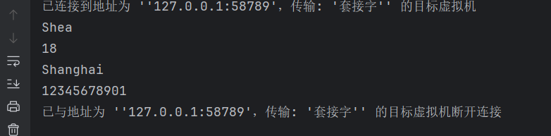**tips**：为什么增强for循环和forEach循环，不能对集合中添加或删除元素？
增强for循环和forEach循环都是通过Iterator迭代器实现的，其内部类会定义一个modCount和exceptedModCount，每一次调用next()函数时，都会检查modCount和exceptedModCount的值是否相等，如果在循环中对集合进行增加和删除元素，则会导致modCount的值发生变化，就会抛出异常
### 访问者模式
封装一些作用于某种数据结构中的各元素的操作，它可以在不改变这个数据结构的前提下定义作用于这些元素的新的操作
```java
public interface Person {  
  
    void feed(Cat cat);  
  
    void feed(Dog dog);  
}
public class User implements Person {  
    @Override  
    public void feed(Cat cat) {  
        System.out.println("User is feeding cat");  
    }  
  
    @Override  
    public void feed(Dog dog) {  
        System.out.println("User is feeding dog");  
    }  
}
```
```java
public interface Animal {  
    // 接收访问者访问的功能  
    void accept(Person person);  
}
public class Cat implements Animal {  
    @Override  
    public void accept(Person person) {  
        person.feed(this);  
        System.out.println("Cat is being fed");  
    }  
}
public class Dog implements Animal {    
    @Override  
    public void accept(Person person) {  
        person.feed(this);  
        System.out.println("Dog is being fed");  
    }  
}
```
```java
public class Home {  
  
    private List<Animal> nodeList = new ArrayList<>();  
  
    public void add(Animal animal) {  
        nodeList.add(animal);  
    }  
  
    public void action(Person person) {  
        for (Animal animal : nodeList) {  
            animal.accept(person);  
        }  
    }  
}
```
```java
public class Main {  
    public static void main(String[] args) {  
        Home home = new Home();  
        home.add(new Cat());  
        home.add(new Dog());  
        User user = new User();  
        home.action(user);  
    }  
}
```
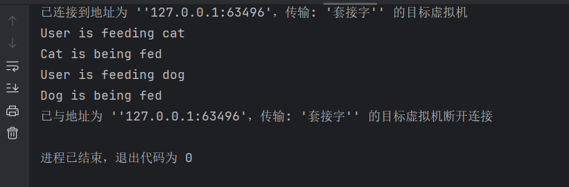
### 备忘录模式
它允许在不暴露对象实现细节的情况下捕获和恢复对象的内部状态。它通过将状态保存在备忘录对象中，实现状态的保存和恢复，同时保持封装性
备忘录有两个等效的接口
- **窄接口**：管理者对象看到的是备忘录的窄接口，这个窄接口只允许他把备忘录对象传给其他对象
- **宽接口**：与管理者看到的窄接口相反，发起人对象可以看到一个宽接口，这个宽接口允许它读取所有的数据，以便根据这些数据恢复发起人对象的内部状态
#### 白箱备忘录模式
备忘录角色对任何对象都提供一个宽接口，备忘录角色的内存存储的状态对所有对象公开
```java
public class GameRole {  
    private int vit; // 生命值  
    private int atk; // 攻击力  
    private int def; // 防御力  
  
    public void initState(){  
        this.vit = 100;  
        this.atk = 100;  
        this.def = 100;  
    }  
  
    public void fight(){  
        this.vit = 0;  
        this.atk = 0;  
        this.def = 0;  
    }  
  
    public RoleStateMemento saveState(){  
        return new RoleStateMemento(vit, atk, def);  
    }  
  
    public void recoverState(RoleStateMemento memento){  
        this.vit = memento.getVit();  
        this.atk = memento.getAtk();  
        this.def = memento.getDef();  
    }  
  
    public void displayState(){  
        System.out.println("角色状态：");  
        System.out.println("生命值：" + this.vit);  
        System.out.println("攻击力：" + this.atk);  
        System.out.println("防御力：" + this.def);  
    }  
}
```
```java
public class RoleStateMemento {  
    private int vit; // 生命值  
    private int atk; // 攻击力  
    private int def; // 防御力  
  
    public RoleStateMemento(int vit, int atk, int def) {  
        this.vit = vit;  
        this.atk = atk;  
        this.def = def;  
    }  
  
    public int getVit() {  
        return vit;  
    }  
  
    public int getDef() {  
        return def;  
    }  
  
    public int getAtk() {  
        return atk;  
    }  
}
```
```java
public class RoleStateMementoCaretaker {  
  
    private RoleStateMemento roleStateMemento;  
  
    public RoleStateMemento getRoleStateMemento() {  
        return roleStateMemento;  
    }  
  
    public void setRoleStateMemento(RoleStateMemento roleStateMemento) {  
        this.roleStateMemento = roleStateMemento;  
    }  
}
```
```java
public class Main {  
  
    public static void main(String[] args) {  
        GameRole role = new GameRole();  
        role.initState(); // 初始化角色状态  
        role.displayState();  
        RoleStateMementoCaretaker caretaker = new RoleStateMementoCaretaker();  
        caretaker.setRoleStateMemento(role.saveState()); // 保存角色状态  
        role.fight(); // 角色战斗  
        role.displayState();  
        role.recoverState(caretaker.getRoleStateMemento()); // 恢复角色状态  
        role.displayState();  
    }  
}
```
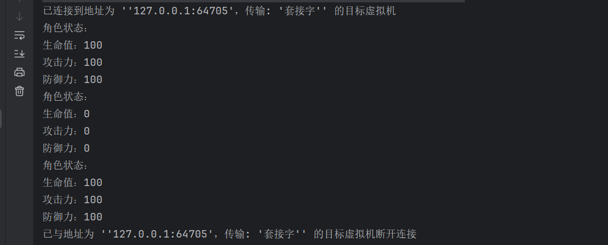
#### 黑箱备忘录模式
备忘录角色对发起人角色提供一个宽接口，为其他对象提供一个窄接口
```java
public interface Memento {  
}
```
```java
public class GameRole {  
  
    private int vit;  
    private int atk;  
    private int def;  
  
    public void initState(){  
        this.vit = 100;  
        this.atk = 100;  
        this.def = 100;  
    }  
  
    public void fight(){  
        this.vit = 0;  
        this.atk = 0;  
        this.def = 0;  
    }  
  
    public Memento saveState(){  
        return new RoleStateMemento(vit, atk, def);  
    }  
  
    public void recoverState(Memento memento){  
        RoleStateMemento roleStateMemento = (RoleStateMemento) memento;  
        this.vit = roleStateMemento.getVit();  
        this.atk = roleStateMemento.getAtk();  
        this.def = roleStateMemento.getDef();  
    }  
  
    public void displayState(){  
        System.out.println("角色状态：");  
        System.out.println("生命值：" + this.vit);  
        System.out.println("攻击力：" + this.atk);  
        System.out.println("防御力：" + this.def);  
    }  
  
    private class RoleStateMemento implements Memento{  
        private int vit; // 生命值  
        private int atk; // 攻击力  
        private int def; // 防御力  
  
        public RoleStateMemento(int vit, int atk, int def) {  
            this.vit = vit;  
            this.atk = atk;  
            this.def = def;  
        }  
  
        public int getVit() {  
            return vit;  
        }  
  
        public int getAtk() {  
            return atk;  
        }  
  
        public int getDef() {  
            return def;  
        }  
    }  
}
```
```java
public class RoleStateMementoCaretaker {  
  
    private Memento memento;  
  
    public Memento getMemento() {  
        return memento;  
    }  
  
    public void setMemento(Memento memento) {  
        this.memento = memento;  
    }  
}
```
```java
public class Main {  
    public static void main(String[] args) {  
        GameRole role = new GameRole();  
        role.initState(); // 初始化角色状态  
        role.displayState();  
        RoleStateMementoCaretaker caretaker = new RoleStateMementoCaretaker();  
        caretaker.setMemento(role.saveState()); // 保存角色状态  
        role.fight(); // 角色战斗  
        role.displayState();  
        role.recoverState(caretaker.getMemento()); // 恢复角色状态  
        role.displayState();  
    }  
}
```
### 解释器模式
给定一个语言，定义它的文法表示，并定义一个解释器，这个解释器使用该标识来解释语言中的句子
```java
public abstract class AbstractExpression {  
  
    public abstract int interpret(Context context);  
}
public class Variable extends AbstractExpression {  
  
    private String name;  
  
    public Variable(String name) {  
        this.name = name;  
    }  
  
    @Override  
    public int interpret(Context context) {  
        return context.getValue(this);  
    }  
  
    @Override  
    public String toString() {  
        return name;  
    }  
}
public class Plus extends AbstractExpression {  
  
    private AbstractExpression left;  
    private AbstractExpression right;  
  
    public Plus(AbstractExpression left, AbstractExpression right) {  
        this.left = left;  
        this.right = right;  
    }  
  
    @Override  
    public int interpret(Context context) {  
        return left.interpret(context) + right.interpret(context);  
    }  
  
    @Override  
    public String toString() {  
        return left.toString() + "+" + right.toString();  
    }  
}
public class Minus extends AbstractExpression {  
    private AbstractExpression left;  
    private AbstractExpression right;  
  
    public Minus(AbstractExpression left, AbstractExpression right) {  
        this.left = left;  
        this.right = right;  
    }  
    @Override  
    public int interpret(Context context) {  
        return left.interpret(context) - right.interpret(context);  
    }  
  
    @Override  
    public String toString() {  
        return left.toString() + "-" + right.toString();  
    }  
}
```
```java
public class Main {  
  
    public static void main(String[] args) {  
        Context context = new Context();  
        Variable a = new Variable("a");  
        context.assign(a,10);  
        Variable b = new Variable("b");  
        context.assign(b,20);  
        Variable c = new Variable("c");  
        context.assign(c,30);  
        Variable d = new Variable("d");  
        context.assign(d,40);  
  
        // a + b - c + d  
        AbstractExpression expression = new Plus(a,new Plus(new Minus(b,c),d));  
        int res = expression.interpret(context);  
        System.out.println(expression + " = " + res);  
    }  
}
```
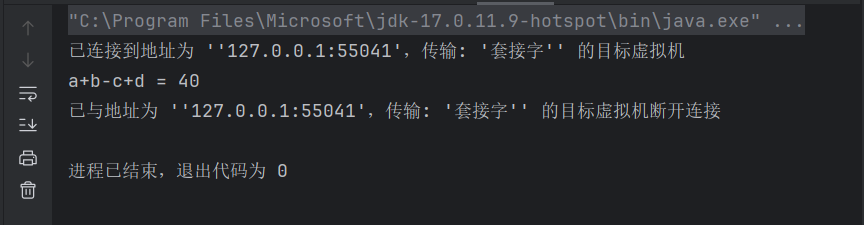


