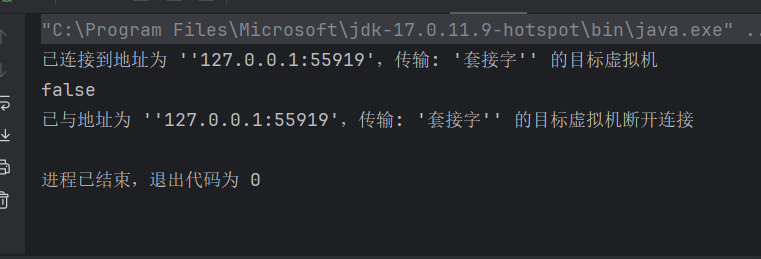
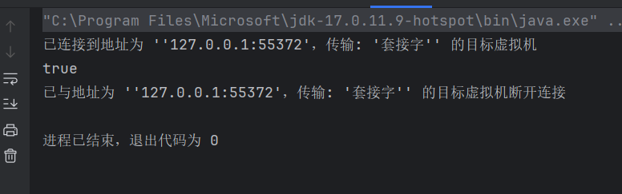
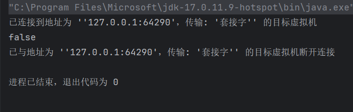
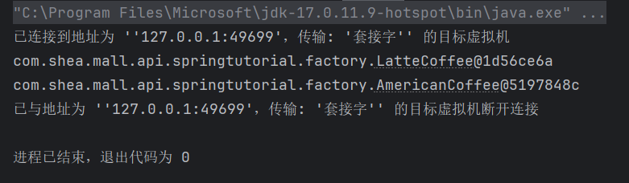
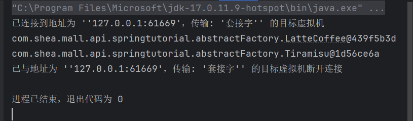
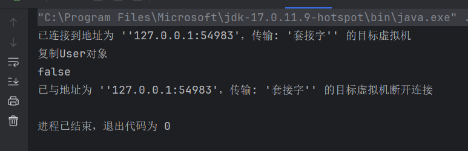

# Java基础

---

## Java是如何做到一次编译，到处运行的

Java可以通过jvm虚拟机实现“一次编译，到处运行”是因为java代码编译后会生成的.class字节码文件，jvm虚拟机会将其翻译成对应操作系统的机器码。例如Springboot打包后生成的jar包，部署到linux虚拟机之后，无需再次编译，可以直接运行。而部分语言（如c++）编译后生成的是对应操作系统的机器码，在windows系统上生成的是.exe文件，而在linux系统上生成的则是.elf文件，因此c++代码在另一个操作系统上就需要重新编译之后才可以运行

## String StringBuilder StringBuffer的区别

String是一种不可变对象，被final修饰，对String对象的修改操作都会生成一个新的String对象。

StringBuilder和StringBuffer都是可变对象，在修改时会在原对象的基础上进行修改

StringBuilder是线程不安全的，StringBuffer是线程安全的，因此在多线程的场景下，必须使用StringBuffer，在追求高效的场景，且无需保证线程安全的场景，才可以使用StringBuilder

---

# IO

## JAVA BIO

BIO就是传统的java io编程

BIO（Blocking IO）：同步阻塞，一个连接一个线程，即客户端有连接请求时，服务器端就需要启动一个线程进行处理，如果这个连接不做任何事情会造成不必要的线程开销，可以通过线程池工具来改善

### BIO 工作机制


客户端和服务端通过Socket连接，连接成功之后，可以通过Socket连接建立的虚拟管道来进行数据的传输

```java
public class Client {

    public static void main(String[] args) {
        try {
            Socket socket = new Socket("127.0.0.1", 9999);
            OutputStream os = socket.getOutputStream();
            // 打印流
            PrintStream ps = new PrintStream(os);
            Scanner sc = new Scanner(System.in);
            while(true){
                System.out.println("请输入：");
                String msg = sc.next();
                ps.println(msg);
                ps.flush();
            }
        } catch (IOException e) {
            throw new RuntimeException(e);
        }
    }
}
```

```java
public class Server {

    public static void main(String[] args) {

        try {
            System.out.println("========服务器启动...==========");
            ServerSocket ss = new ServerSocket(9999);
            Socket socket = ss.accept();
            InputStream inputStream = socket.getInputStream();
            // 缓冲字节输入流
            BufferedInputStream bis = new BufferedInputStream(inputStream);
            // 缓冲字符输入流 按行读取
            BufferedReader br = new BufferedReader(new InputStreamReader(bis));
            String msg;
            if((msg = br.readLine()) != null){
                System.out.println(msg);
            }
        } catch (IOException e) {
            throw new RuntimeException(e);
        }
    }
}
```

在以上的通信中，服务端会一致等待客户端的消息，如果客户端没有消息发送，服务端就会一直进入阻塞状态

同时服务端是按照行获取消息的，所以客户端也必须按照行发送消息，否则服务端将一直阻塞

无论客户端还是服务端的socket，只要有一端宕机，另一端就会直接抛出异常

## BIO接收多个客户端

每次有一个客户端发送连接请求，就创建一个新线程来处理这个客户端的请求，就可以实现BIO模式下接收多个客户端

```java
public class Server {

    public static void main(String[] args) {

        try {
            System.out.println("========服务器启动...==========");
            ServerSocket ss = new ServerSocket(9999);
            while(true){
                Socket socket = ss.accept();
                new ServerThreadReader(socket).start();
            }
        } catch (IOException e) {
            throw new RuntimeException(e);
        }
    }
}
```

```java
public class ServerThreadReader extends Thread {

    private Socket socket;

    private ServerThreadReader() {

    }

    public ServerThreadReader(Socket socket) {
        this.socket = socket;
    }

    @Override
    public void run() {
        try {
            // 从socket中获取输入流
            InputStream is = socket.getInputStream();
            // 把输入流转换成缓冲流
            BufferedReader br = new BufferedReader(new InputStreamReader(is));
            String msg ;
            if((msg = br.readLine()) != null){
                System.out.println("服务端收到消息:" + msg);
            }
        } catch (IOException e) {
            throw new RuntimeException(e);
        }
    }
}
```

### 缺点

1. 每接收到一个Socket，都会创建一个线程，线程的竞争，上下文切换等影响性能

2. 每个线程都会占用栈空间和CPU资源

3. 并不是每个Socket都会进行IO操作，无意义的线程处理

4. 客户端并发访问增加时，服务端将呈现1:1的线程开销，访问量越大，系统将发生线程栈溢出，线程创建失败，最终导致进程宕机或僵死

## 伪异步IO编程

采用线程池和任务队列实现，当客户端接入时，将客户端的Socket封装成一个Task，交给后端线程池进行处理

```java
public class Server {

    public static void main(String[] args) {

        try {
            System.out.println("========服务器启动...==========");
            ServerSocket ss = new ServerSocket(9999);
            HandleSocketServerPool pool = new HandleSocketServerPool(6, 10);
            while(true){
                Socket socket = ss.accept();
                Runnable task = new ServerRunnable(socket);
                pool.execute(task);
            }
        } catch (Exception e) {
            e.printStackTrace();
        }
    }
}
```

```java
public class ServerRunnable implements Runnable {

    private Socket socket;

    public ServerRunnable(Socket socket) {
        this.socket = socket;
    }

    @Override
    public void run() {
        // 处理客户端的通信需求
        try {
            // 从socket中获取输入流
            InputStream is = socket.getInputStream();
            // 把输入流转换成缓冲流
            BufferedReader br = new BufferedReader(new InputStreamReader(is));
            String msg ;
            if((msg = br.readLine()) != null){
                System.out.println("服务端收到消息:" + msg);
            }
        } catch (IOException e) {
            throw new RuntimeException(e);
        }
    }
}
```

```java
public class HandleSocketServerPool {
    private ExecutorService executorService;

    public HandleSocketServerPool(int maxThreadNum,int queueSize){
        this.executorService = new ThreadPoolExecutor(
                3,
                maxThreadNum,
                120,
                TimeUnit.SECONDS,
                new ArrayBlockingQueue<Runnable>(queueSize)
        );
    }

    public void execute(Runnable task){
        this.executorService.execute(task);
    }
}
```

### 缺点

1. 伪异步IO采用了线程池实现，因此避免了为每个请求创建一个独立线程造成线程资源耗尽的问题，但由于底层依然采用同步阻塞模型，因此无法从根本上解决问题

2. 如果单个消息处理的很慢，或者服务器线程池中的全部线程都被阻塞，那么后续Socket的IO消息都将在队列中排队，新的Socket请求将被拒绝，客户端会发生大量的连接超时

## BIO实现文件上传功能

```java
public class Client {

    public static void main(String[] args) {
        try(
                InputStream in = new FileInputStream("C:\\Users\\xgw\\Desktop\\shea\\java\\java基础.docx");
                ) {
            Socket socket = new Socket("127.0.0.1", 9999);
            DataOutputStream dos = new DataOutputStream(socket.getOutputStream());
            dos.writeUTF(".docx");
            byte[] data = new byte[1024];
            int len;
            while((len = in.read(data)) > 0){
                dos.write(data, 0, len);
            }
            dos.flush();
            socket.shutdownOutput(); // 通知服务端客户端的数据发送完毕
        } catch (IOException e) {
            throw new RuntimeException(e);
        }
    }
}
```

```java
public class ServerReaderThread extends Thread{

    private Socket socket;

    public ServerReaderThread(Socket socket) {
        this.socket = socket;
    }

    @Override
    public void run() {
        try {
            DataInputStream dis = new DataInputStream(socket.getInputStream());
            String suffix = dis.readUTF();
            System.out.println("服务端接收到文件类型:" + suffix);
            OutputStream os = new FileOutputStream("C:\\Users\\xgw\\Desktop\\shea\\java\\Server\\" +
                    UUID.randomUUID().toString() + suffix);
            byte[] buffer = new byte[1024];
            int len;
            while ((len = dis.read(buffer)) > 0){
                os.write(buffer, 0, len);
            }
            os.close();
            System.out.println("服务端保存文件成功");
        } catch (Exception e) {
            throw new RuntimeException(e);
        }
    }
}
```

## BIO模式下的端口转发思想

**端口转发**（Port Forwarding）是一种网络技术，将来自一个网络端口的数据流量转发到另一个网络端口或主机。

```java
public class ServerReaderThread extends Thread{

    private Socket socket;

    public ServerReaderThread(Socket socket) {
        this.socket = socket;
    }

    @Override
    public void run() {
        try {
            // 从socket中获取当前客户端的输入流
            BufferedReader br = new BufferedReader(new InputStreamReader(socket.getInputStream()));
            String msg;
            while((msg = br.readLine()) != null) {
                // 服务端接收到客户端消息后，需要推送给当前所有的在线socket
                sendMsg2AllClient(msg);
            }
        } catch (Exception e) {
            System.out.println("当前有客户端下线");
            Server.allSocketsOnline.remove(socket);
        }
    }

    private void sendMsg2AllClient(String msg) {
        for (Socket sk : Server.allSocketsOnline) {
            try {
                PrintStream ps = new PrintStream(sk.getOutputStream());
                ps.println(msg);
                ps.flush();
            } catch (IOException e) {
                e.printStackTrace();
            }
        }
    }
}
```

## Java NIO

NIO（Non-blocking IO）支持面向缓冲区的，基于通道的IO操作

非阻塞式读取，使一个线程从某通道发送请求或读取数据时，如果目前没有数据可用，则什么都不会获取，而不是保持线程阻塞 

非阻塞式写，一个线程请求写入一些数据到某通道，但不需要等待它完全写入，这个线程同时可以去做别的事情

### NIO和BIO

BIO是以流的方式处理数据，而NIO是以块的方式处理数据，块IO的效率比流IO的效率高很多

BIO是基于字节流和字符流进行操作，而NIO基于Channel（通道）和Buffer（缓冲区）进行操作，数据总是从通道读取到缓冲区中，或者从缓冲区写入到通道中，Selector（选择器）用于监听多个通道的事件，因此单个线程就可以监听多个客户端通道


### NIO三大核心

#### Buffer

缓冲区本质上是一块可以写入数据，然后可以从中读取数据的内存。这块内存被包装成NIO Buffer对象，并提供了一组方法，以便访问该块内存

#### Channel

Java NIO通道类似流，但也有些不同。既可以从通道中获取数据，又可以写数据到通道中，但流的读写通常是单向的，通道可以非阻塞读取和写入通道，通道可以支持读取或写入缓冲区，支持异步读写

#### Selector

Selector是一个Java NIO组件，能够检查一个或多个NIO通道，并确定哪些通道已经准备好进行读取或写入，这样，一个线程可以管理多个Channel，从而管理多个网络连接，提高效率

### Buffer

一个用于特定基本数据类型的容器，所有缓冲区都是Buffer抽象类的子类，NIO中的Buffer主要用于与NIO通道进行交互，从中读取或写入数据

#### 基本属性

**容量(capacity)** ：作为一个内存块，Buffer具有一个固定的大小，容量不能为负，并且创建后不能更改

**限制(limit)** ：表示缓冲区可操作数据的大小（limit后的数据不能进行读写），缓冲区的限制不能为负，且不能大于其容量。**写入模式：限制等于buffer的容量，读取模式：limit等于写入的数据量**

**位置(position)** ：下一个要读取或写入数据的索引，缓冲区位置不能为负，且不能大于其限制

**标记(mark)与重置(reset)** ：标记是一个索引，通过Buffer中的mark()方法指定Buffer中一个特定的位置，之后可以通过reset()方法恢复到这个位置

**0<=mark<=position<=limit<=capacity**

### 直接与非直接缓冲区

ByteBuffer可以是两种类型，一种是基于直接内存（非堆内存），另一种是非直接内存（堆内存）。对于直接内存来说，JVM将会在IO操作上有更高的性能，因为它直接作用于本地系统的IO操作，而非直接内存，也就是堆内存中的数据，如果要做IO操作，会先从本进程内存复制到直接内存，再利用本地IO处理

从数据流的角度，非直接内存是下面的作用链

`本地IO --> 直接内存 --> 非直接内存 --> 直接内存 --> 本地IO`

而直接内存是

`本地IO --> 直接内存 --> 本地IO`

因此在做IO处理时，直接内存有更高的效率，直接内存使用allocateDirect创建，但是它比申请普通堆内存需要耗费更高的性能，不过这部分数据是JVM之外的，不会占用应用程序的内存，所以如果有很大的数据要缓存，并且它的生命周期很长，就适合使用**直接内存**

### Channel

Channel表示IO源与目标打开的连接，Channel类似于流，但是Channel不能直接访问数据，只能通过和Buffer交互

#### 通道和流的区别

1. 通道可以同时进行读写，而传统的流只能读或者写

2. 通道可以实现异步读写数据

3. 通道可以从缓冲中读数据，也可以写数据到缓冲中

向文件中写数据

```java
public class ChannelTest {

    @Test
    public void write(){
        try{
            FileOutputStream out = new FileOutputStream("data.txt");
            FileChannel fc = out.getChannel();
            ByteBuffer buffer = ByteBuffer.allocate(1024);
            buffer.put("hello world".getBytes());
            buffer.flip();
            fc.write(buffer);
        }catch (FileNotFoundException e){
            e.printStackTrace();
        } catch (IOException e) {
            throw new RuntimeException(e);
        }
    }
}
```

向文件中读数据

```java
@Test
    public void read(){
        try {
            FileInputStream in = new FileInputStream("data.txt");
            ByteBuffer buffer = ByteBuffer.allocate(1024);
            FileChannel fc = in.getChannel();
            fc.read(buffer);
            buffer.flip(); // 切换缓冲区模式，防止读取到空字节
            String s = new String(buffer.array(),0,buffer.remaining());
            System.out.println(s);
        } catch (FileNotFoundException e) {
            e.printStackTrace();
        } catch (IOException e) {
            throw new RuntimeException(e);
        }
    }
```

复制文件

```java
@Test
    public void copy(){
        File src = new File("C:\\Users\\xgw\\Pictures\\Screenshots\\屏幕截图 2025-06-18 002903.png");
        File dest = new File("1.png");
        try {
            FileInputStream fis = new FileInputStream(src);
            FileOutputStream fos = new FileOutputStream(dest);
            ByteBuffer buffer = ByteBuffer.allocate(1024);
            FileChannel is = fis.getChannel();
            FileChannel os = fos.getChannel();
            while(true){
                // 必须要先清空缓冲区，然后再写入数据到缓冲区
                buffer.clear();
                // 开始获取一次数据
                int flag = is.read(buffer);
                if(flag == -1){
                    break;
                }
                buffer.flip();
                os.write(buffer);
            }
        } catch (FileNotFoundException e) {
            throw new RuntimeException(e);
        } catch (IOException e) {
            throw new RuntimeException(e);
        }
    }
```

聚集和分散

```java
    @Test
    public void test(){
        try{
            FileInputStream fis = new FileInputStream("data.txt");
            FileChannel is = fis.getChannel();
            FileOutputStream fos = new FileOutputStream("data1.txt");
            FileChannel os = fos.getChannel();
            ByteBuffer buffer1 = ByteBuffer.allocate(4);
            ByteBuffer buffer2 = ByteBuffer.allocate(1024);
            ByteBuffer[] buffers = {buffer1,buffer2};
            is.read(buffers);
            for(ByteBuffer buffer : buffers){
                buffer.flip();
                System.out.print(new String(buffer.array(),0,buffer.remaining()));
            }
            os.write(buffers);
            is.close();
            os.close();
        }catch (Exception e){
            e.printStackTrace();
        }
    }
```

聚集和分散，通过读写多个ByteBuffer，一次性处理多个缓冲区，减少上下文的切换，从而提高性能。在处理结构化数据时，也会更加清晰，代码简洁

### Selector

Selector是SelectableChannel对象的多路复用器，Selector可以同时监控多个SelectableChannel的IO状况，也就是说，可以利用Selector单独的一个线程管理多个Channel，Selector是非阻塞式IO的核心

**NIO非阻塞机制实现**

```java
public class Client {
    public static void main(String[] args) {
        try {
            SocketChannel channel = SocketChannel.open(new InetSocketAddress("127.0.0.1", 9999));
            channel.configureBlocking(false);
            ByteBuffer buffer = ByteBuffer.allocate(1024);
            // 发送数据给服务端
            Scanner sc = new Scanner(System.in);
            while(true){
                System.out.println("请输入：");
                String msg = sc.nextLine();
                buffer.put(("Shea：" + msg).getBytes());
                buffer.flip();
                channel.write(buffer);
                buffer.clear();
            }
        } catch (IOException e) {
            throw new RuntimeException(e);
        }
    }
}
```

```java
public class Server {
    public static void main(String[] args) {
        try {
            System.out.println("=========服务器启动==========");
            ServerSocketChannel ssc = ServerSocketChannel.open();
            ssc.configureBlocking(false);
            ssc.bind(new InetSocketAddress(9999));
            Selector selector = Selector.open();
            ssc.register(selector, SelectionKey.OP_ACCEPT);
            // 使用Selector轮询已经就绪好的事件
            while(selector.select() > 0) {
                System.out.println("==========开始处理事件============");
                // 获取选择器中的所有注册的通道中已经就绪好的事件
                Iterator<SelectionKey> selectionKeys = selector.selectedKeys().iterator();
                while(selectionKeys.hasNext()) {
                    SelectionKey next = selectionKeys.next();
                    // 判断事件类型
                    if(next.isAcceptable()) {
                        // 直接获取当前接入的客户端通道
                        ServerSocketChannel channel =(ServerSocketChannel) next.channel();
                        SocketChannel socketChannel = channel.accept();
                        // 切换成非阻塞式通道
                        socketChannel.configureBlocking(false);
                        socketChannel.register(selector, SelectionKey.OP_READ);
                    }else if(next.isReadable()) {
                        // 获取当前选择器上的读就绪事件
                        SocketChannel sk = (SocketChannel) next.channel();
                        ByteBuffer buffer = ByteBuffer.allocate(1024);
                        int len = 0;
                        while((len = sk.read(buffer)) > 0){
                            buffer.flip();
                            System.out.println(new String(buffer.array(),0,len));
                            buffer.clear();
                        }
                    }
                    selectionKeys.remove();
                }
            }
        } catch (IOException e) {
            throw new RuntimeException(e);
        }
    }
}
```
---
# 设计模式
## 创建者模式
创建者模式主要关注“怎么创建对象”，主要特点是将对象的创建与使用分离，可以降低耦合度，使用者不需要关注如何创建对象，只需要使用即可
### 单例模式
单例模式指的是一个单一的类，该类负责创建自己的实例对象，并且只有这个类可以创建实例对象，且创建的实例对象有且只有一个，该类实例对象可以通过访问方法直接访问，不需要实例化类
**饿汉式**：类加载时就会创建实例对象
```java
public class Singleton {  
	// 私有化构造方法，防止外界创建对象
    private Singleton() {}  
    private static final Singleton instance = new Singleton();  
      
    public static Singleton getInstance() {  
        return instance;  
    }  
}
```
**静态内部类**
JVM在加载外部类过程中，不会加载静态内部类，只有在调用内部类的属性或方法时才会被加载，而静态内部类可以保证类制备实例化一次，并且严格保证实例化顺序
```java
public class Singleton {  
  
    private Singleton() {}  
  
    private static class Holder {  
        private static final Singleton INSTANCE = new Singleton();  
    }  
    public static Singleton getInstance() {  
        return Holder.INSTANCE;  
    }  
}
```
**枚举类**
枚举类实现单例模式是十分推荐的方法，因为枚举类型是线程安全的，并且只会被装载一次
```java
public enum Singleton {
	INSTANCE;
}
```
**懒汉式**：类加载时不会创建实例对象，只有首次使用的时候才会创建实例对象
```java
public class Singleton {  
  
    private Singleton() {}  
  
    private static Singleton instance;  
  
    public static Singleton getInstance() {  
        if (instance == null) {  
            instance = new Singleton();  
        }  
        return instance;  
    }  
}
```
但是上述代码是线程不安全的，如果同时有两个线程进入该方法，都会判断instance为null，因此两个线程都会实例化一个对象
线程安全版(double check)
```java
public class Singleton {  
  
    private Singleton() {}  
  
    private static volatile Singleton instance;  
  
    public static Singleton getInstance() {  
        if (instance == null) {  
            synchronized (Singleton.class) {  
                if (instance == null) {  
                    instance = new Singleton();  
                }  
            }  
        }  
        return instance;  
    }  
}
```
**tips**：为什么需要两次判断instance是否为null？为什么要使用volatile关键字？
1. 多线程场景下，如果instance已经被实例化了，则可以不用创建对象，直接返回实例对象。第二次判断instance是否为null，是为了确保只创建了一个实例对象
2. volatile关键字可以确保创建对象过程不被JVM指令重排优化，实例化对象不是一个原子操作，实际上包含了三步，**分配内存空间，初始化对象，将引用指向内存地址**，由于JVM的指令重排，可能会导致其他线程看到未完全初始化的对象，从而出现空指针问题
#### 破坏单例模式
除了枚举类的创建单例对象以外，其他方法的单例模式都可以通过序列化和反射来破坏单例模式
**序列化和反序列化**
```java
public class Main {  
  
    public static void main(String[] args) throws Exception {  
        writeObject();  
        Singleton singleton1 = readObject();  
        Singleton singleton2 = readObject();  
        System.out.println(singleton1 == singleton2);  
    }  
  
    public static Singleton readObject() throws Exception {  
        ObjectInputStream ois = new ObjectInputStream(new FileInputStream("C:\\Users\\xgw\\Desktop\\shea\\a.txt"));  
        Singleton singleton = (Singleton) ois.readObject();  
        ois.close();  
        return singleton;  
    }  
  
  
    public static void writeObject() throws IOException {  
        Singleton singleton = Singleton.getInstance();  
        ObjectOutputStream oos = new ObjectOutputStream(new FileOutputStream("C:\\Users\\xgw\\Desktop\\shea\\a.txt"));  
        oos.writeObject(singleton);  
        oos.close();  
    }  
}
```

显而易见，最后得到的两个对象的地址不同，单例模式被破坏
**解决方法**
在Singleton类中重写readResolve方法，直接返回单例对象，在调用readObject方法的时候，会判断是否有重写readResolve方法，如果没有，则会直接new一个新的对象，如果有，则会调用重写的readResolve方法
```java
public Object readResolve() {  
    return Holder.INSTANCE;  
}
```

**反射**
```java
public class Main {  
  
    public static void main(String[] args) throws Exception {  
        Class<Singleton> clazz = Singleton.class;  
        Constructor<Singleton> constructor = clazz.getDeclaredConstructor();  
        constructor.setAccessible(true);  
        Singleton singleton1 = constructor.newInstance();  
        Singleton singleton2 = constructor.newInstance();  
        System.out.println(singleton1 == singleton2);  
    }  
}
```

可以看到，反射也可以破坏单例模式
### 工厂模式
定义一个用于创建对象的接口，让子类决定实例化哪个对象，工厂方法使对象的实例化延迟到其工厂的字类
首先需要定义一个工厂接口
```java
public interface CoffeeFactory {  
    Coffee createCoffee();  
}
```
分别实现工厂接口
```java
public class AmericanCoffeeFactory implements CoffeeFactory {  
    @Override  
    public Coffee createCoffee() {  
        return new AmericanCoffee();  
    }  
}
```
```java
public class LatteCoffeeFactory implements CoffeeFactory {  
    @Override  
    public Coffee createCoffee() {  
        return new LatteCoffee();  
    }  
}
```
```java
public interface Coffee {  
}
```
```java
public class AmericanCoffee implements Coffee {  
}
```
```java
public class LatteCoffee implements Coffee {  
}
```
```java
public class Main {  
  
    public static void main(String[] args) {  
        CoffeeStore coffeeStore = new CoffeeStore();  
        coffeeStore.setCoffeeFactory(new LatteCoffeeFactory());  
        Coffee latte = coffeeStore.order();  
        coffeeStore.setCoffeeFactory(new AmericanCoffeeFactory());  
        Coffee american = coffeeStore.order();  
        System.out.println(latte);  
        System.out.println(american);  
    }  
}
```

我们通过工厂模式将创建对象这一步骤交给工厂来实现，对于不同的实现类，可以提供使用同样的方法来创建对象
**优点**：
1. 将对象的创建与使用分离
2. 添加新产品的时候只需要新增工厂类，无需修改已有代码
3. 每个工厂类只负责创建一种产品
4. 创建逻辑集中在工厂类中
---
**缺点**：
1. 类的数量增加，每次新增产品都需要新增多个类
2. 增加了抽象层和理解难度
### 抽象工厂模式
抽象工厂模式是一种创建型设计模式，它能创建一系列相关的对象，而无需指定其具体类。它提供了一个接口，用于创建**相关或依赖对象的家族**，而不需要明确指定具体类。
在原有咖啡代码不变的情况下，新增以下代码
```java
public abstract class Dessert {    
    public abstract void show();  
}
public class Tiramisu extends Dessert{  
    @Override  
    public void show() {  
        System.out.println("提拉米苏");  
    }  
}
public class MatchaMousse extends Dessert {  
  
    @Override  
    public void show() {  
        System.out.println("抹茶慕斯");  
    }  
}
```
```java
public interface DessertFactory {  
  
    Coffee createCoffee();  
  
    Dessert createDessert();  
}
public class AmericanDessertFactory implements DessertFactory {  
    @Override  
    public Coffee createCoffee() {  
        return new AmericanCoffee();  
    }  
  
    @Override  
    public Dessert createDessert() {  
        return new MatchaMousse();  
    }  
}
public class ItalyDessertFactory implements DessertFactory {  
    @Override  
    public Coffee createCoffee() {  
        return new LatteCoffee();  
    }  
  
    @Override  
    public Dessert createDessert() {  
        return new Tiramisu();  
    }  
}
```
```java
public class Main {  
  
    public static void main(String[] args) {  
        ItalyDessertFactory italyDessertFactory = new ItalyDessertFactory();  
        Coffee latte = italyDessertFactory.createCoffee();  
        Dessert tiramisu = italyDessertFactory.createDessert();  
        System.out.println(latte);  
        System.out.println(tiramisu);  
    }  
}
```

可以看到，我们创建对象时，完全不需要关注其具体如何创建，只需要确定需要创建的是哪一类对象，然后new出对象工厂，就可以根据工厂提供的方法，创建出一类对象
### 原型模式
用一个已经创建的实例作为原型，通过复制该原型对象来创建一个和原型对象相同的新对象
原型类必须要实现clone()方法
克隆分为浅克隆和深克隆
**浅克隆**：创建一个新的对象，这个对象的属性和原来的对象完全相同，对于非基本类型，属性的引用仍指向原对象的内存地址
**深克隆**：创建一个新的对象，对于非基本类型，也会创建新的对象，其引用会指向新的内存地址
```java
public class User implements Cloneable {  
    @Override  
    public User clone() {  
        try {  
            System.out.println("复制User对象");  
            return (User) super.clone();  
        } catch (CloneNotSupportedException e) {  
            throw new AssertionError();  
        }  
    }  
}
```
```java
public class Main {  
  
    public static void main(String[] args) {  
        User user = new User();  
        User user1 = user.clone();  
        System.out.println(user == user1);  
    }  
}
```

可以看到，通过clone()方法克隆出了一个新对象
#### 深克隆
