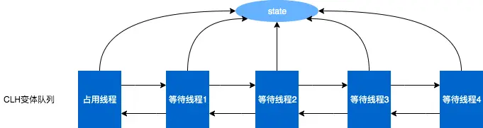

# Java并发编程

## 进程与线程

### 进程
进程是程序的一次执行的结果，进程是CPU分配资源的最小单元。
进程可以被视为程序的一个实例，即一个程序被运行时，操作系统会为其创建一个独立的进程，并分配资源。
进程是资源分配的最小单位。
### 线程
线程是进程内的一个更小的执行单元，线程是最小的调度单位。
一个线程就是一个指令流，将指令流中的一条条指令按照一定的顺序交给CPU执行。
一个进程可以被分为一到多个线程。
## 并行和并发
### 并发(concurrent)
单核CPU下，线程实际是串行执行的。操作系统中的任务调度器会将CPU的时间片分给不同的线程使用，由于CPU在线程之间的切换非常快，因此感觉是同时运行的。
微观串行，宏观并行
### 并行(parallel)
多核CPU下，多个CPU核心可以同时执行多个进程，这些线程是同时运行的。被称作并行。
### tip
实际上线程的数量通常都会大于CPU的核心数，因此运行时即有并发也有并行。
## 异步和同步
### 同步（sync）
需要等待结果返回，才能继续运行
### 异步（async）
不需要等待结果返回，就能继续运行
```java
public static void main(String[] args){
        new Thread(() -> {
            System.out.println("thread start");
            try {
                Thread.sleep(1000);
            } catch (InterruptedException e) {
                throw new RuntimeException(e);
            }
            System.out.println("thread end");
        }).start();
        System.out.println("doing");
}
```

根据程序执行结果可以知道，在一个线程内的两次输出是同步运行的，因为第二次输出必须要等待sleep 1秒之后才能继续执行。而输出doing和线程之间是异步运行的，因为第三处输出不需要等待线程执行完毕之后才会执行，而是直接输出了“doing”，因此第三处输出是异步的。
## Java线程
### 创建和运行线程
**方法一，直接使用Thread**
```java
Thread t = new Thread(){
    @Override
    public void run(){
        System.out.println("running");
    }
}
t.setName("t1")  // 设置线程的名字
t.start();
```
**方法二，使用Runnable配合Thread**
```java
Runnable r = new Runnable(){
    @Override
    public void run(){
        // 线程的执行逻辑
        System.out.println("running");
    }
};
/*
lambda表达式创建
Runnable r = () -> {
    // 线程的执行逻辑
    System.out.println("running");
}
*/
Thread t = new Thread(r);
t.start();
```
**方法三，FutureTask配合Thread**
FutureTask需要实现一个Callable接口，通过Callable接口来接收返回值并将结果传递给其他线程。
```java
FutureTask<Integer> task = new FutureTask<>(() -> {
    System.out.println("doing");
    Thread.sleep(1000);
    return 100;
});
new Thread(task).start();
System.out.println(task.get());

/*
FutureTask<Integer> task = new FutureTask<>(new Callable<Integer>(){
    @Override
    public Integer call() throws Exception{
        System.out.println("hello");
        return 100;
    }
});
*/
new Thread(task,"t").start();
Integer res = task.get();
System.out.println(res);  
```
**方法四，使用线程池**
线程池是一种更高效的线程管理方式，避免了频繁创建和销毁线程的开销
```java
class Task implements Runnable {
	@Override
	public void run() {
	}
}

public static void main(String[] args) {
	ExecutorService executor = Executors.newFixedThreadPool(10);
	for(int i = 0; i < 100; i++) {
		executor.submit(new Task());
	}
	executor.shutdown();
}
```
### 查看进程的方法
```
ps -ef  查看所有线程
ps -fT -p PID 查看某个进程（PID）的所有线程
kill 杀死线程
```
### 如何停止线程
- 异常：线程调用interrupt方法后，在线程的run方法中判断当前对象的interrupted状态，如果是中断则抛出异常，达到中断线程的效果
- 在沉睡中停止：先将线程sleep，然后调用interrupt标记中断状态，interrupt会将阻塞状态的线程中断。会抛出中断异常，从而停止线程
- stop停止：调用stop方法会被暴力停止，方法已弃用，该方法会有不好的后果，导致一些清理性的工作得不到完成
- 使用return停止：调用interrupt标记为中断状态后，在run方法中判断当前线程状态，如果为中断状态则return，能达到停止线程的效果
### 线程运行原理
#### 栈与栈帧
JVM中的栈内存就是给线程使用的，每个线程启动后，虚拟机就会为其分配一块栈内存。
每个栈由多个栈帧（Frame）组成，对应着每次方法调用时所占用的内存。
每个线程只能有一个活动栈帧，对应着当前正在执行的方法
#### 线程上下文切换（Thread Context Switch）
因为以下原因导致cpu不再执行当前的线程，转而执行另一个线程的代码
- 线程cpu时间片用完
- 垃圾回收
- 有更高优先级的线程需要运行
- 线程自己调用了sleep、yield、wait、join、park、synchronized、lock等方法
当Context Switch发生时，需要由操作系统保存当前线程的状态，并恢复另一个线程的状态，Java中对应的就是程序计数器，作用是记住下一条jvm指令的执行地址，每个线程私有。
Context Switch频繁切换会影响程序的性能
### 线程常见方法
#### start 与 run
只有调用start方法才是运行了一个新的线程，才是异步执行，直接调用run方法则是同步执行
```java
Thread t = new Thread(() -> {
    System.out.println("running");
    try {
        Thread.sleep(5000);
    } catch (InterruptedException e) {
        throw new RuntimeException(e);
    }
});
t.run();
System.out.println("other");
```

```java
Thread t = new Thread(() -> {
    System.out.println("running");
    try {
        Thread.sleep(5000);
    } catch (InterruptedException e) {
        throw new RuntimeException(e);
    }
});
t.start();
System.out.println("other");
```

由上面两张图可知，当调用run方法时，其实是主线程调用的run方法，只有当run方法执行完之后才会执行接下来的代码，当调用start方法时，则是使用其他的线程来执行run方法中的内容，无需等待run方法执行完毕就可以执行其他内容。
**tips:** 只有当Thread类的start()方法中，会执行start0()这个native方法来通过操作系统创建线程，而如果只是使用run()方法，就不会创建一个新的线程去执行方法
#### sleep 与 yield
##### sleep
- 调用sleep会让当前线程从Running状态转到Timed Waiting状态（阻塞状态）
- 其它线程可以使用interrupt方法打断正在睡眠的线程，这时sleep方法会抛出InterruptedException异常
- 睡眠结束后的线程未必会立刻执行
- 建议用TimeUnit的sleep代替Thread的sleep来获得更好的可读性 
当调用`Thread.sleep()`时，线程会主动释放CPU，让出CPU时间片，进入`TIMED_WAITING`状态。此时操作系统会触发调度，将CPU分配给其他处于就绪状态的线程。这样其他线程就有机会执行
##### yield
- 调用yield会让当前线程从Running进入Runnable就绪状态，然后调度执行其他同优先级的线程。如果这时没有同优先级的线程，那么不能保证让当前线程暂停的效果
- 具体的实现依赖于操作系统的任务调度器
#### 线程优先级
线程优先级会提示调度器优先调度该线程，但是仅仅是一个提示，调度器可以忽略它
如果cpu比较忙，那么优先级高的线程会获得更多的时间片，但是cpu闲的时候，优先级几乎没什么作用
#### join
```java
static int i = 0;
public static void main(String[] args) throws Exception {
    Thread t = new Thread(() -> {
        log.info("start");
        try {
            TimeUnit.SECONDS.sleep(1);
        } catch (InterruptedException e) {
            throw new RuntimeException(e);
        }
        i = 10;
        log.info("end");
    });
    t.start();
    log.info("{}",i);
}
```
分析上述代码可知，输出的i的值为0

如何让该代码输出的i的值为10
```java
static int i = 0;
public static void main(String[] args) throws Exception {
    Thread t = new Thread(() -> {
        log.info("start");
        try {
            TimeUnit.SECONDS.sleep(1);
        } catch (InterruptedException e) {
            throw new RuntimeException(e);
        }
        i = 10;
        log.info("end");
    });
    t.start();
    t.join();
    log.info("{}",i);
}
```
使用join方法，join方法即等待线程运行结束，在代码中加入t.join()语句之后，主线程的log.info()语句就会在线程t运行结束之后再执行接下来的操作，因此此时输出的变量i的值为10。
join方法可以使得主线程等待Thread0执行结束之后再执行接下来的操作，使得两个线程同步。
#### interrupt
打断sleep的线程，会清空打断状态
```java
Thread t = new Thread(() -> {
 log.debug("sleep");
 try {
 TimeUnit.SECONDS.sleep(5);
 } catch (InterruptedException e) {
 log.info("{}",Thread.currentThread().isInterrupted());
 throw new RuntimeException(e);
 }
}, "t");
t.start();
TimeUnit.SECONDS.sleep(1);
log.debug("interrupt");
t.interrupt();
```

可以发现，interrupt函数成功打断了线程的阻塞，并且输出isInterrupted为false，已经清空了打断标记。
打断正常运行的线程，不会清空打断状态
```java
Thread t = new Thread(() -> {
    while(true){
        if(Thread.currentThread().isInterrupted()){
            log.debug("end");
            break;
        }
    }
}, "t");
t.start();
TimeUnit.SECONDS.sleep(1);
log.debug("interrupt");
t.interrupt();
```

正常运行的线程，当被打断时，线程仍然正常运行，不会跳出while循环，interrupt只是提供一个打断标记，并不会让线程停止运行。
打断park线程，不会清空打断状态，且当打断状态为真时，不会被再次打断
```java
Thread t = new Thread(() -> {
    log.debug("park");
    LockSupport.park();
    log.debug("unpark");
    log.debug("{}", Thread.currentThread().isInterrupted());
    // 尝试再次打断
    LockSupport.park();
    log.debug("park");
}, "t");
t.start();
TimeUnit.SECONDS.sleep(1);
t.interrupt();
```

若想要再次打断，则需要使用interrupted()方法，因为interrupted()方法会清除打断标记，因此可以再次打断。 
```java
Thread t = new Thread(() -> {
    log.debug("park");
    LockSupport.park();
    log.debug("unpark");
    log.debug("{}", Thread.interrupted());
    // 尝试再次打断
    LockSupport.park();
    log.debug("park");
}, "t");
t.start();
TimeUnit.SECONDS.sleep(1);
t.interrupt();
```

### 两阶段终止模式(Two Phase Termination)
如何在线程T1中“优雅”终止线程T2（指给T2一个料理后事的机会）
为什么需要两阶段终止模式：若使用stop()方法，会直接杀死线程，如果此时线程锁住了共享资源，那么该线程被杀死之后就再也没有机会释放锁，其他线程将永远无法获取锁。
```java
@Slf4j
public class Test {
    public static void main(String[] args) throws Exception {
        TwoPhaseTermination tpt = new TwoPhaseTermination();
        tpt.start();
        Thread.sleep(3500);
        tpt.stop();
    }
}

@Slf4j
class TwoPhaseTermination{
    private Thread monitor;

    public void start(){
        monitor = new Thread(() -> {
            while(true){
                if(Thread.currentThread().isInterrupted()){
                    log.debug("料理后事");
                    break;
                }
                try {
                    Thread.sleep(1000);
                    log.debug("执行监控记录");
                } catch (InterruptedException e) {
                    e.printStackTrace();
                    Thread.currentThread().interrupt(); // 重新设置打断标记
                }
            }

        });
        monitor.start();
    }

    public void stop(){
        monitor.interrupt();
    }
}
```

使用两阶段终止模式可以防止线程在被停止之前进行一系列操作。防止线程直接被杀死带来影响。
#### 为什么捕获异常的时候需要重新设置打断标记？
因为interrupt()方法在打断sleep中的线程时，会清除打断标记，如果捕获异常的时候不重新设置打断标记，下一次进入while循环的时候就会继续执行监控记录，而不会进行料理后事的操作，因此无法终止线程运行。
### 线程的状态
- NEW：线程刚被创建，但是还没有调用start()方法
- RUNNABLE：调用了start()方法之后，这个状态涵盖了操作系统层面的可运行状态、运行状态和阻塞状态（由于BIO导致的线程阻塞，仍然认为是可运行状态）
- BLOCKED：处于这个状态的线程，在等待获取监视锁，等待其他监视器的锁定，当时当前监视器被其他线程占用，因此处于阻塞状态。通常发生在synchronized代码块中，但是锁被其他线程占用
- WAITING：线程进入等待状态，等待其他线程唤醒（调用notify()方法），否则会一直处于等待状态。可以通过调用Object类的wait()方法，join()方法或者Lock类的条件等待方法使线程进入等待状态
- TIMED_WAITING：计时等待状态，线程等待一定时间之后，会被唤醒。可以通过Thread.sleep方法，或者Lock类的计时等待方法进入这个状态
- TERMINATED：线程代码运行结束
### 守护线程
默认情况下，Java进程会等待所有线程都结束后才会结束，但是有一种守护线程，只要其它非守护线程运行结束了，即使守护线程的代码没有执行完，也会被强制结束运行。
```java
Thread t = new Thread(() -> {
    while(true){
        if(Thread.currentThread().isInterrupted()){
            break;
        }
    }
    log.info("end");
});
// 守护线程
t.setDaemon(true);
t.start();
Thread.sleep(1000);
log.info("main end");
```

可以看到，虽然t线程进入了死循环，但是只要主线程（非守护线程）执行结束，t线程也会被强制结束。
#### 应用
- 垃圾回收器线程就是一种守护线程
- Tomcat中的Acceptor和Poller线程都是守护线程，因此Tomcat接收到Shutdown命令后，不会等待它们处理完当前请求
## 共享问题
多个线程对共享资源读写操作时，发生了指令交错，就会出现问题。
```java
static int sum = 0;
public static void main(String[] args) throws Exception {
    Thread t1 = new Thread(() -> {
        for(int i = 0; i < 5000; i++){
            sum++;
        }
    });

    Thread t2 = new Thread(() -> {
        for(int i = 0; i < 5000; i++){
            sum--;
        }
    });

    t1.start();
    t2.start();
    t1.join();
    t2.join();
    System.out.println(sum);
}
```

正常情况下，上述代码输出的sum的结果应该是0，但是由于多线程运行时，如果线程在一个时间片内没有运行完，则会切换到其他线程运行，导致对共享资源的访问出现了问题，导致结果和预期的不同。
### 解决方案
#### 阻塞式：synchronized
synchronized可以对对象上锁，获取到锁的线程，在时间片内指令如果没有运行完，则不会释放锁，其他线程如果想要对synchronized临界区内的共享资源进行操作，则会被阻塞，不能对共享资源进行操作。知道获取到锁的线程释放锁之后，其他线程才能对共享资源进行操作。
synchronized锁保证了临界区内代码的原子性。
##### 两种加在不同方法上的synchronized
```java
public class Test {
    public synchronized void test(){

    }
    // 两种方法等价
    public void test(){
        synchronized (this){

        }
    }
}
```
加在成员方法上的锁，只锁对象不锁类，同一个对象在调用方法时会互斥，但是不同的对象在调用方法时不会有冲突。不同的对象拿到的锁是不同的。
```java
public class Test {
    public synchronized static void test(){

    }
    // 两种方法等价
    public static void test(){
        synchronized (Test.class){

        }
    }
}
```
加在静态方法上的锁，锁的是类，无论这个类的哪个实例对象，只要是调用了这个方法，就会互斥，会有竞争。所有对象拿到的都是同一把锁。
#### 局部变量的线程安全
- 局部变量是线程安全的
  每个线程调用局部变量时，会在每个线程的栈帧创建多份，因此不存在共享。每个线程的局部变量都是独立的
- 局部变量引用的对象不一定是线程安全的
  - 如果该对象没有逃离方法的作用访问，则是线程安全的
  - 如果该对象逃离了方法的作用范围，则需要考虑线程安全
```java
public class Test {
    public static void main(String[] args) {
        Thread1 thread1 = new Thread1();
        for(int i=0;i<500;i++){
            new Thread(thread1::run).start();
        }
    }
}
class Thread1{
    ArrayList<String> arrayList = new ArrayList<>();
    public void run(){
        for(int i=0;i<500;i++){
            method1();
            method2();
        }
    }

    public void method1(){
        arrayList.add("1");
    }
    public void method2(){
        arrayList.remove(0);
    }
}
```
Q：为什么String类是被设置成final类型的
A：防止String类中的某些方法被继承，导致出现一些不安全的方法，引发线程安全问题。
## Monitor
### Java对象头
以32位虚拟机为例
普通对象
Object Header(64bits) = Mark Word(32bits) + Klass Word(32bits)
数组对象
Object Header(96bits) = Mark Word(32bits) + Klass Word(32bits) + array length(32bits)
64位JVM架构下，Mark Word

### Monitor(监视器/管程)
每个Monitor中包含了WaitSet，EntryList，Owner
每个Java对象都可以关联一个Monitor对象，如果使用synchronized给对象上锁，对象头中的Mark Word就会指向Monitor的地址。
- 刚开始时Monitor中的Owner为null
- 当一个线程t开始获取锁时，就会将Monitor的所有者Owner设置为t
- 在t获取到锁之后，其他线程如果也想获取锁，就会进入EntryList中被阻塞
- 当t执行完代码之后，就会唤醒EntryList中的线程来竞争锁（非公平竞争）
WaitSet中的线程是之前已经获得过锁，但是条件不满足进入WAITING状态的线程。
### Synchronized原理
#### 轻量级锁
场景：如果一个对象虽然有多个线程访问，但是多线程的访问时间通常都是错开的，就可以使用轻量级锁来进行优化。
##### 原理
- 线程中会创建一个锁记录（Lock Record）对象，每个线程的栈帧都会包含一个锁记录的结构，内部可以存储锁定对象的Mark Word
- 让锁记录中Object Reference指向锁对象，并尝试使用cas替换Object（锁对象）中的Mark Word，将Mark Word中的值存入锁记录
- cas替换成功，Mark Word中存储了锁记录地址（30bits）和状态00（表示轻量级锁），表示由该线程给对象加锁
- cas失败，两种情况
  1. 如果是其他线程持有Object的轻量级锁，表明此时有竞争，进入锁膨胀过程
  2. 如果是自己执行了synchronized的锁重入过程，那么再添加一条Lock Record作为重入的计数
- 当退出synchronized代码块时
  1. 如果有取值为null的锁记录，表示有重入，这时重置锁记录，计数减一
  2. 如果锁记录的取值不为null，这时使用cas将Mark Word的值恢复给对象锁头。成功，则解锁成功；失败，说明轻量级锁进行了锁膨胀或已经升级为重量级锁，进入重量级锁解锁流程
##### tips：为什么存储锁记录地址只需要30bits？
因为锁对象地址有对齐约束（Java对象在JVM中是按照8字节对齐的，所以对象地址必须是8的倍数，低三位恒为0，可以省略），而且锁指针只需要覆盖有限的寻址范围，所以30位足够表达。
#### 锁膨胀
场景：如果在尝试加轻量级锁的过程中，cas操作失败，一种情况是其他线程已经持有该对象的轻量级锁，这时就需要进行锁膨胀，将轻量级锁升级为重量级锁。
##### 原理
- 当t1线程进行轻量级锁加锁时，t0已经获得了轻量级锁
- 加锁失败，进入锁膨胀过程
  - 为Object对象申请Monitor锁，让Mark Word指向重量级锁地址
  - 然后线程自己进入Monitor的EntryList中变为阻塞状态
- 当t0退出同步块解锁时，使用cas将Mark Word的值恢复给对象头。失败，进入重量级锁的解锁过程，即按照Monitor地址找到Monitor对象，设置Owner为null，唤醒EntryList中的BLOCKED线程
#### 自旋优化

场景：轻量级锁竞争的时候，可以通过自旋来进行优化，如果当前线程自旋成功（即持有锁的线程退出了同步块，释放了锁），当前线程就可以避免阻塞

##### 原理

线程获取轻量级锁失败之后，并不会直接进入阻塞状态，而是进入一种空循环的状态，不断地询问其他线程是否已经释放锁

1. 如果已经释放锁，则该线程获取轻量级锁

2. 经过一定询问次数仍未释放锁，则会升级为重量级锁

优点：可以减少锁升级的过程，减少来回切换增加的开销

缺点：自旋需要占用cpu，性能开销较大，不适用于长时间的锁竞争

#### 偏向锁

场景：轻量级锁在没有竞争时，每次重入都需要进行cas操作

##### 原理

只有第一次使用CAS将线程ID设置到对象头的Mark Word，之后发现这个线程ID是自己的就表示没有竞争，不用重新CAS，以后只要不发生竞争，这个对象酒柜该线程所有

- 对象创建时，如果开启了偏向锁（默认开启），那么对象创建后，Mark Word值为0x05，即最后三位为101

- 偏向锁默认时延迟的，不会在程序启动时立即生效，可以通过加VM参数 -xx:BiasedLockingStartupDelay=0 来禁用延迟

- 如果没有开启偏向锁，那么对象创建后，Mark Word值为0x01，即最后三位为001


##### 撤销偏向锁

1. 调用对象的hashCode()方法，但偏向锁的对象Mark Word中存储的是线程id，如果调用hashCode()方法，则会导致偏向锁被撤销

```java
public class Test {
    public static void main(String[] args){
        Stu s = new Stu();
        s.hashCode();
        log.info(ClassLayout.parseInstance(s).toPrintable());
        synchronized (s){
            log.info(ClassLayout.parseInstance(s).toPrintable());
        }
    }
}
class Stu{

}
```


可以发现，调用了hashCode方法之后，mark word的末尾不再是101，而是000

这是因为，在偏向锁的状态，64bits的Mark Word中分配了54bits用于存储线程ID，而调用了hashCode方法之后，偏向锁状态下的Mark Word就不足以再存储hashCode的值，因此会撤销偏向状态，变为轻量级锁

tips：轻量级锁的hashCode存储在锁记录中，重量级锁的hashCode存储在Monitor对象中，因此不会存在问题 

2. 其他线程调用锁对象时，偏向锁会升级为轻量级锁

```java
@Slf4j
public class Test {
    public static void main(String[] args){
        Stu s = new Stu();
        new Thread(() -> {
            log.info(ClassLayout.parseInstance(s).toPrintable());
            synchronized (s){
                log.info(ClassLayout.parseInstance(s).toPrintable());
            }
            log.info(ClassLayout.parseInstance(s).toPrintable());
            synchronized (Test.class){
                // 通过notify和wait函数，防止两个线程发生竞争
                Test.class.notify();
            }
        },"t1").start();
        new Thread(() -> {
            synchronized (Test.class){
                try {
                    Test.class.wait();
                } catch (InterruptedException e) {
                    throw new RuntimeException(e);
                }
            }
            log.info(ClassLayout.parseInstance(s).toPrintable());
            synchronized (s){
                log.info(ClassLayout.parseInstance(s).toPrintable());
            }
            log.info(ClassLayout.parseInstance(s).toPrintable());
        },"t2").start();
    }
}

class Stu{

}
```

这时第一次调用锁对象，可以看到启用的时偏向锁（末位为5），加锁后会在前面带上线程id，释放锁之后，mark word值不变


这是其他线程调用偏向锁的对象，此时可以看到，没加锁时，mark word的内容与第一个线程中一致，再次对该对象加锁（调用锁对象），此时偏向锁变为轻量级锁（末尾为0），释放轻量级锁之后，mark word末尾变为1，表示正常状态下的锁对象


3. 调用wait notify时也会撤销偏向锁，因为这两个方法只有重量级锁中才会拥有

##### 批量重偏向

如果对象虽然是被多个线程访问，但是没有竞争，这时偏向线程T1的对象仍有机会偏向T2，重偏向会重置对象的Thread ID

当撤销偏向锁超过20次，就会批量给这些对象加锁时重新偏向至加锁线程

##### 批量撤销

当撤销偏向锁阈值超过40次后，jvm会觉得不应该偏向。于是整个类的所有对象都会变成不可偏向的，新建的对象也是不可偏向的

## wait/notify
- Owner线程发现条件不足，调用wait方法，即可进入WaitSet变为WAITING状态
- BLOCKED和WAITING线程都处于阻塞状态，不占用CPU时间片
- BLOCKED线程会在Owner线程释放锁时唤醒
- WAITING线程会在Owner线程调用notify或notifyAll时唤醒，但唤醒后并不会直接获得锁，而是进入EntryList重新竞争
### notify
```java
public static void main(String[] args) throws InterruptedException {
        Object obj = new Object();
        new Thread(()->{
            synchronized (obj){
                log.info("t1");
                try {
                    obj.wait();
                } catch (InterruptedException e) {
                    throw new RuntimeException(e);
                }
                log.info("其他代码逻辑");
            }
        },"t1").start();

        new Thread(()->{
            synchronized (obj){
                log.info("t2");
                try {
                    obj.wait();
                } catch (InterruptedException e) {
                    throw new RuntimeException(e);
                }
                log.info("其他代码逻辑");
            }
        },"t2").start();

        TimeUnit.SECONDS.sleep(2);

        log.info("唤醒线程");
        synchronized (obj){
            obj.notify();
        }
    }
```

notify方法会唤醒等待中的线程，并使线程进入EntryList中等待
```java
public static void main(String[] args) throws InterruptedException {
        Object obj = new Object();
        new Thread(()->{
            synchronized (obj){
                log.info("t1");
                try {
                    obj.wait();
                } catch (InterruptedException e) {
                    throw new RuntimeException(e);
                }
                log.info("其他代码逻辑");
            }
        },"t1").start();

        new Thread(()->{
            synchronized (obj){
                log.info("t2");
                try {
                    obj.wait();
                } catch (InterruptedException e) {
                    throw new RuntimeException(e);
                }
                log.info("其他代码逻辑");
            }
        },"t2").start();

        TimeUnit.SECONDS.sleep(2);

        log.info("唤醒线程");
        synchronized (obj){
            // obj.notify();
            obj.notifyAll();
        }
    }
```

notifyAll会将所有的等待中的线程都唤醒，并加入到EntryList中，让线程继续竞争锁
### sleep(n)和wait(n)的区别
1. sleep是Thread的方法，而wait是Object的方法
2. sleep不需要强制和synchronized方法使用，而wait需要和synchronized一起使用，否则抛出`IllegalMonitorStateException`
3. sleep不会释放对象锁，而wait会释放对象锁
### 虚假唤醒
```java
@Slf4j
public class Test {

    static boolean flag1 = false;
    static boolean flag2 = false;
    static final Object obj = new Object();

    public static void main(String[] args) throws InterruptedException {

        new Thread(() -> {
            synchronized (obj){
                if(!flag1){
                    log.info("flag1:{}",flag1);
                    try {
                        obj.wait();
                    } catch (InterruptedException e) {
                        throw new RuntimeException(e);
                    }
                }
                log.debug("flag1:{}",flag1);
                if(flag1){
                    log.info("flag1 is true");
                }else{
                    log.info("flag1 is false");
                }
            }
        },"t1").start();

        new Thread(() -> {
            synchronized (obj){
                if(!flag2){
                    log.info("flag2:{}",flag2);
                    try {
                        obj.wait();
                    } catch (InterruptedException e) {
                        throw new RuntimeException(e);
                    }
                }
                log.debug("flag2:{}",flag2);
                if(flag1){
                    log.info("flag2 is true");
                }else{
                    log.info("flag2 is false");
                }
            }
        },"t2").start();

        TimeUnit.SECONDS.sleep(1);

        synchronized (obj){
            flag1 = true;
            obj.notifyAll();
        }
    }
}
```

上述代码中，因为条件判断只有一次，所以在主线程sleep 1s 之后，不会再次判断标志位的条件是否成立，因此可能会造成虚假唤醒。即 t2线程只有在flag2为true时才会被唤醒，但是由于图中代码使用的是if，导致了t2线程也会被唤醒。
为了防止虚假唤醒现象的出现，可以将图中条件判断的if改成while，可以循环多次判断，只有当对应的条件成立时，才会唤醒线程。
#### tips：为什么不使用notify只唤醒一个线程？
因为notify唤醒线程是随机的，代码中的t1 t2线程都是使用的obj对象进行加锁，如果使用notify来唤醒线程，可能也会导致唤醒的线程不对，出现错误的现象
### 同步模式 保护性暂停(Guarded Suspension)
即一个线程等待另一个线程的执行结果
- 有一个结果需要从一个线程传递到另一个线程，让它们关联同一个GuardedObject
- 如果有结果不断从一个线程到另一个线程，使用消息队列
```java
@Slf4j
public class Test {
    public static void main(String[] args) {
        GuardObject guardObject = new GuardObject();
        new Thread(() -> {
            log.info("等待结果");
            Object res = guardObject.getRes();
            log.info("结果：{}",res);
        },"t1").start();

        new Thread(() -> {
            Object o = new Object();
            // 模拟获取结果
            try {
                TimeUnit.SECONDS.sleep(1);
            } catch (InterruptedException e) {
                throw new RuntimeException(e);
            }
            guardObject.complete(o);
        },"t2").start();
    }
}

class GuardObject{
    private Object response;
    public Object getRes(){
        synchronized (this){
            while(response == null){
                try {
                    this.wait();
                } catch (InterruptedException e) {
                    throw new RuntimeException(e);
                }
            }
        }
        return response;
    }

    public void complete(Object response){
        synchronized (this){
            this.response = response;
            this.notifyAll();
        }
    }
}
```

通过一个公共的GuardObject类，将t2线程的结果传递给t1线程，t1线程获取到t2线程的结果之后，继续执行接下来的代码
#### 超时
```java
@Slf4j
class GuardObject{
    private Object response;
    public Object getRes(long timeout){
        synchronized (this){
            long begin = System.currentTimeMillis();
            long pass = 0;
            while(response == null){
                if(pass >= timeout){
                    log.info("超时");
                    break;
                }
                try {
                    this.wait(timeout - pass); // 防止在中途被虚假唤醒 因此wait的时间不能直接设置成timeout
                } catch (InterruptedException e) {
                    throw new RuntimeException(e);
                }
                pass = System.currentTimeMillis() - begin;
            }
        }
        return response;
    }

    public void complete(Object response){
        synchronized (this){
            this.response = response;
            this.notifyAll();
        }
    }
}
```

### 异步模式 生产者/消费者

- 与前面的保护性暂停中的GuardObject不同，不需要产生结果和消费结果一一对应

- 消费队列可以用来平衡生产资源

- 生产者只负责产生数据，而不关心数据如何处理，消费者只负责处理结果数据

```java
@Slf4j
public class Test {
    public static void main(String[] args) {
        MessageQueue queue = new MessageQueue(2);
        for (int i = 0; i < 3; i++){
            int id = i;
            new Thread(() -> {
                queue.put(new Message(id, "msg"+id));
            },"生产者"+i).start();
        }

        new Thread(() -> {
            while(true){
                try {
                    TimeUnit.SECONDS.sleep(1);
                } catch (InterruptedException e) {
                    throw new RuntimeException(e);
                }
                queue.take();
            }
        },"消费者").start();

    }
}

@Slf4j
class MessageQueue{
    private final LinkedList<Message> list = new LinkedList<>();
    private int capacity;

    public MessageQueue(int capacity){
        this.capacity = capacity;
    }

    public Message take(){
        synchronized (list){
            while(list.isEmpty()){
                try {
                    log.info("队列为空");
                    list.wait();
                } catch (InterruptedException e) {
                    throw new RuntimeException(e);
                }
            }
            Message message = list.removeFirst();
            log.info("take:{}",message);
            list.notifyAll();
            return message;
        }
    }

    public void put(Message msg){
        synchronized (list){
            if(capacity == list.size()){
                try {
                    log.info("队列已满");
                    list.wait();
                } catch (InterruptedException e) {
                    throw new RuntimeException(e);
                }
            }
            list.addLast(msg);
            log.info("put:{}",msg);
            list.notifyAll();
        }
    }

}

@Getter
@AllArgsConstructor
@ToString
final class Message{
    private int id;
    private Object msg;
}
```


上述代码是一个简单的消息队列的实现，消息队列分为生产者和消费者，生产者将信息存入到消息队列中，消费者每次取出一个信息进行消费。

## Part & Unpark

LockSupport.part()             用于暂停当前线程

LockSupport.unpark(暂停线程对象)       用于恢复某个线程的运行

```java
@Slf4j
public class Test {
    public static void main(String[] args) {
        Thread t1 = new Thread(() -> {
            log.info("start");
            try {
                TimeUnit.SECONDS.sleep(1);
            } catch (InterruptedException e) {
                throw new RuntimeException(e);
            }
            log.info("park");
            LockSupport.park();
            log.info("end");
        }, "t1");
        t1.start();

        try {
            TimeUnit.SECONDS.sleep(2);
        } catch (InterruptedException e) {
            throw new RuntimeException(e);
        }
        log.info("unpark");
        LockSupport.unpark(t1);
    }
}
```

 tips：如果unpark在park之前执行，仍然可以让线程执行完毕，而不会导致线程一直挂着，无法继续执行

### 原理

每个线程的底层都有一个Parker对象，Parker对象由三个值组成 _mutex _counter _cond

调用park时，会检查_counter的值是否为1，如果时，则不会暂停线程，而是会继续执行线程接下来的逻辑，并将_counter设置为0

调用unpark时，会将_counter的值设置为1，此前如果线程已经被暂停了，则会让线程继续运行代码，如果线程正在运行，那么线程下一次调用park时，则会直接运行接下来的逻辑，并将_counter设置为0（多次调用unpark，只能设置一次值为1）

## 死锁

一个线程需要获取多把锁，就有可能导致死锁

- t1线程开始时拥有A锁，接下来需要获取B锁

- t2线程开始时拥有B锁，接下来需要获取A锁

t1、t2两个线程都需要等待对方释放锁之后，才能获取到锁。于是两个线程就会陷入无限的等待，就是死锁

```java
public static void main(String[] args) {
    Object a = new Object();
    Object b = new Object();

    new Thread(() -> {
        synchronized (a){
            log.info("A LOCK");
            log.info("start");
            try {
                TimeUnit.SECONDS.sleep(1);
            } catch (InterruptedException e) {
                throw new RuntimeException(e);
            }
            synchronized (b){
                log.info("B LOCK");
            }
            log.info("end");
        }
    },"t1").start();

    new Thread(() -> {
        synchronized (b){
            log.info("B LOCK");
            log.info("start");
            try {
                TimeUnit.SECONDS.sleep(2);
            } catch (InterruptedException e) {
                throw new RuntimeException(e);
            }
            synchronized (a){
                log.info("A LOCK");
            }
            log.info("end");
        }
    }).start();
}
```


### 定位死锁

在命令行中使用 jps 查看所有java进程

使用jstack [-pid] 查看对应进程的信息


在命令行中输入jconsole命令


## 活锁

两个线程不断修改对方的终止条件，导致两个线程都无法达到终止条件而产生活锁问题

```java
@Slf4j
public class Test {

    static volatile int count = 10;
    public static void main(String[] args) {
        new Thread(() -> {
            while(count > 0){
                try {
                    Thread.sleep(200);
                } catch (InterruptedException e) {
                    throw new RuntimeException(e);
                }
                count--;
                log.info("count:{}", count);
            }
        },"t1").start();

        new Thread(() -> {
            while(count < 20) {
                try {
                    Thread.sleep(200);
                } catch (InterruptedException e) {
                    throw new RuntimeException(e);
                }
                count++;
                log.info("count:{}", count);
            }
        },"t2").start();
    }
}
```


可以发现 count 的值一直在一定范围内变动，两个线程无法退出循环，而导致活锁

## ReentrantLock 可重入锁

相对于 synchronized 它具备以下特点

- 可中断

- 可以设置超时时间

- 可以设置为公平锁

- 支持多个条件变量

### 可重入

可重入指的是同一个线程如果第一次获得了这把锁，那么因为它是这把锁的拥有者，因此有权利再次获得这把锁

如果时不可重入锁，那么第二次获得这把锁时，自己也会被挡住

```java
@Slf4j
public class Test {

    private static final ReentrantLock lock = new ReentrantLock();
    public static void main(String[] args) {
        lock.lock();
        try {
            log.info("main");
            m1();
        }finally{
            lock.unlock();
        }
    }

    public static void m1(){
        lock.lock();
        try {
            log.info("m1");
            m2();
        }finally{
            lock.unlock();
        }
    }

    public static void m2(){
        lock.lock();
        try {
            log.info("m2");
        }finally{
            lock.unlock();
        }
    }
}
```


### 可打断

可打断意味着线程如果没有获取到锁，就不会一直等待下去，使用ReentrantLock的lockInterruptibly()方法，就可以使这个锁变成可打断的锁

使用lock()方法时，对象锁就是不可打断的，即使使用了interrupt()方法，t1线程也会一直等待下去

```java
@Slf4j
public class Test {

    private static final ReentrantLock lock = new ReentrantLock();
    public static void main(String[] args) throws InterruptedException {
        Thread t1 = new Thread(() -> {
            try {
                log.info("尝试获取锁");
                lock.lockInterruptibly();
            } catch (InterruptedException e) {
                log.info("没有获取到锁");
                throw new RuntimeException(e);
            }
            try {
                log.info("成功获取锁");
            } finally {
                lock.unlock();
            }
        }, "t1");

        lock.lock();
        t1.start();

        TimeUnit.SECONDS.sleep(1);
        t1.interrupt();
    }
}
```


### 锁超时

ReentrantLock在使用tryLock()方法获取锁的过程中，若tryLock()方法中不添加参数，则代表获取不到锁时，直接返回false；若tryLock()方法中添加参数，则表明在一定时间内，会进行等待，若是获取到锁则返回true，在这段时间内其他线程如果一直没有释放锁，才会返回false

```java
@Slf4j
public class Test {

    private static final ReentrantLock lock = new ReentrantLock();
    public static void main(String[] args) throws InterruptedException {
        Thread t1 = new Thread(() -> {
            try {
                log.info("尝试获取锁");
                if (!lock.tryLock(2, TimeUnit.SECONDS)) {
                    log.info("获取锁失败");
                }
            } catch (InterruptedException e) {
                throw new RuntimeException(e);
            }
            try {
                log.info("获取锁成功");
            } finally {
                log.info("释放锁");
                lock.unlock();
            }
        },"t1");

        log.info("获取锁");
        lock.lock();
        t1.start();
        TimeUnit.SECONDS.sleep(1);
        log.info("释放锁");
        lock.unlock();
    }
}
```


### 公平锁

ReentrantLock默认是不公平锁，即当一个线程释放锁时，阻塞队列中所有等待的线程都会同时竞争这把锁，而不是根据进入队列先后顺序来获得锁，一般不会使用公平锁，因为公平锁会降低并发度 

### 条件变量

synchronized中也有条件变量，当条件不满足时，线程会进入waitSet等待

ReentrantLock可以支持多个条件变量，支持多种不同的不满足条件的线程进入等待

```java
@Slf4j
public class Test {

    private static final ReentrantLock lock = new ReentrantLock();
    public static void main(String[] args) throws InterruptedException {
        Condition condition = lock.newCondition();

        lock.lock();
        condition.await();

        // 唤醒condition中的某个线程
        condition.signal();

        // 唤醒condition中的所有线程
        condition.signalAll();
    }
}
```

#### 使用流程

1. await 前需要获取锁

2. await 执行后，会释放锁，进入 conditionObject 等待

3. await 的线程被唤醒，会重新竞争 lock 锁

4. 竞争 lock 锁成功后，从 await 后继续执行

## 固定运行顺序

例：t1线程打印1 t2线程打印2 必须先打印1后打印2

### wait notify

```java
@Slf4j
public class Test {

    private static final Object object = new Object();

    private static boolean flag = false;
    public static void main(String[] args) throws InterruptedException {

        Thread t1 = new Thread(() -> {
            synchronized (object) {
                while (!flag) {
                    try {
                        object.wait();
                    } catch (InterruptedException e) {
                        e.printStackTrace();
                    }
                }
                log.debug("1");
            }
        }, "t1");

        Thread t2 = new Thread(() -> {
            synchronized (object) {
                flag = true;
                log.debug("2");
                object.notifyAll();
            }
        }, "t2");

        t1.start();
        t2.start();
    }
}
```


### park unpark

```java
@Slf4j
public class Test {
    public static void main(String[] args) throws InterruptedException {

        Thread t1 = new Thread(() -> {
            LockSupport.park();
            log.info("1");
        }, "t1");

        Thread t2 = new Thread(() -> {
            log.info("2");
            LockSupport.unpark(t1);
        }, "t2");

        t1.start();
        t2.start();
    }
}
```


## 多个线程交替输出

例：线程1输出 a 5次，线程2输出 b 5次，线程3输出 c 5次，要求输出abcabcabcabcabc

### wait notify

```java
@Slf4j
public class Test {
    public static void main(String[] args) throws InterruptedException {
        WaitNotify waitNotify = new WaitNotify(1, 5);
        Thread t1 = new Thread(() -> waitNotify.print("a", 1, 2));
        Thread t2 = new Thread(() -> waitNotify.print("b", 2, 3));
        Thread t3 = new Thread(() -> waitNotify.print("c", 3, 1));

        t1.start();
        t2.start();
        t3.start();
        t1.join();
        t2.join();
        t3.join();
        System.out.println();
    }
}

@Slf4j
class WaitNotify {
    private int flag;
    private int loopNumber;

    public WaitNotify(int flag, int loopNumber) {
        this.flag = flag;
        this.loopNumber = loopNumber;
    }

    public void print(String letter,int waitFlag,int nextFlag) {

        for (int i = 0; i < loopNumber; i++) {
            synchronized (this){
                while (flag != waitFlag){
                    try {
                        this.wait();
                    } catch (InterruptedException e) {
                        e.printStackTrace();
                    }
                }
                System.out.print(letter);
                flag = nextFlag;
                this.notifyAll();
            }
        }
    }
}
```


### await signal

```java
@Slf4j
public class Test {
    public static void main(String[] args) throws InterruptedException {
        AwaitSignal awaitSignal = new AwaitSignal(5);
        Condition a = awaitSignal.newCondition();
        Condition b = awaitSignal.newCondition();
        Condition c = awaitSignal.newCondition();
        new Thread(() -> awaitSignal.print("A", a, b)).start();
        new Thread(() -> awaitSignal.print("B", b, c)).start();
        new Thread(() -> awaitSignal.print("C", c, a)).start();

        Thread.sleep(1000);
        awaitSignal.lock();
        try {
            System.out.println("start");
            a.signal();
        }finally {
            awaitSignal.unlock();
        }
    }
}

class AwaitSignal extends ReentrantLock{
    private int loopNumber;

    public AwaitSignal(int loopNumber){
        this.loopNumber = loopNumber;
    }

    public void print(String letter, Condition current, Condition next){
        for (int i = 0; i < loopNumber; i++) {
            lock();
            try {
                current.await();
                System.out.print(letter);
                next.signal();
            } catch (InterruptedException e) {
                throw new RuntimeException(e);
            } finally {
                unlock();
            }
        }
    }
}
```


### park unpark

```java
@Slf4j
public class Test {

    static Thread t1;
    static Thread t2;
    static Thread t3;

    public static void main(String[] args) throws InterruptedException {
        ParkUnpark parkUnpark = new ParkUnpark(5);

        t1 = new Thread(() -> {
            parkUnpark.print("A",t2);
        },"t1");
        t2 = new Thread(() -> {
            parkUnpark.print("B",t3);
        },"t2");
        t3 = new Thread(() -> {
            parkUnpark.print("C",t1);
        },"t3");

        t1.start();
        t2.start();
        t3.start();

        LockSupport.unpark(t1);
    }
}

class ParkUnpark {

    private int loopNumber;

    public ParkUnpark(int loopNumber) {
        this.loopNumber = loopNumber;
    }

    public void print(String letter,Thread next){
        for (int i = 0; i < loopNumber; i++) {
            LockSupport.park();
            System.out.print(letter);
            LockSupport.unpark(next);
        }
    }

}
```


# JMM
JMM即 Java Memory Model，定义了主存，本地内存抽象概念。主存里面主要存储一些共享变量，本地内存里主要存储一些共享变量的副本，交由线程修改，本地内存里的变量是每个线程私有的
体现在以下几方面
- 原子性：保证指令不会受到线程上下文切换的影响
- 可见性：保证指令不会受cpu缓存的影响
- 有序性：保证指令不会受cpu指令并行优化的影响
对于**可见性**，假设以下场景：两个线程同时操作一个变量，比如线程A修改了变量的值，线程B能否立刻看到？如果线程B看到的还是旧值，这就是可见性问题。因为线程CPU都有缓存，线程操作变量时，会先把主内存里的变量读到自己的工作内存（比如CPU缓存）里，改完可能没及时写回主内存，另一个线程读的就还是主内存的旧值。JMM里的volatile关键字，就是解决可见性问题的。使用volatile关键字的变量，修改完会立刻刷回主内存，同时让其他线程的缓存失效，必须重新从主内存读，这样就保证了可见性
对于**原子性**，比如i++操作，分为三步，先读取i的值，加一，写回内存。如果两个线程同时操作，可能线程A刚读完i=10，线程B就已经把i改成11，线程A再加1写回去还是11，结果就错了。JMM里用synchronized或Lock锁就能保证原子性，加锁之后，同一时间只能有一个线程执行这三步，中间不会被打断
对于**有序性**，编译器或者CPU为了提升速度，会在不影响单线程结果的情况下，调整指令顺序。比如先初始化对象A，再把A的引用给变量a，可能被重排成先给引用再初始化。单线程没有问题，但多线程下，另一个线程拿到a的引用时，A可能还没初始化好，一调用就报错。这是volatile或synchronized就能通过内存屏障阻止这种重排序，保证顺序正确
JMM的核心思路是：**定义主内存和工作内存，规定变量必须从主内存加载到工作内存才能操作，改完再写回主内存。然后通过volatile、synchronized这些关键字，控制加载、写回的时机，以及禁止不合理的指令重排，最终保证多线程操作共享变量时能正确交互**
## 可见性
```java
@Slf4j
public class Test {

    static boolean flag = true;

    public static void main(String[] args) {

        new Thread(() -> {
            while (flag) {
            }
        }).start();

        try {
            Thread.sleep(1000);
        } catch (InterruptedException e) {
            throw new RuntimeException(e);
        }
        log.info("stop...");
        flag = false;
    }
}
```
由于flag变量没有volatile关键字修饰，因此可能会被缓存在cpu寄存器内或cpu缓存当中，导致子线程观察不到主线程修改flag变量，导致子线程无止境的循环下去。
### tips
由于空循环while(flag){}内没有任何内存屏障，因此jit编译器可能会将其优化成一个常量，不再从内存中读取，因此子线程会认为flag == true 从而不会跳出循环
```java
@Slf4j
public class Test {

    static boolean flag = true;

    public static void main(String[] args) {

        new Thread(() -> {
            while (flag) {
                System.out.println("111");
            }
        }).start();

        try {
            Thread.sleep(1000);
        } catch (InterruptedException e) {
            throw new RuntimeException(e);
        }
        log.info("stop...");
        flag = false;
    }
}
```
在while循环中加入一个打印语句，因为其带有同步锁和内存屏障，因此子线程可以感知到主线程的变化，可以感知到flag的变化，从而可以跳出循环。
### synchronized
```java
@Slf4j
public class Test {

    static boolean flag = true;

    public static final Object object = new Object();

    public static void main(String[] args) {

        new Thread(() -> {
            while (true) {
                synchronized (object){
                    if (!flag) {
                        break;
                    }
                }
            }
        }).start();

        try {
            Thread.sleep(1000);
        } catch (InterruptedException e) {
            throw new RuntimeException(e);
        }
        log.info("stop...");
        synchronized (object){
            flag = false;
        }
    }
}
```
synchronized同步块中，会使得变量变成可见的。因为每次进入synchronized代码块中，都会刷新缓存，从主存中读取到变量的值，使得flag变量对于子线程也可见。
### volatile
```java
@Slf4j
public class Test {

    volatile static boolean flag = true;

    public static void main(String[] args) {

        new Thread(() -> {
            while (flag) {
            }
        }).start();

        try {
            Thread.sleep(1000);
        } catch (InterruptedException e) {
            throw new RuntimeException(e);
        }
        log.info("stop...");
        flag = false;
    }
}
```
在变量前加上volatile关键字修饰，可以将这个变量变成可见的，子线程每次循环，都需要从主存中读取flag的值，而不是直接从缓存中读取flag变量的值。加上volatile关键字，使得每次修改flag的值时，对于其他线程是可见的，会引起其他线程的变化
volatile关键字只会保证变量值的可见性，无法保证原子性。
仅在一个线程写，多个变量读时，才应该使用volatile
## 有序性
JVM会在不影响正确性的前提下，可以调整语句的执行顺序，这种特性称为指令重排，但是在多线程下，指令重排会影响正确性。
### 为什么有指令重排？
现代处理器会设计为一个时钟周期完成一条执行时间最长的CPU指令。每条指令都可以划分成一个个更小的阶段。例如：每条指令都可以分为：取指令->指令译码->执行指令->内存访问->数据写回  这五个阶段。
现代CPU支持多级指令流水线，例如支持同时执行 取指令->指令译码->执行指令->内存访问->数据写回 的处理器，称为五级指令流水线。这时CPU可以在一个时钟周期内，同时运行五条指令的不同阶段。虽然在本质上，流水线技术并不能缩短单条指令的执行时间，但是它变相提高了指令的吞吐率
### 多线程下指令重排序的问题
单例模式的双重检查锁
```java
public final class Singleton {

    private static Singleton instance;

    public static Singleton getInstance() {

        if(instance == null){
            synchronized (Singleton.class){
                if(instance == null){
                    instance = new Singleton();
                }
            }
        }
        return instance;
    }
}
```
实际上，对于实例化一个对象，有以下三步
1. 分配内存空间
2. 初始化对象
3. 将引用指向对应的内存空间
在没有禁止指令重排时，上述步骤可能会变成1->3->2，这就会导致别的线程判断instance != null，但是此时对象还未初始化，就可能导致对象未初始化或空指针异常
### 解决方法
1. 在变量前加上volatile关键字
2. 使用final字段（final的初始化在构造方法之前完成，能保证安全发布）
3. 使用锁机制（synchronized/ReentrantLock），它们天然能禁止某些重排并保证可见性
4. 使用并发工具类
## volatile
volatile的底层实现原理是内存屏障
- 对 volatile 变量的写指令后会加入写屏障
- 对 volatile 变量的读指令后会加入读屏障
### 可见性
#### 写屏障
写屏障保证在该屏障之前的，对共享变量的改动都同步到主存中
#### 读屏障
读屏障保证在该屏障之后，对共享变量的读取，加载的是主存中最新数据
### 有序性
#### 写屏障
写屏障会确保指令重排序时，不会将写屏障之前的代码排在写屏障之后
#### 读屏障
读屏障会确保指令重排序时，不会将读屏障之后的代码排在读屏障之前

---

### DCL (double-checked locking)

```java
public final class Singleton {

    private static Singleton instance;

    public static Singleton getInstance() {
        // 首次访问会同步，而之后不会再进入 synchronized 方法块
        if(instance == null){
            synchronized (Singleton.class){
                if(instance == null){
                    instance = new Singleton();
                }
            }
        }
        return instance;
    }
}
```

多线程环境下，上述代码是有问题的，前面已经说过，初始化对象实例时，会分为三个步骤

1. 分配内存空间

2. 初始化对象

3. 将引用指向内存空间

在没有禁止指令重排时，上述步骤可能会变成1->3->2，这就会导致别的线程判断instance != null，但是此时对象还未初始化，就可能导致对象未初始化或空指针异常

#### 解决方法

在 instance 变量前加上 volatile 关键字

#### Q&A

Q：如果单例对象实现了序列化接口，如何防止反序列化破坏单例？

A：可以在类内实现一个 Object readResolve()方法，直接返回单例对象。因为在反序列化的过程中会调用readResolve()方法，如果这个方法被重写了，则会调用重写后的方法

### 枚举单例

```java
enum Singleton{

    INSTANCE;

    public void doSomething(){
        System.out.println("do something");
    }
}
```

枚举实现单例是一种最简洁、最安全的方式。JVM会保证该实例只被创建一次，且不会因为反序列化而受到破坏。

枚举类不支持懒汉式加载，因为枚举类在加载时就会创建实例

### 静态内部类单例

```java
public class SingletonInner {
    private SingletonInner() {} // 私有构造

    private static class Holder {
        private static final SingletonInner INSTANCE = new SingletonInner();
    }

    public static SingletonInner getInstance() {
        return Holder.INSTANCE;
    }

    public void doSomething() {
        System.out.println("静态内部类单例方法");
    }
}
```

静态内部类实现单例，支持懒加载，因为只有在调用了getInstance方法时，才会加载Holder类，从而初始化静态变量。

这个方法的单例，仍然有可能被反射破坏，需要重写readResolve方法来防止反射破坏单例

## 乐观锁

例：

```java
public class Test {
    public static void main(String[] args) {
        Account account = new AccountImpl(10000);
        account.test();
    }
}

class AccountImpl implements Account {
    private Integer balance;
    public AccountImpl(Integer balance) {
        this.balance = balance;
    }
    @Override
    public Integer getBalance() {
        return balance;
    }
    @Override
    public void withdraw(Integer amount) {
        balance -= amount;
    }
}

interface Account {

    Integer getBalance();

    void withdraw(Integer amount);

    default void test() {
        List<Thread> ts = new ArrayList<>();

        for (int i = 0; i < 1000; i++) {
            ts.add(new Thread(() -> {
                withdraw(10);
            }));
        }
        long start = System.currentTimeMillis();
        ts.forEach(Thread::start);
        ts.forEach(t -> {
            try {
                t.join();
            } catch (InterruptedException e) {
                e.printStackTrace();
            }
        });
        long end = System.currentTimeMillis();
        long time = end - start;
        System.out.println("cost: " + getBalance());
        System.out.println("time: " + time);
    }
}
```


上述例子中，正常情况下，输出的结果应该是0，但是实际上并非如此，由于多线程可能同时操作，导致cost的值通常会大于0，这时候就需要对共享变量 balance 进行加锁，来保证结果的正确性

### 悲观锁


在方法前加了 synchronized 锁后可以发现 cost 的结果正确，且耗时比不加锁更长。

#### tips

事实上，由于这个竞争只是低竞争情况，不加锁时多个线程同时写 balance 变量，发生数据竞争，相反可能会导致加锁消耗的时间比不加锁更短。因为加锁之后，减少了数据竞争和缓存一致性带来的开销。

### CAS (compare and swap)

```java
public class Test {
    public static void main(String[] args) {
        Account account = new AccountImpl(10000);
        account.test();
    }
}

class AccountImpl implements Account {
    private final AtomicInteger balance;
    public AccountImpl(int balance) {
        this.balance = new AtomicInteger(balance);
    }
    @Override
    public Integer getBalance() {
        return balance.get();
    }
    @Override
    public void withdraw(Integer amount) {
        while(true){
            int before = balance.get();
            int after = before - amount;
            if (balance.compareAndSet(before, after)) {
                return;
            }
        }
    }
}

interface Account {

    Integer getBalance();

    void withdraw(Integer amount);

    default void test() {
        List<Thread> ts = new ArrayList<>();

        for (int i = 0; i < 1000; i++) {
            ts.add(new Thread(() -> {
                withdraw(10);
            }));
        }
        long start = System.currentTimeMillis();
        ts.forEach(Thread::start);
        ts.forEach(t -> {
            try {
                t.join();
            } catch (InterruptedException e) {
                e.printStackTrace();
            }
        });
        long end = System.currentTimeMillis();
        long time = end - start;
        System.out.println("cost: " + getBalance());
        System.out.println("time: " + time);
    }
}
```


通过比较修改前的余额，如果当前余额没被其他线程修改，才会更新余额，如果当前余额被其他线程修改了，则不会更新余额

#### 特点

结合 CAS 和 volatile 可以实现无锁并发，适用于线程数少，多核 CPU 的场景下

- CAS 是基于乐观锁的思想，即使有其他线程来修改共享变量也没关系，可以多重试几次

- synchronized 是基于悲观锁的思想，即必须要防止其他线程修改共享变量，只能一个线程独占共享变量

- CAS 使用的是无锁并发，但是如果竞争激烈，重试次数很多，依然会影响效率

# JUC工具包

## 原子整数

原子整数主要分为AtomicBoolean、AtomicInteger、AtomicLong

### AtomicInteger

接口

incrementAndGet()  --> i++

getAndIncrement()  --> ++i

getAndAdd()  --> 先获取值再增加

addAndGet()  --> 先增加再获取值

updateAndGet()  -->  根据参数来更新值

```java
public class Test {
    public static void main(String[] args) {
        AtomicInteger i = new AtomicInteger(5);
        i.updateAndGet(x -> x * x);
        System.out.println(i.get());
    }
}
```


## 原子引用

AtomicReference  AtomicMarkableReference  AtomicStampedReference

```java
public class Test {
    public static void main(String[] args) {
        BigDecimalAccount account = new Account(new BigDecimal("10000"));
        account.demo(account);
    }
}

interface BigDecimalAccount {
    BigDecimal getValue();

    void withdraw(BigDecimal amount);

    default void demo(BigDecimalAccount account){
        List<Thread> ts = new ArrayList<>();
        for (int i = 0; i < 1000; i++) {
            ts.add(new Thread(() -> {
                account.withdraw(BigDecimal.TEN);
            }));
        }
        ts.forEach(Thread::start);
        ts.forEach(t -> {
            try {
                t.join();
            } catch (InterruptedException e) {
                throw new RuntimeException(e);
            }
        });

        System.out.println(account.getValue());
    }
}

class Account implements BigDecimalAccount{

    private final AtomicReference<BigDecimal> balance;

    public Account(BigDecimal balance) {
        this.balance = new AtomicReference<>(balance);
    }

    @Override
    public BigDecimal getValue() {
        return balance.get();
    }

    @Override
    public void withdraw(BigDecimal amount) {
        while(true){
            BigDecimal oldValue = balance.get();
            BigDecimal newValue = oldValue.subtract(amount);
            if(balance.compareAndSet(oldValue, newValue)){
                return;
            }
        }
    }
}
```

### ABA 问题

原子工具包中，通常只能判断共享变量最后修改时，是否与初值相同，但是无法判断出原子变量是否被修改过。

例如，假设一个变量初始值为A，需要修改成C，这时，如果变量在修改成C之前，现修改成B，然后再从B修改成A，最终变量也能成功修改成C。无法判断变量修改成C之前，有没有被修改过

```java
@Slf4j
public class Test {

    private static AtomicReference<String> ref = new AtomicReference<>("A");

    public static void main(String[] args) throws InterruptedException {
        log.info("{}", ref.get());
        String prev = ref.get();
        other();
        TimeUnit.SECONDS.sleep(1);
        log.info(String.valueOf(ref.compareAndSet(prev,"C")));
    }

    static void other() throws InterruptedException {
        new Thread(() -> {
            ref.compareAndSet("A", "B");
        }).start();
        TimeUnit.MILLISECONDS.sleep(500);
        new Thread(() -> {
            ref.compareAndSet("B", "A");
        }).start();
    }
}
```


#### AtomicStampedReference

```java
@Slf4j
public class Test {

    private static AtomicStampedReference<String> ref = new AtomicStampedReference<>("A",0);

    public static void main(String[] args) throws InterruptedException {
        log.info("{}", ref.getReference());
        String prev = ref.getReference();
        int stamp = ref.getStamp();
        other();
        TimeUnit.SECONDS.sleep(1);
        log.info("{}", stamp);
        log.info(String.valueOf(ref.compareAndSet(prev,"C",stamp, stamp+1)));
    }

    static void other() throws InterruptedException {
        new Thread(() -> {
            int stamp = ref.getStamp();
            log.info("{}",stamp);
            ref.compareAndSet("A", "B", stamp, stamp+1);
        }).start();
        TimeUnit.MILLISECONDS.sleep(500);
        new Thread(() -> {
            int stamp = ref.getStamp();
            log.info("{}",stamp);
            ref.compareAndSet("B", "A", stamp, stamp+1);
        }).start();
    }
}
```


AtomicStampedReference类中 新增版本号属性，每次修改变量时，都会修改版本号，版本号不同时，就无法再次修改变量

## 原子数组

AtomicIntegerArray  AtomicLongArray  AtomicReferenceArray

```java
@Slf4j
public class Test {


    public static void main(String[] args){
        demo(
                () -> new int[10],
                array -> array.length,
                (array, index) -> array[index]++,
                array -> System.out.println(Arrays.toString(array))
        );
        demo(
                () -> new AtomicIntegerArray(10),
                AtomicIntegerArray::length,
                AtomicIntegerArray::getAndIncrement,
                System.out::println
        );
    }

    static <T> void demo(
            Supplier<T> supplier,
            Function<T, Integer> function,
            BiConsumer<T,Integer> biConsumer,
            Consumer<T> consumer
    ){
        T array = supplier.get();
        int length = function.apply(array);
        List<Thread> threads = new ArrayList<>();
        for (int i = 0; i < 10; i++) {
            threads.add(new Thread(() -> {
                for (int j = 0; j < 10000; j++) {
                    biConsumer.accept(array, j % length);
                }
            }));
        }
        threads.forEach(Thread::start);
        threads.forEach(thread -> {
            try {
                thread.join();
            }catch (Exception e){
                log.error("error", e);
            }
        });
        consumer.accept(array);
    }
}
```


以上是普通数组和原子数组，在线程不安全的情况下，所产生的问题，可以明显看出，普通的数组，在多线程的情况下得到的结果是不正确的

## 原子累加器 LongAdder

```java
@Slf4j
public class Test {

    public static void main(String[] args){
        for (int i = 0; i < 5; i++) {
            demo(
                    () -> new AtomicLong(0),
                    AtomicLong::incrementAndGet
            );
        }

        for (int i = 0; i < 5; i++) {
            demo(
                    LongAdder::new,
                    LongAdder::increment
            );
        }
    }

    static<T> void demo(
            Supplier<T> supplier,
            Consumer<T> consumer
    ){
        T adder = supplier.get();
        List<Thread> ts = new ArrayList<>();
        for (int i = 0; i < 5; i++) {
            ts.add(new Thread(() -> {
                for (int j = 0; j < 500000; j++) {
                    consumer.accept(adder);
                }
            }));
        }
        long start = System.nanoTime();
        ts.forEach(Thread::start);
        ts.forEach(t -> {
            try {
                t.join();
            } catch (InterruptedException e) {
                throw new RuntimeException(e);
            }
        });
        long end = System.nanoTime();
        log.debug("time: {}", (end - start) / 1000_000);
    }

}
```


可以看出来，多次测试之后，jvm对LongAdder类会有优化

LongAdder在有竞争时，会设置多个累加单元，Thread0累加Cell[0]，Thread1累加Cell[1]...最终将结果汇总，因此减少了CAS重试失败的次数，提高了性能

## Unsafe

```java
public class Test {

    public static void main(String[] args) throws Exception {

        Field theUnsafe = Unsafe.class.getDeclaredField("theUnsafe");
        theUnsafe.setAccessible(true);
        Unsafe unsafe = (Unsafe) theUnsafe.get(null);
        System.out.println(unsafe);

    }

}
```

Unsafe是一个内部类，通常不允许访问。且需要访问Unsafe类时，只能通过反射来获取到Unsafe对象，它提供了执行低级、不安全操作的方法。例如可以绕过Java的内存安全和访问限制。通常不建议使用Unsafe类


## 不可变对象

不可变对象是指**创建之后不能修改的对象**

```java
public class Test {

    public static void main(String[] args) {
        test1();
        test2();
    }

    private static void test2() {
        DateTimeFormatter sdf = DateTimeFormatter.ofPattern("yyyy-MM-dd");
        for (int i = 0; i < 5; i++) {
            new Thread(() -> {
                System.out.println(sdf.parse("2025-08-26"));
            }).start();
        }
    }

    private static void test1() {
        SimpleDateFormat sdf = new SimpleDateFormat("yyyy-MM-dd");
        for (int i = 0; i < 5; i++) {
            new Thread(() -> {
                synchronized (sdf) {
                    try {
                        System.out.println(sdf.parse("2025-08-26"));
                    } catch (ParseException e) {
                        throw new RuntimeException(e);
                    }
                }
            }).start();
        }
    }
}
```

SimpleDateFormat是一个线程不安全的类，在多线程的情况下，必须要先对其进行加锁，才能正常使用

从 DateTimeFormatter 的源码中可以看到它是一个不可变对象，且线程安全，因此在多线程环境下，更推荐使用DateTimeFormatter类

### 如何设计一个不可变类

以String类为例

#### final

不可变类中的类和类中所有的属性都是final的

- 属性用final修饰保证了该属性是只读的，不可修改

- 类用final修饰保证了该类中的方法不能被覆盖，防止子类无意间破坏不可变性

#### 保护性拷贝

String类中，当传参为一个字符数组时，会调用Arrays类中的copyOf()方法，构造出来的String类会复制参数中的内容。通过创建副本对象来避免共享的手段称为保护性拷贝

## 享元模式

当需要重用数量有限的同一类对象时，就会用到享元模式。通过对相同取值的对象进行共享，从而达到最小化内存的使用

### 包装类

Byte Short Long 缓存的范围都是-128~127

Character 缓存的范围是 0~127

Integer 缓存的范围是 -128~127，最小值不能变，但是最大值可以通过调整虚拟机参数来改变

Boolean 缓存了 TRUE 和 FALSE 

#### String 缓存池

String 缓存池中当String 对象为字面量时，会自动存入缓存池中，String 是新建对象时，则不会加入缓存池中，会放在堆内存里

String 还可以通过intern()方法，手动将字符串添加进缓存池中

```java
public class Test {

    public static void main(String[] args) {
        String s1 = "Hello"; // 字面量
        String s2 = "Hello";
        String s3 = new String("Hello");  // 创建对象
        String s4 = s3.intern();  // intern 方法 手动加入缓存池
        System.out.println(s1 == s2);
        System.out.println(s1 == s3);
        System.out.println(s1 == s4);
    }
}
```


#### 连接池

```java
public class Pool {

    private int poolSize;
    private Connection[] connections;
    private AtomicIntegerArray states;

    public Pool(int poolSize) {
        this.poolSize = poolSize;
        this.connections = new Connection[poolSize];
        this.states = new AtomicIntegerArray(poolSize);
        for (int i = 0; i < poolSize; i++) {
            connections[i] = new MockConnection("连接" + (i + 1));
        }
    }


    public Connection getConnection(){
        while(true){
            for (int i = 0; i < poolSize; i++) {
                if(states.get(i) == 0){
                    if (states.compareAndSet(i, 0, 1)) {
                        log.info("get {}", connections[i]);
                        return connections[i];
                    }
                }
            }
            synchronized (this){
                try {
                    log.info("waiting...");
                    this.wait();
                } catch (InterruptedException e) {
                    e.printStackTrace();
                }
            }
        }
    }

    public void release(Connection conn){
        for (int i = 0; i < poolSize; i++) {
            if(connections[i] == conn){
                states.set(i, 0);
                synchronized (this){
                    log.info("release {}", conn);
                    this.notifyAll();
                }
                break;
            }
        }
    }
}
```

由于每次连接时都需要创建和销毁连接，会导致性能下降，所以可以通过连接池的方法，每次从池中获取连接，使用完释放连接，不需要频繁创建和销毁连接，可以提高性能

# ThreadPool

## 自定义线程池

---

## ThreadPoolExecutor

### 线程池状态

ThreadPoolExecutor使用int的高3位来表示线程状态，低29位表示线程数量

RUNNING   111  正常运行

SHUTDOWN   000  不会接收新任务，但是会处理阻塞队列剩余任务

STOP   001   会中断正在执行的任务，并抛弃阻塞队列任务

TIDYING   010    任务全执行完毕，活动线程为0  即将进入终结

TERMINATED   011   终结状态

这些信息存储在一个原子变量ctl中，目的是将线程池状态与线程个数合二为一，这样就可以使用一次cas原子操作进行赋值

#### tips: 关于shutdown和shutdownNow的区别

当线程池执行shutdown和shutdownNow方法之后，都不会再接收新的任务

当线程池中有线程正在执行任务，shutdown方法会让线程池中的线程执行完所有任务之后才会关闭线程池（所有任务指的是，正在被执行的任务以及阻塞队列中的任务）

而对于shutdownNow方法，会调用线程的interrupt方法，如果此时线程正在从阻塞队列中获取任务，则会抛出异常

### 线程池参数

```java
public ThreadPoolExecutor(int corePoolSize,
                          int maximumPoolSize,
                          long keepAliveTime,
                          TimeUnit unit,
                          BlockingQueue<Runnable> workQueue,
                          ThreadFactory threadFactory,
                          RejectedExecutionHandler handler) {
        if (corePoolSize < 0 ||
            maximumPoolSize <= 0 ||
            maximumPoolSize < corePoolSize ||
            keepAliveTime < 0)
            throw new IllegalArgumentException();
        if (workQueue == null || threadFactory == null || handler == null)
            throw new NullPointerException();
        this.corePoolSize = corePoolSize;
        this.maximumPoolSize = maximumPoolSize;
        this.workQueue = workQueue;
        this.keepAliveTime = unit.toNanos(keepAliveTime);
        this.threadFactory = threadFactory;
        this.handler = handler;
    }
```

线程池有七大参数，分别是

**corePoolSize**   核心线程数

**maximumPoolSize**  核心线程数 + 辅助线程数

**keepAliveTime**   辅助线程存活时间

**unit**  时间单位

**threadFactory**  线程工厂，给线程池中的线程起名

**handler**  拒绝策略，当任务数超过maximumPoolSize时的拒绝策略

#### 拒绝策略

1. **AbortPolicy - 默认策略（中止策略）**：会直接抛出 RejectedExecutionException 异常，明确地通知调用者任务被拒绝了，但是如果调用者没有捕获并处理这个异常，可能会导致整个线程中断

2. **CallerRunsPolicy - 调用者运行策略**：不抛弃任务，也不抛出异常，而是直接将某些被拒绝的任务回退给调用者线程来执行。它不会丢弃任务，所有任务都能得到执行。由于调用者线程需要自己执行任务，会减慢新任务的提交速度，相当于给线程池一个缓冲期。但是如果提交任务的线程本身也很繁忙，可能会影响业务逻辑的执行

3. **DiscardPolicy - 丢弃策略**：什么也不做，直接丢弃无法处理的任务。实现简单，但是无法感知到哪个任务被丢弃

4. **DiscardOldestPolicy - 丢弃最早任务策略**：丢弃工作队列中最早未处理的任务，然后尝试重新提交当前被拒绝的任务。

5. **自定义策略**：通过实现 RejectedExecutionHandler 接口，来自定义拒绝策略，可以适应更复杂的业务逻辑

### Executors

Executors 是 JUC 包下的工具类，提供了一系列静态工厂方法，可以快速创建各种预设配置的线程池，简化线程池的创建过程

#### newFixedThreadPool（固定大小线程池）

核心线程数 = 最大线程数

使用无界队列(LinkedBlockingQueue)，默认容量为Integer.MAX_VALUE

空闲线程存活时间为0

提交任务时，如果当前线程数<核心线程数，则创建新线程，如果已达到核心线程数，则将任务放入无界队列等待

有内存溢出的风险，如果任务提交速度远大于处理速度，无界队列会不断堆积任务，最终导致OOM

**使用场景**：适用于负载较重的服务器，需要线程当前线程数量，保证资源可控。适用于任务量已知，需要稳定线程数量的场景

```java
public static ExecutorService newFixedThreadPool(int nThreads) {
        return new ThreadPoolExecutor(nThreads, nThreads,
                                      0L, TimeUnit.MILLISECONDS,
                                      new LinkedBlockingQueue<Runnable>());
    }
```

#### newCachedThreadPool（可缓存线程池）

核心线程数为0，最大线程数为Integer.MAX_VALUE

使用同步移交队列(SynchronousQueue)，该队列不存储元素，每个插入操作必须等待另一个线程的移除操作

线程空闲存活时间为60秒

提交任务时，如果有空闲线程，则使用空闲线程执行；如果没有空闲线程，则立即创建新线程来执行任务；线程执行完任务后，如果60秒内没有新任务，则被回收

由于最大线程数过多，如果任务数量非常多且执行时间长，可能会创建大量线程，耗尽CPU和内存资源

**使用场景**：适用于执行很多短期异步任务的小程序，或者负载较轻的服务器

```java
public static ExecutorService newFixedThreadPool(int nThreads, ThreadFactory threadFactory) {
        return new ThreadPoolExecutor(nThreads, nThreads,
                                      0L, TimeUnit.MILLISECONDS,
                                      new LinkedBlockingQueue<Runnable>(),
                                      threadFactory);
    }
```

#### newSingleThreadExecutor（单线程线程池）

只有一个线程在工作

使用无界队列

保证所有任务按照提交顺序执行

返回的ExecutorService被包装过，不能强制转换为ThreadPoolExecutor来修改配置

**适用场景**：需要保证任务顺序执行，并且在任意时间点，不会有多个线程是活动的场景

```java
public static ExecutorService newSingleThreadExecutor() {
        return new FinalizableDelegatedExecutorService
            (new ThreadPoolExecutor(1, 1,
                                    0L, TimeUnit.MILLISECONDS,
                                    new LinkedBlockingQueue<Runnable>()));
    }
```

### 工作线程

#### 饥饿

**线程池饥饿** 是指在线程池中，虽然有任务在队列中等待执行，但线程池中的工作线程却无法执行这些任务的情况。这通常不是因为线程池没有线程，而是因为这些线程都被某些长时间运行或相互阻塞的任务所占用，导致其他任务得不到执行资源，就像“饿死”了一样。

```java
@Slf4j
public class Test {

    public static void main(String[] args) {
        ExecutorService executor = Executors.newFixedThreadPool(1);

        // 饥饿任务：占用唯一线程
        executor.execute(() -> {
            System.out.println("饥饿任务开始，将永久占用线程");
            while (true) {
                // 无限循环
            }
        });

        // 被饥饿的任务：永远无法执行
        executor.execute(() -> {
            System.out.println("这个消息永远不会被打印！");
        });
    }
}
```


由以上结果可知，第二个任务永远不会被执行，因此导致饥饿现象。

##### CPU密集型运算

通常采用CPU核数+1能够实现最优的CPU利用率，+1是保证当线程由于页缺失故障或其他原因导致暂停时，额外的线程可以顶上去，保证CPU时钟周期不被浪费

##### IO密集型运算

CPU不总是处于繁忙状态，例如当执行业务计算时，会使用CPU资源，但当执行IO操作时，远程RPC调用时，包括进行数据库操作时，CPU就闲下来了，可以利用多线程提高利用率

线程数 = 核数 * 期望CPU利用率 * 总时间（CPU计算时间 + 等待时间）/ CPU计算时间

### ScheduledExecutorService

#### 延时执行

```java
@Slf4j
public class Test {

    public static void main(String[] args) {
        ScheduledExecutorService executor = Executors.newScheduledThreadPool(1);

        executor.schedule(() -> {
            log.debug("task1");
            try {
                TimeUnit.SECONDS.sleep(1);
            } catch (InterruptedException e) {
                throw new RuntimeException(e);
            }
        },1,TimeUnit.SECONDS);
        executor.schedule(() -> {
            log.debug("task2");

        },1,TimeUnit.SECONDS);
    }
}
```


#### 定时执行

```java
@Slf4j
public class Test {

    public static void main(String[] args) {
        ScheduledExecutorService executor = Executors.newScheduledThreadPool(1);

        executor.scheduleAtFixedRate(() -> method(executor), 0, 1, TimeUnit.SECONDS);
    }

    private static void method(ScheduledExecutorService executor) {
        executor.schedule(() -> {
            log.debug("task1");
        },0,TimeUnit.SECONDS);
    }
}
```


#### 处理异常

```java
@Slf4j
public class Test {

    public static void main(String[] args) {
        ScheduledExecutorService executor = Executors.newScheduledThreadPool(1);

        executor.submit(() -> {
            log.info("start");
            int i = 1 / 0;
        });
    }

}
```


正常情况下，如果出现了异常，不会直接抛出异常或者打印异常信息，异常通常会直接吞掉，从而导致出错了而不能知道

##### 手动捕获异常并打印异常信息

```java
@Slf4j
public class Test {

    public static void main(String[] args) {
        ScheduledExecutorService executor = Executors.newScheduledThreadPool(1);

        executor.submit(() -> {
            log.info("start");
            try {
                int i = 1 / 0;
            } catch (Exception e) {
                e.printStackTrace();
            }
        });
    }
}
```


##### 使用future.get()方法打印异常

```java
@Slf4j
public class Test {

    public static void main(String[] args) throws ExecutionException, InterruptedException {
        ScheduledExecutorService executor = Executors.newScheduledThreadPool(1);

        Future<?> future = executor.submit(() -> {
            log.info("start");
            int i = 1 / 0;
            return true;
        });

        log.info("{}",future.get());
    }
}
```


### Fork/Join

Fork/Join 是JDK1.7加入的新的线程池实现，体现的是一种分治思想，适用于能够进行任务拆分的cpu密集型运算

Fork/Join在分治的基础上加入了多线程，可以把每个任务的分解和合并交给不同的线程来完成，进一步提升了运算效率

```java
@Slf4j
public class Test {

    public static void main(String[] args) {
        ForkJoinPool forkJoinPool = new ForkJoinPool(4);
        System.out.println(forkJoinPool.invoke(new MyTask(1,5)));
    }
}

@Slf4j
class MyTask extends RecursiveTask<Integer> {

    private int begin;
    private int end;

    public MyTask(int begin, int end) {
        this.begin = begin;
        this.end = end;
    }

    @Override
    protected Integer compute() {
        if(begin == end){
            log.info("{}", begin);
            return begin;
        }
        if(end - begin == 1){
            log.info("{} + {} ",begin,end);
            return begin + end;
        }

        int mid = (begin + end) / 2;
        MyTask task1 = new MyTask(begin, mid);
        MyTask task2 = new MyTask(mid + 1, end);
        task1.fork();
        task2.fork();
        Integer join1 = task1.join();
        Integer join2 = task2.join();
        Integer result = join1 + join2;
        log.info("{} + {} = {}", join1, join2, result);
        return result;
    }
}
```


# AQS(AbstactQueueSynchronizer)
阻塞式锁和相关的同步器工具的框架
- 用state属性来表示资源的状态（分独占模式和共享模式），子类需要定义如何维护这个状态，控制如何获取锁和释放锁
- 独占模式只能有一个线程来访问资源，而共享模式允许多个线程访问线程
- 提供了基于FIFO的等待队列，类似于Monitor的EntryList
- 条件变量来实现等待，唤醒机制，支持多个条件变量，类似于Monitor的WaitSet
## 自定义锁

```java

```
# 杂项
## blocked和waiting的区别
- 触发条件：blocked状态通常是因为某个线程锁竞争失败所导致的，线程尝试获取一个对象的锁，但是这个锁已经被其他线程持有。这是就会进入blocked状态阻塞，并一直尝试获取锁。waiting状态通常是因为它正在等待另一个线程执行某些操作，调用了对象的wait方法、Thread.join()方法或LockSupport.park()方法。这种状态下，线程不会消耗CPU资源，并且不会参与锁的竞争
- 唤醒机制：当一个线程被阻塞等待获取锁时，一旦锁被释放，线程就有机会重新尝试获取锁。如果锁此时未被其他线程获取，那么该线程就可以从blocked状态变回runnable状态。线程的waiting状态需要显示唤醒，需要其他线程调用同一个对象的notify方法或者notifyAll方法才能唤醒
- blocked是锁竞争失败后被动触发的状态，waiting是人为主动触发的状态
- blocked的唤醒是自动触发的，waiting需要其他线程通过特定的方法显式唤醒
## 线程间通信
- 共享变量是最基本的线程间通信方式。多个线程可以访问和修改同一个共享变量，从而实现信息传递。为了保证线程安全，通常需要使用synchronized或volatile
```java
public class Test1 {  
    private static volatile boolean flag = false;  
  
    public static void main(String[] args) {  
        Thread producer = new Thread(() -> {  
            try{  
                Thread.sleep(2000);  
            } catch (InterruptedException e) {  
                e.printStackTrace();  
            }  
            flag = true;  
            System.out.println("Producer:Flag is set to true");  
        });  
  
        Thread consumer = new Thread(() -> {  
            while(!flag){  
  
            }            System.out.println("Consumer:Flag is now true");  
        });  
        producer.start();  
        consumer.start();  
    }  
}
```
```text
Producer:Flag is set to true
Consumer:Flag is now true
```
volatile保证了变量的可见性，即一个线程修改了flag的值，另一个线程能立即看到，会立刻刷新主存内的变量值，并设置线程工作内存里面的变量缓存失效，让其他线程从主存中读取变量新的值
-  Object类中的wait、notify、notifyAll方法可以用于线程间的协作。wait方法使线程进入等待状态，notify方法唤醒在此对象监视器上等待的单个线程，notifyAll唤醒所有等待线程
```java
public class Test2 {  
    private static final Object lock = new Object();  
  
    public static void main(String[] args) {  
        Thread producer = new Thread(() -> {  
            synchronized (lock) {  
                try {  
                    System.out.println("Producer:producing...");  
                    Thread.sleep(2000);  
                    System.out.println("Producer:Production finished.Notifying consumer.");  
                    lock.notify();  
                    } catch (InterruptedException e) {  
                        throw new RuntimeException(e);  
                    }  
                }  
        });  
        Thread consumer = new Thread(() -> {  
            synchronized (lock) {  
                try{  
                    System.out.println("Consumer:Waiting for production.");  
                    lock.wait();  
                    System.out.println("Consumer:Production finished.Consuming...");  
                } catch (InterruptedException e) {  
                    throw new RuntimeException(e);  
                }  
            }  
        });  
  
        consumer.start();  
        producer.start();  
    }  
}
```
lock是一个用于同步的对象，生产者和消费者线程都需要获取该对象的锁才能执行相应操作。消费者线程调用wait方法后进入等待状态，释放锁；生产者线程执行完生产任务后，调用notify方法唤醒等待的消费者线程
- juc包中的Lock和Condition接口提供了比synchronized更灵活的线程间通信方式。Condition接口的await方法类似于wait，signal和signalAll方法类似于notify和notifyAll
```java
public class Test3 {  
  
    private static final Lock lock = new ReentrantLock();  
    private static final Condition condition = lock.newCondition();  
  
    public static void main(String[] args) {  
        Thread producer = new Thread(() -> {  
            lock.lock();  
            try {  
                System.out.println("Producer:Producing...");  
                Thread.sleep(2000);  
                System.out.println("Producer:Production finished.Notify consumer");  
                condition.signal();  
            } catch (InterruptedException e) {  
                throw new RuntimeException(e);  
            }finally {  
                lock.unlock();  
            }  
        });  
  
        Thread consumer = new Thread(() -> {  
            lock.lock();  
            try {  
                System.out.println("Consumer:Waiting for producer...");  
                condition.await();  
                System.out.println("Consumer:Consuming...");  
            } catch (InterruptedException e) {  
                throw new RuntimeException(e);  
            }finally {  
                lock.unlock();  
            }  
        });  
          
        consumer.start();  
        producer.start();  
    }  
}
```
ReentrantLock是Lock接口的一个实现类，condition是通过newCondition方法创建的。消费者线程调用condition.await()方法进入等待状态，生产者线程执行完任务后调用signal方法唤醒等待的消费者线程
- juc包中的BlockingQueue接口提供了线程安全的队列操作，当队列满时，插入元素会被阻塞；当队列为空时，获取元素的线程会被阻塞
```java
public class Test4 {  
  
    private static final BlockingQueue<Integer> bq = new ArrayBlockingQueue<>(1);  
  
    public static void main(String[] args) {  
        Thread producer = new Thread(() -> {  
            try {  
                System.out.println("Producer:producing...");  
                Thread.sleep(1000);  
                bq.put(1);  
                System.out.println("Producer:Production finished");  
            } catch (InterruptedException e) {  
                throw new RuntimeException(e);  
            }  
        });  
  
        Thread consumer = new Thread(() -> {  
            try {  
                System.out.println("Consumer:Waiting for consumer");  
                Integer take = bq.take();  
                System.out.println("Consumer:Consumed item:"+take);  
            } catch (InterruptedException e) {  
                throw new RuntimeException(e);  
            }  
        });  
  
        producer.start();  
        consumer.start();  
    }  
}
```
ArrayBlockingQueue是BlockingQueue的一个实现类，容量为1
生产者线程调用put方法将元素插入队列，如果线程已满，线程会被阻塞；消费者线程调用take方法将元素从队列中取出，如果队列为空，线程会被阻塞
- juc包下的CountDownLatch，允许一个或多个线程等待其他线程完成操作。
	`CountDownLatch(int count)`：构造函数，指定需要等待的线程数
	`countDown()`：减少计数器的值
	`await()`：使当前线程等待，直到计数器的值为0
```java
public static void main(String[] args) throws InterruptedException {  
    int threadCount = 3;  
    CountDownLatch latch = new CountDownLatch(threadCount);  
    for (int i = 0; i < threadCount; i++) {  
        new Thread(() -> {  
            try {  
                System.out.println(Thread.currentThread().getName() + " finished");  
            }finally {  
                latch.countDown();  
            }  
        }).start();  
    }  
    latch.await();  
    System.out.println("所有线程任务完成");  
}
```
- CyclicBarrier，允许一组线程相互等待，直到所有线程都达到某个公共屏障点
	`CyclicBarrier(int parties,Runnable barrierAction)`：构造函数，指定参与的线程数量和所有线程到达屏障点后执行的操作
	`await()`：使当前线程等待，直到所有线程都到达屏障点
```java
public static void main(String[] args) {  
    int threadCount = 3;  
    CyclicBarrier barrier = new CyclicBarrier(threadCount,() -> {  
        System.out.println("所有线程都到达屏障点");  
    });  
  
    for (int i = 0; i < threadCount; i++) {  
        new Thread(() -> {  
            try {  
                System.out.println(Thread.currentThread().getName() + " finished");  
                barrier.await();  
            } catch (Exception e) {  
                throw new RuntimeException(e);  
            }  
        }).start();  
    }  
}
```
- Semaphore，计数信号量，可以控制同时访问特定资源的线程数量
	`Semaphore(int permits)`：构造函数，指定信号量的初始许可数量
	`acquire()`：获取一个许可，如果没有可用许可则阻塞
	`release()`：释放一个许可
```java
public static void main(String[] args) {  
    int permitCount = 2;  
    Semaphore semaphore = new Semaphore(permitCount);  
    for (int i = 0; i < 5; i++) {  
        new Thread(() -> {  
            try {  
                semaphore.acquire();  
                System.out.println(Thread.currentThread().getName() + "获得许可");  
            } catch (InterruptedException e) {  
                throw new RuntimeException(e);  
            }finally {  
                semaphore.release();  
                System.out.println(Thread.currentThread().getName() + "释放许可");  
            }  
        }).start();  
    }  
}
```
上述代码中同时最多只能有两个线程获得许可，其他线程阻塞
## 如何停止一个线程
- 通过共享标志位主动中止。定义一个可见的状态变量，由主线程控制其值，工作线程循环检测该变量决定是否退出
```java
public class Test8 implements Runnable{  
  
    private volatile boolean flag = true;  
  
    @Override  
    public void run() {  
        while(flag){  
            try {  
                System.out.println("Thread running...");  
                Thread.sleep(1000);  
            } catch (InterruptedException e) {  
                flag = false;  
                Thread.currentThread().interrupt();  
            }  
        }  
        System.out.println("Thread stopped");  
    }  
  
    // 外部调用停止线程  
    public void stop() {  
        flag = false;  
    }  
}
```
- 使用线程中断机制，通过`Thread.interrupt()`触发线程中断状态，结合中断检测实现停止线程
```java
public class Test8 implements Runnable{  
  
    @Override  
    public void run() {  
        while(!Thread.currentThread().isInterrupted()){  
            try {  
                System.out.println("Thread running...");  
                Thread.sleep(1000);  
            } catch (InterruptedException e) {  
                Thread.currentThread().interrupt();  
            }  
        }  
        System.out.println("Thread stopped");  
    }  
}
```
interrupt()方法不会立即中断线程，只是设置一个中断标志，线程需要手动检查中断状态，或者触发可中断操作(sleep(),wait(),join())响应中断。阻塞操作收到中断请求后，会抛出`InterruptedException`并清除中断状态
- 通过Future取消任务。使用线程池提交任务，并通过Future.cancel()停止线程，依赖中断机制
```java
public static void main(String[] args) {  
    ExecutorService executor = Executors.newSingleThreadExecutor();  
    Future<?> future = executor.submit(() -> {  
        while (!Thread.currentThread().isInterrupted()) {  
            System.out.println("Thread Running");  
            try {  
                Thread.sleep(1000);  
            } catch (InterruptedException e) {  
                System.out.println("Thread Interrupted");  
                Thread.currentThread().interrupt();  
            }  
        }  
    });  
    try {  
        Thread.sleep(3000);  
        future.cancel(true);  
    } catch (InterruptedException e) {  
        Thread.currentThread().interrupt();  
    }finally {  
        executor.shutdown();  
    }  
}
```
- 处理不可中断的阻塞操作。某些IO或同步操作无法通过中断直接响应。此时需要结合资源关闭操作
```java
public class Test9 implements Runnable{  
  
    private ServerSocket server;  
  
    public Test9(ServerSocket server) {  
        this.server = server;  
    }  
    @Override  
    public void run() {  
        try {  
            while(!Thread.currentThread().isInterrupted()) {  
                Socket socket = server.accept();  
            }  
        } catch (IOException e) {  
            if(Thread.currentThread().isInterrupted()){  
                System.out.println("Thread stopped by interrupt");  
            }  
        }  
    }  
  
    public void stop() {  
        try {  
            server.close();  
        } catch (IOException e) {  
            System.out.println("Error closing socket:"+e.getMessage());  
        }  
    }  
}
```
## Java线程
Java线程是操作系统级别的线程，也就是内核线程，一个Java线程对应一个操作系统线程，它的创建、销毁、调度都是由操作系统内核管理的
Java创建一个线程的开销是比较大的，默认情况下一个线程的栈空间大概是1MB左右，而且线程的创建和销毁都需要系统调用。所以在Java中不能无限制创建线程，因此就有线程池这种可以复用线程的类产生
Java线程的调度是抢占式的，由操作系统的调度器决定什么时候切换线程，线程切换需要保存和恢复上下文，涉及到用户态和内核态的切换，开销相对较大
## 常用的锁
- **内置锁(syncrhonized)**：Java中的synchronized关键字是内置锁机制的基础，可以用于方法或代码块。当一个线程进入synchronized代码块或方法时，它会获取关联对象的锁；当线程离开该代码块时，锁会被释放。如果其他线程尝试获取同一个对象的锁，就会被阻塞，直到锁被释放。其中synchronized加锁时分为无锁、偏向锁、轻量级锁和重量级锁几个级别，偏向锁用于当一个线程进入同步块时，如果没有其他任何线程竞争，就会使用偏向锁，以减少锁的开销。轻量级锁使用线程栈上的数据结构，避免了操作系统级别的锁。重量级锁则涉及操作系统的互斥锁
- **ReentrantLock**：juc包下的一个显示的锁类，提供了比synchronized更高级的功能，如可中断的锁等待、定时锁等待、公平锁选项等。ReentrantLock使用lock()和unlock()方法来获取和释放锁。其中，公平锁按照线程请求锁的顺序来分配锁，保证了锁分配的公平性，但可能增加锁的等待时间。非公平锁不保证锁分配的顺序，可以减少锁的竞争，提高性能，但可能造成某些线程的饥饿
- **乐观锁和悲观锁**：悲观锁通常指在访问数据前就锁定资源，最坏情况下，数据库被其他线程修改。乐观锁通常不锁定资源，而是在更新数据时检查数据是否已经被其他线程修改。乐观锁通常用版本号或时间戳实现
- **自旋锁**：自旋锁是一种锁机制，线程在等待锁时会持续循环检查锁是否可用，而不是放弃CPU并阻塞。通常可用CAS来实现。在锁竞争较小的情况下可以提高性能，但过度自旋只会浪费CPU资源
## synchronized和ReentrantLock
### synchronized
synchronized是Java提供的原子性内置锁，这种内置的并且使用者看不到的锁称为监视器锁
使用synchronized之后，会在编译之后在同步的代码块前后加上monitorenter和monitorexit字节码指令，依赖操作系统底层的互斥锁实现。它的主要作用就是实现原子性操作和共享变量在内存中的可见性问题
执行monitorenter指令时会尝试获取锁对象，如果对象没有被锁定或者已经获得了锁，锁的计数器+1。此时其他竞争锁的线程则会进入等待队列中。执行monitorexit指令时则会把计数器-1，当计数器的值为0时，则锁释放，处于等待队列中的线程再继续竞争锁
synchronized是排他锁，当一个线程获得锁后，其他线程必须等待该线程释放锁后才能获得锁，而且由于Java中的线程和操作系统的原生线程是意义对应的，线程被阻塞或者唤醒时时会从用户态切换到内核态，这非常消耗性能
synchronized中有两个队列`waitSet`和`entryList`
当多个线程进入到同步代码块时，首先进入entryList；有一个线程获取到monitor锁后，就赋值给当前线程，并且计数器+1；如果线程调用wait方法，将释放锁，当前线程置为null，计数器-1，同时进入waitSet等待被唤醒，调用notify或notifyAll之后又会进入entryList竞争锁；如果线程执行完毕，同样释放锁，计数器-1，当前线程置为null
### ReentrantLock
ReentrantLock的底层实现主要依赖于AbstractQueuedSynchronizer(AQS)这个抽象类。AQS提供了基本同步机制的框架
ReentrantLock在AQS的基础上通过内部类Sync来实现具体的锁操作。不同的Sync子类实现了公平锁和非公平锁的不同逻辑
- 可中断性：ReentrantLock实现了可中断性，这意味着线程在等待锁的过程中，可以被其他线程中断而提前结束等待。在底层，ReentrantLock使用了与LockSupport.park()和LockSupport.unpark()相关的机制实现可中断性
- 设置超时时间：ReentrantLock支持在尝试获取锁时设置超时时间，即等待一定时间后如果还未获得锁，则放弃锁获取。通过内部的tryAcquireNanos来实现
- 公平锁和非公平锁：在直接创建ReentrantLock对象时，默认情况下是非公平锁。公平锁是按照线程等待的顺序来获取锁，而非公平锁则允许多个线程在同一时刻竞争锁，不考虑它们申请锁的顺序。公平锁可以通过在创建ReentrantLock时传入true来设置
- 多个条件变量：ReentrantLock支持多个条件变量，每个条件变量可以与一个ReentrantLock关联。这使得线程可以更灵活地进行等待和唤醒操作，而不仅是基于对象监视器的wait和notify。多个条件变量的实现基于Condition接口
- 可重入性：ReentrantLock支持可重入性，即同一个线程可以多次获取同一把锁，而不会造成死锁。这是通过内部的holdCount计数来实现的。当一个线程多次获取锁时，holdCount递增，释放锁时递减，只有当holdCount为0时，其他线程才有机会获得锁
## synchronized实现可重入
synchronized是基于原子性的内部锁机制，是可重入的，因此在一个线程调用synchronized方法的同时在其方法体内部调用该对象另一个synchronized方法，也就是说一个线程得到一个对象锁后再次请求该对象锁是允许的
synchronized底层是利用操作系统的mutex Lock实现的。每一个可重入锁都会关联一个线程ID和一个锁状态status
当一个线程请求方法时，会去检查锁状态
如果锁状态是0，代表该锁没有被占用，使用CAS操作获取锁，将线程ID替换成自己的线程ID
如果锁状态不是0，代表有线程在访问该方法。此时，如果线程ID是自己的线程ID，如果是可重入锁，会将status自增1，然后获取到该锁，进入执行相应的方法；如果是不可重入锁，就会进入阻塞队列等待
释放锁时
如果是可重入锁，每一次退出方法，就会将status减1，直至status的值为0，最后释放该锁
如果是不可重入锁，线程退出方法，就会直接释放该锁
## synchronized锁升级
synchronized锁升级过程是：无锁->偏向锁->轻量级锁->重量级锁
- 无锁：还没开启轻量级锁的时候，JDK1.6之后默认开启偏向锁，但是有一个偏向延迟，需要在JVM启动后多少秒才能开启，这个可以通过JVM参数进行设置，同时是否开启偏向锁也可以通过JVM参数设置
- 偏向锁：这是偏向锁开启之后的锁状态，如果还没有一个线程拿到这个锁的话，这个状态叫做匿名偏向，当一个线程拿到偏向锁的时候，下次想要竞争锁只需要拿线程ID跟MarkWord当中存储的线程ID进行比较，如果线程ID相同则直接获取锁（相当于锁偏向于这个线程），不需要进行CAS操作和将线程挂起的操作
- 轻量级锁：在这个状态下线程主要是通过CAS操作实现的。将对象的MarkWord存储到线程的虚拟机栈上，然后通过CAS将对象的MarkWord的内容设置为指向Displaced Mark Word的指针，如果设置成功则获取锁。在线程出临界区时，也需要使用CAS，如果使用CAS替换成功则同步成功，如果失败表示有其他线程在获取锁，那么就需要在释放锁之后将被挂起的线程唤醒
- 重量级锁：当有两个以上线程获取锁的时候，轻量级锁就会升级为重量级锁，因为CAS如果没有成功的话始终都在自旋，进行while循环操作，这是非常消耗CPU的，但是在升级为重量级锁之后，线程就会被操作系统调度然后挂起，这可以节约CPU资源
线程A进入synchronized开始抢锁，JVM会判断当前是否是偏向锁的状态，如果是就会根据Mark Word中存储的线程ID来判断，当前线程A是否就是持有偏向锁的线程。如果是，则忽略check，线程A直接执行临界区的代码
但如果Mark Word里的线程不是线程A，就会通过自旋尝试获取锁，如果获取到了，就将Mark Word中的线程ID改为自己的；如果竞争失败，就会立马撤销偏向锁，膨胀为轻量级锁
后续的竞争都会通过自旋来尝试获取锁，如果自旋成功那么锁的状态仍然是轻量级锁。如果竞争失败，锁会膨胀为重量级锁，后续等待的竞争的线程都会被阻塞
## synchronized锁优化
核心优化方案主要有以下四个
- 锁膨胀：synchronized从无锁升级到偏向锁，轻量级锁，最后到重量级锁。锁膨胀即锁升级。JDK1.6之前，synchronized是重量级锁，也就是说synchronized在释放和获取锁时都会从用户态转换成内核态，而转换的效率是比较低的。但有了锁膨胀机制之后，synchronized的状态就多了无锁、偏向锁和轻量级锁了。在进行并发操作的时候，大部分的场景都不需要从用户态到内核态的转换了，就大幅度提升了synchronized的性能
- 锁消除：指的是在某些情况下，JVM虚拟机如果检测不到某段代码被共享和竞争的可能性，就会将这段代码所属的同步锁消除掉，从而提高程序性能
- 锁粗化：将多个连续的加锁、解锁操作连接在一起，扩展成一个范围更大的锁
- 自适应自旋锁：指通过自身循环，尝试获取锁的一种方式，优点在于它避免一些线程的挂起和恢复操作，因为挂起线程和恢复线程都需要从用户态转入内核态。这个过程较慢，所以通过自旋的方式可以一定程度上避免线程挂起和恢复所造成的性能开销
## AQS
AQS即AbstractQueuedSynchronizer，是Java中的一个抽象类。AQS是一个用于构建锁、同步器、协作工具的工具类框架
AQS的核心思想是：如果被请求的共享资源空闲，那么就将当前请求资源的线程设置为有效的工作线程，将共享资源设置为锁定状态；如果共享资源被占用，就需要一定的阻塞等待唤醒机制来保证锁分配。这个机制主要用的是CLH队列的变体实现的，将暂时获取不到锁的线程加入到队列中
CLH：Craig、Landin and Hagersten队列，是单向链表，AQS中的队列是CLH变体的虚拟双向队列，AQS是通过将每条请求共享资源的线程封装成一个节点来实现锁的分配
AQS使用一个volatile的int类型的成员变量来表示同步状态，通过内置的FIFO队列来完成资源获取的排队工作，通过CAS完成对state值的修改

Sync是AQS实现类中都有的内部类，是对AQS的实现，主要完成以下任务
- 同步状态的原子性管理
- 线程的阻塞和解除阻塞
- 队列的管理
### AQS原理
AQS最核心的就是三部分：状态state；控制线程抢锁和配合的FIFO队列；期望协作工具类去实现的获取/释放等重要方法
**状态**
state的具体含义，会根据具体实现类的不同而不同。比如Semapore里表示剩余许可证的数量；在CounDownLatch里，表示还需要倒数的数量；在ReentrantLock里表示锁重入次数，为0时表示该锁不被任何线程占有
state是volatile修饰的，并被并发修改，所有并发修改state的方法都需要保证线程安全，比如getState、setState以及compareAndSetState操作来读取和更新这个状态。这些方法都依赖于Unsafe类
**FIFO队列**
这个队列用于存放等待的线程，AQS就是排队管理器，当多个线程争用同一把锁时，必须有排队机制将那些没能拿到锁的线程串在一起。当锁释放时，锁管理器就会挑选一个合适的线程来占有这个刚刚释放的锁
AQS会维护一个等待的线程队列，把线程都放到这个队列里，这个队列是双向链表的形式
**实现获取/释放等方法**
这里的获取和释放方法是利用AQS的协作工具类里最重要的方法，是由协作类自己去实现的，并且含义各不相同
获取操作会获得state变量，经常会阻塞（因为获取不到锁时，通常会被阻塞等待）。在Semapore中，获取就是acquire方法，作用是获取一个许可证；而在CountDownLatch中，获取就是await方法，作用是等待，直到倒数结束
释放方法，在Semapore中就是release方法，作用是释放一个许可证；在CountDownLatch中释放就是countDown方法，作用是将倒数的数减一
需要每个实现类重写tryAcquire和tryRelease
### AQS和CAS
- CAS是乐观锁机制，包含三个操作数，内存位置V、预期值A和新值B。CAS的操作逻辑是，如果V和A相等，则将其变更为B，否则不做任何操作。整个过程是原子性的，通常由硬件指令支持
- AQS是一个用于构建锁和同步器的框架，许多同步器如ReentrantLock、Semapore、CountDownLatch等都是基于AQS构建的。AQS使用一个volatile的整数变量state来表示同步状态，通过内置的FIFO队列来管理等待线程。它提供了一些基本的操作，如acquire和release，这些操作会修改state的值，并根据state的值来判断线程是否可以获取或释放资源。AQS的acquire操作通常会先尝试获取资源，如果失败，线程将被添加到等待队列中，并阻塞等待。release操作会释放资源，并唤醒等待队列中的线程
- CAS为AQS提供原子操作支持，AQS内部通过CAS操作来更新state变量，以实现线程安全的状态修改。在acquire操作中，当线程尝试获取资源时，会使用CAS操作尝试将state从一个值更新为另一个值，如果更新失败，说明资源已被占用，线程会进入等待队列。在release操作中，当线程释放资源时，也会使用CAS操作将state恢复到相应的值，以保证状态更新的原子性
### 实现可重入公平锁
1. 继承AbstractQueuedSynchronizer：创建一个内部类继承自AQS抽象类，重写tryAcquire、tryRelease、isHeldExclusively等方法，这些方法将用于实现锁的获取、释放和判断锁是否被当前线程持有
2. 实现可重入逻辑：在tryAcquire方法中，检查当前线程是否已经持有锁，如果是，则增加锁的持有次数；如果不是，尝试使用CAS操作来获取锁
3. 实现公平性：在tryAcquire方法中，按照队列顺序来获取锁，即先检查等待队列中是否有线程在等待，如果有，当前线程必须进入队列等待，而不是直接竞争锁
4. 创建锁的外部类：创建一个外部类，内部持有AQS的子类对象，并提供lock和unlock方法，这些方法调用AQS子类中的方法
```java
public class Test10 {  
  
    private static class Sync extends AbstractQueuedSynchronizer {  
        @Override  
        protected boolean isHeldExclusively() {  
            return getExclusiveOwnerThread() == Thread.currentThread();  
        }  
  
        @Override  
        protected boolean tryAcquire(int arg) {  
            final Thread current = Thread.currentThread();  
            int c = getState();  
            if (c == 0){  
                if(!hasQueuedPredecessors() && compareAndSetState(0,arg)) {  
                    setExclusiveOwnerThread(current);  
                    return true;  
                }  
            } else if (current == getExclusiveOwnerThread()){  
                int nextc = c + arg;  
                if (nextc < 0) {  
                    throw new Error("Maximum lock count exceeded");  
                }  
                setState(nextc);  
                return true;  
            }  
            return false;  
        }  
  
        @Override  
        protected boolean tryRelease(int arg) {  
            int c = getState() - arg;  
            if (Thread.currentThread() != getExclusiveOwnerThread()) {  
                throw new IllegalMonitorStateException();  
            }  
            boolean free = false;  
            if (c == 0) {  
                free = true;  
                setExclusiveOwnerThread(null);  
            }  
            setState(c);  
            return free;  
        }  
        ConditionObject newCondition() {  
            return new ConditionObject();  
        }  
    }  
    private final Sync sync = new Sync();  
      
    public void lock() {  
        sync.acquire(1);  
    }  
    public void unlock() {  
        sync.release(1);  
    }  
    public boolean isLocked() {  
        return sync.isHeldExclusively();  
    }  
    public Condition newCondition() {  
        return sync.newCondition();  
    }  
}
```
## ThreadLocal
ThreadLocal是Java中用于解决线程安全问题的一种机制，它允许创建线程局部变量，即每个线程都有自己独立的变量副本，从而避免了线程间的资源共享和同步问题
Thread类中，有个ThreadLocal.ThreadLocalMap的成员变量
ThreadLocalMap内部维护了一个Entry数组，每个Entry代表一个完整的对象，key是ThreadLocal本身，value是ThreadLocal的泛型对象值
**作用**
- 线程隔离：ThreadLocal为每个线程提供了独立的变量副本，这意味着线程之间不会相互影响，可以安全地在多线程环境中使用这些变量而不必担心数据竞争或同步问题
- 降低耦合度：在同一个线程内的多个函数或组件之间，使用ThreadLocal可以减少参数的传递，降低代码之间的耦合度，使代码更加清晰和模块化
- 性能优势：由于ThreadLocal避免了线程间的同步开销，所以在大量线程并发执行的时候，相比于传统的锁机制，它可以提供更好的性能
**原理**
ThreadLocal的实现依赖于Thread类中的一个ThreadLocalMap字段，这是一个存储ThreadLocal变量本身和对应值的映射。每个线程都有自己的ThreadLocalMap实例，用于存储该线程所持有的所有ThreadLocal变量的值
当创建一个ThreadLocal变量时，它实际上就是一个ThreadLocal对象的实例。每个ThreadLocal对象都可以存储任意类型的值，这个值对每个线程来说是独立的
当调用ThreadLocal的get方法时，ThreadLocal会检查当前现成的ThreadLocalMap中是否有与之关联的值。如果有，则返回；否则，会调用initialValue()方法来初始化该值（如果重写了该方法），然后将其放入ThreadLocalMap中并返回
当调用set方法时，ThreadLocal会将给定的值与当前线程关联起来，即在当前线程的ThreadLocalMap中存储一个键值对，键是ThreadLocal对象自身，值是传入的值
当调用remove()方法时，会从当前线程的ThreadLocalMap中移除与该ThreadLocal对象关联的条目
**问题**
当一个线程结束时，ThreadLocalMap也会随之销毁，但是ThreadLocal对象本身不会被立即回收，直到没有其他引用指向它为止
因此，使用ThreadLocal时要注意，如果不显示调用remove()方法，或者线程结束时未正确清理ThreadLocal变量，可能会导致内存泄露，因为ThreadLocalMap会持有ThreadLocal变量的引用，即使这些变量不再被其他地方引用
因此，在实际应用中需要在使用完ThreadLocal变量后调用remove()方法释放资源
