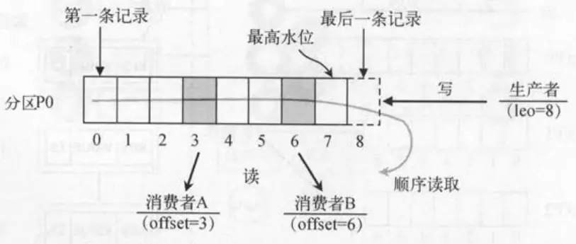
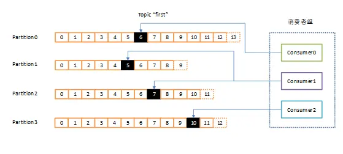

# 消息队列
消息队列可以理解成一个使用队列来通信的组件。本质上就是一个转发器，包含发消息、存消息、消费消息的过程
消息队列的核心就是为了解决系统架构中的三大痛点：解耦、异步、削峰
- **解耦**，也是最核心的作用。将两个绑定在一起的系统分开。在没有MQ时，假设做一个电商系统，系统要干好几件事：扣库存、发优惠券、加积分、还要发短信通知。如果订单系统直接用RPC调用去挨个通知这些子系统，那样代码就会高度耦合。万一有一天不需要发送短信，或者加了一个自动发货的服务，订单系统就得去修改代码。也有可能上述过程中如果某一个服务出错了，可能会连带着整个订单支付流程跟着一起失败。而引入MQ之后，订单系统完成付款，就只需要给MQ发一条消息说用户已经支付成功了。至此订单系统的任务就已经结束了。后续不管有几个子系统关心这件事，就只需要直接去订阅MQ就可以了，哪怕以后新增许多依赖服务，也不需要修改订单系统的代码。达到了物理和逻辑上的解耦，系统容错率极高
- **异步**，对于上述例子来说，如果所有任务串行调用，发短信、加积分等一些非核心流程，哪怕每个接口只用50ms，但是加起来用户在页面等待的时间可能就得大半秒甚至好几秒，体验感很差。而有了MQ之后，主流程就只需要修改状态，然后给MQ发送一条消息，前端就可以立即响应支付成功的界面。像发短信、加积分这种非核心操作，可以让系统在后台顺着MQ慢慢执行，这样主流程的接口响应时间就已经大幅度缩减了
- **削峰**，对于MySQL数据库来说，一秒钟扛个一两千的并发可能没事。但是一旦搞促销、秒杀，瞬间如果有两万个请求打进来，如果直接打到数据库上，绝对会导致数据库宕机。这时候，MQ就可以扮演一个蓄水池或者排队区的作用。这两万个请求瞬间发送过来，可以统一先扔进MQ里暂存，然后后端的订单处理程序根据自己实际能接受的压力，平稳地以一秒钟一两千并发的速度，慢慢从MQ里获取任务来进行执行，把瞬间爆发的流量削峰，分散之后后续慢慢处理。虽然可能会让用户感觉停留几秒钟，但是会比系统直接崩溃更好
**消息队列的缺点**
消息队列的引入，虽然解决了许多问题，但同时也会带来一些问题
- **系统整体的可用性降低**：在没有MQ时，A系统直接调用B系统，只需要保证这两个系统不出问题就行。现在中间加入了一个MQ组件，多了一个中间件，一旦这个寄去宕机、网络故障，就会导致整个业务链路直接瘫痪。所以引入MQ，就得花时间去搭建主从集群，保证MQ的绝对高可用
- **系统的开发复杂性呈指数级上升**：原本一个很简单的方法调用，换成发消息之后，开发人员就会面临无数个异常场景。比如：网络抖动导致一条消息发送了两次，如何保证B系统不会扣两次钱；再比如，MQ自己重启了，还没处理完的消息怎么保证不丢失。这都需要在写代码时加入非常多的确认机制、补偿机制
- **数据一致性问题**：A系统本地业务执行成功了，消息发给MQ了，就告诉前端操作成功。结果下游的B系统拿到这条消息后，由于一条异常没处理好，导致业务失败。就会造成两个系统不一致，A系统以为成功了，但是实际上B系统失败了，两边的数据彻底脱节。为了解决这个问题，就不得不引入相对复杂的分布式事务方案
## 消息重复消费怎么解决
生产端为了保证消息发送成功，可能会重复推进（直到收到成功ACK），会产生重复消息。但是一般的MQ Server框架都会提供一个解决办法，避免存储重复消息（比如：空间换时间，存储已处理过的message_id），给生产端提供一个幂等性的发送消息接口
但是消费端却无法根本解决这个问题，在高并发标准要求下，拉取消息+业务处理+提交消费位移需要做事务处理，另外消费端服务可能宕机，很可能会拉取到重复消息
所以，业务端只能自己做控制，对于已经消费成功的消息，本地数据库表或Redis缓存业务标识，每次处理前需要先进行校验，保证幂等性
## 消息丢失怎么解决
使用消息队列，其实主要就分为三大块：生产者、中间件、消费者，所以就是要保证这三个环节不能丢失消息
- 消息产生阶段：生产者会不会丢消息，取决于生产者对于异常情况的处理是否合理。从消息被生产出来，然后提交给MQ的过程中，只要能正常收到ack确认响应，就表示发送成功，所以只要处理好返回值和异常，如果返回异常则进行消息重发，那么这个阶段是不会出现消息丢失的
- 消息存储阶段：Kafka在使用时是部署一个集群，生产者在发布消息时，队列中间件通常会写多个节点，也就是有多个副本，这样一来，即使其中一个节点挂了，也能保证集群的数据不丢失
- 消息消费阶段：消费者接收消息+消息处理之后，才回复ack的话，那么消息消费阶段的消息就不会丢失。不能收到消息就直接回ack，否则可能消息处理中途挂掉了，消息就丢失了
## 消息队列的可靠性和顺序性怎么保证
消息可靠性可以通过以下方式来保证
- **消息持久化**：确保消息队列能够持久化消息是非常关键的。在系统崩溃、重启或者网络故障等情况下，未处理的消息不应丢失。例如，像RabbitMQ可以通过配置将消息持久化到磁盘，通过将队列和消息都设置为持久化的方式，这样在服务器重启后，消息依然可以被重新读取和处理
- **消息确认机制**：消费者在成功处理消息后，应该向消息队列发送确认。消息队列只有在收到确认后，才会将消息从队列中移出。如果没有收到确认，消息队列可能会在一定时间后重新发送消息给其他消费者或者再次发送给同一个消费者。以Kafka为例，消费者通过commitSync或者commitAsync方法来提交偏移量，从而确认消息的消费
- **消息重试策略**：当消费者处理消息失败时，需要有合理的重试策略。可以设置重试次数和重试间隔时间。例如，在第一次处理失败后，等待一段时间后进行第二次重试，如果重试多次后仍然失败，可以将消息发送到死信队列，以便后续人工排查或者采取其他特殊处理
消息顺序性保证方式如下
- **有序消息处理场景识别**：首先需要明确业务场景中哪些消息是需要保证顺序的。例如，在金融交易系统中，对于同用户的转账操作顺序是不能被打乱的。对于需要顺序处理的消息，要确保消息队列和消费者能够按照特定的顺序进行处理
- **消息队列对顺序性的支持**：部分消息队列本身提供了顺序性保证的功能。比如Kafka可以通过将消息划分到同一个分区来保证消息在分区内是有序的，消费者按照分区顺序读取消息就可以保证消息顺序。但这也可能会限制消息的并行处理程度，需要在顺序性和吞吐量之间进行权衡
- **消费者顺序处理策略**：消费者在处理顺序消息时，应该避免并发处理可能导致顺序打乱的情况。例如，可以通过单线程或者使用线程池对顺序消息进行串行化处理等方式，确保消息按照正常的顺序被消费
## 如何保证幂等性
幂等性是指同一操作的多次执行对系统状态的影响与一次执行结果一致。例如，支付接口若因网络重试被多次调用，最终应确保仅扣款一次，实现幂等写的核心方案
- 唯一标识（幂等键）：客户端为每个请求生成全局唯一ID（如UUID、业务主键），服务端校验该ID是否已经处理，使用场景接口调用，消息消费等
- 数据库事务+乐观锁：通过版本号或状态字段控制并发更新，确保多次更新等同于单次操作，使用场景数据库记录更新（如余额扣减、订单状态变更）
- 数据库唯一约束：利用数据库唯一索引防止重复数据写入，使用场景数据插入场景（如订单创建）
- 分布式锁：通过锁机制保证同一时刻仅有一个请求执行关键操作，适用场景高并发下的资源抢夺（如秒杀）
- 消息去重：消息队列生产者为每条消息生成唯一的消息ID，消费者在处理消息前，先检查该消息ID是否已经处理过，如果已经处理过则丢弃该消息
## 如何处理消息积压问题
消息积压是因为生产者的生产速度大于消费者的消费速度。遇到消息积压问题时，就需要先排查是不是有bug产生了
如果不是bug，就可以优化一下消费逻辑，比如之前是一条一条消息消费处理的话，我们就可以确认是不是可以优化成批量处理消息。如果还是慢，就可以考虑水平扩容，增加Topic的队列数和消费组机器的数量，提升整体的消费能力
## 如何保证数据一致性，事务消息如何实现
一条普通的MQ消息，从产生到消费，大概流程如下
- 生产者产生消息，发送到MQ服务器
- MQ收到消息后，将消息持久化到存储系统
- MQ服务器返回ACK到生产者
- MQ服务器把消息push给消费者
- 消费者消费完消息，响应ACK
- MQ服务器收到ACK，认为消息消费成功，即在存储中删除消息
举个下订单的例子。订单系统创建完订单后，再发送给下游系统。如果订单创建成功，然后消息没有成功发送出去，下游系统就无法感知这件事情，导出数据不一致
为了保证数据一致性，可以使用事务消息，实现步骤如下
- 生产者产生消息，发送一条**半事务消息**给MQ服务器
- MQ收到消息后，将消息持久化到存储系统，这条消息的状态是待发送状态
- MQ服务器返回ACK确认到生产者，此时MQ不会触发消息推送事件
- 生产者执行本地事务
- 如果本地事务执行成功，将commit执行结果发送到MQ服务器；如果执行失败，发送rollback
- 如果是正常的commit，MQ服务器更新消息为可发送；如果是rollback，即删除消息
- 如果消息状态更新为可发送，则MQ服务器会push消息给消费者。消费者消费完就返回ACK
- 如果MQ服务器长时间没有收到生产者的commit或者rollback，它会反查生产者，然后根据查询到的结果执行最终状态
## RabbitMQ和Kafka的区别
Kafka的优缺点
- 优点：首先，Kafka的最大优势在于高吞吐量，在普通机器4CPU 8G的配置下，一台机器可以扛住十几万的QPS。Kafka支持集群部署，如果部分机器宕机不可用，也不会影响Kafka的正常使用
- 缺点：Kafka收到消息后默认是先写入操作系统的Page Cache、由操作系统决定何时刷盘，如果配置`acks=0/1`或开启`unclean.leader.election.enable`等不安全的参数，在主节点宕机时可能丢消息；要获得强可靠性需要配合`acks=all`+多副本ISR+禁止unclean选举。另外Kafka功能相对单一，主要支持收发消息，像延迟消息、事务消息这些高级特性较弱，使用场景偏大数据和日志流
RocketMQ是阿里巴巴开源的消息中间件
- 优点：支持的功能较多，比如延迟队列、事务消息等等，同时吞吐量也很高，单机吞吐量达到了10w级别，支持大规模集群部署，线性扩展方便，同时使用的是Java语言开发，满足了国内绝大部分公司的技术栈
- 缺点：性能比Kafka更弱。Kafka在发送消息给消费者时使用的是`sendfile`真零拷贝（数据完全不经过用户态，由DMA从page cache直接送往网卡），而RocketMQ使用`mmap+write`的方式，严格来说它只是减少了一次CPU拷贝（省去了read系统调用中用户态和内核态之间的拷贝），但从page cache到socket buffer仍有一次CPU拷贝，并不是真正的零拷贝
**如何选择消息队列**
- 如果业务只需要收发消息这种单一类型的需求，而且可以允许小部分数据丢失的可能性，只追求高吞吐量和高性能的话，就可以选择Kafka
- 如果需要通过mq来实现一些业务，比如延迟队列，事务消息等，就可以选择RocketMQ
## RocketMQ延迟队列的实现
broker在接收到延时消息时，会将延时消息存入到延时Topic的队列中，然后ScheduleMessageService中，每个queue对应的定时任务会不停地被执行，检查queue中哪些消息已经到了设定时间，然后转发到原始Topic，这些消息就会被各自的producer消费了
## RocketMQ如何保证事务一致性
RocketMQ是一种最终一致性的分布式事务，消息是最终一致性，而不是像2PC、3PC、TCC那样的强一致性分布式事务
假设A给B转钱，同时它们不是在一个服务上的，就可能会出现四种情况
- A账户余额减100（成功），B账户加100（成功）
- A账户余额减100（失败），B账户加100（失败）
- A账户余额减100（成功），B账户加100（失败）
- A账户余额减100（失败），B账户加100（成功）
对于第1和第2种情况是能够保证事务的一致性的，但是第3和第4种就无法保证事务一致性
假设有A服务和B服务
1. A服务先发送一个Half Message（半消息，指暂不能被Consumer消费的消息。Producer已经成功把消息发送到了Broker端，但此消息被标记为暂不能投递状态，处于该状态下的消息称为半消息。需要Producer对消息进行二次确认后，Consumer才能去消费它）
2. 当A服务知道Half Message发送成功后，那么开始第三步执行本地事务
3. 执行本地事务会有三种情况，执行成功、执行失败、网络原因导致没有响应
	执行成功，Producer向Broker服务器发送Commit，这样B服务就可以消费该Message
	执行失败，那么Producer向Broker服务器发送Rollback，Broker会直接删除上面这条半消息
	如果因为网络原因没有返回成功或是失败，就会执行RocketMQ的回调接口，来进行事务的回查
**如果A账户余额减100（成功），B账户加100（失败），这时候服务B失败怎么办**
如果B最终执行失败，就可以断定是代码有问题才引起的异常，因为RocketMQ有重试机制，如果不是代码问题一般重试几次就能成功
如果是代码原因引起多次重试失败的话，也没有关系将该异常记录下来，可以交由人工处理，之后就可以让事务达到最终一致性
**RocketMQ事务消息不能保证B一定成功，它保证的是A的本地事务与消息的发送是原子性的，B的消费结果，需要依靠重试+幂等+人工兜底来达到最终一致性**
## 如何保证RocketMQ消息顺序
消息的有序性是指消息的消费顺序能够严格保存与消息的发送顺序一致。例如，一个订单产生了3条消息，分别是订单创建、订单付款和订单完成。在消息消费的时候，同一条订单要严格按照这个顺序进行消费，否则业务会发生混乱。同时，不同订单之间的消息又是可以并发消费的，比如可以先执行第三个订单的付款，再执行第二个订单的创建
RocketMQ采用了局部顺序一致性的机制，实现了单个队列中的消息严格有序。也就是说，如果想要保证顺序消费，必须将一组消息发送到同一个队列中，然后再由消费者进行注意消费
RocketMQ推荐的顺序消费解决方案是：按照业务划分不同的队列，然后将需要顺序消费的队列发送到同一队列中即可，不同业务之间的消息仍采用并发消费。这种方式在满足顺序消费的同时提高了消息的处理速度，在一定程度上避免了消息堆积问题
RocketMQ顺序消息的原理是：
- Producer把一批需要保证顺序的消息发送到同一个MessageQueue
- Consumer则通过加锁的机制来保证消息消费的顺序性，Broker端通过对MessageQueue进行加锁，保证同一个MessageQueue只能被同一个Consumer进行消费
## Kafka为什么这么快
- 顺序写入优化：Kafka将消息顺序写入磁盘，减少了磁盘的寻道时间。这种方式比随机写入更高效，因为磁盘读写头在顺序写入时只需要移动一次
- 批量处理技术：Kafka支持批量发送消息，这意味着生产者在发送消息时可以等待直到有足够的数据积累到一定量，然后再发送。这种方法减少了网络开销和磁盘IO操作的次数，从而提高了吞吐量
- 零拷贝技术：Kafka使用零拷贝技术，可以直接将数据从磁盘发送到网络套接字，避免在用户空间和内核空间之间的多次数据拷贝。这大幅度降低了CPU和内存的负载，提高了数据传输效率
- 压缩技术：Kafka支持对消息进行压缩，这不仅减少了网络传输的数据量，还提高了整体的吞吐量
## Kafka的模型
### 消费者模型
消息由生产者发送到Kafka集群后，会被消费者消费。一般来说我们的消费模型有两种，推送模型和拉取模型
**推送模型(push)**
- 基于推送模型的消息系统，有消息代理记录消费者的消费状态
- 消息代理在消息推送到消费者后，标记这条消息已经消费，但这种方式无法很好地保证消费被处理
- 如果要保证消息被处理，消息代理发送完消息后，要设置状态为已发送，只要收到消费者的确认请求后才更新为已消费，这就需要代理中记录所有的消费状态，但显然这种方式不可取
缺点
- push模式很难适应消费速率不同的消费者
- 因为消息发送速率是由broker决定的，push模式的目标是尽可能以最快速度传递消息，但是这样很容易造成consumer来不及处理消息，典型的表现就是拒绝服务以及网络拥塞
**拉取模型(pull)**
Kafka采用拉取模型，由消费者自己记录消费状态，每个消费者互相独立地顺序拉取每个的消息

- 有两个消费者（不同消费者组）拉取同一个topic的消息，消费者A的消费进度是3，消费者B的消费进度是6
- 消费者拉取的最大上限通过最高水位控制，生产者最新写入的消息如果还没有达到备份数量，对消费者是不可见的
- 这种由消费者控制偏移量的优点是：消费者可以按照任意的顺序消费消息。比如，消费者可以重置到旧的偏移量，重新处理之前已经消费过的消息；或者直接跳到最近的位置，从当前的时刻开始消费
### 消费者组
Kafka消费者是以consumer group消费者组的方式工作，由一个或者多个消费者组成一个组，共同消费一个topic。每个分区在同一时间只能由group中的一个消费者读取，但是多个group可以同时消费这个partition

上图中，有一个由三个消费者组成的group，有一个消费者读取主题中的两个分区，另外两个分别读取一个分区。某个消费者消费某个分区，也可以叫做某个消费者是某个分区的拥有者
优点
- 消费者可以通过水平扩展的方式同时读取大量的信息
- 如果一个消费者失败了，那么其他的group成员会自动负载均衡读取之前失败的消费者读取的分区
## Kafka如何保证顺序读取消息
Kafka可以保证在同一个分区内的消息是有效的，生产者写入到同一分区的消息会按照写入顺序追加到分区日志文件中，消费者从分区中读取消息时也会按照这个顺序。这是Kafka天然具备的特性
要在Kafka中保证顺序读取消息，需要结合生产者、消费者的配置以及合适的业务处理逻辑来实现
- 生产者端确保消息顺序：为了保证消息写入同一分区从而确保顺序性，生产者需要将消息发送到指定分区。可以通过自定义分区器来实现，通过为消息指定相同的Key，保证相同Key的消息发送到同一分区
- 消费者端保证顺序消费：消费者在消费消息时，需要单线程消费同一分区的消息，这样才能保证按顺序处理消息。如果使用多线程消费同一分区，就无法保证消息处理的顺序性
Kafka本身不能保证跨分区的消息顺序性，如果需要全局的消息顺序性，通常有两种方法
- 只使用一个分区：将所有消息都写入到一个分区，消费者也只从这个分区消费消息。但这种方式会导致Kafka的并行处理能力下降，因为Kafka的性能优势在于多分区并行处理
- 业务层面保证：在业务代码中对消息进行编号或添加时间戳等标识，消费者在消费消息后，根据这些标识对消息进行排序处理。但这种方式会增加业务代码的复杂度
## Kafka消息积压怎么办
- 增加消费者实例可以提高消息的消费速度，从而缓解积压问题。需要确保消费组中的消费者数量不超过分区数量，因为一个分区同一时间只能被一个消费者消费
- 增加Kafka主题的分区数量可以提高消息的并行处理能力。在创建新分区后，需要重新平衡消费者组，让更多的消费者可以同时消费消息
## Kafka为什么一个分区只能由一个消费者消费
如果两个消费者消费同一个分区，那么就意味着两个消费者同时读取分区的消息，由于消费者自己可以控制读取消息的offset，就有可能C1才读到2，而C1读到1，C1的消息还没处理完，C2就已经读到3了，则会造成很多浪费，因为这就相当于多线程读取同一个消息，会造成消息处理的重复，且不能保证消息的顺序
## 消息中间件如何做到高可用
- **打破单点，采用集群和多副本机制**。单机总有罢工的时候，所以就需要使用集群。但是光有集群也不够，如果一条消息只存在A机器上，A机器一断电，消息还是没办法消费。所以核心在于数据要有分身，也就是要有主从或者副本。当生产者把消息发给主节点后，系统在后台将这条消息复制到从节点上。如果是异步复制，主节点收到消息告诉开发者成功了，然后再慢慢同步给从节点，这样速度最快，但如果主节点突然宕机，没来得及同步的数据就丢了。如果是同步复制，主节点必须等到从节点也写进磁盘了，才告诉开发者成功。这样及其安全，但是性能会受到影响
- **故障转移机制**。比如，即使从节点有了完整的数据，但如果主节点宕机了，从节点不知道自己该转正，系统也会瘫痪。所以，MQ必须有一个消息通知机制（例如Zookeeper）。它们底层跑着一套类似Raft的选举算法，一旦发现主节点宕机，就会发起投票，在剩下的从节点中选举一个数据最全，最健康的从节点，将其变为主节点，接管写入请求。这个过程往往在秒级甚至毫秒级完成，业务层大多数时候感觉不到
- **动态路由感知机制**。现在我们的MQ服务端已经能在宕机时自动切换了，那写代码的生产者和消费者怎么知道该连哪台新机器。这时候就需要类似RocketMQ的NameServer或者Kafka的高可用客户端出场了。这些协调组件时刻盯着Broker的举动，一旦发生了故障转移，它们会迅速把新的路由表下发给业务端的代码，业务代码拿到了最新的地址，就能瞬间调整方向，继续给正常存活的节点发消息
## Kafka和RocketMQ的消息确认机制有什么不同
消息确认机制可以分为生产者发消息的确认和消费者消费后的确认
- 先看生产者端的确认机制
	Kafka是基于副本的acks机制。它给开发者留了三个选项：`acks=0`（发出去就不管了）、`acks=1`（只要Leader节点存下来就返回成功）、`acks=all/-1`（必须等所有同步副本ISR都存下来才算成功）。它的核心设计思路是围绕着分布式集群的副本同步机制来确保存储可靠性的
	RocketMQ的侧重点有点不一样，它更关注单机层面和主从架构上的物理落盘。它的确认机制主要依赖于你的集群配置：是同步刷盘还是异步刷盘？是同步复制还是异步复制？相对于Kafka，RocketMQ在业务上往往会配置成同步双写，也就是追求物理级别的不丢消息
- 消费者端的确认机制
	Kafka的消费者确认，叫做提交偏移量。简单说，Kafka的队列就像一本书，消费者端消费就像在看书，每次告诉Kafka的是我已经消费到多少条消息了。但这就会带来一个问题：如果是批量消费，第99条消息处理失败了，第100条消息成功了。你要是提交了第100条消息，第99条消息就会被跳过丢失了；但要是不提交第100条消息成功，后续又需要重新消费一次消息。Kafka原生没有很好地提供单条消息级别的失败重试机制，通常需要我们自己在业务代码里取捕获异常处理
	RabbitMQ的消费者确认，是非常贴合业务逻辑的。它虽然底层也有进度，但是在代码层面，要求消费者针对每一条/每一批消息明确返回状态：要么是`CONSUME_SUCCESS`（消费成功），要么是`RECONSUME_LATER`（稍后重试）。绝妙的地方在于，如果你返回了失败或者抛了异常，RocketMQ不会卡在那里，它会自动把这条消息塞进一个内置的重试队列里，并且有一套阶梯式的延迟等待时间（指数回避）；如果重试了十几次都不行，就会把这条消息放进**死信队列**里，方便人工排查
## Kafka和RocketMQ的broker架构有什么不同
在Broker的核心架构设计上，它们最大的区别主要集中在**文件存储模型、协调机制以及高可用粒度**三个方面
**文件存储模型，也是最核心的区别**
- Kafka的Broker采用的是**独立的分区文件设计**。打个比方，Kafka就像是给每个具体的业务单独准备了一个小本子。业务A的消息写进A的本子，业务B的消息写进B的本子。当主题比较少的时候，这种设计速度极快，是非常纯粹的磁盘顺序写。但问题是，在电商微服务场景下，可能成千上万个系统都在使用MQ，如果产生了成千上万个主题，Kafka的Broker底层就会有上万个文件同时写入。原本的顺序写就瞬间退化成了磁盘随机写，性能暴跌，机器卡死
- RocketMQ的Broker则是**大一统的混合存储设计**。阿里就是为了解决上面说的海量Topic导致性能下降的问题，设计了著名的CommitLog + ConsumeQueue架构。不管有多少个主题，所有的消息来到Broker后，全部顺序追加写到一个公共的、巨大的日志文件里（就是CommitLog）。这就保证了无论Topic数量怎么暴增，写入永远是极致的磁盘顺序写。Broker后台会有一波专门的线程，实时把大文件里的消息位置挑出来，整理成一本本轻量级的目录（就是ConsumeQueue）。消费者顺着目录去大文件里掏数据即可
**协调机制不同**
- Kafka早期极其依赖外部组件Zookeeper，新版已经完全换成了内置的KRaft。Kafka的Broker是个纯粹的打工人，它把元数据管理、集群选主这种极其复杂的脑力劳动全交给了Zookeeper（或者说KRaft控制器节点）。节点一多，心跳保活和数据同步的开销是非常大的。现在新部署的Kafka集群已经完全不依赖于Zookeeper了
- RocketMQ的Broker搭配的是及其轻量的NameServer。是阿里觉得Zookeeper太重，很容易在网络风暴中崩溃，因此自己写了一个NameServer。NameServer节点之间甚至都是互相不通信的，全靠底下的Broker主动给所有NameServer进行多头汇报。这种设计让挂掉任何一个NameServer都不影响大局，Broker架构变得异常简单稳定
**高可用粒度不同**
- Kafka的高可用是Partition分区级别的。一台Broker宕机了，Kafka是在底层成百上千个小本子(Partition)里，一个个去重新选举新的Leader，这需要耗费一定的时间
- RocketMQ的高可用是Broker服务器节点级别的。它更偏向于传统数据库的主从模式。Master挂了，消费者就直接无缝切换去读Slave。相对来说，管理层级更高，机制也更偏向于物理机器层面的容灾
## RabbitMQ和AMQP
**AMQP是一套理论标准，而RabbitMQ是这套标准的具体落地实现**。类似于接口和实现类的关系
首先，AMQP是图纸。AMQP的全名叫高级消息队列协议。它是一个协议，本身不是一个可以直接安装运行的软件。它就像一份详细的交通规则或者建筑图纸，规定了一套理想的消息队列系统该长什么样。比如，协议里定义了：消息发出来之后不能直接进队列，中间得有个东西叫交换机，还得有路由键来指明消息去哪。它只管定规矩，不负责写代码
RabbitMQ就是图纸的实现。RabbitMQ使用并发性能极高的Erlang语言，完美地照着AMQP协议标准，写出来RabbitMQ。受AMQP影响，我们在用RabbitMQ的时候，生产者发的消息实际上是先发给了交换机，交换机就像一个拥有极其丰富经验的邮局分拣员，它可以根据我们配置的各种规则，把一条消息精准地分发给不同的目标队列。
## RabbitMQ的核心组件
RabbitMQ的核心组件，都是消息从发出到消费必不可少的部分
- 首先是生产者，他是发送消息的一方，比如我们的业务服务，负责把需要异步处理的消息，交给RabbitMQ，不会直接去找消费者
- 然后是消费者，它是监听并处理消息的一方，一直盯着队列，一旦队列有新消息，就会取出来执行业务逻辑
- 接下来是队列，这是RabbitMQ真正存储消息的地方，采用先进先出的机制，消息会一直存在这里，直到被消费者取走，是整个消息队列的核心
- 然后是交换机，生产者不会直接把消息发给消息队列，而是先发给交换机，它相当于一个消息分发器，会按照我们设定的规则，把消息路由到对应的队列里
- 还有路由键和绑定，绑定是吧交换机和队列关联起来的纽带，路由键则是生产者发生消息时带的标识，交换机会根据路由键绑定的规则，判断消息该投到哪个队列
- 最后是连接和信道，连接是客户端和RabbitMQ之间的TCP长连接，而信道是建立在连接之上的轻量级信道，因为TCP连接创建销毁开销很大，所以用多个信道来传输消息，能大大节省资源
## RabbitMQ有哪几种交换机类型
RabbitMQ一共有四种核心的交换机，分别是直连、扇形、主题、头交换机
- 直连交换机，精准匹配的模式，消息会根据路由键完全一致，才转发到对应的队列。比如路由键设成`user.login`，就只会发给绑定了这个exact键的队列，适合一对一、精准投递的场景
- 扇形交换机，广播模式，完全不看路由键，只要队列绑定了这个交换机，所有消息都会发给所有队列。适合群发通知、多服务同步更新场景，效率高
- 主题交换机，支持路由键模糊匹配，使用`*`匹配一个单词、`#`匹配多个或0个单词，是最灵活的一种。比如用`order.#`，就能匹配`order.create`、`order.pay`所有以order开头的路由键，适合按业务主题分类、批量路由的场景
- 头交换机，它不看路由键，而是根据消息头里的键值对来匹配，但是性能比较差
## RabbitMQ的特性
RabbitMQ以可靠性、灵活性和易扩展性为核心优势，适合需要稳定消息传递的复杂系统。其丰富的插件和协议支持使其在微服务、IoT、金融等领域广泛应用，比较核心的特性如下：
- **持久化机制**：RabbitMQ支持消息、队列和交换器的持久化。当启用持久化时，消息会被写入磁盘，即使RabbitMQ服务器重启，消息也不会丢失。例如，在声明队列时可以设置`durable`参数为`true`来实现队列的持久化
- **消息确认机制**：提供了生产者确认和消费者确认机制。生产者可以设置`confirm`模式，当消息成功到达RabbitMQ服务器时，会收到确认消息；消费者在处理完消息后，可以向RabbitMQ发送确认信号，告知服务器该消息已经被成功处理，服务器才会将消息从队列中删除
- **镜像队列**：支持创建镜像队列，将队列的内容复制到多个节点上，提高消息的可用性和可靠性。当一个节点出现故障时，其他节点仍然可以提供服务，确保消息不会丢失
- **多种交换器类型**：RabbitMQ提供了多种类型的交换器，比如直连交换器、扇形交换器、主题交换器和头部交换器。不同类型的交换器根据不同的规则将消息路由到队列中。例如，扇形交换器会将接收到的消息广播到所有绑定的队列中；主题交换器则根据消息的路由键和绑定键匹配规则进行路由
## RabbitMQ的底层架构
- **核心组件**：生产者负责发送消息到RabbitMQ、消费者负责从RabbitMQ接收并处理消息、RabbitMQ本身负责存储和转发消息
- **交换机**：交换机接收来自生产者的消息，并根据routing key和绑定规则将消息路由到一个或多个队列
- **持久化**：RabbitMQ支持消息的持久化，可以将消息保存在磁盘上，以确保RabbitMQ重启后消息不会丢失，队列也可以设置为持久化，以确保其结构在重启后不会丢失
- **确认机制**：为了确保消息可靠送达，RabbitMQ使用确认机制，消费者在处理完消息后发送确认给RabbitMQ，未确认的消息会重新入队
- **高可用性**：RabbitMQ提供了集群模式，可以将多个RabbitMQ实例组成一个集群，以提高可用性和负载均衡。通过镜像队列，可以在多个节点上复制同一个队列的内容，以防止单点故障
## RabbitMQ的可靠性怎么保障
RabbitMQ的可靠性保障核心是确保消息不丢失、不重复、不积压，这需要从生产者、RabbitMQ服务器、消费者三个环节来保障
首先是生产者，**要保证消息能成功投递到交换机**。这需要开启生产者确认机制，一旦消息被交换机接收，RabbitMQ会返回确认通知，若投递失败（比如交换机不存在），生产者能及时重试；同时建议开启事务机制，但事务会影响吞吐量，所以大部分场景下用确认机制更适合。另外，生产者要处理网络异常、连接中断等问题，比如设置合理的重试次数和间隔，避免因临时故障导致消息丢失
RabbitMQ服务器环节，**要防止消息在服务器端丢失**。就需要给队列和消息都设置持久化：队列持久化能保证RabbitMQ重启后队列不消失，消息持久化则能保证消息在服务器重启后不丢失（通过将消息写入磁盘实现）。同时，要合理设置交换机和队列的绑定关系，避免因绑定错误导致消息无法路由到队列。另外，服务器要做好集群部署和数据备份，比如主从复制、镜像队列，防止单点故障导致消息丢失
消费者环节，**保证消息能被正确处理且不重复消费**。消费者需要开启手动确认模式，只有当消息被成功处理后，才手动发送ack通知RabbitMQ删除消息；若处理失败。则不发送ack，RabbitMQ会将消息重新入队，等待后续重试。同时，要处理消息重复消费的问题，这就需要在业务层面做幂等性处理，比如给消息设置唯一ID，消费时先查询该ID是否已经处理，若已经处理则直接忽略，避免重复执行业务逻辑。另外，消费者要控制消费速度，避免因消费过慢导致消息积压，可以通过限流机制来平衡消费能力和消息堆积问题
## RabbitMQ的延迟队列和死信机制
- 延迟队列的核心就是让消息不是发出去就直接被消费，而是等指定时间后才让消费者处理。比如，电商里订单创建30分钟后没支付就要自动取消，就不需要搞个定时任务一直查询数据库，可以直接使用延迟队列。生产者发送消息时，给消息设置一个延迟时间，这个消息会先到一个专门的延迟交换机，交换机不会马上转发，而是等够了设置的时间，再把消息转到真正的业务队列，消费者监听这个业务队列，到点就收到消息执行取消订单的逻辑
- 死信机制就是将那些没有正常处理的消息，对其进行一个兜底，不让它们一直在业务队列中占用资源。**比如消费者处理消息时出现了问题，明确拒绝接收该消息，并且不让它回到原队列；或者消息放在队列太久导致过期；还有就是队列满了，新消息进不来，最老的那些消息就会被挤成死信。** 这时候我们可以给业务队列提前配置好死信交换机和对应的死信队列，一旦有消息变成死信，RabbitMQ就会自动把它转到死信队列里，之后我们可以专门监听死信队列，要么记录日志找问题，要么人工处理，或者设置重试机制，不会让问题消息不被处理