# MySQL
MySQL的架构共分为两层，Server层和存储引擎层
**Server层**：Server层负责建立连接、分析和执行SQL。MySQL大多数的核心功能都在Server层实现
**存储引擎层**：存储引擎层负责数据的存储和提取                                                          
## SQL
SQL语句主要有以下几大类：
1. DDL：数据定义语言，用来定义数据库对象
2. DML：数据操作语言，用来对数据库表中的数据进行增删改
3. DQL：数据查询语言，用来查询数据库表中的记录
4. DCL：数据控制语言，用来创建数据库用户，控制数据库的访问权限
### 聚合函数
聚合函数是将一列数据做为一个整体，进行纵向计算（null值不会参与聚合函数的运算）
常见的聚合函数有：count、max、min、avg、sum
#### 分组查询
**where和having的区别**：where是分组之前进行过滤，不满足where条件的不参与分组，having是分组之后对结果进行过滤；where不能对聚合函数进行判断，而having可以
```mysql
# 查询年龄小于45岁的员工，并根据工作地址分组，获取员工数量大于等于3的工作地址
select workaddress,count(*) address_count from emp where age < 45 group by workaddress having address_count >= 3;
```
### 多表查询
#### 内连接
内连接只包含A、B两张表的交集部分
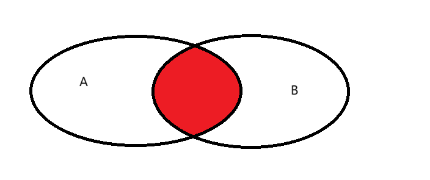
#### 左外连接
左外连接包含了左表的所有数据以及两表之间的交集的数据
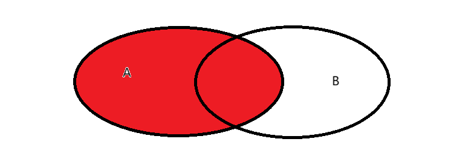
#### 右外连接
右外连接包含了右表的所有数据以及两表之间的交集的数据
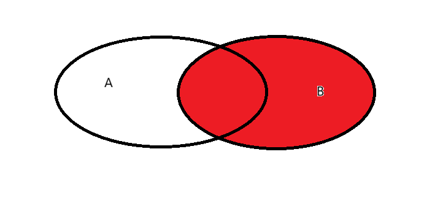
## 事务
事务是一组操作的集合，是一个不可分割的工作单位，事务会把所有的操作作为一个整体一起向系统提交货撤销操作请求，即这些操作要么同时成功，要么同时失败
### 四大特性(ACID)
**A(Atomicity)**：原子性，事务是原子的，其中的操作要么同时成功，要么同时失败
**C(Consistency)**：一致性，事务完成时，所有的数据保持一致的状态
**I(Isolation)**：隔离性，事务与事务之间是隔离的，互不影响
**D(Durability)**：持久性，事务一旦提交或回滚，数据就会持久化到磁盘中，数据是持久的
### 并发事务问题
**脏读**：一个事务读到另一个事务还没有提交的数据
假设A和B两个事务同时进行，事务A先从数据库中读取了用户的余额并进行了更新操作，此时事务A还没有提交，然后事务B也从数据库中读取用户的余额，那么事务B读取到的余额就是事务A更新后的数据，**如果事务B读取完数据之后，事务A发生了回滚，事务B得到的数据就是错误的数据**
**不可重复读**：一个事务先后读取同一条数据，但是两次读取到的数据不同
假设A和B两个事务同时进行，事务A先读取了用户余额，如果此时事务B更新了这条数据，并提交了事务。当事务A再次读取这条数据是，前后两次读取的数据不一样
**幻读**：一个事物按照条件查询数据时，没有对应的数据行，但是在插入数据时，又发现这行数据已经存在
假设A和B两个事务同时进行，事务A先使用条件查询查出了100条数据，然后事务B使用同样的条件查出了100条数据，之后事务A插入了一条满足条件的数据，并提交了事务。之后事务B再次条件查询，就会查出101条数据，与前一次读到的记录数不同
#### 事务隔离级别
**读未提交**：事务可以读取其他事务未提交的修改
**读已提交**：只能读取其他事务已提交的修改，解决了脏读问题
**可重复读**：事务开始时创建快照，整个事务读取同一份快照数据。MySQL数据库默认的隔离级别，解决了不可重复读问题
**串行化**：所有事务串行执行，解决了所有并发事务问题
MySQL的InnoDB引擎默认使用的事务隔离级别是可重复读，它很大程度上避免了幻读现象，解决方案有以下两种
1. 针对快照读（普通select语句），是通过MVCC方式解决了幻读，因为可重复读隔离级别下，事务执行过程中看到的数据，跟这个事务启动时看到的数据一直是一致的，即便中途有其他事务插入了一条数据，也无法被当前事务查询到
2. 针对当前读（select ... for update），是通过next-key lock（记录锁+间隙锁）方式解决了幻读，因为在执行select ... for update语句时，会加上next-key lock，如果有其他事务在next-key lock锁范围内插入了一条数据，那么这个插入语句就会被阻塞，无法成功插入
#### Read View
Read View是InnoDB引擎在可重复读(RR)和读已提交(RC)隔离级别下，实现MVCC的核心组件，本质上就是一个数据快照，对于RR和RC，其区别就只是生成Read View的时机不同
RC是在启动事务的时候就生成一个Read View，然后整个事务期间都只使用这一个Read View
RR是在每个语句执行前都会重新生成一个Read View
Read View中有四个重要字段
- m_ids：指的是在创建Read View时，当前数据库中活跃事务的事务id列表（活跃事务指的是启动了但还没有提交的事务）
- min_trx_id：指的是在创建Read View时，当前数据库中活跃事务中事务id最小的事务，也就是m_ids的最小值
- max_trx_id：指的是创建Read View时，当前数据库中应该给下一个事务的id值，也就是全局事务中最大的事务id值+1
- creator_trx_id：指的是创建改Read View的事务的事务id
对于使用InnoDB存储引擎的表，其聚簇索引记录中都包含以下两个隐藏列
- trx_id：当一个事物对某条聚簇索引记录进行改动时，就会把该事务的事务id记录在trx_id隐藏列里
- roll_pointer：每次对某条聚簇索引记录进行改动时，都会把旧版本的记录写入到undo日志中，然后这个隐藏列是一个指针，指向每一个旧版本记录
#### MVCC
当一个事务取访问记录时，有以下几种情况
1. 如果记录的trx_id小于Read View中的min_trx_id，表示这个版本的记录是在创建Read View前已经提交的事务生成的，所以该版本的记录对当前事务可见
2. 如果记录的trx_id大于等于Read View中的max_trx_id，表示这个版本的记录是在创建Read View后才启动的事务生成的，这个版本的记录对当前事务不可见
3. 如果记录的trx_id值在min_trx_id和max_trx_id之间，需要判断trx_id是否在m_ids列表中
	如果trx_id在m_ids列表中，表示生成该版本记录的活跃事务依然活跃着，所以该版本的记录对当前事务不可见
	如果trx_id不在m_ids列表中，表示生成该版本记录的活跃事务已经提交，所以该版本的记录对当前事务可见
这种通过版本链来控制并发事务访问同一个记录时的行为就叫做MVCC（多版本并发控制）
#### 可重复读
可重复读隔离级别是在启动事务时生成一个Read View，然后整个事务期间都是用这个Read View
假设启动了事务A（trx_id为51）和事务B（trx_id为52）
- 在事务A的Read View中，trx_id是51，由于启动时只有事务A是活跃的，所以m_ids是51，min_trx_id也是51，max_trx_id是52
- 在事务B的Read View中，trx_id是52，由于事务B启动时，事务A也是活跃的，所以m_ids是51,52，min_trx_id是51，max_trx_id是53
然后在可重复读的隔离级别下，事务A和事务B按顺序执行了以下操作
- 事务B读取了用户的账户余额，读取到的余额是100万
- 事务A将用户的账户余额修改成200万，没有提交事务
- 事务B读取到用户的账户余额，还是100万
- 事务A提交事务
- 事务B读取到用户的账户余额，依旧是100万
事务B在第一次读取用户的账户余额，在找到记录后，会先看这条记录的trx_id，发现trx_id是50，比事务B的Read View中的min_trx_id还更小，这就意味着这条记录是在创建Read View之前就已经提交过了，所以这个版本的记录对事务B是可见的，因此事务B可以读取到这条记录
接着事务A通过update语句对这个记录进行了修改，并且没有提交事务，将用户的余额改成200万，并且MySQL会记录相应的undolog，并以链表的形式串联起来，形成版本链
然后事务B第二次去读取用户余额，发现这条记录的trx_id是51，在事务B的Read View的min_trx_id和max_trx_id之间，且在m_ids里面，这说明事务A修改了数据，但是还没有提交事务，因此事务B并不能读取到当前版本的数据，而是根据undolog链找到旧版本的记录，并读取满足条件的旧记录，也就是trx_id为50的记录
最后，事务A提交事务后，由于隔离级别是可重复读，所以事务B再次读取记录时，还是根据启动事务创建的Read View来判断当前记录是否可见，所以，即使事务A修改了用户余额并且提交事务，事务B依旧无法读取到修改后的数据
#### 读已提交
这个隔离级别是在每次读取数据后，都会生成一个新的Read View
这就意味着，事务期间多次读取同一条数据，前后两次读取的数据可能会出现不一致，因为同一时间内，其他的事务修改了这条数据，并提交了事务
依旧假设事务A（trx_id为51）和事务B（trx_id为52）
- 事务B读取数据（创建一个Read View），用户余额为100万
- 事务A将用户余额修改为200万，并且没有提交事务
- 事务B读取数据（创建新的Read View），用户余额为100万
- 事务A提交数据
- 事务B读取数据（创建新的Read View），用户余额为200万
事务B在第一次和第二次读取数据时，由于此时事务A处于活跃状态，因此Read View中的min_trx_id都是51，事务A修改数据后，记录的trx_id变成51，然后事务B第二次读取记录，记录的trx_id在min_trx_id和max_trx_id之间，且在m_ids中，也就说明此时这条记录对事务B是不可见的，所以要找到旧版本的数据并读取
事务B第三次读取数据时，此时事务A依旧提交，因此Read View中的min_trx_id就变成了52，再次读取记录，记录的trx_id是51，小于事务B Read View中的min_trx_id，就意味着这条记录在创建Read View之前就已经被提交了，也就说明此时这条记录对事务B是可见的
## 存储引擎
MySQL存储引擎是MySQL数据库的核心组件，它决定了数据如何存储、索引和事务处理等底层操作。MySQL采用插件式存储引擎架构，允许用户根据应用需求选择合适的引擎。
存储引擎是基于表的，不是基于库的，建表时如果没有指定存储引擎，则默认为InnoDB
**InnoDB**
InnoDB是MySQL默认的事务型存储引擎，是一种兼顾高可靠性和高性能的通用存储引擎
**特点**：支持ACID事务模型；行级锁，提高并发性能；多版本并发控制；聚簇索引
**MyISAM**
MyISAM是MySQL早期的默认存储引擎，以简单高效著称，特别适合读密集型应用
**特点**：不支持事务，不支持外键；支持表锁，不支持行锁；访问速度快
**Memory**
Memory引擎的表数据是存储在内存中的，提供了极快的访问速度，适用于临时数据、缓存、会话存储等场景
**特点**：内存存放；Hash索引
### 存储结构
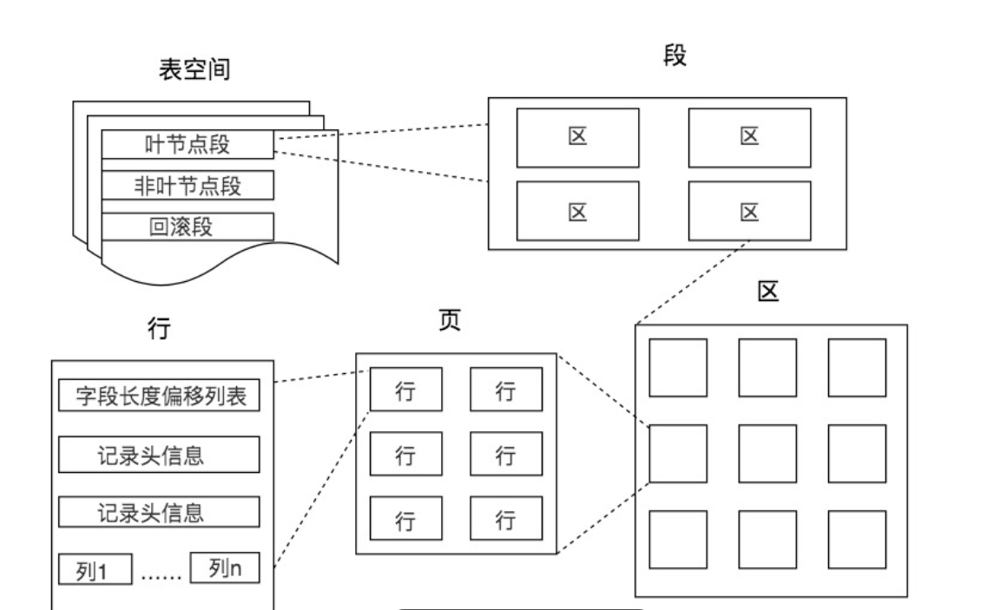
表空间由段、区、页、行构成
1. 行
	数据库表中的记录都是按行进行存放的，每行记录根据不同的行格式，有不同的存储结构
2. 页
	记录是按照行来存储的，但是**数据库的数据读取是以页为单位来读写的**，也就是说，当需要读取一条记录的时候，是以页为单位，将整页读入内存当中
	每页默认大小为16KB
	页是InnoDB存储引擎磁盘管理的最小单元，意味着数据库每次读写都是以16KB为单位的，一次最少可以从磁盘中读取16K的内容到内存中，一次最少把内存中的16K内容刷新到磁盘中
3. 区
	InnoDB存储引擎是以B+树来组织数据的
	B+树中每一层都是通过双向链表连接起来的，如果是以页为单位来分配存储空间，那么链表中相邻的两个页之间的物理位置并不是连续的，可能会离得分长远，那么磁盘查询是就会有大量的随机IO，会降低性能
	解决：
	**在表中数据量大的时候，为某个索引分配空间的时候就不按照页为单位分配了，而是按照区为单位分配。每个区的大小为1MB，对于16KB的页来说，就会分配连续的64个页到一起，物理存储位置就更相邻，就可以顺序IO了**
4. 段
	表空间是由各个段组成，段分为数据段，索引段和回滚段
	- 索引段：存放B+树的非叶子节点的区的集合
	- 数据段：存放B+树的叶子节点的区的集合
	- 回滚段：存放的是回滚数据的区的集合
### 数据存储位置
在MySQL中，我们可以通过以下命令来查看数据库的文件存放在哪个目录
```java
SHOW VARIABLES LIKE 'datadir';
```
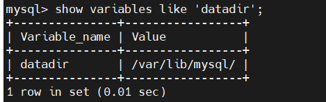
我们每创建一个数据库，就会在该目录下创建一个以该数据库为名的目录，然后在目录下保存表结构和表数据文件
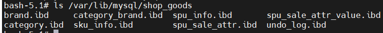
在MySQL5.7之前，此目录下，我们可以看到三种文件
**.opt文件**：用来存储当前数据库的默认字符集和字符校验规则
**.frm文件**：表结构会存储在这个文件中，在数据库中每建一张表，都会生成一个对应的.frm文件，该文件用于存储每个表的元数据信息，主要包含表结构定义
**.ibd文件**：表数据会存储在这个文件(ibdata1)，表数据可以存储在共享表空间中，也可以存放在独占表空间文件(表名.ibd)。
在MySQL8.0+，表结构定义和.opt文件都存储在数据字典中
#### InnoDB行格式
行格式，就是一条记录的存储结构，有以下四种
- **Redundant**：这是MySQL5.0版本之前使用的格式，现在几乎没人使用
- **Compact**：由于Redundant是一种不紧凑的行格式，因此在MySQL5.0之后引入了Compact存储方式，Compact是紧凑的行格式，可以让一个数据页中存放更多的行记录，MySQL5.1之后，行格式默认设置成Compact
- **Dynamic和Compressed**：这两个都是紧凑的行格式，与Compact差不多，都是基于Compact上改进一些东西，从MySQL5.7版本之后，默认使用Dynamic行格式
##### Compact格式

从上图中可以看到，一条完整的记录分为 记录的额外信息和记录的真实数据 两部分
**记录的额外信息**
记录的额外信息包含三个部分
1. **变长字段长度列表**：由于varchar是变长的，因此变长字段实际存储的数据的长度不固定，所以在存储数据的时候，要把数据占用的大小存起来，存到**变长字段长度列表**中去，读取数据的时候也需要根据这个字段去读取对应长度的数据
	变长字段的真实数据占用的字节数会按照列的顺序必须存放，例如有一行记录，name的值为a，phone的值为123，变长字段长度列表的内容就是03 01，**如果变长字段为null，就不会保存在行格式中记录的真实数据部分里面**
	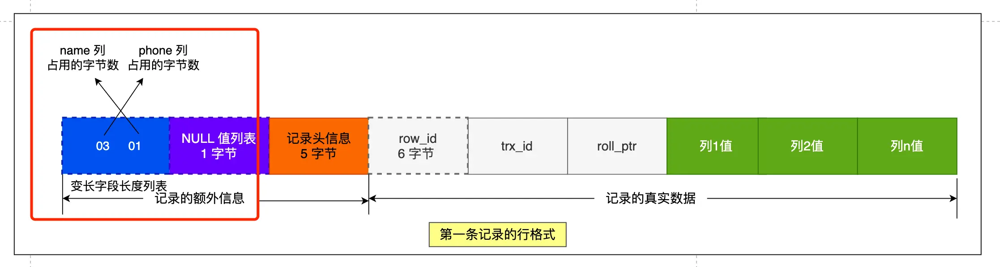
	**tips**：为什么变长字段长度列表的信息要按照逆序存放
	主要是因为，记录头信息中指向下一个记录的指针，指向的是下一条记录的记录头信息和真实数据之间的位置，这样的好处是向左读就是记录头信息，向右读就是真实数据，读取时比较方便
	因此，变长字段长度列表逆序存放，就可以使得位置靠前的记录的真实数据和数据对应的字段长度信息可以同时在一个CPU Cache Line中，就可以提高CPU Cache（具体解释跳转  ）的命中率
	且变长字段长度列表并不是必须的，如果数据表中没有出现变长字段的时候，行格式里就不会存在变长字段长度列表了
2. **NULL值列表**
	表中某些列可能会存储NULL值，如果把这些NULL值都放到记录的真实数据中会比较浪费空间，因此Compact格式把这些NULL值存储到NULL值列表中
	如果存在允许NULL值的列，则每个列对应一个bit，二进制位按照列的顺序逆序排列，bit为1时，代表该列的值为NULL，为0时则表示该列的值不为NULL
	另外，NULL值列表必须用整数个字节的位表示，如果使用的二进制位个数不足整数个字节，则在字节的高位补0
	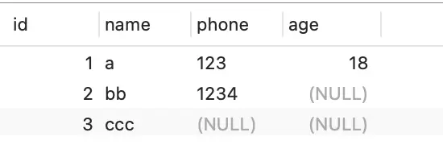
	对于上面这张表的三条数据来看，第一条记录所有列都有值，不存在NULL值，但是由于只有三列，不足8位（1个字节），因此要在高位补0
	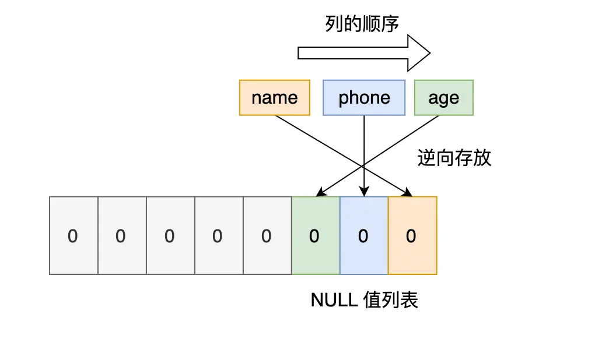
	对于第一条数据，NULL值列表用十六进制表示是0x00
	对于第二条记录，只有age列是NULL值，所以十六进制表示是0x04
	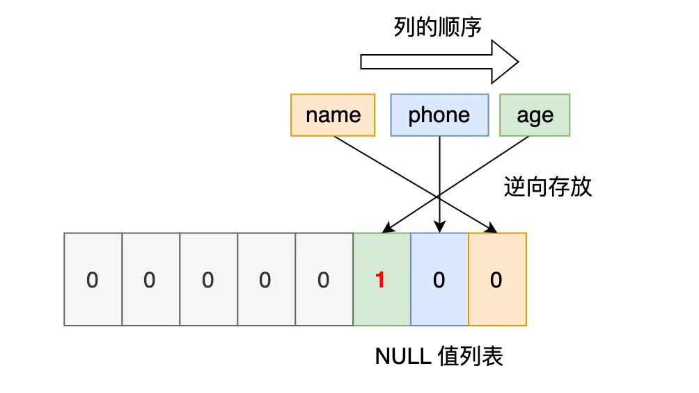
	同时，NULL值列表也不是必须的，当表的字段都定义成NOT NULL时，这时候表的行格式里就不会有NULL值列表了，因此在设计数据库表时，通常都建议将字段设置为NOT NULL，这样可以至少节省1B的空间
3. **记录头信息**
	记录头信息中内容包含很多，列举以下几个比较重要的
	- delete_mask：表示此条数据是否被删除，因此在我们执行delete删除记录时，并不会真正的删除记录，只是将delete_mask标记为1
	- next_record：下一条记录的位置，记录与记录之间是通过链表组织的，指向的是下一条记录的记录头信息和真实数据之间的位置
	- record_type：表示当前记录的类型，0表示普通记录，1表示B+树非叶子节点记录，2表示最小记录，3表示最大记录
**记录的真实数据**
记录的真实数据中除了我们定义的字段，还有row_id、trx_id、roll_pointer
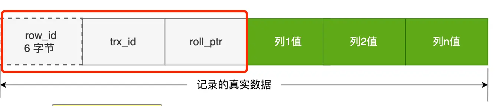
- row_id：在我们建表时，如果没有指定主键或者定义唯一约束，InnoDB就会添加一个row_id的隐藏字段作为表的主键，row_id不是必须的，占用6个字节
- trx_id：事务id，记录数据是由哪个事务生成的，trx_id是必须的，占用6个字节
- roll_pointer：记录上一个版本的指针（具体解释跳转  ），roll_pointer是必须的，占用7个字节
##### varchar(n)中n最大取值为多少
在MySQL中，除了TEXT、BLOBs这种大对象之外，其他所有列占用的字节长度加起来不能超过65535个字节，**即一行记录除了TEXT、BLOBs这种类型的列，其他列加起来的长度不能超过65535字节**
而对于varchar(n)字段类型的数据，n代表的是最多存储的字符数量，并不是字节大小
要算varchar(n)最大能允许存储的字节数，还得看数据库表的字符集，因为字符集代表一个字符占用了多少个字节
```mysql
CREATE TABLE test_table (
 name varchar(65535) NULL
) CHARACTER SET = ASCII
```
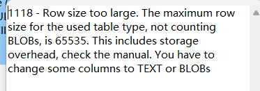
从上述报错中，可以知道数据最大是65535，但是其中包含了storage overhead
**storage overhead**：即**变长字段长度列表**和**NULL值列表**所占用的字节数，所以在算n的最大值时，还需要减去storage overhead占用的字节数
1. 在上述的test_table表中，由于允许了name字段为NULL，因此会使用1字节来表示NULL值列表
2. 对于变长字段长度列表，如果变长字段允许存储的最大字节数小于255字节，就会用1字节来表示变长字段长度列表，如果大于255字节，就会用2字节来表示变长字段长度列表，因此对于test_table，就需要使用2字节来表示变长字段长度列表
所以对于ascii字符集，varchar(n)中n的最大值=65535 - 1(NULL值列表) - 2(变长字段长度列表) = 65532
而对于utf-8字符集，一个字符最多需要三个字节，因此n的最大值=65532/3=21844
**多字段情况**
如果有多个字段的话，要保证所有字段的长度 + 变长字段长度列表占用的字节数 + NULL值列表所占用的字节数 <= 65535
#### 行溢出
MySQL中磁盘和内存交互的基本单位是页，一个页的大小为16KB，即16384字节，而一个varchar(n)类型的列最多可以存储65535个字节，这时候一个页可能就存储不了一条记录，就会发生行溢出，多的数据就会存到另外的**溢出页**中
对于Compact行格式，当发生行溢出时，记录的真实数据中就只会保存该列的一部分数据，把剩余的数据放在溢出页中，然后真实数据处用20字节存储指向溢出页的地址，从而可以找到剩余数据所在的页
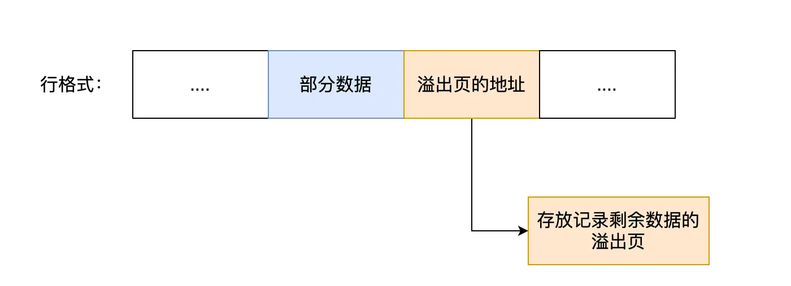
而对于Compressed和Dynamic这两个行格式，发生行溢出时，记录的真实数据处不会存储该列的一部分数据，只存储20字节的指针指向溢出页，实际的数据全都存储在溢出页中
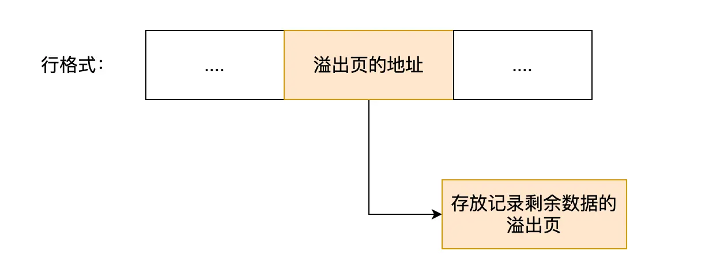
## 索引
索引是帮助MySQL高效获取数据的数据结构，类似于数据的目录
**优点**：提高数据的检索效率，降低数据库的IO成本；通过索引列对数据进行排序，降低数据排序的成本，降低CPU的消耗
**缺点**：索引列也会占用空间；索引大大提高了查询效率，同时也降低了更新表的速度
**tips**：如果表中有主键，默认会使用主键作为聚簇索引的索引键
如果没有主键，就选择第一个不包含NULL值的唯一列作为聚簇索引的索引键
如果上述两个都没有，InnoDB将会自动生成一个隐藏的row_id作为聚簇索引的索引键
### 二叉树
选定一个根节点，将所有大于根节点的节点放在右子树下，小于根节点的节点放在左子树下
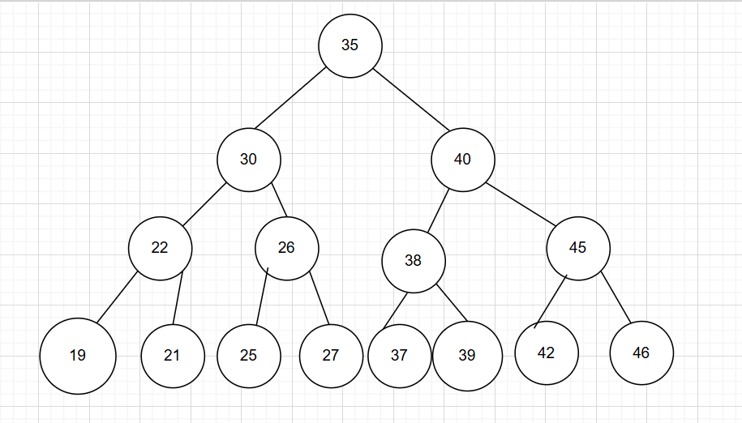但是如果顺序插入的情况下，会形成一个链表，导致查询性能大大降低，大数据量的情况下，层级较深，检索速度较慢
### B树（多路平衡查找树）
以一颗最大度数为5的b树为例（每个节点最多存储4个key，5个指针）

这是一个大概的图，B树具体如何构建，可以在
https://www.cs.usfca.edu/~galles/visualization/BTree.html 中查看
### B+树
以一颗最大度数为4的b+树为例
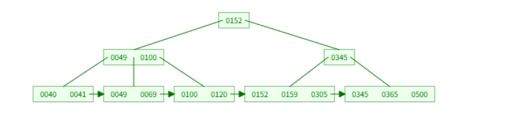
相对于B树，B+树的所有数据都出现在叶子节点，叶子节点之间形成一个单向链表，非叶子节点的数据仅用于索引
MySQL索引数据结构对B+树进行了优化，在原有B+树的基础上，增加一个指向相邻叶子节点的指针（形成双向链表），提高了区间访问的性能
**tips**：为什么会提高访问性能？
假设要执行一个范围查询，我们查到第一个满足条件的节点后，为了找到下一个数据，必须要回溯到父节点，甚至更上一层重新查找下一个键值，但是有了双向链表之后，定位到第一个满足条件的节点，不需要在回溯到上一级，可以直接顺序扫描后续节点
#### 为什么使用B+树索引
1. B+树 vs B树
	B+树只在叶子节点存储数据，B树在非叶子节点也要存储数据，索引B+树的单个节点的数据量更小，同样的磁盘IO次数下，就能查询更多的节点，查询效率更高，同时B+树的叶子节点使用双向链表链接，在查询时可以二分查找，提高效率
2. B+树 vs 二叉树
	对于n个节点的B+树，其查询复杂度为O(logdN)，d为节点允许的最大直接点个数
	实际场景下，d通常大于100，因此即便数据量达到千万级别，B+树的高度也只有3-4层左右，即最多需要3-4次IO就可以查询到数据
	而二叉树的子节点最多只有两个，查询复杂度为O(logN)，查询复杂度更大，磁盘IO次数更多
3. B+树 vs Hash索引
	Hash索引在做等值查询时，效率很快，查询复杂度为O(1)
	但是Hash索引不适用于范围查询
#### B+树是如何进行查询的
InnoDB中，B+树的每个节点都是一个数据页
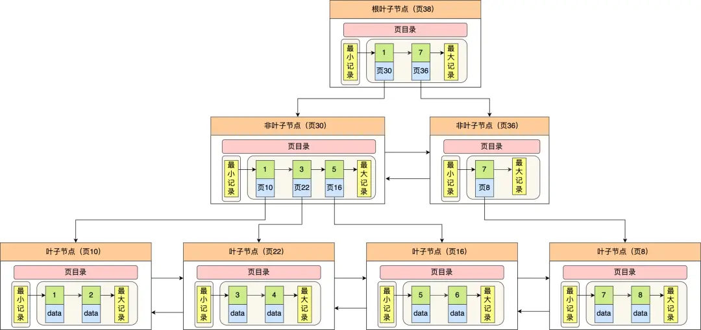
通过上图，来查找主键为6的记录
1. 从根节点开始，由于主键是6，二分法查找范围\[1,7)，可以知道要到页30中去查找数据
2. 在页30中再次进行二分查找，由于6>5可以知道要到页16去查询数据
3. 再到叶子节点中，通过槽查找记录时，使用二分法快速定位要查询哪个槽，定位到槽后，再遍历槽内的所有记录，找到主键为6的记录
### Hash
Hash索引就是采用一定的Hash算法，将键值换算成新的hash值，映射到对应的槽位上，然后存储到hash表中，如果两个或两个以上的键映射到同一个值上，就产生了hash冲突，可以通过链表来解决冲突
**特点**：
1. Hash索引只能用于对等比较，不支持范围查询
2. 无法利用索引完成排序操作
3. 查询效率高，通常只需要一次检索（没有发生Hash冲突）即可，效率通常要高于B+树索引
### 索引分类
**主键索引**：针对于表中主键创建的索引，只能有一个
**唯一索引**：表中某一列的数据不能重复，可以有多个
**常规索引**：快速定位到特定的数据
**全文索引**：全文索引查找的是文本中的关键词，而不是比较索引中的值
InnoDB存储引擎中，又可以分为以下两种
**聚簇索引**：将数据存储与索引放到一块，索引结构的叶子节点保存了行数据，必须存在，且只能有一个
- 如果存在主键，主键索引就是聚簇索引
- 如果不存在主键，将使用第一个唯一索引作为聚簇索引
- 如果表中没有主键，也没有适合的唯一索引，则会自动生成一个rowid作为隐藏的聚簇索引
**二级索引**：将数据与索引分开存储，索引结构的叶子节点关联的是对应的主键
```mysql
select * from user where id = '1';
select * from user where name = 'tom';
```
二级索引查询需要**回表查询**，即在二级索引查询到对应的主键之后，还需要到聚簇索引中再次查询得到行数据，因此第二条sql语句的查询速度要比第一条更慢
**前缀索引**：当字段类型为varchar text时，有时候会索引很长的字符串，这会让索引变得很大，查询时浪费大量的磁盘IO，影响查询效率。此时可以只将字符串的一部分前缀建立索引，大大减少索引空间，提高索引效率
**覆盖索引**：覆盖索引即只需要在二级索引的B+树中查询一次就能查询到结果的过程
```mysql
create index idx___ on table_name(column(n));
```
只需要在建立索引时，在列名后面指定需要多长的前缀n即可
### 索引下推
对于联合索引(a,b)，在执行`select * from table where a > 1 and b = 2;`时，只有a字段会走索引，那么联合索引的B+树在找到第一个满足条件的主键值（ID为2）后，还需要判断其他条件是否满足
1. 在MySQL 5.6 之前，只能从ID为2的记录开始一个个回表，到主键索引上找出数据行，再对比b字段值
2. MySQL 5.6之后，引入了索引下推优化，可以在联合索引遍历的过程中，对联合索引中包含的字段先做判断，直接过滤掉不满足条件的记录，减少回表次数
例如，对于下面这条SQL语句
```mysql
select * from t where age = 25 and city = '北京';
```
传统索引方法，会先找到所有age = 25的记录，通过回表获取完整的四条记录，然后在Server层检查city='北京'的条件，最终保留一条记录，这样子就会有三次额外的回表操作
而对于索引下推，先找到所有age=25的记录之后，在索引层面直接判断city='北京'，找到一条记录后，只对这一条记录进行回表，其他记录全部跳过
### 索引区分度
建立联合索引时的顺序，对索引的效率也有很大的影响，越靠前的字段被用于索引过滤的概率越高，因此在开发过程中，通常要把区分度大的字段排在前面，这样区分度大的字段就越有可能被更多的SQL使用到
```
区分度 = distinct(column) / count(*)
```
例如，对于性别字段，区分度就很小，不适合建立索引，或不适合排在联合索引列靠前的的位置，而对于UUID这类的字段就比较适合做索引，或排在联合索引列靠前的位置
对于区分度小的字段，假设字段的值分布均匀，无论搜索哪个值都可能得到一般的数据，在一些情况下，还不如不要索引，因为当MySQL中的查询优化器发现某个值出现在表的数据中的百分比较高时，一般会忽略索引，进行全表扫描
### 索引使用场景
索引能够提高查询速度，但是需要占用物理空间，创建索引和维护索引要耗费时间，且时间随着数据量的增加而增大，降低表的增删改的效率，每次增删改索引，B+树为了维护索引的有序性，都要进行动态维护
#### 适合使用索引的场景
1. 字段具有唯一性，例如订单号，商品编码等
2. 经常用于WHERE查询条件的字段，建立索引就能够提高整个表的查询速度
3. 经常用于GROUP BY和ORDER BY的字段，这样在查询的时候就不需要再次排序
#### 不适合使用索引的场景
1. WHERE,GROUP BY,ORDER BY里用不到的字段，因为建立索引会占用物理空间，这些条件用不到的字段，就不需要建立索引
2. 字段的区分度低，字段中存在大量的重复数据，例如性别
3. 表中数据较少
4. 经常更新的字段，不用建立索引，因为经常更新的字段，需要维护B+树的有序性，就需要频繁的重新建立索引，影响数据库性能
## SQL性能分析
### SQL执行频率
```mysql
SHOW GLOBAL STATUS LIKE 'Com_______';
```
上述语句是查询当前数据库增删改查语句的执行频率，如果查询占据了绝大部分，则可以考虑对其进行优化
### 慢查询日志
慢查询日志记录了所有执行时间超过指定参数（long_query_time 默认10s）的所有SQL语句的日志，MySQL中慢查询日志默认没有开启，需要在MySQl配置文件(/etc/my.cnf)中新增以下配置信息
```
slow_query_log=1
long_query_time=2
```
### profile详情
```mysql
show profiles;
```
上面这条指令可以在做SQL优化时，帮助我们了解时间都耗费到哪里去了
通过have_profiling参数能够查看到当前MySQL是否支持profile操作
```mysql
select @@have_profiling;
```
默认profiling是关闭的，可以通过set语句在session/global级别开启profiling
```mysql
# 设置开启profiling
set profiling=1;
# 查看当前是否开启profile操作
select @@profiling;
```
### explain执行计划

explain/desc命令可以获取MySQL如何执行select语句的信息，包括在select语句执行过程中表如何连接和连接的顺序
```mysql
explain select 字段名 from 表名 where 条件;
```
explain执行计划个字段含义
1. **id**：select查询的序列号，表示查询中执行select语句或者是操作表的顺序（id相同，执行顺序从上到下；id不同，值越大，越先执行）
2. **select_type**：表示select的类型，常见的取值有SIMPLE（简单表，即不使用表连接或者子查询）、PRIMARY（主查询，即外层的查询）、UNION（UNION中的第二个或者后面的查询语句）、SUNQUERY（SELECT/WHERE之后包含了子查询）
3. **type**：表示连接类型，性能由好到差的连接类型为null,system,const,eq_ref,ref,range,index,all
4. **possible_key**：显示可能应用在这张表上的索引，一个或多个
5. **key**：实际使用的索引，如果为null，则没有使用索引
6. **key_len**：索引中使用的字节数，该值为索引字段最大可能长度，并非实际使用长度，在不损失精度的前提下，长度越短越好
7. **rows**：MySQL认为必须要执行查询的行数，在innodb引擎的表中，是一个估计值，不一定准确
8. **filtered**：表示返回结果的行数站需要读取行数的百分比，filtered的值越大越好
### 最左匹配原则
如果索引包含了多列，即联合索引，就必须要遵循最左匹配原则。查询条件必须从索引的最左列开始，并且不能跳过中间的列，才能有效地利用该联合索引
假设有一个user表，并且给country city age三个字段建立一个符合索引，这个索引大致会先按country排序，再按city排序，最后按age排序
```mysql
select * from user where country='中国' and city='南昌' and age=18;
```
上述这条sql语句，从最左列country开始依次使用了所有列，因此会走索引
```mysql
select * from user where country='中国';
```
同时这条sql语句也会走索引，因为它的最左列country存在
```mysql
select * from user where city='南昌';
select * from user where age=18;
```
但是这两条sql语句就不会走索引，因为它们都跳过了最左列，所以必须要全表扫描，类似的，如果只有country和city列，也不会走索引
```mysql
select * from user where country='中国' and city like '南%' and age=18;
```
这条sql语句不会全部走索引，因为city这一列使用了模糊匹配，从而导致了age无法通过索引查找，必须要全表扫描，但是country和city列还是会走索引查找。通常情况下，范围查询(>,<,between,like等)右边的列都无法使用索引
但是如果加上等于，例如
```mysql
select * from t where a >= 1 and b = 2;
```
对于a = 1部分，b字段的值是有序的，所以会走索引，但是对于a > 1的部分，就不会走索引，在索引时，只需要从a = 1 b = 2的记录之后开始查找，就不需要从 a = 1 的部分开始查找，缩小了查询范围
```mysql
select * from user where city='南昌' and country='中国';
```
通常情况下，这条sql语句会走索引，sql语句条件的顺序与索引的顺序并不冲突，只要最左列开始依次存在即可
**tips**：范围查询时，通常都是找到第一个符合条件的值，然后再从这个节点开始，根据链表节点依次向后搜索，例如倒数第三条sql语句，索引时，会先找到第一个以"南"字开头的记录，然后再从这条记录所在节点依次往后搜索，直到找到不以"南"字开头的记录
### 索引失效
1. 不满足最左匹配原则
2. 使用了select * ：select语句中所有的查询列都是索引列，那么这些列被称为覆盖索引，这种情况下，查询的相关字段都能走索引。而使用select * 查询所有列的数据，大概率会查询非索引列，非索引列不会走索引
	**tips**：**覆盖索引**即查询使用了索引，并且需要返回的列中，也在该索引中能够全部找到，如果查询的列中有字段没有索引，MySQL查询该字段时，就会进行回表查询，导致查询效率降低
3. 索引列上有计算：
```mysql
select * from user where id+1=2;
select * from user where substr(name,1,1)='李';
```
类似于上述两种sql语句，一种是在条件上加了运算，一种是使用了函数，这两种情况都会导致索引失效
4. 字段类型不同：现在假设一个code字段，类型是varchar
```mysql
select * from user where code=101;
```
由于条件上的101没有使用引号，而是直接使用了数字的101，所以会有隐式类型转换，导致索引失效
5. 模糊匹配时 %在右边
```mysql
select * from user where name='张%';
select * from user where name='%三';
select * from user where name='%三%';
```
上述三条语句中，只有第一条sql语句是会走索引的，其他两条sql语句都不会走索引
6. or关键字：使用or关键字时，如果or前的列有索引，而or后面的列没有索引，那么整个sql语句都不会走索引
```mysql
select * from user where id=10 or age=23;
```
上述语句中age字段是没有索引的，id字段是有索引的，因此会导致索引失效，只有当or两边的列都是索引列时，这条sql语句才会走索引
7. MySQL评估走索引比全表扫描更慢：
假设user表中id是自增的
```mysql
select * from user where id>=1;
```
这条sql语句查询出来的数据，表中所有数据都符合条件，因此MySQL评估走索引可能会比全表扫描更慢，因此会直接全表扫描，即只要绝大部分数据都满足查询条件，即使这个列是索引列，MySQL依旧会进行全表扫描
## SQL优化
### 插入数据优化
insert优化：批量插入 ，手动提交事务，主键顺序插入
大批量插入数据时，不推荐insert语句，而是使用load指令插入
```mysql
# 客户端连接服务器时，加上参数 --local-infile
mysql --local-infile -u root -p
# 设置全局参数local_infile为1，开启从本地加载文件导入数据的开关
set global local_infile=1;
# 执行load指令将准备好的数据加载到表结构中
load data local infile '文件路径' into table '表名' fields terminated by '分隔符' lines terminated by '行分隔符';
```
### 主键优化
在InnoDB存储引擎中，表数据都是根据主键顺序组织存放的，这种存储方式的表称为索引组织表
由于主键在B+树中是按顺序存放的，因此，插入数据时选择让主键顺序插入，可以提高效率
MySQL中的数据都是存储在页中的，按顺序插入数据，就不会导致页分裂，如果不按顺序插入数据，则可能会导致页分裂
**页分裂**：假设现在有两页的数据，现在来了一个新的数据，主键id比第一页的最后一个大，比第二页的第一个更小，此时如果要把这个数据插入页中，就必须要先把第一页的数据取一半，然后和要插入的数据一起放入到第三页中，最后更改双向链表，使第一页连接第三页，第三页连接第二页

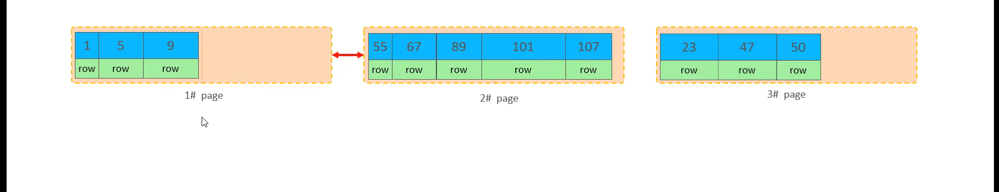
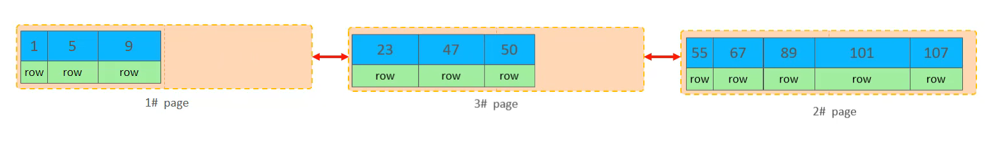
**页合并**：当删除一行记录时，实际上数据并没有被物理删除，只是被标记为删除状态，并且这块内存空间可以给其他记录使用
当页中删除的记录达到MERGE_THRESHOLD（默认为页的50%），InnoDB会开始寻找最靠近的页（前或后）看看是否能将两页合并优化成一页
### order by优化
MySQL中的排序有两种，分别是
1. Using filesort：通过表的索引或全表扫描，读取满足条件的数据行，然后在排序缓冲区sort buffer中完成排序操作，所有不是通过索引直接返回排序结果的排序都叫FileSort排序
2. Using index：通过有序索引扫描直接返回有序数据，不需要额外排序，效率高
根据排序字段建立适合的索引，多字段排序时，遵循最左匹配原则
尽量使用覆盖索引
多字段排序，一个升序一个降序，建立联合索引时要创建规则(ASC/DESC)
如果不可避免的出现filesort，大数据量排序时，可以适当增大排序缓冲区大小sort_buffer_size（默认256k），如果排序缓冲区满了，就会占用磁盘空间来排序
## 锁
### 全局锁
全局锁就是对整个数据库实例加锁，加锁后整个数据库实例就处于只读状态，已经更新操作的事务提交语句都将被阻塞
常用于数据库全库的备份，对所有的表进行锁定，保证数据的完整性，这样在备份期间，就不会因为数据或表结构的改变，使得备份文件与预期不同
要对数据库加上全局锁，就要执行以下这条命令
```mysql
flush tables with read lock ## 对数据库加读锁
unlock tables ## 释放锁
```
**缺点**：
如果在主库上备份，那么备份期间都不能执行更新，业务全都得停止
如果在从库上备份，那么备份期间从库不能执行主库同步过来的二进制日志，会导致主从延迟
**如何避免全局锁影响业务**
如果数据库的引擎支持的事务支持可重复读隔离级别，那么在备份数据库之前先开启事务，会先创建一个Read View，然后在整个事务执行期间都使用这个Read View，备份期间业务依然可以对数据进行更新操作
因为在可重复读的隔离级别下，即使其他事务更新了表的数据，也不会影响备份数据库时的Read View，即隔离性
### 表级锁
表级锁，锁住整张表。锁定粒度大，发生锁冲突的概率最高，并发度最低
表级锁主要分为以下三类
#### 表锁
对于表锁，主要分为两类，共享锁（读锁，S锁）和排他锁（写锁，X锁）
```mysql
# 加锁
lock tables 表名 read/write;
# 解锁
unlock tables;
```
给表加上读锁，所有客户端都只能读取表数据，不能写数据；如果进行更新操作，加锁客户端会报错，其他客户端会被阻塞
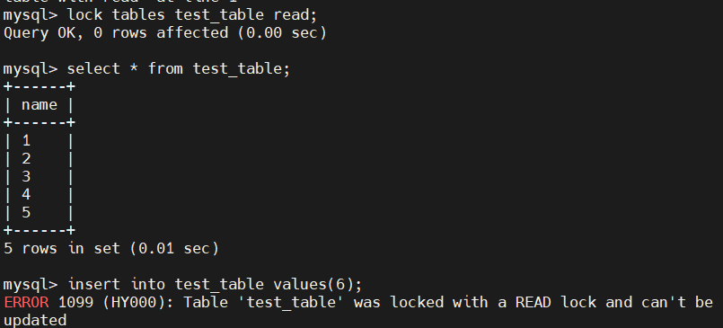
当前客户端报错，说明表加了读锁
同时对于加锁客户端，也不能读取其他表，只能读取当前加锁的表，如果读取了其他表，也会报错
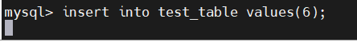
其他客户端的插入操作被阻塞，只有当加锁客户端释放了锁，才会执行这个操作
给表加上写锁，加锁的客户端可以对表进行读写操作，其他客户端既不能读也不能写，会被阻塞
#### 元数据锁(MDL)
MDL加锁过程是系统自动控制的，无需显示调用，在访问一张表时会自动加上。MDL锁主要作用是维护表元数据的数据一致性，在表上有活动事务时，不可以对元数据进行写入操作
- 对一张表进行CRUD操作时，加的是MDL读锁
- 对一张表结构进行变更操作的时候，加的是MDL写锁
MDL是为了保证当用户对表进行CRUD操作时，防止其他线程对这个表结构进行更改
当有线程在执行select语句期间，有其他线程要对表结构进行更改，就会被阻塞，因为表已经被加了MDL读锁，如果要再次加MDL读锁，就无法成功获取，知道select语句执行完才会被释放
同样的，如果在表结构被更改的期间，有其他客户端要执行CRUD操作，也会被阻塞，直到表结构完成更改
**MDL是在事务提交后才会被释放，这意味着，事务执行期间，MDL是一直持有的**
申请MDL锁的操作会形成一个队列，队列中写锁获取的优先级高于读锁，一旦有MDL写锁被阻塞，后续的读锁都会被阻塞
这意味着可能会出现以下场景
- 事务A开启，并执行了一条select语句，且事务A没有提交，这意味着MDL读锁一直被占有，没有释放
- 事务B开启，修改了表的字段，但是此时由于事务A占用了MDL读锁，且一直没有释放，就导致事务B也无法对表加上MDL写锁，就会被阻塞
- 在此之后，所有线程的CRUD操作都会被阻塞，因为MDL写锁的优先级高于MDL读锁，所以MDL读锁也无法直接越过MDL写锁直接对表加锁
#### 意向锁
- 在使用InnoDB引擎的表里对某些记录加上共享锁之前，需要在表级别加上一个意向共享锁
- 在使用InnoDB引擎的表里对某些记录加上独占锁之前，需要在表级别加上一个意向独占锁
也就是说，当执行插入、删除、更新操作时，需要先对表加上意向独占锁，然后对该记录加上独占锁
普通的select语句是无锁的，因为其一致性是通过MVCC来实现的
**意向共享锁和意向独占锁都是表级锁，不会和行级的共享锁和独占锁发生冲突，而且意向锁之间也不会发生冲突，只会和共享表锁和独占表锁发生冲突**
如果没有意向锁，那么加独占表锁的时候，就需要便利表里所有记录，查看是否有记录存在独占锁，这样就会大大降低了效率
有了意向锁，由于在对记录加独占锁之前，会先加上表级别的意向独占锁，因此在加独占锁的时候，就可以直接查看表是否加了意向独占锁，这样就不需要去一条记录一条记录遍历了
#### AUTO-INC锁
通常情况下，我们会将一张表的主键设置为自增的，这是通过对主键字段声明AUTO_INCREMENT属性实现的
之后，在插入数据的时候，可以不指定主键的值，数据库会自动给主键赋值递增的值，这主要是通过AUTO-INC锁实现的
AUTO-INC锁是一种特殊的表锁机制，锁不再是一个事务提交后才释放，而是在执行完插入语句后就会立即释放
在插入数据时，会加一个表级别的AUTO-INC锁，然后为被AUTO_INCREMENT修饰的字段赋值递增的值，等待插入语句执行完成后，释放AUTO-INC锁
一个事务在持有AUTO-INC锁的过程中，其他事务如果要向该表插入语句，就会被阻塞，从而保证插入的记录，主键是连续且递增的
但是，AUTO-INC锁在对大量数据进行插入时，会影响插入性能，因为另一个事务的插入操作会被阻塞
在MySQL 5.1.22版本后，InnoDB存储引擎提供了一种轻量级的锁来实现自增，给AUTO_INCREMENT修饰的字段加上一个轻量级锁，然后给该字段赋值一个自增的值，就把这个轻量级锁释放了，并不需要等待插入语句执行完才释放
InnoDB存储引擎提供了个innodb_autoinc_lock_mode的系统变量，是用来控制选择使用AUTO-INC锁还是轻量级的锁
- 当innodb_autoinc_lock_mode=0时，就采用AUTO-INC锁，语句执行结束后才释放锁
- 当innodb_autoinc_lock_mode=2时，就采用轻量级锁，申请自增主键后就释放锁，并不需要等待语句执行后才释放
- 当innodb_autoinc_lock_mode=1时，普通insert语句，自增锁在申请之后就立马释放，类似insert ... select 这样的批量插入数据的语句，自增锁还是要等待语句结束后才被释放
尽管innodb_autoinc_lock_mode=2是性能最高的方式，但是当binlog的日志格式是statment时，在主从复制的场景会发生数据不一致的问题
假设客户端A创建了一个表t，然后客户端A和客户端B同时执行向表t中插入数据
如果innodb_autoinc_lock_mode=2，就可能出现以下情况
- 客户端B先插入了两个数据(1,1)、(2,2)
- 然后客户端A申请自增id得到id=3，插入了(5,5)
- 之后客户端B继续执行，插入两条记录(3,3)、(4,4)
这是数据库里的数据是

| 1   | 1   | 1   |
| --- | --- | --- |
| 2   | 2   | 2   |
| 3   | 5   | 5   |
| 4   | 3   | 3   |
| 5   | 4   | 4   |

可以看到，客户端B的insert语句生成的id不连续
当主库发生了这种情况，binlog面对t表的更新只会记录这两个客户端的insert语句，如果binlog_format=statment，记录的语句就是原始语句，记录的顺序要么先记客户端A的insert语句，要么先记客户端B的insert语句，这取决于哪个事务优先提交
但不论是哪种，这个binlog到从库去执行，这时候从库是按顺序执行语句的，只有当执行完一条SQL语句，才会继续执行下一条，因此，**在从库上，不会发生两个客户端一起往t表中插入数据的场景，所以在从库上，执行了客户端B的insert语句，生成的结果里面，id都是连续的，这是就发生了主从库数据不一致的问题**
要解决这个问题，binlog日志格式要设置为row，当设置binlog的格式为row时，就不再记录SQL语句，而是记录每一行数据变更前后的值，这样在binlog里面记录的是主库分配的自增值，到从库中执行的时候，主库的自增值是什么，从库的自增值就是什么
### 行级锁
 每次操作锁住对应的数据行，锁定粒度最小，发生速冲突的概率最低，并发度最高
 **InnoDB存储引擎是支持行级锁的，但是MyISAM存储引擎不支持行级锁**
 普通的select语句是不会对记录加锁的，因为它属于快照读，如果要对记录加行锁，可以使用以下两种语句
 ```mysql
 select ... lock in share mode # 对读取的记录加共享锁
 select ... for update # 对读取的记录加独占锁
 ```
 上面这两条语句必须在一个事务中，因为当事务提交了，锁就会被释放
 InnoDB的数据是基于索引组织的，行锁是通过对索引上的索引项加锁来实现的，而不是对记录来加锁 
 行级锁主要分为以下几类：
**行锁（记录锁）**：锁定单个行记录的锁，防止其他事务对此行进行update和delete操作，在read commit和repeatable read 隔离级别下都支持
**间隙锁**：锁定索引记录间隙，确保索引记录间隙不变，防止其他事务在这个间隙进行insert，产生幻读。在repeatable read隔离级别下支持
假设表中有一个范围id为(3,5)的间隙锁，那么其他事务就无法插入id为4的记录了
**临键锁(next-key lock)**：行锁和间隙锁组合，同时锁住数据并锁住数据前面的间隙，repeatable read隔离级别下支持
假设表中有一个范围id为(3,5]的next-key lock，那么其他事务既不能插入id为4的记录，也不能修改id为5的记录
next-key lock是包含间隙锁和记录锁的，因此如果一个事务获得了X型的next-key lock，那么另外一个事务在获取相同范围的X型的next-key lock时，是会被阻塞的
**插入意向锁**：一个事物在插入一条记录的时候，需要判断插入位置是否已经被其他事务加了间隙锁，如果有的话，插入操作就会被阻塞，知道拥有间隙锁的那个事务提交位置，在此期间会生成一个插入意向锁，表明有事务需要在某个区间内插入数据，但是被阻塞了，**这是一种特殊的间隙锁**
## InnoDB引擎
### 逻辑存储结构
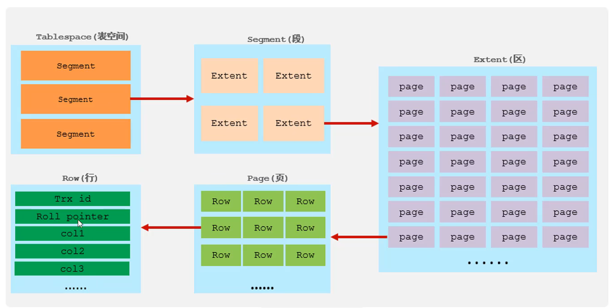
**表空间**：一个mysql实例可以对应多个表空间，用于存储记录，索引等数据
**段**：分为数据段，索引段，回滚段，InnoDB是索引组织表，数据段就是B+树的叶子节点，索引段即为B+树的非叶子节点，段用来管理多个区
**区**：表空间的单元结构，每个区大小为1M。默认情况下，InnoDB存储引擎页大小为16K，即一个区有64个连续的页
**页**：InnoDB存储引擎磁盘管理的最小单元，每个页默认大小为16K，为了保证页的连续性，InnoDB存储引擎每次从磁盘申请4-5个区
**行**：InnoDB存储引擎数据是按行进行存放的
### 页
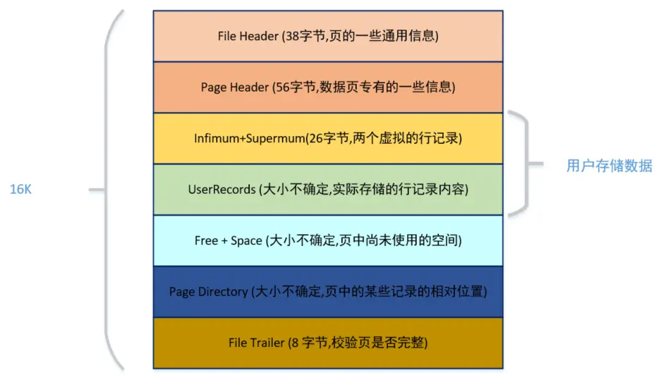
从上图可以知道，一个数据页被分为了七个部分，其中用户存储的行记录会被存储到UserRecords部分
一开始生成页时，并没有UserRecords这一部分，全部都是Free Space，每当我们插入一条记录，就会从Free Space部分申请一部分存储空间，划分到UserRecords，当Free Space全部被UserRecords部分替代，就意味着这一页被用完了，需要申请新的页
## 日志
**undo log（回滚日志）**：
# 杂项
## 自增id，雪花id，uuid作为表的主键，分别有什么优缺点
1. 自增id：
	优点：性能最好，每次有新记录插入表中，都是顺序写入磁盘，页分裂少，写入效率高，且更省空间，占用内存小
	缺点：在分布式环境下，如果多张表都要保证唯一且递增，实现起来很麻烦
	会暴露业务信息，容易被人猜到数据总量和增量，存在一定的安全风险
	高并发下可能会有竞争，自增锁可能会成为瓶颈
2. 雪花id：
	优点：全局唯一，在分布式系统中，可以保证跨数据库，跨表的id唯一
	由于随机生成时包含时间戳，整体成递增趋势，对MySQL聚簇索引性能影响较小
	可以反解出生成时间和机器号，便于排查问题
	缺点：长度较大，占用空间较多
	如果服务器时钟回拨，可能会产生id冲突
3. uuid：
	优点：生成简单，全球唯一
	缺点：无序性，uuid完全随机，新数据插入表中，为了维护b+树的有序性，无法顺序写入磁盘，导致大量页分裂
	占用空间较大
## MySQL单表建议存储多少数据
理论上来说，MySQL单表建议存储的数据行数不超过2000W，为什么是这样的
首先，InnoDB存储引擎使用的是B+树，而B+树的每一个节点都是一个数据页，每一页的大小为16KB
**非叶子节点里存储的每条数据都指向一个新的页，叶子节点里存储的每条数据都是用户存储的记录**
现在假设
- 非叶子节点内指向其他页的数量为x
- 叶子节点内能容纳的行数据为y
- B+树的层数为z
这个B+树存储的数据总数 $$Total=x^{z-1}*y$$
对于x，索引和数据页一样，都有File Header，Page Header和页目录等数据，大概占据1k左右，所以剩余15k用于存储数据，在索引页中主要记录的是主键和页号，主键假设是Bigint 8byte，页号 4byte，那么一条索引需要12 byte
$$x={15*1024}/12=1280$$
对于y，叶子节点能存放的数据也是15k。但是叶子节点中存放真实数据，所以影响因素较多，假设一条记录需要1k的空间，1页就能存储15条数据
假设B+树是两层，z=2$$Total={1280^1}*15=19200$$
假设B+树是三层，z=3$$Total={1280^2}*15=24576000$$
**这就是通常建议一张表的数据不能超过2000万**，因为一般情况下，B+树的层级最多也就3层
由于用户存储的数据大小无法确定，假设用户存储的一条数据大小为5k，单个数据页最多就只能放下3条数据，Total大概就是500万，所以在保证相同的层级的情况下，在行数据大小不同的情况，最大建议值也会随之改变
## count(\*)、count(1)、count(字段)的区别
首先是性能排行
```
count(*)≈count(1)>count(主键id)>count(字段)
```
**count(\*)**：对于count(\*)来说，并不是和select \* 一样，需要查询所有的字段，对于MySQL来说，MySQL底层的优化器会对其进行优化，在count的过程中，并不需要知道每一行数据是什么，只需要知道这是一行数据即可
**count(1)**：由于1只是一个常量，在MySQL的Server层，会生成一个常量1，然后进行按行累加，和count(\*)一样，减少了读取字段值的开销，两者的性能基本一样
**count(字段)**：InnoDB会扫描全表，并把每一行数据中指定字段的值都取出来，并返回。在Server层中，还会判断这个字段是否允许NULL值，如果允许NULL值，还需要先判断这个字段值是否为NULL，只有不为NULL时，才会进行累加
因此这也是最慢的一种方式，因为它不仅需要读取字段值，对于允许空值的字段，还需要判断字段值是否为NULL。再者，如果这个字段没有索引，还会进行全表扫描，更加降低了性能
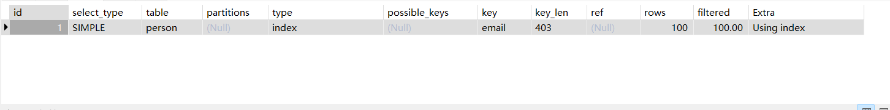
对于email字段，由于其有唯一索引，因此在count的过程中会走二级索引，因为走B+树会比全表扫描更快
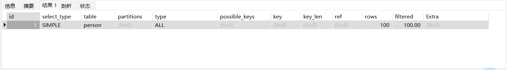
而对于person_name这个字段，没有索引，所以要全表扫描，因此其性能会比count(email)还要更差
**count(主键id)**：由于主键id不会为NULL，因此在读取时会直接扫描索引，然后进行按行累加，但是与count(1)相比，多了一个读取主键值的操作，因此性能会比count(1)较差
**tips：一个特殊的优化**
InnoDB是索引组织表，通常二级索引树会比主键索引树小很多，而MySQL优化器会选择最小的那可索引树来进行遍历，以减少IO开销

对于上面这张图，由于表中只有主键索引，因此在count(\*)的时候，会使用主键索引

对于第二张图，这张表里面有一个email的唯一索引，因此在count(\*)时，会优先使用二级索引，来进行计数
### 如何优化count(\*)
对于一些拥有千万级别数据的表，即便建立了二级索引，在查询时也会消耗较长的时间
1. 近似值：对于一些不需要精确统计个数的业务来说，我们可以使用show table status或者explain命令来对表内的数据进行估计，执行explain命令的效率是很高的，因为explain命令并不会真正的去查询表格
	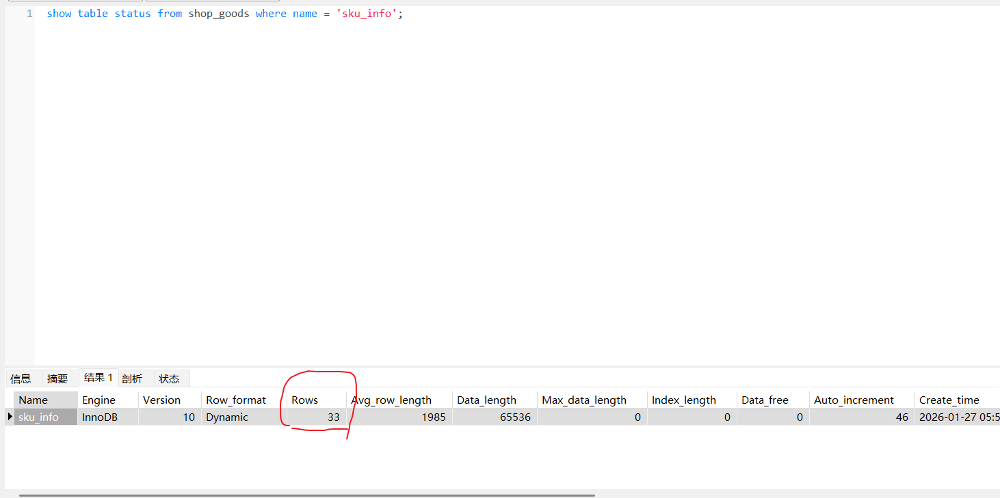
	注意这里的show table status里面的from后面跟的是数据库名，不是表名，name后面的才是表名
	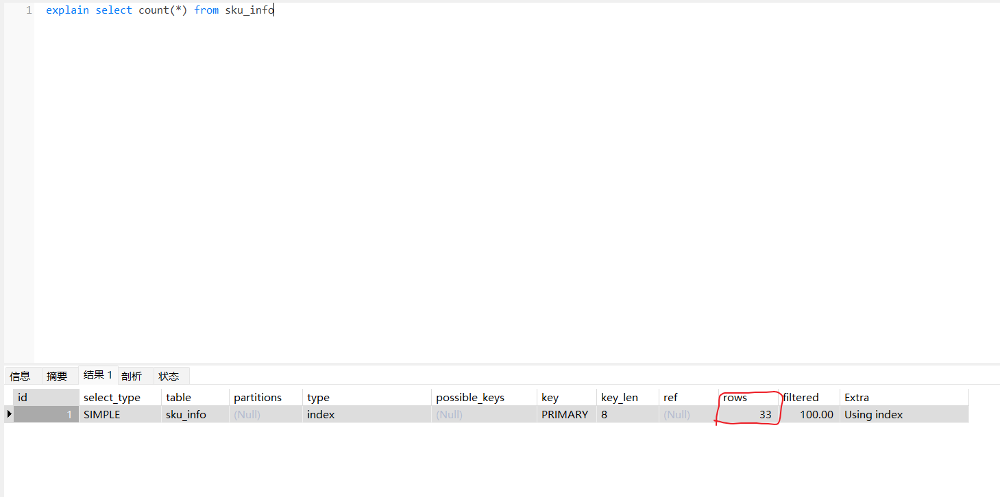
2. 额外表保存计数值：如果需要精确获取表中总记录数，可以额外建一张计数表，单独将表的总记录数保存到计数表中，每当插入一条数据到记录表中，计数表的count字段+1
## 如何优化深度分页的性能问题
```mysql
select * from t order by id limit offset,size
```
为什么深度分页的效率很慢？因为对于深度分页的offset，MySQL必须一条一条数据读取，直到读取够offset条数据，然后从第offset+1条数据开始，取size条数据并返回
解决方法：
1. **游标记录**：每次分页查询之后，记录当前页的最后一条数据的id，查询下一页时将id带上，直接用`where id>上一页最大值`查询即可，但是这个方法不支持跳页，必须一页一页往下查询，如果有跳页的情况，就无法知道上一页的最大值为多少
2. **子查询**：对于下列查询语句
```mysql
select * from t order by id limit 10000000,10;
```
由于上述语句使用的是select * ，因此在查询的时候除了根据主键id查询到对应的数据，还需要进行回表操作，也就是需要进行千万次回表操作，所以可以对上述查询语句进行修改
```mysql
select * from t where id >= (
	select id from t order by id limit 10000000,1
) order by id limit 10;
```
对于这条查询语句，会优先执行子查询，也就是在B+树上查询10000000+1条数据，并获取最后一条数据的主键id，然后在外面的查询中，直接通过where条件，获取大于等于子查询中最后一条数据主键id的数据，然后从这条数据开始往后查询10条数据
这个sql与第一个sql最大的区别就是，不再需要进行千万次的回表操作，分页查询里面的每一次查询都只在聚簇索引上进行，提高了性能
3. **覆盖索引**：如果只需要查询少量的字段，我们可以直接在这些字段上建立一个联合索引，这样，在查询的时候，就可以直接从索引树上返回结果，就不需要进行回表操作了
## 可重复读隔离级别，为什么只是部分解决幻读
对于MySQL，部分解决幻读，有两种方式，一种是快照读，一种是当前读（select ... for update）
针对于快照读，因为可重复读隔离级别，在开启事务时，就会创建一个Read View，之后每次查询语句都使用这个Read View，通过这个Read View就可以在undolog版本链中找到事务开始前的数据，所以事务过程中每次查询到的数据都是一样的，即便中途插入了新记录，也查询不出来这条数据，就可以避免幻读
针对当前读，即update、insert、delete、select ... for update，这些都是当前读，这些语句执行前都会查询最新版本的数据，然后再执行下一步操作，因为在select ... for update语句中会加上next-key lock的间隙锁+记录锁的组合，所以在插入新数据时会被这个锁给阻塞住，因此就可以避免幻读
但是上述情况并没有完全解决幻读，例如下面这种情况
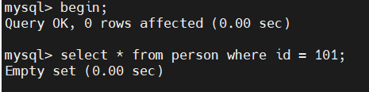
对于事务A，在表中查询一条不存在的数据，无法查到
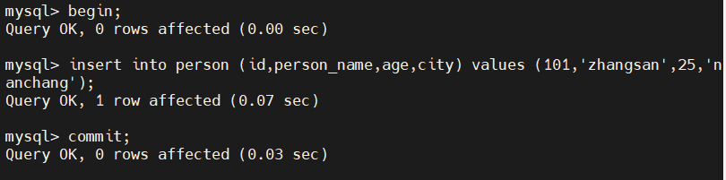
紧接着，事务B在数据库中插入了一条id为101的记录
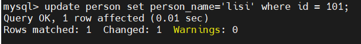
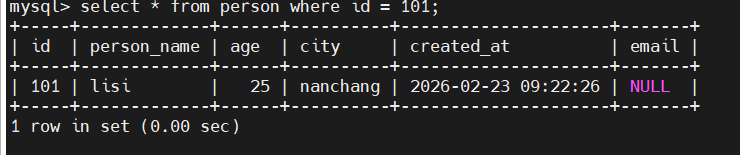
事务B在刚开始时，查询不到id为101的数据，但是在之后更新这条记录时，又能够成功更新这条数据，并且再次查询时就能查询到id为101的数据了，这就是没能完全解决的原因
可重复读隔离级别下，事务A执行普通select语句时生成了一个Read View，之后事务B表中插入了一条id为101的记录并提交事务，紧接着事务A对其进行了更新操作，更新后，这条记录的trx_id就变成了事务A的trx_id，这也就是为什么，事务A再次使用普通select语句去查询这条记录，就可以成功查询到记录了
第二种情况
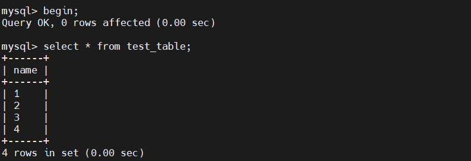
对于事务A，第一次从test_table中查询到四条数据
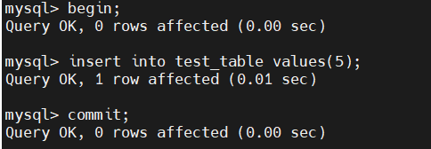
然后事务B再往test_table中插入了一条数据
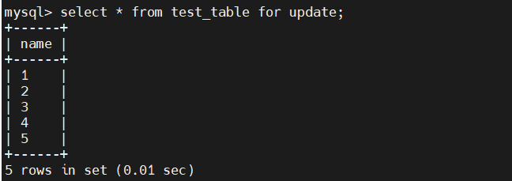
接着，在事务A中使用select ... for update再次查询，就能查到五条数据
这也是一种幻读现象
**为了避免这两类场景下发生的幻读现象，就是尽量在开启事务之后，马上执行select ... for update这类当前读语句，就会对记录加上next-key lock，从而避免其他事务往表中插入数据**

