# Redis
Redis是一个内存数据库，可以提高应用程序性能。它通过利用内存的高速访问速度，从而减轻核心应用程序数据库的负载
## Redis数据结构
### String
String类型是Redis最基本的key-value结构，key是唯一标识，value是具体的值，value不仅仅是字符串，也可以是数字，value最多可以容纳的数据长度是512M
String类型的底层数据结构实现主要是int和SDS（简单动态字符串）
SDS与C的原生字符串有一些不一样的地方
- SDS不仅可以保存文本数据，还可以保存二进制数据。因为SDS使用len属性的值而不是空字符来判断字符串是否结束，并且SDS所有的API都会处理以二进制的方式来处理SDS存放在buf\[]数组里的数据。所以SDS不光能存放文本数据，而且能保存图片、音频、视频、压缩文件这样的二进制数据
- SDS获取字符串长度的时间复杂度是O(1)。因为C语言的字符串并不记录自身长度，所以获取长度的时间复杂度为O(n)，而SDS结构里使用了len属性记录了字符串长度
- Redis的SDS API是安全的，拼接字符串不会造成换成去溢出。因为SDS在拼接字符串之前会检查SDS空间是否满足要求，如果不满足则会自动扩容，所以不会有缓冲区溢出的问题
字符串对象的内部编码有3种，int、raw、embstr
如果一个字符串对象保存的是整数值，并且这个整数值可以用long类型来表示，那么字符串对象会将整数值保存在支付传对象结构的ptr（将void\*转换成long）属性里面，并将字符串对象的编码设置为int
如果字符串对象保存的是一个字符串，并且这个字符串的长度小于等于32字节（redis2.+版本），那么字符串对象将使用一个SDS来保存这个字符串，并将对象的编码设置为embstr，embstr编码是专门用于保存段字符串的一种优化编码的方式
如果字符串对象保存的是一个字符串，并且这个字符串的长度大于32字节（redis2.+版本），那么字符串对象将使用一个SDS来保存这个字符串，并将对象的编码设置为raw
embstr编码和raw编码的边界在redis不同版本中是不同的
- redis2.+是32字节
- redis3.0-4.0是39字节
- redis5.0是44字节
**embstr会通过一次内存分配函数来分配一块连续的内存空间来保存redisObject和SDS，而raw编码会通过调用两次内存分配函数来分别分配两块内存空间来保存redisObject和SDS**，有以下好处：
- embstr编码将创建字符串对象所需的内存分配次数从raw编码的两次降低为一次
- 释放embstr编码的字符串对象同样只需要调用一次内存释放函数
- embstr编码的字符串对象的所有数据都保存在一块连续的内存里面，可以更好的利用CPU缓存提升性能
**embstr的缺点**：如果字符串的长度增加需要重新分配内存时，整个redisObject和SDS都需要重新分配空间，所以embstr编码的字符串对象实际上是只读的，redis没有为embstr编码的字符串对象编写任何相应的修改程序。当我们对embstr编码的字符串对象执行任何修改命令时，程序会先将对象的编码从embstr转换成raw，然后再执行修改命令
#### 应用场景
**缓存对象**：使用String来缓存对象的方式有两种
- 直接缓存整个对象的JSON
```redis
set user:1 '{"name":"shea","age":18}'
```
- 采用key进行分离为user:ID:属性，采用MSET存储，用MGET获取各属性值
```redis
mset user:1:name shea user:1:age 18 user:2:name zhangsan user:2:age 20
```
**常规计数**
因为Redis处理命令是单线程，所以执行命令的过程是原子的。因此String数据类型适用于计数场景
```redis
# 初始化文章的阅读量
set article:readcount:1001 0
# 阅读量加1
incr article:readcount:1001
# 获取文章阅读量
get article:readcount:1001
```
**分布式锁**
SETNX命令可以实现**key不存在时才插入**，我们可以用它来实现分布式锁，当key不存在时，则插入成功，可以表示加锁成功，反之加锁失败，同时要对这个键值对设定一个过期时间，以保证某个线程不会一直占用这个锁
```redis
# 方法一
set key value nx ex seconds # 通过set命令直接设置
# 方法二
setnx key value # setnx命令设置锁
expire key seconds # 设置过期时间
```
但是方法而并不是原子操作，可能在我们设置完锁后，Redis客户端就崩溃了，之后并没有设置过期时间，就会导致这个锁不会自动释放
```lua
if redis.call('setnx', KEYS[1], ARGV[1]) == 1 then
    return redis.call('expire', KEYS[1], ARGV[2])
else
    return 0
end
```
同时，解锁操作也不是原子的，因为在我们删除这个键值对的时候，需要先判断执行操作的客户端是否是加锁客户端，如果是，才能将这个锁删除
```lua
if redis.call("get",KEYS[1]) == ARGV[1] then
	return redis.call("del",KEYS[1])
else
	return 0
end
```
但这并不是最好的实现分布式锁的机制，后续会介绍redisson实现的分布式锁([[#看门狗机制]])
**共享session信息**
通常在开发后台管理系统时，会使用Session来保存用户的会话状态，这些Session信息会被保存在服务器端，但这只适用于单体系统，对于分布式系统不适用
例如，用户一的session信息被存储在服务器一，但第二次访问时用户一被分配到服务器二，但是此时服务器二并没有用户一的session信息，就会出现需要重复登录的问题
因此我们需要借助Redis来对这些session信息来进行统一的存储和管理，这样无论请求发送到哪台服务器，服务器都会去同一个Redis中获取相关的session信息
### List
List类型的底层数据结构是由双向链表或压缩列表来实现的
- 如果列表的元素小于512个（默认值，由list-max-ziplist-entries参数配置），列表每个元素的值都小于64字节（默认值，由list-max-ziplist-value参数配置），Redis会使用压缩列表来作为List类型的底层数据结构
- 如果列表的元素不满足上述条件，则会使用双向链表作为底层数据结构
**Redis 3.2版本之后，List数据类型底层数据结构就只由quicklist实现了**
#### 应用场景
**消息队列**
消息队列在存取消息时，必须要满足三个需求，分别是消息保序，处理重复的消息和保证消息可靠性
Redis的List和Stream两种数据类型就可以满足消息队列的这三个需求
- 如何满足消息保序需求：List是按先进先出的顺序对数据进行存取的，所以，如果使用List作为消息队列保存消息的话 
	List可以使用LPUSH + RPOP命令来实现消息队列
	生产者使用`LPUSH key value`将消息插入到队列的头部，如果key不存在则会创建一个空的队列插入消息
	消费者使用`RPOP key`依次读取队列的消息，先进先出
	但是这里存在一个**性能风险**
	在生产者网List中写数据时，List并不会主动通知消费者有新消息写入，如果消费者想要及时处理消息，就需要在程序中不停地调用RPOP命令，如果有新的消息写入RPOP就会返回结果，否则RPOP就返回空值，再继续循环
	所以，即使没有新消息写入List，消费者也需要不停调用RPOP命令，就会导致消费者程序的CPU一直消耗在执行RPOP命令上，带来性能损失
	所以，Redis提供了BRPOP命令，**BRPOP命令也成为阻塞式读取，客户端在没有读到队列数据时，自动阻塞，知道有新的数据写入队列，再开始读取新数据**
- 如何处理重复的消息：需要满足两个需求 1. 每个消息都有一个全局ID 2. 消费者要记录已经处理过的消息ID，当收到消息时，消费者程序就可以对比收到的消息ID和已经处理过的消息ID，来判断当前收到的消息有没有经过处理，如果被处理过，消费者程序就不再处理
	但是List并不会为每个消息生成ID，所以我们要自行为每个消息生成一个全局ID
- 如何保证消息可靠性：当消费者程序从List中读取一条消息后，List就不会再保留这条信息了。所以，如果消费者程序在处理消息的过程中出现了故障或宕机，就会导致消息没有处理完成，消费者程序再次启动时，就没办法再次从List中读取消息了
	为了留存信息，List类型提供了BRPOPLPUSH命令，这个命令的作用是让消费者程序从一个List中读取消息，同时Redis会把这个消息再插入到另一个List中留存
	如果消费者程序没能正常处理消息，等它重启后，就可以从备份的List中读取消息并处理了
但是List作为消息队列，不支持多个消费者消费同一条消息，因为一旦消费者从中取得一条消息后，这条消息就会从List中删除了，无法再次被其他消费者消费
### Hash
Hash是一个键值对集合，其底层数据结构是由压缩列表或哈希表实现的
- 如果哈希类型元素小于512个（默认值，由hash-max-ziplist-entries参数控制），所有值小于64字节（默认值，由hash-max-ziplist-value参数控制），Redis会使用压缩列表来作为Hash类型的底层结构
- 如果哈希类型元素不满足上述条件，Redis会使用哈希表作为Hash类型的底层结构
Redis 7.0中，由listpack数据结构来实现Hash
#### 应用场景
**缓存对象**
Hash类型的结构与对象类型的结构相似，因此可以用于缓存对象
```redis
HMSET uid:1 name Tom age 15 # 存储一个哈希表uid为1的键值
HMSET uid:2 name Jerry age 18 # 存储一个哈希表uid为2的键值
HGETALL uid:1 # 获取哈希表uid为1的所有键值
```
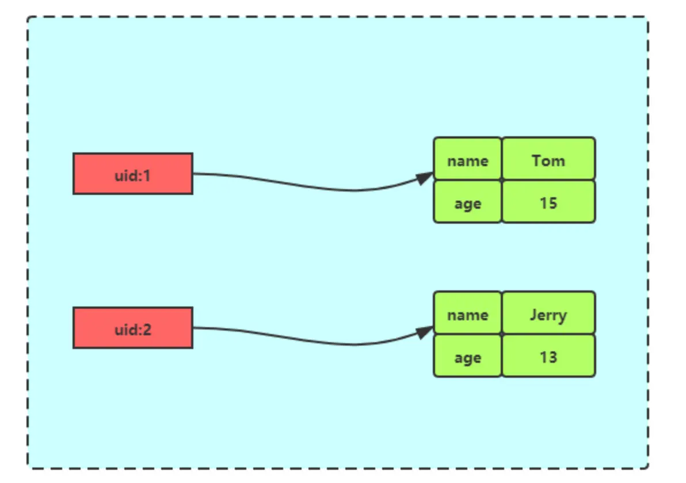
一般对象用String + Json存储，对象中某些变化频繁的属性可以考虑抽出来用Hash类型存储
**购物车**
以用户id为key，商品id为field，商品数量为value，恰好构成了购物车的三个要素
### Set
Set类型是一个无序并且唯一的键值集合，它的存储顺序不会按照插入的先后顺序进行存储
一个集合最多可以存储$2^{32}-1$个元素，Set类型除了支持集合内的增删改查，同时还支持多个集合取交、并、差集
Set类型的底层数据结构是由哈希表或整数集合实现的
- 如果集合中的元素都是整数且元素个数小于512（默认值，由set-maxintset-entries参数配置），Redis会使用整数集合作为Set类型的底层数据结构
- 如果集合中的元素不满足上述条件，则Redis使用哈希表作为Set类型的底层数据结构
**Set集合运算操作**
```redis
# 交集运算
SINTER key [key2...]
# 将交集结果存入新集合destination中
SINTERSTORE destination key [key2...]
# 并集运算
SUNION key [key2...]
# 将并集结果存入新集合destination中
SUNIONSTORE destination key [key2...]
# 差集运算
SDIFF key [key2...]
# 将差集结果存入新集合destination中
SDIFFSTORE destination key [key2...]
```
#### 应用场景
集合的主要几特效，无序、不可重复、支持交并差集等操作
因此Set类型适合用来做数据去重和保障数据唯一性，还可以用来统计多个集合的交集、并集、差集等
但是，Set类型的交集、并集、差集的计算复杂度较高，在数据量较大的情况下，如果直接执行这些操作，会导致Redis实例阻塞
在主从集群中，为了避免主库阻塞，我们通常可以选择一个从库用来做Set的聚合运算，或者把数据返回给客户端，由客户端来完成聚合统计
**点赞**
Set类型可以保证一个用户只能点一个赞，key是文章id，value是用户id
uid:1，uid:2，uid:3分别对article:1文章点赞
```redis
SADD article:1 uid:1
SADD article:1 uid:2
SADD article:1 uid:3
```
uid:1取消了对article:1文章点赞
```redis
SREM article:1 uid:1
```
获取article:1文章所有点赞用户
```redis
SMEMBERS article:1
```
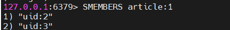
获取article:1文章的点赞用户数量
```redis
SCARD article:1
```
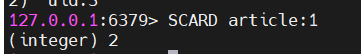
判断uid:1是否对文章article:1点赞了
```redis
SISMEMBER article:1 uid:1
```
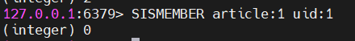
**共同关注**
Set类型支持交集运算，因此可以用来计算共同关注的好友、公众号等
key是用户id，value是已关注的公众号id
```redis
SADD uid:1 5 6 7 8 9
SADD uid:2 6 7 8 9 10
```
uid:1和uid:2共同关注的公众号
```redis
SINTER uid:1 uid:2
``` 
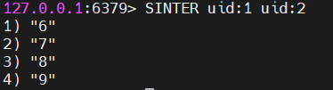
给uid:2推荐uid:1关注的公众号
```redis
SDIFF uid:1 uid:2
```
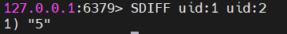
验证某个公众号是否同时被uid:1或uid:2关注
```redis
SISMEMBER uid:1 5
SISMEMBER uid:2 5
```
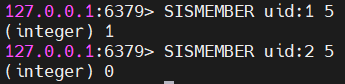
**抽奖活动**
存储某活动中奖用户名单，因为Set可以去重，因此可以保证同一个用户不会中奖两次
key为活动名，value为用户名·，然后将所有用户加入抽奖名单中，随机弹出一个作为中奖名单
```redis
SADD lucky Tom Jerry John Sean Marry Lindy Sary Mark
```
如果允许重复中奖，可以使用SRANDMEMBER命令
如果不允许重复中奖，则使用SPOP命令
### Zset
Zset类型相比于Set类型多了一个排序属性score，对于有序集合Zset来说，每个存储元素相当于有两个值组成的，一个是有序集合的元素值，一个是排序值
有序集合保留了集合不能有重复成员的特性，但不同的是，有序集合中的元素可以排序
Zset类型的底层数据结构是由压缩列表或跳表实现的
- 如果有序集合的元素小于128个，并且每个元素的值小于64字节，Redis会使用压缩列表作为Zset的底层数据结构
- 如果不满足以上条件，则会使用跳表作为Zset的底层数据结构
Redis 7.0之后，压缩列表数据结构已经被废弃了，改为listpack数据结构来实现
#### 应用场景
Zset类型可以根据元素的权重来排序，我们可以自己决定每个元素的权重
在面对需要展示最新列表，排行榜等场景时，如果数据更新频繁或者需要分页显示时，可以考虑优先使用Zset
**排行榜**
可以用作学生成绩排名榜，游戏积分排行榜，视频播放排行榜，商品销量排行等
例如博客点赞
```redis
ZADD user:shea:ranking 200 article:1
ZADD user:shea:ranking 50 article:2
ZADD user:shea:ranking 500 article:3
ZADD user:shea:ranking 1000 article:4
``` 
文章article:2新增一个点赞
```redis
ZINCRBY user:shea:ranking 1 article:2
```
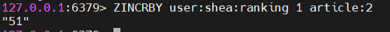
查看某篇文章的点赞数
```redis
ZSCORE user:shea:ranking article:2
```
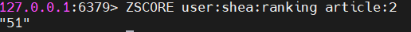
获取点赞数最多的3篇文章（WITHSCORES参数可以把score也显示出来）
```redis
ZREVRANGE user:shea:ranking 0 2 WITHSCORES
```
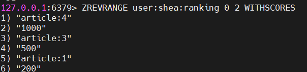
获取50到150赞区间的文章
```redis
ZRANGEBYSCORE user:shea:ranking 50 150 WITHSCORES
```
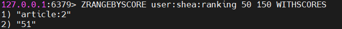
**电话、姓名排序**
使用有序集合的ZRANGEBYLEX或ZREVRANGEBYLEX可以帮助我们实现电话号码或姓名的排序，ZRANGEBYLEX（返回指定成员区间内的成员，按key正序排序，分数必须相同）
**不要在分数不一致的Zset中使用ZRANGEBYLEX和ZREVRANGEBYLEX指令，获取的结果会不准确**
- 电话排序
```redis
ZADD phone 0 13100111100 0 13110114300 0 13132110901
ZADD phone 0 13200111100 0 13210114300 0 13232110901
ZADD phone 0 13300111100 0 13310114300 0 13332110901
```
获取所有号码
```redis
ZRANGEBYLEX phone - +
```
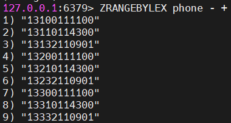
获取132号段的号码
```redis
ZRANGEBYLEX phone [132 (133
```
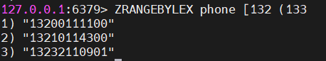
- 姓名排序
```redis
ZADD names 0 Will 0 Mike 0 Dustin 0 Eleven 0 Lucas
```
获取所有人的名字
```redis
ZRANGEBYLEX names - +
```
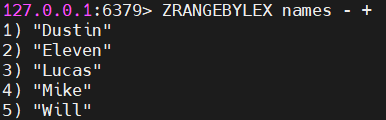
获取名字中大写字母C到M的所有人
```redis
ZRANGEBYLEX names [C (M
```
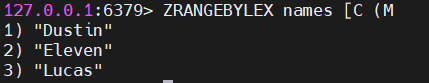
### BitMap
BitMap，位图，是一串连续的二进制数组，可以通过偏移量来定位元素。BitMap通过最小的单位bit来进行0|1的设置，表示某个元素的值或状态，时间复杂度为O(1)
由于bit是计算机中最小的单位，用它存储将非常节省空间，特别适合一些数据量大，且二值统计的场景
BitMap本身是使用String类型作为底层数据结构实现的一种二值状态的数据类型
String类型是会保存为二进制的字节数组，所以Redis就把字节数组的每个bit位利用起来，表示一个元素的二值状态
#### 应用场景
**签到统计**
签到打卡的场景中，就只由签到和未签到两种状态
每一天用一位来表示，这样每个月最多就只需要31位bit，就可以知道用户的签到情况了
设置用户签到2025年2月25号已经签到
```redis
SETBIT uid:sign:100:202602 24 1
```
检查是否签到
```redis
GETBIT uid:sign:100:202602 24
```
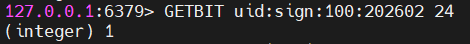
统计2月份签到次数
```redis
BITCOUNT uid:sign:100:202602
```
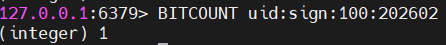
统计这个月首次打卡时间
`BITPOS key bitValue [start] [end]`
```redis
BITPOS uid:sign:100:202602 1
```
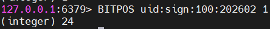
**判断用户登录状态**
BitMap提供了GETBIT和SETBIT操作，通过一个偏移值offset对bit数组的offset位置的bit位进行读写操作
只需要一个key = login_status表示存储用户登录状态集合数据，将用户ID作为offset，在线就设置为1，下线设置为0，通过GETBIT判断用户是否在线，5000万用户就只需要6MB的空间
用户134567登录
```redis
SETBIT login_status 134567 1
```
检查用户是否登录
```redis
GETBIT login_status 134567
```
用户134567退出
```redis
SETBIT login_status 134567 0
```
**连续签到用户总数**

## 避免死锁

即持有锁的服务宕机了，导致锁无法被释放，形成死锁

在加锁的时候设置一个过期时间，让锁过期之后自动释放

## 防止误删

即服务A因耗时过长，导致锁自动释放了，此时服务B获取到了锁，然后服务A执行完之后再次释放锁，会直接把服务B的锁给释放掉

加锁时value加入唯一id（不能使用线程id，因为线程id在多台服务器的场景下可能会重复，可以使用UUID），在释放锁的时候，使用lua脚本，在每次释放锁之前判断一下锁是否是当前服务持有的

## 可重入性

一个线程在持有锁的情况下，再次请求同一个锁会请求失败

使用Redis Hash结构，Key是锁名，Field是客户端Id，Value是重入次数，使用HINCRBY原子地增加计数

## 看门狗机制

锁设置的过期时间太短，业务时间还没执行完就没了，过期时间太长，宕机后要等很久才会释放

### 看门狗
为什么不使用setnx来做分布式锁而是使用redisson做分布式锁
对于setnx命令，存入一个值到redis中，必须要设置一个过期时间，但是过期时间到底要设置多长，如果过期时间太多，有可能程序还没执行完，锁就已经过期释放了，如果设置的时间过长，可能会导致程序执行完后还在持续占用锁，因此需要使用redisson做分布式锁
redisson提供了一个看门狗机制，看门狗每过一段时间（锁过期时间的1/3）就会自动为锁续期。当业务正常执行结束后，客户端主动释放锁，停止看门狗线程；业务线程宕机后，守护线程就会自动终止

## RedLock

主从架构锁丢失：客户端在Master加锁成功，但是锁信息未同步到Slave节点前Master宕机，新的Master上没有锁，其他客户端再次加锁成功

部署N个（奇数个）独立的Redis Master，客户端必须在超过半数（N/2+1）的节点上加锁成功，才能真的获取到锁

### 缺点：

1. 要部署多个主节点，运维成本高

2. 加锁需要访问多个节点，性能比单节点低

3. 节点之间的时钟可能不一致，极端情况下可能还是有问题

4. Java的GC可能暂停线程，导致看门狗无法续期，锁过期

## ZipList

**ZipList**是Redis为节省内存而设计的一个紧凑的线性数据结构，广泛用于列表键（当元素少且为小整数/短字符串时）和哈希键（当字段少且为小键值对时）的底层实现

为了节省内存，ZipList的每个节点占用的内存大小都可以不同，每个节点都可以用来存储一个字符串或一个整型

### 压缩列表组成

1. Zlbytes：ZipList的长度，是一个32位无符号整数

2. Zltail：ZipList最后一个节点的偏移量，反向遍历和pop尾部节点时有用

3. Zllen：ZipList的节点的个数

4. entry：节点

5. Zlend：值为0xFF，用于标记ZipList的结尾

### Entry

每个节点由三部分构成：

prevlength：记录上一个节点的长度，为了方便反向遍历ziplist

encoding：当前节点的编码规则

data：当前节点的值，可以是数字或字符串

为了节省内存，根据上一个节点的长度prevlength可以将节点分为两类：

entry的前八位小于254，则这八位就表示上一个节点的长度

entry的前八位等于254，则意味着上一个节点的长度无法用八位表示，后面的32为才是真实的prevlength（不用255作为分界是因为255是zlend的值，用于判断ziplist是否到达尾部）
## Redis持久化
### RDB (Redis Database Backup file)
RDB是将Redis在内存中的数据保存到磁盘上，保存的是数据快照（二进制文件）
RDB持久化机制中，Redis会周期性的将内存中的数据写入到磁盘中，保存为一个rdb文件，通过快照的方式保存数据，可以见效数据集的大小，在恢复大数据集的时候速度较快
但是由于保存的是快照，可能会丢失最后一次快照之后的数据，适合对数据丢失要求不严格的场景
#### 执行RDB
**save**：由Redis主进程来执行RDB，会阻塞所有命令（服务在停机时会执行一次RDB）
**bgsave**：开启子进程执行RDB，避免主进程收到影响
bgsave开始时会fork主进程得到子进程，子进程共享主进程的内存数据，完成fork后读取内存数据并写入RDB文件，为了提高fork进程的速度，以减少主进程的阻塞时间，子进程会直接fork主进程的页表，通过页表映射到对应的物理内存，就不需要复制物理内存里的数据了
**copy-on-write**：当主进程执行读操作时，访问共享内存，当主进程执行写操作时，则会拷贝一份数据，执行写操作 
### AOF (Append Only File)
AOF是将Redis服务器执行的所有写操作都记录到一个日志文件中，采用追加的方式写入，保证了数据不会丢失
AOF文件保存的是Redis执行的原始命令，具有较好的可读性，AOF文件通常较大，因此可以提供更好的数据持久性，数据丢失概率更低
由于是记录命令，AOF文件会比RDB文件大得多。而且AOF会记录对同一个key的多次写操作，但只有最后一次写操作才有意义。因此会通过**bgrewriteaof**命令，对AOF文件进行重写，只记录最后一次写操作
## 数据一致性
由于我们通常只会向数据库中写入数据，如果数据库的数据发生变化，而缓存却没有同步，就会有数据一致性的问题存在，在一些并发场景中会出现问题。
### 旁路缓存模式（双写）
1. 读操作
	应用程序首先从缓存中查找数据，如果缓存命中，则直接返回缓存中的数据。如果缓存为命中，则从数据库中读取数据，并将读取到的数据写入到缓存中，以便后续流程可以直接从缓存中获取
2. 写操作
	应用程序首先更新数据库中的数据，然后使缓存中对应的数据失效
## 主从架构
单节点Redis的并发能力是有上限的，要进一步提高Redis的并发能力，就要搭建主从集群，实现读写分离，在主节点进行写操作，从节点进行读操作
### 数据同步原理
**全量同步**：主从第一次同步是全量同步，从节点执行replicaof命令与主节点建立连接，slave节点先请求增量同步，master节点判断replid，发现不一致，拒绝增量同步，master节点生成RDB文件，然后将RDB文件发送给slave节点，slave节点清空原数据，加载RDB文件，在RDB期间，master节点的命令记录在repl_baklog中，RDB完成后，master将repl_baklog发送给slave，slave进行同步
如何判断是否第一次同步？
Replication Id：数据集的标记，id一致则说明是同一数据集，slave会集成master节点的replid，id不一样则是第一次同步
offset：随着记录在repl_baklog中的数据增多而增大，slave完成同步时也会记录当前同步的offset，如果slave的offset小于master的offset，说明slave的数据落后于master，需要更新
**增量同步**：从节点宕机一段时间，重启后，向主节点发送增量同步的请求
增量同步失败的情况：repl_baklog大小有上限，写满后会覆盖最早的数据，如果slave断开时间过久，导致数据被覆盖，则无法实现增量同步，只能再次进行全量同步
### 哨兵模式
如何处理master节点宕机？
Redis提供了哨兵(Sentinel)机制来实现主从集群的自动故障恢复
当master故障时，Sentinel会将一个slave提升为master，故障实例恢复后也以新的master为主
#### 服务状态监控
Sentinel基于心跳机制检测服务状态，每隔1秒向集群的每隔实例发送ping命令
**主观下线**：如果某个Sentinel节点发现某实例未在规定时间内响应，则认为该实例是主观下线
**客观下线**：若超过指定数量(quorum)的sentinel都认为该实例主观下线，则该实例客观下线，quorum值最好超过sentinel实例数量的一半
**选择新的master**：
1. 判断slave与master断开时间长短，如果超过指定值，则排除该slave
2. 判断slave的slave-priority值，越小优先级越高，如果是0则永不参与选举
3. 如果slave-priority一样，则slave的offset值越大（数据越新），优先级越高
4. 最后判断slave的运行id大小，越小优先级越高
## Spring Cache
SpringBoot中，Spring Cache提供了一套简洁且强大的缓存抽象机制，帮助开发者轻松地将缓存集成到应用程序中
### 核心组件
**CacheManager**：CacheManager是Spring Cache的核心接口，负责管理多个缓存实例。作为缓存操作的入口点，提供了获取和操作缓存实例的方法
**Cache**：Cache是缓存的具体实现，负责存储和检索缓存数据。提供了基本的缓存操作，具体的Cache实现依赖于底层的缓存存储机制
### 核心注解
**@EnableCaching**：开关型注解，在项目启动类或某个配置类上使用了此注解，表示允许使用注解的方式进行缓存操作
**@Cacheable**：用于标注需要缓存的方法。当该方法被调用时，Spring Cache回显检查缓存中是否存在对应的数据。如果存在，则返回数据；不存在，则执行方法并将结果存入环村
**@CachePut**：用于标注需要更新缓存的方法，即使缓存中已经存在数据，该方法仍然会执行，并将结果更新到缓存中
**@CacheEvict**：用于标注需要清除缓存的方法
**@Caching**：此注解即可作为@Cacheable、@CacheEvict、@CachePut三种注解中的任何一种或几种来使用
**@CacheConfig**：可以用于配置@Cacheable、@CacheEvict、@CachePut这三个注解的一些公共属性，例如cacheNames、keyGenerator
## 序列化
在Redis中，配置序列化策略通常涉及到如何将数据在Redis内部存储和传输时进行序列化和反序列化。Redis本身支持多种数据类型，如字符串、列表、集合等，而这些数据类型的值和传输时通常需要序列化
**StringRedisSerializer**是Redis默认提供的字符串序列化器，它将字符串序列化为字节数组，并在需要时将字节数组反序列化为字符出啊
**GenericJackson2JsonRedisSerializer**是Spring Boot框架提供的JSON序列化器，它将对象序列化为JSON格式的字节数组，并在需要时将字节数组反序列化为对象
**JdkSerializationRedisSerializer**是Spring Data Redis默认的序列化策略，它使用Java原生的序列化机制将对象序列化为字节数组，要求被序列化的对象必须实现Serializable接口