# Redis
Redis是一个内存数据库，可以提高应用程序性能。它通过利用内存的高速访问速度，从而减轻核心应用程序数据库的负载
## Redis数据结构
### String
String类型是Redis最基本的key-value结构，key是唯一标识，value是具体的值，value不仅仅是字符串，也可以是数字，value最多可以容纳的数据长度是512M
String类型的底层数据结构实现主要是int和SDS（简单动态字符串）
SDS与C的原生字符串有一些不一样的地方
- SDS不仅可以保存文本数据，还可以保存二进制数据。因为SDS使用len属性的值而不是空字符来判断字符串是否结束，并且SDS所有的API都会处理以二进制的方式来处理SDS存放在buf\[]数组里的数据。所以SDS不光能存放文本数据，而且能保存图片、音频、视频、压缩文件这样的二进制数据
- SDS获取字符串长度的时间复杂度是O(1)。因为C语言的字符串并不记录自身长度，所以获取长度的时间复杂度为O(n)，而SDS结构里使用了len属性记录了字符串长度
- Redis的SDS API是安全的，拼接字符串不会造成换成去溢出。因为SDS在拼接字符串之前会检查SDS空间是否满足要求，如果不满足则会自动扩容，所以不会有缓冲区溢出的问题
字符串对象的内部编码有3种，int、raw、embstr
如果一个字符串对象保存的是整数值，并且这个整数值可以用long类型来表示，那么字符串对象会将整数值保存在支付传对象结构的ptr（将void\*转换成long）属性里面，并将字符串对象的编码设置为int
如果字符串对象保存的是一个字符串，并且这个字符串的长度小于等于32字节（redis2.+版本），那么字符串对象将使用一个SDS来保存这个字符串，并将对象的编码设置为embstr，embstr编码是专门用于保存段字符串的一种优化编码的方式
如果字符串对象保存的是一个字符串，并且这个字符串的长度大于32字节（redis2.+版本），那么字符串对象将使用一个SDS来保存这个字符串，并将对象的编码设置为raw
embstr编码和raw编码的边界在redis不同版本中是不同的
- redis2.+是32字节
- redis3.0-4.0是39字节
- redis5.0是44字节
**embstr会通过一次内存分配函数来分配一块连续的内存空间来保存redisObject和SDS，而raw编码会通过调用两次内存分配函数来分别分配两块内存空间来保存redisObject和SDS**，有以下好处：
- embstr编码将创建字符串对象所需的内存分配次数从raw编码的两次降低为一次
- 释放embstr编码的字符串对象同样只需要调用一次内存释放函数
- embstr编码的字符串对象的所有数据都保存在一块连续的内存里面，可以更好的利用CPU缓存提升性能
**embstr的缺点**：如果字符串的长度增加需要重新分配内存时，整个redisObject和SDS都需要重新分配空间，所以embstr编码的字符串对象实际上是只读的，redis没有为embstr编码的字符串对象编写任何相应的修改程序。当我们对embstr编码的字符串对象执行任何修改命令时，程序会先将对象的编码从embstr转换成raw，然后再执行修改命令
#### 应用场景
**缓存对象**：使用String来缓存对象的方式有两种
- 直接缓存整个对象的JSON
```redis
set user:1 '{"name":"shea","age":18}'
```
- 采用key进行分离为user:ID:属性，采用MSET存储，用MGET获取各属性值
```redis
mset user:1:name shea user:1:age 18 user:2:name zhangsan user:2:age 20
```
**常规计数**
因为Redis处理命令是单线程，所以执行命令的过程是原子的。因此String数据类型适用于计数场景
```redis
# 初始化文章的阅读量
set article:readcount:1001 0
# 阅读量加1
incr article:readcount:1001
# 获取文章阅读量
get article:readcount:1001
```
**分布式锁**
SETNX命令可以实现**key不存在时才插入**，我们可以用它来实现分布式锁，当key不存在时，则插入成功，可以表示加锁成功，反之加锁失败，同时要对这个键值对设定一个过期时间，以保证某个线程不会一直占用这个锁
```redis
# 方法一
set key value nx ex seconds # 通过set命令直接设置
# 方法二
setnx key value # setnx命令设置锁
expire key seconds # 设置过期时间
```
但是方法而并不是原子操作，可能在我们设置完锁后，Redis客户端就崩溃了，之后并没有设置过期时间，就会导致这个锁不会自动释放
```lua
if redis.call('setnx', KEYS[1], ARGV[1]) == 1 then
    return redis.call('expire', KEYS[1], ARGV[2])
else
    return 0
end
```
同时，解锁操作也不是原子的，因为在我们删除这个键值对的时候，需要先判断执行操作的客户端是否是加锁客户端，如果是，才能将这个锁删除
```lua
if redis.call("get",KEYS[1]) == ARGV[1] then
	return redis.call("del",KEYS[1])
else
	return 0
end
```
但这并不是最好的实现分布式锁的机制，后续会介绍redisson实现的分布式锁([[#看门狗机制]])
**共享session信息**
通常在开发后台管理系统时，会使用Session来保存用户的会话状态，这些Session信息会被保存在服务器端，但这只适用于单体系统，对于分布式系统不适用
例如，用户一的session信息被存储在服务器一，但第二次访问时用户一被分配到服务器二，但是此时服务器二并没有用户一的session信息，就会出现需要重复登录的问题
因此我们需要借助Redis来对这些session信息来进行统一的存储和管理，这样无论请求发送到哪台服务器，服务器都会去同一个Redis中获取相关的session信息
### List
List类型的底层数据结构是由双向链表或压缩列表来实现的
- 如果列表的元素小于512个（默认值，由list-max-ziplist-entries参数配置），列表每个元素的值都小于64字节（默认值，由list-max-ziplist-value参数配置），Redis会使用压缩列表来作为List类型的底层数据结构
- 如果列表的元素不满足上述条件，则会使用双向链表作为底层数据结构
**Redis 3.2版本之后，List数据类型底层数据结构就只由quicklist实现了**
#### 应用场景
**消息队列**
消息队列在存取消息时，必须要满足三个需求，分别是消息保序，处理重复的消息和保证消息可靠性
Redis的List和Stream两种数据类型就可以满足消息队列的这三个需求
- 如何满足消息保序需求：List是按先进先出的顺序对数据进行存取的，所以，如果使用List作为消息队列保存消息的话 
	List可以使用LPUSH + RPOP命令来实现消息队列
	生产者使用`LPUSH key value`将消息插入到队列的头部，如果key不存在则会创建一个空的队列插入消息
	消费者使用`RPOP key`依次读取队列的消息，先进先出
	但是这里存在一个**性能风险**
	在生产者网List中写数据时，List并不会主动通知消费者有新消息写入，如果消费者想要及时处理消息，就需要在程序中不停地调用RPOP命令，如果有新的消息写入RPOP就会返回结果，否则RPOP就返回空值，再继续循环
	所以，即使没有新消息写入List，消费者也需要不停调用RPOP命令，就会导致消费者程序的CPU一直消耗在执行RPOP命令上，带来性能损失
	所以，Redis提供了BRPOP命令，**BRPOP命令也成为阻塞式读取，客户端在没有读到队列数据时，自动阻塞，知道有新的数据写入队列，再开始读取新数据**
- 如何处理重复的消息：需要满足两个需求 1. 每个消息都有一个全局ID 2. 消费者要记录已经处理过的消息ID，当收到消息时，消费者程序就可以对比收到的消息ID和已经处理过的消息ID，来判断当前收到的消息有没有经过处理，如果被处理过，消费者程序就不再处理
	但是List并不会为每个消息生成ID，所以我们要自行为每个消息生成一个全局ID
- 如何保证消息可靠性：当消费者程序从List中读取一条消息后，List就不会再保留这条信息了。所以，如果消费者程序在处理消息的过程中出现了故障或宕机，就会导致消息没有处理完成，消费者程序再次启动时，就没办法再次从List中读取消息了
	为了留存信息，List类型提供了BRPOPLPUSH命令，这个命令的作用是让消费者程序从一个List中读取消息，同时Redis会把这个消息再插入到另一个List中留存
	如果消费者程序没能正常处理消息，等它重启后，就可以从备份的List中读取消息并处理了
但是List作为消息队列，不支持多个消费者消费同一条消息，因为一旦消费者从中取得一条消息后，这条消息就会从List中删除了，无法再次被其他消费者消费
### Hash
Hash是一个键值对集合，其底层数据结构是由压缩列表或哈希表实现的
- 如果哈希类型元素小于512个（默认值，由hash-max-ziplist-entries参数控制），所有值小于64字节（默认值，由hash-max-ziplist-value参数控制），Redis会使用压缩列表来作为Hash类型的底层结构
- 如果哈希类型元素不满足上述条件，Redis会使用哈希表作为Hash类型的底层结构
Redis 7.0中，由listpack数据结构来实现Hash
#### 应用场景
**缓存对象**
Hash类型的结构与对象类型的结构相似，因此可以用于缓存对象
```redis
HMSET uid:1 name Tom age 15 # 存储一个哈希表uid为1的键值
HMSET uid:2 name Jerry age 18 # 存储一个哈希表uid为2的键值
HGETALL uid:1 # 获取哈希表uid为1的所有键值
```

一般对象用String + Json存储，对象中某些变化频繁的属性可以考虑抽出来用Hash类型存储
**购物车**
以用户id为key，商品id为field，商品数量为value，恰好构成了购物车的三个要素
### Set
Set类型是一个无序并且唯一的键值集合，它的存储顺序不会按照插入的先后顺序进行存储
一个集合最多可以存储$2^{32}-1$个元素，Set类型除了支持集合内的增删改查，同时还支持多个集合取交、并、差集
Set类型的底层数据结构是由哈希表或整数集合实现的
- 如果集合中的元素都是整数且元素个数小于512（默认值，由set-maxintset-entries参数配置），Redis会使用整数集合作为Set类型的底层数据结构
- 如果集合中的元素不满足上述条件，则Redis使用哈希表作为Set类型的底层数据结构
**Set集合运算操作**
```redis
# 交集运算
SINTER key [key2...]
# 将交集结果存入新集合destination中
SINTERSTORE destination key [key2...]
# 并集运算
SUNION key [key2...]
# 将并集结果存入新集合destination中
SUNIONSTORE destination key [key2...]
# 差集运算
SDIFF key [key2...]
# 将差集结果存入新集合destination中
SDIFFSTORE destination key [key2...]
```
#### 应用场景
集合的主要几特效，无序、不可重复、支持交并差集等操作
因此Set类型适合用来做数据去重和保障数据唯一性，还可以用来统计多个集合的交集、并集、差集等
但是，Set类型的交集、并集、差集的计算复杂度较高，在数据量较大的情况下，如果直接执行这些操作，会导致Redis实例阻塞
在主从集群中，为了避免主库阻塞，我们通常可以选择一个从库用来做Set的聚合运算，或者把数据返回给客户端，由客户端来完成聚合统计
**点赞**
Set类型可以保证一个用户只能点一个赞，key是文章id，value是用户id
uid:1，uid:2，uid:3分别对article:1文章点赞
```redis
SADD article:1 uid:1
SADD article:1 uid:2
SADD article:1 uid:3
```
uid:1取消了对article:1文章点赞
```redis
SREM article:1 uid:1
```
获取article:1文章所有点赞用户
```redis
SMEMBERS article:1
```

获取article:1文章的点赞用户数量
```redis
SCARD article:1
```

判断uid:1是否对文章article:1点赞了
```redis
SISMEMBER article:1 uid:1
```

**共同关注**
Set类型支持交集运算，因此可以用来计算共同关注的好友、公众号等
key是用户id，value是已关注的公众号id
```redis
SADD uid:1 5 6 7 8 9
SADD uid:2 6 7 8 9 10
```
uid:1和uid:2共同关注的公众号
```redis
SINTER uid:1 uid:2
``` 

给uid:2推荐uid:1关注的公众号
```redis
SDIFF uid:1 uid:2
```

验证某个公众号是否同时被uid:1或uid:2关注
```redis
SISMEMBER uid:1 5
SISMEMBER uid:2 5
```

**抽奖活动**
存储某活动中奖用户名单，因为Set可以去重，因此可以保证同一个用户不会中奖两次
key为活动名，value为用户名·，然后将所有用户加入抽奖名单中，随机弹出一个作为中奖名单
```redis
SADD lucky Tom Jerry John Sean Marry Lindy Sary Mark
```
如果允许重复中奖，可以使用SRANDMEMBER命令
如果不允许重复中奖，则使用SPOP命令
### Zset
Zset类型相比于Set类型多了一个排序属性score，对于有序集合Zset来说，每个存储元素相当于有两个值组成的，一个是有序集合的元素值，一个是排序值
有序集合保留了集合不能有重复成员的特性，但不同的是，有序集合中的元素可以排序
Zset类型的底层数据结构是由压缩列表或跳表实现的
- 如果有序集合的元素小于128个，并且每个元素的值小于64字节，Redis会使用压缩列表作为Zset的底层数据结构
- 如果不满足以上条件，则会使用跳表作为Zset的底层数据结构
Redis 7.0之后，压缩列表数据结构已经被废弃了，改为listpack数据结构来实现
#### 应用场景
Zset类型可以根据元素的权重来排序，我们可以自己决定每个元素的权重
在面对需要展示最新列表，排行榜等场景时，如果数据更新频繁或者需要分页显示时，可以考虑优先使用Zset
**排行榜**
可以用作学生成绩排名榜，游戏积分排行榜，视频播放排行榜，商品销量排行等
例如博客点赞
```redis
ZADD user:shea:ranking 200 article:1
ZADD user:shea:ranking 50 article:2
ZADD user:shea:ranking 500 article:3
ZADD user:shea:ranking 1000 article:4
``` 
文章article:2新增一个点赞
```redis
ZINCRBY user:shea:ranking 1 article:2
```

查看某篇文章的点赞数
```redis
ZSCORE user:shea:ranking article:2
```

获取点赞数最多的3篇文章（WITHSCORES参数可以把score也显示出来）
```redis
ZREVRANGE user:shea:ranking 0 2 WITHSCORES
```

获取50到150赞区间的文章
```redis
ZRANGEBYSCORE user:shea:ranking 50 150 WITHSCORES
```

**电话、姓名排序**
使用有序集合的ZRANGEBYLEX或ZREVRANGEBYLEX可以帮助我们实现电话号码或姓名的排序，ZRANGEBYLEX（返回指定成员区间内的成员，按key正序排序，分数必须相同）
**不要在分数不一致的Zset中使用ZRANGEBYLEX和ZREVRANGEBYLEX指令，获取的结果会不准确**
- 电话排序
```redis
ZADD phone 0 13100111100 0 13110114300 0 13132110901
ZADD phone 0 13200111100 0 13210114300 0 13232110901
ZADD phone 0 13300111100 0 13310114300 0 13332110901
```
获取所有号码
```redis
ZRANGEBYLEX phone - +
```

获取132号段的号码
```redis
ZRANGEBYLEX phone [132 (133
```

- 姓名排序
```redis
ZADD names 0 Will 0 Mike 0 Dustin 0 Eleven 0 Lucas
```
获取所有人的名字
```redis
ZRANGEBYLEX names - +
```

获取名字中大写字母C到M的所有人
```redis
ZRANGEBYLEX names [C (M
```

### BitMap
BitMap，位图，是一串连续的二进制数组，可以通过偏移量来定位元素。BitMap通过最小的单位bit来进行0|1的设置，表示某个元素的值或状态，时间复杂度为O(1)
由于bit是计算机中最小的单位，用它存储将非常节省空间，特别适合一些数据量大，且二值统计的场景
BitMap本身是使用String类型作为底层数据结构实现的一种二值状态的数据类型
String类型是会保存为二进制的字节数组，所以Redis就把字节数组的每个bit位利用起来，表示一个元素的二值状态
#### 应用场景
**签到统计**
签到打卡的场景中，就只由签到和未签到两种状态
每一天用一位来表示，这样每个月最多就只需要31位bit，就可以知道用户的签到情况了
设置用户签到2025年2月25号已经签到
```redis
SETBIT uid:sign:100:202602 24 1
```
检查是否签到
```redis
GETBIT uid:sign:100:202602 24
```

统计2月份签到次数
```redis
BITCOUNT uid:sign:100:202602
```

统计这个月首次打卡时间
`BITPOS key bitValue [start] [end]`
```redis
BITPOS uid:sign:100:202602 1
```

**判断用户登录状态**
BitMap提供了GETBIT和SETBIT操作，通过一个偏移值offset对bit数组的offset位置的bit位进行读写操作
只需要一个key = login_status表示存储用户登录状态集合数据，将用户ID作为offset，在线就设置为1，下线设置为0，通过GETBIT判断用户是否在线，5000万用户就只需要6MB的空间
用户134567登录
```redis
SETBIT login_status 134567 1
```
检查用户是否登录
```redis
GETBIT login_status 134567
```
用户134567退出
```redis
SETBIT login_status 134567 0
```
**连续签到用户总数**
要统计7天连续打卡的用户总数
我们可以把每天的日期作为BitMap的key，userId作为offset，若是打卡则将offset位置的bit设置为1
key对应的集合的每个bit位的数据则是一个用户在该日期的打卡记录
一共有7个这样的Bitmap，如果我们能对这7个BitMap的对应的bit位做与操作，当一个userId在7个BitMap对应的offset位置bit=1，就说明该用户7天连续打卡
结果保存到一个新的BitMap中，我们再通过BITCOUNT统计bit=1的个数，便能得到连续7天打卡的用户总数
假设统计连续三天打卡的用户总数
```redis
BITOP AND destmap bitmap:01 bitmap:02 bitmap:03
BITCOUNT desmap
```
即使一天产生一个亿的数据，BitMap占用的内存大约也只有12MB，7天的BitMap的内存开销约为84MB
### HyperLogLog
HyperLogLog是Redis 2.8.9版本新增的一种数据类型，用户统计基数的数据集合类型，基数统计就是指统计一个集合中不重复的元素个数，但是HyperLogLog的统计规则是基于概率完成的，并不是非常准确的，标准误算率是0.81%
HyperLogLog就是提供不精确的去重计数
HyperLogLog的优点就是，在输入的元素数量或者体积非常非常大时，计算基数所需的内存空间是固定的，并且很小
Redis里，每个HyperLogLog键要花费12KB内存，就可以计算接近$2^{64}$个不同元素的基数，与Set和Hash相比，HyperLogLog就节省了非常多的空间
#### 应用场景
**百万级网页UV计数**
在UV统计时，把访问页面的每个用户都添加到HyperLogLog中
```redis
PFADD page1:uv user1 user2 user3 user4 user5
```
返回统计结果
```redis
PFCOUNT page1:uv
```
### GEO
Redis GEO 是Redis 3.2版本新增的数据类型，主要用于存储地理位置信息，并对存储的信息进行操作
GEO直接使用了Zset集合类型，GEO类型使用了GeoHash编码方法实现了经纬度到Zset中元素权重分数的转换，一组经纬度落在某个区间后，就用区间的编码值来表示，并把编码值作为Zset元素的权重分数
我们将经纬度保存到Zset中，利用Zset的特性，计算位置的权重分数，就可以达到搜索附近的效果了
#### 应用场景
**滴滴叫车**
假设车辆ID是33，经纬度位置是（116.034579,39.030452），可以使用一个GEO集合保存所有车辆的经纬度
```redis
GEOADD cars:locations 116.034579 39.030452 33
```
当用户需要寻找附近的网约车时
```redis
GEORADIUS cars:locations 116.034579 39.030452 5 km ASC COUNT 10
```
### Stream
Redis Stream 是Redis 5,0版本后新增的数据类型，是Redis专门为消息队列设计的数据类型
Stream支持消息的持久化，支持自动生成全局唯一ID、支持ack确认消息的模式、支持消费组模式，让消息队列更加的稳定和可靠
#### 应用场景
**消息队列**
生产者插入一条消息
```redis
# * 表示让Redis为插入的数据自动生成一个全局唯一的ID
# 往名称为mq的消息队列中插入一条信息，键是name，值是shea
XADD mq * name shea
```
插入成功后返回全局唯一的ID
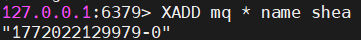
- 1772022129979是数据插入是，以毫秒为单位计算当前服务器的时间
- 0表示这条消息是第1772022129979毫秒内的第一条消息
消费者从消息队列读取消息
```redis
XREAD STREAMS mq 1772022129979-0
```
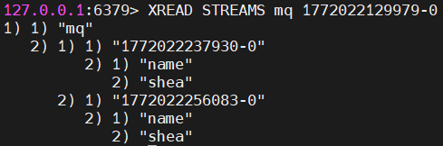
XREAD命令读取的是以当前唯一ID为起始，大于这个ID的所有消息，所以读不到1772022129979-0这条消息
阻塞读
```redis
# $符号表示读取最新的消息
XREAD BLOCK 10000 STREAMS mq $
```
Stream可以使用XGROUP创建消费组，创建消费组后，Stream可以使用XREADGROUP命令让消费组内的消费者读取消息
```redis
# 创建一个名为group1的消费组，0-0表示从第一条消息开始读取
XGROUP CREATE mq group1 0-0
```
```redis
XREADGROUP GROUP group1 consumer1 STREAMS mq 
```
**消息队列中的消息一旦被消费组里的一个消费者读取了，就不能再被该消费组内的其他消费者读取了**，但是**不同消费组的消费者可以消费同一条消息（前提条件是，创建消息组的时候，不同消费组制定了相同位置开始读取消息）**
## 淘汰策略
### 过期删除策略
**设置过期时间**
Redis中设置key过期时间的命令有4个
- expire key n ：设置key在n秒后过期
- pexpire key n：设置key在n毫秒后过期
- expireat key n：设置key在某个时间戳（精确到秒）之后过期
- pexpireat key n：设置key在某个时间戳（精确到毫秒）之后过期
**如何判断key已过期**
每当我们对一个key设置了过期时间，Redis就会把该key带上过期时间存储到一个过期字典中，过期字典存储在redisDb结构中
```c++
typedef struct redisDb{
	dict *dict; // 数据库键空间，存放所有键值对
	dict *expires; // 过期字典
} redisDb;
```
过期字典结构如下
- 过期字典的key是一个指针，指向某个键对象
- 过期字典的value是一个long long类型的整数，这个整数保存了key的过期时间
字典实际上是一个哈希表，这样可以让我们用O(1)的时间复杂度来快速查找，当我们查询一个key时，Redis首先检查该key是否存在于过期字典中
- 如果不在，则正常读取键值
- 如果存在，则会获取该key的过期时间，然后与当前系统时间进行比对，如果比系统时间大，就没有过期，否则判定该key过期
过期删除策略有以下三种
- **定时删除**：在设置key的过期时间时，同时创建一个定时事件，当时间到达时，由事件处理器自动执行key的删除操作
	**优点**：可以保证国企的key尽快被删除，内存可以被尽快释放，因此定时删除对内存是最友好的
	**缺点**：在过期key比较多的情况下，删除过期key可能会占用相当一部分CPU时间，在内存不紧张但CPU时间紧张的情况下，将CPU时间用于删除和当前任务无关的过期键上，会对服务器的响应时间和吞吐量造成影响
- **惰性删除**：不主动删除过期键，每次从数据库访问key时，都检测key是否过期，过期则删除该key
	**优点**：每次访问时，才检查该key是否过期，因此只会使用很少的系统资源，惰性删除策略对CPU时间最友好
	**缺点**：如果一个key已经过期，但是key依然保留在数据库中，那么只要这个过期key一直没有被访问，它占用的内存就不会被释放，造成了一定的内存空间浪费，对内存不友好
- **定期删除**：每隔一段时间随机从数据库中取出一定量的key进行检查，并删除其中过期的key
	**优点**：通过限制删除操作执行的时长和频率，来减少删除操作对CPU的影响，同时也能删除一部分过期的数据，减少了过期键对空间的无效占用
	**缺点**：内存清理方面没有定时删除效果好，同时惰性删除使用的系统资源更少；难以确定删除操作执行的时长和频率。如果执行的太频繁，定期删除策略变得和定时删除策略一样，对CPU不友好，如果执行的太少，又和惰性删除一样，过期的key占用的内存得不到及时释放
Redis选择了**惰性删除+定期删除**两种策略配合使用
Redis的惰性删除策略由db.c文件中的expireIfNeeded函数实现，Redis在访问或修改key时，都会调用expireIfNeeded函数对其进行检查，检查key是否过期
- 如果过期，则删除该key，至于是异步删除还是同步删除，根据lazyfree_lazy_expire参数配置，然后返回客户端
- 如果没有过期，则不做任何处理，返回正常的键值对给客户端
Redis执行定期删除策略，默认每秒进行10次过期检查数据库，此配置可由redis.conf配置文件进行配置，默认`hz 10`
在expire.c文件下的activeExpireCycle函数中，随机抽查的数量是由ACTIVE_EXPIRE_CYCLE_LOOKUPS_PER_LOOP定义的，数值是20
因此过期删除流程如下
- 从过期字典中随机抽取20个key
- 检查这20个key是否过期，并删除已过期的key
- 如果本轮检查的已过期的key的数量超过5个，也就是占比大于25%，则继续重复步骤1，否则，停止继续删除过期key，等待下一轮检查
### 内存淘汰策略
在redis.conf配置文件中，可以通过参数`maxmemory <bytes>`来设定最大运行内存，只有在Redis的运行内存达到了设置的最大运行内存，才会触发内存淘汰策略
- 64位操作系统中，maxmemory的默认值是0，表示没有内存大小限制，不管用户存放多少数据到Redis中，Redis也不会对可用内存进行检查，知道Redis实例因内存不足而崩溃也无作为
- 32位操作系统中，maxmemory的默认值是3G，因为32位机器最大只能支持4GB的内存，而系统本身就需要一定的资源来支持运行
Redis淘汰策略有以下八种
- noeviction（Redis 3.0之后，默认的内存淘汰策略）：表示当运行内存超过最大设置内存时，不淘汰任何数据，这时如果有新的数据写入，会报错通知禁止写入，不淘汰任何数据，但是如果没有数据写入，只是单纯查询或删除，还是可以正常工作的
- volatile-random：随机淘汰设置了过期时间的任意键值
- volatile-ttl：优先淘汰更早过期的键值
- volatile-lru：淘汰所有设置了过期时间的键值中，最久未使用的键值
- volatile-lfu：淘汰所有设置了过期时间的键值中，最少使用的键值
- allkeys-random：随机淘汰任意键值
- allkeys-lru：淘汰整个键值中，最久未使用的键值
- allkeys-lfu：淘汰整个键值中最少使用的键值
通过`config get maxmemory-policy`命令，可以查看当前Redis的内存淘汰策略
通过`config set maxmemory-policy <策略>`可以设置Redis的内存淘汰策略，优点是，设置后立即生效，不需要重启Redis服务，但是重启了Redis服务后，设置就会失效
通过redis.conf配置文件，设置`maxmemory-policy <策略>`，优点是重启Redis服务后配置不会丢失，缺点是必须重启Redis服务，设置才能生效
#### LRU算法
LRU即最近最少使用，会优先淘汰最近最少使用的数据
传统的LRU算法是基于链表结构，链表中的元素按照操作顺序从前往后排列，最新操作的键会被移动到表头，当需要内存淘汰时，只需要删除链表尾部的元素即可，因为链表尾部的元素就代表最久未被使用的元素
Redis实现的是一种近似LRU算法，目的是为了更好的节约内存，它的实现方式是，在Redis的对象结构体中添加一个额外的字段，用于记录此数据的最后一次访问时间
当Redis进行内存淘汰时，会采用随机采样的方式来淘汰数据，随机取5个值，然后淘汰最就没有使用的那个键值对
Redis实现的LRU算法的优点：
- 不用为所有的数据维护一个大链表，节省了空间占用
- 不用再每次数据访问时都移动链表项，提升了缓存的性能
但是LRU算法有一个问题，无法解决缓存污染，比如应用一次性读取了大量的数据，而这些数据只会被读取一次，那么这些数据留存在Redis缓存中很长一段时间，造成缓存污染
#### LFU算法
LFU即最近最不常用，LFU算法是根据数据的访问次数来淘汰数据的
LFU会记录每个数据的访问次数，当一个数据再次被访问时，会增加该数据的访问次数。这样就解决了，偶尔被访问一次后，数据留存在缓存中很长一段时间
Redis实现的LFU算法，多记录了数据访问频次信息
Redis对象头中的lru字段，在lru算法和lfu算法下使用方式并不相同
- 在LRU算法中，Redis对象头的24bits的lru字段是用来记录key的访问时间戳，因此在LRU模式下，Redis可以根据对象头中的lru字段记录的值，来比较最后一次key的访问时间长，从而淘汰最久未被使用的key
- LFU算法中，Redis对象头的24bits的lru字段被分成两段来存储，高16bit存储Ldt，低8bit存储logc
	Ldt是用来记录key的访问时间戳，logc是用来记录key的访问频次，值越小代表使用频率越低，越容易淘汰（logc会随时间的推移而衰减）
	每次Key被访问时，会先对logc做一个衰减操作，衰减的值跟前后访问时间的差距有关系，如果上一次访问的时间与这一次访问的时间差距很大，那么衰减的值就越大，这样实现的LFU算法是根据访问频率来淘汰数据的，而不只是高温次数
	对logc做完衰减操作后，就开始对logc做增加操作，增加操作并不是单纯的+1，而是根据概率增加，如果logc越大的key，它的logc就越难再增加
redis.conf中提供了两个配置项，用于调整LFU算法从而控制logc的增长和衰减
- lfu-decay-time：用于调整logc的衰减速度，是一个以分钟为单位的数值，默认值为1，lfu-decay-time值越大，衰减越慢
- lfu-log-factor：用于调整logc的增长速度，lfu-log-factor值越大，logc增长越慢
## Redis分布式锁
分布式环境中，Redis分布式锁会遇到以下问题
1. **锁争抢-多个节点抢同一把锁，导致数据错乱**
分布式系统环境下，一个节点想要拿到锁，必须要经历两步操作
**先判断这把锁当前有没有被人占用，确认空闲后再抢占锁**
但是这两步是分开做的，高并发的情况下，哪怕这两步中间只有很小的空闲，也会导致隐患
假设节点A先查询了锁的状态，发现没人占用，准备抢占的同时，节点B也在同一时间查询了所得状态，同样发现没人占用
接着，两个锁都顺利完成了枪战操作，以至于每个节点都认为自己抢到了唯一的锁。从而去同时操作同一个共享资源，最终引发数据错乱
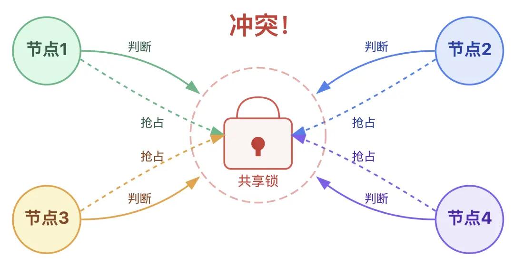
2. **僵尸锁-锁不释放，导致业务流程阻塞**
某个节点拿到锁后，但是没有给锁设定过期时间，紧接着又因为节点宕机或者程序报错，没办法主动释放锁，那么这条锁记录就会一直存在于Redis中，成为僵尸锁，一直占用着对应的共享资源
3. **锁过期-过期时间与任务时长不匹配**
某个节点拿到锁并设置完过期时间后，进入业务处理，但是在业务还没处理完之前，锁的过期时间就已经到了，一个节点释放了锁，其他节点就会来争抢，但是释放锁的节点还在继续执行原有的业务，从而导致两个节点同时修改同一个数据，造成并发冲突
4. **锁存储不可靠-单节点部署的隐患**
当存储分布式锁的Redis只用单节点部署时，意味着所有锁都只交给了一个节点，如果这个节点突然宕机，所有关于锁的操作都会卡壳，导致分布式锁机制瘫痪
### 加锁机制
加锁的核心目的是为了保证同一时间只能有一个业务操作共享资源，Redis通过两层设计来实现这个目标
#### 单节点锁
```redis
SET lock_key unique_value NX EX 30
```
这时Redis单节点锁的核心命令
`unique_value`，是每个节点生成的唯一标识，释放锁的时候，节点必须要校验这个唯一标识，只有校验通过，才能删除自己持有的锁，从而防止误删了其他节点的锁
`NX`，意味着只有当lock_key不存在时，才执行加锁操作。保证了锁的互斥性，同一时间只能有一个节点成功获取锁，从根源解决了多个节点抢占资源的问题
`EX 30`，给锁设置30秒的过期时间，超时后自动释放，不会一直占用资源不释放，从而避免了节点宕机等异常情况导致的僵尸锁
这条SET命令是一步完成的原子操作，从而避免了高并发场景下出现的问题
**要么指令未执行，没有抢到锁；要么指令完整执行，抢到的锁自带过期时间**
#### 高可用锁
主从架构锁丢失：客户端在Master加锁成功，但是锁信息未同步到Slave节点前Master宕机，新的Master上没有锁，其他客户端再次加锁成功
为了防止Redis节点宕机，整个锁机制就会失效的问题，提出了RedLock算法，即
部署N个（奇数个）独立的Redis Master，客户端必须在超过半数（N/2+1）的节点上加锁成功，才能真的获取到锁，步骤如下
- 向N个独立的Redis锁节点依次发送SET NX EX加锁请求
- 统计成功给资源加锁的节点数量，若超过一半，则判定加锁成功
- 如果少于一半，则说明加锁失败，所有节点释放锁
这样，即使部分节点宕机，剩余的多数节点依然能够通过投票的方式正常提供锁服务，从而避免了单节点宕机，导致的锁机制故障
#### 等待重试
当我们使用SETNX失败时，客户端不应立即返回失败，而是进入等待阶段
**如何等待锁**
当加锁失败，有两种主流的等待策略
- 循环轮询：加锁失败后，线程sleep 100ms，然后再次尝试setnx，直到加锁成功或超出总的等待超时时间。通常情况下，锁的总的等待超时时间应该约等于一个锁的平均持有时间。例如如果我们监控统计发现99%的业务执行时间都在800ms内，那么总的等待时间设为1s就是个合理的选择。这种方式实现简单，但是缺点是会带来不必要的sleep和频繁的Redis查询，空耗资源
- 事件监听：使用Redis的发布订阅机制。枷锁失败的客户端可以订阅lock_key的删除事件。当锁被释放时，Redis会主动通知所有订阅者，它们就会再重新尝试加锁，实时性更好，也更节省客户端和服务端资源，但是实现起来相对复杂
**如何重试加锁**
分布式环境中，网络抖动是常态。如果一个客户端发起setnx命令后，收到了一个超时响应，这是我们就不知道到底有没有加上锁了
如果直接重试，可能会覆盖一个已经加锁成功的状态。这时候就必须要保证**操作的幂等性**。我们必须让锁的持有者能够识别自己的锁。具体做法是，在加锁时，valu是一个全局唯一的ID。例如我们在设置一个锁时，超时了，客户端发起重试请求。这时候不能直接SETNX，而是应该先GET key
- GET返回nil：这说明上一次的SETNX没有执行成功，这时候客户端可以直接再次执行SETNX命令
- GET返回自己的唯一ID：这说明上一次的SETNX执行成功了，只是响应包丢失了。客户端已经成功持有锁，就只需要重置一下这把锁的过期时间，然后等待返回加锁成功
- GET返回其他锁的ID：这说明在客户端A重试期间，锁被客户端B拿走了。此时客户端A重试失败，进入等待
#### 锁过期与续约
SETNX + DEL模型有一个缺陷：如果一个客户端加锁成功后，业务还没执行完就已经宕机了，这个锁就永远都不会DEL，锁变成了死锁，其他所有客户端都只能一直等待下去，导致整个业务线瘫痪
**为什么要有过期时间**
为了防止持有者宕机导致死锁，就必须给锁加上过期时间，但是注意，加锁和设置锁过期时间必须是一个原子操作，否则客户端如果在这两个操作之间宕机，依旧会产生死锁
可以使用
```redis
set lock_key unique_value ex 30 nx
```
这条命令是原子操作，等价于SETNX + EXPIRE，这样即使持有锁的客户端宕机，锁也会在30秒后自动释放，可以让其他客户端获得锁
**过期时间**
过期时间通常会根据业务场景而定。取99.9%分位线，再加上一个合理的缓冲。例如，99.9%的请求在5秒内完成，就可以把过期时间设置为10秒或者20秒。**过期时间主要是为了防止宕机导致的死锁问题**，而在绝大多数情况下，锁都应该由客户端在业务执行完毕后主动释放。因此，把锁的过期时间设置长一点，比如30s 或 1min 都是合理的
**锁续约机制**
业务执行过程中，总会出现某一个业务的执行时间超过了过期时间，这时候就出现，业务A释放锁后，业务B获取到锁，然后业务A执行完毕后，再一次释放锁，就会导致数据混乱，且会错误的释放了其他线程持有的锁
为了解决这个问题，Redis引入了锁续约机制，即看门狗机制。客户端加锁成功后，会启动一个后台线程，周期性（锁过期时间的1/3）地检查客户端是否还持有锁，如果还持有锁，就给锁重置一下过期时间
**锁续约失败策略**
假设在尝试EXPIRE时，因为网络问题或Redis故障而导致连续失败，直到锁过期都没成功，导致锁被其他的线程拿到。
解决这个问题，有以下两种策略：
- 保守策略：续约失败意味着锁的归属权已经丢失，业务逻辑必须立即中断并回滚，向上层抛出异常。这时对数据一致性最严格的保障
- 激进策略：假设续约失败是小概率时间，业务逻辑继续执行。可能会导致数据不一致，但是系统可用性更高
**业务中断策略**
分布式锁出现了问题，分布式锁框架并不能直接帮忙中断业务，它只能在续约失败时，给业务代码发送一个中断信号（比如设置一个volatile标志位，或者调用线程的interrupt()方法）。是否中断，如何中断，完全取决于业务代码如何实现
- 假如业务是一个大循环，在每个循环开始前，检测一下中断信号
```java
for (int i = 0; i < data.size(); i++) {
	// 锁框架续约失败时，会设置一个中断标识
	if(lock.isInterrupted()) {
		// 终端策略，执行回滚
		break;
	}
	/*
	执行业务逻辑
	*/
}
```
- 如果你的业务没有循环，而是由多个步骤构成，就可以在每一个关键步骤之后都检测一下
```java
step1();
if (lock.isInterruped()) {
	// 中断并返回
	return;
}
// 关键步骤间检测中断信号
step2();
if (lock.isInterruped()) {
	// 中断并返回
	return;
}
step3();
```
### 释放锁机制
加锁的时候，我们使用了unique_value为锁设置了一个专属标识，释放锁的时候，也需要去判断这个标识是否一样
释放锁的时候，必须要先**判断标识，再删除锁**，但是这个操作不是原子的，可能会出现以下问题
比如节点判断完，发现锁是自己的，在删除之前，这把锁的过期时间就到了，系统自动释放了锁，释放锁后一瞬间又有其他节点抢到了这把锁。之后等到节点释放锁的时候，释放的就不是自己的锁，而是其他节点抢到的锁了
因此Redis提供了Lua脚本支持，通过Lua脚本将判断和删除这两个操作封装成一个原子操作
```lua
if redis.call("get",KEYS[1]) == ARGV[1] then
	return redis.call("del",KEYS[1])
else
	return 0
end
```
### 看门狗机制
对于一些复杂的场景，设置锁过期时间也是一个较麻烦的事情
假设锁设置的过期时间太短，业务还没执行完，锁就已经被释放了，假设锁设置的时间过长，业务执行过程中宕机了，要等很久才会释放锁
对于这个问题，Redis引入了看门狗机制（Java中，有看门狗机制的分布式锁，需要引入redisson依赖）
看门狗机制即，当节点成功抢到锁后，系统会在这个节点上启动一个守护线程，这个线程每过一段时间（锁过期时间的1/3），就会自动为锁续期，只要业务还没有执行完毕。当业务正常执行结束后，客户端主动释放锁，停止看门狗机制；业务线程宕机后，守护线程也会自动终止，无法给锁续期
看门狗机制有以下缺点：
1. 要部署多个主节点，运维成本高
2. 加锁需要访问多个节点，性能比单节点低
3. 节点之间的时钟可能不一致，极端情况下可能还是有问题
4. Java的GC可能暂停线程，导致看门狗无法续期，锁过期
## 可重入性
一个线程在持有锁的情况下，再次请求同一个锁会请求失败
使用Redis Hash结构，Key是锁名，Field是客户端Id，Value是重入次数，使用HINCRBY原子地增加计数
## ZipList
**ZipList**是Redis为节省内存而设计的一个紧凑的线性数据结构，广泛用于列表键（当元素少且为小整数/短字符串时）和哈希键（当字段少且为小键值对时）的底层实现
为了节省内存，ZipList的每个节点占用的内存大小都可以不同，每个节点都可以用来存储一个字符串或一个整型
### 压缩列表组成
1. Zlbytes：ZipList的长度，是一个32位无符号整数
2. Zltail：ZipList最后一个节点的偏移量，反向遍历和pop尾部节点时有用
3. Zllen：ZipList的节点的个数
4. entry：节点
5. Zlend：值为0xFF，用于标记ZipList的结尾
### Entry
每个节点由三部分构成：
prevlength：记录上一个节点的长度，为了方便反向遍历ziplist
encoding：当前节点的编码规则
data：当前节点的值，可以是数字或字符串
为了节省内存，根据上一个节点的长度prevlength可以将节点分为两类：
entry的前八位小于254，则这八位就表示上一个节点的长度
entry的前八位等于254，则意味着上一个节点的长度无法用八位表示，后面的32为才是真实的prevlength（不用255作为分界是因为255是zlend的值，用于判断ziplist是否到达尾部）
## Redis持久化
### RDB (Redis Database Backup file)
RDB是将Redis在内存中的数据保存到磁盘上，保存的是数据快照（二进制文件）
RDB持久化机制中，Redis会周期性的将内存中的数据写入到磁盘中，保存为一个rdb文件，通过快照的方式保存数据，可以见效数据集的大小，在恢复大数据集的时候速度较快
但是由于保存的是快照，可能会丢失最后一次快照之后的数据，适合对数据丢失要求不严格的场景
#### 执行RDB
**save**：由Redis主进程来执行RDB，会阻塞所有命令（服务在停机时会执行一次RDB）
**bgsave**：开启子进程执行RDB，避免主进程收到影响
bgsave开始时会fork主进程得到子进程，子进程共享主进程的内存数据，完成fork后读取内存数据并写入RDB文件，为了提高fork进程的速度，以减少主进程的阻塞时间，子进程会直接fork主进程的页表，通过页表映射到对应的物理内存，就不需要复制物理内存里的数据了
执行RDB的快照是全量快照，也就是说每次执行快照，都是把内存中的所有数据都记录到磁盘中，所以，执行快照是一个比较重的操作，如果频率太频繁，可能会对Redis性能产生影响。如果频率太低，服务器故障时，丢失的数据更多
执行bgsave过程中，Redis依然可以继续处理操作命令，就是用的写时复制技术
**copy-on-write**：当主进程执行读操作时，访问共享内存，当主进程执行写操作时，则会拷贝一份数据，执行写操作
bgsave快照过程中，如果主线程修改了共享数据，发生了写时复制后，这一次的bgsave是无法将修改后的数据记录到RDB文件中的，必须要交给下一次bgsave来完成
所以，Redis在使用bgsave快照过程中，如果主线程修改了内存数据，不管是否是共享的内存数据，RDB快照都无法写入主线程刚修改的数据，因为此时主线程的内存数据和子进程的内存数据已经分离了，子进程写入到RDB文件的内存数据只能是原本的内存数据
如果系统恰好在RDB快照文件创建完后崩溃了，Redis将会丢失主线程在快照期间修改的数据
例如下列例子
在Redis执行RDB持久化期间，刚fork时，主进程和子进程共享同一物理内存，但是途中主进程处理了写操作，修改了共享内存，于是当前被修改的数据的物理内存就会被复制一份，极端情况下，如果所有的共享内存都被修改，则此时的内存占用是原先的2倍
#### RDB和AOF
尽快RDB比AOF的数据恢复速度快，但是快照的频率不好把握
- 如果频率太低，两次快照间一旦发生了服务器宕机，就看丢失比较多的数据
- 如果频率太高，频繁写入磁盘和创建子进程会带来额外的性能开销
Redis 4.0提出，可以混用AOF日志和RDB内存快照，混合持久化
开启混合持久化，需要在redis.conf中设置
```
aof-use-rdb-preamble yes
```
混合持久化工作在AOF日志重写过程
当开启了混合持久化时，AOF重写日志时，fork出来的重写子进程会先将与主进程共享的内存数据以RDB方式写入到AOF文件，然后主进程处理的操作命令会被记录在重写缓冲区里，重写缓冲区里的增量命令会以AOF方式写入到AOF文件，写入完成后通知主进程将有新的含有RDB格式和AOF格式的AOF文件替换旧的AOF文件
即，混合持久化，AOF文件的前半部分是RDB格式的全量数据，后半部分是AOF格式的增量数据
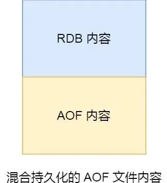
这样的好处是，在重启Redis加载数据的时候，由于前半部分内容是RDB，**加载的速度会很快**，加载完RDB的内容后，才会加载后半部分的AOF内容，这里的内容是Redis后台子进程重写AOF期间，主进程处理的操作命令，可以使**数据更少的丢失**
### AOF (Append Only File)
AOF是将Redis服务器执行的所有写操作都记录到一个日志文件中，采用追加的方式写入，保证了数据不会丢失
AOF文件保存的是Redis执行的原始命令，具有较好的可读性，AOF文件通常较大，因此可以提供更好的数据持久性，数据丢失概率更低
Redis中AOF持久化默认是不开启的，需要修改redis.conf配置文件
```
appendonly yes // 是否开启aof持久化
appendfilename "appendonly.aof" // aof持久化文件的名称
```
Redis都是先执行写操作命令后，才将命令记录到AOF日志里的，有以下两个好处
- **避免额外的检查开销**：如果先将写操作命令记录到AOF日志里，再执行该命令的话，如果当前命令语法有问题，那么如果不进行命令语法检查，该错误的命令记录到AOF日志里后，Redis在使用日志恢复数据时，可能会出错
	而先执行写操作命令，再记录日志的话，只有在该命令执行成功后，才将命令记录到AOF日志里，这样就不用额外的检查开销，保证记录在AOF日志里的命令都是可执行且正确的
- **不会阻塞当前写操作命令的执行**：因为当写操作命令执行成功后，才会将命令记录到AOF日志里
但是AOF持久化功能也有潜在风险
- 执行写操作命令和记录日志是两个过程，那么当Redis还没来得及将命令写入到硬盘时，服务器发生宕机了，数据就有丢失的风险
- AOF日志的记录虽然不会阻塞当前写操作，但是可能会阻塞到下一个命令
因为将命令写入到日志这个操作也是在主进程完成的，也就是说这两个操作是同步的，如果将日志内容写入到硬盘时，服务器硬盘的IO压力太大，就会导致写硬盘的速度很慢，从而阻塞主线程
#### 三种写回策略
Redis执行完写操作命令后，会将命令追加到server.aof_buf缓冲区，然后通过write()系统调用，将aof_buf缓冲区数据写入到AOF文件，此时数据并没有写入到硬盘，而是拷贝到了内核缓冲区page cache，等待内核将数据写入硬盘，具体什么时候写入硬盘，有内核决定
具体的写回策略，有以下三种
- Always，每次执行完写操作命令，同步将AOF日志数据写回硬盘。**可靠性最高，但是可能会影响主进程的性能**
- Everysec，每次写操作命令执行完后，先将命令写入到AOF文件的内核缓冲区，然后每隔一秒将缓冲区的内容写回到硬盘。**可靠性较高，性能适中**
- No，Redis不控制写回硬盘的时机，转交给操作系统控制协会的时机，也就是每次写操作命令执行完后，先将命令写入到AOF文件的内核缓冲区，再由操作系统决定何时将缓冲区内容写回到硬盘。**性能最好，但是宕机丢失的数据也最多**
#### AOF重写
由于是记录命令，AOF文件会比RDB文件大得多。而且AOF会记录对同一个key的多次写操作，但只有最后一次写操作才有意义。因此会通过**bgrewriteaof**命令，对AOF文件进行重写，只记录最后一次写操作
重写工作完成后，就会将新的AOF文件覆盖旧的AOF文件，压缩了AOF文件的体积
尽管某个键值对被多条写命令修改，最终也只需要根据这个键值对当前的最新状态，然后用一条命令去记录键值对，减少了AOF命令的数量
**为什么不直接复用现有的AOF文件，而是要先写到新的AOF文件再覆盖过去**
因为如果AOF重写过程中失败了，就会造成现有的AOF文件被污染，可能无法用于恢复使用，而先写到新的AOF文件再覆盖，就不会对现有的AOF文件造成影响
#### AOF后台重写
在触发AOF重写时，当AOF文件大于64M时，就会对AOF文件进行重写，这时需要读取所有缓存的键值对数据，并为每个键值生成一条命令，然后将其写到新的AOF文件中，重写完后，就把当前AOF文件替换掉
因为这个过程非常耗时，所以Redis重写AOF过程是由后台子进程bgrewriteaof来完成的，有以下两个好处
- 子进程进行AOF重写期间，主进程可以继续处理命令请求，从而避免阻塞主进程
- 子进程带有住进程的数据副本，这里使用子进程而不是使用线程，**因为多线程之间或共享内存，那么在修改共享内存数据时，就需要通过加锁来保证数据安全，这样就会降低性能**。而使用子进程，**创建子进程时，父子进程是共享内存数据的，不过这个共享的内存只能以只读的方式，而当父子进程任意一方修改了该共享内存，就会发生写时复制，父子进程就有了独立的数据副本，就不用通过加锁来保证数据安全**
主进程在通过fork系统调用生成bgrewriteaof子进程时，操作系统会把主进程的页表复制一份给子进程，这个页表记录了虚拟地址和物理地址的映射关系，不会复制物理内存
这样一来，子进程就共享了父进程的物理内存数据，就能够节约物理内存资源，页表对应的页表项属性会标记该物理内存的权限为只读
**写时复制**
当父进程或子进程在向这个内存发起写操作时，CPU就会触发写保护中断，这个写保护中断是由于违反权限导致的，然后操作系统在写保护中断处理函数里进行物理内存复制，并重新设置其内存映射关系，将父子进程的内存读写权限设置为可读写，然后才会对内存进行写操作
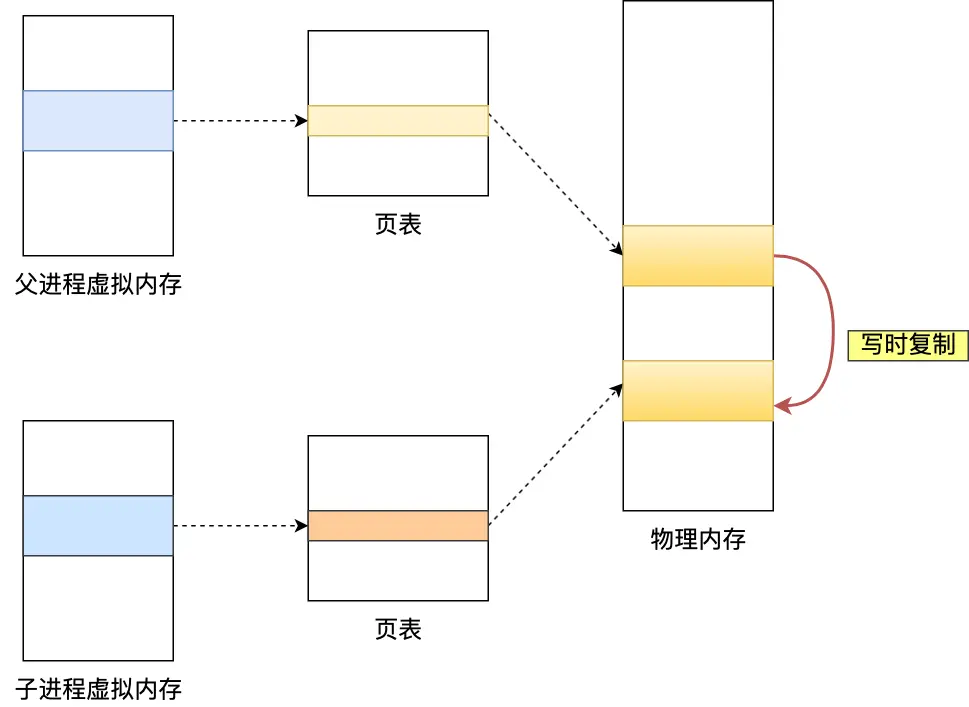
写时复制，即在发生写操作时，操作系统才会去复制物理内存，这样是为了防止fork创建子进程时，由于物理内存数据的复制时间过长而导致父进程长时间阻塞的问题
当操作系统复制父进程页表时，父进程也是阻塞中的，不过页表大小相比于实际的物理内存小很多，所以通常复制页表的过程也比较快
如果父进程的内存数据非常大，那么页表也会很大，这时父进程在通过fork创建子进程的时候，阻塞的时间也越久
有以下两个阶段会阻塞父进程
- 创建子进程的途中，由于要复制父进程的页表等数据结构，阻塞的时间跟页表的大小有关，页表越大，阻塞的时间越长
- 创建完子进程后，如果子进程或父进程修改了共享数据，就会发生写时复制，这期间会拷贝物理内存，如果内存越大，阻塞的时间也就越长
触发重写机制后，主进程会创建重写AOF的子进程，此时父子进程共享物理内存，重写子进程只会对这个内存进行只读，重写AOF子进程会读取数据库里的所有数据，并逐一把内存数据的键值对转换成一条命令，再将命令记录到重写日志里
如果此时，**主进程修改了已经存在的键值对，就会发生写时复制，这里只会复制主进程修改的物理内存数据，没修改物理内存的还是与子进程共享**
如果修改的是一个比较大的键值对，这时复制内存数据就会比较耗时，有阻塞主进程的风险，并且在重写AOF日志过程中，如果主进程修改了已经存在的键值对，此时这个键值对数据在子进程的内存数据跟主进程的内存数据不一致了
Redis设置了一个AOF重写缓冲区，这个缓冲区在创建bgrewriteaof子进程后开始使用
在重写AOF期间，当Redis执行完一个写命令后，会同时将这个写命令写入到AOF缓冲区跟AOF重写缓冲区，当子进程完成了AOF重写工作，就会向主进程发送一条信号，信号是进程间通讯的一种方式，并且是异步的
主进程收到该信号后，会调用一个信号处理函数
- 将AOF重写缓冲区中的所有内存追加到新的AOF文件中，是的新旧两个AOF文件所保存的数据库状态一直
- 新的AOF文件进行改名，覆盖现有的AOF文件
## 主从架构
如果只把数据部署在一台服务器上，若是服务器发生了宕机，由于数据恢复需要时间，而这段时间内是无法发出新的请求的。而如果服务器的硬盘出现了故障，还可能导致数据丢失
单节点Redis的并发能力是有上限的，要进一步提高Redis的并发能力，就要搭建主从集群，实现读写分离，在主节点进行写操作，从节点进行读操作
### 数据同步原理
**全量同步**：主从第一次同步是全量同步，从节点执行replicaof命令与主节点建立连接，slave节点先请求增量同步，master节点判断replid，发现不一致，拒绝增量同步，master节点生成RDB文件，然后将RDB文件发送给slave节点，slave节点清空原数据，加载RDB文件，在RDB期间，master节点的命令记录在repl_baklog中，RDB完成后，master将repl_baklog发送给slave，slave进行同步
如何判断是否第一次同步？
Replication Id：数据集的标记，id一致则说明是同一数据集，slave会集成master节点的replid，id不一样则是第一次同步
offset：随着记录在repl_baklog中的数据增多而增大，slave完成同步时也会记录当前同步的offset，如果slave的offset小于master的offset，说明slave的数据落后于master，需要更新
**增量同步**：从节点宕机一段时间，重启后，向主节点发送增量同步的请求
增量同步失败的情况：repl_baklog大小有上限，写满后会覆盖最早的数据，如果slave断开时间过久，导致数据被覆盖，则无法实现增量同步，只能再次进行全量同步
### 主从第一次同步
主从服务器第一次同步可以分为以下三个阶段
- 第一阶段是建立链接、协商同步
- 第二阶段是主服务器同步数据给从服务器
- 第三阶段是主服务器发送新写操作命令给从服务器
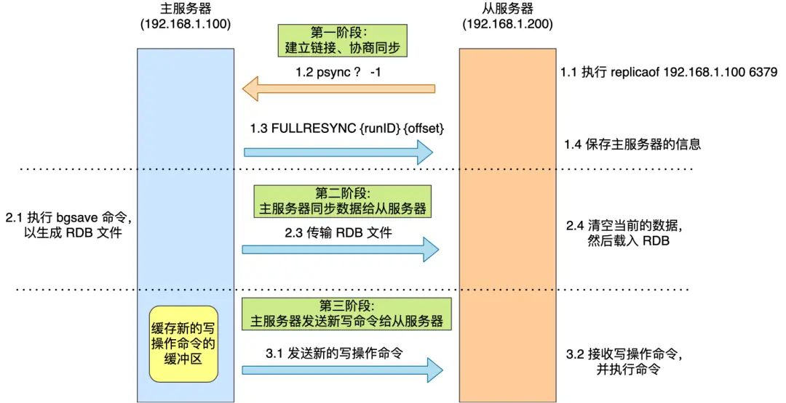
**建立链接、协商同步**
从节点执行了replicaof命令后，从服务器就会给主服务器发送psync命令，表示要进行数据同步，并且会带上两个参数replication id和offset
主服务器收到psync命令后，会用FULLRESYNC作为响应命令返回给对方
FULLRESYNC响应命令的意图是采用全量复制的方式，将主服务器中所有的数据都同步给从服务器
**主服务器同步数据给从服务器**
主服务器会执行bgsave命令来生成RDB文件，然后把文件发送给从服务器，从服务器接收到RDB文件后，会先清空当前的数据，然后载入RDB文件，由于主服务器生成RDB文件的过程中，是异步的，这期间写操作命令并不会记录到刚刚生成的RDB文件中，这时主从服务器的数据就不一致了
为了保证主从服务器的数据一致性，主服务器在下面这三个时间间隙中将收到的写操作命令，写入到replication buffer缓冲区中
- 主服务器生成RDB文件期间
- 主服务器发送RDB文件给从服务器期间
- 从服务器加载RDB文件期间
**主服务器发送新的写操作命令给从服务器**
在主服务器生成的RDB文件发送完，从服务器收到RDB文件后，丢弃所有旧数据，将RDB数据载入到内存。完成RDB的载入后，会回复一个确认消息给主服务器
接着，主服务器将replication buffer缓冲区里所记录的写操作命令发送给从服务器，从服务器执行来自主服务器replication buffer缓冲区里发来的命令，这时主从服务器的数据就一致了
#### 命令传播
主从服务器完成第一次同步后，双方就会维护一个TCP连接
后续主服务器可以通过这个连接将写操作命令传播给从服务器，然后从服务器执行该命令，使得与主服务器的数据库状态相同
这是一个长连接，目的是避免频繁的TCP连接和断开带来的性能开销
#### 分担主服务器压力
主从服务器第一次数据同步的过程中，主服务器会做两件耗时的操作，生成RDB文件和传输RDB文件
主服务器可以有多个从服务器的，如果从服务器数量非常多，而且都与主服务器进行全量同步的话，就会有两个问题
- 由于是通过bgsave命令生成RDB文件的，那么主服务器就会忙于使用fork()创建子进程，如果主服务器的内存数据非常大，执行fork()函数时是会阻塞主线程的，从而使得Redis无法正常处理请求
- 传输RDB文件会占用主服务器的网络带宽，对主服务器响应命令请求产生影响
对于Redis来说，从服务器也可以有自己的从服务器，因此从服务器在接收主服务器的同步数据，自己同时也可以作为主服务器的形式将数据同步给从服务器
例如，我们在从服务器上执行replicaof命令，使其作为目标服务器的从服务器，如果此时目标服务器也是从服务器，那么这个目标服务器在接收主服务器数据同步的同时，自己也可以通过RDB同步数据给自己的从服务器
### 增量同步
由于TCP连接可能收到网络波动的影响，导致断开，如果主从服务器间的网络断开了，就无法进行命令传播了，这期间的主从服务器之间的数据就没办法同步，客户端可能从从服务器中读取到旧数据
重新连接后，如果使用全量同步，会导致开销太大，因此Redis采用了增量同步的方式，只将网络断开期间收到的写操作命令，同步给从服务器
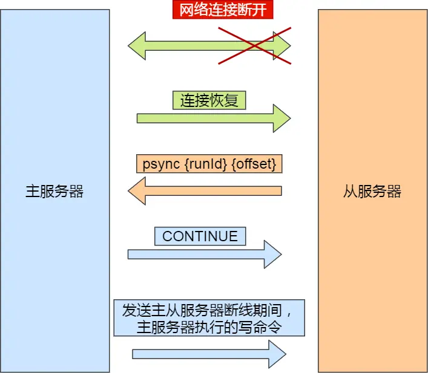
增量同步主要有以下三个步骤：
- 从服务器在恢复网络后，会发送psync命令给主服务器，此时psync命令里的offset参数不是-1
- 主服务器接收到该命令后，使用CONTINUE响应命令高速从服务器接下来采用增量复制的方式同步数据
- 然后主服务器将主从服务器断线期间，所执行的写命令发送给从服务器，然后从服务器执行这些命令
主服务器通过以下内容，将增量数据发送给从服务器
- repl_backlog_buffer：是一个环形缓冲区，用于主从服务器断连后，从中找到差异的数据，**因为是环形缓冲区，假如主从服务器断连时间过久，可能会导致部分数据被覆盖；主服务器的写入速度如果远超于从服务器的读取速度，也可能导致缓冲区的数据被覆盖**，缓冲区的默认大小是1M
- replication offset：标记上面那个缓冲区的同步进度，主从服务器都有各自的偏移量，主服务器使用master_repl_offset来记录写到的位置，从服务器通过slave_repl_offset来记录读到的位置
主服务器进行命令传播的时候，不仅会将写命令发送给从服务器，还会将写命令写入到repl_backlog_buffer缓冲区中，因此这个缓冲区里会保存着最近传播的写命令
网络断开后，当从服务器重新连上主服务器时，从服务器会通过psync命令将自己的复制偏移量slave_repl_offset发送给主服务器，主服务器根据自己的master_repl_offset和slave_repl_offset之间的差距，然后来决定对从服务器执行哪种同步操作
- 如果判断出从服务器要读取的数据还在repl_backlog_buffer缓冲区里，那么主服务器将采用增量同步的方式
- 如果要读取的数据已经不在repl_backlog_buffer缓冲区里了，主服务器将采用全量同步的方式
因此，为了避免在网络恢复时，主服务器频繁采用全量同步的方式，我们可以将缓冲区的大小尽可能的设置大一些，减少出现从服务器要读取的数据被覆盖的概率，从而使得主服务器采用增量同步的方式
### 哨兵模式
如何处理master节点宕机？
Redis提供了哨兵(Sentinel)机制来实现主从集群的自动故障恢复
当master故障时，Sentinel会将一个slave提升为master，故障实例恢复后也以新的master为主
哨兵节点主要负责三件事：监控、选主、通知
#### 服务状态监控
Sentinel基于心跳机制检测服务状态，每隔1秒向集群的每个实例发送ping命令
**主观下线**：如果某个Sentinel节点发现某实例未在规定时间内响应，则认为该实例是主观下线
**客观下线**：当一个哨兵判断主节点主观下线后，就会向其他哨兵发起命令，其他哨兵收到这个命令后，就会根据自身和主节点的网络状况，做出赞成投票或拒绝投票的响应，若超过指定数量(quorum)的sentinel都认为该实例主观下线，则该实例客观下线，quorum值最好超过sentinel实例数量的一半，这样就可以避免单个哨兵因为自身网络状况不好，而误判主节点下线的情况
#### 选择新的master
当主节点客观下线时，就需要通过一个哨兵节点进行主从故障转移
因为只能有一个节点来选择新的master，所以需要在哨兵集群中选出一个leader，让leader来进行主从切换，在投票开始前，还需要一个候选者，候选者即判断主节点客观下线的节点
候选者会向其他哨兵发送命令，表明希望成为leader来执行主从切换，并让其他所有哨兵给它投票
选出哨兵leader后，就可以进行主从故障转移，包含以下四步
**选出新的主节点**
故障转移的第一步就是在所有从节点中，挑选出一个状态良好，数据完整的从节点，然后向这个从节点发送`slaveof no one`命令，将从节点转换为主节点
选择从节点的过程并不是随机的，会参考以下几个过程
- **优先级**：Redis中有一个slave-priority，可以给节点设置优先级，优先级越高，就越容易被选中
- **复制进度**：如果优先级最高的节点有两个，会参考从节点的复制进度，从节点的slave_repl_offset越接近主节点的master_repl_offset，就说明复制进度越靠前，越容易被选为主节点
- **ID号**：如果上述两个参考都一样，就会比较两个从节点的ID，ID越小，越容易被选为主节点
在发送slave of no one后，哨兵leader会以每秒一次的频率向被升级的从节点发送INFO命令（没进行故障转移前，频率是每十秒一次），并观察命令回复中的角色信息，当被升级节点的角色信息从原来的slave变为master后，哨兵leader就知道被选中的从节点成功变为主节点了
**将从节点指向新的主节点**
选出新的主节点后，就要让所有的从节点指向新的主节点，哨兵leader会向所有的从节点发送slaveof命令，让它们成为新的主节点的从节点
**通知客户端主节点已更换**
通过Redis的发布者/订阅者机制来实现。每个哨兵节点提供发布者/订阅者机制，客户端从哨兵订阅消息
客户端和哨兵建立连接后，客户端会订阅哨兵提供的频道。主从节点切换完成后，哨兵就会向频道发送新主节点的IP地址和端口的消息，这个时候客户端就可以收到这条信息，然后用新的主节点的IP地址和端口进行通信
**将旧主节点变为从节点**
当旧主节点重新上线后，哨兵集群就会向它发送slaveof命令，让它成为新主节点的从节点
## Redis Cluster
Redis Cluster 是 Redis官方提供的分布式集群解决方案。可以让数据自动分散到多个Redis节点上，从而实现数据水平扩展和高可用性
相比于哨兵模式，每个节点存储的数据都是一样的，浪费内存，而且不好在线扩容
Redis Cluster实现的分布式存储，对数据进行分片，每台Redis节点上存储不同的内容，来解决在线扩容的问题，并且它可以保存大量数据，即分散数据到各个Redis实例，还能提供复制和故障转移功能
### 哈希槽
Redis Cluster采用了哈希槽，来处理数据和实例之间的映射关系
一个切片集群被分为16384个slot，每个进入Redis的键值对，根据key进行散列，分配到这16384个slot的其中一个。当需要存入一个key时，集群先对key进行CRC16算法计算出一个16bit的值，然后对16384取模。数据库中的每个键都属于这16384个槽的其中一个，集群中的每个节点都可以处理这16384个槽，集群中的每个节点负责一部分槽位
例如：3 个节点的集群，节点 A 负责 0-5000 号槽，节点 B 负责 5001-10000 号槽，节点 C 负责 10001-16383 号槽。
当需要增加或删除节点时，只需要将一部分哈希槽和对应的数据从现有节点迁移到新的节点即可，不需要重启整个集群
### 重定向
客户端给一个Redis实例发送数据进行读写操作时，如果实例上并没有相应的数据，就会有**MOVED重定向**和**ASK重定向**
在Redis Cluster模式下，节点对请求的处理过程如下：
- 通过哈希槽映射，检查当前Redis Key是否存在当前节点
- 若哈希槽不是由自身节点负责，就返回MOVED重定向
- 若哈希槽确实由自身负责，且key在slot中，则返回该key对应的结果
- 若Redis key不存在此哈希槽中，检查该哈希槽是否正在迁出
- 若Redis key正在迁出，返回ASK错误重定向客户端到迁移的目的服务器上
- 若哈希槽未迁出，检查哈希槽是否导入中
- 若哈希槽导入中且有ASKING标记，则直接操作，否则返回MOVED重定向
#### Moved重定向
客户端给一个Redis实例发送数据读写操作，如果计算出来的槽不是在该节点上，这时候它会返回Moved重定向错误，Moved重定向错误中，会将哈希槽所在的新实例的IP和port端口带回去。这就是Moved重定向机制
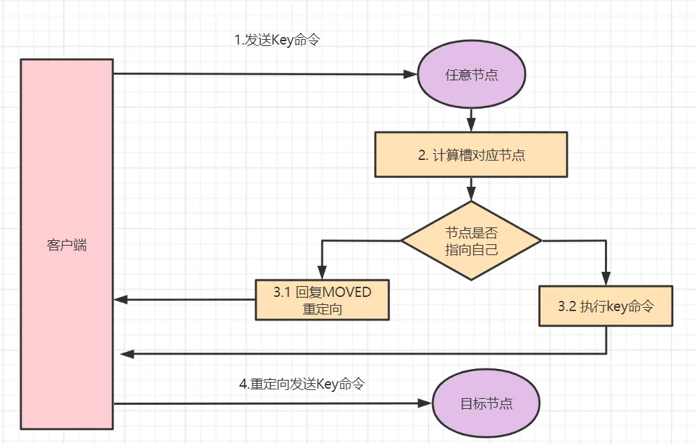
#### Ask重定向
Ask重定向一半发生于集群伸缩的时候。集群伸缩会导致槽迁移，当我们去源节点访问时，此时数据可能已经迁移到了目标节点，使用Ask重定向就可以解决此情况
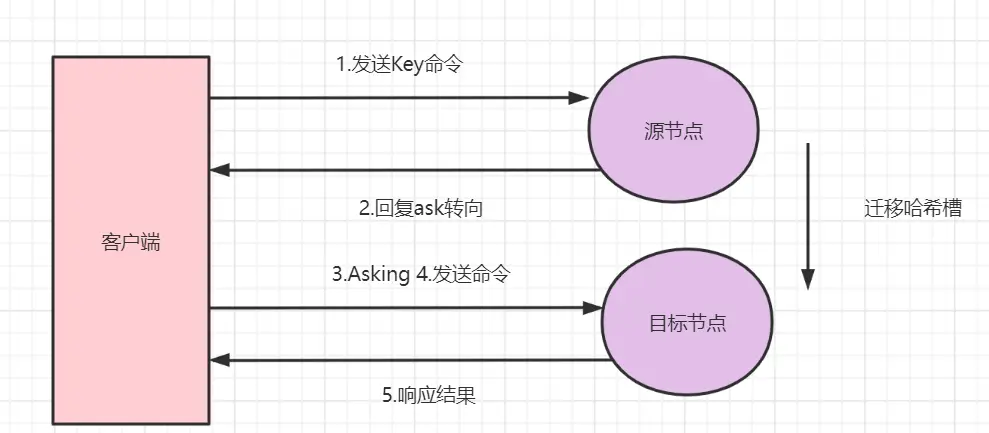
### Gossip协议
一个Redis集群由多个节点组成，各个节点之间通过Gossip协议进行通信。Gossip是一种谣言传播协议，每个节点周期性地从节点列表选择k个节点，将本节点存储的信息传播出去，直到所有节点信息一直，即算法收敛了（算法收敛指的是一个确定性的状态：集群中所有节点对某一信息的认知达成了一致，不存在分歧）
**Gossip协议基本思想**：
一个节点想要分享一些信息给网络中的其他的一些节点。于是，它周期性的随机选择一些节点，并把信息传递给这些节点。这些收到信息的节点接下来会做同样的事情，把这些信息传递给其他一些随机选择的节点。一般而言，信息会周期性的传递给N个目标节点，而不是一个。N被称为fanout（fanout即扇出，指的是单个节点在每一轮通信周期中，会主动把信息发给多少个其他节点）
Redis Cluster集群通过Gossip协议进行通信，节点之前不断交换信息，交换的信息内容包括节点出现故障、新节点加入、主从节点变更信息、slot信息等
gossip协议包含多种消息类型，ping、pong、meet、fail等
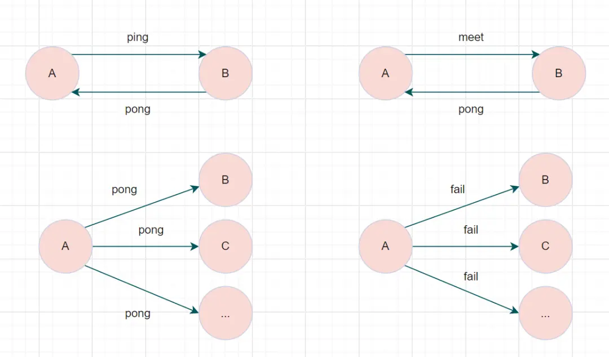
- meet消息：通知新节点加入。消息发送者通知接受者加入到当前集群，meet消息通信正常完成后，接收节点会加入到集群中并进行周期性的ping、pong消息交换
- ping消息：节点每秒会向集群中其他节点发送ping消息，消息中带有自己已知的两个节点的地址、槽、状态信息、最后一次通信时间等
- pong消息：当接收到ping、meet消息时，作为响应消息回复给发送方确认消息正常通信。消息中同样带有自己已知的两个节点信息
- fail消息：当节点判断集群内另一个节点下线时，会向集群内广播一个fail消息，其他节点接收到fail消息后把对应的节点更新为下线状态
每个节点是通过集群总线与其他的节点进行通信的。通讯时，使用特殊的端口号，即对外服务端口号加10000。例如如果某个node的端口号是6379，那么它与其它nodes通信的端口号是16379。nodes之间的通信采用特殊的二进制协议
### 故障转移
Redis集群实现了高可用，当集群内节点出现故障时，通过故障转移，以保证集群正常对外提供服务
这里的故障转移与主从架构中的故障转移基本一致，不想写了
## 缓存异常
Redis作为中间层引入，因为其基于内存的特性，可以使得程序的读写速度更快，提高了系统的性能
但是缓存会出现三种问题：缓存雪崩，缓存击穿，缓存穿透

### 缓存雪崩
我们在往Redis中存储数据时，通常会设置一个过期时间，当数据过期后，用户访问的数据如果不在缓存里面，系统就需要去数据库里重新查询数据，并将其存入Redis中
但是，**如果在某一时刻，大量缓存数据在同一时间过期，或者Redis故障宕机。此时如果有大量的用户请求，就都无法从Redis中获取到数据，大量的请求都会直接打到数据库中**，使得数据库压力骤增，甚至可能导致数据库宕机，引起一系列问题，这就是缓存雪崩
对于这个问题，有以下几种解决方案
- **均匀设置过期时间**：在我们将数据加入Redis时，要避免将大量的数据设置成同一个过期时间，而是给这些过期时间加上一个随机值，可以保证数据不会在同一时间过期
- **互斥锁**：当业务线程在处理用户请求时，如果发现访问的数据不在Redis里，就加个互斥锁，保证同一时间内只有一个线程请求来构建缓存。缓存构建完成后，在释放锁。而未获取到互斥锁的请求，要么等待锁释放后重新读取缓存，要么就返回一个空值。实现互斥锁的时候，最好设置一个超时时间，防止锁一直不被释放
- **后台更新缓存**：**业务线程不在更新缓存，缓存也不设置有效期，而是让缓存“永久有效”，并将更新缓存的工作交给后台线程定时更新**。因为Redis中有内存淘汰策略，也就是说，当系统内存不足时，有些缓存就会被淘汰，而在缓存被淘汰到下一次定时更新缓存这段时间，业务线程读取缓存失败就返回空值，业务的视角就认为是数据丢失
	解决上面的问题方式有两种
	第一种方式，后台线程不仅负责定时更新缓存，而且也负责**频繁地检测缓存是否有效**，检测到缓存失效了，原因可能是系统内存紧张而被淘汰的，于是马上从数据库中读取数据，并更新到缓存，这个检测的间隔时间不能太长，太长导致用户获取的数据是一个空值而不是真正地数据，检测的间隔最好是毫秒级，但是因为间隔时间的存在，用户体验一半
	第二种方式，业务线程发现缓存数据失效后，**通过消息队列发送一条消息通知后台线程更新缓存**，后台线程收到消息后，在更新缓存前可以判断缓存是否存在，存在就不执行更新缓存操作；不存在就读取数据库数据，并将数据加载到缓存中。这种更新方式更及时，用户体验更好
	业务刚上线的时候，最好提前把数据缓存起来，而不是等待用户来访问才开始构建缓存，这就叫**缓存预热**
**针对Redis故障宕机而引发的缓存雪崩问题**
有以下几种应对方式
- **服务熔断或请求限流机制**：因为Redis故障宕机而导致缓存雪崩问题时，可以启动服务熔断机制，暂停业务应用对缓存服务的访问，直接返回错误，不用再访问数据库，从而降低对数据库的访问压力，等到Redis恢复正常，再允许业务访问缓存服务
	但是服务熔断机制暂停了业务应用访问缓存服务，全部业务都无法正常运行
	为了降低对业务的影响，就可以使用请求限流机制，只将少部分请求发送到数据库进行处理，更多的请求直接在入口时就直接拒绝服务。等Redis服务恢复正常并把缓存预热完，再解除请求限流的机制
- **构建Redis缓存高可靠集群**：通过主从节点的方式构建Redis缓存高可靠集群，如果主节点故障宕机，从节点可以切换成主节点，继续提供服务。避免了Redis故障宕机导致的缓存雪崩
### 缓存击穿
**缓存中某个热点数据过期了，而此时大量的请求访问了该热点数据**，就无法从缓存中读取，直接访问数据库，数据库就容易被高并发请求冲垮，这就是缓存击穿
解决缓存击穿，有以下两种方案
- 互斥锁：保证同一时间只有一个业务线程去更新缓存，其他请求要么等到锁释放后重新读取缓存，要么就返回空值或默认值
- 不给热点数据设置过期时间，由后台异步更新缓存，或者在热点数据快要过期时，提前通知后台线程更新缓存并重新设置过期时间
### 缓存穿透
**用户访问的数据，既不在缓存中，也不在数据库中，导致请求在访问内存时，每一次都需要进入数据库去请求，发现数据库也没有访问的数据，就无法构建缓存**，如果有大量这样的请求，就会全部打入数据库中，导致数据库压力增大，这就是缓存穿透
缓存穿透有以下三种解决方案
- **限制非法请求**：当有大量恶意请求访问不存在的数据时，就会发生缓存穿透，因此在API入口处判断请求参数是否合理，请求参数是否含有非法值，请求字段是否存在。如果判断出时恶意请求就直接返回错误，避免请求访问缓存和数据库
- **缓存空值或默认值**：当业务发现缓存穿透的现象时，可以针对查询的数据，在Redis中缓存一个空值或默认值，这样后续请求就可以从缓存中获取到空值或默认值，返回给应用，就不会全部请求到数据库了
- **布隆过滤器**：在写入数据库数据时，利用布隆过滤器进行标记，缓存失效时，先通过布隆过滤器判断该数据是否存在，如果不存在，就不需要通过查询数据库判断是否存在，而对于布隆过滤器，判断是否存在就很容易很方便
#### 布隆过滤器
布隆过滤器由初始值为0的位图数组和N个哈希函数组成。当写入数据时，在布隆过滤器里进行标记，下次查询数据是否在数据库时，就可以直接在布隆过滤器中查找，就不需要进入数据库查询
布隆过滤器标记有以下几个步骤
- 使用N个哈希函数分别对数据进行哈希计算，得到N个哈希值
- 使用第一步得到的N个哈希值对位图数组的长度取模，得到每个哈希值在位图数组对应的位置
- 将位图数组中对应的位置的值设置为1
在布隆过滤器中标记数据X存在时，数据X会被N个哈希函数计算出N个哈希值，然后这N个哈希值分别对数组长度取模，得到这N个数在位图中的结果
查询时，只需要查询这N个位置的数值是否为1，只要有一个为0，数据就不存在
但是由于存在哈希冲突，所以**布隆过滤器中不存在的数据就一定不存在，布隆过滤器中查询到存在的数据，并不一定存在**

## 数据一致性
由于引入了缓存，在更新数据时，我们不仅需要更新数据库，还需要更新缓存，这就会存在两个更新操作之间的顺序问题
- 先更新数据库，再更新缓存
- 先更新缓存，再更新数据库
**先更新数据库，再更新缓存**
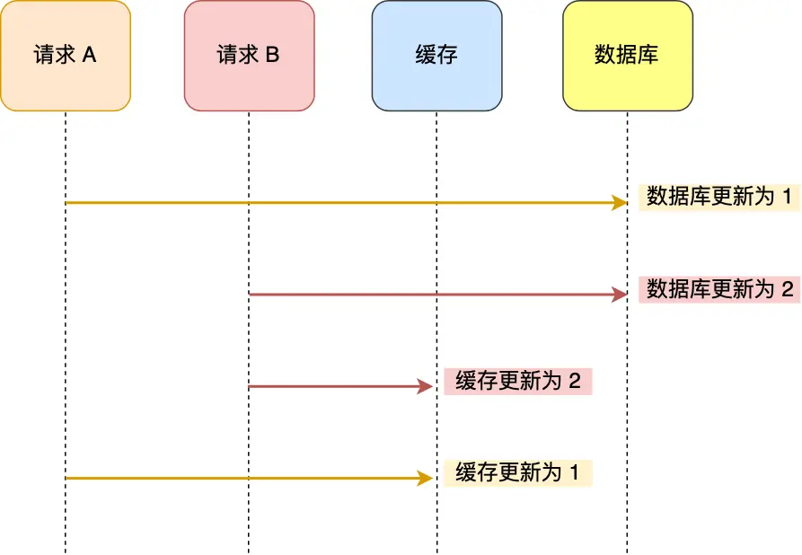
假设一下情况，请求A先将数据库的数据更新为1，然后再缓存更新前，请求B将数据库的请求更新为2，紧接着把缓存也更新成2，然后请求A将缓存更新为1
此时数据库中的数据是2，而缓存中的数据是1，就出现了缓存和数据库中的数据不一致的现象
**先更新缓存，再更新数据库**
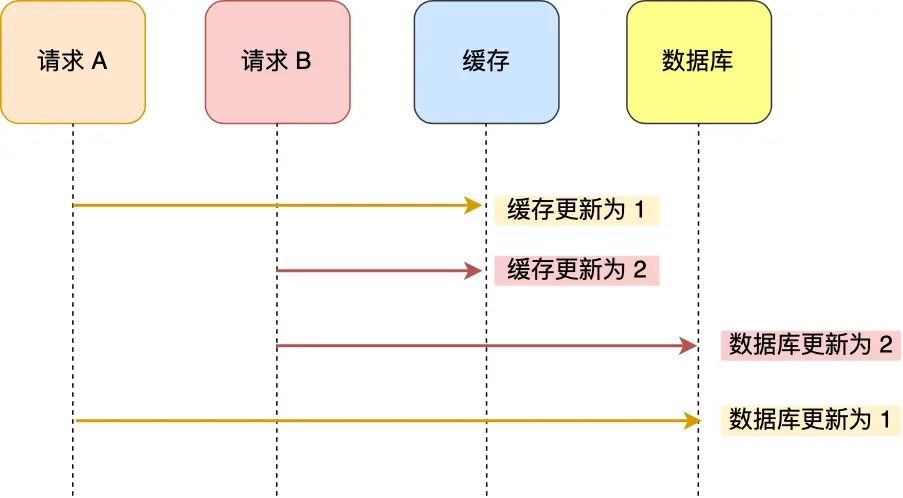
依旧是两个请求，请求A先将缓存的数据更新为1，然后更新数据库前，请求B先将缓存的数据更新为2，紧接着把数据库更新为2，然后请求A又将数据库中的数据更新为1。此时数据库中的数据是1，而缓存中的数据是2，出现了缓存和数据库中的数据不一致的现象
因此，无论是先更新缓存还是先更新数据库，这两个方案都存在并发问题，当两个请求并发更新同一条数据时，可能会出现缓存和数据库的数据不一致的现象
更新数据时，不更新缓存，而是将缓存中旧的数据删除，下一个请求读取数据时，发现缓存中没有数据，再从数据库中读取数据，更新到缓存中
这就是旁路缓存策略(Cache Aside策略)
### 旁路缓存模式（双写）
1. 读操作
	应用程序首先从缓存中查找数据，如果缓存命中，则直接返回缓存中的数据。如果缓存为命中，则从数据库中读取数据，并将读取到的数据写入到缓存中，以便后续流程可以直接从缓存中获取
2. 写操作
	应用程序首先更新数据库中的数据，然后使缓存中对应的数据失效
**先删除缓存，再更新数据库**
假设某个用户的年龄为20，请求A要将年龄更新为21，所以它会删除缓存中的内容，这时另一个请求B要读取这个用户的年龄，它查询缓存发现未命中后，会先从数据库中读取到年龄为20，并写入缓存中，然后请求A继续修改数据库，更新用户的年龄为21，最终，数据库和缓存中的数据不一样
**先更新数据库，再删除缓存**
假设某个用户数据在缓存中不存在，请求A读取数据时从数据库中查询到年龄为20，在未写入缓存中时，另一个请求B更新数据，将数据库中的年龄更新为21，并清空缓存，这是请求A将数据库中读到的年龄20写入到缓存中，可以发现，这样也会导致缓存和数据库的数据不一致。**但是实际中，这个问题出现的概率并不高**，**因为缓存的写入速度远远快于数据库的写入**，所以实际情况中，很难出现请求B已经更新了数据库并且删除了缓存，请求A才更新完缓存的情况
所以，**先更新数据库，再删除缓存，可以保证数据一致性**
但是，这个数据一致性是建立在两步操作都能成功的情况下，如果第一步操作成功了，但是第二步操作失败了，依旧会导致数据不一致
为了保证两步操作都能成功，有以下两种解决办法
**消息队列重试机制**
引入消息队列，将第二个操作要操作的数据加入到消息队列，由消费者来操作数据。如果应用删除缓存失败，可以从消息队列中重新读取数据，然后再次删除缓存（重试超过一定次数，就要向业务层发送报错信息了），如果删除缓存成功，就要把数据从消息队列中溢出，避免重复操作
**订阅MySQL binlog，再操作缓存**
更新数据库的时候，会产生一条变更日志，记录在binlog中，我们可以订阅binlog日志，拿到具体的操作数据，然后再执行缓存删除，阿里巴巴开源的Canal就是基于此实现的
Canal模拟MySQL主从复制的交互协议，把自己伪装成一个MySQL从节点，向MySQL主节点发送dump请求，MySQL收到请求后，就会开始推送binlog给Canal，Canal解析binlog字节流后，转换为便于读取的结构化数据，供下游程序订阅使用
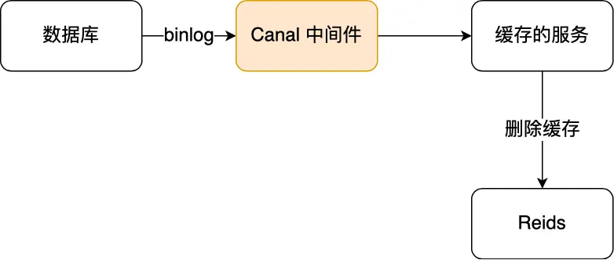
通过Canal + 消息队列可以保证数据缓存一致性
将binlog日志采集发送到MQ队列里，然后编写一个简单的缓存删除消息者订阅binlog日志，根据跟新的binlog删除缓存，并通过ACK机制确认处理这条更新log，保证数据缓存一致性
**一定要删除缓存成功，再返回ack机制给消息队列**，否则可能造成消息丢失的问题
**更新数据库，更新缓存**
对于先更新数据库，再删除缓存，虽然保证了数据一致性，但是会导致缓存的命中率下降
如果业务对缓存命中率有很高的要求，可以采用**更新数据库，更新缓存**的方案，更新缓存就不会出现缓存未命中的情况
但是如果两个请求并发执行的话，就会出现数据不一致的问题，为了保证数据一致，有以下两种方法
- 更新缓存前，先加上分布式锁，保证同一时间只运行一个请求更新缓存，就不会产生并发问题了，但是引入锁后，对写入的性能会带来影响
- 更新完缓存时，给缓存加上一个较短的过期时间，这样即使出现缓存不一致的问题，缓存的数据也很快就会过期，对业务还是可以接受的
**延迟双删**
针对先删除缓存，再更新数据库导致的数据不一致的问题，可以采用延迟双删的方法
如下伪代码
```
# 删除缓存
redis.delKey(x)
# 更新数据库
db.update(x)
# 睡眠
Thread.sleep(N)
# 再删除缓存
redis.delKey(x)
```
加了个睡眠时间，为了保证请求A在睡眠时，请求B能够在这一段时间完成从数据库读取数据，再把缺失的数据写入缓存，然后请求A睡眠完，再删除缓存
请求A的睡眠时间就需要大于请求B从数据库读取数据，写入缓存的时间，这个时间很难估计，因此这个方案也只是尽可能保证数据一致性
## Spring Cache
SpringBoot中，Spring Cache提供了一套简洁且强大的缓存抽象机制，帮助开发者轻松地将缓存集成到应用程序中
### 核心组件
**CacheManager**：CacheManager是Spring Cache的核心接口，负责管理多个缓存实例。作为缓存操作的入口点，提供了获取和操作缓存实例的方法
**Cache**：Cache是缓存的具体实现，负责存储和检索缓存数据。提供了基本的缓存操作，具体的Cache实现依赖于底层的缓存存储机制
### 核心注解
**@EnableCaching**：开关型注解，在项目启动类或某个配置类上使用了此注解，表示允许使用注解的方式进行缓存操作
**@Cacheable**：用于标注需要缓存的方法。当该方法被调用时，Spring Cache回显检查缓存中是否存在对应的数据。如果存在，则返回数据；不存在，则执行方法并将结果存入环村
**@CachePut**：用于标注需要更新缓存的方法，即使缓存中已经存在数据，该方法仍然会执行，并将结果更新到缓存中
**@CacheEvict**：用于标注需要清除缓存的方法
**@Caching**：此注解即可作为@Cacheable、@CacheEvict、@CachePut三种注解中的任何一种或几种来使用
**@CacheConfig**：可以用于配置@Cacheable、@CacheEvict、@CachePut这三个注解的一些公共属性，例如cacheNames、keyGenerator
## 序列化
在Redis中，配置序列化策略通常涉及到如何将数据在Redis内部存储和传输时进行序列化和反序列化。Redis本身支持多种数据类型，如字符串、列表、集合等，而这些数据类型的值和传输时通常需要序列化
**StringRedisSerializer**是Redis默认提供的字符串序列化器，它将字符串序列化为字节数组，并在需要时将字节数组反序列化为字符出啊
**GenericJackson2JsonRedisSerializer**是Spring Boot框架提供的JSON序列化器，它将对象序列化为JSON格式的字节数组，并在需要时将字节数组反序列化为对象
**JdkSerializationRedisSerializer**是Spring Data Redis默认的序列化策略，它使用Java原生的序列化机制将对象序列化为字节数组，要求被序列化的对象必须实现Serializable接口
# 杂项
## Stream如何保证消费者在发生故障再次重启时，仍然可以读取未处理完的消息
Stream会自动使用内部队列(PENDING LIST)留存消费组里的每个消费者读取的消息，知道消费者使用XACK命令通知Streams消息已经处理完成
消费确认增加了消息的可靠性，一般在业务处理完成之后，需要执行XACK命令确认消息已经被消费完成
如果没有消费者成功处理消息，它就不会给Stream发送XACK命令，消息仍然会留存。此时，消费者可以在重启后，使用XPENDING命令查看已读取，但尚未确认的消息
## 为什么有Redis Stream消息队列，还会有一些专业的消息队列中间件
因为Redis消息中间件会丢失消息
- AOF持久化配置为每秒写盘，但是写盘过程是异步的，Redis宕机时会存在数据丢失的可能性
- 主从复制也是异步的，主从切换时，也可能导致数据丢失
而对于专业的消息中间件，例如RabbitMQ或Kafka，在使用的时候部署的是一个集群，生产者在发送消息时，队列中间件通常会写多个节点，即有多个副本，即使其中一个节点挂了，也能保证集群的数据不丢失
Redis的数据都存储在内存当中，一旦发生了消息积压，就会到这Redis的内存持续增长，可能导致OOM的风险，而对于Kafka和RabbitMQ这类消息队列，其数据都是存储在磁盘上的，当消息积压时，也就是多占用一些磁盘空间而已
## Redis大key对持久化的影响
### 大key对AOF日志的影响
当引用程序向文件写入数据时，内核通常先将数据复制到内核缓冲区中，然后排入队列，然后交由内核决定何时写入硬盘
如果想要应用程序向文件写入数据后，能立马将数据同步到硬盘，可以调用fsync()函数，这样内核就会将内核缓冲区的数据直接写入到硬盘，等到硬盘写操作完成后，该函数才会返回
- Always策略就是每次写入AOF文件数据后，就执行fsync()函数
- Everysec策略就会创建一个异步任务来执行fsync()函数
- No策略就是用不执行fsync()函数
当使用Always策略时，如果是一个大key，主线程在执行fsync()函数的时候，阻塞的时间会比较久，因为当写入的数据量很大时，数据同步到硬盘的这个过程很耗时
当使用Everysec策略时，由于是异步执行fsync()函数，所以大key持久化的过程不会影响主线程
当使用No策略时，由于永不执行fsync()函数，所以大key的持久化过程不会影响到主线程
### 大key对AOF重写和RDB的影响
当AOF日志写入了很多的大key，AOF日志文件的大小会很大，就会很快触发AOF重写机制
AOF重写机制和RDB快照的过程，都会分别通过fork()函数创建一个子进程来处理任务
随着Redis存在的大key越来越多，Redis就会占用很多内存，对应的页表就会越来越大
在通过fork()函数创建子进程的时候，虽然不会复制父进程的物理内存，但是内核会把父进程的页表复制一份给子进程，如果页表很大，那么这个复制过程是非常耗时的，在执行fork()函数的时候就会发生阻塞现象
**tips**：大key多了，需要占用的总内存页数就多了，所以页表需要记录的内存页数就更多，页表就更大了
在AOF重写时，父进程还在对外服务，如果此时客户端发来了一个命令，要修改这个大key，就会触发写时复制，需要在物理内存中复制整个大key的数据，如果大key较多，就会导致进程阻塞
两个阶段会阻塞父进程
- 创建子进程的途中，由于要复制父进程的页表等数据结构，阻塞的时间就跟页表的大小有关，页表越大，阻塞的时间就越长
- 创建完子进程后，如果子进程或父进程修改了共享数据，就会发生写时复制，这期间会拷贝物理内存，内存越大，阻塞时间越唱
### 大key除了持久化以外，还有以下影响
- 客户端超时阻塞，由于Redis执行命令是单线程处理，在操作大key时会比较耗时，就会阻塞Redis
- 引发网络阻塞。每次获取大key产生的网络流量较大，如果一个key的大小时1MB，每秒访问量是1000，每秒就会产生1000MB的流量，就会阻塞服务器
- 阻塞工作线程。del删除大key时，会阻塞工作线程，就没办法处理后续命令（因此在删除大key时，可以使用unlink命令，这个命令的删除过程是异步的，不会阻塞主线程）
- 内存分布不均。集群模型在slot分片均匀情况下，会出现数据和查询倾斜的情况，部分大key的Redis节点占用内存多
## 怎么判断Redis某个节点是否正常工作
Redis判断节点是否正常工作，基本上都是通过互相的ping-pong心态检测机制，如果有一半以上的节点去ping一个节点的时候没有得到pong回应，集群就会认为这个节点挂掉了，会断开这个节点的连接
- Redis主节点默认每隔10秒对从节点发送ping命令，判断从节点的存活性和连接状态，可以通过参数repl-ping-slave-period控制发送频率
- Redis从节点每隔1秒发送replconf ack{offset}命令，给主节点上报自身当前的复制偏移量，为了实时监测主从节点的网络状态，上报自身复制偏移量，检查复制的数据是否丢失，如果有从节点数据丢失，再从主节点的复制缓冲区拉去丢失数据
## 主从复制中的两个Buffer有什么区别
replication buffer、repl backlog buffer的区别如下
- 出现阶段不一样
	repl backlog buffer是在增量复制的阶段出现，一个主节点只分配一个repl backlog buffer
	replication buffer是在全量复制阶段和增量复制阶段都会出现，主节点会给每个新连接的从节点，分配一个replication buffer
- 这两个buffer都有大小限制，缓冲区满了之后，发生的事情不一样
	当repl backlog buffer满了，会直接覆盖起始位置的数据
	当replication buffer满了，会导致连接断开，删除缓存，从节点重新连接，重新开始全量复制
# 杂项
## Redis数据结构
Redis有以下几种常见的数据结构，下面介绍其应用场景
- String：适用于缓存对象、常规技术、分布式锁、共享session信息等
- List：可以用于做消息队列（但是有两个问题：1.生产者需要自行实现全局唯一ID；2.不能以消费组形式消费数据）
- Hash：缓存对象、购物车等
- Set：聚合计算场景，比如点赞、共同关注、抽奖活动等
- Zset：排序场景，比如排行榜、电话和姓名排序等
***
Redis后续版本又新增了四种数据类型，应用场景如下
- BitMap：二值状态统计的场景，比如签到、判断用户登录状态、连续签到用户总数等
- HyperLogLog：海量数据基数统计的场景，比如百万级UV计数
- GEO：存储地理位置信息的场景，比如地图
- Stream：消息队列，相比于基于List实现的消息队列，Stream有两个特性：1.自动生成全局唯一消息ID；2.支持以消费组的形式消费数据
### ZSet和Set的区别
Redis中的Set和ZSet都是用于存储多个元素的集合类型，但它们的核心区别在于是否对元素进行排序以及排序的方式
Set是无序、唯一元素的集合，适合存储不重复且无需排序的数据，有以下常用命令
- `SADD set1 "a" "b" "c"`：像set1中添加3个元素，重复添加会自动去重
- `SMEMBERS set1`：查看set1中的所有元素，返回的结果是无序的
- `SISMEMBER set1 "a"`：判断a元素是否存在于set1中，存在返回1，否则0
- `SINTER set1 set2`：求两个集合的交集
- `SUNION set1 set2`：求两个集合的并集
ZSet是有序、唯一元素的集合，每个元素关联着一个score，并按score从大到小排序（元素唯一，但分数可以重复），适合需要排序或排名的场景，有以下常用命令
- `ZADD zset1 10 "a" 20 "b" 15 "c"`：像集合中添加三个元素，分数分别为10、20、15
- `ZRANGE zset1 0 -1 WITHSCORES`：按排名范围返回所有元素及分数，结果按分数排序，如果不加WITHSCORES则只返回所有元素
- `ZRANGEBYSCORE zset1 12 25`：按分数范围12-25分之间的元素
- `ZINCRBY zset1 5 "a"`：将"a"的分数加5
- `ZRANK zset1 "b"`：返回"b"的排名
总的来说，ZSet比Set多了很多基于分数的操作，而Set没有分数概念，只能按元素本身进行操作，无法直接获取第N个元素或者某个范围内的元素
### ZSet底层实现
ZSet类型的底层数据结构是由跳表或压缩列表实现的：
- 如果有序集合的元素小于128个，并且每个元素的值小于64字节时，Redis会使用压缩列表作为ZSet类型的底层数据结构
- 如果有序集合的元素不满足上述条件，Redis会采用跳表作为ZSet类型的底层数据结构
Redis 7.0中，压缩列表数据结构已经被废弃了，交由listpack数据结构来实现
### 跳表的实现
链表在查找元素时，需要逐一查找，所以查询效率非常低，时间复杂度为O(n)，于是就出现了跳表。跳表是在链表的基础上改进过来的，实现了一种多层的有序链表，好处就是能快速读取定位数据
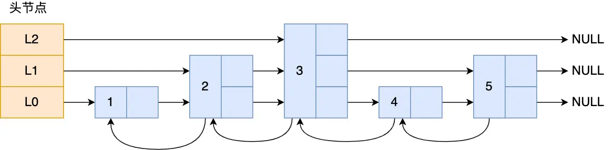
上图是一个层级为3的跳表
图中头节点有L0~L2三个头指针，分别指向了不同层级的节点，然后每个层级的节点都通过指针连接起来
- L0层级一共有5个节点，分别是1、2、3、4、5
- L1层级一共有3个节点，分别是1、3、5
- L2层级只有一个节点，3
如果想要在链表中查找节点4这个元素，只能从头开始遍历链表，需要查找4次
而使用跳表，就只需要查询2次就能定位到节点4，因为可以在头节点直接从L2层级跳到节点3，然后再往前遍历找到节点4
可以看到，查找的过程就是在多个层级跳跃，最后定位到元素。当数据量很大时，跳表的时间复杂度就是O(n)
```c++
typedef struct zskiplistNode {
	// ZSet对象的元素值
	sds ele;
	// 元素权重值
	double score;
	// 后向指针
	struct zskiplistNode *backward;
	
	// 节点的level数组，保存每层上的前向指针和跨度
	struct zskiplistLevel {
		struct zskiplistNode *forward;
		unsigned long span;
	}level[];
} zskiplistNode;
```
ZSet对象要同时保存元素和元素的权重，对应到跳表节点结构里就是sds类型的ele变量和double类型的score变量。每个调表节点都有一个后向指针，指向前一个节点，目的是为了方便从调表的尾节点开始访问节点，倒序查找更方便
跳表是一个带有层级关系的链表，而且每一层级可以包含多个节点，每一个节点通过指针连接起来，实现这一特性就是靠调表节点结构体中的zskiplistLevel结构体类型的level数组
level数组中的每一个元素代表跳表中的一层，也就是有zskiplistLevel结构体表示，比如level\[0]就表示第一层，level\[1]就表示第二层。zskiplistLevel结构体里定义了指向下一个跳表节点的指针和跨度，跨度用于表示两个节点之间的距离
Redis跳表在创建节点时，随机生成每个节点的层数，并没有严格维持相邻两层的节点数量2:1的情况
跳表在创建节点的时候，会生成范围在\[0-1]之间的一个随机数，如果这个随机数小于0.25，那么层数就会加1，然后继续生成下一个随机数，直到随机数的结果大于0.25结束，最终确定该节点的层数
这样的做法，相当于每增加一层的概率不超过25%，层数越高，概率越低，层高最大的限制是64
### 为什么使用跳表而不是B+树
**内存 vs 磁盘的设计初衷（主要的原因）**
- B+树是为了磁盘IO优化的，B+树的设计核心是降低树的高度，从而减少磁盘IO次数
- Redis是纯内存操作，在内存中没有磁盘IO的瓶颈。内存中指针跳转的速度非常快，跳表虽然比B+树更高，但在内存中多几次指针跳转的开销非常小。因此，B+树为了减少高度而设计的复杂页管理机制，在内存场景下显得多余
**实现复杂度与代码维护**
- 跳表本质上是多层链表，其插入、删除逻辑主要是修改指针，代码简洁，易维护
- B+树插入删除可能会引发节点的分裂和合并，甚至需要对整棵树进行重平衡。实现一个健壮、高效的B+树非常复杂，代码量大且难以调试
**写入性能和重平衡代价**
- B+树的写入抖动，当插入数据导致页分裂时，可能需要移动大量数据或改变树结构，会产生性能抖动
- 跳表的插入和删除操作是局部的，插入一个节点只需要修改前后节点的指针，并根据概率随机生成层高。它不需要像红黑树或B+树那样进行全局旋转或复杂的结构调整
### 压缩列表的实现
压缩列表是Redis为了节约内存而开发的，它是由连续内存块组成的顺序型数据结构，类似于数组

压缩列表的表头有三个字段
- zlbytes：记录整个压缩列表占用堆内存字节数
- zltail：记录压缩列表尾部节点距离起始地址有多少字节，也就是列表尾部的偏移量
- zllen：记录压缩列表包含的节点数量
- zlend：标记压缩列表的结束点，固定值0xFF
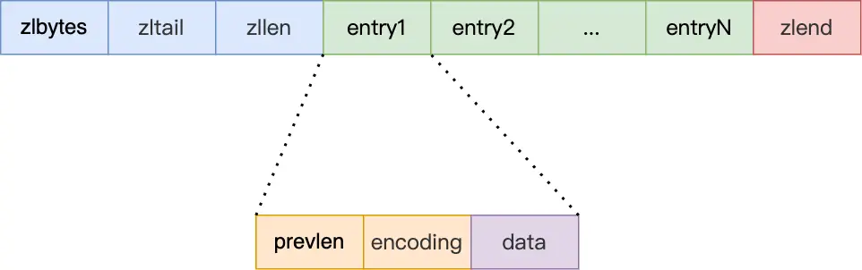
压缩列表节点包含下面三部分内容
- prevlen：记录了前一个节点的长度，目的是为了实现从后向前遍历
- encoding：记录了当前节点实际数据的类型和长度，类型主要有两种：字符串和整数
- data：记录了当前节点的实际数据，类型和长度都由encoding决定
当我们往压缩列表插入数据时，压缩列表就会根据数据类型是字符串还是整数，以及数据的大小，会使用不同空间大小的prevlen和encoding这两个元素里保存的信息，这种根据数据大小和类型进行不同的空间大小分配的思想，正是Redis为了节省内存而采用的
压缩列表的缺点就是会发生连锁更新的问题，因此连锁更新一旦发生，就会导致压缩列表占用的内存空间要多次重新分配，这会直接影响到压缩列表的访问性能
所以说，压缩列表的紧凑型内存布局能节省开销，但是如果保存的元素数量增加了，或者元素变大了，会导致内存重新分配，最糟糕的是会有连锁更新的问题
所以压缩列表只会用于保存节点数量不多的场景，只要节点数量足够小，即使发生连锁更新，也是可以接受的
### quicklist
ziplist虽然节省内存，但是由于申请内存必须是连续空间，如果内存占用较多，申请效率很低
而为了解决这个问题，就引入了quicklist
quicklist是一个双端链表，quick的每个节点都是ziplist，多个ziplist通过链表的指针连接起来，就可以将ziplist分散存储
为了避免quciklist中的每个ziplist的entry过多，Redis提供了一个配置项
`list-max-ziplist-size`来限制ziplist的节点个数
如果值为整数，则代表ziplist允许的entry个数的最大值
如果值为负数，则代表ziplist的最大内存大小，分为五种情况
- -1：每个ziplist的内存占用不能超过4kb
- -2（默认值）：每个ziplist的内存占用不能超过8kb
- -3：每个ziplist的内存占用不能超过16kb
- -4：每个ziplist的内存占用不能超过32kb
- -5：每个ziplist的内存占用不能超过64kb
除了控制ziplist的大小，quicklist还可以对节点的ziplist做压缩，通过配置项
`list-compress-depth`来控制。因为链表一般都是从首尾访问较多，所以首尾是不压缩的，这个参数是控制首尾不压缩的节点个数
- 0（默认值）：特殊值，代表不压缩
- 1：标识quicklist的首尾各有1个节点不压缩，中间节点压缩
- 2：标识quicklist的首尾各有2个节点不压缩，中间节点压缩
以此类推
### listpack
quicklist虽然通过控制quicklistNode结构里的压缩列表的大小或者元素个数，来减少连锁更新带来的性能影响，但是并没有完全解决连锁更新的问题
因为quicklistNode还是使用了压缩列表来保存元素，压缩列表连锁更新的问题，来源于它的结构设计，想要彻底解决这个问题，就需要一个新的数据结构
Redis 5.0设计了一个新的数据结构叫做listpack，目的是替代压缩列表，它最大的特点是listpack中每个节点不再包含前一个节点的长度了，压缩列表的每个节点正因为需要保存前一个节点的长度字段，因此会有连锁更新的隐患
listpack采用了压缩列表的很多优秀的设计，比如还是用一块连续的内存空间来紧凑的保存数据，并且为了节省内存开销，listpack节点会采用不同的编码方式保存不同大小的数据

listpack头包含了两个属性，分别是listpack总字节数和元素数量
listpack尾部也有个结尾标识
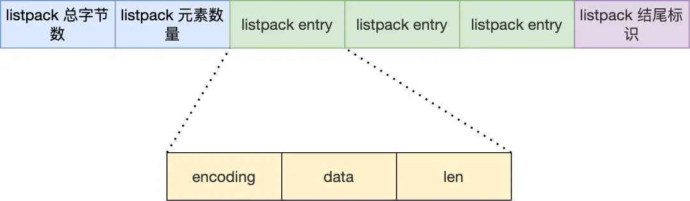
listpack节点结构如下，每个节点主要包含三部分
- encoding：定义该元素的编码类型，会对不同长度的整数和字符串进行编码
- data：实际存放的数据
- len：encoding+data的总长度
listpack没有压缩列表中记录前一个节点长度的字段了，listpack只记录当前节点的长度，当我们想listpack加入一个新元素的时候，不会影响其他节点的长度字段的变化，从而避免了压缩列表的连锁更新问题
### 哈希表如何扩容
在进行rehash时，需要使用到两个哈希表
在正常服务请求阶段，插入的数据都会写到哈希表1，此时哈希表2没有被分配空间
随着数据的增多，会触发rehash操作，该操作分为三步
- 给哈希表2分配空间，一般是哈希表1的空间大2倍
- 将哈希表1的数据迁移到哈希表2中
- 迁移完成后，哈希表1的空间被释放，并把哈希表2设置为哈希表1，然后在希表2新创建一个空白的哈希表，为下次rehash做准备
上述rehash过程看起来很简单，但是在第二步有很大的问题，如果哈希表1的数据量非常大，那么在迁移至哈希表2的时候，因为会涉及大量的数据拷贝，此时可能会对Redis造成阻塞，无法服务其他请求
为了避免rehash在数据迁移过程中，因拷贝数据的耗时，影响Redis性能的情况，所以Redis采用了渐进式rehash，也就是将数据的迁移的工作不再是一次性完成，而是分多次迁移
渐进式rehash步骤如下
- 给哈希表2分配空间
- 在rehash期间，每次哈希表元素进行新增、删除、查找或更新操作时，Redis除了会执行对应的操作之外，还会按顺序将哈希表1中索引位置上的所有key-value迁移到哈希表2上
- 随着处理客户端发起的哈希表操作请求数量越多，最终在某个时间点会把哈希表1中的所有key-value迁移到哈希表2中，从而完成rehash操作
这样就避免了一次性大量数据迁移工作的开销，分摊到了多次处理请求的过程中，避免了一次性rehash的耗时操作
在进行渐进式rehash的过程中，会有两个哈希表，所以在渐进式rehash进行期间，哈希表元素的删除、查找、更新等操作都会在这两个哈希表进行。比如，查找一个key的值的话，会现在哈希表1里面进行查找，如果没找到，就会继续到哈希表2里进行查找
在渐进式rehash进行期间，新增一个key-value时，会被保存到哈希表2里面，而哈希表1不再进行任何新增操作，这样就保证了哈希表1的key-value数量只会减少，随着rehash操作的完成，最终哈希表1就会变成空表
### String为什么不用c语言中的字符串
Redis的String字符串是用SDS数据结构存储的
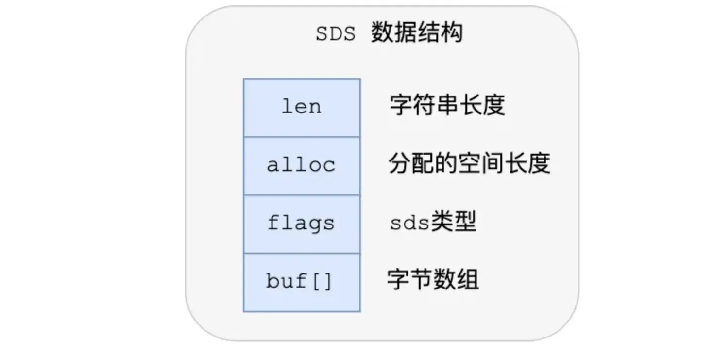
SDS结构中的每个成员变量如下
- len：记录了字符串长度。这样获取字符串长度的时候，只需要返回这个成员变量值就行，时间复杂度为O(1)
- alloc：分配给字符数组的空间长度。这样在修改字符串的时候，可以通过alloc-len计算出剩余的空间大小，可以用来判断空间是否满足修改需求，如果不满足，就会自动将SDS的空间扩展至执行修改所需的大小，然后才执行实际的修改操作，所以使用SDS既不需要手动修改SDS的空间大小，也不会出现前面所说的缓冲区溢出的问题
- flags：用来表示不同类型的SDS。一共有5种类型，分别是sdshdr5、sdshdr8、sdshdr16、sdshdr32和sdshdr64
- buf\[]：字符数组，用来保存实际数据。不仅可以保存字符串，也可以保存二进制数据
SDS结构在原本的字符数组上，增加了三个元数据：len、alloc、flags，用来解决C语言字符串的缺陷
- O(1)复杂度获取字符串长度，C语言的strlen函数获取字符串长度，需要通过遍历的方式来统计字符串长度，时间复杂度是O(n)，但是SDS因为加入了len成员变量，获取长度时，直接返回成员变量的值就行，时间复杂度O(1)
- 二进制安全：SDS不需要通过"\0"字符来表示字符串结尾了，而是有一个专门的len成员变量来记录长度，所以可以保存"\0"的数据。但是SDS为了兼容部分C语言标准的库函数，还是会在SDS字符串结尾加上"\0"字符。SDS的API都是以处理二进制的方式来处理SDS存放在buf\[]里的数据，程序不会对其中的数据做任何限制，数据写入的时候是什么样的，读取时就是什么样。因此，通过二进制安全的SDS，而不是使用C语言字符串，使得Redis不仅可以保存文本数据，也可以保存任意格式的二进制数据
- 不会发生缓冲区溢出：C语言的字符串标准库提供的字符串操作函数，大多数都是不安全的，因为这些函数把缓冲区大小是否满足操作需求的工作交由开发者来保证，程序内部并不会判断缓冲区大小是否够用，当发生了缓冲区异常就有可能造成程序异常结束
	所以，SDS结构引入了alloc和len成员变量，这样SDS API通过alloc-len计算，可以算出剩余可用的空间大小，这样在对字符串进行修改操作时，就可以由程序内部判断缓冲区大小是否够用。当缓冲区大小不够用时，Redis会自动扩大SDS的空间大小
