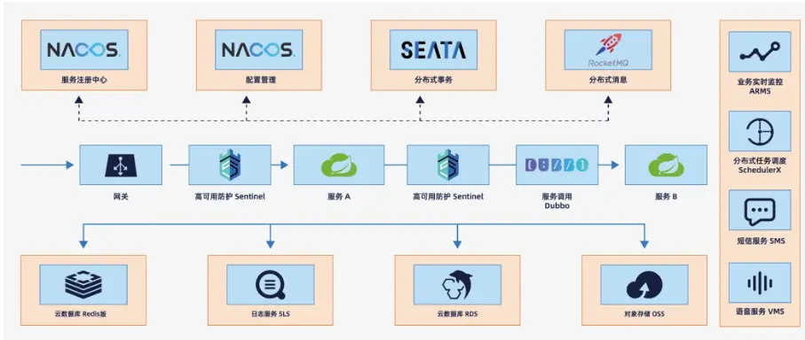
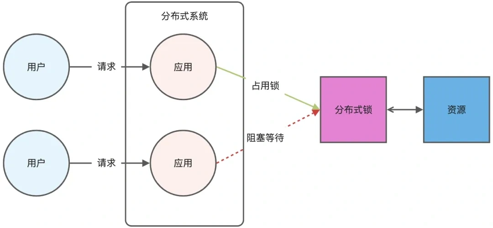
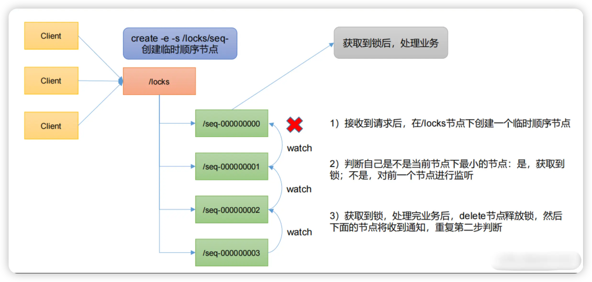

# Spring
## Spring框架的核心特性
**IoC容器**：Spring通过控制反转，将创建对象的操作交给容器进行，用户只需要对Bean对象进行定义，由Spring容器对这些Bean对象进行创建和初始化
**AOP**：面向切面编程，允许用户定义横切关注点，在不修改原方法的前提下，对方法进行一些增强功能。例如打印日志操作，传统的写法，在每个需要打印日志的方法中都需要写一遍代码，太过于冗余。通过AOP可以将打印日志的操作抽离出来，通过切入点来定义哪些方法需要打印日志，提高了代码的可维护性
**事务控制**：Spring提供了一系列的事务管理接口，支持声明式和编程式事务，用户可以轻松管理事务，不需要调用一系列复杂的接口
**MVC框架**：Spring MVC 是一个基于Sevelet API 定义的一个Web框架，有模型-视图-控制器三层。支持灵活的URL映射
## IoC
Spring IoC容器是一种创建对象的技术，DI（依赖注入）是其实现这一技术的方法。传统开发中，通常需要通过new关键字来新建对象，对象过多时会导致代码过于冗余，而通过IoC容器的思想，将创建对象的操作交给容器管理，而是通过Bean容器来实例化对象。省去了new对象的麻烦，同时也减少了对象之间的耦合度
## AOP
面向切面编程，Spring AOP会将那些与业务代码无关，且会被多个业务模块共同调用的逻辑封装起来，以减少系统的重复代码，降低冗余度。Spring AOP是基于动态代理的，对于代理对象，如果实现了某个接口，则会使用JDK Proxy 去创建代理对象，而对于没有实现接口的类，则会通过Cglib生成一个被代理对象的子类来作为代理对象
Spring AOP有以下几个核心概念
**横切关注点** 散布在应用程序多个模块的方法，非核心业务，但是会被业务中的一些方法会调用
**切面** 切面是横切关注点的模块化，一个类用于封装多个横切关注点的行为
**连接点** 程序执行过程中可以插入切面的一个点，例如方法调用，异常处理等。在Spring AOP中，仅支持方法级别的连接点
**通知** 切面要完成的工作，即切入的方法，描述了切面在“什么时候”做“什么事情”。通知也分多种，前置通知（Before），后置通知（After），环绕通知（Around）等
**切入点** 切入点是一个表达式，定义了通知在何处使用
**织入** 将切面应用到目标对象中，从而创建代理对象的过程
## BeanFactory
BeanFactory是Spring IoC容器的基础实现，提供了完整的IoC服务支持。BeanFactory是一个工厂模式的实现，负责创建对象，管理和配置Bean对象
BeanFactory加载Bean对象时使用了懒加载模式，只有当使用到Bean对象时才会进行创建，否则一直都只是存储着Bean对象的BeanDefinition
### XmlBeanFactory
XmlBeanFactory是BeanFactory主要实现之一，通过读取xml配置文件来管理Bean对象
```xml
<?xml version="1.0" encoding="UTF-8"?>
<beans xmlns="http://www.springframework.org/schema/beans"
       xmlns:xsi="http://www.w3.org/2001/XMLSchema-instance"
       xsi:schemaLocation="http://www.springframework.org/schema/beans 
       http://www.springframework.org/schema/beans/spring-beans.xsd">

    <bean id="userService" class="com.example.UserService">
        <property name="userDao" ref="userDao"/>
    </bean>

    <bean id="userDao" class="com.example.UserDaoImpl">
        <property name="dataSource" ref="dataSource"/>
    </bean>

    <bean id="dataSource" class="org.apache.commons.dbcp2.BasicDataSource">
        <property name="driverClassName" value="com.mysql.jdbc.Driver"/>
        <property name="url" value="jdbc:mysql://localhost:3306/test"/>
       <property name="username" value="root"/>
        <property name="password" value="123456"/>
    </bean>

</beans>
```
例如上述代码，XmlBeanFactory就可以从中读取到对应的Bean对象，并将其加载到IoC容器中
### DefaultListableBeanFactory
DefaulListableBeanFactory是通过读取Java代码来进行Bean对象的管理，也是较为完善的一种实现
```java
@Configuration
@ComponentScan(basePackages = "com.example")
public class AppConfig {

    @Bean
    public DataSource dataSource() {
        BasicDataSource dataSource = new BasicDataSource();
        dataSource.setDriverClassName("com.mysql.jdbc.Driver");
        dataSource.setUrl("jdbc:mysql://localhost:3306/test");
        dataSource.setUsername("root");
        dataSource.setPassword("123456");
        return dataSource;
    }

}
```
通过注解的形式，@Configuration和@Bean配合使用，从中读取到Bean对象并加载到IoC容器中  **@Configuration所定义的类，如果没有被扫描到，则需要试用@ComponentScan来扫描该包下的配置对象**
### BeanFactoryPostProcessor
BeanFactoryPostProcessor是BeanFactory的扩展点之一，它允许BeanFactory在实例化，配置和初始化Bean之前，对BeanFactory做一些修改
#### ConfigurationClassPostProcessor
这是一个用于处理@Configuration注解的类，通过扫描所有加了@Configuration注解的类，并解析这个类上的注解（@Bean，@ComponentScan等），并将其注册成BeanDefinition，最后通过CGLIB进行代理增强
### BeanPostProcessor
BeanPostPostProcessor是BeanFactory的扩展点之一，它允许在Bean实例化，依赖注入和属性设置之后对Bean进行一些处理
#### AutowiredAnnotationBeanPostProcessor
这是一个处理@Autowired注解的后置处理器，从而实现依赖自动注入
## Spring Bean

Spring Bean的生命周期主要分为四个阶段
1. **实例化** ：当需要创建一个Bean时（例如，第一次被请求或容器启动时对于单例Bean），容器会通过反射调用其构造函数来创建对象实例。此时，对象只是一个“裸”对象，其属性还没有被设置，也还没有执行任何初始化逻辑
2. **依赖注入** ：Spring解析Bean之间的依赖关系，并通过反射将值（其他Bean的引用、配置值等）设置到新创建的Bean实例的相应字段或Setter方法中。如果Bean实现了 `Aware` 系列接口，Spring会在此阶段调用这些接口的方法，将一些容器相关的对象“注入”给Bean
3. **初始化** ：所有 BeanPostProcessor 的 postProcessBeforeInitialization方法会被调用。这是Spring提供的一个非常强大的扩展点，可以用于在初始化之前修改Bean（例如，进行代理包装）。@PostConstruct 注解的处理就是通过一个 BeanPostProcessor (CommonAnnotationBeanPostProcessor) 在此阶段完成的。
   **@PostConstruct 注解方法**： 
   如果Bean的方法上标注了 @PostConstruct 注解，该方法会被调用。**InitializingBean.afterPropertiesSet**： 
   如果Bean实现了 InitializingBean 接口，其 afterPropertiesSet() 方法会被调用
4. **销毁** ：当Spring容器被关闭时（例如，调用 ApplicationContext.close()），容器会管理Bean的销毁过程
   **@PreDestroy 注解方法**： 
   如果Bean的方法上标注了 @PreDestroy 注解，该方法会被调用
**tips：单例Bean的线程不安全问题**
单例Bean作为成员变量，多线程环境下，单例Bean在执行某个方法前，可能就会先被其他线程修改。当多个请求并发访问时，它们操作的是同一个对象。如果这个对象内部有可以修改的成员变量，那么这些线程就可能相互干扰，导致数据不一致
**解决方法**
- 无状态Bean，对于一些无状态Bean，或者其内部的成员变量不可变。每个Bean对象的行为都由方法参数决定，就不会有其他线程修改成员变量的可能性了。
- 使用方法参数，不使用成员变量，而是改为使用局部变量，每个方法都使用局部变量
```java
public class test {
	// 不通过IoC容器管理
	public void func(int count){
		// 方法体
	}
}
```
- 使用synchronized，synchronized同步机制，可以防止多线程一起请求访问成员变量，就可以防止数据不一致。但是这个方法的性能不好，不能并发请求
- 使用ThreadLocal，每个线程获取ThreadLocal的值，ThreadLocal都会创建一个变量副本供线程使用，就不会出现多个请求同时修改一个变量的问题
### Bean的三种初始化方法
1. @PostConstruct：Spring的扩展功能，在Spring中需要手动配置对应的后处理器
2. InitializingBean：实现InitializingBean接口，并重写afterPropertiesSet方法
3. initMethod：在@Bean注解中给出initMethod属性，并在xml文件中配置相应的初始化方法
执行顺序：@PostConstruct  >  InitializingBean  >  initMethod
销毁方法：@PreDestroy  >  DisposableBean  >  destroyMethod
## Aware
Aware接口是Spring提供的一组标记接口，用于让Bean感知Spring容器的某些特定对象或资源  Spring在初始化容器时，会检查容器是否实现了Aware接口，如果是，则调用setter方法注入相应的依赖
### BeanNameAware
用于注入Bean的名字
```java
@Slf4j
public class MyBean implements BeanNameAware {
    @Override
    public void setBeanName(String name) {
        log.info("获取到Bean的名称: {}", name);
    }
}
```
### tips
使用@Autowired，@PostContruct等注解注入，通常需要后处理器来对注解进行处理，属于扩展功能，而对于Aware接口，属于Spring内置功能，在某些情况下，扩展功能可能会失效，而Aware接口不会失效
## 作用域
**singleton：** 每次从容器中获取对象时，获取到的都是同一个对象，即Bean对象是单例的
**prototype：** 每次从容器中获取对象时，都会在容器中重新创建一个新的Bean对象，并返回
**request：** 每次发送一个新的请求时，就会创建一个新的Bean对象
**session：** 每次打开一个新的会话，就会创建一个新的Bean对象
**application：** 只要是同一个Web应用程序，就是同样的Bean对象，不同的Web应用程序就会创建不同的Bean对象 
# Spring Cloud
## 配置中心
## 远程调用
## 负载均衡
负载均衡就是将负载分摊到多个操作单元上进行执行，负载均衡可以分为客户端负载均衡和服务端负载均衡
客户端负载均衡指的是发生在服务提供者一方，比如常见的nginx负载均衡，服务端负载均衡指的是发生在服务请求的一方，也就是在发送请求之前就已经选好了由哪个实例来处理请求
### 策略
LoadBalancer内置的策略包括：
1. 轮询（RoundRobin）：默认策略，按顺序依次分配到各个实例
2. 随机（Random）：随机选择可用实例，避免单一节点压力过大
3. 区域优先（Zone-Preference）：优先调用同一区域的实例，降低网络延迟
4. 权重分配（Nacos）：基于Nacos配置的服务实例权重值分配请求比例
## 超时连接
为了避免因网络延迟或者服务端阻塞导致客户端无限等待，从而导致服务雪崩，可以采用OpenFeign的超时控制机制，用于保障系统稳定性
### 重试机制
远程调用超时失败时，还可以进行多次尝试，如果某次成功，则返回成功结果，如果多次尝试依然失败，则结束调用，返回错误
## 服务雪崩
服务雪崩指的是微服务架构中，某个服务节点因故障或资源耗尽导致调用链路级联失败，最终引发整个系统不可用的现象
### 解决方案
1. 超时处理：设置接口请求的最大等待时间，超时后释放资源并返回错误，防止客户端无限制等待。但是在高并发场景下仍可能因为资源快速耗尽而导致服务雪崩
2. 线程隔离：为每个服务或接口分配独立线程池，限制资源使用上限，为每一个服务都设置一个独立的线程池，故障被隔离在特定资源池内，避免扩散到其他服务
3. 熔断降级：通过断路器统计异常比例或慢调用比例，若超过阈值则熔断服务，后续请求直接返回预设的降级逻辑
4. 流量控制（限流）：限制接口的QPS，预防突发流量压垮服务，通过Sentinel配置单机阈值，适用于秒杀，高并发API等流量突增的场景
### Sentinel
## 分布式事务
当完成某一个业务需要横跨多个模块（即需要调用其他模块接口），或操作多个数据库时，使用声明式事务@Transactional就无法保证事务。这时候就需要使用分布式事务
### 分布式事务理论
分布式事务可以有多种分类，比如柔性事务和强一致性事务，这些事务操作会遵循一定的定理，比如CAP原理、BASE理论
### CAP原理
CAP原理包含了以下三个元素：
1. C：Consistency，一致性。任何一个读操作总是能够读到之前完成的写操作的结果，即分布式环境中，多点的数据是一致的。所有节点在同一时刻读取的数据都是最新的数据副本
2. A：Availability，可用性。好的响应性能，完全的可用性指的是在任何故障模型下，服务器都会在有限的时间内处理完成并进行相应，保证每个请求不管成功或失败都有响应，即读取的数据有可能不是最新的数据副本
3. P：Partition tolerance，分区容忍性。指的是当出现网络分区的情况时（即系统中一部分节点无法和其他节点进行通信），分离的系统也能正常运行，也就是说，系统中任意信息的丢失或失败不会影响系统的继续运作
CAP原理指的是，CAP三个元素最多只能满足两个，而对于分布式系统，分区容忍性是基本要求。因此设计分布式数据系统，就是在一致性和可用性之间去一个平衡。而对于大多数web应用，并不需要强一致性（不需要强一致性，不代表不需要一致性），因此可以牺牲一致性去换取高可用性。
### BASE理论
BASE理论指的是，Basically Available（基本可用）、Soft-state（软状态/柔性事务）、Eventual Consistency（最终一致性）。核心思想：即使无法做到强一致性，但每个业务根据自身的特点，采用适当的方式来使系统达到最终一致性
1. 基本可用BA：Basically Available。指分布式系统在出现故障的时候，允许损失部分可用性，保证核心可用。即可以提供降级服务
2. 软状态S：Soft-state。软状态指的是允许系统存在中间状态，并且该中间状态不会影响整体可用性。即允许系统在不同节点间副本同步的时候存在延时，即状态在一段时间内不同步
3. 最终一致性E：Eventually Consistency。系统中所有数据副本经过一定时间后，最终可以达到一致的状态，不需要实时保证系统数据的强一致性。最终一致性是弱一致性的一种特殊状态
### 刚柔事务
刚柔事务分为刚性事务和柔性事务。刚性事务是原子的，要么都成功要么都失败，也就是需要保障ACID理论，而柔性事务只需要保障数据最终一致即可，需遵循BASE理论。
柔性事务分为：两阶段型，补偿型，异步确保型，最大努力通知型
#### 常用事务解决方案模型
1. **2PC**，2PC即两阶段提交，2PC是一个非常经典的强一致，中心化的原子提交协议。
   中心化指的是协议中有两类节点，一个是中心化协调者节点和N个参与者节点。
   两个阶段：投票阶段和提交/执行阶段
   **1PC**：协调者向所有的参与者**发送事务预处理请求**，称之为Prepare，并开始等待各参与者的响应。各参与者节点**执行本地事务操作**，但在执行完之后并**不真正提交数据库本地事务**。如果参与者成功执行了事务操作，那么就返回给协调者Yes响应，表示事务可以执行，否则返回No，表示事务不可以执行
   **2PC**：所有的参与者反馈给协调者的信息都是Yes，就会执行事务提交操作，协调者向所有的参与者节点**发出Commit请求**。参与者接受Commit请求之后，就会正式执行本地事务Commit操作，并在完成提交之后释放整个事务执行期间占用的事务资源。
2. **3PC**，即三阶段提交，其在2PC的基础上增加了CanCommit阶段，并引入了超时机制，一旦事务参与者迟迟没有收到协调者的Commit请求，就会自动进行本地commit，这样相对有效解决了协调者单点故障的问题
   **1PC**：这个阶段类似于2PC中的第二个阶段中的Ready阶段，事务协调者向所有参与者询问**是否可以完成本次事务**，如果参与者节点认为可以完成则返回Yes，否则返回No。实际场景中，参与者节点会对自身逻辑进行事务尝试，简单来说就是检查自身状态的健康性，看有没有能力进行事务操作
   **2PC**：阶段一中，如果所有参与者都返回Yes的话，那么就会进入PreCommit阶段**进行事务预提交**。此时分布式事务协调者会向所有参与者节点发送PreCommit请求，参与者接收到后**开始执行事务操作**，并将Undo和Redo信息记录到事务日志中。参与者执行完事务操作后，就会向协调者**反馈Ack表示已经准备好提交事务**，并等待协调者下一步指令。如果阶段一中有任何一个参与者节点返回No，或者协调者在等待参与者节点反馈的过程中**超时**，整个分布式事务就会中断，协调者就会向所有参与者**发送abort请求**
   **3PC**：阶段二中如果所有参与者节点都可以进行PreCommit提交，那么协调者就会从**预提交状态转化成提交状态**。然后向所有参与者节点**发送doCommit请求**，参与者节点在收到提交请求后就会各自执行事务提交操作，并向协调者节点**反馈Ack消息**，协调者收到所有参与者的Ack消息后**完成事务**。反之，如果有一个参与者节点**未完成PreCommit的反馈或反馈超时**，那么协调者会向所有的参与者节点**发送abort请求**，从而**中断事务**
        相比于2PC而言，3PC对于协调者和参与者都设置了超时时间，而2PC只有协调者才有超时时间。这样就可以避免参与者在长时间无法与协调者节点通讯的情况下（协调者挂了），无法释放资源的问题。参与者会在超时后，自动进行本地commit从而进行释放资源
3. **TCC**：TTC又成补偿事务，其核心思想是针对每个操作都要注册一个与其对应的确认和补偿，它分为三个操作
   **Try阶段**：主要是对业务系统做检测及资源预留
   **Confirm阶段**：确认执行业务操作
   **Cancel阶段**：取消执行业务操作
4. **MQ分布式事务**：当我们对数据的强一致性要求没那么高，则可以采用MQ来实现业务的最终一致性
### Seata
在使用Seata分布式事务管理框架时，通常涉及到多个服务的协调和事务的提交/回滚，Seata通过使用全局事务ID，来管理多个服务的事务。
Seata架构中，有三个角色：
TC（Transaction Coordinator）事务协调器：Server端，要单独部署，维护全局事务的运行状态，负责协调并驱动全局事务的提交和回滚
TM（Transaction Manager）事务管理器：Client端，控制全局事务便捷，负责开启一个全局事务，并最终发起全局提交和全局回滚的决议
RM（Resource Manager）资源管理器：Client端，由业务系统集成，控制分支事务，负责分支注册，状态汇报，并接受事务协调器的指令，驱动分支（本地）事务的提交和回滚
# 杂项
## IOC和AOP
### IOC
- 反射：IOC利用Java的反射机制动态加载类，创建对象实例及调用对象方法，反射允许在运行时检查类、方法、属性等信息，从而实现灵活的对象实例化和管理
- 依赖注入：IOC的核心概念是依赖注入，即容器负责管理的应用组建之间的依赖关系。Spring通过构造函数注入、属性注入或方法注入，将组件之间的依赖关系描述在配置文件中或使用注解
- 工厂模式：Spring IOC通常采用工厂模式来管理对象的创建和生命周期。容器作为工厂负责实例化Bean并管理它们的生命周期，将Bean的实例化过程交给容器来管理
- 容器实现：Spring IOC容器是实现IOC的核心，通常使用BeanFactory或ApplicationContext来管理Bean。BeanFactory是IOC容器的基本形式，提供基本的IOC功能；ApplicationContext是BeanFactory的扩展，并提供更多企业级的功能
### AOP
Spring AOP的实现依赖于动态代理技术。在运行时动态生成代理对象，而不是在编译时。它允许开发者在运行时指定腰带里的接口和行为，从而在不修改源码的情况下增强方法的功能
Spring AOP支持两种动态代理
- JDK Proxy：通过Proxy类或InvocationHandler接口实现，这种方式通常需要被代理的类实现一个或多个接口
- Cglib：当被代理的类没有实现接口时，Spring会使用Cglib库来实现动态代理，Cglib通过对被代理的类生成一个子类作为代理对象。Cglib是一个第三方库，通过继承实现动态代理
Spring AOP是对面向对象思维的一种补充，而不是向引入式命令、函数时编程思维，让它顺应另一种开发场景。AOP是一种对于不支持多继承的弥补，除开对象的主要特征被抽象为了一条继承链路。AOP对于一些不是特别重要的特征，对它们进行统一的抽象和管理
例如，对于日志打印，日志打印是许多对象的一个共性，但是日志打印并不属于对象的主要特效。而日志打印又是一个具体的内容，它并不抽象，所以它的工作不可以用接口来完成。而如果利用继承，打印日志的工作又会横跨继承树下的多个节点，强行进入到继承树内进行归纳会干扰这些强特性的区分
AOP会先在一个Aspect中定义一些Advice，其中包含具体实现的代码，同时整理了切入点，切入点的粒度是方法。最后，将这些Advice织入到对象的方法上，形成了最后执行方法时面对的完整方法
### 应用
AOP的主要应用场景有以下几个
- 事务管理，Spring的声明式事务就是基于AOP实现的。我们只需要在方法上标注@Transactional，Spring事务就会通过AOP在方法执行前开启事务，执行后根据是否有异常决定回滚或提交，不用手动写事务控制代码，简化了事务管理
- 日志记录，比如对接口的调用参数、返回结果、执行时间做日志，用AOP可以把这些逻辑抽离出来，定义一个切面，通过@Before获取入参，@AfterReturning获取返回值，@Around统计执行时间，这样业务方法里就不需要参杂日志代码
- 权限校验：比如某些接口需要登录后才能访问，或者需要特定角色权限。可以定义一个切面，在方法执行前检查用户的登录状态或权限，如果不满足就直接抛出异常阻止方法执行，避免在每个接口方法里重复写权限判断
Spring AOP这些应用，本质上都是通过切面封装横切逻辑，通过切入点指定要作用的方法，然后在方法执行的不同阶段插入这些逻辑，实现了无侵入地增强业务能力
Spring AOP只能作用在Spring容器管理的Bean，对于自己new出来的对象是不会生效的
对于同类内部方法调用不会触发AOP，因为使用的是this，而不是使用代理对象，绕过了代理
只能拦截方法级别的调用，做不到字段级别或构造方法级别的增强
## Spring 循环依赖
循环依赖指的是两个类中的属性互相依赖对方，即A类的创建依赖B属性，B类的创建依赖A属性，从而产生循环依赖
主要有以下三种情况
- 通过构造方法进行依赖注入时产生的循环依赖问题
- 通过setter方法进行依赖注入且是在多例模式下产生的循环依赖问题
- 通过setter方法进行依赖注入且是在单例模式下产生的循环依赖问题
对于上述三种情况，只有第三种被Spring解决了，其他两种方式在遇到循环依赖问题时，Spring都会产生异常
Spring在DefaultSingletonBeanRegistry类中维护了三个重要的缓存，称为三级缓存
- `singletonObjects（一级缓存）`：存放的是完全初始化好的、可用的Bean实例，getBean方法最终返回的就是这里面的Bean。此时Bean已实例化、属性已填充、初始化方法已执行、AOP代理也已生成
- `earlySingletonObjects（二级缓存）`：存放的是提前暴露的Bean的原始对象引用或早期代理对象引用，专门用来处理循环依赖。当一个Bean还在创建过程中（尚未完成属性填充和初始化），但它的引用需要被注入到另一个Bean时，就暂时存放在这里。此时Bean已实例化（调用了构造函数），但属性尚未填充，初始化方法尚未执行，它可能是一个原始对象，也可能是一个为了解决AOP代理问题而提前生成的代理对象
- `singletonFactories（三级缓存）`：存放的是Bean的ObjectFactory工厂对象。这是解决循环依赖和AOP代理协同工作的关键。当Bean被实例化后，Spring就会创建一个ObjectFactory对象并将其放入三级缓存。这个工厂的getObject方法负责返回该Bean的早期引用（可能是原始对象，也可能是提前生成的代理对象），当检测到循环依赖需要注入一个尚未完全初始化的Bean时，就会调用这个工厂来获取早期引用
Spring通过三级缓存和提前暴露未完全初始化的对象引用的机制来解决单例作用域Bean的setter注入方式的循环依赖问题
假设存在两个相互依赖的单例Bean：BeanA依赖BeanB，同时BeanB依赖BeanA，容器启动时，会按照以下流程处理
- 创建A的实例并提前暴露给工厂
	Spring会首先调用BeanA的构造函数进行实例化，此时得到一个原始对象（尚未填充属性）。紧接着，Spring会将一个特殊的ObjectFactory工厂对象存入第三级缓存(singletonFactories)。这个工厂的使命是：当其他Bean需要引用BeanA时，它能动态地返回一个半成品的BeanA（可能是原始对象，也可能是提前创建的代理对象）。此时BeanA的状态是已实例化但未初始化
- 填充BeanA的属性时触发BeanB的创建
	Spring开始给BeanA注入属性，发现它依赖BeanB。于是容器转向创建BeanB，同样先调用构造函数实例化，并将BeanB对应的ObjectFactory工厂存入三级缓存。至此，三级缓存中同时存在BeanA和BeanB的工厂，它们都代表未完成初始化的半成品
- BeanB属性注入时发现循环依赖
	Spring在给BeanB注入属性时，发现它需要注入BeanA属性。此时容器开始从缓存中查找。先查找一级缓存，发现没有BeanA；再查找二级缓存中同样未命中；最终在三级缓存中发现了BeanA的工厂。Spring调用工厂的getObject方法。这个方法会判断BeanA是否需要AOP代理，如果需要则会动态生成代理对象；若不需要代理，则会返回原始对象。得到的这个早期引用会放入二级缓存中，同时从三级缓存中清理工厂对象。最后，Spring将这个早期引用注入到BeanB的属性中。至此BeanB成功持有BeanA的引用
- 完成BeanB的生命周期
	BeanB获取玩所有的依赖后，Spring执行其初始化方法，将其转化为完整可用的Bean。随后BeanB被提升至一级缓存，耳机和三级缓存中关于BeanB的对象全都被清除。此时BeanB已经准备就绪
- 回溯完成BeanA的构建
	随着BeanB创建完毕，流程回溯到最初中断BeanA的属性注入环节。Spring将已完备的BeanB实例注入BeanA，接着执行BeanA的初始化方法。若BeanA生成过早期代理，Spring会直接复用二级缓存中的代理对象作为最终Bean，而非重复创建。最终，初始化完的BeanA放入一级缓存，其早期引用从二级缓存中移除
整个机制通过**中断初始化流程、逆向注入半成品、延迟代理生成**三大策略，将循环依赖的死结转化为有序的接力协作
此方案仅适用于Setter方法注入的单例Bean；构造器注入因必须在实例化前获得依赖，人会导致无解的死锁
### 为什么不能用二级缓存
Spring使用三级缓存，核心原因是为了正确处理需要AOP代理的Bean。如果只用二级缓存会导致注入的对象形态错误，甚至破坏单例原则
假设两个Bean循环依赖，如果只有二级缓存，B创建时区注入A，拿到的就是A的原始对象。但A在后续初始化完成后才会生成代理对象，结果就是，B拿着原始对象A，而Spring容器里存放的是代理对象A，同一个Bean出现了两个不同实例，违反了单例模式
三级缓存中的ObjectFactory就是解决这个问题的关键。它不是直接缓存对象，而是存了一个能生产对象的工厂。当发生循环依赖时，调用这个工厂的getObject方法，这时Spring会自动判断，如果这个Bean需要代理，就提前生成代理对象并放入二级缓存；如果不需要代理，就返回原始对象。这样依赖，B注入的就是A的最终形态，后续A初始化完成后再也不会创建新的代理，保证了对象全局唯一
## 常用注解
**@Autowired**：主要用于装配Bean。当Spring容器中存在与要注入的属性类型匹配的Bean时，它会自动将Bean注入到属性中。类似于我们new对象
**@Component**：这个注解用于标记一个类作为Spring的Bean。当一个类被@Component标记时，Spring会将其实例化成一个Bean，并将其添加到Spring容器中
**@Configuration**：用于标记一个类作为Spring的配置类。配置类可以包含@Bean注解的方法，用于定义和配置Bean，作为全局配置
**@Bean**：用于标记一个方法作为Spring的Bean工厂方法。当一个方法被@Bean注解标记时，Spring会将该方法的返回值作为一个Bean，将其添加到Spring容器中
**@Service**：用于标记一个类作为服务层的组件。是@Component注解的特例，一般标记在业务service的实现类
**@Repository**：用于标记一个类作为数据访问层的组件。也是@Component注解的特例，用于标记数据访问层的Bean
**@Controller**：用于标记一个类作为控制层的组件。也是@Component注解的特例，用于标记控制层的Bean
## 事务失效
SpringBoot中通过声明式事务@Transactional注解来实现的。事务可能会在以下场景失效
- **异常被吞没**：如果一个事务方法中发生了异常，并且异常被 try-catch 捕获后没有重新抛出，那么事务不会回滚，导致数据不一致
```java
@Service
public class UserService {
	
	@AutoWired
	private UserMapper userMapper;

	@Transactional
	public void test1(User user) {
		try {
			userMapper.insert(user);
			int i = 1 / 0;
		}catch (Exception e) {
			log.error("异常",e);
			// throw e;  // 如果不抛出异常，异常就会被吞掉，导致Spring无法检测到。从而导致事务无法回滚，事务失效
		}
	}
}
```
- **受检异常默认不回滚**：默认情况下，Spring 只对非受检异常（RuntimeException）进行回滚处理，当事务方法中抛出受检异常（如 IOException、SQLException 等）时，事务不会回滚。需要通过 rollbackFor 属性指定
```java
@Service
public class FileService {
	
	@Autowired
	private FileMapper fileMapper;
	
	@Transactional
	// @Transactional(rollbackFor = Exception.class) 只有指定了受检异常，才会让事务回滚
	public void saveFile(FileRecord record) throws IOException {
		fileMapper.insert(record);
		throw new IOException("文件写入失败"); // 抛出收件异常，事务不会回滚
	}
}
```
- **事务传播属性设置不当**：如果在多个事务之间存在事务嵌套，且事务传播属性配置不正确，可能会导致事务行为不符合预期。例如 REQUIRES_NEW 会创建独立事务，内层事务回滚不影响外层事务；NOT_SUPPORTED 会挂起当前事务
```java
@Service
public class OrderService {
	@Autowired
	private OrderMapper orderMapper;
	@Autowired
	private LogService logService;
	
	@Transactional
	public void createOrder(Order order) {
		orderMapper.insert(order);
		// 内层使用REQUIRES_NEW，在独立事务中执行
		logService.saveLog("创建订单");
		// 外层抛出异常，不会影响内层事务，日志已提交，事务提交，不会回滚
		throw new RuntimeException("订单异常");
	}
}
```
```java
@Service
public class LogService {
	@Autowired
	private LogMapper logMapper;
	
	@Transactional(propagation = Propagation.REQUIRES_NEW)
	public void saveLog(String content) {
		logMapper.insert(content);
		// 这里即使抛出异常，也只会回滚日志，不会影响外层订单
	}
	
	@Transactional(propagation = Propagation.NOT_SUPPORTED)
	public void saveLogNoTransactional(String content) {
		logMapper.insert(content);
		// 这个方法不在事务中执行
	}
}
```

- **方法内部调用导致事务失效**：同一个类中，一个方法直接调用另一个带有 @Transactional 注解的方法（使用 this 调用），会绕过 Spring 的代理机制，导致被调用方法上的 @Transactional 注解失效。因为 Spring 的事务管理是通过代理对象来控制的，只有通过代理对象调用的方法才会应用 Spring 的事务管理规则
```java
@Service
public class UserService {
	@Autowired
	private UserMapper userMapper;
	@Autowired
	private UserService self;
	
	public void addUser1(User user) {
		this.insertUser(user); // this调用，会绕过AOP代理机制，导致事务失效
	}
	
	@Transactional
	public void insertUser(User user) {
		userMapper.insert(user);
		throw new RuntimeException(); // 抛出异常，但是不会回滚
	}
	
	public void addUser2(User user) {
		self.insertUser(user); // 通过self调用，即代理对象调用，不会导致事务失效
	}
}
```
- **多数据源的事务管理**：如果在使用多数据源时，没有正确配置事务管理器或未在 @Transactional 中指定使用哪个事务管理器，可能导致事务管理混乱或失效
- **事务在非公开方法中失效**：如果 @Transactional 注解标注在非 public 方法上（private、protected 或 default），Spring 的代理机制无法拦截这些方法，事务不会生效
```java
@Service
public class UserService {
	@Autowired
	private UserMapper userMapper;
	
	// 因为AOP机制的代理对象只会代理public方法，对于其他方法，则无法代理
	@Transactional
	private void addUser(User user) {
		userMapper.addUser(user);
		throw new RuntimeException();
	}
}
```
- **数据库引擎不支持事务**：如 MySQL 的 MyISAM 存储引擎不支持事务，即使代码中正确使用了 @Transactional，数据也不会回滚
- **类未被 Spring 容器管理**：如果事务方法所在的类没有被 Spring 容器管理（未使用 @Service、@Component 等注解，或通过 new 手动创建对象），@Transactional 注解不会生效
### 事务传播属性
- REQUIRED（默认）：如果当前存在事务，则加入该事务；如果当前没有事务，则创建一个新事务。是最常用的传播级别，适合大多数业务场景
- REQUIRES_NEW：无论当前是否存在事务，都创建一个新事务。如果当前存在事务，则将当前事务挂起，等待新事务执行完毕后，再恢复原事务。需要将某些操作独立于外层事务，比如日志记录、审计、发送消息等。即使外层事务回滚，这些操作也不回滚
- NESTED：如果当前存在事务，则在嵌套事务内执行；如果当前没有事务，则创建一个新事务。嵌套事务依赖于外层事务，可以独立提交和回滚，但最终受外层事务控制。适合需要部分回滚的业务，比如批量操作时，某个子操作失败，只回滚该子操作，不影响其他子操作
- SUPPORTS：如果当前存在事务，则加入该事务；如果当前没有事务，则以非事务方式执行。适合方法可以在事务中执行，也可以不在事务中执行的场景。通常用于只读操作
- NOT_SUPPORTED：以非事务的方式执行。如果当前存在事务，则将当前事务挂起，等待该方法执行完毕后，恢复原事务。适用于某些操作不需要事务，或不想占用数据库链接资源，比如发送通知、缓存更新等
- MANDATORY：如果当前存在事务，则加入该事务；如果当前不存在事务，则抛出异常`IllegalTransactionStateException`。适用于强制要求在事务中执行的方法，比如必须在外层事务中执行的数据更新操作
- NEVER：以非事务方式执行。如果当前存在事务，则抛出异常`IllegalTransactionStateException`。不允许在事务中执行的操作，比如某些高并发操作，避免事务占用资源
## Bean的生命周期
1. Spring启动，查找并加载需要被Spring管理的Bean，进行Bean的实例化
2. Bean实例化后，将对Bean的引入和值注入到Bean的属性中
3. 如果Bean实现了BeanNamAware接口的话，Spring将Bean的Id传递给setBeanName()方法
4. 如果Bean实现了BeanFactoryAware接口的话，Spring将调用setBeanFactory()方法，将BeanFactory容器实例传入
5. 如果Bean实现了ApplicationContextAware接口的话，Spring将调用Bean的setApplicationContext()方法，将Bean所在应用上下文引用传入进来
6. 如果Bean实现了BeanPostProcessor接口，Spring就将调用postProcessBeforeInitialization()方法
7. 如果Bean实现了InitializingBean接口，Spring将调用他们的afterPropertiesSet()方法。类似的，如果bean使用了init-methon声明了初始化方法，该方法也会被调用
8. 如果Bean实现了BeanPostProcessor接口，Spring就将调用它们的postProcessAfterInitialization()方法
9. 此时，Bean已经准备就绪，可以被应用程序使用了。它们将一直驻留在应用上下文中，直到应用上下文被消费
10. 如果Bean实现了DisposableBean接口，Spring将调用它的destory()接口方法，同样，如果Bean使用了destory-method声明销毁方法，该方法也会被调用
总结一下
Bean的生命周期是，先通过构造方法对Bean对象进行实例化，随后进行属性注入。接着一次实现Bean对象实现的各类Aware接口。然后，如果存在BeanPostProcessor，会先后调用其初始化前后的处理方法，接着执行InitializingBean的afterPropertiesSet()及自定义的init-method。Bean准备就绪后提供服务，直到容器销毁时，通过DisposableBean的destory()或自定义的destory-method方法完成清理
**tips**
Spring Bean的生命周期由IOC容器控制。Spring只帮我们管理单例模式的Bean的生命周期，对于prototype的Bean，Spring在创建好交给使用者之后，就不会再管理后续的生命周期
非单例模式的Bean，每次请求时创建新实例。每次创建新实例时都会完整执行生命周期流程（仅到初始化完成）。容器不会管理非单例模式的Bean，需要调用者自行释放资源
### Bean的作用域
- Singleton：整个应用程序中只会存在一个Bean实例。默认作用域，Spring容器中只会创建一个Bean实例，并在容器的整个生命周期中共享该实例
- Prototype：每次请求都会创建一个新的Bean实例。从容起中获取该Bean时都会创建一个新的实例，适用于状态非常瞬时的Bean
- Request：每个HTTP请求都会创建一个新的Bean实例。仅在Spring Web应用程序中有效，适用于Web应用中需求局部性的Bean
- Session：Session范围内只会创建一个Bean实例。该Bean实例在用户会话范围内共享，仅在Spring Web应用程序中有效，适用于与用户会话相关的Bean
- Application：当前ServletContext中只存在一个Bean实例。仅在Spring Web应用程序中有效，该Bean实例在整个ServletContext范围内共享，适用于应用程序范围内共享的Bean
- WebSocket：在WebSocket范围内只存在一个Bean实例。仅在支持WebSocket的应用程序中有效，该Bean实例在WebSocket会话范围内共享，适用于WebSocket会话范围内共享的Bean
- Custom scopes：Spring允许开发者自定义作用于，通过实现Scope接口来创建新的Bean作用域
## Spring中，在bean加载前/销毁后，如果想实现某些逻辑，可以怎么做
在Spring框架中，如果希望在Bean加载或销毁前后执行某些逻辑，可以使用一些生命周期回调接口或注解。这些注解和接口允许你定义在Bean生命周期的关键点执行的代码
- init-method和destroy-method
	在xml配置中，可以通过init-method和destroy-method属性来指定Bean初始化后和销毁前需要调用的方法，然后在Bean类中实现这些方法
- InitializingBean和DisposableBean接口
	Bean类可以通过实现InitializingBean或DisposableBean接口，分别实现afterPropertiesSet和destroy方法
- @PostConstruct和@PreDestroy注解
	将这些注解加载对应的方法上，就可以分别在Bean实例的实例化后和销毁前执行相应的方法
- @Bean注解的initMethod和destroyMethod属性
	在基于Java的配置中，可以在@Bean注解中指定initMethod1hedestroyMethod属性
	这与第一种在xml配置文件中配置，是同一种方式，是同一套生命周期回调机制的两种不同配置风格
## Spring MVC
MVC全名是Model View Controller，是模型-视图-控制器的缩写，一种软件设计典范，用一种业务逻辑、数据、界面显示分离的方法组织代码，将业务逻辑聚集到一个部件里面，在改进和个性化定制界面即用户交互的同时，不需要重新编写业务逻辑
- View：为用户提供使用界面，与用户直接进行交互
- Model：代表一个存储数据的对象或Java POJO。它也可以带有逻辑，主要用于承载数据，并对用于提交请求进行计算的模块。模型分为两类，一类称为数据承载Bean，一类称为业务处理Bean。所谓数据承载Bean是指实体类，专门为用户承载业务数据的。而业务处理Bean则是指Service或Dao对象，专门用于处理用户提交请求的
- Controller：用于将用户请求转发给相应的Model进行处理，并根据Model的计算结果向用户提供相应响应。它使视图与模型分离
### MVC工作流程
1. 用户发送请求至前端控制器DispatcherServlet
2. DispatcherServlet收到请求调用处理器HandlerMapping
3. 处理器映射器根据请求url找到具体的处理器，生成处理器执行链HandlerExecutionChain一并返回给DispatcherServlet
4. DispatcherServlet根据处理器Handler获取处理器适配器HandlerAdapter执行HandlerAdapter处理一系列的操作，如：参数封装，数据格式转换，数据验证等操作
5. 执行处理器Handler（Controller，也叫页面控制器）
6. Handler执行完成返回ModelAndView
7. HandlerAdapter将Handler执行结果ModelAndView返回到DispatcherServlet
8. DispatcherServlet将ModelAndView传给ViewResolver视图解析器
9. DispatcherServlet对View进行渲染视图（即将模型数据model填充至视图中）
10. DispatcherServlet响应用户
**HandlerMapping**
HandlerMapping根据请求的URL、请求参数等信息，找到处理请求的Controller。Spring提供了多种HandlerMapping的实现，如`BeanNameUrlHandlerMapping`、`RequestMappingHandlerMapping`等。HandlerMapping会根据请求信息确定要请求的处理器。HandlerMapping可以根据URL、请求参数等规则确定对应的处理器
**HandlerAdapter**
HandlerAdapter负责调用处理器来处理请求。处理器可能有不同的接口类型（Controller接口，HttpRequestHandler接口等），HandlerAdapter会根据处理器的类型来选择合适的方法来调用处理器。Spring提供了多种HandlerAdapter的实现，用于适配不同类型的处理器
**** 
当客户端发送请求时，HandlerMapping根据请求信息找到对应的处理器
HandlerAdapter根据处理器的类型选择合适的方法来调用处理器
处理器执行相应的业务逻辑，生成ModelAndView
HandlerAdapter将处理器的执行结果包装成ModelAndView
视图解析器根据ModelAndView找到对应的视图进行渲染
将渲染后的视图返回给客户端
## SpringBoot
SpringBoot通过提供一系列开箱即用的组件和自动配置，简化了项目的配置和开发过程，开发人员可以更专注业务逻辑的实现，而不需要花费过多时间在繁琐的配置上。
SpringBoot提供了快速的应用程序启动方式，可通过内嵌的Tomcat、Jetty或Undertow等容器快速启动应用程序，无需额外的部署步骤，方便快捷
SpringBoot通过自动配置功能，根据项目中的依赖关系和约定俗成的规则来配置应用程序，减少了配置的复杂性，使开发者更容易实现应用的最佳实践
**优点**
SpringBoot提供了自动化配置，大大简化了项目的配置过程。通过约定大于配置的原则，很多常用的配置可以自动完成，开发者可以专注于业务逻辑的实现
SpringBoot提供了快速的项目启动器，通过引入不同的starter，可以快速集成常用的框架和库，极大地提高了开发效率
SpringBoot默认集成了多种内嵌服务器，无需额外配置，即可将应用打包成可执行的jar包，方便部署和运行
### 约定大于配置
约定大于配置是Spring的核心设计理念，通过预设合理的默认行为和项目规范，从而大幅减少开发者需要手动配置的步骤，从而提升开发效率和项目标准化程度
可以从以下几个方面解释
- **自动化配置**：SpringBoot提供了大量的自动化配置，通过分析项目的依赖和环境，自动配置应用程序的行为。开发者无需显式地配置每个细节，大部分常用的配置都已经预设好了。例如，引入`spring-boot-starter-web`后，SpringBoot会自动配置内嵌的Tomcat和SpringMVC，无需手动编写XML
- **默认配置**：Springoot为诸多方面提供大量默认配置，如链接数据库、设置Web服务器、处理日志等。开发人员无需手动配置这些常见内容，框架已经做好决策。例如，默认的日志配置可以让应用程序快速输出日志信息，无需开发者额外繁琐配置日志级别、输出格式与位置等
- **约定的项目结构**：SpringBoot提倡特定项目结构，通常主应用程序类只有根包、控制器类、服务类、数据访问类等分别放在相应子包。此约定使团队成员更易理解项目结构与组织，新成员加入时能快速定位各功能代码位置，提高协作效率
### 自动装配
SpringBoot的自动装配原理是基于Spring Framework的条件化配置和@EnableAutoConfiguration注解实现的。这种机制允许开发者在项目中引入相关的依赖，SpringBoot将根据这些依赖自动配置应用程序的上下文功能
SpringBoot中定义了一套规范，这套规范中规定，SpringBoot在启动时会扫描外部引用jar包中的META-INF/spring.factories文件，将文件中配置的类型信息加载到Spring容器，并执行类中定义的各种操作。对于外部jar来说，只需要按照SpringBoot定义的标准，就能将自己的功能装进SpringBoot
**原理**
`@EnableAutoConfiguration`注解是实现SpringBoot自动装配的核心注解
```java
@Target({ElementType.TYPE})  
@Retention(RetentionPolicy.RUNTIME)  
@Documented  
@Inherited  
@AutoConfigurationPackage  
@Import({AutoConfigurationImportSelector.class})  
public @interface EnableAutoConfiguration {  
    String ENABLED_OVERRIDE_PROPERTY = "spring.boot.enableautoconfiguration";  
  
    Class<?>[] exclude() default {};  
  
    String[] excludeName() default {};  
}
```
介绍上述两个主要的注解
- `@AutoCOnfigurationPackage`：将项目src中main包下的所有组件注册到容器中，例如标注了@Component注解的类
- `@Import({AutoConfigurationImportSelector.class)}`：自动装配的核心，其中的`AutoConfigurationImportSelector`类实现了ImportSelector接口，用于实现自动配置的选择和导入。具体来说，通过分析项目的类路径和条件来决定应该导入哪些自动配置类
应用程序启动时，`AutoConfigurationImportSelector`会扫描类路径上的`META-INF/spring.factories`文件，这个文件中包含了各种Spring配置和扩展的定义。在这里，它会查找所有实现了`AutoConfiguration`接口的类，具体的实现为`getCandidateConfiguration`方法
对于每一个发现的自动配置类，`AutoConfigurationImportSelector`会使用条件判断机制（@ConditionalOnXXX注解）来确定是否满足导入条件。这些条件可以是配置属性、类是否存在、Bean是否存在
满足条件的自动配置类将被导入到应用程序上下文中。这意味着它们会被实例化并应用于应用程序的配置
### SpringBoot是怎么做到导入就可以直接使用的
主要依赖于自动配置、起步依赖和条件注解等特性
**起步依赖**
起步依赖是一种特殊的Maven或Gradle依赖，它将项目所需的一系列依赖打包在一起。例如`spring-boot-starter-web`这个起步依赖就包含了Spring Web MVC、Tomcat等构建Web应用所需的核心依赖。开发者只需在项目中添加一个起步依赖，Maven或Gradle就会自动下载并管理与之关联的所有依赖，避免了手动添加大量依赖的繁琐过程
**自动配置**
Spring Boot的自动配置机制会根据类路径下的依赖和开发者的配置，自动创建和配置应用所需的Bean。它通过`@EnableAutoConfiguration`注解启用，该注解会触发Spring Boot去查找`META-INF/spring.factories`文件
`spring.factories`文件中定义了一系列自动配置类，Spring Boot会根据当前项目的依赖情况，选择合适的自动配置类进行加载。例如，如果项目中包含`spring-boot-starter-web`依赖，Spring Boot会加载`WebMvcAutoConfiguration`类，该类会自动配置Spring MVC的相关组件，如DispatcherServlet、视图解析器等
开发者可以通过自定义配置来覆盖自动配置的默认行为，如果开发者在`application.yml`或`application.properties`文件中定义了特定的配置，或者在代码中定义了同名的Bean，Spring Boot会优先使用开发者的配置
**条件注解**
条件注解用于控制Bean的创建和加载，只有在满足特定条件时，才会创建相应的Bean。Spring Boot的自动配置类中广泛使用了条件注解，如`@ConditionalOnClass`、`@ConditionalOnMissingBean`等
比如，`@ConditonalOnClass`表示只有当类路径中存在指定的类时，才会创建该Bean
### Filter和Interceptor
过滤器是Java Servlet规范中的一部分，它可以对进入Servlet容器的请求和响应进行预处理和后处理。过滤器通过实现`javax.servlet.Filter`接口，并重写其中的init、doFilter、destroy方法来完成相应的逻辑。当请求进入Servlet容器时，会按照配置的顺序依次经过各个过滤器，然后再到达目标Servlet或控制器；响应返回时，也会按照相反的顺序再次经过这些过滤器
拦截器是Spring框架中提供的一种机制，它可以对控制器方法的执行进行拦截。拦截器通过实现HandlerInterceptor接口，并重写其中的preHandle、postHandle、afterCompletion方法来完成相应的逻辑。当请求到达控制器时，会先经过拦截器的preHandle方法，如果该方法返回true，则继续执行后续的控制器方法和其他拦截器；控制器方法执行完成后，会调用拦截启动postHandle方法；最后在请求处理完成后，会调用拦截器的afterCompletion方法
## Mybatis
相比于传统的JDBC，Mybatis有以下优点
- 基于SQL语句编程，相当灵活，不会对应用程序或者数据库的现有设计造成任何影响，SQL写在XML里，解除sql与程序代码的耦合，便于统一管理；提供XML标签，支持编写动态SQL语句，并可重用
- 与JDBC相比，减少了50%以上的代码量，消除了JDBC大量冗余的代码，不需要手动开关连接
- 很好的与各种数据库兼容，因为Mybatis使用JDBC来链接数据库，所以只要JDBC支持的数据库Mybatis都支持
- 能够与Spring很好的集成，开发效率高
- 提供映射标签，支持对象与数据库的ORM字段关系映射；提供对象关系映射标签，支持对象关系组建维护
****
Mybatis在SQL灵活性、动态SQL支持、结果集映射和与Spring整合方面表现卓越，尤其重视SQL可控性的项目
- SQL与代码解耦，灵活可控：MyBatis允许开发者直接编写和优化SQL，相比于全自动ORM，MyBatis让开发者明确知道每条SQL的执行逻辑，便于性能调优
```xml
<select id="findUserWithRole" resultMap="userRoleMap">
	SELECT u.*,r.role_name
	FROM user u
	LEFT JOIN user_role ur ON u.id = ur.user_id
	LEFT JOIN role r ON ur.role_id = r.id
	WHERE u.id = #{userId}
</select>
```
- 动态SQL的强大支持：可以动态凭借SQL，通过`<if>`、`<choose>`、`<foreach>`等标签动态生成SQL，避免Java代码中繁琐的字符串拼接
```xml
<select id="searchUsers" resultType="User">
	SELECT * FROM user
	<where>
		<if test="name != null">AND name LIKE #{name}</if>
		<if test="status != null">AND status = #{status}</if>
	</where>
</select>
```
- 自动映射与自定义映射相结合：自动降查询结果字段名与对象属性名匹配
```xml
<resultMap id="userRoleMap" type="User">
	<id property="id" column="user_id"/>
	<result property="name" column="user_name"/>
	<collection property="roles" ofType="Role">
		<result property="roleName" column="role_name"/>
	</collection>
</resultMap>
```
- 插件扩展机制：可便携插件拦截SQL执行过程，实现分页、性能监控、SQL改写等通用逻辑
```java
@Intercepts({
	@Signature(type=Executor.class,method="query",args={...})
})
public class PaginationPlugin implements Interceptor {
}
```
- 与Spring生态无缝集成：通过@MapperScan快速扫描Mapper接口，结合Spring事务管理，配置简洁高效
```java
@Configuration
@MapperScan("com.example.mapper")
public class MyBatisConfig {
}
```
### JDBC连接数据库
1. **加载数据库驱动程序**：在使用JDBC连接数据库之前，需要加载相应的数据库驱动程序，可以通过`Class.forName("com.mysql.jdbc.Driver")`来加载MySQL数据库的驱动程序。不同数据库的驱动类名会不同
2. **建立数据库连接**：使用DriverManager类的getConnection(url,username,passowrd)方法来连接数据库，其中url是数据库的连接字符串，username是数据库用户名，password是密码
3. **创建Statement对象**：通过Connection对象的createStatement()方法创建一个Statement对象，用于执行SQL查询或更新操作
4. **执行SQL查询或更新操作**：使用Statement对象的executeQuery(sql)方法来执行SELECT查询操作，或者使用executeUpdate(sql)方法来执行INSERT、UPDATE、或DELETE操作
5. **处理查询结果**：如果是SELECT查询操作，通过ResultSet对象来查询处理结果。可以使用ResultSet的next()方法便利查询结果集，然后通过getXXX()方法获取各个字段的值
6. **关闭连接**：在完成数据库操作和，需要逐级关闭数据库连接相关对象，即先关闭ResultSet，再关闭Statement，最后关闭Connection
### MyBatis里面 # 和 $ 的区别
- MyBatis再处理`#{}`时，会创建预编译的SQL语句，将SQL中的`#{}`替换为 `?`，在执行SQL时会为预编译SQL中的占位符`?`赋值，调用PreparedStatement的set方法来赋值，预编译的SQL语句执行效率高，并且可以防止SQL注入，提供更高的安全性，适合传递参数值
- MyBatis在处理`${}`时，只是创建普通的SQL语句，然后在执行SQL语句时，MyBatis将参数直接拼入SQL里，不能防止SQL注入，因为参数直接拼接到SQL语句中，如果参数未经过验证、过滤，可能会导致安全问题
### MyBatisPlus和MyBatis的区别
MyBatisPlus是一个基于MyBatis的增强工具库，旨在简化开发并提高效率。以下是MyBatisPlus和MyBatis之间的一些区别
- CRUD操作：MyBatisPlus通过继承BaseMapper接口，提供了一系列内置的快捷方法，似的CRUD操作更加简单，无需编写重复的SQL语句
- 代码生成器：MyBatisPlus提供了代码生成器功能，可以根据数据库表结构自动生成实体类、Mapper接口以及XML映射文件，减少了手动编写的工作量
- 通用方法封装：MyBatisPlus封装了许多常用的方法，如条件构造器、排序、分页查询等，简化了开发过程，提高了开发效率
- 分页插件：MyBatisPlus内置了分页插件，支持各种数据库的分页查询，开发者可以轻松实现分页功能，而在传统的MyBatis中，需要开发者自己手动实现分页逻辑
- 多租户支持：MyBatisPlus提供了多租户的支持，可以轻松实现多租户数据隔离的功能
- 注解支持：MyBatisPlus引入了更多的注解支持，使得开发者可以通过注解来配置实体与数据库表之间的映射关系，减少了XML配置文件的编写
## Spring Cloud
SpringBoot是用于构建单个Spring应用的框架，SpringCloud则适用于构建分布式系统中的微服务架构的工具，SpringCloud提供了服务注册与发现、负责均衡、断路器、网关等功能
**微服务常用组件**
- **注册中心**：注册中心是微服务架构最核心的组件。起到的作用是对新节点的注册与状态维护，解决了**如何发现新节点以及检查各节点的运行状态的问题**。微服务节点在启动时会将自己的服务名称、IP、端口等信息在注册中心登记，注册中心会定时检查该节点的运行状态。注册中心通常会采用心跳机制最大程度保证已登记过的服务节点都是可用的
- **负载均衡**：负载均衡解决了**如何发现服务及负载均衡如何实现的问题**，通常微服务在互相调用时，并不是直接通过IP、端口进行访问调用。而是先通过服务名在注册中心查询该服务拥有哪些节点，注册中心将该服务可用节点列表返回给服务调用者，这个过程叫做**服务发现**，因服务高可用的要求，服务调用者会接收到多个节点，必须要从中进行选择。因此服务调用者一端必须内置负载均衡器，通过负载均衡策略选择合适的节点发起实质性的通信请求
- **服务通信**：服务通信组件解决了**服务间如何进行消息通信的问题**，服务间通信采用轻量级协议，通常是Http Restful风格，但是因为Restful风格过于灵活，必须加以约束，通常应用时对其封装。例如在SpringCloud中就提供了Feign和RestTemplate两种技术屏蔽底层的实现细节，所有开发者都是基于封装后统一的SDK进行开发，有利于团队间相互合作
- **配置中心**：配置中心主要解决了**如何集中管理个节点配置文件的问题**，在微服务架构下，所有的微服务节点都包含自己的各种配置文件，如jdbc配置、自定义配置、环境配置、运行参数配置等。但由于微服务可能会有几十个节点，如果讲这些配置文件分散存储在各个节点中，发生配置更改就需要逐个节点调整，将给运维人员带来巨大的压力。因此就有了配置中心，通过部署配置中心服务器，将各节点配置文件从服务中剥离，集中转存到配置中心。一般配置中心都有UI界面，方便实现大规模集群配置调整
- **集中式日志管理**：集中式日志管理主要是解决了**如何收集各节点日志并统一管理的问题**。微服务架构默认将应用日志分别保存在部署节点上，当需要对日志数据和操作数据进行数据分析和数据统计时，必须手机所有节点的日志数据。常见的方案有ELK、EFK。通过搭建独立的日志收集系统，定时抓取各节点增量日志形成有效的统计报表，为统计和分析提供数据支撑
- **分布式链路追踪**：分布式链路追踪解决了**如何直观的了解各节点间的调用链路的问题**。系统中一个复杂的业务流程，可能会出现连续调用多个微服务，我们需要了解完整的业务逻辑设计的每个微服务的运行状态，通过可视化链路图展现，可以帮助开发人员快速分析系统瓶颈及出错的服务
- **服务保护**：服务保护主要是解决了**如何对系统进行链路保护，避免服务雪崩的问题**。在业务运行时，微服务间互相调用支撑，如果某个微服务出现高延迟导致线程池满载，或是业务处理失败。就需要引入微服务保护组件来实现高延迟服务的快速降级，避免系统崩溃

- SpringCloud Alibaba中使用Alibaba Nacos组件实现注册中心，Nacos提供了一组简单易用的特征集，可快速实现动态服务发现、服务配置、服务元数据及流量管理
- SpringCloud Alibaba使用Nacos服务端均衡实现负载均衡，与Ribbon在调用端均衡不同，Nacos是在服务发现的同时利用负载均衡返回服务节点数据
- SpringCloud Alibaba使用Netflix Feign和Alibaba Dubbo组件来实现服务通信，前者与SpringCloud采用了相同的方案，后者则是对自家的RPC框架Dubbo也给予支持，为服务间通信提供了另一种选择
- SpringCloud Alibaba在API服务网关组件中，使用与SpringCloud相同的组件，即SpringCloud Gateway
- SpringCloud Alibaba在配置中心组件中使用Nacos内置配置中心，Nacos内置的配置中心，可将配置信息存储保存在指定数据库中
- SpringCloud Alibaba在原有的ELK方案外，还使用阿里云日志服务实现日志集中式管理
- SpringCloud Alibaba在分布式链路组件中采用与SpringCloud相同的方案，即Sleuth/Zipkin Server
- SpringCloud Alibaba使用Alibaba Sentinel实现系统保护，Sentinel不仅功能强大，实现系统保护比Hystrix更优雅，还拥有更好的UI界面
### 负载均衡算法
- 简单轮询：将请求顺序分发给后端服务器上，不关心服务器当前的状态，比如后端服务器的性能、当前的负载
- 加权轮询：根据服务器自身的性能给服务器设置不同的权重，将请求按顺序和权重分发给后端服务器，可以让性能高的机器处理更多的请求
- 简单随机：将请求随机分发给后端服务器上，请求越多，各个服务器接收到的请求越平均
- 加权随机：根据服务器自身的性能给服务器设置不同的权重，将请求按个服务器的权重随机分发给后端服务器
- 一致性哈希：根据请求的客户端ip或请求参数通过哈希算法得到一个数值，利用该数值取模映射出对应的后端服务器，这样能保证同一个客户端或相同参数的请求每次都使用同一台服务器
- 最小活跃数：统计每台服务器上当前正在处理的请求数，也就是请求活跃数，将请求分发给活跃数最少的后台服务器
### 服务熔断
服务熔断是应对微服务雪崩效应的一种链路保护机制
比如说，微服务之间的数据交互是通过远程调用来完成的。即服务A调用服务B，服务B调用服务C，某一时间链路上对服务C的调用响应时间过长了，或者服务C不可用，随着时间的增长，对服务C的调用也越来越多，然后服务C崩溃了，但是链路调用还在，对服务B的调用也在持续增多，然后服务B崩溃，随之服务A也崩溃，导致雪崩效应
服务熔断是应对雪崩效应的一种微服务链路保护机制。在微服务调用链路中的某个微服务不可用或者响应时间太长时，会进行服务熔断，不再有该节点微服务的调用，快速返回错误的响应信息。当检测到该节点微服务调用响应正常后，恢复调用链路
服务熔断的作用类似于家用保险丝，当某服务出现不可用或响应超时的情况时，为了防止整个系统出现雪崩，暂时停止对该服务的调用
### 服务降级
服务降级一般是指在服务器压力剧增的时候，根据实际业务使用情况以及流量，对一些服务和页面有策略的不处理或者用一种简单的方式进行处理，从而释放服务器资源以保证核心业务的正常高效运行
服务器的资源是有限的，而请求是无限的。在用户使用高峰期，会影响整体服务的性能，严重的话会导致宕机，以至于某些重要服务不可用。故高峰期为了保证核心功能服务的可用性，就需要对某些服务进行降级处理
服务降级是从整个系统的负荷情况出发和考虑的，对某些负荷会比较高的情况，为了预防某些功能出现负荷过载或者响应慢的情况，在其内部暂时舍弃对一些非核心的接口和数据的请求，而直接返回一个提前准备好的fallback错误处理信息。这样虽然提供的是一个有损的服务，但却保证了整个系统的稳定性和可用性
## 分布式和微服务的区别
**分布式是一种物理部署方式，主要解决单台机器性能扛不住的问题；而微服务是一种软件架构设计思想，主要解决系统代码堆积太多，难以维护的问题**
首先是分布式系统，这是从物理层面出发的。当我们的业务流量越来越大，单台服务器的CPU和内存再怎么升级也不起作用时，就可以考虑多几台机器，把它们连起来一起干活。多台机器通过网络协同工作来完成一个任务，就是分布式。追求的是在集群里堆更多的机器，来扛住更高的并发，保证一台机器宕机了，还能使用别的机器
然后是微服务，这是从软件工程和业务逻辑层面出发的。对于单体系统，会把很多功能全部写在一起，导致这个系统特别庞大，打包成一个巨大的系统部署。如果项目比较简单没什么问题，但是随着业务的拓展，可能就会导致许多人修改同一份代码，代码变得非常的臃肿且难以维护。所谓的微服务，就是将一个巨大的单体系统，按照业务分类拆成了一个个独立的小服务。每个服务只需要执行自己的任务，互不干扰，需要通信时就通过接口来进行沟通
**微服务并不是指多个机器在跑一个项目，如果将一个项目复制多份，分别部署在不同的机器上，然后通过Nginx做负载均衡，这叫分布式系统。但是这并不是微服务**
分布式的核心是机器的拆分和协同，而微服务的核心是业务逻辑和业务边界的拆分
## CAP定理
CAP指的是在一个分布式系统中，Consistency（一致性）、Availability（可用性）、Partition tolerance（分区容错性），三者不可兼得
- 一致性：在分布式系统中所有的数据备份，在同一时刻是否是同样的值（等同于所有节点访问同一份最新的数据副本）
- 可用性：在集群中一部分节点故障后，集群整体是否还能响应客户端的读写请求
- 分区容忍性：以实际效果而言，分区相当于对通信的时限要求。系统如果不能再时限内达成数据一致性，就意味着发生了分区的情况，必须就当前操作在C和A之间进行选择
在分布式系统中，P是必须满足的（因为网络不可靠，分区总会发生），因此系统实际上需要在C和A之间权衡，即CP或AP系统
**网络分区**
网络分区指的是：分布式系统中，由于交换机故障、光纤断开、网络延迟过高、丢包严重等原因，导致原本互联的节点被分割成两个或多个互不相通的小组
例如，5个节点的集群，突然节点1,2和节点3,4,5之间无法通信，但各自内部通信正常，此时系统处于分区状态
而对于一个具备P的系统，在出现网络分区时仍然能够对外提供服务，而不是直接停机或者无限等待
没有P的系统，一旦发生分区，就会拒绝所有请求或者直接崩溃
**CP系统**
Zookeeper是一个CP系统，当发生网络分区时，少数派节点会直接停止服务，以保证多数派节点的数据一致性。通过牺牲部分的可用性来维护一致性
**AP系统**
Cassandra是一个AP系统，当发生分区时，所有节点继续接收写入，不拒绝请求。等分区恢复后，通过读修复，提示移交等机制解决数据冲突
CAP理论中，P是必须的，在P的前提下，对A和C进行二选一，选择要高可用还是数据一致性
## BASE理论
BASE理论是在做分布式系统时，一种非常务实的架构设计指导思想
核心思想是，**分布式的强一致性太难做到，也会拖垮系统性能，那就允许数据在短时间内不一致，只要最终的结果是正确的就行，以此来换取系统极高的可用性**
BASE分为了 Basically Available（基本可用）、Soft State（软状态）、Eventually Consistent（最终一致性）
- 基本可用：当系统遇到了机器故障或者碰到了流量洪峰时，允许系统损失一部分可用性，来保住核心业务正常运转。对一些非核心模块进行降级处理。防止系统崩溃
- 软状态：传统数据库里，数据要么成功，要么失败，这就是硬状态。而在分布式系统中，由于机器之间同步数据需要通过网络，而网络会有延迟，所以我们允许数据存在一种中间状态，而中间状态的存在，不会影响系统的基本可用性。比如在银行APP上跨行转账，钱扣了，但是对方还没有收到，这就个状态就是一种软状态
- 最终一致性：整个理论中最重要的一部分。既然允许了中间状态的存在，那系统不可能允许一直错着。最终一致性就是保证，无论中间因为什么导致了数据不一致，但是过一段时间后，所有节点的数据一定会达到一个完全一致的状态。就像上面的跨行转账一样，我们可以不需要让钱瞬间就到账，而是可以允许在一个时间段内到账，最终一致就可以了
BASE理论就是对强一致性的一种降级处理。牺牲短暂的一致性，换取系统的高可用性和高性能
## 分布式锁
分布式锁是用于分布式环境下并发控制的一种机制，用于控制某个资源在同一时刻只能被一个应用所使用

**Redis实现的分布式锁**
Redis本身可以被多个客户端共享访问，正好就是一个共享存储系统，可以用来保证分布式锁，而且Redis的读写性能高，可以应对高并发的锁操作场景。Redis的SET命令有个NX参数可以实现**只有当Key不存在时才插入**，因此可以通过它来实现分布式锁
- 如果key不存在，则会显示插入成功，可以用来表示加锁成功
- 如果key存在，则会显示插入失败，可以用来表示加锁失败
基于Redis节点实现分布式锁时，对于加锁操作，我们需要满足三个条件
- 加锁包括了读取锁变量、检查锁变量值和设置锁变量值三个操作，但需要以原子操作的方式完成，所以，我们使用SET命令带上NX选项来实现加锁
- 锁变量需要设置过期时间，以免客户端拿到锁后发生异常，导致锁一直无法释放，所以，我们在SET命令执行时加上EX/PX选项，设置其过期时间
- 锁变量的值需要能区分来自不同客户端的加锁操作，以免在释放锁时，出现误释放操作，所以，我们使用SET命令设置锁变量值时，每个客户端设置的值是一个唯一值，用于表示客户端
```
SET lock_key unique_value NX PX 100000
```
上述命令表示对lock_key键加锁，unique_value是客户端生成的唯一标识，区分不同客户端的锁操作，NX表示锁不存在时才对lock_key进行设置操作，PX 100000表示设置lock_key的过期时间为10s
而解锁的过程就是将lock_key键删除，但是要保证执行操作的客户端就是加锁的客户端。所以，解锁的时候需要先判断unique_value是否为加锁客户端，是的话，才将lock_key键删除
解锁操作有两个步骤，这时候就需要Lua脚本来保证解锁的原子性，因为Redis在执行Lua脚本时，可以以原子性的方式执行，保证了锁释放的原子性
```lua
if redis.call("get",KEYS[1]) == ARGV[1] then
	return redis.call("del",KEYS[1])
else 
	return 0
end	
```
但是上述Redis实现分布式锁还有一个问题，就是锁的过期时间该设置多长？
如果过期时间太短，可能导致程序还没执行完，锁就已经被释放了
如果过期时间太长，可能导致程序执行完很久了，但是锁还没被释放，一直在占用资源
为了解决上述问题，就可以使用**redisson分布式锁**
Redisson是架设在Redis之上的一款服务，利用Netty框架实现了高性能的网络通讯，并在此基础之上，将Redis中基本的数据结构和命令，通过Lua脚本等方式进行封装和扩展
Redisson提供了RLock接口，引入了看门狗自动续期机制。这意味着，当一个业务执行时间过长时，Redisson会自动对锁的时长进行续期，避免因超时提前释放导致的数据错乱问题
RLock实现的看门狗机制，当你的业务还没执行完之前，会对锁的过期时间进行延长（默认是锁过期时间的1/3）
**其他方式实现分布式锁**
除了Redis之外，还可以通过zookeeper来实现分布式锁
zookeeper是一个为分布式应用提供一致性服务的软件，内部是一个分层的文件系统目录树结构，规定一个目录下只能有一个唯一文件名
数据模型：
- 永久节点：节点创建后，不会因为会话失效而消失
- 临时节点：与永久节点相反，如果客户端连接失效，则立即删除节点
- 顺序节点：与上述两个节点特性类似，如果指定创建这类节点时，zk会自动在节点名后加一个数字后缀，并且是有序的
监视器：
- 当创建一个节点时，可以注册一个该节点的监视器，当节点状态发生改变时，watch被触发时，zookeeper将会向客户端发送且仅发送一条通知，因为watch只能被触发一次
利用zookeeper的临时顺序节点和监听机制两大特性，可以帮助我们实现分布式锁

- 首先有一个持久节点`/locks`，路径服务于某个使用场景，如果有多个使用场景建议路径不同
- 请求进来时首先在`/locks`创建临时有序节点，所有会看到在`/locks`下面有seq-00000000和seq-00000001等节点
- 然后判断当前创建的节点是不是`/locks`路径下面最小的节点，如果时，获取锁，如果不是，阻塞线程，同时设置监听器，监听前一个节点
- 获取到锁以后，开始处理业务逻辑，最后delete当前节点，表示释放锁
- 后一个节点就会收到通知，唤起线程，重复上面的判断
zookeeper实现的分布式锁是强一致性的，**因为它底层的ZAB协议（原子广播协议），天然满足CP**，但是这也意味着性能的下降，所以不站在具体数据下看Redis和Zookeeper，代表着性能和一致性的取舍
zookeeper实现的分布式锁有以下特点
- 公平锁：获取锁的顺序严格遵循节点创建的顺序，先来先得，不会导致线程饥饿
- 自动释放锁：利用了临时节点的特性，当客户端会话因异常终止时，锁会自动释放，保证了系统的健壮性
- 避免轮询：通过监听器机制，客户端被动等待通知，而不是主动轮训，极大地节省了网络和服务器资源
## 分布式ID
分布式ID要解决的核心痛点就是在多节点、多数据库环境下，如何生成一个全局唯一且最好是有序的标识
应用场景
- **数据库的分库分表**，当我们系统的数据量达到一个很大的级别，并且数据增长速度极快，这样就会导致单张MySQL表存储不下，也扛不住并发，我们必须把单张表拆分成10张或者100张表。而一旦进行分表，就会导致数据库自增主键失效。因为每张表都会有自己的自增主键id，表A是从1开始自增的，表B也是从1开始自增的，这样可能导致当查询id为1的数据时，不知道是要查询表A中的数据还是表B中的数据。所以，分库分表的场景下，就需要使用分布式ID，来对多张表之间的ID也是唯一的
- **高并发的微服务多节点环境，并且对数据库写入性能有极高的要求**，对于上述场景的要求，其实不止分布式ID可以满足，UUID也可以满足。UUID是全球唯一的。但是UUID并不推荐用于做MySQL表的主键，因为UUID是一串非常长且毫无规律的字符串。如果把它作为主键存入MySQL，因为存储是按照主键排序的，这种杂乱无章的ID会导致每一次插入新数据，数据不可能都要在底层的B+树索引中间硬塞进去，引发非常影响性能的页分裂现象，导致写入极慢，占用空间极大。这是就需要一种既能保证在成百上千台机器并发时保证唯一，又能保证自增的ID生成的方案
- **多系统打通合并数据**，如果需要将原本独立的A系统和B系统的数据合并到数据仓库做个报表。如果当初用他们各自数据库里的自增ID，这两套数据一相遇，必定会导致ID大量重叠冲突，合并起来就会很麻烦。所以只要是核心业务对象，都会采用全局唯一的分布式ID
### 分布式ID实现方法
- **UUID**，UUID作为分布式ID是最简单粗暴的方法。UUID代码简单，也能保证全球唯一。但是在实际应用中却很少使用UUID作为主键。这是因为UUID本身是一个32位的乱码字符串，占用的存储空间很大。而且它是无序的，MySQL底层一般使用B+树作为索引，而B+树的叶子节点是升序存储的。如果每次插入的数据主键不是递增的，而是无序的UUID，就会导致存储时需要在中间的某个地方找个位置插入进去，而不是直接插入到叶子节点最后面，就会导致及其消耗性能的页分裂现象
- **数据库号段模式**，既然UUID不递增，就可以使用数据库专门做个发号器拿自增ID就好了。但是每次生成一个ID都要去查询一次数据库，并发一高肯定就会压垮数据库。后来这个方法就被优化成了号段模式。业务节点不再是每次都去数据库拿一个ID，而是一次去请求数据库分配1000个ID作为一个号段，拿到本地内存里缓存起来慢慢分配，发完了就再找数据库要下一个1000的号段。这种方案大幅提升了性能，就算数据库短暂宕机，系统靠着本地库存还能顶住一段时间的业务，非常稳定
- **基于Redis生成**，就是利用Redis的INCR指令这种单线程的原子操作，让它帮我们不断地加1计数。好处是Redis全是内存操作，速度比数据库快非常多，而且生成的ID是纯数字，绝对递增的。但这种方案的硬伤在于，重度依赖Redis。可能需要为了生成ID去专门维护一套能扛住极高并发且不宕机、还要保证数据严格持久化不丢失的Redis集群，运维成本和网络开销也很高
- **雪花算法**，雪花算法是当下高并发场景最主流的分布式ID算法。前面不管是去查数据库还是查Redis，都要走一趟网络请求。雪花算法的最好的地方就在于，它完全不需要依赖外部服务、在机器本地纯计算生成ID的算法。它的核心思想是拼凑出一个64位超级长的长整型数字。雪花ID将这个数字分成了几段，最前面存的是当前系统的时间戳，中间存这台机器的机器号，末尾存这段时间的自增流水号。因为开头存的是时间，所以随着时间推移，生成的ID一定是一直变大的，完美迎合了MySQL递增的需求。中间放了机器号，全网所有的机器分别只管自己生成，所以绝对不会重复。性能极高。但是雪花算法有一个问题，**时钟回拨**：因为雪花ID的生成依赖于当前机器的时间，万一某台机器的时间被操作系统的服务器往回调了几毫秒，那么生成的ID就会跟刚才过去的重复。在实际应用中往往需要通过一些特殊的时间校验代码来防范
## 分布式事务
只要我们的业务超出了单一数据库连接的范畴，需要跨越多个物理上分离的数据库，或者跨越多个微服务，同时又必须保证这些跨界点的数据库操作要么全部成功，要么全部回滚时，就必须得引入分布式事务
实际开发中，通常由以下两种最典型的场景必须要使用分布式数据库
**微服务架构下的跨服务协同**
在微服务时代，我们推崇一个服务专属一个自己的数据库。举个例子，用户点击支付后，订单服务去更新订单状态，库存服务去扣减库存，账户服务去扣减余额。这三个动作发生在三个独立的系统和三个独立的数据库里。假设前两步都成功了，但是在调用账户服务扣钱时，账户服务所在的服务器宕机了。这时候，传统的本地事务根本不能带动其他两个服务一起回滚，它只能回滚当前账户服务的报错。这就会导致商家的库存被扣了，但是用户的钱没扣。为了让这个分散在各个服务器的三个操作绑定在一起，就必须引入Seata这样的分布式事务组件来做全局的调度
**数据量大，做了分库分表**
这可能发生在单体应用中。假设没有做微服务架构，所有的代码都在一个服务下。但是底层由于数据太多，把一个大库拆成了库A和库B。如果我们在一个方法里，同时往库A插入账单，又往库B插入流水。由于它们在物理上已经是两个独立的数据库实例了、走的是两条独立的网络连接了，Spring自带的本地事务就无法再确保这两个连接能同时完美提交了，一旦发生了半成功的状态，就会产生脏数据。这种情况同样也需要分布式事务来解决
****
虽然分布式事务可以解决跨库的数据一致性，但是强一致性的分布式事务是非常重的，它会让多个节点的数据库锁互相等待，极其拖慢系统的响应速度，根本扛不住互联网的高并发
所以对于大多数的微服务场景，利用**消息队列+本地消息表，或者重试机制来实现业务的最终一致性**。也就是说，允许短时间内数据有点误差，只要保证最终的数据能一样就行，一次来换取系统的性能
### 分布式事务的解决方案
- **两阶段提交(2PC)**：分为准备阶段和提交阶段。准备阶段，协调者向参与者发送准备请求，参与者执行事务操作并反馈结果。若所有参与者准备就绪，协调者在提交阶段发送提交请求，参与者执行提交；否则发送回滚请求。实现简单，能保证事务强一致性。存在单点故障，协调者故障会影响事务流程；性能低，多次消息交互增加延迟；资源锁导致资源长时间占用，降低并发性能。适用于对数据一致性要求高、并发度低的场景
- **三阶段提交(3PC)**：在2PC基础上，将准备阶段拆分为询问阶段呢和准备阶段，形成询问、准备和提交三个阶段。询问阶段协调者询问参与者能否执行事务，后续阶段和2PC类似。降低参与者阻塞时间，提高并发性能，引入超时机制一定程序解决单点故障问题。无法完全避免数据不一致，极端网络情况下可能出现部分提交回滚。用于对并发性能有要求，对数据一致性要求相对较低的场景