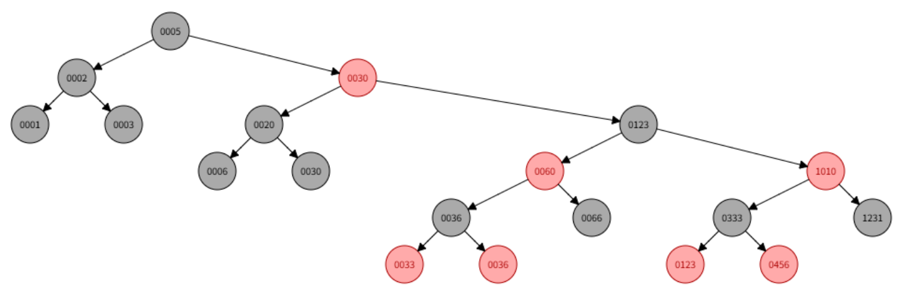
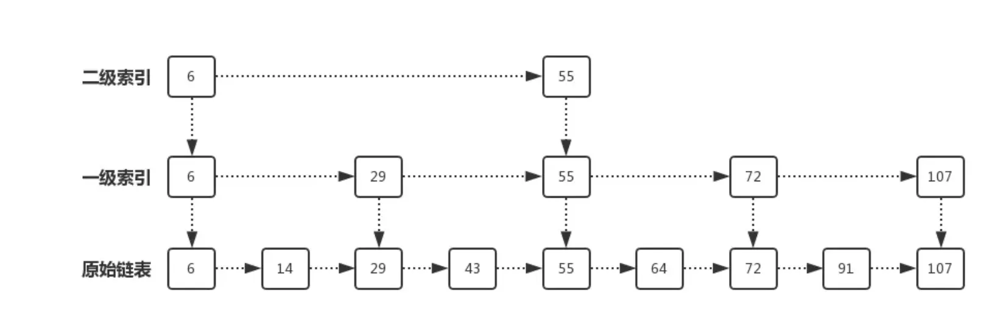

# ThreadLocal

ThreadLocal 是一个线程本地变量，每个线程都会创建一个单独的副本。线程之间的访问会被隔离开，因此可以保证访问的安全性。每个 ThreadLocal 都包含一个静态内部类 ThreadLocalMap，ThreadLocalMap 中又包含着一个 Entry 数组，每个 Entry 由一个 key 和 value 组成，key 是指向 ThreadLocal 的弱引用

弱引用可以保证不发生内存泄漏，如果是强引用，只有等到线程结束，ThreadLocal 对象才会被回收，而弱引用则会在下一次 GC 时被回收

这仍然无法防止内存泄露，因为 Entry 对 value 是强引用，所以除非等到线程结束，否则value 无法被直接释放。因此需要在每次使用完后，调用remove()方法，来手动清除内存的使用

## Tips

既然每次都必须要手动调用remove()方法，那弱引用的设计有什么作用？

以下是基于没有手动调用remove()方法的情况下

假设现在有一个ThreadLocal t1的key是强引用，如果此时设置了 t1 = null，但是由于key是强引用，它依旧持有ThreadLocal对象，导致ThreadLocal对象内存泄露，value对象也泄露

但是如果key是弱引用，在设置t1 = null 时，就会直接把key的内存释放掉，回收ThreadLocal对象，在下次调用set()或者get()方法时，ThreadLocal的自我清理机制就会检查那些key为null的对象，将其内存清理掉，释放掉那些key为null的value所占的内存

因此，设置key为弱引用，相当于在忘记调用remove()方法时，添加一重保障

# Spring 自动装配

@SpringBootApplication 注解中有一个@EnableAutoConfiguration 注解，用于开启自动化装配，@EnableAutoConfiguration 注解中使用了@Import 注解导入一个AutoConfigurationImportSelector类，用于在应用启动时，**找到并加载所有符合条件的自动化配置类**

## 自动装配

在Spring 2.7以前，是通过 META-INF 文件夹下的 spring.factories 文件注册的，其中

org.springframework.boot.autoconfigure.EnableAutoConfiguration 键对应的值就是自动化配置的全限定名列表，用逗号分割，早期版本中，AutoConfigurationImportSelector 主要依赖 SpringFactoriesLoader 工具类来读取 spring.factories 文件中的全限定类名，查找所有JAR 包下的 spring.factories 文件并加载指定的键值

Spring 2.7 以后，引入了 META-INF/spring/org.springframework.boot.autoconfigure.AutoConfiguration.imports 这个专门用于自动化配置的文件，文件的每一行包含了一个自动化配置类的全限定类名

---

## 条件注解

@ConditionalOnClass: 当指定的类存在于运行时类路径中时生效
@ConditionalOnMissingBean: 当 Spring 容器中不存在指定类型的 Bean 时生效
@ConditionalOnProperty: 当指定的配置属性存在且符合指定值时生效
@ConditionalOnResource: 当指定的资源文件存在于类路径中时生效
@ConditionalOnWebApplication: 当应用程序是 Web 应用时生效

# Spring SpringBoot SpringMVC 区别

Spring是一种IOC容器，可以用于Bean管理，使用依赖注入来实现控制反转，同时通过AOP机制来减少OOP代码重复的问题，可以将一些重复的代码抽取成一个切面，通过注入的方法来执行

SpringMVC是Spring里的一个Web框架，提供了一个前端控制器Servlet，用于控制请求，然后定义了一套路由策略及适配执行Handle，将Handle执行结果通过解析技术展示给前端

SpringBoot是Spring提供的一个快速开发工具包，减去了一系列繁琐的文件配置，整合了一系列依赖，通过引入starter依赖可以直接使用

# 注解的原理

注解本质上是一种标记，一种元数据，本身不对类和方法做出任何改变，让编译器和框架在特定的情况下去进行一定的处理。@Retention注解定义其生命周期

# 工厂模式

实现了FactoryBean接口的对象，通常会实现getObject和getObjectType两个方法，将这个对象注册到容器之后，通过getBean("myFactoryBean")获取对象的时候，会优先获得到getObject返回的对象，只有当getBean获取的对象前加上&，才能获取到工厂对象本身

# 为什么不推荐Executors创建线程池

Executors创建的线程池，其本质上是调用了ThreadPoolExecutor

```java
public static ExecutorService newFixedThreadPool(int nThreads) {
        return new ThreadPoolExecutor(nThreads, nThreads,
                                      0L, TimeUnit.MILLISECONDS,
                                      new LinkedBlockingQueue<Runnable>());
    }
```

而用这个方法创建的线程池，使用的是一个无界的阻塞队列，在高并发的场景下，可能会接受到过多的请求，从而导致OOM问题

## 线程池在处理任务时，发生了异常

1. 异常被捕获了，没有抛出：该线程则会继续执行后续的代码，对线程无影响

2. 异常没有被捕获，且使用的是execute执行任务：如果异常没有被捕获，线程池会销毁当前执行任务的线程，并重新创建一个新线程，加入到线程池中，以维持线程池中的线程数量不变

3. 异常没有被捕获，且使用的是submit执行任务：线程池不会销毁当前执行任务的线程，但是会在submit方法的返回值中获取到异常，即异常会在Future的对象中，通过get方法获取到异常，getCause方法可以知道任务抛出的异常类型

# Spring如何给静态变量注入值

## 常规方法为什么不能给静态变量注入值

静态变量是在类加载的时候就已经存在了，而依赖注入要等到Bean对象实例化之后才会进行，所以常规方法无法给静态变量注入值

1. 使用@PostConstruct注解，可以先依赖注入实例变量，然后在PostConstruct阶段将实例变量的引用赋值给静态变量

2. 利用构造器注入，在Spring容器创建对象的时候，通过构造器的方式，将依赖的对象传递进来，然后在构造方法中将这个对象赋值给静态变量

3. 利用ApplicationContextAware，让类实现ApplicationContextAware接口，将整个静态的ApplicationContext对象都注入到Bean对象中，让Bean对象可以随时通过静态方法getBean来获取到静态变量的值
# Cookie和Session
## Cookie
第一次登录后服务器返回一些数据（cookie）给浏览器，然后浏览器保存在本地，当该用户发送第二次请求的时候，就会自动的把上次请求存储的cookie数据自动的携带给服务器，服务器通过浏览器携带的数据就可以判断当前用户是谁了
cookie在生成时会被指定一个Expire值，就是cookie的生命周期，在这个周期内cookie有效，超出周期cookie就会被清除。有些页面会将cookie的生命周期设置为0或负数，这样在关闭浏览器时，就会立马清除cookie，不会记录用户信息，更加安全
**cookie的缺陷**
- XSS（跨站脚本攻击）窃取风险：默认情况下，JavaScript可以通过`document.cookie`读取cookie。如果网站存在XSS漏洞，攻击者注入的恶意脚本就可以直接偷走用户的cookie，然后伪装成用户登录
	解决：可以给cookie设置`HttpOnly`属性，禁止JS访问，这样即使有XSS漏洞，攻击者也无法获得cookie内容
- CSRF（跨站请求伪造）攻击：由于浏览器会自动携带cookie，如果你登录了银行网站，又点开了一个恶意页面，这个恶意页面就可以伪造一个转账请求，浏览器会自动携带上银行cookie
	解决：使用`SameSite`属性，限制第三方请求携带cookie；或使用CSRF Token进行双重校验
- 明文传输：如果网站只使用HTTP，cookie在网络上就会以明文传输，很容易被人截获并重放攻击
	解决：强制使用HTTPS，并为cookie设置secure属性，确保cookie只通过加密链接传输
- cookie能存储的数据很少，大多数浏览器限制单个cookie不超过4kb，无法存储一些稍微大一些的数据
**cookie只适用于对安全性要求不高，不需要存储大量数据的场景**
## Session
session是服务端的一块临时存储空间，专门用于保存特定用户在会话期间的状态数据
当用户请求来自应用程序的Web页时，如果该用户还没有会话，则Web服务器将自动创建一个Session对象。这样，当用户在应用程序的Web页之间跳转时，存储在session对象中的变量将不会丢失，而是在整个用户会话中一直存在下去
用户登录成功后，服务端会将用户信息和sessionID保存在服务端，作为session，并将sessionID发送给客户端，客户端会通过cookie将sessionId保存起来，客户端保存的sessionId的key通常是`JSESSIONID`
**session的优势**
- 极高的安全性：用户敏感数据全都存放在服务端，客户端只存储一个无意义的随机ID，即使黑客通过XSS攻击获取到了sessionId，也无法推导出任何的用户信息
- 存储量大：服务器内存远大于4KB，可以存储更多的数据
- 主动失效：服务器可以随时主动销毁一个session，而无需等待cookie过期
**session的缺陷**
- 内存消耗大：每个在线用户都需要占用服务器内存，如果同时有100万个用户在线，即使每个session只存1KB数据，也需要1GB的内存，且随着用户增多而线性增长
	解决：将session从本地内存移到外部Redis缓存。Redis支持LRU淘汰策略，内存效率高，且重启应用不会丢失登录状态
- 分布式扩展性差：用户第一次请求落在服务器A，服务器A存储了session数据。第二次请求被负载均衡转发到服务器B，服务器B中没有session，用户就需要强制重新登录
	解决：所有服务器都去同一个redis中读取数据
- 依赖·cookie：客户端必须开启cookie才能正常工作，否则URL重写方案极其复杂
	解决：在移动端/前后端分离场景，弃用session，改用JWT或OAuth2 Token，通过请求头手动传递
- 跨域限制：不同子域名（如a.com和b.com）共享session需要复杂的cookie domain配置，跨顶级域名（如a.com和b.net）则无法共享
# 正向代理和反向代理

## 正向代理
正向代理代理的是**客户端**，客户端通过它来访问外部网络。
客户端会向代理服务器发送请求，指定目标地址，再由代理服务器去获取内容并返回给客户端
## 反向代理
反向代理代理的是**服务器**，外部客户端通过它来访问内部的服务器集群
客户端访问反向代理服务器，然后由反向代理服务器将请求转发到内部服务器，并将后端服务器返回的结果发给客户端
# CDN
CDN内容分发网络是通过将文件分发到全球或全国各地的加速节点，让用户就近从最近的节点访问资源，减少跨网络、跨地域带来的延迟，提高加载资源的速度
# Docker
## Docker和虚拟机的区别
- **虚拟机**：通过Hypervisor在宿主机上模拟一整套硬件，每台VM都跑着一个完整的Guest OS内核，隔离性极强但是开销大，启动要几十秒、镜像几个GB、单实例内存占用GB级别
- **Docker容器**：所有容器共享宿主机的Linux内核，通过Namespace做视图隔离、cgroups做资源限制，本质上容器就是一组被隔离起来的特殊进程。启动秒级、镜像几十到几百MB、内存开销MB级别
## Docker的核心组件
- **镜像(Image)**：只读的模板，包含了运行一个应用所需要的代码、依赖、环境、变量、配置等，相当于安装包
- **容器(Container)**：镜像的运行时实例，可以启动、停止、删除，是一个独立隔离的进程组，相当于安装后运行起来的程序
- **仓库(Registry)**：存储和分发镜像的地方，分共有仓库和私有仓库
以上三者的协作流程是：从仓库拉去镜像->由镜像启动容器->容器运行应用
镜像是静态的模板，容器是镜像的动态运行实例，相当于类和对象的关系。镜像对应类，定义了应用的结构和行为，是只读的；容器对应对象，是镜像被启动后的具体实例，有自己的文件系统读写层、网络、进程
## Dockerfile常用指令
- `FROM`：指定基础镜像，必须是Dockerfile的第一条指令
- `WORKDIR`：设置容器内的工作目录，相当于`cd`
- `COPY/ADD`：把宿主机的文件拷贝到镜像里，ADD比COPY多了两个功能，一个是**自动解压**，如果源文件是`tar.gz`之类的压缩包，ADD会自动解压到目标目录，一个是**支持URL**，ADD可以直接从URL下载远程文件到镜像
- `RUN`：在构建阶段执行命令，每条`RUN`产生一个新层
- `ENV`：设置环境变量
- `ARG`：构建时的参数，只在`docker build`阶段有效
- `EXPOSE`：声明容器要监听的端口
- `VOLUME`：声明数据卷挂载点
- `CMD/ENTRYPOINT`：指定容器启动时默认要运行的命令，CMD提供默认命令，可以被docker run后面跟的参数完全覆盖，ENTRYPOINT设置容器的主命令，不会被docker run覆盖，后面跟的参数会作为参数追加到ENTRYPOINT后面
- `USER`：切换到非root用户运行
# 红黑树和跳表
**红黑树**
红黑树是一种自平衡的二叉搜索树，它在插入和删除操作后能够通过旋转和重新着色来保持树的平衡。红黑树的特点如下
- 每个节点都有一个颜色，红色或黑色
- 根节点是黑色的
- 每个叶子节点（NIL节点）都是黑色的
- 如果一个节点是红色的，则它的两个子节点都是黑色的
- 从根节点到叶子节点或空子节点的每条路径上，黑色节点的数量是相同的
红黑树通过以上特性来保持树的平衡，确保最长路径不超过最短路径的两倍，从而保证了在最坏情况下的搜索、插入和删除操作的时间复杂度都为O(logN)

**跳表**
跳表是一种基于链表的数据结构，通过添加多层索引来加速搜索操作
跳表的特点如下
- 跳表中的数据是有序的
- 跳表中的每个节点都包含一个指向下一层和右侧节点的指针
跳表通过多层索引的方式来加速搜索操作。最底层是一个普通的有序链表，而上面的每一层都是前一层的子集，每个节点在上一层都有一个指针指向它在下一层的对应节点。这样，在搜索时可以通过跳过一些节点，直接进入目标区域，从而减少搜索的时间复杂度
跳表的平均搜索、插入和删除操作的时间复杂度都为O(logN)，与红黑树相比，跳表的实现更加简单但空间复杂度较高。跳表常用于需要高效搜索和插入操作的场景

# 排序算法
- **冒泡排序**：通过相邻元素的比较和交换，每次将最大（或最小）的元素逐步冒泡到最后（或最前）。时间复杂度：最好的情况下O(n)，最坏的情况下O(n^2)，平均情况下O(n^2)，空间复杂度O(1)
```c++
void bubbleSort(vector<int>&arr) {
	int n = arr.size();
	for(int i = 0;i < n;i++) {
		bool swapped = false;
		for(int j = 0; j < n - 1 - i;j++) {
			if (arr[j] > arr[j+1]) {
				swap(arr[j],arr[j+1]);
				swapped = true;
			}
		}
		// 如果本轮没有交换，说明数组已经有序
		if (!swapped) {
			break;
		}
	}
}
```
- **插入排序**：将待排序的元素逐个插入到已排序序列的合适位置，形成有序序列。时间复杂度：最好的情况下O(n)，最坏的情况下O(n^2)，平均情况下O(n^2)，空间复杂度O(1)
```c++
void insertionSort(vector<int>&arr) {
	int n = arr.size();
	for(int i = 1;i < n;i++) {
		int key = arr[i];
		int j = i - 1;
		while (j >= 0 && arr[j] > key) {
			arr[j + 1] = arr[j];
			j--;
		}
		arr[j + 1] = key;
	}
}
```
- **希尔排序**：希尔排序不像插入排序那样只比较相邻元素，而是引入一个间隔。首先将数组按照固定间隔分割成若干个子序列，然后对每个子序列分别进行直接插入排序。然后不断缩小gap值，再次分组排序。不断重复，直到gap=1，进行最后一次普通的插入排序。时间复杂度：最好的情况下O(nlogn)，最坏的情况下O(n^(4/3))，空间复杂度O(1)
```c++
void shellSort(vector<int>&arr) {
	int n = arr.size();
	// 初始增量gap = n/2，逐步缩小至1
	for(int gap = n / 2;gap > 0; gap /= 2) {
		// 对每个子序列（相隔gap的元素）进行插入排序
		for(int i = gap;i < n;i++) {
			int temp = arr[i];
			int j = i;
			// 跨gap比较移动
			while(j >= gap && arr[j - gap] > temp) {
				arr[j] = arr[j - gap];
				j -= gap;
			}
			arr[j] = temp;
		}
	}
}
```
- **选择排序**：通过不断选择未排序部分的最小（或最大）元素，并将其放置在已排序部分的末尾（或开头）。时间复杂度：最好的情况下O(n^2)，最坏的情况下O(n^2)，平均情况下O(n^2)，空间复杂度O(1)
```c++
void selectionSort(vector<int>&arr) {
	int n = arr.size();
	for(int i = 0;i < n - 1;i++) {
		int minIdx = i;
		for(int j = i + 1;j < n;j++) {
			if(arr[j] < arr[minIdx]) {
				minIdx = j;
			}
		}
		if (minIdx != i) {
			swap(arr[i],arr[minIdx]);
		}
	}
}
```
- **快速排序**：通过选择一个基准元素，将数组划分为两个子数组，使得左子数组的元素都小于（或等于）基准元素，右子数组的元素都大于（或等于）基准元素，然后对子数组进行递归排序。时间复杂度：最好的情况下O(nlogn)，最坏的情况下O(n^2)，平均情况下O(nlogn)，空间复杂度：最好的情况下O(logn)，最坏的情况下O(n)
```c++
// 选择一个基准元素
int partitionLomuto(vector<int>&arr,int low,int high) {
	int pivot = arr[high]; // 选择最后一个元素作为基准
	int i = low; // i指向小于基准的区域的末尾
	for(int j = low;j < high;j++) {
		if(arr[j] <= pivot) {
			swap(arr[i],arr[j]);
			i++;
		}
	}
	swap(arr[i],arr[high]); // 将基准放到中间
	return i;
}
// 递归调用，将数组分为两半分别进行快排
void quickSortRec(vector<int>&arr,int low,int high) {
	if(low < high) {
		int pi = partitionLomuto(arr,low,high);
		quickSortRec(arr,low,pi - 1);
		quickSortRec(arr,pi + 1,high);
	}
}
void quickSort(vector<int>&arr) {
	if (!arr.empty()) {
		quickSortRec(arr,0,arr.size() - 1);
	}
}
```
- **归并排序**：将数组不断分割为更小的子数组，然后将子数组进行合并，合并过程中进行排序。时间复杂度：最好情况下O(nlogn)，最坏情况下O(nlogn)，平均情况下O(nlogn)，空间复杂度O(n)
```c++
void merge(vector<int>&arr,int l,int mid,int r) {
	int n1 = mid - l + 1;
	int n2 = r - mid;
	vector<int> L(n1),R(n2);
	for(int i = 0;i < n1;i++) L[i] = arr[l + i];
	for(int j = 0;j < n2;j++) R[j] = arr[mid + 1 + j];
	int i = 0,j = 0,k = l;
	while(i < n1 && j < n2) {
		if(L[i] <= R[j]) {
			arr[k++] = L[i++];
		}else{
			arr[k++] = R[j++];
		}
	}
	while(i < n1) arr[k++] = L[i++];
	while(j < n2) arr[k++] = R[j++];
}

void mergeSortRec(vector<int>&arr,int l,int r) {
	if(l < r) {
		int mid = l + (r - l) / 2;
		mergeSortRec(arr,l,mid);
		mergeSortRec(arr,mid+1,r);
		merge(arr,l,mid,r);
	}
}
void mergeSort(vector<int>&arr) {
	if(!arr.empty()) {
		mergeSortRec(arr,0,arr.size() - 1);
	}
}
```
- **堆排序**：通过将待排序元素构建成一个最大堆（或最小堆），然后将堆顶元素与末尾元素交换，再重新调整堆，重复该过程直到排序完成。时间复杂度：最好的情况下O(nlogn)，最坏的情况下O(nlogn)，平均情况下O(nlogn)，空间复杂度O(1)
```c++
void heapify(vector<int>&arr,int n,int i) {
	int largest = i; // 初始化根节点为最大值
	int l = 2 * i + 1;
	int r = 2 * i + 2;
	if (l < n && arr[l] > arr[largest]) {
		largest = l;
	}
	if (r < n && arr[r] > arr[largest]) {
		largest = r;
	}
	if (largest != i) {
		swap(arr[i],arr[largest]);
		heapify(arr,n,largest); // 递归调整受影响的子树
	}
}

void heapSort(vector<int>&arr) {
	int n = arr.size();
	for(int i = n / 2 - 1;i >= 0;i--) {
		heapify(arr,n,i);
	}
	for(int i = n - 1;i > 0;i--) {
		swap(arr[0],arr[i]);
		heapify(arr,i,0); // 对缩小的堆进行调整
	}
}
```
# 如何设计一个秒杀系统
秒杀系统的核心特点就是**高并发、低库存、短时间爆发式访问**，在设计时需要注意以下几个问题
- **高并发处理**：如何应对大量用户同时访问
- **库存一致性**：如何保证库存不会超卖或少卖
- **用户体验**：如何减少用户等待时间，避免页面崩溃
- **防刷机制**：如何防止恶意用户利用脚本抢购商品
需要对以下几个方面做出应对
1. **前端与网关层**：首先，秒杀页面的所有图片、CSS等静态资源都放在CDN上，做到动静分离，只有点击**抢购**时瞬间产生的是动态请求。其次，网关层需要做**限流和防刷**。比如同一个单IP一秒只能请求1次，或者在抢购前加一个滑块验证码或答题。这样可以防止大量的脚本机器，另一方面把用户原本高度集中的一毫秒点击，在物理上打散成了好几秒（用户验证的时间不一样），这样可以起到流量错峰作用
2. **Redis预扣减库存**：假设这一层有1w个有效请求进来了，这时候不能去查MySQL。所有库存必须提前缓存进Redis。这里主要是为了防止超卖。在这一层中，如果只是单纯的查一下Redis库存，再减一。这样可能就会导致超卖。而为了解决这个问题，可以采用Redis+Lua脚本。它可以在Redis层把**查库存+扣减库存**两个操作变成一个原子性的操作。只要Redis库存变成了0，剩余的请求全都会返回库存已空。这样性能很高，并且在内存层面杜绝了超卖现象
3. **消息队列异步下单**：Redis成功扣减了库存，下单成功后，并不是立马去调用订单服务、支付服务，并把数据写进MySQL。而是要利用**消息队列**做异步削峰。Redis扣减成功后，服务只会往MQ中发送一条消息，告知用户成功抢到商品，并直接返回给前端。这时候前端页面开始轮询。订单服务作为MQ的消费者，会根据自己数据库能够承受的速度，将MQ从消息中拿出来，并在MySQL中扣减库存，保存数据。这就是异步削峰填谷
4. **最终一致性校验**：在Redis扣减库存和数据库库存更新之间，可能会存在短暂的数据不一致。为了保证数据的最终一致性，需要采取以下措施。**定期将Redis中的库存数据和数据库进行同步。如果发现了Redis和数据库库存不一致，触发补偿逻辑（回滚订单或调整库存）**
# 如何设计一个短链接系统
**短链接是如何跳转的**
短链接的跳转，就是使用了HTTP协议里面的重定向机制。当用户浏览器访问短链接时，我们的服务器去查到对应的长链接，然后给浏览器返回一个特定的状态码和`Location`响应头，浏览器就会自动跳往真实地址
**状态码必须用302，而不是301。** 因为301是永久重定向，浏览器第一次拿到真地址后就会把它缓存在本地，下次用户再点击短链接，浏览器就会直接跳转过去，而不会经过服务器。这就会导致服务端想要统计短链接统计量，就完全统计不到。而302是临时重定向，每次点击都会先请求一次服务器，方便做数据埋点和流量监控
**如何生成短链**
短链一般就是类似于`t.cn/XyA1b2`这种后缀大概包括6位实际支付的短串。对于这个，不能直接使用MD5等哈希算法对长链接做哈希处理。这个方案会导致哈希冲突，哈希值如果截断成6位短串，很容易出现两个不同的长链接算出一模一样的短链，处理冲突的代码会很麻烦
对于上述问题，业界标配方法就是**分布式ID发号器+Base62转换方案**
- 首先是分布式ID生成机制，给每一个新发来的长链接，分配一个全局唯一、绝对不重复的递增数字ID
- 然后把这个十进制的数字ID，转换成62进制 **（0-9、a-z、A-Z 加起来刚好62个字符）** 62的6次方大概有568亿个不同的链接
**如何做存储和抗并发**
短链接系统是一个典型的**读多写少**的系统。写操作就是生成短链接，存在MySQL就行，一行存数字ID（或者生成的短串），一行存储原始长链，并给短串加上唯一索引。但是读操作的并发往往非常高。比如一条营销短信发出去，瞬间有几百万点击进来查短链接。所以绝对不能让请求直接打到MySQL上。我们必须引入Redis缓存。用户拿短链接来访问，先去Redis中查映射关系，查到了直接拼装302响应返回。查不到就再去MySQL中查询，查到了之后立即写入Redis中
# 如何设计一个点赞系统
这是一个典型的**高频读写**的场景。一篇文章或一个视频发布后，可能会短时间内涌入大量用户疯狂点赞或取消点赞，同时每进来一个刷文章的用户，系统都得立即告诉他`这篇文章有多少赞`以及`用户有没有点过赞`
对于这种高并发场景，肯定不能直接将读写操作直接请求到数据库中，这样很容易导致数据库扛不住压力而挂掉
核心思路就是**所有核心读写操作必须完全交给Redis在内存中完成，然后再通过异步的方式悄悄把数据同步到MySQL做永久保存**
具体落地上，主要有三个核心步骤
- **Redis如何存储点赞数据**：首先需要满足两个需求，获得总点赞数和获得某人有没有点过赞。对于记录谁点过赞，可以利用Redis的**Set集合**这个数据结构。例如某篇文章ID位1，就可以建一个键为`article:likes:1`的Set。用户如果点赞了，就可以把他的userId通过`sadd`加到集合中。取消点赞了就可以通过`srem`将userId移出来。需要高亮前端的点赞按钮时，就可以利用`sismember`判断一下他的userId在不在集合中。同时，利用`scard`命令，可以快速查出这个集合中有多少人
- **数据怎么存到MySQL中兜底**：因为Redis是内存数据库，如果数据哪怕有一点丢失，也是我们不想看到的，所以需要把这些点赞记录存到MySQL的点赞明细表和内容汇总表里。但是这不能是同步的。可以通过消息队列，当用户在前端点赞，后端在Redis里操作成功后，不立刻写进数据库中，而是往MQ中发一条信息（用户A在B时刻给C文章点赞）。然后后端会有专门的消费者去拉取这些消息，把它们攒起来进行批量操作，平滑、慢速地写到MySQL中。
- **如何处理大V热点**：实际业务中，最怕的就是某顶流明星突然发一条微博，几百万人瞬间进入点赞，这时即使使用Redis，也可能因为这个帖子导致大量的请求打到同一台Redis服务器中，形成**热点Key**问题。为了应对这种情况，可以在Redis上面再加一层**本地大对象缓存（Local Cache）**。一旦系统探测到这个文章是一篇热点文章，就把总点赞数缓存进应用服务器自己的JVM内存里，并且每个一两秒汇总一下这段时间的新增点赞数，合并成一次请求再去更新Redis，这样就能减少Redis的压力
# 如何实现订单超时取消
- **定时轮询**：基于SpringBoot的`Scheduled`实现，通过定时任务扫描数据库中的订单。优点是实现简单直接，但是会给数据库带来持续的压力，处理效率受任务执行间隔影响较大，且在高并发场景下可能引发并发问题和资源浪费
- **延迟队列**：基于优先队列实现，减少数据库访问，提供高效的任务处理。优点是内部数据结构高效，线程安全。缺点是所有待处理订单需要保存在内存中，可能导致内存消耗大，且无持久化机制，系统崩溃可能会导致数据丢失
- **时间轮算法**：通过时间轮结构实现定时任务调度，能够高效处理大量定时任务，提供精确的超时控制。优点是实现简单，执行效率高，且有成熟的实现库。缺点是内存占用和崩溃时数据丢失的问题
- **Redis有序集合**：利用有序集合的特性，定时轮询查找已超时的任务。优点是查询效率高，适用于分布式环境，减少数据库压力。缺点是依赖定时任务执行频率，处理超时订单的实时性受限，且还需要保证事务一致性的问题
- **Redis Key过期监听**：利用Redis键过期时间自动触发订单取消逻辑。优点是实时性好，资源消耗少，支持高并发。缺点是对Redis服务的依赖性强，极端情况下处理能力可能成为瓶颈，且键过期有一定的不确定性
- **MQ延迟队列**：实现消息在指定延迟后送达处理队列。优点是处理高效，异步执行，易于扩展，模块化程度高。缺点是依赖消息队列服务，配置复杂度增加，可能涉及消息丢失或延迟风险，以及消息队列与数据库操作一致性的问题
- **MQ死信队列**：通过设置队列TTL将超时订单转换成死信，由监听死信队列的消费者处理。优点是能捕获并隔离异常消息，实现业务逻辑分离，资源保护良好，方便追踪和分析问题。缺点是相比于延迟队列，处理超时不够精确，配置复杂，且同样存在消息处理完整性和一致性问题
# 系统QPS突然提升10倍该怎么处理
**紧急处理**
面对突然提升10倍的QPS，首先需要保证系统不会直接挂掉，需要先做**限流和降级**。可以利用Sentinel这类工具，在网关层就设置好最大的TPS阈值，超过系统承载能力的请求直接快速失败，返回系统繁忙提示。然后就是**业务降级**，比如在电商场景下，可以关闭一些像猜你喜欢、评论显示、积分发放等一些非核心业务，把所有的服务器CPU和内存资源全部让给下单和支付这两个最核心的业务动作。并且可以通过k8s动态增加容器节点来进行**弹性扩展**，用加机器来扛住高并发
**架构升级**
如果10倍QPS变成了常态，就需要对系统架构进行升级
首先需要做**多级缓存储备**。引入**本地缓存+Redis分布式系统缓存**的双层架构。对于那些极少变化的热点数据，直接加载到应用服务器自己的JVM内存里。这样大量的读请求连网络请求都不用发，在服务器本地就直接拿到数据返回了，系统的响应时间会被压到极致，也能极大地保护后端的Redis和MySQL
然后就是做**排队削峰**。当10倍的用户同时进行下单或点赞这种写操作时，绝对不能让请求直接打进数据库。可以引入消息队列，前台的请求一过来，只要基础校验通过，就立刻扔一条消息进MQ，然后马上告诉前端`"请求正在处理中"`。接着，后端的服务根据数据库能承受的真实写入速度，平稳、慢速地从MQ里拉取请求去执行。
如果上述方案做完，底层存储的数据量和并发连接还是达到了瓶颈，说明单台MySQL达到极限了。这时候就需要做**读写分离**和**分库分表**。用主库抗写压力，多台从库抗读压力。把原来一张上亿级的大表，拆分成100张小表，分散到不同的机器上，以扩充底层的吞吐量
# 一个大流量网站，单Redis无法承压该如何解决
- 读写分离：部署多个Redis从节点，主节点负责写操作，从节点负责读操作。主节点将数据同步到从节点，从节点可以处理大量的读请求，减轻主节点压力
- 构建集群：部署Redis Cluster集群，Redis Cluster将数据自动化分为16384个槽，每个槽都可以存储键值对。这些槽会被分配到多个Redis节点上，通过哈希函数将键映射到相应的槽，再由槽映射到具体的Redis节点。例如，使用`CRC16(key)%16384`来确定键属于哪个槽，然后再根据槽与节点的映射关系将键值对存储到相应节点，再通过数据分配，将数据和请求分散到多个节点，避免单个节点的负载过高。不同节点负责不同的槽，各自处理一部分请求，实现负载均衡