## TCP/IP网络模型
### 应用层
应用层，即用户能直接接触到的一层。应用层只需要专注于为用户提供应用功能，比如Http、FTP、Telnet、DNS、SMTP等
应用层不需要关心数据如何传输，数据传输全都由传输层来完成
### 传输层
应用层的包会传给传输层，传输层是为应用层提供网络支持的
传输层有两个重要的传输协议，TCP、UDP
**TCP**
TCP全程传输控制协议，大部分应用使用的都是TCP传输层协议，比如HTTP应用层协议。TCP相比UDP多了很多特性，比如流量控制、超时重传、拥塞空值等。这些都是为了保证数据包能可靠地传输给对方
**UDP**
UDP相对来说就比较简单，UDP只负责发送数据包，不保证数据包是否能抵达对方，但是实时性更好，传输效率更高。
应用层需要传输的数据可能会非常大，如果直接传输就不好控制，因此当传输层的数据包大小超过MSS（TCP最大报文段超度），就要将数据包分块，这样即使中途有一个分块丢失或损坏了，只需要重新发送这一个分块，而不用重新发送整个数据包。TCP协议中，每个分块称为一个TCP段
**应用**
当设备作为接收方时，传输层则要负责把数据包传给应用，但是一台设备上可能有很多应用在传输或者接收数据，因此需要用一个编号将应用区分开来，这个编号就是端口
由于传输层的报文中会携带端口号，因此接收方可以识别出这个报文是发送给哪个应用的
### 网络层
传输层实际上并不负责将数据从一个设备传输到另一个设备
设计传输层的时候，并不希望传输层协议处理太多的东西，只需要服务好应用即可，让其作为应用间的数据传输媒介，帮助实现应用到应用之间的通信，而实际的传输功能就交给下一层，即网络层
网络层最常使用的是IP协议，IP协议会将传输层的报文作为数据部分，再加上IP包头组装成IP报文，如果IP报文大小超过MTU（以太网中一般为1500字节），就会再次进行分片，得到一个即将发送到网络的IP报文
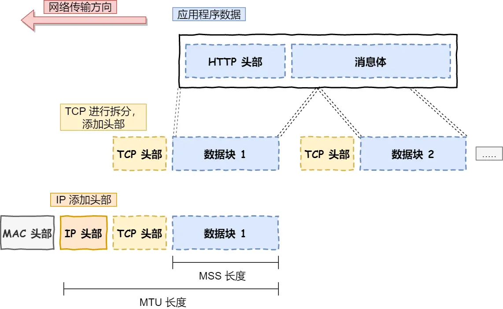
IP地址是网络层用于区分设备的一个编号
对于IPv4协议，IP地址一共32位，分成了四段，每段8位。IP地址分成两种意义
- 一个是网络号，负责表示该IP地址属于哪个子网
- 一个是主机号，负责标识同一子网下的不同主机
对于`10.100.122.0/24`，后面的`/24`表示的就是`255.255.255.0`子网掩码，一共24个1
**计算网络号和主机号**
将IP地址`10.100.122.2`和子网掩码`255.255.255.0`进行按位与运算，就可以得到网络号
```
00001010  01100100 01111010 00000010 # IP地址
11111111  11111111 11111111 00000000 # 子网掩码
00001010  01100100 01111010 00000000 # 按位与得到网络号
```
得到的网络号就是`10.100.122.0`，除了网络号，剩下的部分就是主机号
在网络层寻址的过程中，会先匹配到相同的网络号，才会去寻找对应的主机
除了寻址能力，IP协议还有一个重要的能力就是路由。实际场景中，两台设备并不是通过一条网线连接起来的，而是通过很多网管、路由器、交换机等众多网络设备连接起来的，那么就会形成很多条网络路径，因此当数据包达到一个网络节点，就需要通过路由算法决定下一步走哪条路径
**IP协议的寻址作用就是告诉我们去往下一个目的地该朝哪个方向走，路由则是根据下一个目的地选择路径。**
### 网络接口层
生成了IP头部后，接下来就交给网络接口层，在IP头部的前面加上MAC头部，并封装成数据帧发送到网络上
IP头部中的接收方IP标识网络包的目的地，通过这个地址我们就可以判断要将包发送到哪里，但是在以太网中，这是不行的
以太网就是一种在局域网内，将附近所有设备连接起来，使它们之间可以进行通讯的技术
以太网在判断网络包目的地时和IP的方式不同，因此必须采用相匹配的方式才能在以太网中将包发往目的地，而MAC头部就是这么用的。在以太网中通讯就需要用到MAC地址
MAC头部是以太网使用的头部，它包含了接收方和发送方的MAC地址等信息，我们可以通过ARP协议获取对方的MAC地址

## 键入网址到网页显示期间发生了什么
### 解析URL
浏览器要做的第一步工作就是解析URL，从而生成发送给web服务器的请求信息
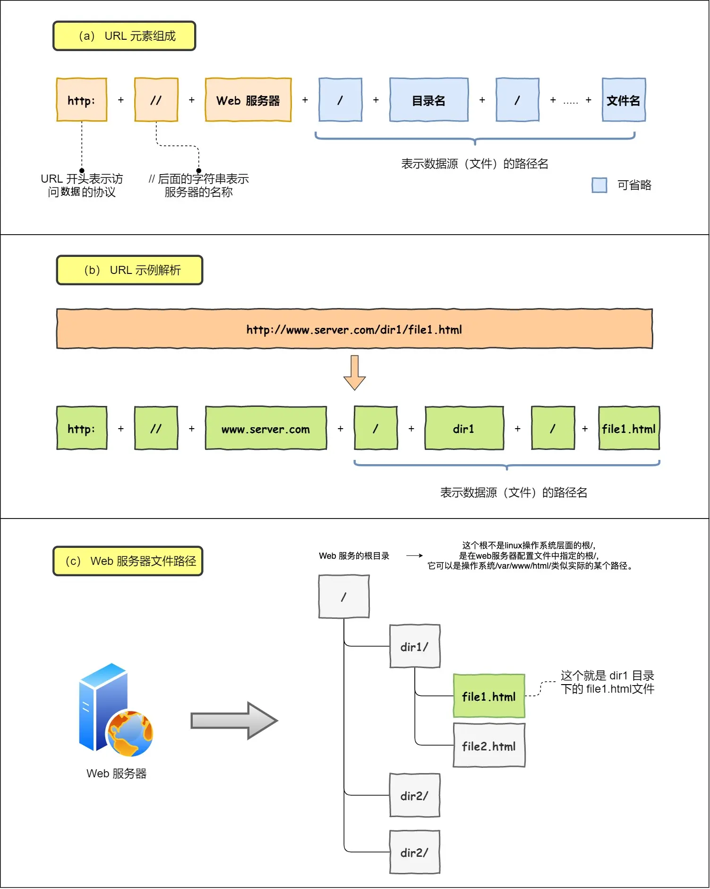
如果上图中蓝色部分的URL元素省略了，就会访问根目录下事先设置的默认文件，也就是`index.html`或者`default.html`
对URL解析之后，浏览器确定了Web服务器和文件名，接下来就根据这些信息来生成http请求消息了
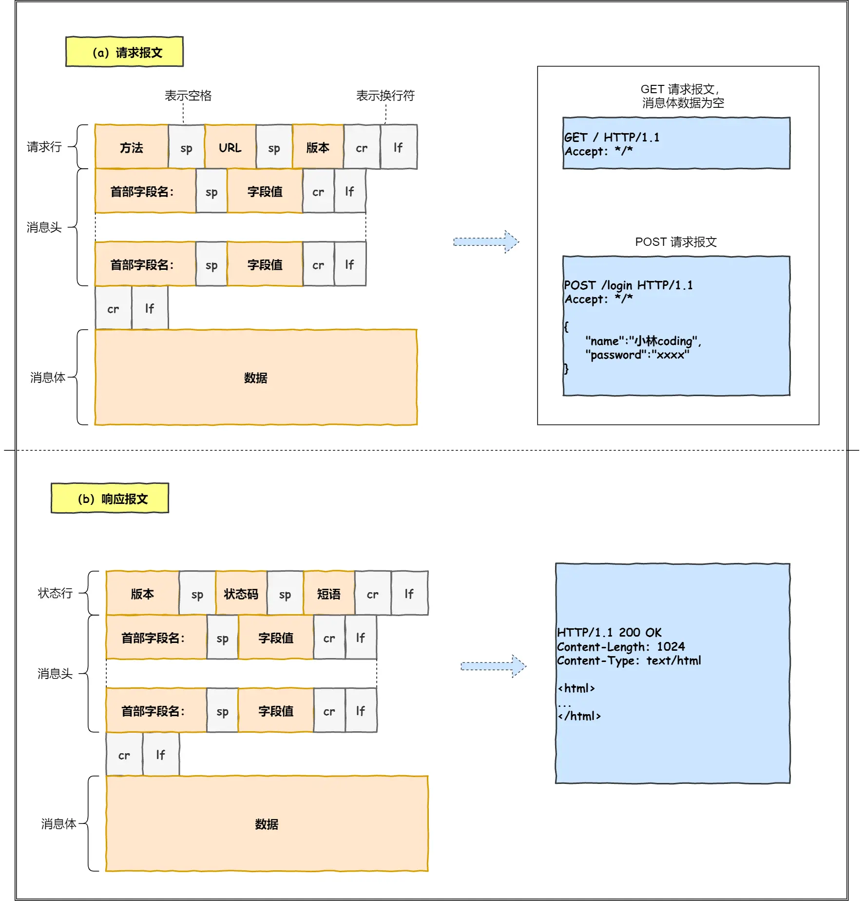
### DNS地址查询
通过浏览器解析URL生成http消息后，需要将消息委托给操作系统将消息发送给Web服务器
发送前，还需要查询服务器域名对应的IP地址，因为委托操作系统发送消息时，必须提供通信对象的IP地址
DNX中的域名都是用句点来分割的，比如`www.server.com`，这里的句点代表了不同层次之间的界限
域名中，越靠右的位置，其层级越高
实际上域名最后还有一个点，比如`www.server.com.`，最后一个点代表根域名
`.`根域是在最顶层，其下一层就是`.com`顶级域，在下面是`server.com`
域名的层级关系类似于一个树状结构
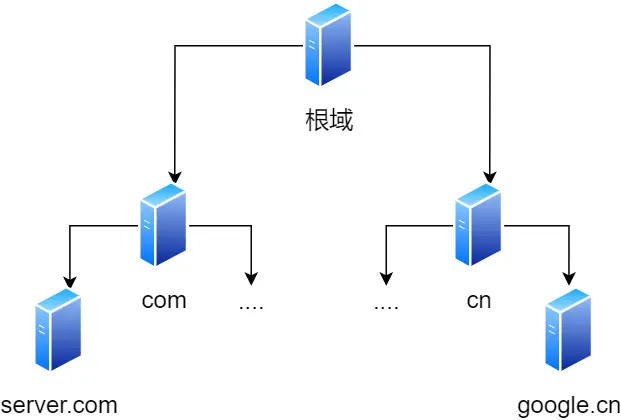
根据的DNS服务器信息保存在互联网中所有的DNS服务器中，这样一来，任何的DNS服务器就都可以找到并访问根域DNS服务器了。客户端只要能找到任意一台DNS服务器，就可以通过它找到根域DNS服务器，然后再找到位于下层的某台目标DNS服务器
**域名解析流程**
1. 客户端首先会发出一个DNS请求，问www.server.com的IP是什么，并发给本地的DNS服务器（也就是客户端的TCP/IP设置中填写的DNS服务器地址）
2. 本地域名服务器收到客户端的请求后，如果缓存里的表格能找到www.server.com，则它直接返回IP地址。如果没有，本地DNS会去问它的根域名服务器，根域名服务器时最高层次的，不用与解析域名
3. 根DNS收到来自本地DNS的请求后，发现后置是.com，就将.com服务器地址返回给本地DNS，让本地DNS去访问.com服务器
4. 本地DNS收到顶级域名服务器的地址后，就去访问顶级域名服务器的地址
5. 顶级域名服务器地址就返回负责`www.server.com`区域的权威DNS服务器的地址，即`server.com`DNS服务器
6. 本地DNS再询问权威DNS服务器，`www.server.com`对应的IP是什么
7. 权威DNS服务器查询后将对应的IP地址返回给本地DNS
8. 本地DNS再将IP地址返回给客户端，客户端和目标建立连接
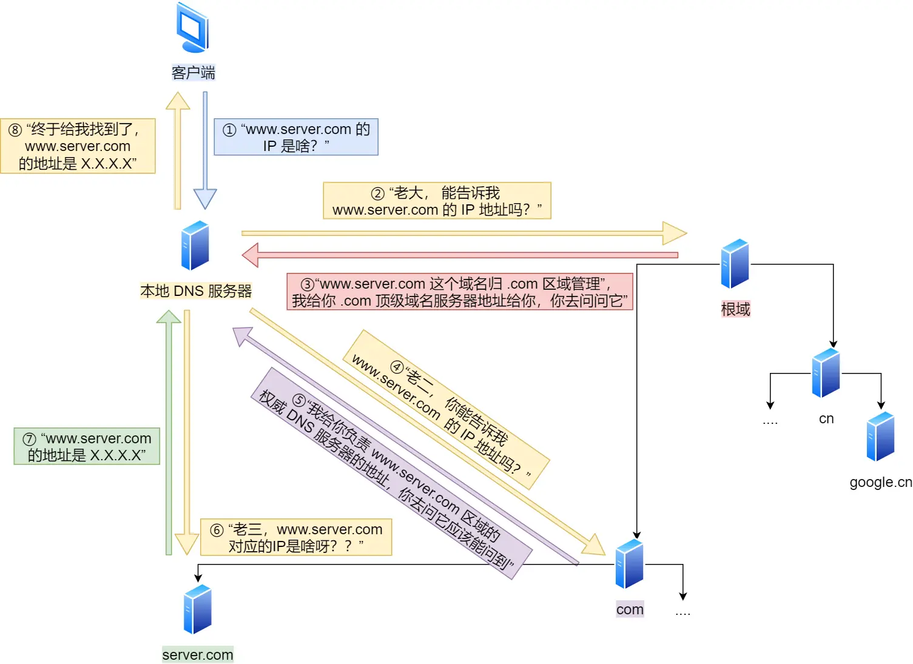
当然，并不是每次访问都需要经过DNS解析，浏览器会先看自身有没有对这个域名的缓存，如果有就直接返回，如果没有就去问操作系统，操作系统也会查看自己的缓存，如果有就直接返回，如果没有，再去hosts文件看，也没有，才会去问本地DNS服务器
### 协议栈
通过DNS获取到IP后，就可以把http的传输工作交给操作系统中的协议栈
协议栈内部分为几个部分，分别承担不同的工作。上下关系是有一定的规则的，上面的部分会想下面的部分委托工作，下面的部分收到委托的工作并执行
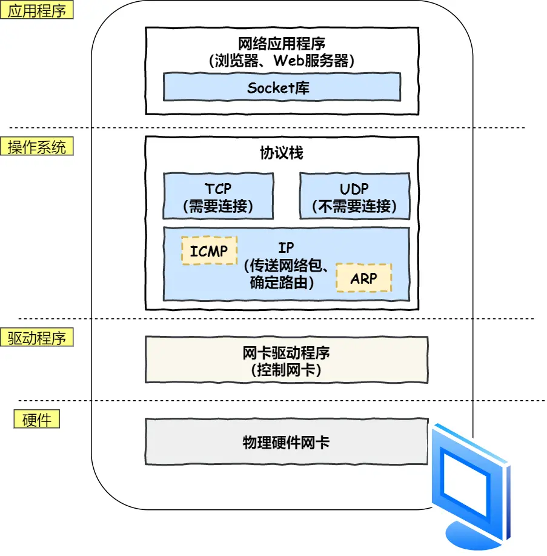
应用程序通过调用Socket库，来委托协议栈工作。协议栈的上半部分有两块，分别是负责收发数据的TCP和UDP协议，这两个传输协议会接收应用层的委托执行收发数据的操作
协议蹭的下半部分是用IP协议空值网络包手法操作，在互联网上传数据时，数据会被写成一块块的网络包，而网络包发送给对方的操作就是由IP负责的
此外，IP中还包括ICMP协议和ARP协议
- ICMP用于告知网络包传送过程中产生的错误以及各种控制信息
- ARP用于根据IP地址查询相应的以太网MAC地址
IP下面的网卡驱动程序负责控制网卡硬件，而最下面的网卡则负责完成还记得手法操作，也就是对网线中的信号执行发送和接收操作
### 可靠传输-TCP
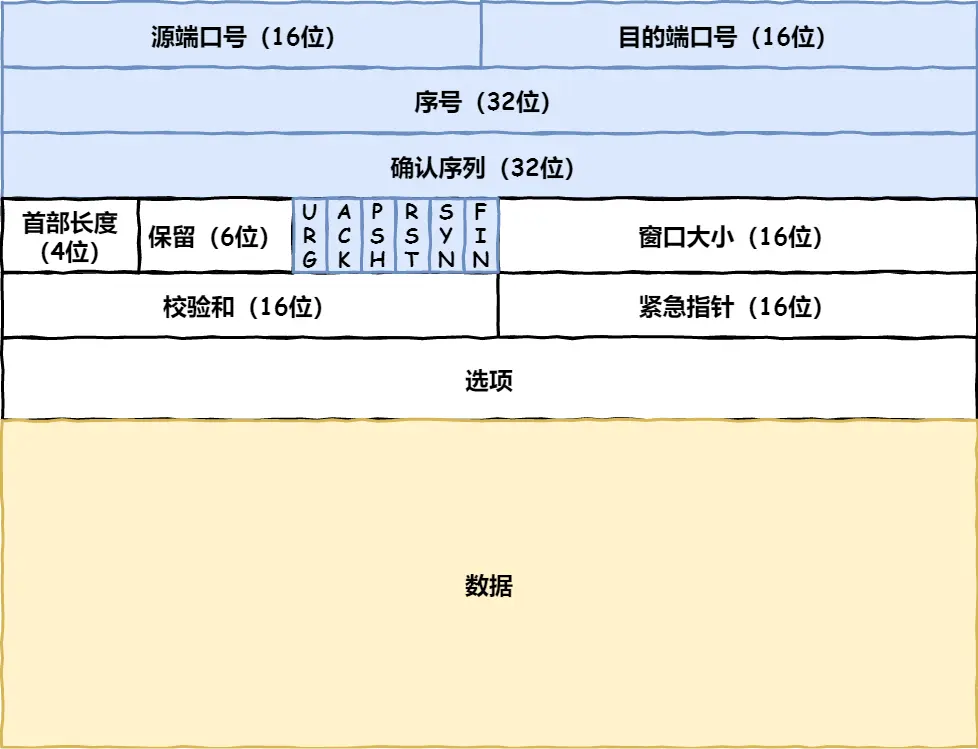
TCP报文头部格式如上图
首先，源端口号和目标端口号是必不可少的，如果没有这两个端口号，数据就不知道该发给哪个应用
接下来是包的序号，为了解决包乱序的问题
还有是确认号，目的是确认发出去对方是否有收到。如果没有收到就应该重新发送，知道送达，这是为了解决丢包问题
状态位，例如`SYN`是发起一个连接，`ACK`是回复，`RST`是重新连接，`FIN`是结束连接。TCP是面向连接的，因而双方要维护连接的状态，这些带状态为的包的发送，会引起双方的状态变更
窗口大小，TCP要做流量控制，通信双方各声明一个窗口，标识自己当前能够的处理能力，让对方发送数据时别太快也别太慢
除了流量控制外，TCP还会做拥塞控制，控制自己发送的速度
**TCP三次握手**
在Http传输数据之前，首先要建立TCP连接，TCP连接的建立，需要三次握手
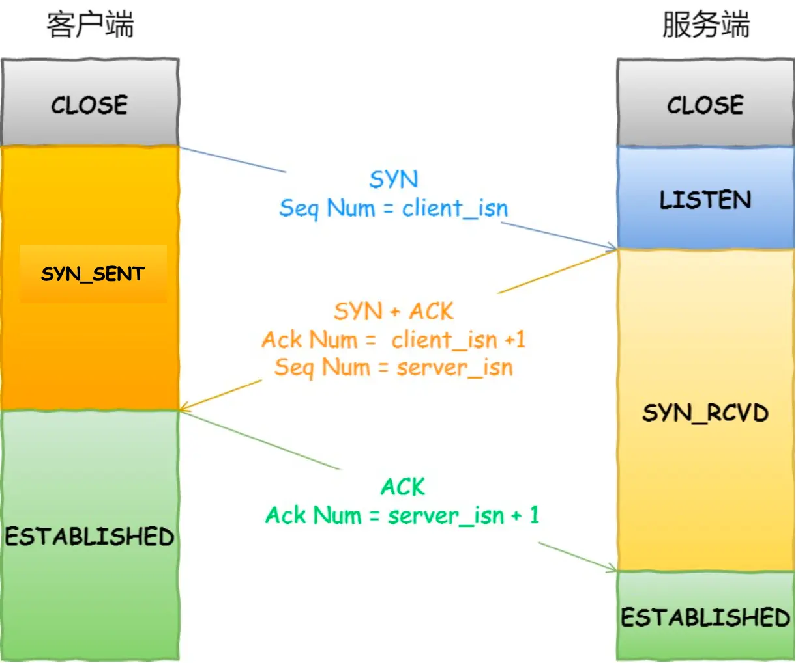
上图是双方计算机里维护的一个状态机，连接建立的过程中，双方的状态变化时序图就是这样的
- 一开始，客户端和服务端都处于CLOSED状态。先是服务端主动监听某个客户端，处于LISTEN状态
- 然后客户端主动发起连接SYN，之后处于SYN-SENT状态
- 服务端收到发起的连接，返回SYN，并且ACK客户端的SYN，之后处于SYN-RCVD状态
- 客户端收到服务端发送的SYN和ACK后，发送对SYN确认的ACK，之后处于ESTABLISHED状态
- 服务端收到ACK之后，处于ESTABLISHED状态
三次握手是为了确保**双方都有发送和接收的能力**
**TCP分割数据**
如果Http请求消息比较长，超过了MSS长度，这时TCP就需要把Http的数据拆解成一块块的数据发送，而不是一次性发送所有数据
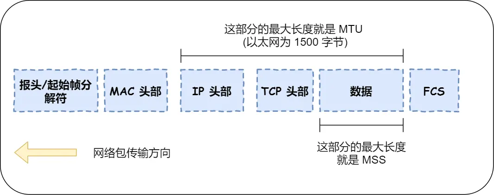
- MTU：一个网络包的最大长度，以太网中一般为1500字节
- MSS：出去IP和TCP头部之后，一个网络包能容纳的TCP数据的最大长度
数据会被以MSS的长度为单位进行拆分，拆分出来的每一块数据都会被放进单独的网络包中。也就是在每个被拆分的数据加上TCP头信息，然后交给IP模块来发送数据
TCP协议里面会有两个端口，一个是浏览器监听的端口（通常是随机生成的），一个是Web服务器监听的端口（Http默认80，Https默认443）
双方建立了连接之后，TCP报文中的数据部分就是存放Http头部+数据，组装好TCP报文之后，就交给下面的网络层处理
### 远程定位-IP
TCP模块在执行连接、收发、断开等各阶段操作时，都需要委托IP模块将数据封装成网络包发送给通信对象
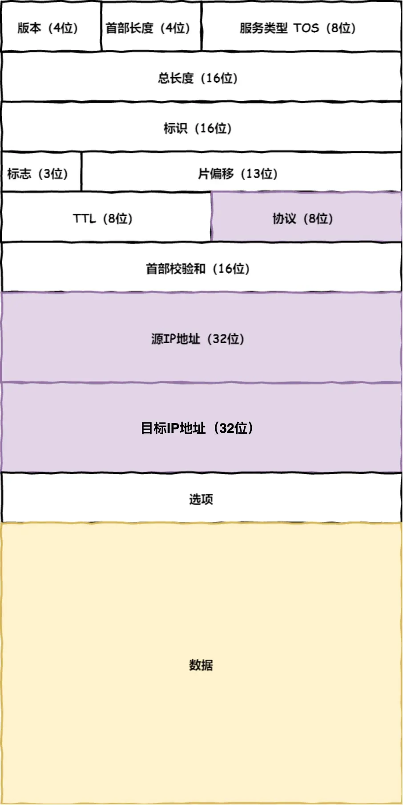
上图是IP报文的格式，IP协议里面需要有源地址IP和目标地址IP
- 源地址IP，客户端输出的IP地址
- 目标地址IP，通过DNS域名解析得到的Web服务器IP
因为Http是经过TCP传输的，所以在IP包头的协议号里，要填写为06（十六进制），标识协议为TCP
当客户端存在多个网卡时，在填写源地址IP时，就需要判断到底该填写哪个地址。这个判断相当于在多块网卡中判断应该使用哪一块网卡来发送包
根据路由表规则，来判断哪个网卡作为源地址IP
Linux中，，可以使用route -n 命令来查看当前系统的路由表
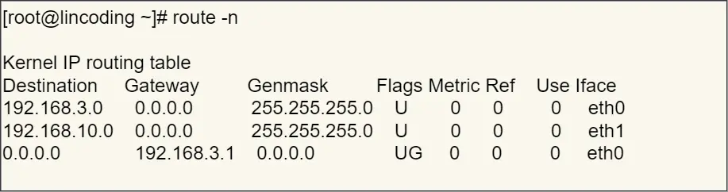
举个例子，假设Web服务器的目标地址是192.168.10.200
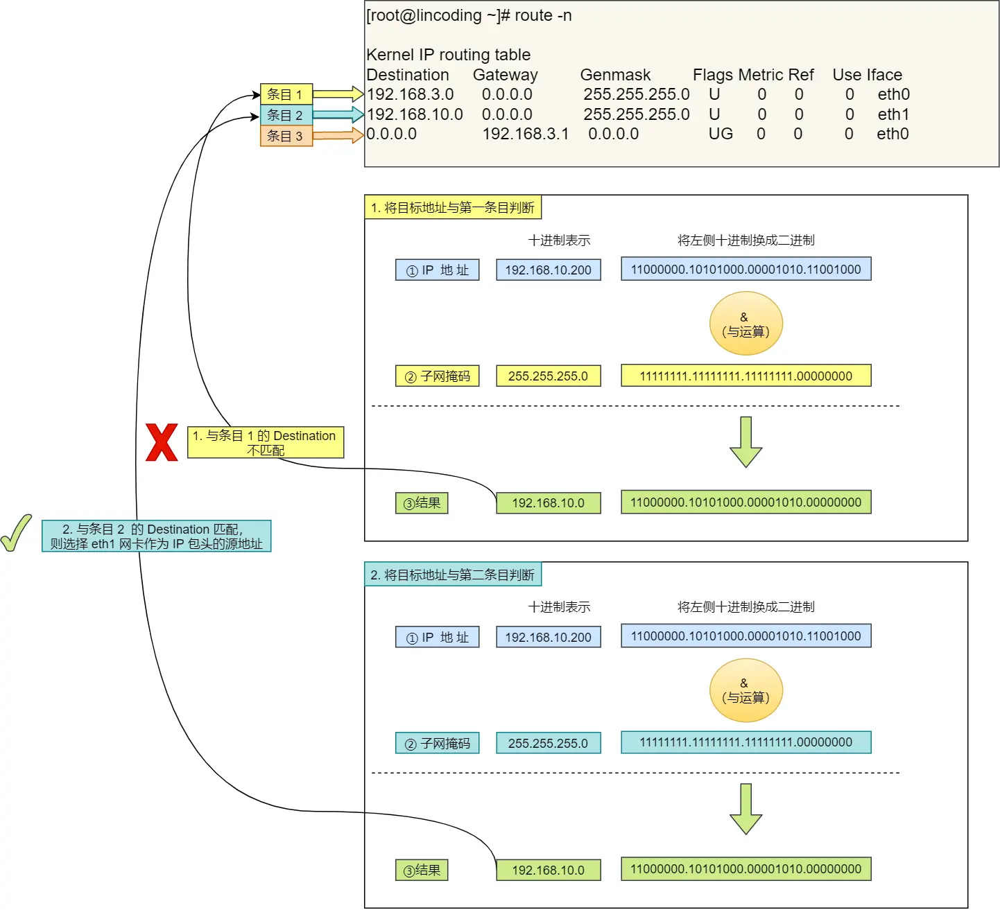
- 首先和第一条目的子网掩码进行位与运算，得到结果为192.168.10.0，但是第一个条目的Destination是192.168.3.0，两者不一致所以匹配失败
- 再和第二条目的子网掩码进行位与运算，得到结果为192.168.10.0，与第二条目的Destination 192.168.10.0匹配成功，所以将使用eth1网卡的IP地址作为IP包头的源地址
假设Web服务器的目标地址是10.100.20.100，依照上面的路由表，发现和第三条目匹配
第三条目比较特殊，它的目标地址和子网掩码都是0.0.0.0，表示默认网关，如果其他所有条目都无法匹配，就会自动匹配这一行，后续就把包发给路由器，Gateway就是路由器的IP地址
### 两点传输-MAC
生成了IP头部后，网络包还需要在IP头部前加上MAC头部
MAC头部是以太网使用的头部，包含了接收方和发送方的MAC地址等信息
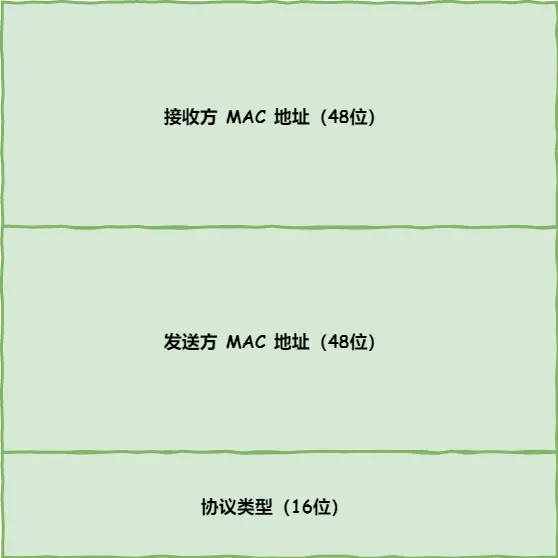
MAC包头里需要发送方MAC地址和接收方目标MAC地址，用于两点之间的传输
TCP/IP通信里，MAC包头协议类型只使用：
- 0800：IP协议
- 0806：ARP协议
发送方的MAC地址获取比较简单，MAC地址是在网卡生产时写入到ROM里的，只需要将这个值读出来写入到MAC头部就可以了
接收方的MAC地址就比较复杂，只需要告诉以太网对方的MAC地址，以太网就会把包发送过去，但是如果要知道该把包发送给谁，就需要在路由表中找到相匹配的条目，然后把包发送给Gateway列中的IP地址就可以了
如果不知道对方的MAC地址，此时就需要ARP协议帮忙找到路由器的MAC地址
ARP协议会在以太网中广播的形式，对以太网中所有的设备询问IP地址是谁的，并返回MAC地址，然后就会有设备回答，IP地址对应的MAC地址
如果对方和自己处于一个子网中，通过上面的操作就可以得到对方的MAC地址，然后将这个MAC地址写入MAC头部，MAC头部就完成了
在后续操作系统中，会把本次的查询结果放到一块叫做**ARP缓存**的内存空间中留存，留着之后使用，不过这个缓存的时间就只由几分钟
在发包时
- 先查询ARP缓存，如果其中已经保存了对方的MAC地址，就不需要发送ARP查询，而是直接使用ARP缓存中的地址
- 当ARP缓存中不存在对方的MAC地址时，就发送ARP广播查询
在Linux系统中，我们可以使用`arp -a`来查询ARP缓存中的内容
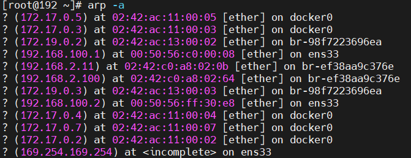
### 出口-网卡
网络包只是存放在内存中的一串二进制数字信息，没有办法直接发送给对方。因此，我们需要将数字信息转换为电信号，才能在网线上传输，这才是真正的数据发送过程
而负责执行这一操作的是网卡，要控制网卡，还需要靠网卡驱动程序
网卡驱动获取网络包之后，就会将其复制到网卡内的缓存区中，接着会在其开头加上包头和起始帧分界符，在末尾加上用于检测错误的帧校验序列
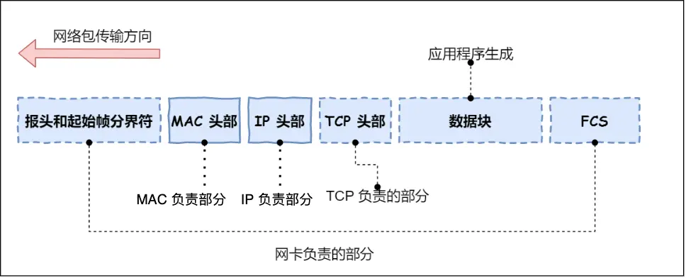
- 起始帧分界符是一个用来标识包起始位置的标记
- 末尾的FCS用来检查包传输过程是否有损坏
### 交换机
交换机的设计，是将网络包原样转发到目的地。交换机工作在MAC层，也称为二层网络设备
首先，电信号到达网线接口，交换机里的模块进行接收，接下来交换机里的模块将电信号转换为数字信号
然后通过包末尾的FCS校验错误，如果没有问题则放到缓冲区，这部分操作基本和计算机的网卡相同
计算机的网卡本身具有MAC地址，并通过核对收到的包的接收方MAC地址判断是不是发给自己的，如果不是发给自己的则丢弃；相对地，交换机的端口不核对接收方MAC地址，而是直接接收所有的包并存放到缓冲区中。因此，和网卡不同，交换机的端口不具有MAC地址
将包存入缓冲区后，接下来就需要查询一下报的接收方MAC地址是否已经在MAC地址表中有记录了
交换机的MAC地址表主要包含两个信息
- 一个是设备的MAC地址
- 另一个是该设备连接在交换机的哪个端口上
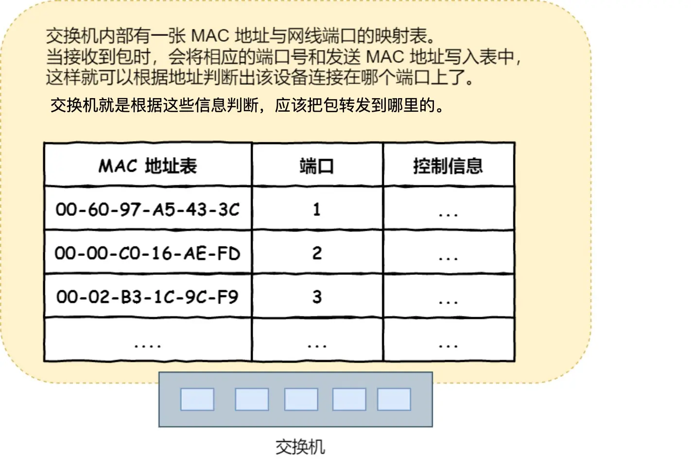
交换机根据MAC地址表查找MAC地址，然后将信号发送到相应端口
如果地址表中找不到指定的MAC地址，可能是因为具有该地址的设备还没有向交换机发送过包，或者这个设备一段时间内没有工作，导致地址被删除了
这种情况下，交换机只能将包转发到除了源端口外的所有端口上，看哪个端口能接收这个包，当有设备接受了这个包后，目标设备就会作出响应，返回响应包后，交换机就可以将地址写入MAC地址表
如果接收方的MAC地址是一个广播地址，那么交换机会将包发送到除源端口外的所有端口
以下两个地址属于广播地址
- MAC地址中的`FF:FF:FF:FF:FF:FF`
- IP地址中的`255.255.255.255`
### 路由器
网络包经过交换机之后，到达了路由器，并在此被转发到下一个路由器或目标设备
转发的工作原理和交换机类似，也是通过查表判断包转发到目标
具体操作过程上，路由器和交换机是有区别的
- 因为路由器是基于IP设计的，俗称三层网络设备，路由器的各个端口都具有MAC地址和IP地址
- 而交换机是基于以太网设计的，俗称二层网络设备，交换机的端口不具有MAC地址
路由器的端口具有MAC地址，因此它就能够称为以太网的发送方和接收方；同时还具有IP地址，从这个意义上来说，它和计算机网卡是一样的
当转发包时，首先路由器端口会接收发给自己的以太网包，然后路由表查询转发目标，再由相应的端口作为发送方将以太网包发送出去
**转发包**
首先，电信号到达网线接口部分，路由器中的模块会将电信号转换成数字信号，然后通过包末尾的FCS进行错误校验
如果没问题则检查MAC头部中的接收方MAC地址，看看是不是发给自己的包，如果是就放到接受缓冲区，否则就丢弃这个包
总的来说，路由器的端口都具有MAC地址，只接收与自身地址匹配的包，遇到不匹配的包则直接丢弃
完成包接收操作之后，路由器就会去掉包开头的MAC头部
MAC头部的左右就是将包送达路由器，其中接收方的MAC地址就是路由器端口的MAC地址。因此，当包到达路由器之后，MAC头部的任务就完成了，于是MAC头部就会被丢弃
接下来，路由器会根据MAC头部后方的IP头部中的内容进行包转发的操作
首先是查询路由表判断包转发目标
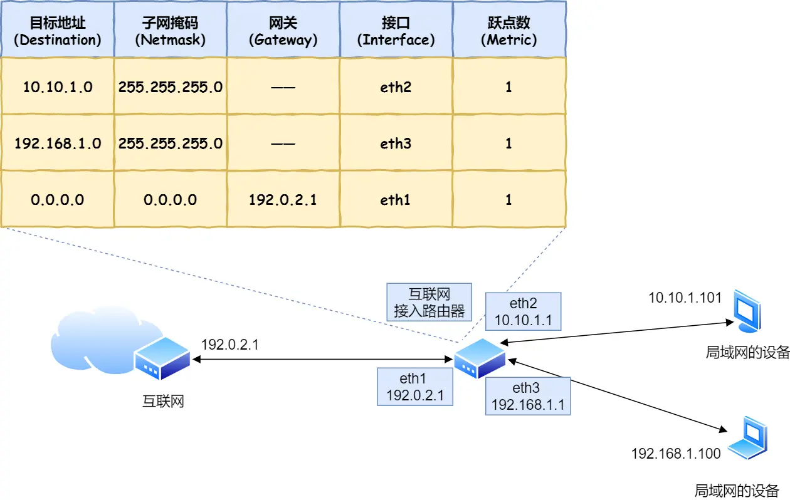
假设地址为`10.10.1.101`的计算机要向地址为`192.168.1.100`的服务器发送一个包，这个包到达图中的路由器
判断转发目标的第一步，就是根据包的接收方IP地址查询路由表中的目标地址栏，找到相匹配的记录
路由匹配和前面讲的一样，每个条目的子网掩码和`192.168.1.100`IP做位与运算后，得到的结果与对应条目的目标地址进行匹配，如果匹配就会作为候选转发目标，如果不匹配就继续与下个条目进行路由匹配
是在找不到匹配路由时，就会选择默认路由，路由表中子网掩码为`0.0.0.0`的记录标识默认路由
**发送包**
接下来进入包的发送操作
首先根据路由表的网关列判断对方地址
- 如果网关是一个IP地址，则这个IP地址就是我们要转发到的目标地址，还未抵达终点，还需继续用路由器转发
- 如果网关为空，则IP头部中的接收方IP地址就是要转发到的目标地址，也是找到IP包头里的目标地址了，说明已抵达终点
知道对方的IP地址之后，接下来需要通过ARP协议根据IP地址查询到MAC地址，并将查询结果作为接收方MAC地址
路由器也有ARP缓存，因此会先从ARP缓存中查询，如果实在找不到，则发送ARP查询请求
接下来是发送方MAC地址字段，这里填写输出端口的MAC地址。还有一个一台类型字段，填写`0800`（十六进制），表示IP协议
网络包完成后，接下来会将其转换成点型号并通过端口发送出去
发送出去的网络包会通过交换机到达下一个路由器。由于接收方MAC地址就是下一个路由器的接收地址，所以交换机会根据这一地址将包传输到下一个路由器
接下来，下一个路由器会将包再转发给下一个路由器，经过层层转发后，网络包就到达了最终的目的地
网络包传输的过程中，源IP和目标IP始终都不会变，一直变化的是MAC地址，因为MAC地址在以太网内进行两个设备之间的包传输
### 服务器与客户端
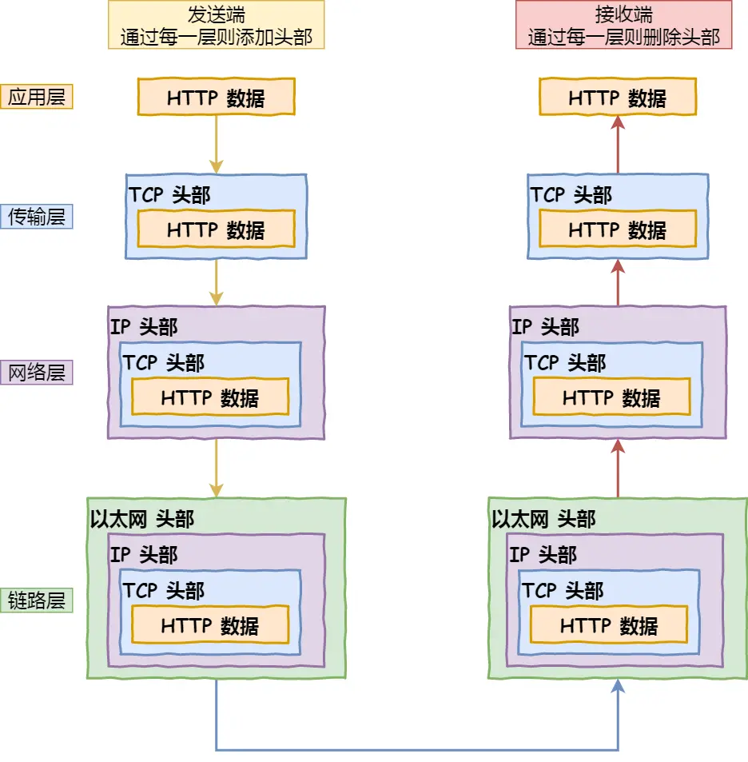
数据包抵达服务器后，服务器会先扒开数据包的MAC头部，查看是否和服务器自己的MAC地址符合，符合就把包收起来
接着继续扒开数据包的IP头部，发现IP地址符合，根据IP头中的协议项，知道自己上层是TCP协议
于是扒开TCP的头，里面有序列号，需要看一看这个序列包是不是我想要的，如果是就放入缓存中，然后返回一个ACK，如果不是就丢弃。TCP头部里面还有端口号，Http服务器正在监听这个端口号
于是，服务器就知道是Http进程想要这个包，于是就将包发给Http进程
服务器的进程看到，原来这个请求是要访问一个页面，于是就把这个网页封装在Http响应报文里
Http响应报文也需要穿上TCP、IP、MAC头部，不过这次是源地址是服务器IP地址，目的地是客户端IP地址
穿好头部衣服后，从网卡出去，交由交换机转发到路由器，路由器把相应数据包发给下一个路由器
最终转发到客户端的路由器，之后的过程与服务器接收请求一样
最后，客户端离开，向服务器发起TCP四次挥手，至此双方连接断开
**TCP四次挥手**
- 客户端发送一个FIN报文段，并制定一个序列号，告诉服务器数据发送完了，已经没有数据要发送了，但是还可以接收数据。客户端进入`FIN_WAIT_1（终止等待1）`状态
- 服务器接收到FIN后，发送一个ACK报文段，告诉客户端，收到了关闭请求，此时连接处于半关闭转告，客户端到服务端方向的通道关闭了，但服务器到客户端方向的通道还开着，如果服务器还有数据没传完，会继续发送。服务器进入`CLOSE_WAIT（关闭等待）`状态，客户端收到ACK后，进入`FIN_WAIT_2（终止等待2）`状态
- 服务器处理完剩余数据后，发送一个FIN报文段给客户端，告诉客户端，自己的数据也已经发完了，准备关闭连接。服务器进入`LAST_ACK（最后确认）`状态
- 客户端收到FIN后，发送一个ACK报文段作为应答，告诉服务器，已经知道你关闭了，确认一下。客户端发送ACK后，进入`TIME_WAIT（时间等待）`状态，服务端收到ACK后，立即关闭连接，进入`CLOSED`状态
## Linux收发网络包
国际保准话组织制定了开放式系统互联通信参考模型，即OSI模型，该模型主要有七层
- 应用层，负责给应用程序提供统一的接口
- 表示层，负责把数据转换成兼容另一个系统能识别的格式
- 会话层，负责建立、管理和终止表示层实体之间的通信会话
- 传输层，负责端到端的数据传输
- 网络层，负责数据的路由、转发、分片
- 数据链路层，负责数据的封帧和差错检测，以及MAC寻址
- 物理层，负责在物理网络中传输数据帧
但是OSI模型太过复杂，也没有提供具体的实现方案
因此比较常见，也比较实用的是四层模型，即TCP/IP网络模型，Linux系统就是按照这套网络模型来实现网络协议栈的
TCP/IP网络模型共有四层
- 应用层，负责向用户提供一组应用程序，比如HTTP、DNS、FTP等
- 传输层，负责端到端的通信，比如TCP、UDP等
- 网络层，负责网络包的封装、分片、路由、转发，比如IP、ICMP等
- 网络接口层，负责网络包在物理网络中的传输，比如网络包的封帧、MAC寻址、差错检测，以及通过网卡传输网络帧等
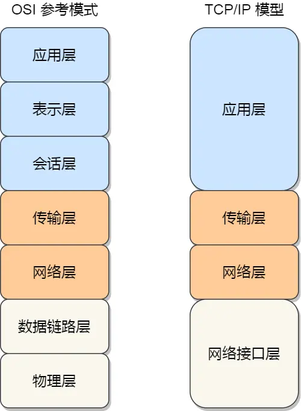
TCP/IP模型相比OSI网络模型要简化不少，它们之间的关系如上图所示
### Linux网络协议栈
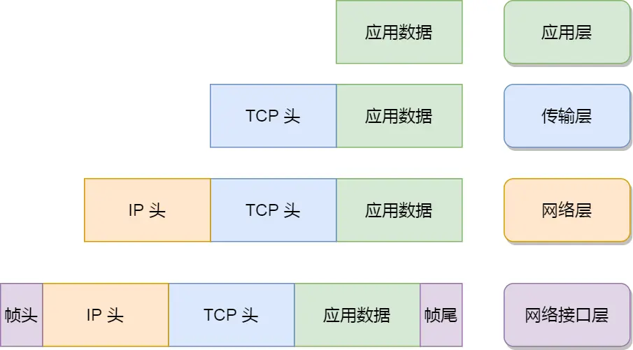
上图是应用层数据在每一层的封装格式，其中
- 传输层，给应用数据前加上了TCP头
- 网络层，给TCP数据包前加上了IP头
- 网络接口层，给IP数据包前后分别增加了帧头和帧尾
每个新增的头部和尾部，都有其作用，也都是按照特定的协议格式填充，每一层都增加了各自的协议头，网络包的大小自然就增大了，但物理链路并不能传输任意大小的数据包，所以在以太网中，规定了最大传输单元（MTU）是1500字节，也就是规定了单次传输的最大IP包大小
当网络包超过MTU的大小，就会在网络层分片，以确保分片后的IP包不会超过MTU大小，如果MTU越小，需要的分包就越多，那么网络吞吐能力就越差，相反，如果MTU越大，需要的分包就越少，网络吞吐能力就越好
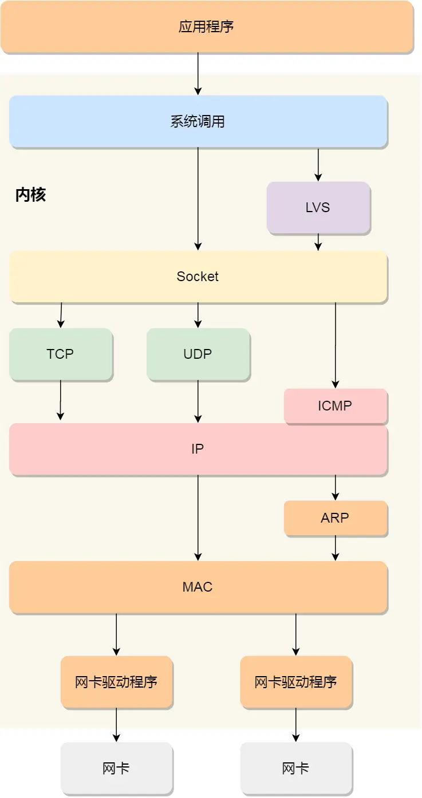
上图是Linux网络协议栈的样子，也是类似于TCP/IP的四层结构
其中
- 应用程序需要通过系统调用，来跟Socket层进行数据交互
- Socket层下面就是传输层、网络层和网络接口层
- 最下面一层，就是网卡驱动程序和硬件网卡设备
### Linux接收网络包的流程
网卡是专门负责接收和发送网络包的，当网卡接收到一个网络包后，通过DMA技术，将网络包写入到指定的内存地址，也就是写入到Ring Buffer，这是一个环形缓冲区，接着就会告诉操作系统网络包已经到达
#### 如何告诉操作系统网络包已经到达
最简单的一种就是触发中断，每当网卡收到一个网络包，就触发一个中断告诉操作系统
但是，在高性能网络场景下，网络包的数量会非常多，那么就会触发很多的中断。当CPU收到了中断，就会停下手里的事情，去处理这些网络包，处理完毕才会继续其他事情，那么频繁地触发中断，就会导致CPU一直在处理中断，导致其他任务无法继续进行。从而影响整体效率
Linux内核在2.6版本引入了NAPI机制，它是混合中断和轮询的方式来接收网络包，核心概念就是不采用中断的方式读取数据，而是首先采用中断唤醒数据接收的服务程序，然后poll的方法来轮询数据
因此，当有网络包到达时，会通过DMA技术，将网络包写入到指定的内存地址，接着网卡向CPU发起硬件中断，当CPU收到了硬件中断请求后，根据中断表，调用已经注册的中断处理函数
中断处理函数会做以下事情
- 需要先暂时屏蔽中断，表示已经知道内存中有数据了，告诉网卡下次再收到数据包直接写内存里就可以了，不用再通知CPU了，这样可以提高效率，避免CPU不停被中断
- 接着发起软中断，然后恢复刚才屏蔽的中断
**软中断**
内核中的ksoftirqd线程专门负责软中断的处理，当ksoftirqd内核线程收到软中断后，就会来轮询处理数据
ksoftirqd线程会从Ring Buffer中获取一个数据帧，用sk_buff表示，从而可以作为一个网络包交给网络协议栈进行逐层处理
**网络协议栈**
首先，会进入到网络接口，在这一层会检查报文的合法性，如果不合法则丢弃，合法则会找出该网络包的上层协议类型，比如是IPv4还是IPv6，接着再去掉帧头和帧尾，然后交给网络层
到了网络层，取出IP包，判断网络包下一步的走向，比如是交给上层处理还是转发出去。当确认这个网络包要发送给本机后，就会从IP头里看看上一层协议的类型是TCP还是UDP，接着去掉IP头，然后交给传输层
传输层取出TCP头或UDP头，根据四元组`源IP，源端口，目的IP，目的端口`作为标识，找出对应的socket，并把数据放到socket的接收缓冲区
最后，应用层程序调用socket接口，将内核的socket接收缓冲区的数据拷贝到应用层的缓冲区，然后唤醒用户进程
至此，网络包的接收流程就已经结束了
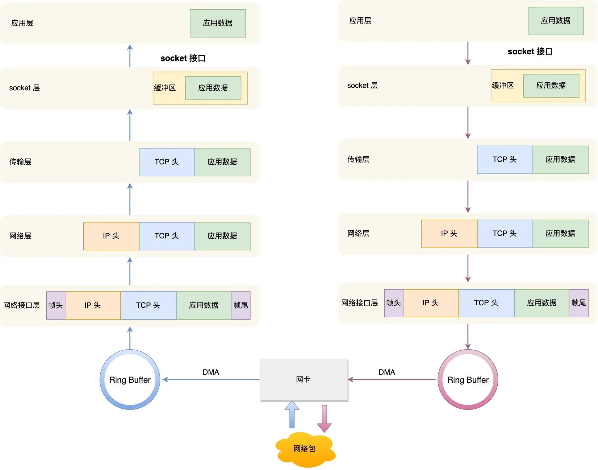
#### Linux发送网络包的流程
如上图右半部分，发送网络包的流程和接收网络包流程正好相反
首先，应用程序会调用socket发送数据包的接口，由于是系统调用，所以会从用户态陷入到内核态中的socket层，内核会申请一个内核态的sk_buff内存，将用户待发送的数据拷贝到sk_buff内存，并将其加入到发送缓冲区
接下来，网络协议栈从socket发送缓冲区取出sk_buff，并按照TCP/IP协议栈从上到下逐层处理
如果使用的是TCP传输协议发送数据，会先拷贝一个新的sk_buff副本，这是因为sk_buff后续再调用网络层，最后到达网卡发送完成的时候，这个sk_buff会被释放掉。而TCP协议是支持丢失重传的，在接收到对方的ACK之前，这个sk_buff都不能被删除。所以内核的做法就是每次调用网卡发送的时候，实际上传递出去的是sk_buff的一个拷贝，等收到ACK再真正删除
接着，对sk_buff填充TCP头。
sk_buff可以表示各个层的数据包，在应用层数据包叫data，在TCP层叫做segment，在IP层叫做packet，在数据链路层叫做frame
**为什么全部数据包都使用一个结构体来描述？**
协议栈采用的是分层结构，上层向下层传递数据时需要增加包头，下层向上层传递数据时又需要去掉包头，如果每一层都用一个结构体，那在层之间传递数据时，就需要发生多次拷贝，这将大大降低CPU效率
在层级之间传递数据时，不发生拷贝，只用sk_buff一个结构体来描述所有的网络包，那它是如何做到的？是通过调整sk_buff中的data的指针
- 当接收报文时，从网卡驱动开始，通过协议栈层层往上层传输数据包，通过增加sk->data的值，来逐步剥离协议首部
- 当发送报文时，创建sk_buff结构体，数据缓存区的头部预留足够的空间，用来填充各层首部，在经过各下层协议时，通过减少sk->data的值来增加协议首部
至此，传输层的工作完成了
然后交给网络层，在网络层里，会做这些工作：选取路由（确认下一跳的IP）、填充IP头、netfilter过滤、对超过MTU大小的数据包进行分片。处理完这些工作后就会交给网络接口层处理
网络接口层会通过ARP协议获得下一跳的MAC地址，然后对sk_buff填充帧头和帧尾，接着将sk_buff放到网卡的发送队列中
这一些工作准备好后，会触发软中断告诉网卡驱动程序，这里有新的网络包需要发送，驱动程序会从发送队列中读取sk_buff，将这个sk_buff挂到Ring Buffer中，接着将sk_buff数据映射到网卡可访问的内存DMA区域，最后触发真实的发送
数据发送完后，还需要清理内存。当发送完成的时候，网卡设备会触发一个硬中断来释放内存，是要是释放sk_buff内存和清理Ring Buffer内存
最后，当收到TCP报文的ACK应答时，传输层就会释放原始的sk_buff
## HTTP
HTTP是超文本传输协议，即`HyperText Transfer Protocol`
HTTP是一个用在计算机世界里的协议。它使用计算机能够理解的语言确立了一种计算机之间交流痛心的规范，以及相关的各种控制和错误处理方式
HTTP协议是一个双向协议。浏览器把请求数据发给网站，网站再把一些数据返回给浏览器，最终由浏览器渲染在屏幕上，我们就可以看到相应的图片和视频了。数据在传输之间，允许有中转或接力，只要这个中转或接力也遵循HTTP协议即可。
HTTP传输的内容是超文本。超文本是文字、图片、视频等的混合体，最关键的是由超链接，能从一个超文本跳到另外一个超文本。HTML就是最常见的超文本，它本身只是纯文字文件，但是内部很多标签定义了图片、视频等的链接，再经过浏览器的解释，呈现给我们的就是一个有文字、有画面的网页了
**HTTP是一个在计算机世界里面专门在两点之间传输文字、图片、音频、视频等超文本数据的约定和规范**
HTTP不仅是服务器与本地浏览器之间的传输，也可以是服务器与服务器之间的传输
### HTTP状态码
HTTP有五大类常见的状态码
- `1xx`类状态码属于提示信息，是协议处理中的一种中间状态，实际用到的比较少
- `2xx`类状态码表示服务器成功处理了客户端的请求
	`200 OK`是最常见的成功状态码，表示一切正常。如果是非`HEAD`请求，服务器返回的响应头都会有body数据
	`204 No Content`也是常见的状态码，与200 OK基本相同，但是响应头没有body数据
	`206 Partial Content`是应用于HTTP分块下载或断点续传，表示响应返回的body数据并不是资源的全部，而是其中的一部分，也是服务器处理成功的状态
- `3xx`类状态码表示客户端请求的资源发生了变动，需要客户端用新的URL重新发送请求获取资源，也就是重定向
	`301 Moved Permanently`表示永久重定向，说明请求的资源已经不存在了，需要改用新的URL再次访问
	`302 Found`表示临时重定向，说明请求资源还在，但是暂时需要用另一个URL来访问
	301和302都会在响应头里使用字段Location，指明后续要跳转的URL，浏览器会自动重定向新的URL
	`304 Not Modified`不具有跳转的含义，表示资源未修改，重定向已存在的缓冲文件，也称为缓存重定向，也就是告诉客户端可以继续使用缓存资源，用于缓存控制
- `4xx`类状态码表示客户端发送的报文有误，服务器无法处理，也是错误码的含义
	`400 Bad Request`表示客户端请求的报文有错误，是一个笼统的错误
	`403 Forbidden`表示服务器进制访问资源，并不是客户端的请求出错
	`404 Not Found`表示请求的资源在服务器上不存在或未找到，所以无法提供给客户端
- `5xx`类状态码表示客户端请求报文正确，但是服务器处理时内部发生了错误，属于服务端的错误码
	`500 Internal Server Error`与400类型，是笼统通用的错误码，服务器发生了什么错误，并不知道
	`501 Not Implemented`表示客户端请求的功能还不支持，类似"即将开业，敬请期待"的意思
	`502 Bad Gateway`通常是服务器作为网关或代理是返回的错误码，表示服务器自身工作正常，访问后端服务器发生了错误
	`503 Service Unavailable`表示服务器当前很忙，暂时无法响应客户端，类似“网络服务正忙，请稍微重试”的意思
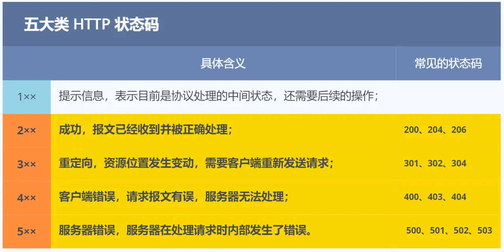
### HTTP常见字段
- Host字段：客户端发送请求时，用来指定服务器的域名，有了Host字段，就可以将请求发往同一台服务器上的不同网站
- Content-Length字段：服务器在返回数据时，会有`Content-Length`字段，表明本次回应的数据长度，后面的字节就属于下一个回应了
	HTTP是基于TCP传输协议进行通信的，而使用了TCP传输协议，就会存在粘包问题，HTTP协议通过设置回车符、换行符作为HTTP header的边界，通过Content-Length字段作为HTTP body的边界，这两个方式都是为了解决粘包问题
- Connection字段：Connection字段最常用于客户端要求服务端使用HTTP长连接机制，以便其他请求服用。HTTP长连接的特点是，只要有任意一端没有明确提出断开连接，则保持TCP连接状态
	HTTP/1.1版本默认连接都是长连接，但是为了兼容老版本的HTTP，需要指定Connection首部字段值为Keep-Alive
	开启了HTTP Keep-Alive机制后，连接就不会中断，而是保持连接。当客户端发送另一个请求时，会使用同一个连接，直到客户端或服务端提出断开连接
- Content-Type字段：Content-Type字段用于服务器回应时，告诉客户端，本次数据是什么格式
	`Content-Type:text/html;Charset=utf-8`类型表示发送的是网页，且编码是UTF-8
	客户端那请求时，可以使用Accept字段声明自己可以接受哪些数据格式
	`Accept:*/*`表示可以接受任何格式的数据
- Content-Encoding字段：Content-Encoding字段说明数据的压缩方法。表示服务器返回的数据使用了什么压缩格式
	`Content-Encoding:gzip`表示服务器返回的数据采用了gzip方式压缩，告知客户端要用此方式解压
	`Accept-Encoding:gzip,deflate`字段可以说明自己接受哪些压缩方式
### GET和POST
根据RFC规范，GET的语义是从服务器获取指定的资源，这个资源可以是静态的文本、页面、图片视频等。GET请求的参数位置一般是写在URL中，URL规定只能支持ASCII，所以GET请求的参数只允许ASCII字符，而且浏览器会对URL的长度有限制
根据RFC规范，POST的语义是根据请求负荷（报文body，即请求体）对指定的资源作出处理，具体的处理方式视资源类型而不同。POST请求携带数据的位置一般是在报文body中，body中的数据可以使任意格式的数据，只要客户端与服务端协商好即可，浏览器不会对body大小做出限制
#### 安全幂等
- HTTP协议里，所谓的安全指的是请求方法不会破坏服务器上的资源
- 所谓幂等，指的是多次执行相同的操作，结果都是相同的
从RFC规范定义的语义来看
- GET方法是安全且幂等的，因为它是只读操作，无论操作多少次，服务器上的数据都是安全的，且每次得到的结果都相同。所以，可以对GET请求的数据做缓存，这个缓存可以做到浏览器本身（彻底避免浏览器发请求），也可也做到代理上（如nginx），而且在浏览器中，GET请求可以保存为书签
- POST因为是新增或提交数据的操作，会修改服务器上的资源，所以是不安全的，且多次提交就会创建多个资源，所以不是幂等的。所以，浏览器上一般不会缓存POST请求，也不能把POST请求保存为书签
### HTTP缓存
对于一些有重复性的HTTP请求，比如每次请求得到的数据都一样，就可以把这对请求-响应的数据都缓存在本地，那么下次就能直接读取本地的数据，不必通过网络获取服务器的响应了
所以，避免发送HTTP请求的方法，就是通过缓存技术，HTTP缓存有两种实现方式，分别是强制缓存和协商缓存
#### 强制缓存
强制缓存指的是只要浏览器判断缓存没有过期，则直接使用浏览器的本地缓存，决定是否使用缓存的主动性在浏览器这边
如下图中，返回的是200状态码，但在size项中的标识是from disk cache，就是使用了强制缓存
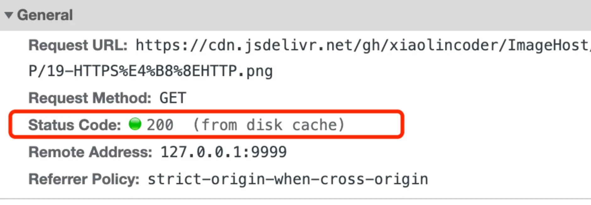
强制缓存是使用下面两个HTTP响应头字段实现的，它们都用来表示资源在客户端缓存的有效期
- Cache-Control，是一个相对时间
- Expires，是一个绝对时间
如果HTTP响应头同时具有上面两个字段的话，Cache-Control的优先级高于Expires
Cache-Control选项更多一些，设置更加精细，所以建议使用Cache-Control来实现强制缓存，下面是具体实现流程
- 当浏览器第一次请求访问服务器资源时，服务器会在返回这个资源的同时，在Response头部加上Cache-Control，，Cache-Control中设置了过期时间大小
- 浏览器再次请求访问服务器中的该资源时，会先通过请求资源的时间与Cache-Control中设置的过期时间大小，来计算出该资源是否过期，如果没有，则使用该缓存，否则会重新请求服务器
- 服务器再次收到请求后，会再次更新响应头部的Cache-Control
#### 协商缓存
某些请求的响应码是304，这是告诉浏览器可以使用本地缓存的资源，这种通过服务端告知客户端是否可以使用缓存的方式被称为协商缓存
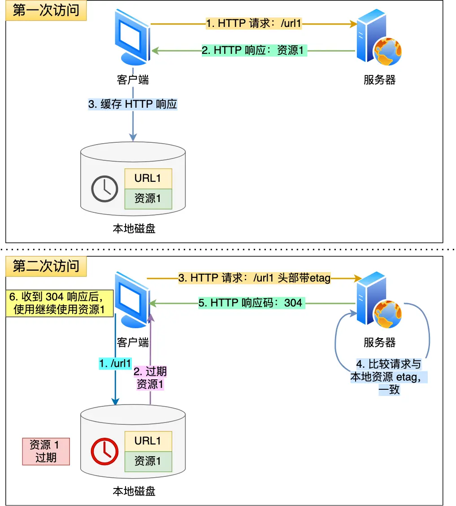
上图就是协商缓存的过程，**协商缓存就是与服务端协商后，通过协商结果来判断是否使用本地缓存**
协商缓存可以基于两种头部来实现
- 请求头中的`If-Modified-Since`字段和响应头部中的`Last-Modified`字段实现。`Last-Modified`字段标示这个响应资源的最后修改时间。`If-Modified-Since`字段，当资源过期了，发现响应头中具有`Last-Modified`声明，则再次发起请求的时候带上Last-Modified的时间，服务器收到请求后发现有If-Modified-Since则与被请求资源的最后修改时间进行对比，如果最后修改时间较新，说明资源又被改过，则返回最新资源，HTTP 200 OK；如果最后修改时间较旧，说明资源无新修改，响应HTTP 304走缓存
- 请求头中的`If-None-Match`字段与响应头中的`ETag`字段。`ETag`字段是唯一标识相应资源。`If-None-Match`字段，当资源过期时，浏览器发现响应头里有ETag，则再次向服务器发起请求，会将请求头If-None-Match值设置为ETag的值。服务器收到请求后进行对比，如果资源没有变化返回304，如果资源变化了返回200
第一种实现方式是基于时间实现的，第二种实现方式是基于唯一标识实现的，相对来说后者可以更加准确地判断文件内容是否被修改，避免由于时间篡改导致的不可靠问题
如果在第一次请求资源的时候，服务端返回的HTTP响应头同时有ETag和Last-Modified字段，那么客户端下一次请求的时候，如果带上了ETag和Last-Modified字段信息给服务端，这时ETag的优先级更高，也就是服务端先会判断ETag是否变化了，如果ETag有变化就不用再判断Last-Modified了，如果ETag没有变化，就再看Last-Modified
**为什么ETag优先级更高**
- 在没有修改文件内容的情况下，文件的最后修改时间也可能会改变，这会导致客户端认为这些文件被改动了，从而重新请求
- 可能有些文件是在秒级以内改动的，`If-Modified-Since`能检查到的粒度是秒级的，使用ETag就能保证这种需求下，客户端在1s内能刷新多次
- 有些服务器不能精确获取文件的最后修改时间
**协商缓存这两个字段都需要配合强制缓存中的Cache-Control字段来使用，只有在未能命中强制缓存的时候，才能发起带有协商缓存字段的请求**
下面是使用ETag实现协商缓存的过程
- 当浏览器第一次请求访问服务器资源时，服务器会在返回这个资源的同时，在响应头加上ETag唯一标识，这个唯一标识的值是根据当前请求的资源生成的
- 当浏览器再次请求访问服务器中的该资源时，会先检查强制缓存是否过期。如果没有过期，会直接使用本地缓存；如果过期了，会在Request头部加上If-None-Match字段，该字段的值就是ETag的唯一标识
- 当服务器再次收到请求后，会根据请求中的If-None-Match值与当前请求的资源生成的唯一标识进行比较。如果值相等，则会返回304 Not Modified，不会返回资源；如果不相等，则会返回200状态码和返回资源，并在Response头部加上新的ETag唯一标识
- 如果浏览器收到304的请求响应状态码，则会从本地缓存中加载资源，否则更新资源
### HTTP特性
#### HTTP/1.1的优点
1. 简单，HTTP基本的报文格式就是`header+body`，头部信息也是`key-value`简单文本的形式，易于理解，降低了学习和使用的门槛
2. 灵活易扩展，HTTP协议里的各类请求方法，URI/URL、状态码、头字段等每个组成要求都没有被固定死，都允许开发人员自定义和扩充
	同时由于HTTP工作在应用层，则它的下层可以随意变化。比如，HTTPS就是在HTTP与TCP层之间加了SSL/TLS安全传输层
3. 应用广泛和跨平台，HTTP的应用非常广泛，从台式机的浏览器到手机上的APP，都是HTTP的应用。天然具有跨平台的优越性
#### HTTP/1.1的缺点
1. 无状态双刃剑，无状态的好处，因为服务器不会去记忆HTTP状态，所以不需要额外的资源来记录状态信息，这能减轻服务器的负担，就能把更多的CPU和内存用来对外提供服务
	无状态的坏处，既然服务器没有记忆能力，在完成有关联性的操作时会非常麻烦。例如登录->添加购物车->下单->结算->支付。这一系列的操作都需要知道用户的身份才行，但服务器不知道这些是有关联的，所以每次都要询问一遍身份信息。
2. 明文传输双刃剑，明文传输意味着在传输过程中，是可方便阅读的。比如使用Wireshark抓包都可以直接肉眼查看，为调试工作带来了很大的便利性
	但是明文传输的时候，信息很容易被窃取，如果里面包含了一些隐私信息，就很容易被别人抓包获取到
3. 不安全，比如通信使用明文，不验证通信方信息，无法证明报文的完整性
#### HTTP/1.1的性能
HTTP协议是基于TCP/IP的，并且使用了请求应答的通信模式，性能的关键就在两点里
1. 长连接，早期HTTP/1.0性能上有个很大的问题，就是每次发起一个请求，都要建立一次TCP连接，而且是串行请求，做了无谓的TCP连接建立和断开，增加了通信开销
	因此，HTTP/1.1提出了长连接的通信方式，减少了TCP连接的重复简历和断开造成的额外开销，减轻了服务器端的负载
	只要任意一点没有明确提出断开连接，则保持TCP连接状态
	当然，如果某个HTTP长连接超过一定时间内没有任何数据交互，服务端就会主动断开这个连接
2. 管道网络传输，HTTP/1.1采用了长连接的方式，这使管道网络传输成为了可能，即可在同一个TCP连接里面，客户端可以发起多个请求，只要第一个请求发出去了，不必等其回来，就可以发第二个请求出去，可以减少整体的响应时间
	服务器必须按照接受请求的顺序发送对这些管道化请求的响应
3. 队头阻塞，当顺序发送的请求序列中，某一个请求因为某种原因被阻塞时，在后面排队的所有请求也一同被阻塞，导致客户端一直请求不到数据，这就是队头阻塞
#### HTTP与HTTPS
**HTTP和HTTPS的区别**
- HTTP是超文本传输协议，信息是明文传输，存在安全风险的问题。HTTPS则解决了HTTP不安全的缺陷，在TCP和HTTP网络层之间加入了SSL/TLS安全协议，使得报文能够加密传输
- HTTP连接建立相对简单，TCP三次握手后便可以进行HTTP的报文传输。而HTTPS在TCP三次握手之后，还需要进行SSL/TLS的握手过程，才可以进入加密报文传输
- 两者默认端口不一样，HTTP默认端口80，HTTPS默认端口443
- HTTPS协议需要向CA（证书权威机构）申请数字证书，来保证服务器的身份是可信的
**HTTPS解决了哪些问题**
- 窃听风险，比如通信链路上可以获取通信内容
- 篡改风险，比如强制植入垃圾广告
- 冒充风险，比如冒充的盗版网站
HTTPS在HTTP和TCP层之间加了SSL/TLS协议，可以很好的解决上述问题

## 杂项
### 为什么TCP需要三次握手和四次挥手
- 三次握手，因为要防止失效的连接请求突然传送到服务端，同时确保双方都有收发数据的能力
- 四次挥手，因为TCP连接是全双工的，双方需要独立地关闭各自的数据通道
**为什么需要三次握手**
- **防止过时的连接请求干扰**：假设这么一个场景，客户端发送了一个连接请求报文SYN，但是网络拥挤导致它滞留在网络中，客户端超时没接收到确认，又重新发送了一个SYN并成功建立连接，传输数据后关闭；此时，滞留在网络中旧的SYN突然到达了服务端，如果只需要两次握手，服务端收到这个旧的SYN后，会认为客户端想建立新连接，于是发送ACK并分配资源，进入ESTABLISHED状态。但是实际上，客户端并没有向连接，导致服务端资源浪费，甚至可能被恶意利用进行SYN洪水攻击
	而三次握手，服务端收到旧的SYN后，会回复SYN+ACK，客户端收到后，发现这个确认好不是自己期望的，或者发现自己根本没在握手，就会发送RST（复位）包告诉服务端不用连接了，服务端收到了RST后就会释放资源，避免死等
- **确保双方收发能力正常**：**第一次握手（客户端->服务端）**，服务端可以知道客户端的发送能力正常，自己的接受能力正常；**第二次握手（服务端->客户端）**，客户端知道，服务端的接受和发送能力正常，自己的接收和发送能力也正常。此时客户端已经知道了自己能发能收，但是服务端还不知道。**第三次握手（客户端->服务端）**，服务端知道，客户端的接受能力正常，自己的发送能力正常。至此双方都确认了自己和对方没有问题
**为什么要四次挥手**
因为TCP是全双工的，每一方都需要一个FIN和一个ACK来关闭一个方向的数据通道
- **全双工独立关闭**：客户端发送FIN，只是表示客户端到服务端这个方向的通道关闭了，但是服务端到客户端这个方向的通道可能还是开着的，服务端可能还有数据要发
- **ACK和FIN的分离**：当服务端收到客户端的FIN时，它可能还在处理数据，不能马上发送通道。所以服务端会先回一个ACK，表示知道对方想关闭通道。等到服务端处理完所有数据后，才发送自己的FIN。因为ACK和FIN是不同时发送的，所以需要分离
**特殊情况下，服务端收到FIN，自己也没数据要发了，这是ACK和FIN才能合并发送，就是三次挥手。**
